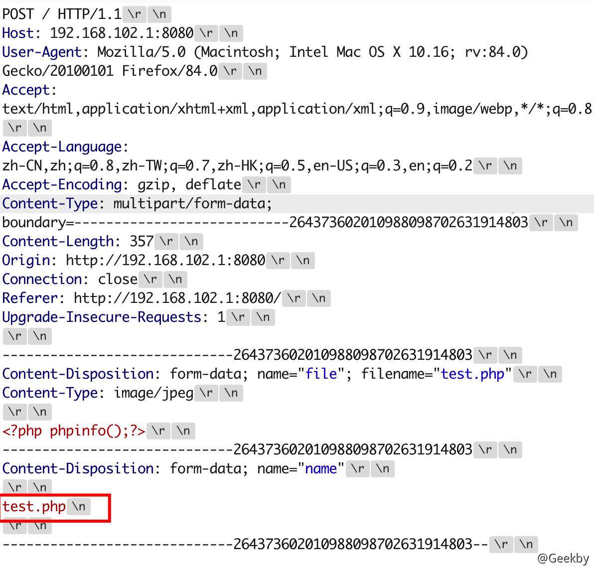
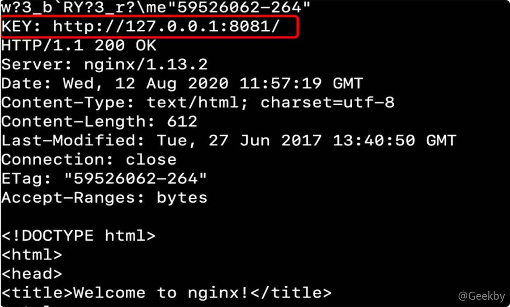
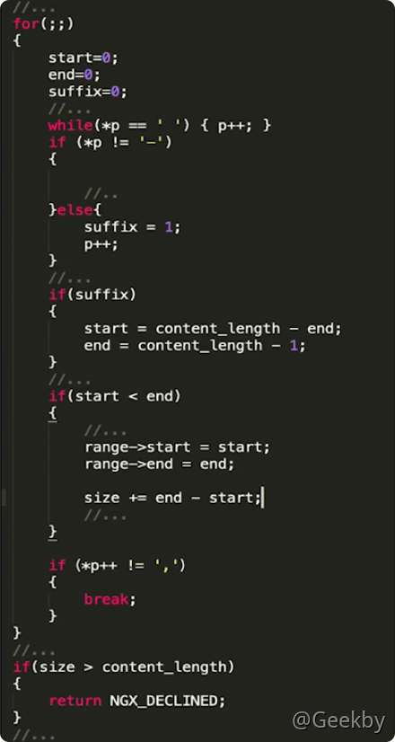
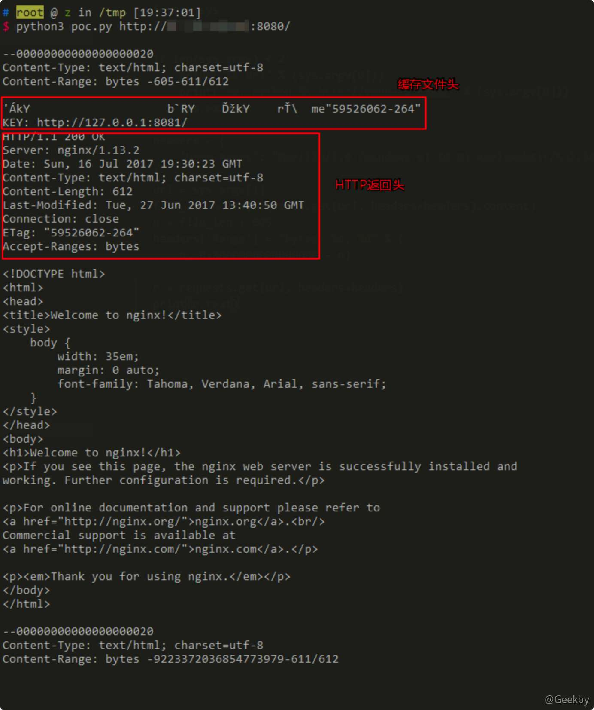
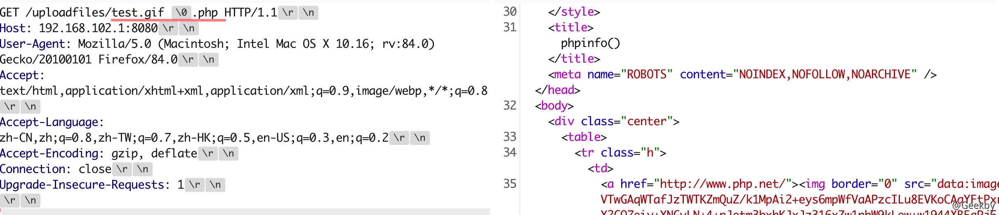

# [](#web-%E5%AE%B9%E5%99%A8%E5%AE%89%E5%85%A8)WEB 容器安全

## [](#1-%E5%AE%9A%E4%B9%89%E5%8F%8A%E5%8E%9F%E7%90%86)1 定义及原理

Web 服务器：提供 Web 服务器的软件或主机，即 Web 服务器软件或者装有 Web 服务器软件的计算机。

Web 中间件：提供系统软件与应用软件之间连接的软件，Web 中间件是提供 web 应用软件和系统软件连接的软件的总称。

Web 容器：容器是中间件的一种，它给处于其中的应用程序组件提供从一个环境，使应用程序直接与容器中的环境变量进行交互而不必关注其他的系统问题。Web 容器用于给处于其中的应用程序组件提供一个环境。


## [](#2-apache-%E5%AE%89%E5%85%A8)2 Apache 安全

### [](#21-apache-%E9%85%8D%E7%BD%AE%E9%94%99%E8%AF%AF)2.1 apache 配置错误

#### [](#211-%E5%8E%9F%E7%90%86)2.1.1 原理

`AddHandler application/x-httpd-php .php`

AddHandler 为相应的文件扩展名指定处理程序，上述的配置意味着将扩展名为 `.php` 的文件交给 x-httpd-php 程序处理

Apache 识别文件扩展名是从后往前的，如果遇到了无法识别的扩展名会接着往前识别，遇到第一个可以识别的扩展名作为该文件的扩展名

#### [](#212-%E9%85%8D%E7%BD%AE)2.1.2 配置

##### [](#2121-%E4%BF%AE%E6%94%B9-conf-%E6%96%87%E4%BB%B6)2.1.2.1 修改 conf 文件


##### [](#2122-%E5%88%9B%E5%BB%BA-htaccess)2.1.2.2 创建 .htaccess


#### [](#213-%E6%BC%8F%E6%B4%9E%E5%A4%8D%E7%8E%B0)2.1.3 漏洞复现

在有多个后缀的情况下，只要一个文件含有 `.php` 后缀的文件即将被识别成 PHP 文件，没必要是最后一个后缀。利用这个特性，将会造成一个可以绕过上传白名单的解析漏洞。

环境运行后，访问 `http://your-ip/uploadfiles/apache.php.jpeg` 即可发现，phpinfo 被执行了，该文件被解析为 php 脚本。

`http://your-ip/index.php` 中是一个白名单检查文件后缀的上传组件，上传完成后并未重命名。我们可以通过上传文件名为 xxx.php.jpg 或 xxx.php.jpeg 的文件，利用 Apache 解析漏洞进行 getshell。


### [](#22-apache-%E6%8D%A2%E8%A1%8C%E8%A7%A3%E6%9E%90%E6%BC%8F%E6%B4%9E)2.2 apache 换行解析漏洞

漏洞编号：CVE-2017-15715

影响版本：Apache 2.4.10 - 2.4.29

漏洞利用：文件上传

漏洞名称：换行解析漏洞

#### [](#221-%E5%8E%9F%E7%90%86)2.2.1 原理

其 2.4.0~2.4.29 版本中存在一个解析漏洞，在解析 PHP 时，1.php\\x0A 将被按照 PHP 后缀进行解析，导致绕过一些服务器的安全策略。


#### [](#222-%E6%BC%8F%E6%B4%9E%E5%A4%8D%E7%8E%B0)2.2.2 漏洞复现

|     |     |     |
| --- | --- | --- |
| ```plain<br>1<br>2<br>3<br>4<br>5<br>6<br>7<br>8<br>9<br>``` | ```php<br><?php<br>if(isset($_FILES['file'])) {<br>    $name = basename($_POST['name']);<br>    $ext = pathinfo($name, PATHINFO_EXTENSION);<br>    if(in_array($ext, ['php', 'php3', 'php4', 'php5', 'phtml', 'pht'])) {<br>        exit('bad file');<br>    }<br>    move_uploaded_file($_FILES['file']['tmp_name'], './' . $name);<br>}<br>``` |

在 1.php 后面插入一个 \\x0A（注意，不能是\\x0D\\x0A，只能是一个\\x0A），不再拦截：



访问刚才上传的 /1.php%0a，发现能够成功解析，但这个文件不是 php 后缀，说明目标存在解析漏洞：


## [](#3-nginx-%E5%AE%89%E5%85%A8)3 Nginx 安全

> nginx 是一个高性能的 HTTP 和反向代理 Web 服务器，同时也提供了 IMAP/POP3/SMTP 服务。

中国大陆使用 Nginx 网站用户有：百度、京东、新浪、网易、腾讯等。

Nginx 可以在大多数 Unix、 Linux 编译运行，也有 Windows 移植版。

### [](#31-nginx-%E9%85%8D%E7%BD%AE%E9%94%99%E8%AF%AF)3.1 nginx 配置错误

#### [](#311-crlf-%E6%B3%A8%E5%85%A5)3.1.1 CRLF 注入

CRLF：就是 CR 和 LF，分别表示回车和换行，CR 命令让打印头回到左边。LF 命令让纸前进一行。

在 HTTP 报文中，行与行之间使用 CRLF 间隔。

攻击者一旦向请求行或首部中的字段注入恶意的 CRLF，就能注入一些首部字段或报文主体，并在响应中输出，所以又称为 HTTP 响应分漏洞。

- - -

在 Nginx 中配置文件中，有三个可以接受 URL 的变量：

1.  $URI
    
2.  $DOCUMENT\_URI
    
3.  $REQUEST\_URI
    

其中：

$URI - 获取解码后的请求路径

$DOCUMENT\_URI - 获取解码后的请求路径

$REQUEST\_URI - 没有解码的完整的 URL

##### [](#3111-%E5%8E%9F%E7%90%86)3.1.1.1 原理

Nginx会将 `$uri` 进行解码，导致传入 `%0a%0d` 即可引入换行符，造成 CRLF 注入漏洞。

错误的配置文件示例（原本的目的是为了让 http 的请求跳转到 https 上）：

|     |     |     |
| --- | --- | --- |
| ```plain<br>1<br>2<br>3<br>``` | ```fallback<br>location / {<br>    return 302 https://$host$uri;<br>}<br>``` |

##### [](#3112-%E6%BC%8F%E6%B4%9E%E5%A4%8D%E7%8E%B0)3.1.1.2 漏洞复现

Payload： `http://your-ip:8080/%0a%0dSet-Cookie:%20a=1`，可注入 Set-Cookie 头。


#### [](#312-%E7%9B%AE%E5%BD%95%E7%A9%BF%E8%B6%8A%E6%BC%8F%E6%B4%9E)3.1.2 目录穿越漏洞

Nginx 在配置别名（Alias）的时候，如果忘记加 `/`，将造成一个目录穿越漏洞。

错误的配置文件示例（原本的目的是为了让用户访问到 /home/ 目录下的文件）：

|     |     |     |
| --- | --- | --- |
| ```plain<br>1<br>2<br>3<br>``` | ```fallback<br>location /files {<br>    alias /home/;<br>}<br>``` |

Payload:：`http://your-ip:8081/files../` ，成功穿越到根目录：


### [](#32-nginx-%E8%B6%8A%E7%95%8C%E8%AF%BB%E5%8F%96%E7%BC%93%E5%AD%98%E6%BC%8F%E6%B4%9E)3.2 Nginx 越界读取缓存漏洞

漏洞编号：CVE-2017-7529

影响版本：Nginx 0.5.6 - 1.13.2

漏洞危害：敏感信息泄露

#### [](#321-%E5%8E%9F%E7%90%86)3.2.1 原理

##### [](#3211-http-range)3.2.1.1 HTTP Range

HTTP 的 Range，允许客户端分批次请求资源的部分，如果服务端资源较大，可以通过 Range 来并发下载；如果访问资源时网络中断，可以断点续传

Range 设置在 HTTP 请求头中，它是多个 byte-range-spec(或 suffix-range-byte-spec)的集合

示例

Range：bytes=0-1024 表示访问第 0 到第 1024 字节

Range：bytes=500-600，601-999，-300 表示分三块访问，分别是 500 到 600 字节，601 到 600 字节，最后的 300 字节;


##### [](#3212-http-cache)3.2.1.2 HTTP-Cache

Nginx 可以作为缓存服务器，将 Web 应用服务器返回的内容缓存起来。如果客户端请求的内容已经被缓存，那么就可以直接将缓存内容返回，而无需再次请求应用服务器。由此，可降低应用服务器的负载并提高服务的响应性能。

Cache 文件内容：



##### [](#3213-%E5%8E%9F%E7%90%86%E5%88%86%E6%9E%90)3.2.1.3 原理分析

Nginx 对 Range 的支持包括 header 处理和 body 处理，分别用来解析客户端发送过来的 Range header 和裁剪返回给客户端的请求数据 Body

ngx\_http\_range\_header\_filter\_module 负责对 header 数据的处理

ngx\_http\_range\_body\_filter\_module 负责对 body 数据的处理

解析过程：


在 ngx\_http\_range\_parse 函数中有这样一个循环

这段代码是要把“-”两边的数字取出分别赋值给 start 和 end 变量，字符串指针 p 中即为 `bytes=` 后面的内容。



在上面这段代码中存在 cutoff 和 cutlim 阈值限定了从字符串中读取时不会让 start 或 end 为负值

所以这里需要进入 suffix=1 的分支，因此使用 `Range: bytes=-xxx`，即省略初始 start 值的形式。

start 等于 content\_length 减去 end 值，所以如果传入的 end 比实际长度还要长，就可以使 start 变为负数。最终 end 的值会被设定为 content\_length - 1

通过上面的设定后，这块 range 的总长度就超过了content-length。而 Nginx对 range 总长度会有检查，但是注意到 size 的值是 multipart 的全局 range 长度相加得到

因此，一个 range 是不够的，至少需要两个 range，其长度之和溢出为负数，就可以绕过总长度的检查了。

for 循环是一个无条件的循环，有一个退出条件为 =，支持 range 的值为 start1 - end1， start2 - end2 的形式构造 range: bytes=-x, -y。一大一小两个 end 值，只需要控制前面一个 end 值小而后一个 end 值大，从而实现 star t值和 size 值皆为负数，控制 start 值负到一个合适的位置，那么就能成功读到缓存文件头部了。

#### [](#322-%E6%BC%8F%E6%B4%9E%E5%A4%8D%E7%8E%B0)3.2.2 漏洞复现



可见，越界读取到了位于「HTTP返回包体」前的「文件头」、「HTTP返回包头」等内容。

### [](#33-nginx-%E6%96%87%E4%BB%B6%E5%90%8D%E9%80%BB%E8%BE%91%E6%BC%8F%E6%B4%9E)3.3 Nginx 文件名逻辑漏洞

漏洞编号：CVE-2013-4547

漏洞危害：文件上传、绕过目录限制

影响版本：0.8.41 ~ 1.4.3 / 1.5.0 ~ 1.5.7

#### [](#331-%E5%8E%9F%E7%90%86)3.3.1 原理

非法字符空格和截止符 `\0` 会导致 Nginx 解析 URI 时的有限状态机混乱，危害是允许攻击者通过一个非编码空格绕过后缀名限制。

举个例子，假设服务器上存在文件：`file.aaa[空格]`，注意文件名的最后一个字符是空格。则可以通过访问：`http://127.0.0.1/file.aaa \0.bbb`，让 Nginx 认为文件 `file.aaa` 的后缀为 `.bbb`。

#### [](#332-%E6%BC%8F%E6%B4%9E%E5%A4%8D%E7%8E%B0)3.3.2 漏洞复现

##### [](#3321-%E8%A7%A3%E6%9E%90%E6%BC%8F%E6%B4%9E)3.3.2.1 解析漏洞

Nginx 匹配到 `.php` 结尾的请求，就发送给 `fastcgi` 进行解析，常用的写法如下：

|     |     |     |
| --- | --- | --- |
| ```plain<br>1<br>2<br>3<br>4<br>5<br>6<br>7<br>8<br>``` | ```fallback<br>location ~ \.php$ {<br>    include        fastcgi_params;<br><br>    fastcgi_pass   127.0.0.1:9000;<br>    fastcgi_index  index.php;<br>    fastcgi_param  SCRIPT_FILENAME  /var/www/html$fastcgi_script_name;<br>    fastcgi_param  DOCUMENT_ROOT /var/www/html;<br>}<br>``` |

正常情况下（关闭 `pathinfo` 的情况下），只有 `.php` 后缀的文件才会被发送给 `fastcgi` 解析。

而存在 `CVE-2013-4547` 的情况下，我们请求 `1.gif[0x20][0x00].php`，这个 URI 可以匹配上正则 `\.php$`，可以进入这个 Location 块；但进入后，Nginx 却错误地认为请求的文件是 `1.gif[0x20]`，就设置其为 `SCRIPT_FILENAME` 的值发送给 `fastcgi`。

fastcgi 根据 `SCRIPT_FILENAME` 的值进行解析，最后造成了解析漏洞。

所以，我们只需要上传一个空格结尾的文件，即可使 PHP 解析之。

该漏洞利用条件有两个：

1.  Nginx 0.8.41 ~ 1.4.3 / 1.5.0 ~ 1.5.7
2.  php-fpm.conf 中的 security.limit\_extensions 为空，也就是说任意后缀名都可以解析为 PHP

vulhub 环境启动后，访问 [http://your-ip:8080/](http://your-ip:8080/)即可看到一个上传页面。

这个环境是黑名单验证，我们无法上传php后缀的文件，需要利用 `CVE-2013-4547`。我们上传一个 `1.gif`，注意后面的空格：


访问 [http://your-ip:8080/uploadfiles/1.gif\[0x20\]\[0x00\].php](http://your-ip:8080/uploadfiles/1.gif[0x20][0x00].php)，即可发现 `PHP` 已被解析：



注意，\[0x20\]是空格，\[0x00\]是 `\0`，这两个字符都不需要编码。

##### [](#3322-%E7%BB%95%E8%BF%87%E7%9B%AE%E5%BD%95%E9%99%90%E5%88%B6)3.3.2.2 绕过目录限制

比如很多网站限制了允许访问后台的IP：

|     |     |     |
| --- | --- | --- |
| ```plain<br>1<br>2<br>3<br>4<br>``` | ```fallback<br>location /admin/ {<br>    allow 127.0.0.1;<br>    deny all;<br>}<br>``` |

通过请求如下 URI：`/test[0x20]/../admin/index.php`，这个 URI 不会匹配上 location 后面的 `/admin/`，也就绕过了其中的 IP 验证

但最后请求的是 `/test[0x20]/../admin/index.php` 文件，也就是 `/admin/index.php`，成功访问到后台。

（这个前提是需要有一个目录叫 `test`：这是 Linux 系统的特点，如果有一个不存在的目录，则即使跳转到上一层，也会报文件不存在的错误， Windows 下没有这个限制）

### [](#34-nginx-%E8%A7%A3%E6%9E%90%E6%BC%8F%E6%B4%9E)3.4 Nginx 解析漏洞

漏洞危害：文件上传

影响版本：

-   Nginx 1.x 最新版
-   PHP 7.x 最新版

#### [](#341-%E5%8E%9F%E7%90%86)3.4.1 原理

1.  nginx 把以 `.php` 结尾的文件交给 fastcgi 处理,为此可以构造 `http://ip/uploadfiles/test.png/.php`，其中 test.png 是我们上传的包含 PHP 代码的图片文件。
    
2.  fastcgi 在处理 .php 文件时发现文件并不存在，这时 php.ini 配置文件中 cgi.fix\_pathinfo=1 发挥作用，这项配置用于修复路径，如果当前路径不存在则采用上层路径。为此这里交由 fastcgi 处理的文件就变成了 `/test.png`。
    
3.  最重要的一点是 php-fpm.conf 中的 security.limit\_extensions 配置项限制了 fastcgi 解析文件的类型(即指定什么类型的文件当做代码解析)，此项设置为空的时候才允许 fastcgi 将 .png 等文件当做代码解析。
    

#### [](#342-%E6%BC%8F%E6%B4%9E%E5%A4%8D%E7%8E%B0)3.4.2 漏洞复现

该漏洞与 Nginx、php 版本无关，属于用户配置不当造成的解析漏洞。

访问 `http://your-ip/uploadfiles/nginx.png` 和 `http://your-ip/uploadfiles/nginx.png/.php` 即可查看效果。

## [](#4-tomcat-%E5%AE%89%E5%85%A8)4 Tomcat 安全

Tomcat 是 Apache 软件基金会的 Jakarta 项目中的一个核心项目，由 Apache、Sun 和其他一些公司及个人共同开发而成。

Tomcat 服务器是一个免费的开放源代码的 Web 应用服务器，属于轻量级应用服务器，在中小型系统和并发访问用户不是很多的场合下被普遍使用。

实际上 Tomcat 是 Apache 服务器的扩展，但运行时它是独立运行的，所以当你运行 Tomcat 时，它实际上作为一个与 Apache 独立的进程单独运行的。

### [](#41-tomcat-%E9%85%8D%E7%BD%AE%E9%94%99%E8%AF%AF)4.1 Tomcat 配置错误

漏洞编号：CVE-2017-12615

影响版本：Apahce Tomcat 7.0.0 - 7.0.79

漏洞说明：当 Tomcat 运行在 Windows 主机上，且启用了 HTTP PUT 请求方法，攻击者将有可能可通过精心构造的攻击请求向服务器上传包含任意代码的 JSP 文件。之后，JSP 文件中的代码将能被服务器执行。

漏洞本质 Tomcat 配置了可写（readonly=false），导致我们可以往服务器写文件：

|     |     |     |
| --- | --- | --- |
| ```plain<br> 1<br> 2<br> 3<br> 4<br> 5<br> 6<br> 7<br> 8<br> 9<br>10<br>11<br>12<br>13<br>14<br>15<br>16<br>17<br>``` | ```fallback<br><servlet><br>    <servlet-name>default</servlet-name><br>    <servlet-class>org.apache.catalina.servlets.DefaultServlet</servlet-class><br>    <init-param><br>        <param-name>debug</param-name><br>        <param-value>0</param-value><br>    </init-param><br>    <init-param><br>        <param-name>listings</param-name><br>        <param-value>false</param-value><br>    </init-param><br>    <init-param><br>        <param-name>readonly</param-name><br>        <param-value>false</param-value><br>    </init-param><br>    <load-on-startup>1</load-on-startup><br></servlet><br>``` |

虽然 Tomcat 对文件后缀有一定检测（不能直接写 jsp），但我们使用一些文件系统的特性（如 Linux 下可用 / ）来绕过了限制。

直接发送以下数据包即可在 Web 根目录写入 shell：

|     |     |     |
| --- | --- | --- |
| ```plain<br> 1<br> 2<br> 3<br> 4<br> 5<br> 6<br> 7<br> 8<br> 9<br>10<br>``` | ```http<br>PUT /1.jsp/ HTTP/1.1<br>Host: your-ip:8080<br>Accept: */*<br>Accept-Language: en<br>User-Agent: Mozilla/5.0 (compatible; MSIE 9.0; Windows NT 6.1; Win64; x64; Trident/5.0)<br>Connection: close<br>Content-Type: application/x-www-form-urlencoded<br>Content-Length: 5<br><br>shell<br>``` |

### [](#42-tomcat-%E5%BC%B1%E5%8F%A3%E4%BB%A4)4.2 Tomcat 弱口令

Tomcat 支持在后台部署 war 文件，可以直接将 webshell 部署到 web 目录下。其中，欲访问后台，需要对应用户有相应权限。

#### [](#421-tomcat-%E6%9D%83%E9%99%90)4.2.1 Tomcat 权限

-   manager（后台管理）
    
    -   manager-gui 拥有 html 页面权限
    -   manager-status 拥有查看 status 的权限
    -   manager-script 拥有 text 接口的权限，和 status 权限
    -   manager-jmx 拥有 jmx 权限，和 status 权限
-   host-manager（虚拟主机管理）
    
    -   admin-gui 拥有 html 页面权限
    -   admin-script 拥有 text 接口权限

在 `conf/tomcat-users.xml` 文件中配置用户的权限：

|     |     |     |
| --- | --- | --- |
| ```plain<br> 1<br> 2<br> 3<br> 4<br> 5<br> 6<br> 7<br> 8<br> 9<br>10<br>11<br>12<br>13<br>14<br>15<br>``` | ```xml<br><?xml version="1.0" encoding="UTF-8"?><br><tomcat-users xmlns="http://tomcat.apache.org/xml"<br>              xmlns:xsi="http://www.w3.org/2001/XMLSchema-instance"<br>              xsi:schemaLocation="http://tomcat.apache.org/xml tomcat-users.xsd"<br>              version="1.0"><br><br>    <role rolename="manager-gui"/><br>    <role rolename="manager-script"/><br>    <role rolename="manager-jmx"/><br>    <role rolename="manager-status"/><br>    <role rolename="admin-gui"/><br>    <role rolename="admin-script"/><br>    <user username="tomcat" password="tomcat" roles="manager-gui,manager-script,manager-jmx,manager-status,admin-gui,admin-script" /><br>    <br></tomcat-users><br>``` |

可见，用户 tomcat 拥有上述所有权限，密码是 tomcat。

正常安装的情况下，tomcat8 中默认没有任何用户，且 manager 页面只允许本地 IP 访问。只有管理员手工修改了这些属性的情况下，才可以进行攻击。

#### [](#422-%E6%BC%8F%E6%B4%9E%E5%A4%8D%E7%8E%B0)4.2.2 漏洞复现

打开tomcat管理页面 [http://your-ip:8080/manager/html](http://your-ip:8080/manager/html)，输入弱密码 `tomcat:tomcat`，即可访问后台：


上传 war 包即可直接 getshell。
