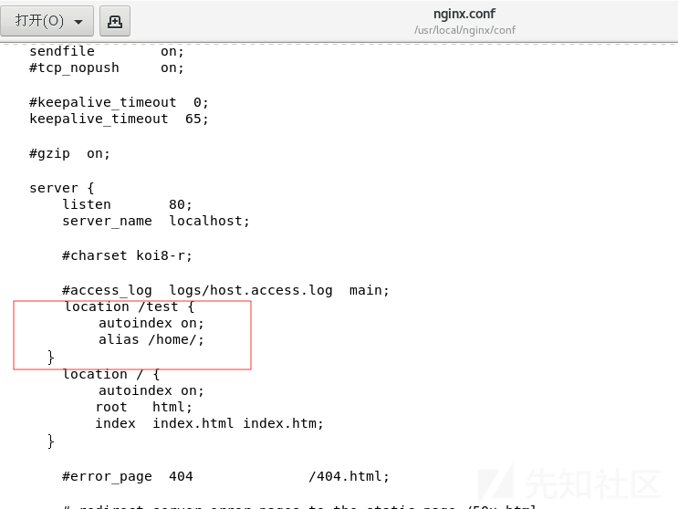

# Web中间件漏洞总结之Nginx漏洞 - 先知社区

Web中间件漏洞总结之Nginx漏洞

- - -

# 解析漏洞

**漏洞简介：**  
对于任意文件名，在后面加上/任意文件名`.php`后该文件就会以`php`格式进行解析，是用户配置不当造成的  
**漏洞复现：**  
在网站根目录新建`test.jpg`，里面写入`phpinfo()`，打开试一下  
  
试一试`Nginx`的解析漏洞，在后面加上`/x.php`  
  
对于低版本的`php`能够直接解析成功，高版本`php`因为引入了`security.limit_extensions`，限制了可执行文件的后缀，默认只允许执行`.php`文件，这里来看看两个与`Nginx`解析漏洞相关的核心配置  
**核心配置：cgi.fix\_pathinfo**  
该选项位于配置文件`php.ini`中，默认值为`1`，表示开启。当`php`遇到文件路径`/aaa.xxx/bbb.yyy/ccc.zzz`时，若`/aaa.xxx/bbb.yyy/ccc.zzz`不存在，则会去掉最后的`/ccc.zzz`，然后判断`/aaa.xxx/bbb.yyy`是否存在，若存在，则把`/aaa.xxx/bbb.yyy`当做文件`/aaa.xxx/bbb.yyy/ccc.zzz`解析，若`/aaa.xxx/bbb.yyy`仍不存在，则继续去掉`/bbb.yyy`，以此类推。若是关闭该选项，访问 `http://192.168.43.13/test/test.jpg/x.php` 只会返回找不到文件。但关闭该选项很可能会导致一些其他错误，所以一般是开启的  
**核心配置：security.limit\_extensions**  
在我的配置文件中，它位于`/etc/php-fpm.d/www.conf`中  
这个选项开始是被注释了的也就是默认只允许执行`php`文件，将`;`去掉，可以在后面添加其它后缀，比如添加`.jpg`这样`.jpg`文件也能够以`php`来执行，修改了后需要`service php-fpm restart`重启`php`  
  
执行效果  
  
或者将`.php`删除，也就是`security.limit_extensions`后面留空，这样就是允许任意格式的文件执行  
  
执行效果  
  
**修复方法：**  
1.将`php.ini`文件中的`cgi.fix_pathinfo`的值设为`0`  
2.将`security.limit_ectensions`后面的值设为`.php`

# 目录遍历

**漏洞简介：**  
和Apache目录遍历一样属于配置错误，可导致源码泄露与目录遍历  
**漏洞复现：**  
访问`test`目录  
  
**核心配置：**  
修改`/usr/local/nginx/conf/nginx.conf`,在如下图位置添加`autoindex on`，默认是没有这一行的  
  
然后访问`test`目录，成功实现目录遍历  
  
**修复方法：**  
将`autoindex on`改为`autoindex off`

# 目录穿越

**漏洞简介：**  
`Nginx`在配置别名(Alias)的时候,如果忘记加`/`,将造成一个目录穿越漏洞  
**配置不当：**  
在如下配置中设置目录别名时`/test`配置为`/home/`的别名,那么当我们访问`/test../`时,`nginx`实际处理的路径时`/home/../`,从而实现了穿越目录  
  
**漏洞复现：**  
  
**修复方法：**  
将`Nginx`配置文件中的`/test`改为`/test/`(闭合)

# CRLF注入

**漏洞简介：**  
我对这个漏洞也不是特别了解，所以我还是看看基本定义和利用吧

`CRLF`是“回车+换行”（`\r\n`）的简称，其十六进制编码分别为`0x0d`和`0x0a`。在`HTTP`协议中，`HTTP header`与`HTTP` `Body`是用两个`CRLF`分隔的，浏览器就是根据这两个`CRLF`来取出`HTTP`内容并显示出来。所以，一旦我们能够控制`HTTP`消息头中的字符，注入一些恶意的换行，这样我们就能注入一些会话`Cookie`或者`HTML`代码。`CRLF`漏洞常出现在`Location`与`Set-cookie`消息头中。  
**漏洞复现：**  
(1)通过`CRLF`注入构造会话固定漏洞  
固定会话漏洞：  
如果注册前有一个`session id`为某个值，注册后发现自己的`session id`还是为这个值就极有可能存在固定会话漏洞  
下面举一个固定会话漏洞利用的例子：  
假如有一个网站，你注册了一个账号，注册之前抓包`PHPSESSID = ghtwf01`，注册成功后发现`PHPSESSID`依然为`ghtwf01`，此时是普通用户权限  
这个时候就可以社工管理员点击某个链接，比如`http://xxx/?PHPSESSID=ghtwf01`，这个时候你的账户权限就会变为管理员权限(类似于CSRF)  
`CRLF`注入怎么构造会话固定漏洞呢？  
构造链接：`http://10.23.88.137%0aSet-Cookie:sessionid=ghtwf01`  
  
给管理员点击即可  
(2)通过`CRLF`注入消息头引发反射型`XSS`漏洞  
构造链接：`http://10.23.88.137%0d%0a%0d%0a`  
  
**修复方法：**  
只需过滤掉`\r` 、`\n`之类的换行符就可

# 参考链接

[https://blog.csdn.net/qq\_32434307/article/details/79480036](https://blog.csdn.net/qq_32434307/article/details/79480036)  
[https://article.itxueyuan.com/1DoQ31](https://article.itxueyuan.com/1DoQ31)  
[https://blog.csdn.net/liuhuaijin/article/details/77449579](https://blog.csdn.net/liuhuaijin/article/details/77449579)  
[https://www.cnblogs.com/0x4D75/p/9790281.html](https://www.cnblogs.com/0x4D75/p/9790281.html)
