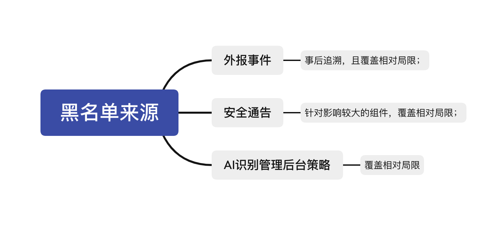
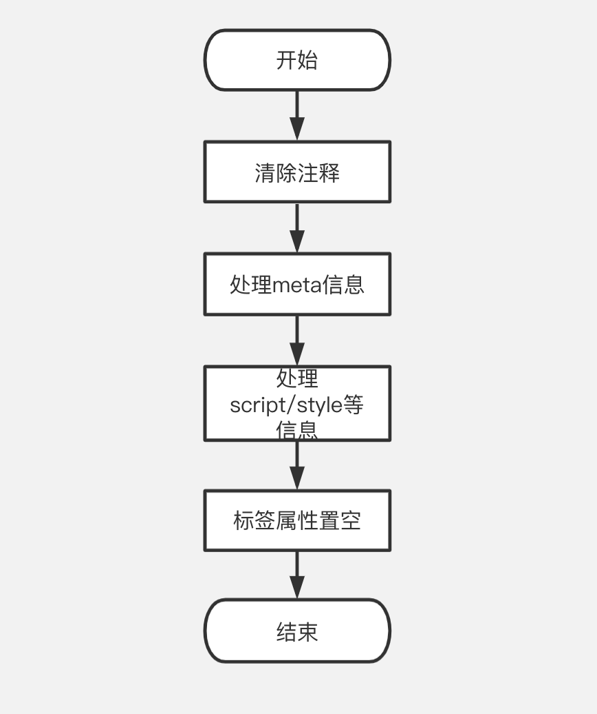
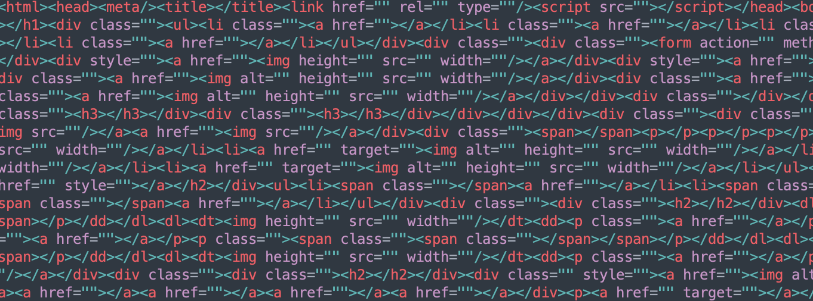
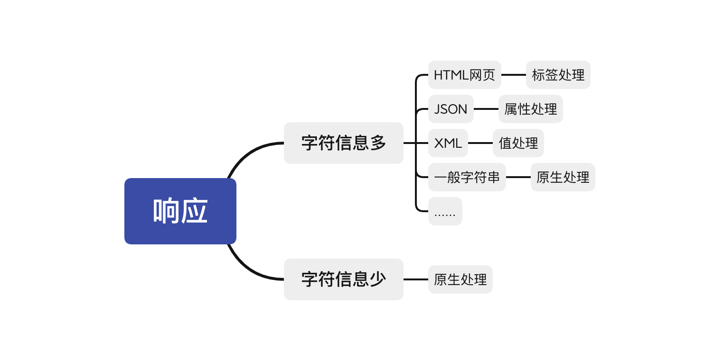
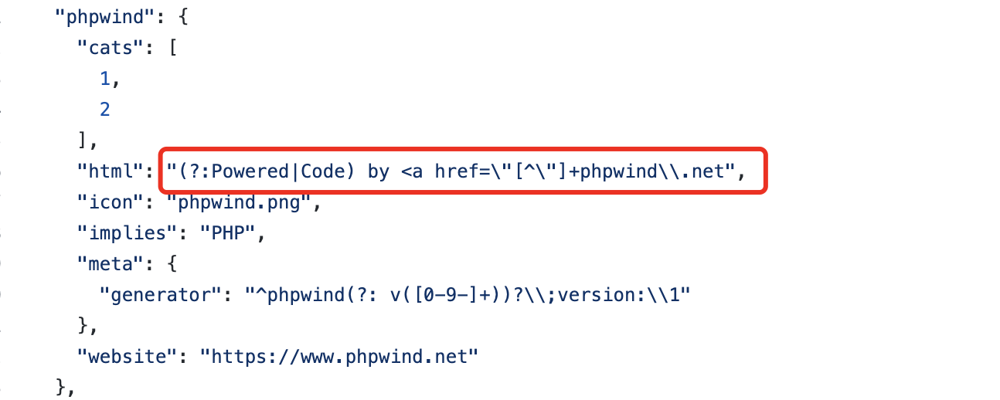
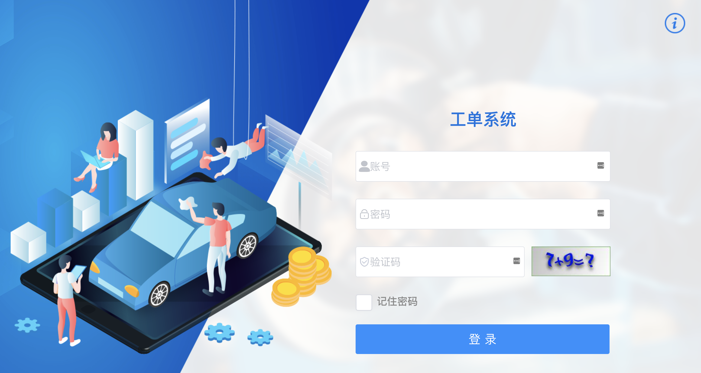
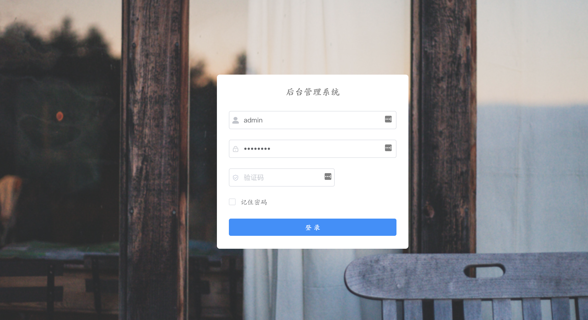

# Web应用组件自动化发现的探索

# 引子

提到Web指纹识别，大家并不陌生，相关的项目汗牛充栋，比如知名的Wappalyzer、WhatWeb等。而在运营上，各企业也都大同小异，利用提前构建好指纹库，通过对公司全域资产进行扫描实现对公司资产的摸底排查，当某些组件出现高危漏洞时，大家可以第一时间做到攻击面的迅速收敛。

但是本文所聊的Web应用组件，并不是单指指纹识别中的小组件，比如jQuery、Bootstrap等，更多是指这个站点较为独立的应用本身。举个例子来说，一个站点是phpMyAdmin搭建的，虽然使用了jQuery，但是我们仍然将该Web应用组件归类为phpMyAdmin。

为何要进行这样的定义呢？这其实主要是为了解决高风险Web应用组件对外的问题，长期以来，我们运营中发现部分业务使用了诸如phpMyAdmin、Kibana、Eleastic Search等Web应用组件并直接对公网开放，而这些组件可能存在弱口令或者未授权，由此导致了安全事件，为了化被动为主动，所以我们联合应用安全团队一起维护了一份公司高风险Web应用组件黑名单，建议业务尽量避免使用此类组件，尤其是避免在公网开放。

众所周知，每一项措施的出现，其实都要伴随着不断的核查，否则其实是没有什么效力的。所以在运营上，我们通过公司自研扫描器洞犀的主动发现结合宙斯盾流量分析系统的被动发现实现对业务的高风险Web应用组件的运营，并获得了不错的效果。当然这部分非本文重点，不再赘述。

# 问渠那得清如许

在建设Web应用组件黑名单的时候，我们首先把历史上比较臭名昭著的高危组件囊括了进来。但是**在后来实际运营中，我们发现一个比较棘手的问题，那就是黑名单的来源**，起初是通过一些外报安全事件中提取；二是从一些安全通告中发现一些新Web应用组件；三是AI识别管理后台策略的上线（见《[基于机器学习的Web管理后台识别方法探索](https://mp.weixin.qq.com/s/vccQcK2GNqWkGuxEGe22Zg "基于机器学习的Web管理后台识别方法探索")》 ），但是策略识别较多的仍然是存在登录行为的管理后台相对较多。总而言之，这些方案都只是可以解决部分问题。

所以如何能比较全面的解决来源问题，是运营好Web应用组件黑名单的一个关键。当然显而易见的方式有很多，比如github找一些star数比较高的组件，通过调研的方式了解各个业务线常用的组件等等。但是无一例外，这些措施的成本相对而言比较高，并不普适。所以如何找到一个性价比更高、更加自动化的方案呢！

# 纸上得来终觉浅

解决黑名单的来源问题，其实可以简单描述为以下三个步骤：**找到新Web组件 —> 确定组件识别规则 —> 确定是否高风险。**

### 1、找到新web组件：

优先解决的第一个问题就是如何找到新的Web组件，从Web组件的分发来说，我们起初曾思考过对github上的star数量较高的组件进行爬取，之后进行分析处理，但是很显然这种方式成本也不低，更甚者，项目鱼龙混杂很难入手，所以后续还是把重点放在了Web组件搭建完成之后，也就是对外服务之后。上文中提到过对Web应用组件的定义问题，在这个定义之下，我们想到Web应用组件下的部分响应页面是比较相似的，比如不同版本的phpMyAdmin的首页响应其实都大同小异，所以很显然，可以通过对比网页页面相似度的算法实现对同类页面的聚类，而同类页面则基本可以判定为同类组件，为此我们下载了全网部分端口Web应用的公开HTTP响应数据做测试。实际测试下来，其中最大的问题则是成本，因为两两页面进行相似度对比，假设有10000个页面，那么这个消耗无疑是指数级的。

思路没问题，现在问题的核心在于如何降低消耗，这里不再讲述具体的思考过程，而是直接给出解决方案：那就是每个页面给几个确定值，那么根据确定值相同的情况则可以确定为相似页面的程度，笔者下面具体讲下什么是确定值，以及如何获得这些确定值。一般情况下针对一个响应，通常包含header和body，我们首先对body做如下处理：

经过这些步骤处理则获得下图之中标签的集合（包含顺序），简单解释下，以上步骤的主要思路是把一些经常二次开发会涉及的标签进行特殊处理，即删除或者合并，就比如WordPress中的meta信息经常会做修改等。

在得到这些标签之后，我们将其称之为网页骨架，这些网页骨架经过我们分析发现，又可以分为三段，我将其简单归类为上中下三段。之所以这样划分，是因为有很多同类Web应用组件在处理后的骨架并不是完全一样，比如某些不同版本的应用，只是上段和下段相同，中间不同。在划分完毕之后，就可以计算上段、下段以及全部的MD5值了，而这些MD5就是确定值。之后就可以进行页面聚合来发现同类组件了，分为以下三种可能，全一致、一段一致、两段一致，分成三段的有一个好处就是可以做分级运营。

到这里读者可能想知道怎么划分为三段，简单来说没有一定的定式，主要就是经验，我们是根据得到的网页骨架字符的总长度来确认的，比如总长度在5000-6000之间，那么三段则是0-1000，1000-4xxx，4xxx-5xxx这样。当然在某些情况下是不用区分三段的，因为有时候获得骨架的MD5会完全匹配。当然这只是其中一种情况，还有一种是响应返回值直接为json，不存在html标签，这个时候我们一般会将json的value值置空再来做对比。当然网页返回的情况的纷繁复杂，除了json之外还有xml、还有纯字符串等等，这些都需要额外进行特殊处理。我简化为下图。最后利用title等其他信息进行聚合操作，完成之后则可得到N个集合(每个集合又包含N个页面)。

### 2、确定组件识别规则：

随着第一个问题的解决，第二个问题的答案其实也就呼之欲出了，上文中分析得到网页骨架的MD5值不正是识别是否为同类组件的规则吗？当然，这个答案确实算一个答案，但是相对传统的我们常见的指纹库正则，这个答案并不完美。我们需要更多的是如何能自动化生成正则表达式（纯字符也算是表达式的一种），这样这些正则是可以应用在流量系统的被动监测之中的。但是目前我们尝试了很多种方法，仍然没有特别好的办法来完美解决这个问题。我们起初是想通过提取网页两类信息（标签+文本组合、标签属性+标签属性值组合，如下图）作为字符串指纹，再之后通过满足A集合但不满足其他集合等方式确定指纹的可识别性，最后再将这些字符串反编为正则，但是这个方案非常繁琐，遂作罢。此外还有一些预设一些经常出现的指纹特征来做匹配，比如header中的Server字段等，也不能非常完美的解决这个问题。当然，通过MD5值的方式仍然是可行的。

### 3、确定是否高风险：

而第三个问题确定组件的风险性，相对主要依赖人工分析，当然这其中仍然是可以一些自动化等措施来辅助实现一部分，一是通过AI识别管理后台的策略判定风险，另一种方式则是通过无头浏览器获取截图的方式提高人工判定风险的效率。

在视觉上，有时候眼睛会欺骗我们，但是网页的代码并不会。下面两张图程序将其归为同类组件，我们起初认为是误报，但是实际深入分析之后，两个网站确实使用了相同的框架。

# 结语

我们上述使用的数据集是公网IP的HTTP响应的数据，如果直接用来作为公司高危组件的新增发现其实有点大材小用了，这部分数据从用途来说，更多的可以用来了解全球开源Web应用组件的发展趋势、占比等。如果希望摸底公司现状，并且对一些未知的高危组件做到提前收敛，那么只需要使用公司全域的HTTP响应流量即可，另外值得一提的是，为了应对js动态网页的问题，强烈建议使用Chrome浏览器无头模式，这种方式虽然效率不是最好，但是针对公司的体量来说足够了，更何况，准确性还得到了很大的提升。

本文仅作为Web应用组件的自动化发现的探索，其中有些实践并不成熟，更是有一些悬而未决的问题，欢迎各位志士同仁交流！

最后特别致谢洞犀的yiiyi，感谢其在探索中给予的帮助。

### 附录

1、[自动化数据分析下的威胁发现](https://mp.weixin.qq.com/s/vHXQcfOcnuehzhrnPn9nSQ "自动化数据分析下的威胁发现")  
2、[基于机器学习的Web管理后台识别方法探索](https://mp.weixin.qq.com/s/vccQcK2GNqWkGuxEGe22Zg "基于机器学习的Web管理后台识别方法探索")
