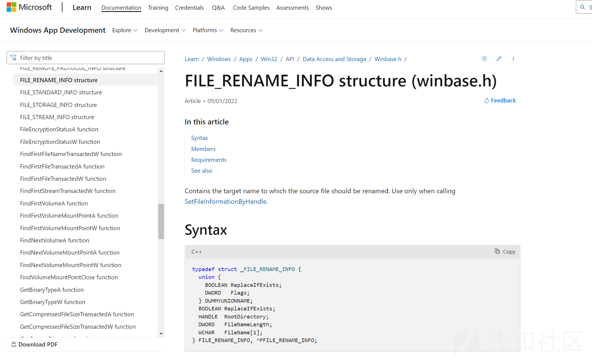
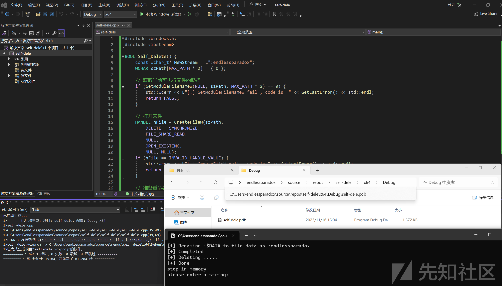

# Windows下自删除的艺术 - 先知社区

Windows下自删除的艺术

- - -

通常来说，在windows程序不可能在运行的时候实现删除自己，微软设计之初为了保证程序的安全性，当一个可执行程序运行的时候会处于一种被占用的状态，如果尝试删除程序，会显示程序被占用，一般需要结束掉程序后才能删掉，而自删除利用了NTFS文件特性达到的程序运行时解除文件锁定，最终删除自身的效果，本篇文章是对此项技术的总结，这项技术已经出现很多年了，互联网上最早的消息来自2021年，于jonasLy在推特公开了这项技术

### NTFS 的 Alternate Data Stream

NTFS（New Technology File System）文件系统包括对备用数据流的支持。这是一个相对不太为人熟知的功能，主要是为了与Macintosh文件系统中的文件兼容性而被引入的。备用数据流允许文件包含多个数据流，而每个文件至少包含一个数据流。在Windows操作系统中，每个文件的默认数据流称为:$DATA

尽管Windows资源管理器（Windows Explorer）没有提供一种直观的方式来查看文件中的备用数据流，也没有提供一种在不删除文件的情况下删除这些数据流的方法，但实际上可以相对容易地创建和访问它们。备用数据流中的可执行文件可以从命令行中运行，但不会在Windows资源管理器（或控制台）中显示

创建方法

```plain
notepad hello.txt:test
```

文件格式：

```plain
<filename>:<stream name>:<stream type>
```

查看方法：

```plain
dir /r
```

这是我创建的内容：

[](https://xzfile.aliyuncs.com/media/upload/picture/20231116151341-abda79fa-844f-1.png)

### 核心原理

1.  微软虽然阻止直接删除自己，但是并不阻止重命名自己，我们可以轻松的按下F2修改我们运行的程序名称；
2.  文件锁和重命名挂钩，文件锁和着你重命名的文件走，假设我们重命名为Alternate Data Stream类型的文件，文件锁便会锁定我们重命名的文件;
3.  要知道所有的Alternate Data Stream都有主的文件，主文件现在没有被使用意味着主文件是可以被删除的;虽然无法直接在系统上进行重命名带有`:`的文件名，但是微软提供的Windows API却不影响我们对本身进行重命名;
4.  通过删除自己的主文件，根据微软的系统特性，备选的数据流也会被系统自动删除，即便是有文件锁也会被强制释放；
5.  程序走到Main方法，PE文件已经加载到内存里面了，因此删除自己不影响程序的正常运行。

## 编程实现

### 核心Windows API

SetFileInformationByHandle是用来重新设置文件名，同时也可以用来设置删除位：

```plain
BOOL SetFileInformationByHandle(
  [in] HANDLE                    hFile,     //要更改信息的文件的句柄。
  [in] FILE_INFO_BY_HANDLE_CLASS FileInformationClass,  //指定要更改的信息类型
  [in] LPVOID                    lpFileInformation,  //指向包含要更改的指定文件信息类的信息的缓冲区的指针
  [in] DWORD                     dwBufferSize  //lpFileInformation 的大小，以字节为单位
);
```

实现：

```plain
if(SetFileInformationByHandle(hFile, FileInformationClass, &FileInformation, sizeof(FileInformation)))
{
   std::cout << "delete self success" << std::endl;
}
```

查看FileInformationClass的枚举类型：

```plain
typedef enum _FILE_INFO_BY_HANDLE_CLASS {
    FileBasicInfo,                     // 文件的基本信息
    FileStandardInfo,                  // 文件的标准信息
    FileNameInfo,                      // 文件的名称信息
    FileRenameInfo,                    // 文件的重命名信息
    FileDispositionInfo,               // 文件的处置信息
    FileAllocationInfo,                // 文件的分配信息
    FileEndOfFileInfo,                 // 文件的结束信息
    FileStreamInfo,                    // 文件流的信息
    FileCompressionInfo,               // 文件的压缩信息
    FileAttributeTagInfo,              // 文件属性标签信息
    FileIdBothDirectoryInfo,           // 文件和目录信息（同时包括文件和目录的标识信息）
    FileIdBothDirectoryRestartInfo,    // 文件和目录信息（同时包括文件和目录的标识信息）的重启信息
    FileIoPriorityHintInfo,            // 文件的IO优先级提示信息
    FileRemoteProtocolInfo,            // 文件的远程协议信息
    FileFullDirectoryInfo,             // 完整的目录信息
    FileFullDirectoryRestartInfo,      // 完整的目录信息的重启信息
    FileStorageInfo,                   // 文件的存储信息
    FileAlignmentInfo,                 // 文件的对齐信息
    FileIdInfo,                        // 文件的标识信息
    FileIdExtdDirectoryInfo,           // 文件的扩展目录信息
    FileIdExtdDirectoryRestartInfo,    // 文件的扩展目录信息的重启信息
    FileDispositionInfoEx,             // 文件的扩展处置信息
    FileRenameInfoEx,                  // 文件的扩展重命名信息
    FileCaseSensitiveInfo,             // 文件的大小写敏感信息
    FileNormalizedNameInfo,            // 文件的规范化名称信息
    MaximumFileInfoByHandleClass       // 用于计数的枚举最大值
} FILE_INFO_BY_HANDLE_CLASS, *PFILE_INFO_BY_HANDLE_CLASS;
```

微软搜索找到FileRenameInfo的具体属性：

```plain
typedef struct _FILE_RENAME_INFO {
  union {
    BOOLEAN ReplaceIfExists;
    DWORD   Flags;
  } DUMMYUNIONNAME;
  BOOLEAN ReplaceIfExists;
  HANDLE  RootDirectory;
  DWORD   FileNameLength;
  WCHAR   FileName[1];
} FILE_RENAME_INFO, *PFILE_RENAME_INFO;
```

[](https://xzfile.aliyuncs.com/media/upload/picture/20231116151410-bd262a56-844f-1.png)

进一步查询文档翻阅：

一个以NUL结尾的宽字符字符串，包含文件的新路径。该值可以是以下之一：

-   绝对路径（驱动器、目录和文件名）。
-   相对于进程当前目录的路径。
-   NTFS文件流的新名称，以冒号`:`开头。

新的文件流NTFS应该要用 : 开始

`HeapAlloc`堆上分配，`HeapAlloc`可以帮助我们动态的分配内存空间

```plain
/**
 * 分配指定大小的内存块，并返回指向分配内存的指针。
 *
 * @param hHeap (输入): 用于分配内存的堆句柄。
 * @param dwFlags (输入): 分配标志，如 HEAP_ZERO_MEMORY（分配后初始化为零）等。
 * @param dwBytes (输入): 要分配的内存块的大小（以字节为单位）。
 *
 * @return 返回指向分配内存的指针。如果分配失败，返回 NULL。
 *
 * @remarks 通过调用HeapFree函数释放分配的内存。
 */
DECLSPEC_ALLOCATOR LPVOID HeapAlloc(
  [in] HANDLE hHeap,
  [in] DWORD  dwFlags,
  [in] SIZE_T dwBytes
);
```

部分代码实现：

```plain
const wchar_t* NewStream = L":endlessparadox";
PFILE_RENAME_INFO pRename = nullptr; //空指针指向结构体

hFile = CreateFileW(szPath, DELETE | SYNCHRONIZE, FILE_SHARE_READ, NULL, OPEN_EXISTING, NULL, NULL);
pRename = (PFILE_RENAME_INFO)HeapAlloc(GetProcessHeap(), HEAP_ZERO_MEMORY, dwBytes);
```

`GetModuleFileNameW`：检索包含指定模块的文件的完全限定路径。该模块必须已被当前进程加载。

```plain
/**
 * 获取指定模块的文件名或当前进程的可执行文件路径。
 *
 * @param hModule (输入，可选): 要获取文件名的模块的句柄，传入 NULL 表示当前进程。
 * @param lpFilename (输出): 存储获取到的文件名的缓冲区，应为一个 WCHAR 字符数组。
 * @param nSize (输入): lpFilename 缓冲区的大小（以字符数为单位）。
 *
 * @return 返回文件名的长度（以字符数表示，不包括 null 终止符）。
 *         如果函数执行失败，返回 0，可以通过调用 GetLastError() 获取更多错误信息。
 */
DWORD GetModuleFileNameW(
  [in, optional] HMODULE hModule,
  [out]          LPWSTR  lpFilename,
  [in]           DWORD   nSize
);
```

CreateFileW : 创建或打开一个文件或 I/O 设备，然后返回一个文件句柄以供后续操作

```plain
/**
 * 创建或打开一个文件或 I/O 设备，然后返回一个文件句柄以供后续操作。
 *
 * @param lpFileName (输入): 要创建或打开的文件名或 I/O 设备的路径。
 * @param dwDesiredAccess (输入): 打开文件的访问权限，如读取、写入等。
 * @param dwShareMode (输入): 其他进程可以与文件共享的方式，如共享读取、共享写入等。
 * @param lpSecurityAttributes (输入，可选): 安全描述符，用于控制文件或目录的安全性。通常传入NULL。
 * @param dwCreationDisposition (输入): 文件的创建或打开方式，如创建新文件、打开已有文件等。
 * @param dwFlagsAndAttributes (输入): 文件或目录的属性标志，如普通文件、目录等，以及其他标志位。
 * @param hTemplateFile (输入，可选): 用于复制文件属性的文件句柄。通常传入NULL。
 *
 * @return 返回一个文件句柄，用于后续文件操作。如果函数执行失败，返回INVALID_HANDLE_VALUE (-1)，
 *         可以通过调用 GetLastError() 获取更多错误信息。
 */
HANDLE CreateFileW(
  [in]           LPCWSTR               lpFileName,
  [in]           DWORD                 dwDesiredAccess,
  [in]           DWORD                 dwShareMode,
  [in, optional] LPSECURITY_ATTRIBUTES lpSecurityAttributes,
  [in]           DWORD                 dwCreationDisposition,
  [in]           DWORD                 dwFlagsAndAttributes,
  [in, optional] HANDLE                hTemplateFile
);
```

RtlCopyMemory例程将源内存块的内容复制到目标内存块

```plain
/**
 * @brief 复制内存区域
 * 
 * @param Destination 目标内存区域的指针，数据将被复制到这里
 * @param Source 源内存区域的指针，数据将从这里被复制
 * @param Length 要复制的字节数
 * 
 * @note 这个函数用于将源内存区域中的数据复制到目标内存区域中，以字节为单位进行复制。
 * @note 这是一个通用的内存复制函数，允许你复制数据到任何类型的内存区域。
 * @note 源内存区域是只读的，不会被修改。
 */
void RtlCopyMemory(
   void*       Destination,
   const void* Source,
   size_t      Length
);
```

### 完整C++代码实现

```plain
#include <Windows.h>  
#include <iostream>  

BOOL Self_Delete() {  
    const wchar_t* NewStream = L":endlessparadox";  
    WCHAR szPath[MAX_PATH * 2] = { 0 };  

    // 获取当前可执行文件的路径  
    if (GetModuleFileNameW(NULL, szPath, MAX_PATH * 2) == 0) {  
        std::wcerr << L"[!] GetModuleFileNameW fail , code is  " << GetLastError() << std::endl;  
        return FALSE;  
    }  

    // 打开文件
    HANDLE hFile = CreateFileW(szPath,  
                               DELETE | SYNCHRONIZE,  
                               FILE_SHARE_READ,  
                               NULL,  
                               OPEN_EXISTING,  
                               NULL, NULL);  
    if (hFile == INVALID_HANDLE_VALUE) {  
        std::wcerr << L"[!] CreateFileW fail , code is " << GetLastError() << std::endl;  
        return FALSE;  
    }  

    // 准备重命名信息  
    SIZE_T sRename = sizeof(FILE_RENAME_INFO) + sizeof(wchar_t) * wcslen(NewStream);  
    PFILE_RENAME_INFO pRename = (PFILE_RENAME_INFO)HeapAlloc(GetProcessHeap(), HEAP_ZERO_MEMORY, sRename);  
    if (!pRename) {  
        CloseHandle(hFile);  
        std::wcerr << L"[!] HeapAlloc fail , code is " << GetLastError() << std::endl;  
        return FALSE;  
    }  

    pRename->FileNameLength = wcslen(NewStream) * sizeof(wchar_t);  
    RtlCopyMemory(pRename->FileName, NewStream, pRename->FileNameLength);  
    std::wcout << L"[i] Renaming :$DATA to file data as " << NewStream << std::endl;  

    if (!SetFileInformationByHandle(hFile, FileRenameInfo, pRename, sRename)) {  
        std::wcerr << L"[!] SetFileInformationByHandle fail, code is" << GetLastError() << std::endl;  
        CloseHandle(hFile);  
        HeapFree(GetProcessHeap(), 0, pRename);  
        return FALSE;  
    }  

    std::wcout << L"[+] Completed" << std::endl;  
    CloseHandle(hFile);  

    // 打开文件以删除  
    hFile = CreateFileW(szPath,  
                        DELETE | SYNCHRONIZE,  
                        FILE_SHARE_READ,  
                        NULL,  
                        OPEN_EXISTING,  
                        NULL, NULL);  

    if (hFile == INVALID_HANDLE_VALUE && GetLastError() == 0) {  
        std::wcout << "free memory" << std::endl;  
        HeapFree(GetProcessHeap(), 0, pRename);  
        return TRUE;  
    }  

    FILE_DISPOSITION_INFO Delete = { 0 };  
    Delete.DeleteFile = TRUE;  
    std::wcout << L"[+] Deleting ....." << std::endl;  

    if (!SetFileInformationByHandle(hFile, FileDispositionInfo, &Delete, sizeof(Delete))) {  
        std::wcerr << L"[!] SetFileInformationByHandle fail, code is  " << GetLastError() << std::endl;  
        CloseHandle(hFile);  
        HeapFree(GetProcessHeap(), 0, pRename);  
        return FALSE;  
    }  

    CloseHandle(hFile);  
    HeapFree(GetProcessHeap(), 0, pRename);  
    wprintf(L"[+] Done\n");  
    return TRUE;  
}  

int main() {  

    Self_Delete();  
    std::wcout << "stop in memory" << std::endl;  
    std::string userInput; // 声明一个字符串变量用于存储用户输入  
    std::cout << "请输入一个字符串: ";  
    std::cin >> userInput ;
    std::cout << "你输入的字符串是: " << userInput << std::endl;  
    return 0;  
}
```

执行效果：

[](https://xzfile.aliyuncs.com/media/upload/picture/20231116151443-d0e0db18-844f-1.png)

## 一些现实场景下的利用方法

### 配合自删除反调试

简单的判断反调试的代码，可以写一个定期判断的逻辑，当有人尝试分析调试的时候就自我删除

```plain
#include <windows.h>  
#include <iostream>  

int main() {  

    while(TRUE){  
        if (IsDebuggerPresent()) {  
            std::cout << "Debugger is attached." << std::endl;  
            std::getchar();
            self_deletio();
            exit(0);  
        } else {  
            std::cout << "Debugger is not attached." << std::endl;  
            std::getchar();  
            Sleep(500);  
        }  
    }  
}
```

### 高级的执行完任务自销毁

我们可以把自删除功能编入工具，实现执行完任务后就自我销毁，达到一种非常隐蔽的实战效果，进一步延长我们自己开发的工具的存活时间，这类方法更加优雅，对比调用cmd和使用`MoveFileEx`方式是需要重启电脑等更加隐蔽安全

### 钓鱼活动中的无样本攻击

设想一下这样的场景，实际的恶意程序托管在攻击者控制的服务器下。钓鱼邮件诱导攻击者访问此恶意程序，普通用户一般对此类程序不会进行备份上传，如果钓鱼成功，攻击者立刻销毁本地和云端上的样本，这可能会大大增加溯源和分析的难度，尽管我们可以通过网络流量还原样本，但是攻击者也可以在流量层面进一步做手脚，获取最初样本的难度就会有一定难度提升。

### 兼容性和稳定性测试

在系统win11、win10、win7、ws2012均通过测试

### 总结

jonasLy利用文件特性巧妙的转移了文件锁，使得文件锁移动在可选备份流，得以在Ring3层面下达到自删除，这项技术将会存在很久很久，直到微软把NTFS技术废弃掉或者修改掉文件的API底层，2年已经过去，目前来说微软没有打算修复这个缺陷。

#### 参考资料：

[https://learn.microsoft.com/en-us/openspecs/windows\_protocols/ms-fscc/c54dec26-1551-4d3a-a0ea-4fa40f848eb3](https://learn.microsoft.com/en-us/openspecs/windows_protocols/ms-fscc/c54dec26-1551-4d3a-a0ea-4fa40f848eb3)  
[https://learn.microsoft.com/en-us/windows/win32/api/](https://learn.microsoft.com/en-us/windows/win32/api/)  
[https://www.youtube.com/watch?v=lcJdlzKS\_5o&ab\_channel=crow](https://www.youtube.com/watch?v=lcJdlzKS_5o&ab_channel=crow)  
[https://chat.openai.com/](https://chat.openai.com/)  
[https://twitter.com/jonasLyk/status/1350401461985955840](https://twitter.com/jonasLyk/status/1350401461985955840)  
[https://github.com/secur30nly/go-self-delete](https://github.com/secur30nly/go-self-delete)  
[https://github.com/LloydLabs/delete-self-poc/tree/main](https://github.com/LloydLabs/delete-self-poc/tree/main)  
[https://owasp.org/www-community/attacks/Windows\_alternate\_data\_stream](https://owasp.org/www-community/attacks/Windows_alternate_data_stream)
