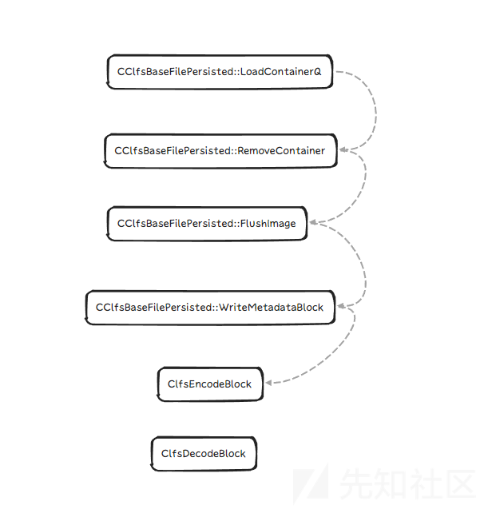
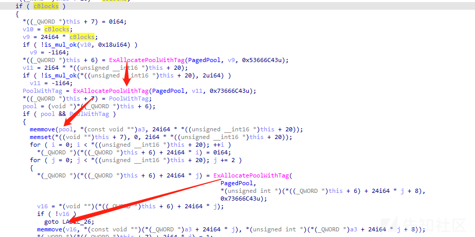

# Windows之clfs日志提权漏洞 - 先知社区

Windows之clfs日志提权漏洞

- - -

本文是关于历届Windows - clfs 漏洞的梳理 ，并不涉及到后续的exp，因为CLFS驱动程序在很短的时间内，爆出过很多漏洞，而且其中很多漏洞牵扯到的函数，clfs的结构体都是相关的还有针对上一个CVE补丁的别样思路的绕过。所以想对此进行一个好的总结和梳理，以便从中学习思路和分析绕过的心路历程。  
关于clfs 漏洞 在进行梳理前，要认识如下几个点这也是每个clfs系列文章老生常谈的知识。

## **前置知识**

首先 Common Log File System(CLFS) API提供了一个高性能、通用的日志文件子系统，专用的客户机应用程序可以使用该子系统，多个客户机可以共享该子系统来优化日志访问。 这是微软对于CLFS的诠释，而且微软还提供了一系列的api 来对日志进行操作，追加，访问等操作。这些api也在后续的漏洞利用过程中不可或缺。  
例如：

```plain
CLFSUSER_API HANDLE CreateLogFile(
  [in]           LPCWSTR               pszLogFileName,
  [in]           ACCESS_MASK           fDesiredAccess,
  [in]           DWORD                 dwShareMode,
  [in, optional] LPSECURITY_ATTRIBUTES psaLogFile,
  [in]           ULONG                 fCreateDisposition,
  [in]           ULONG                 fFlagsAndAttributes
);
CreateLogFile(日志文件名字，访问权限[读或写还有删除]，文件的共享模式，指向SECURITY_ATTRIBUTES结构的指针，打开/创建新文件，文件的属性和标志)
CreateLogFile(logFileName.c_str(), GENERIC_WRITE | GENERIC_READ, 0, NULL, OPEN_ALWAYS, 0);
```

任何需要日志记录或恢复支持的用户模式应用程序都可以使用CLFS。CLFS数据结构大致可以分为三种类型:  
1.存储在内核态的内存中并附加到对象 (例如附加到File object的FCB)。2.临时存储在用户态或内核态调用者的内存中。3.持久化存储在磁盘上的基本日志文件(BLF)，也就是用户可以通过CreateLogFile函数来创建日志文件，然后在本地创建一个同名的后缀为.blf的日志文件，其中包含了日志存储所需的一些信息。  
其次 LOG\_BLOCK：每个日志块都以一个名为CLFS\_LOG\_BLOCK\_HEADER的块头开始的。

```plain
typedef struct _CLFS_LOG_BLOCK_HEADER
{
    UCHAR MajorVersion;
    UCHAR MinorVersion;
    UCHAR Usn;
    CLFS_CLIENT_ID ClientId;
    USHORT TotalSectorCount;
    USHORT ValidSectorCount;
    ULONG Padding;
    ULONG Checksum;
    ULONG Flags;
    CLFS_LSN CurrentLsn;
    CLFS_LSN NextLsn;
    ULONG RecordOffsets[16];
    ULONG SignaturesOffset;
} CLFS_LOG_BLOCK_HEADER, *PCLFS_LOG_BLOCK_HEADER;
by:https://github.com/ionescu007/clfs-docs/
```

其中RecordOffsets是日志块中记录的偏移量数组，CLFS只处理指向CLFS\_LOG\_BLOCK\_HEADER末尾的第一个记录的偏移量（0x70)。

```plain
typedef struct _CLFS_LOG_BLOCK_HEADER  
{  
    UCHAR SECTOR_BLOCK_TYPE;  
    UCHAR Usn;  
};
```

当日志文件存储在磁盘上时候，则会对其日志块进行编码处理,在编码的过程中，还有一个由SignaturesOffset字段指向的数组。在编码的时候，每个扇区都有一个的签名，来保证一致性。还是就是Checksum是该日志块数据的校验和，用来对读取的数据进行校验，采用的是CRC32的校验，函数对应：CCrc32::ComputeCrc32

[](https://xzfile.aliyuncs.com/media/upload/picture/20240101225237-679cdc62-a8b5-1.png)

Base Record定义为如下，它存储用于将基本日志文件与容器关联的元数据

```plain
typedef struct _CLFS_BASE_RECORD_HEADER  
{  
    CLFS_METADATA_RECORD_HEADER hdrBaseRecord;  
    CLFS_LOG_ID cidLog;  
    ULONGLONG rgClientSymTbl[CLIENT_SYMTBL_SIZE];  
    ULONGLONG rgContainerSymTbl[CONTAINER_SYMTBL_SIZE];  
    ULONGLONG rgSecuritySymTbl[SHARED_SECURITY_SYMTBL_SIZE];  
    ULONG cNextContainer;  
    CLFS_CLIENT_ID cNextClient;  
    ULONG cFreeContainers;  
    ULONG cActiveContainers;  
    ULONG cbFreeContainers;  
    ULONG cbBusyContainers;  
    ULONG rgClients[MAX_CLIENTS_DEFAULT];  
    ULONG rgContainers[MAX_CONTAINERS_DEFAULT];  
    ULONG cbSymbolZone;  
    ULONG cbSector;  
    USHORT bUnused;  
    CLFS_LOG_STATE eLogState;  
    UCHAR cUsn;  
    UCHAR cClients;  
} CLFS_BASE_RECORD_HEADER, *PCLFS_BASE_RECORD_HEADER;
```

然后其中cActiveContainers保存了当前活跃的容器数，rgContainers数组则保存容器上下文的偏移值。用户可以使用AddLogContainer和AddLogContainerSet函数向日志中添加容器。容器上下文由以下结构表示:  
typedef struct \_CLFS\_CONTAINER\_CONTEXT

```plain
typedef struct _CLFS_CONTAINER_CONTEXT  
{  
    CLFS_NODE_ID cidNode;  
    ULONGLONG cbContainer;  
    CLFS_CONTAINER_ID cidContainer;  
    CLFS_CONTAINER_ID cidQueue;  
    union  
    {  
    CClfsContainer* pContainer;  
    ULONGLONG ullAlignment;  
    };  
    CLFS_USN usnCurrent;  
    CLFS_CONTAINER_STATE eState;  
    ULONG cbPrevOffset;  
    ULONG cbNextOffset;  
} CLFS_CONTAINER_CONTEXT, *PCLFS_CONTAINER_CONTEXT;  
* pContainer实际上包含一个内核指针，指向在运行时描述容器的CClfsContainer
* 当日志文件在磁盘上时，该字段必须设置为零。
```

BLF文件，也是生成的日志文件。其中组成blf的不同元数据对应其不同的类型的数据，要关注一下Control Block，其包含了有关布局,扩展区域以及截断,区域的信息。其结构体如下，其中而rgBlocks 保存了日志块的大小

```plain
typedef struct _CLFS_CONTROL_RECORD
{
    CLFS_METADATA_RECORD_HEADER hdrControlRecord;
    ULONGLONG ullMagicValue;
    ULONG Version;
    CLFS_EXTEND_STATE eExtendState;
    USHORT iExtendBlock;
    USHORT iFlushBlock;
    ULONG cNewBlockSectors;
    ULONG cExtendStartSectors;
    ULONG cExtendSectors;
    CLFS_TRUNCATE_CONTEXT cxTruncate;
    ULONG cBlocks;
    ULONG cReserved;
    CLFS_METADATA_BLOCK rgBlocks[6];
} CLFS_CONTROL_RECORD;
```

其中CLFS\_METADATA\_BLOCK的结构体为

```plain
typedef struct _CLFS_METADATA_BLOCK
{
    ULONGLONG pbImage;  
    ULONG cbImage;        
    ULONG cbOffset;       
    CLFS_METADATA_BLOCK_TYPE eBlockType;
    ULONG Padding;
} CLFS_METADATA_BLOCK;
```

上述的CLFS数据结构，和一些对日志文件进行编码，添加容器等操作，在后续的CVE漏洞分析中都有所提及。是下边漏洞分析的关键。更好的梳理clfs内不同的数据结构了解其作用和功能，能更好的有助于复现和挖掘新的clfs驱动系列的问题。

## **漏洞分析**

### CVE-2022-24521

漏洞成因：CClfsBaseFilePersisted::LoadContainerQ在此函数中有一处逻辑，先来正常梳理一下，如果CLFS\_CONTAINER\_CONTEXT->cidQueue的值为 -1 ，那么此时CLFS\_CONTAINER\_CONTEXT->pContainer的值就被设置成了0，然后就会调用CClfsBaseFilePersisted::RemoveContainer函数。

[](https://xzfile.aliyuncs.com/media/upload/picture/20240101225803-2a0820b8-a8b6-1.png)  
CClfsBaseFilePersisted::RemoveContainer 函数中，还调用了CClfsBaseFilePersisted::FlushImage函数，然后进行取值和校验后，将调用pContainer对象中存储的函数。

[](https://xzfile.aliyuncs.com/media/upload/picture/20240101225814-308f3638-a8b6-1.png)  
而通过CClfsContainer::CClfsContainer函数可知，\*pContainer是存放在虚函数表中。

[](https://xzfile.aliyuncs.com/media/upload/picture/20240101225828-3906f396-a8b6-1.png)

此时我们在看一下CClfsBaseFilePersisted::FlushImage函数

[](https://xzfile.aliyuncs.com/media/upload/picture/20240101225839-3f57db5c-a8b6-1.png)

其内部将执行CClfsBaseFilePersisted::WriteMetadataBlock函数，该函数会遍历每一个容器上下文，将pContainer先保存后置为0。

[](https://xzfile.aliyuncs.com/media/upload/picture/20240101225850-4621fe5e-a8b6-1.png)

然后其内部又调用ClfsEncodeBlock和ClfsDecodeBlock对数据进行编码和解码。直观的感受如图

[](https://xzfile.aliyuncs.com/media/upload/picture/20240101225900-4b9d4ef6-a8b6-1.png)

而上述过程中虽然代码有刻意的将pContainer进行保护，置其为0，但在ClfsEncodeBlock编码的时候，会将每0x200字节的后两字节写入到SignaturesOffset中。那么如果 \_CLFS\_LOG\_BLOCK\_HEADER中的SignaturesOffset字段被修改让它与\_CLFS\_CONTAINER\_CONTEXT中pContainer指针相交，这样在函数编码的时候，其写入的内容就会覆盖掉pContainer执行。这样CClfsBaseFilePersisted::FlushImage 函数在调用 pContainer 时候，其实执行的就是我们构造好的地址。从而导致RIP，来实现函数执行任意函数的目的。

### CVE-2022-30220

此漏洞位于CClfsBaseFilePersisted::ReadImage 函数中

[](https://xzfile.aliyuncs.com/media/upload/picture/20240101225917-560f0348-a8b6-1.png)  
它没有上个漏洞较多的繁琐流程，此漏洞经补丁diff呈现的效果比较直观。主要是关于 \_CLFS\_CONTROL\_RECORD-> cBlocks(cBlocks字段指示数组中的块数量。)值大小的校验。如上图所示，if ( cBlocks > 6u ) 通过此判断后，随后又在在函数中使用ExAllocatePoolWithTag分配了两个池，分别为24*和2*大小的池空间。然后又对两个池进行memmove操作。之后将\_CLFS\_CONTROL\_RECORD -> rgBlocks 列表复制到 pool1 处。其实在看到此处分配的时候就有个猜想，会不会是分配的是大小为0的地址。也就是未初始化的空间。在读取日志块的函数后，随后继续往下看CClfsBaseFileSnapshot::InitializeSnapshot函数，同样使用了ExAllocatePoolWithTag函数去分配。而在这时候cblocks的值是比实际的大。这样就导致最后ExAllocatePoolWithTag分配的空间是0，然后下边memmove函数复制的数据也是0。

[](https://xzfile.aliyuncs.com/media/upload/picture/20240101225935-60c3e70e-a8b6-1.png)

最后执行到。ClfsEncodeBlockPrivate函数时候，blockHeader 指向的就是一个未初始化的空间了，然后在下方数据的运算写入数据的时候，发送了错误导致崩溃。

### CVE-2022-37969

此漏洞主要的问题是缺乏对 clf.sys 中基本日志文件 (BLF) 的基本记录头中的字段 cbSymbolZone 的严格边界检查。在上述前言的介绍中，我们知道BLF文件在0x200字节扇区中写入/读取，后两个字节用于存储扇区签名。对于合法的BLF文件，具有原始字节的数组位于块的最后。ClfsEncodeBlock和ClfsDecodeBlock函数负责编码解码还有将签名和原始字节写入它们各自的位置。（24521中我们已经分析过的函数处理逻辑)。还写\_CLFS\_BASE\_RECORD\_HEADER 结构体中存在一个cbSymbolZone。 复习了一下之后，定位到关键处函数CClfsBaseFilePersisted::AllocSymbol

[](https://xzfile.aliyuncs.com/media/upload/picture/20240101230016-78e6e46c-a8b6-1.png)  
从函数可知 cbSymbolZone 的值被修改，然后执行了if判断，cbSymbolZone主要是用来计算新增的Container应该略过多少空间，也是此处漏洞的关键。此函数直接使用了blf文件中存储的cbSymbolZone的值，这样如果我们操作了cbSymbolZone的值，就能去改写container，还能修改container的pcontainer指针。  
而函数中的if 判断 ，就是下一步我们需要考虑的，不过与cbSymbolZone其比较的数值是SignaturesOffset字段，该字段我们可以在我们创建的blf文件，让被内存中的大量数据覆盖。这样，即使将cbSymbolZone字段设置为异常值，仍然可以绕过cbSymbolZone字段的验证。  
这样当函数调用memset()时候，就会导致在v10处发生越界写入，该偏移量属于日志中的CLFS\_CONTAINER\_CONTEXT结构。这样CLFS\_CONTAINER\_CONTEXT结构中偏移量的CClfsContainer指针被损坏就可以指向用户态可申请内存地址，然后再申请内存覆盖其地址。

### CVE-2023-23376

此漏洞主要涉及到了CLFS\_CONTROL\_RECORD结构体。此结构体用于保存CLFS\_METADATA\_BLOCK，其中包含有关日志中存在的所有块的信息，并且还可以更改块大小的附加字段。其中块有关的是eExtendState，iFlushBlock-正在写入的块的索引;cNewBlockSectors-新块的大小(以扇区为单位);cExtendStartSectors -原始块小;cExtendSectors-添加的扇区数。cclfsbasefilepersist::OpenImage函数检查中断的块扩展操作是否应该继续。

[](https://xzfile.aliyuncs.com/media/upload/picture/20240101230111-99fdba40-a8b6-1.png)

这个函数检查iExtendBlock和iFlushBlock索引，它们应该小于6。否则，将在CClfsBaseFilePersisted::ExtendMetadataBlock函数中映射缓冲区m\_rgBlocks之外读取块指针。  
而传入CClfsBaseFilePersisted::ExtendMetadataBlock函数中的iExtendBlock和iFlushBlock并不被检查。  
所以此处就有一个问题。OpenImage 函数检查，而其他函数调用ExtendMetadataBlock 函数存在问题，  
但是如果函数的调用流程 首先经过OpenImage 函数的检查，那么关于索引的检查就会通过不了。但如果经过了此函数的检查，再去修改CLFS\_CONTROL\_RECORD或 索引，那么就可以利用这一点将地址作为指向指针传递。  
此处也是Windows中比较经典的逻辑漏洞。  
因此漏洞最后改变CLFS\_CONTROL\_RECORD结构中的eExtendState, iExtendBlock, iFlushBlock和其他字段的值  
然后执行OpenImage中的ExtendMetadataBlock函数时候，修改CLFS\_CONTROL\_RECORD，让CLFS\_CONTROL\_RECORD->DumpCount 递增，这样ClfsEncodeBlock函数（在24521中有过介绍）对块进行编码，然后将其更改的数据写入。这样就会覆盖CLFS\_LOG\_BLOCK\_HEADER->RecordOffsets\[0\] 。最后被修改过的CLFS\_CONTROL\_RECORD就会执行，就可以在内存中执行任意的值。

### CVE-2023-28252

首先是CClfsBaseFilePersisted::OpenImage函数中调用CClfsBaseFilePersisted::ReadImage函数

[](https://xzfile.aliyuncs.com/media/upload/picture/20240101230200-b707db7a-a8b6-1.png)  
然后在CClfsBaseFilePersisted::ReadImage 函数中调用CClfsBaseFile::GetControlRecord

[](https://xzfile.aliyuncs.com/media/upload/picture/20240101230208-bc08ebaa-a8b6-1.png)

而在CClfsBaseFilePersisted::OpenImage函数中，函数调用的一个逻辑顺序ReadImage->GetBaseLogRecord->条件判断（分别判断eExtendState iExtendBlock iFlushBlock的值）->ExtendMetadataBlock。

[](https://xzfile.aliyuncs.com/media/upload/picture/20240101230224-c5919a78-a8b6-1.png)

CClfsBaseFilePersisted::ExtendMetadataBlock 函数中会依靠iExtendBlock的值来加载元数据，然后获取指针，通过eExtendState的值来进行分支判断。

[](https://xzfile.aliyuncs.com/media/upload/picture/20240101230236-cc6ad47c-a8b6-1.png)

而后又调用了CClfsBaseFilePersisted::FlushControlRecord函数

[](https://xzfile.aliyuncs.com/media/upload/picture/20240101230246-d2ca672e-a8b6-1.png)

而CClfsBaseFilePersisted::FlushControlRecord函数，对GetControlRecord获取日志控制块进行了分支判断，继而可以走到CClfsBaseFilePersisted::WriteMetadataBlock函数内。而后WriteMetadataBlock函数内获取和更新元数据块的地址，而更新的条件参数是iFlushBlock的值。随便内部又调用了ClfsEncodeBlock和WriteSector对数据进行编码和写入处理。

[](https://xzfile.aliyuncs.com/media/upload/picture/20240101230256-d85cfa58-a8b6-1.png)

在WriteMetadataBlock函数中而是直接调用了WriteSector函数写入数据。假设执行ClfsEncodeBlock时则首先将校验和置为0，然后ClfsEncodeBlockPrivate检测到异常返回错误码，因此ClfsEncodeBlock不会更新校验和。然后元数据块的校验和变成为0，这样就可以绕过OpenImage函数中的检测。  
在CreateLogFile函数会调用CClfsBaseFilePersisted::CheckSecureAccess函数。CheckSecureAccess函数会遍历容器获取pContainer值，并调用虚函数。因此可以创建一个日志文件，其包含了精心构造的容器，然后利用该漏洞修改容器的偏移，使其再次调用CreateLogFile时，遍历的容器为构造的容器，然后pContainer值指向用户空间中构造虚函数布局，这样调用虚函数时便可以执行我们想要执行的函数。  
综上：WriteMetadataBlock的ClfsEncodeBlock 检测到异常触发错误码的时候，还是更新了MetaBlockControl块数据，这样就导致下次加载MetaBlockControl块时可以越界访问MetaBlockControlShadow块。  
在分析了多个clfs 漏洞，我们可以发现这些漏洞基本上都集中于日志文件的写入操作时，对各个块头的处理也包括对偏移，指针的操作。

## **总结归纳**

整理clfs 系列的漏洞，感觉最好还是通过diff出的结果再结合细节去分析，因为clfs系列的漏洞都是有利用其很多相关的函数。  
clfs漏洞系列整体都是和blf文件内的结构还有对blf文件写入日志系统过程中所调用的函数有关，还有对用于存储实际数据的容器有关。还有对于CLFS\_LOG\_BLOCK\_HEADER等，驱动大多都会从此处开始来进行解析通过偏移量来完成流程，于是乎修改偏移等位置信息来造成内存破坏就是漏洞发现的一个关键点了。还有上述牵扯比较多的CLFS\_CONTAINER\_CONTEXT等等。

参考：  
[https://bbs.kanxue.com/thread-275566.htm#%E6%BC%8F%E6%B4%9E%E5%A4%8D%E7%8E%B0](https://bbs.kanxue.com/thread-275566.htm#%E6%BC%8F%E6%B4%9E%E5%A4%8D%E7%8E%B0)  
[https://github.com/ionescu007/clfs-docs/](https://github.com/ionescu007/clfs-docs/)  
[https://mp.weixin.qq.com/s/mkLjAyalo55PmdLbzMnX9g](https://mp.weixin.qq.com/s/mkLjAyalo55PmdLbzMnX9g)
