# Windows之任意文件删除到提权 - 先知社区

Windows之任意文件删除到提权

- - -

## 前言

ZDI 发表过从任意文件夹删除到提权的利用过程，还提供了任意文件删除到提权的利用过程，所以一字之差但是漏洞利用方式也是有细微偏差的。  
这里把任意文件删除和任意文件夹删除漏洞提权结合起来分析，是因为其最后的利用过程是一样的，通过不同的CVE漏洞利用过程来加深这种别样提权手法的理解。  
关于符号链接测试工具可以利用pj0的即可在文后。

## **Windows通过任意文件删除到完成提权NT AUTHORITY\\SYSTEM**

原理思考：  
了解任意文件删除如果到提权的利用，我们首先还是要了解一些前置基础。比如在Windows上文件是使用DACL锁定，还有Windows上还存在着文件共享这一特点，这就会导致某些关键的系统文件会在某一特定时刻无法访问，这样情况相信很多时候都会遇见。  
而关于DACL（自由访问控制列表） 它则是属于ACL的两种类型之一，ACL是访问控制列表，是ACE(访问控制条目)的列表。  
ACL除了DACL还有SACL类型。DACL(自由控制列表)标志允许或者拒绝访问安全对象的受信人，当进程尝试访问安全对象的时候，系统会检查对象DACL中的ACE以此来确定是否向其授予访问权限。  
如果对象没用DACL也就是没有限制了，那么系统会向所有人授予完全访问权限，如果对象的DACL中没有ACE那么ADCL将会拒绝不允许任何访问权限。  
Windows Installer 服务：此服务负责应用程序的安装，通常是一个.msi后缀的文件。每次对系统进行更改时，Windows Installer会记录更改，而且如果安装包是更新的安装包或电脑上已经存在现有文件，那么再次安装的时候会保留旧版的副本，这个记录就允许Windows Installer服务将系统还原到其原始状态。位置文件是X:\\Config.Msi的文件夹

[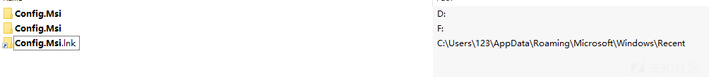](https://xzfile.aliyuncs.com/media/upload/picture/20240104211149-d1dc8f06-ab02-1.png)

Windows Installer 会将更改记录在X:\\Config.msi中的rbs（回滚脚本）文件中，而原始文件的副本存放的文件扩展名是rbf(回滚文件)这样当回滚时候，服务就会读取rbs 和 rbf 文件，使系统恢复安装前的状态。  
为了保护机制的安全性（因为在回滚期间是可能会对系统其他文件进行任意的更改的），Windows Installer在X:\\Config.Msi和其中的文件都会设置强DACL来对其进行保护。

[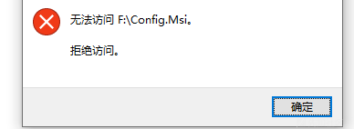](https://xzfile.aliyuncs.com/media/upload/picture/20240104211158-d759f3f6-ab02-1.png)

那假设此时我们已经有了任意文件的删除漏洞，那么我们就可以在Windows Installer创建X:\\Config.Msi文件夹后立即删除它，然后再使用弱DACL权限去创建X:\\Config.Msi。这样Windows Installer在X:\\Config.Msi 中创建了回滚文件之后，我们就可以将其中的rbs/rbf 进行篡改，这样在回滚的时候Windows Installer 执行的回滚操作都是我们设计好的，这样就能对系统进行任意的修改操作。

[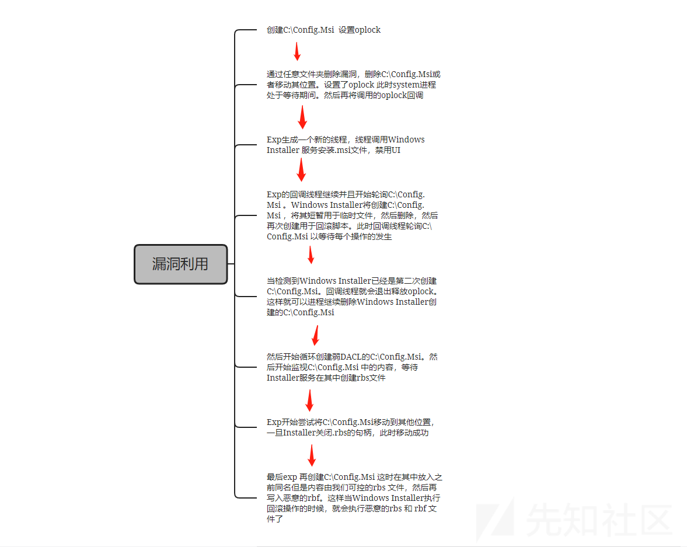](https://xzfile.aliyuncs.com/media/upload/picture/20240104211207-dcec44ea-ab02-1.png)

这里我们拿zdi官方提供的代码瞅一瞅：  
代码结构中给了三个FolderOrFileDeleteToSystem 和 FolderContentsDeleteToFolderDelete 还有SystemCmdLauncher，  
SystemCmdLauncher这个就是最后调用system cmd的先不用管。根据使用步骤zdi说先使用  
FolderOrFileDeleteToSystem 再运行FolderContentsDeleteToFolderDelete，那先来看一下其中代码的具体实现。  
bitnessCheck 函数是用来检测当前的架构x64 or x32 和我们加载的动态链接库是否匹配

[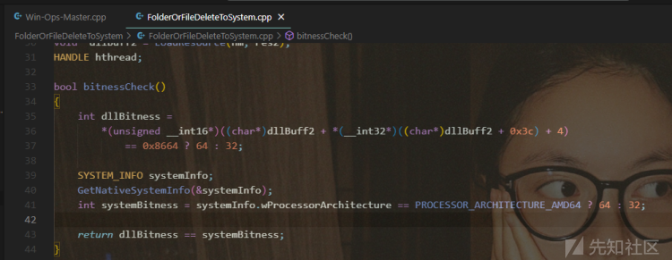](https://xzfile.aliyuncs.com/media/upload/picture/20240104211230-ea70fafc-ab02-1.png)

然后DWORD WINAPI install（） 函数就是用来安装MSI软件包操作了，拿到句柄之后找到类型为msi的资源，然后构建一个msi软件包的路径，放到windows 的临时目录tmp下，这时再用OpenFileNative创建msi软件包文件，并获取其句柄。后续再将加载的msi软件包写入到文件中，然后设置INSTALLUILEVEL\_NONE 使其关闭用户界面，然后调用安装和卸载MSI软件包。此函数主要是准备工作

[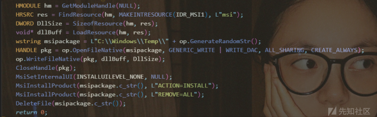](https://xzfile.aliyuncs.com/media/upload/picture/20240104211241-f0c31f0c-ab02-1.png)

这里它设置了线程的优先级，使其优先级较高，这样有助于提高成功率。然后就是循环尝试打开C:\\Config.Msi目录了，等待C:\\Config.Msi被创建之后再等待其被删除。这对应的就是上述流程的第二步操作

[](https://xzfile.aliyuncs.com/media/upload/picture/20240104211251-f6b01c08-ab02-1.png)

检查文件是否存在，能否被删除。删除成功之后才会继续如下步骤，也是校验漏洞是否有效

[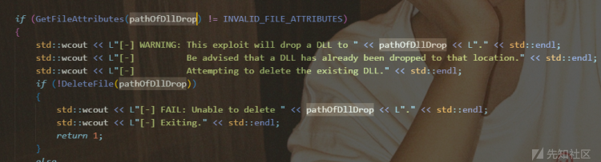](https://xzfile.aliyuncs.com/media/upload/picture/20240104211301-fca733da-ab02-1.png)

然后尝试创建打开或创建C:\\Config.Msi文件夹，再对其判断其中是否为空，只有为空我们才能继续下边的操作

[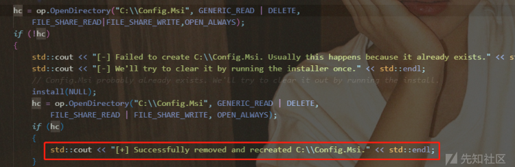](https://xzfile.aliyuncs.com/media/upload/picture/20240104211312-031832a0-ab03-1.png)

然后调用了SetPriorityClass，SetThreadPriorityBoost，SetThreadPriority 去设置我们当前进程和线程的优先级，再对目录上加oplock锁，并且等待锁的释放

```plain
SetPriorityClass(GetCurrentProcess(), HIGH_PRIORITY_CLASS);
SetThreadPriorityBoost(GetCurrentThread(), TRUE);      // This lets us maintain express control of our priority
SetThreadPriority(GetCurrentThread(), THREAD_PRIORITY_TIME_CRITICAL);
op.CreateAndWaitLock(hc, callback);
```

然后在创建循环，不断去尝试打开C:\\Config.Msi文件夹，检测到被打开之后才会退出。然后监听其中是否产生了.rbs文件，其次就是上述步骤中SetSecurityInfo 把DACL 安全级降为弱，这样后续对Config.Msi的操作就没事了，然后分别将 dllBuff 和 dllBuff2 写入 rbs 和 rbf 文件，等着后边回滚操作。然后等待线程完成（切记关闭句柄操作）

[](https://xzfile.aliyuncs.com/media/upload/picture/20240104211340-1407b964-ab03-1.png)

这是FolderOrFileDeleteToSystem的主要操作。再来看一下运行此之后FolderContentsDeleteToFolderDelete的操作，这一部分主要是为了任意文件删除漏洞所做的操作，通过创建符号链接将 \\RPC Control\\expfile 指向目标文件也就是C:\\Config.Msi::$INDEX\_ALLOCATION

[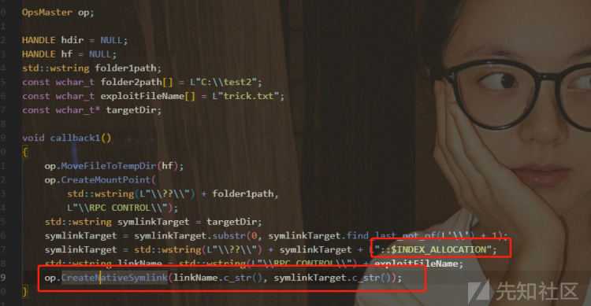](https://xzfile.aliyuncs.com/media/upload/picture/20240104211350-1a4e9bda-ab03-1.png)

后续操作是设置目标目录 然后创建目录结构，再通过RemoveDirectory 删除目录中的内容，然后使用CreateLock 创建锁，并且给锁上回调函数，然后等待锁的释放这样就确保删除的操作完成。

[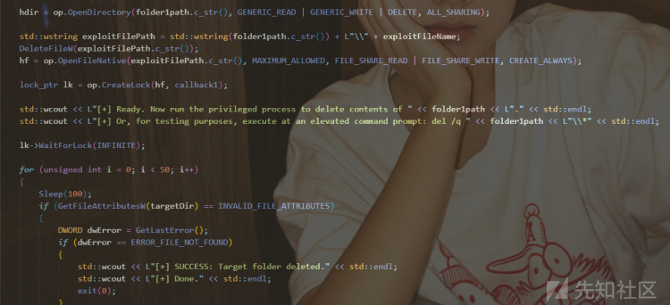](https://xzfile.aliyuncs.com/media/upload/picture/20240104211402-215e2490-ab03-1.png)

其实关键的步骤还是在于FolderOrFileDeleteToSystem，因为在其中准备好了msi的安装过程和回滚操作，而FolderContentsDeleteToFolderDelete也是为了将文件（夹）删除彻底。  
这里要提一嘴就是 我们的漏洞原语是任意文件夹删除漏洞，如果是任意文件删除漏洞是，我们要先从C:\\MyFolder::$INDEX\_ALLOCATION找到索引数据，然后删除文件夹的 ::$INDEX\_ALLOCATION 流会有效地从文件系统中删除该文件夹。然后通过API--DeleteFileW 删除。这在上述zdi的代码中已经有了体现。  
通过ZDI 提供的CVE-2022-21838 漏洞利用步骤，我们再来复盘一下上述的操作  
此漏洞是关于SilentCleanup服务的，它是在windows上用system运行的，通过此服务的任意文件删除漏洞  
首先创建子文件夹temp\\folder1  
然后创建文件temp\\folder1\\file1.txt  
然后在文件上 加oplock temp\\folder1\\file1.txt  
然后等待进程去枚举temp\\folder1 文件夹的内容，并且尝试删除其中的文件file1.txt。此时会触发oplock锁。  
然后将file1.txt移动位置，这样temp\\folder1 文件夹 会为空。可以删除。这时要注意 移动file1.txt的目的不仅是为了删除它  
因为删除此文件需要我们释放最开始创建的oplock锁，但这样我们可以继续维持oplock的状态。  
然后创建temp\\folder1 作为\\RPC Controlfolder 对象的命名空间  
然后在\\RPC Control\\file1.txt上创建符号链接 指向C:\\Config.Msi::$INDEX\_ALLOCATION（因为这是任意文件删除漏洞，所以需要INDEX\_ALLOCATION的流）  
然后回调完成，oplock锁释放掉，file1.txt被删除其实已经链接到C:\\Config.Msi了，就导致C:\\Config.Msi删除。

## **Windows Backup Service-CVE-2023-21752 到本地提权**

了解zdi 关于任意文件删除到提权的阐述，来从Windows Backup Service-CVE-2023-21752来再巩固一下  
此漏洞作者也是提供了利用的脚本，值得的一提的漏洞作者其实在之前也针对此类型的漏洞做过挖掘。  
MSIExecEoP ：其实漏洞的手法也是一样的，因为此漏洞也是任意文件删除漏洞，其关键点在于 C:\\users\\%username%\\appdata\\roaming\\microsoft\\installer此目录DACL设置的问题，允许每个读取访问权限也就是DACL设置较弱，从而就用户对父目录具有删除权限了。

[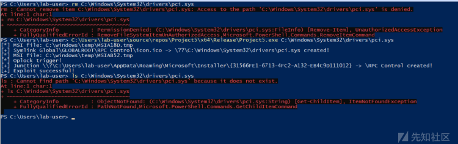](https://xzfile.aliyuncs.com/media/upload/picture/20240104211545-5e689050-ab03-1.png)  
其脚本关键的点还是在于符号链接的设置和使用op = FileOpLock::CreateLock(hFile, cb0); 对文件上锁的操作。

[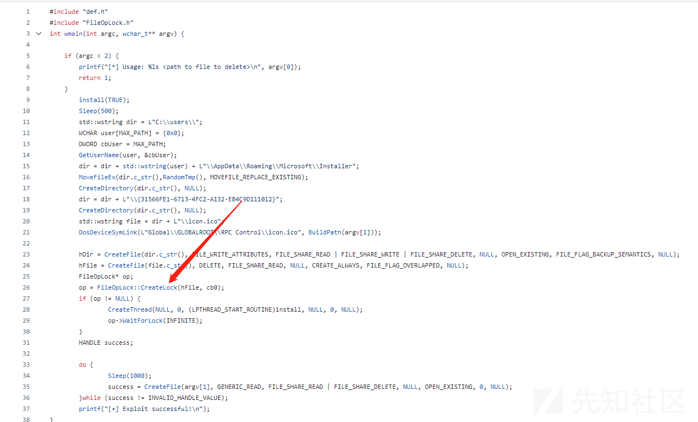](https://xzfile.aliyuncs.com/media/upload/picture/20240104211554-63ceb290-ab03-1.png)

回过头说CVE-2023-21752漏洞，漏洞点出现在sdengin2.dll中，通过diff的结果，发现变化的函数其实没有多少，主要是IsWritable函数和 CSdCommonImpl::\_IsValidStagingArea函数。

[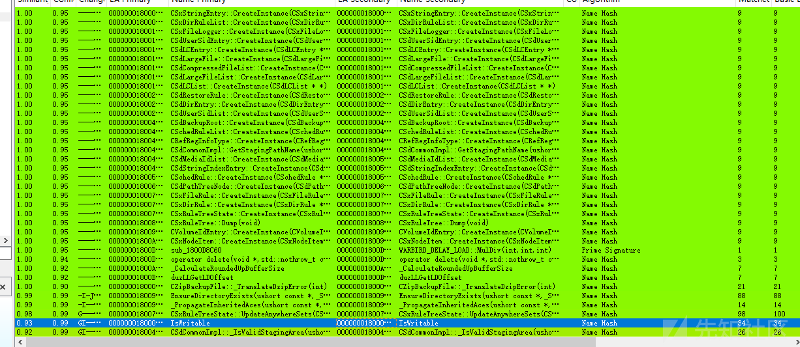](https://xzfile.aliyuncs.com/media/upload/picture/20240104211604-69b9e18e-ab03-1.png)

通过对比很快就可以发现前边并没有改变直到if判断将GetTempFileNameW 函数检查 修改成了CheckDevicePathIsWritable 函数检查了。GetTempFileNameW是用来创建临时文件的。 如果生成唯一的文件名，则会创建一个空文件并释放其句柄；否则仅生成文件名。而CheckDevicePathIsWritable将会在释放句柄时将文件直接删除，这样就省略了后续文件删除操作。

[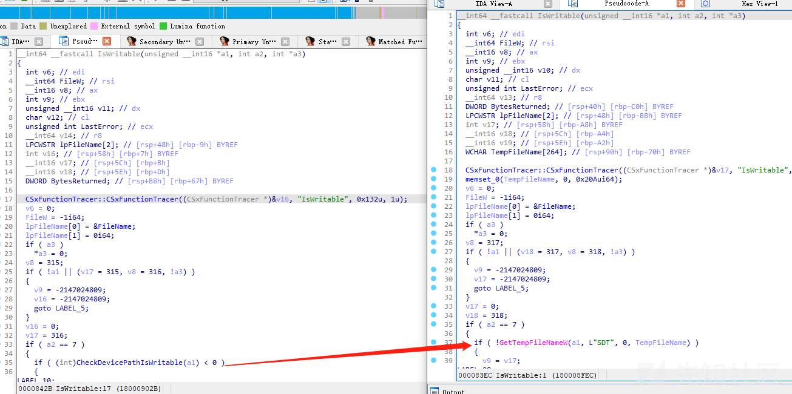](https://xzfile.aliyuncs.com/media/upload/picture/20240104211615-703c63ce-ab03-1.png)

这里就是还将后续删除文件的操作也去掉了

[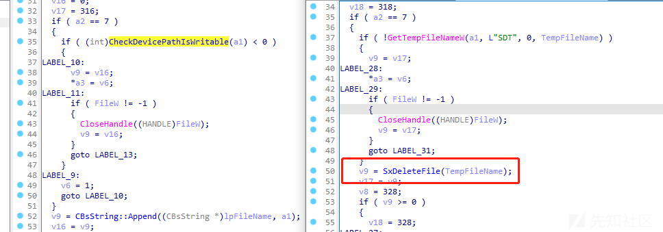](https://xzfile.aliyuncs.com/media/upload/picture/20240104211623-7518fe48-ab03-1.png)

但SxDeleteFile 函数并没有去掉，只是在漏洞点处将其判断删除掉了。但这样后续SxDeleteFile 调用DeleteFileW删除文件的操作也无了。这样后续也可以看看是否有其他处利用此函数删除文件的操作，看校验是否严谨。

[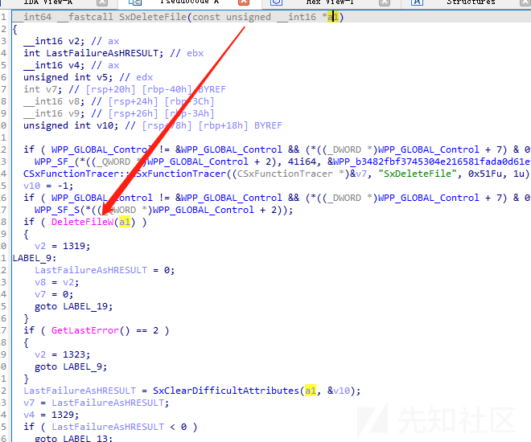](https://xzfile.aliyuncs.com/media/upload/picture/20240104211632-7a57baac-ab03-1.png)

也可以通过运行exp的时候使用Process Monitor监控此exp对文件的操作流程，和关键删除文件的点来确认漏洞的位置因为相比较利用是由文件操作类型的漏洞通过Process Monitor监控对于diff来说确实可以更快的就定位到漏洞点。监控脚本对文件的操作可以发现，一直在不断的尝试获取句柄然后加oplock

[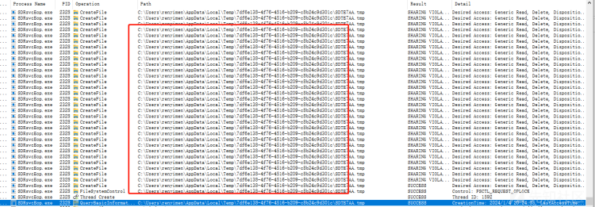](https://xzfile.aliyuncs.com/media/upload/picture/20240104211642-80b7707c-ab03-1.png)

最后脚本利用的效果如下。

[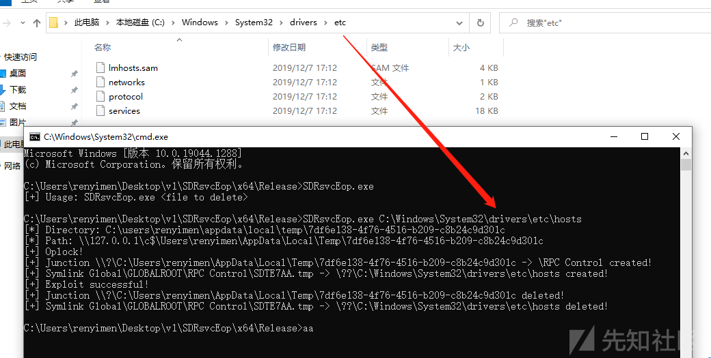](https://xzfile.aliyuncs.com/media/upload/picture/20240104211655-8844d03c-ab03-1.png)

因为此漏洞是条件竞争类型漏洞。所以脚本的利用成功率并不是百分百的。作者也提供了调用cmd.rbs。完整调用cmd的exp。也就是利用msi回滚 cmd.rbs 完成操作。但毕竟是条件竞争型漏洞，所以得要多运行几次才行。

[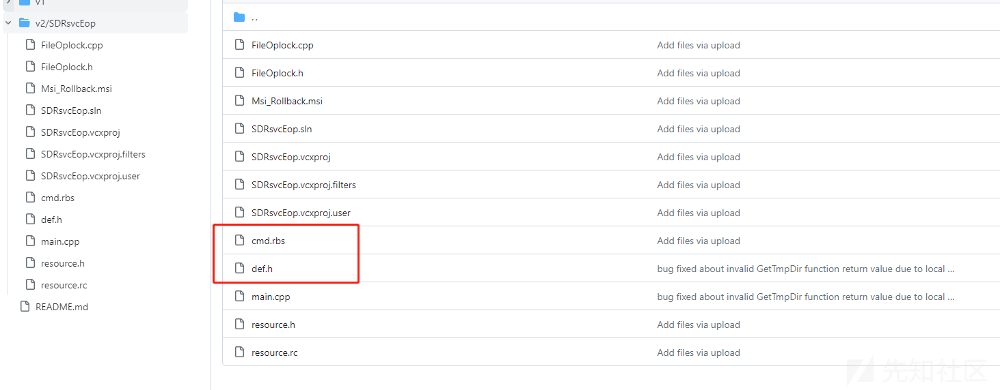](https://xzfile.aliyuncs.com/media/upload/picture/20240104211705-8e48224a-ab03-1.png)

为整个过程中有一个上锁的操作，这样就导致在exp中创建了临时文件时并且将符号链接到了C:/Config.msi::$INDEX\_ALLOCATION 此时msi又被锁住就导致句柄被占用了。而msi线程又同时在监测C:/Config.msi文件的创建和删除，导致循环过程中错过第二次创建的流程，导致线程创建失败。解决方案在参考链接中zoemurmure师傅提出的，就是不进行二次监控，直接释放锁，因为文件创建非常快。这样就可以继续，也可以理解为大力出奇迹，当第一次流程完成之后，直接不断的循环访问终至成功。

参考：  
[https://github.com/googleprojectzero/symboliclink-testing-tools](https://github.com/googleprojectzero/symboliclink-testing-tools)  
[https://github.com/Wh04m1001/CVE-2023-21752](https://github.com/Wh04m1001/CVE-2023-21752)  
[https://www.zerodayinitiative.com/blog/2022/3/16/abusing-arbitrary-file-deletes-to-escalate-privilege-and-other-great-tricks?rq=file%20delete](https://www.zerodayinitiative.com/blog/2022/3/16/abusing-arbitrary-file-deletes-to-escalate-privilege-and-other-great-tricks?rq=file%20delete)  
[https://www.zoemurmure.top/posts/cve\_2023\_21752\_1/](https://www.zoemurmure.top/posts/cve_2023_21752_1/)
