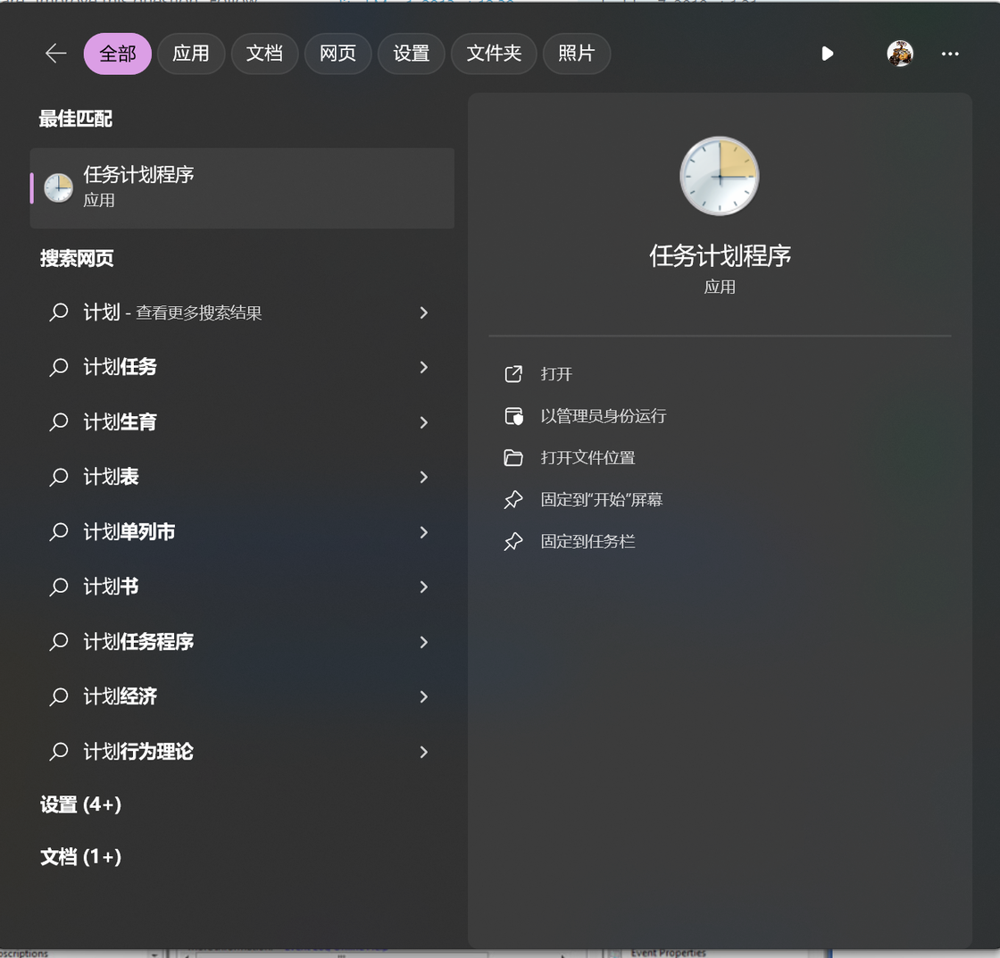
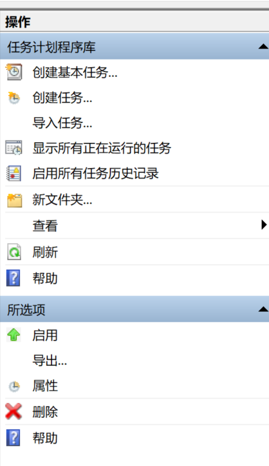
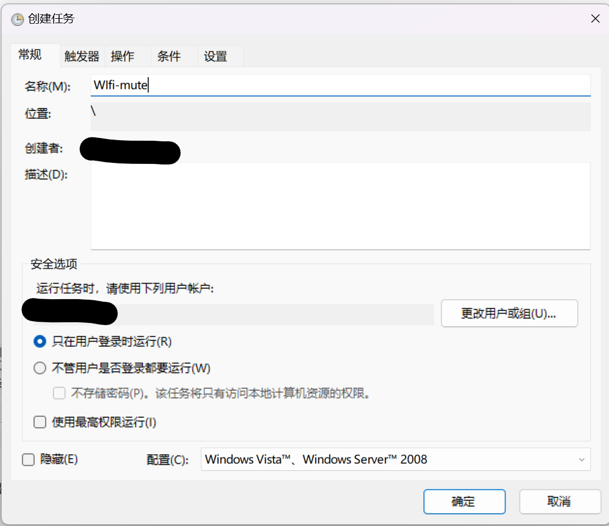
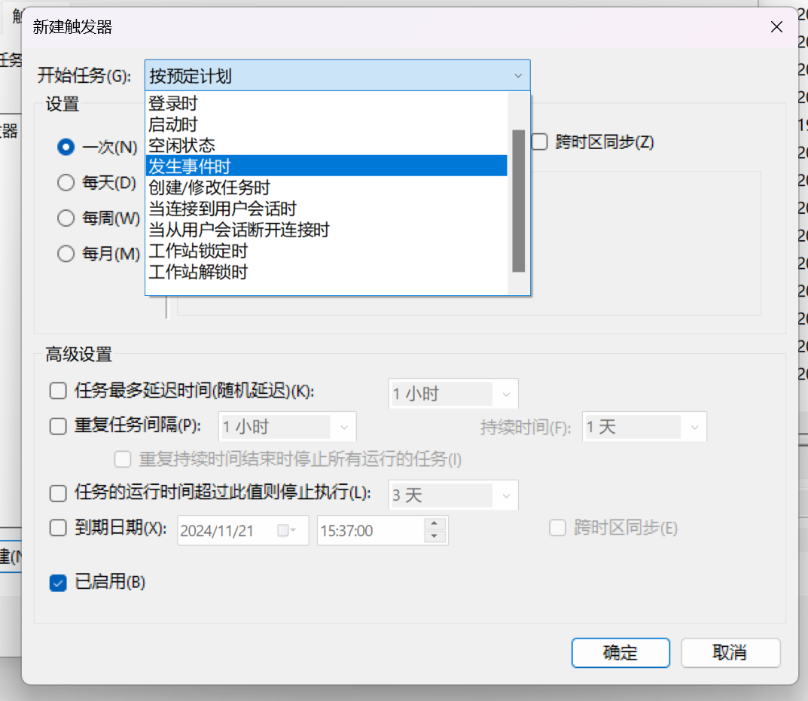
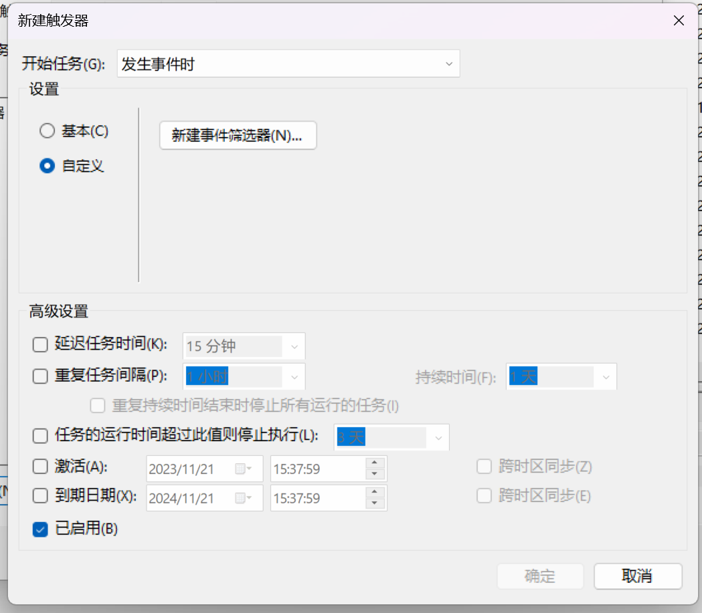
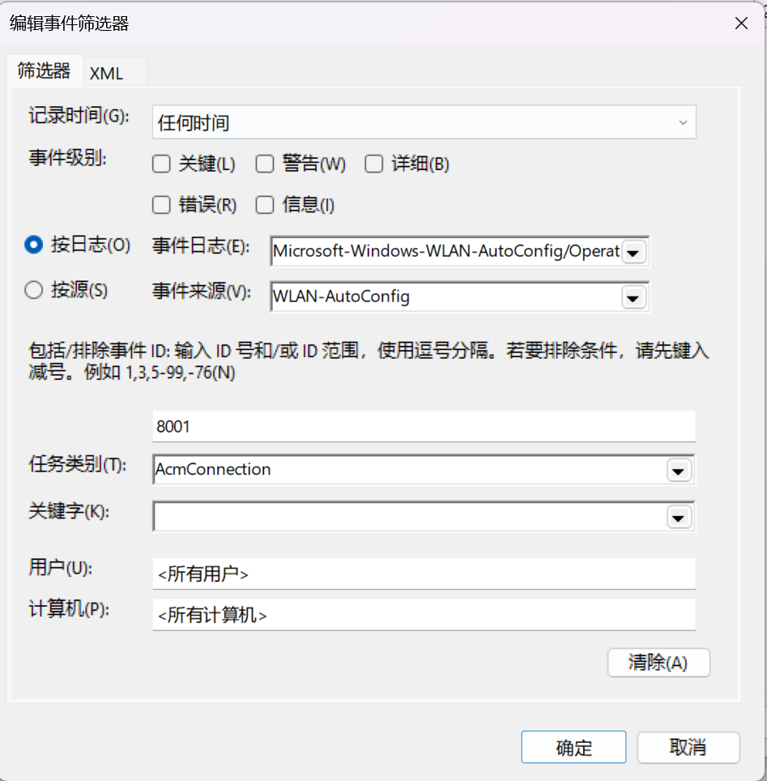
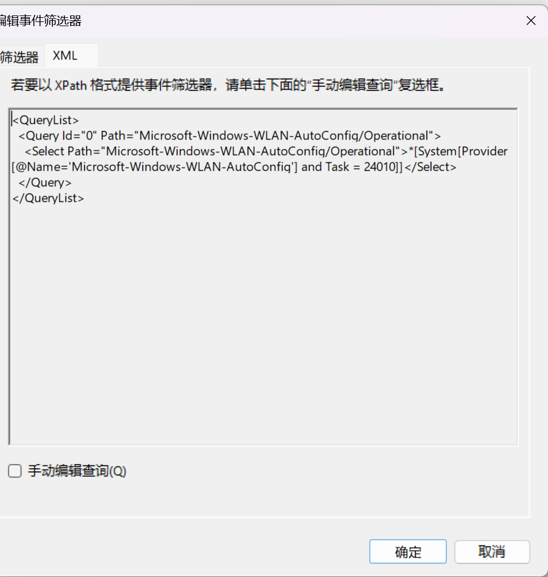
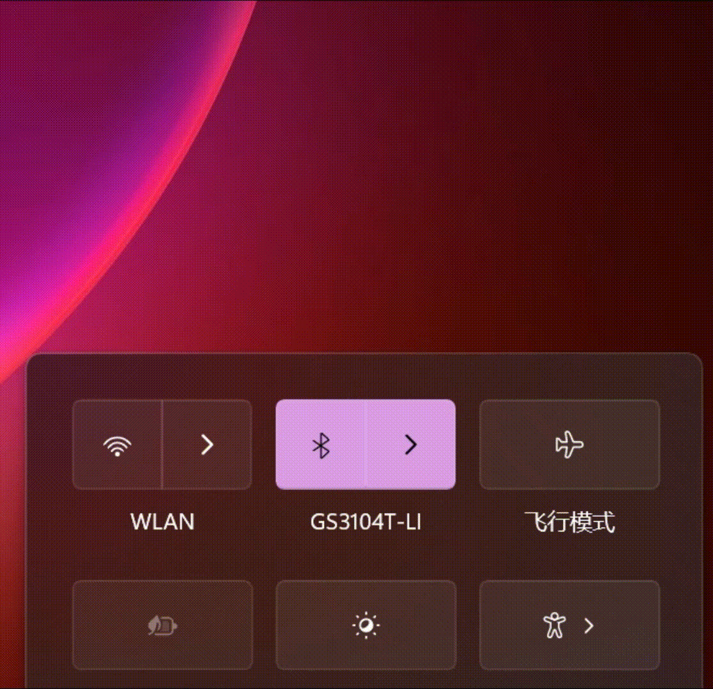

# Windows连接特定WiFi自动静音 - 少数派

不知道你有没有这样的尴尬，笔记本周末带回家，周一拿到办公室，打开potplayer刚想摸摸鱼，小电影的声音就自动播放出来😂，利用Windows计划任务+nircmd命令行小程序帮你连接办公室WiFi时自动静音，不再让悲剧重演！！！

参考链接: [https://superuser.com/questions/92414/how-to-run-a-program-when-connecting-to-a-specific-network-in-windows-7](https://sspai.com/link?target=https%3A%2F%2Fsuperuser.com%2Fquestions%2F92414%2Fhow-to-run-a-program-when-connecting-to-a-specific-network-in-windows-7)  
参考链接： https://superuser.com/questions/92414/how-to-run-a-program-when-connecting-to-a-specific-network-in-windows-7

## NirCmd

官网：[NirCmd - Windows command line tool (nirsoft.net)](https://sspai.com/link?target=https%3A%2F%2Fwww.nirsoft.net%2Futils%2Fnircmd.html)  
官网： NirCmd - Windows命令行工具（nirsoft.net）

NirCmd是一个免费的命令行小工具，可以在不使用UI的条件下进行一些Windows系统控制，如读写注册表、连接VPN、重启系统、创建快捷方式、更改显示设置、关闭显示器等等等等，感兴趣的具体可以看官网介绍。 那么结合任务计划程序，就可以在Windows下完成不少自动化功能，可以说是Windows系统下的简易Tasker了。

## 任务计划程序

任务栏搜索：**任务计划**

右侧点击：**创建任务**

起个名字

切换到**触发器**选项卡，新建-**发生事件时**：

选择自定义单选框，单击**新建时间筛选器**

在**筛选器**选项卡下，选择事件级别：信息（这里实际时利用Windows事件日志来触发自动化，感兴趣的可以任务栏搜索事件查看器试试，可以利用其他事件触发自动化）

事件日志下拉菜单以此选择：**应用程序和服务日志-Microsoft-Windows-WLAN-AutoConfig/Operational**

事件来源选择**WLAN-AutoConfig**

<所有事件-ID> 改为**8001**

任务类别选择**AcmConnection**

如果就在这里打住的话，那么连接任何WiFi都会触发后面的任务，因此还需要根据SSID做更改，切换到XML选项卡；再对应查看**Windows事件查看器**，左侧选择**应用程序和服务日志-Microsoft-Windows-WLAN-AutoConfig/Operational**，找到右侧8001对应的日志。 通过对比可以看出，刚才的选项对应了日志XML文件记录的条目信息，因此只要将SSID条目添加进去，就可以在连接指定WiFi时再触发对应任务了。

点选**手动编辑查询**，只要在`</Select>`前添加`and *[EventData[Data[@Name='SSID']='你的WiFi ssid']]`即可，最终XML如下：

`<QueryList>`

 `<Query Id="0" Path="Microsoft-Windows-WLAN-AutoConfig/Operational">`

   `<Select Path="Microsoft-Windows-WLAN-AutoConfig/Operational">*[System[Provider[@Name='Microsoft-Windows-WLAN-AutoConfig'] and Task = 24010 and (EventID=8001)]]and *[EventData[Data[@Name='SSID']='你的WiFi ssid']] </Select>`

 `</Query>`

`</QueryList>`

## 成果演示

最后，确定保存，返回到操作选项卡，新建，选择启动程序，浏览到NirCmd存放位置，添加参数填入mutesysvolume 1，确定保存，输入密码，大功告成。 

 利用同样的方法，你也可以选择连接家庭WiFi或断开公司WiFi时，自动恢复音量等等，举一反三，这里就不详细说明啦。
