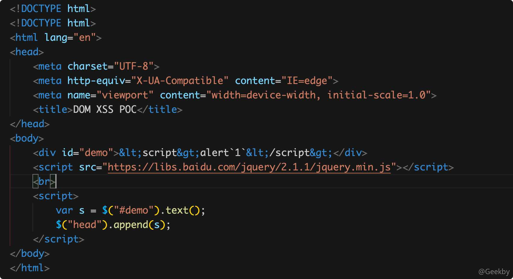
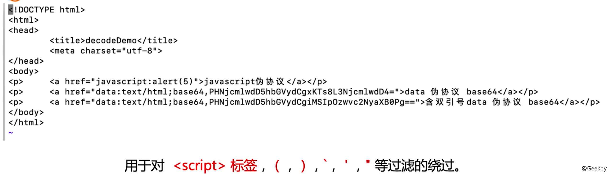
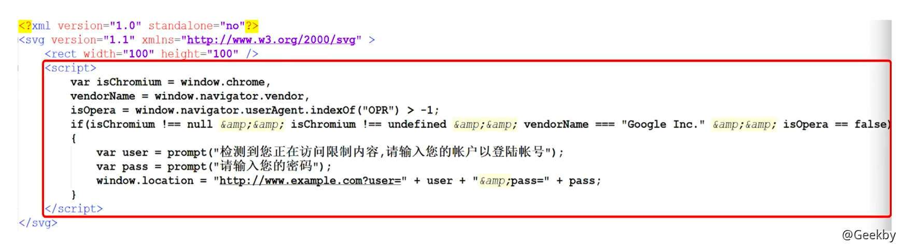
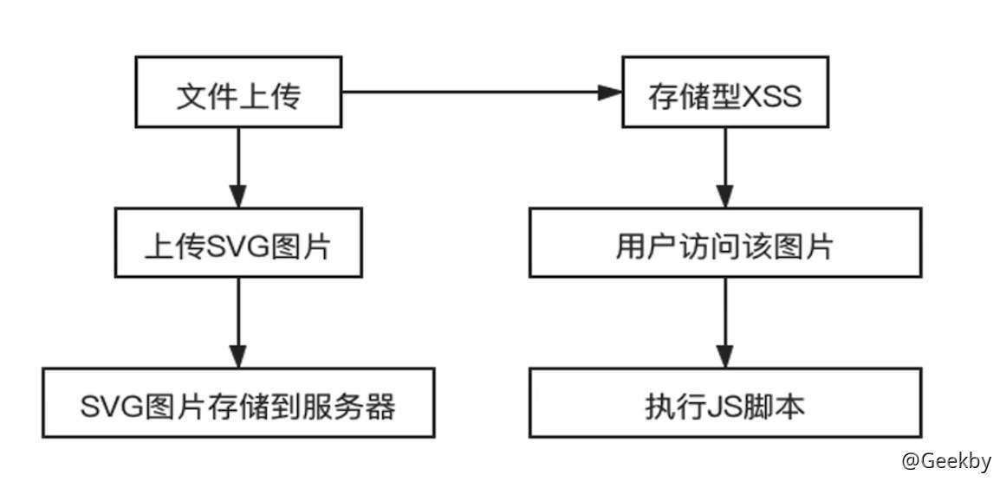

# [](#xss-%E6%BC%8F%E6%B4%9E%E7%9B%B8%E5%85%B3)XSS 漏洞相关

## [](#1-%E5%AE%9A%E4%B9%89%E5%8F%8A%E5%8E%9F%E7%90%86)1 定义及原理

> XSS(跨站脚本攻击)，浏览器将用户输入的内容当做脚本执行，执行了恶意的功能，这种针对用户浏览器的攻击，即跨站脚本攻击

主要分为三个类型：

-   反射型
-   存储型
-   DOM 型

XSS 危害：

-   盗取 cookie
-   盗取账户
-   恶意软件下载
-   键盘记录
-   广告引流

## [](#2-%E5%8F%8D%E5%B0%84%E5%9E%8B-xss)2 反射型 XSS

### [](#21-%E5%8E%9F%E7%90%86)2.1 原理

应用程序或 API 包含**未经验证和未经转义的用户输入，直接作为 HTML 输出的一部分**。一个成功的攻击可以让攻击者在受害者的浏览器中执行任意的 HTML 和 JavaScript。

特点：非持久化，必须用户点击带有特定参数的链接才能引起。

影响范围：仅执行脚本的用户。

## [](#3-%E5%AD%98%E5%82%A8%E5%9E%8B-xss)3 存储型 XSS

### [](#31-%E5%8E%9F%E7%90%86)3.1 原理

存储型 XSS 是指应用程序通过 Web 请求获取不可信赖的数据，在未检验数据是否存在 XSS 代码的情况下，便将其**存入数据库**。当下一次从数据库中获取该数据时程序也**未对其进行过滤**，页面再次执行 XSS 代码，存储型 XSS 可以持续攻击用户。

存储型 XSS 出现位置：

-   留言板
-   评论区
-   用户头像
-   个性签名
-   博客

## [](#4-dom-%E5%9E%8B-xss)4 DOM 型 XSS

### [](#41-%E5%8E%9F%E7%90%86)4.1 原理

#### [](#411-dom)4.1.1 DOM

DOM 模型用一个**逻辑树**来表示一个文档，每个分支的终点都是一个节点(node)，每个节点都包含着对象(objects)。DOM 的方法(methods)让你可以用特定方式操作这个树，用这些方法你可以改变文档的结构、样式或者内容。


#### [](#412-dom-xss)4.1.2 DOM XSS

DOM 型 XSS 其实是一种特殊类型的反射型 XSS，通过 **JS 操作 DOM 树**动态地**输出数据到页面**，而不依赖于将数据提交给服务器端，它是基于 DOM 文档对象模型的一种漏洞。

|     |     |     |
| --- | --- | --- |
| ```plain<br>1<br>2<br>3<br>4<br>5<br>6<br>7<br>``` | ```html<br><html><br>    <body><br>        <script><br>            document.write("<script>alert(1)<\/script>")<br>        </script><br>    </body><br></html><br>``` |

#### [](#413-%E7%A4%BA%E4%BE%8B)4.1.3 示例

首先这是一个 DOM XSS，产生的原因是 JS 代码动态拼接了一个类似这样的代码：

|     |     |     |
| --- | --- | --- |
| ```plain<br>1<br>``` | ```javascript<br>$("head").append("<meta>"+text+"</meta>")<br>``` |

以下面的 POC 为例：



可以看到 div 中的代码是被 HTML 实体编码后的形式，但是最后结果还是会弹窗


原因在于 innerHTML 输入进去的代码是不会被执行的。

比如你按如下代码来动态插入一个DOM节点

|     |     |     |
| --- | --- | --- |
| ```plain<br> 1<br> 2<br> 3<br> 4<br> 5<br> 6<br> 7<br> 8<br> 9<br>10<br>11<br>12<br>13<br>14<br>15<br>16<br>17<br>18<br>19<br>``` | ```html<br><!DOCTYPE html><br><!DOCTYPE html><br><html lang="en"><br><head><br>    <meta charset="UTF-8"><br>    <meta http-equiv="X-UA-Compatible" content="IE=edge"><br>    <meta name="viewport" content="width=device-width, initial-scale=1.0"><br>    <title>DOM XSS POC</title><br></head><br><body><br>    <div id="demo">&lt;script&gt;alert`1`&lt;/script&gt;</div><br>    <script src="https://libs.baidu.com/jquery/2.1.1/jquery.min.js"></script><br>    <br><br>    <div id="test"></div><br>    <script><br>        document.getElementById("test").innerHTML = document.getElementById("demo").innerHTML + "";<br>    </script><br></body><br></html><br>``` |

会发现 `<div id=test>` 标签不会被执行，但是 jquery 之类的框架会在插入的时候把节点的标签 eval 下，使得它可以执行，因为这个 append() 方法本身就是要让插入的元素执行，有这个需求的。

#### [](#414-%E4%B8%8E%E5%8F%8D%E5%B0%84%E5%9E%8B-xss-%E7%9A%84%E5%BC%82%E5%90%8C%E4%B8%8E%E5%8D%B1%E5%AE%B3)4.1.4 与反射型 XSS 的异同与危害

**同：**

都是没有控制好输入，并且把 javascript 脚本输入作为输出插入到 HTML 页面。

**异：**

反射型 XSS 是**经过后端语言**后，页面引用后端输出生效。

DOM XSS 是经过 JS 对 DOM 树**直接操作**后插入到页面。

**危害性：**

前后端分离，不经过 WAF 的检测。

## [](#5-%E4%BC%AA%E5%8D%8F%E8%AE%AE%E4%B8%8E%E7%BC%96%E7%A0%81%E7%BB%95%E8%BF%87)5 伪协议与编码绕过

### [](#51-%E4%BC%AA%E5%8D%8F%E8%AE%AE)5.1 伪协议

伪协议不同于因特网上所广泛使用的如 `http://、https://、ftp://` 在 URL 中使用，用于执行特定的功能

Data 伪协议：

`data:text/html;base64, PHNjcmlwdD5hbGVydCgxKTs8L3NjcmlwdD4=`

JavaScript 伪协议：

`javascript::alert("1")`



### [](#52-%E7%BC%96%E7%A0%81%E7%BB%95%E8%BF%87)5.2 编码绕过

#### [](#521-unicode-%E7%BC%96%E7%A0%81)5.2.1 UNICODE 编码

ISO(国际标谁化组织)制定的包括了地球上所有文化所有字母和符号的编码，使用**两个字节**表示一个字符

Unicode 只是一个符号集，它只规定了符号的二进制代码，却没有规定这个二进制代码应该如何存储。具体存储由：UTF-8，UTF-16 等实现


#### [](#522-%E6%B5%8F%E8%A7%88%E5%99%A8%E8%A7%A3%E7%A0%81)5.2.2 浏览器解码

解析一篇 HTML 文档时主要有三个处理过程：

HTML 解析并创建 DOM 树，URL 解析和 JavaScript 解析。每个解析器负责解码和解析 HTML 文档中它所对应的部分，且顺序也有所区别。

#### [](#523-html-%E8%A7%A3%E6%9E%90%E8%BF%87%E7%A8%8B)5.2.3 HTML 解析过程

##### [](#5231-%E8%A7%A3%E6%9E%90%E8%BF%87%E7%A8%8B)5.2.3.1 解析过程

**HTML 有 5 类元素：**

1.  空元素(Void elements)，有 area、base、br、col、command、embed、hr、img、input、keygen、link、meta、param、source、track、wbr 等
    
2.  原始文本元素(Raw text elements)，有 <script> 和 <style>
    
3.  RCDATA 元素(RCDATA elements)，有 <textarea> 和 <title>
    
4.  外部元素(Foreign elements)，例如 MathML 命名空间或者 SVG 命名空间的元素
    
5.  基本元素(Normal elements)，即除了以上 4 种元素以外的元素
    

**五类元素的区别如下：**

1.  空元素，不能容纳任何内容（因为它们没有闭合标签，没有内容能够放在开始标签和闭合标签中间）。
    
2.  原始文本元素，可以容纳文本。
    
3.  RCDATA 元素，可以容纳文本和字符引用。
    
4.  外部元素，可以容纳文本、字符引用、CDATA 段、其他元素和注释
    
5.  基本元素，可以容纳文本、字符引用、其他元素和注释
    

HTML 解析器以状态机的方式运行，它从文档输入流中消耗字符并根据其转换规则转换到不同的状态。


以如下代码作为示例：

|     |     |     |
| --- | --- | --- |
| ```plain<br>1<br>2<br>3<br>4<br>5<br>``` | ```html<br><html><br> <body><br>   This is Geekby's blog<br> </body><br></html><br>``` |

1.  初始状态为 「Data」State，当遇到 < 字符，状态变为 「Tag open」state，读取一个 a-z 的字符将产生一个开始标签符号，状态相应变为「Tag name」state，一直保持这个状态直到读取到 >，每个字符都附加到这个符号名上，例子中创建的是一个 html 符号。
    
2.  当读取到 >，当前的符号就完成了，此时，状态回到「Data」state，<body> 标签重复这一处理过程。此时，html 和 body 标签都识别出来了。现在，回到「Data」State，读取「This is Geekby’s blog」中的每个字符生成一个字符符号。
    
3.  这样直到遇到 </body> 中的 <。现在，又回到了「Tag open」，读取下一个字符 /，进入到「Close tag open」，创建一个闭合标签符号，并且状态转移到 「Tag name」state，还是保持这一状态，直到遇到 >。然后，产生一个新的标签符号并回到「Data」State。后面的闭合标签处理过程同上。
    

信息

HTML 解析器处于**数据状态（Data State）**、**RCDATA 状态（RCDATA State）**、**属性值状态（Attribute ValueState）时**，字符实体会被解码为对应的字符。

示例

|     |     |     |
| --- | --- | --- |
| ```plain<br>1<br>``` | ```html<br><div>&#60;img src=x onerror=alert(4)&#62;</div><br>``` |

< 和 > 被编码为字符实体 &#60; 和 &#62;。 当 HTML 解析器解析完 <div> 时，会进入数据状态并发布标签令牌。 接着解析到实体 &#60; 时因为处在数据状态,就会对实体进行解码为 <， 后面的 &#62; 同样道理被解码为 >。

问题

被解码后，img 是否会被解析为 HTML 标签而导致 JS 执行呢？

因为解析器在使用字符引用后不会转换到标签打开状态（Tag Open State），不进入标签打开状态就不会被发布为 HTML 标签。因此，不会创建新 HTML 标签，只会将其作为数据来处理。

##### [](#5232-%E5%87%A0%E7%A7%8D%E7%89%B9%E6%AE%8A%E6%83%85%E5%86%B5)5.2.3.2 几种特殊情况

-   原始文本元素

在 HTML中，属于 Raw text elements 的标签有两个：script、style。在 Raw text elements 类型标签下的所有内容块都属于该标签。

Raw textelements 类型标签下的所有字符实体编码都不会被 HTML 解码。HTML 解析器解析到 script、style 标签的内容块（数据）部分时，状态会进入 Script Data State，该状态并不在我们前面说的会解码字符实体的三条状态之中。

因此，`<script>&#97;&#108;&#101;&#114;&#116&#40;&#57;&#41;&#59</script>` 这样字符实体并不会被解码，也就不会执行 JS。

-   RCDATA 情况

在 HTML中，属于 RCDATA 的标签有两个：textarea、title。

RCDATA Elements 类型的标签可以包含文本内容和字符实体。

解析器解析到 textarea、title 标签的数据部分时，状态会进入 RCDATA State。

前面我们提到，处于 RCDATA State 状态时，字符实体是会被解析器解码的。

示例

|     |     |     |
| --- | --- | --- |
| ```plain<br>1<br>``` | ```html<br><textarea>&#60;script&#62;alert(5)&#60;/script&#62;</textarea><br>``` |

解析器解析到它们时会进行解码

但是里面的 JS 同样还是不会被执行，原因还是因为解码字符实体状态机不会进入标签打开状态（Tag Open State），因此里面的 `<script>` 并不会被解析为 HTML 标签

#### [](#524-javascript-%E8%A7%A3%E6%9E%90)5.2.4 JavaScript 解析

形如 \\uXXXX 这样的 Unicode 字符转义序列或 Hex 编码是否能被解码需要看情况。

首先，JavaScript 中有三个地方可以出现 Unicode 字符转义序列：

1.  字符串中

Unicode 转义序列出现在字符串中时，它只会被解释为普通字符，而不会破坏字符串的上下文。

例如，`<script>alert("\u0031\u0030");</script>`

被编码转义的部分为 10，是字符串，会被正常解码，JS 代码也会被执行。

2.  标识符中

若 Unicode 转义序列存在于标识符中，即变量名（如函数名等…），它会被进行解码。

例如，`<script>\u0061\u006c\u0065\u0072\u0074(10);</script>`

被编码转义的部分为 alert 字符，是函数名，属于在标识符中的情况，因此会被正常解码，JS 代码也会被执行。

3.  控制字符中

若 Unicode 转义序列存在于控制字符中，那么它会被解码但不会被解释为控制字符，而会被解释为标识符或字符串字符的一部分。

控制字符即 ‘、"、() 等。

例如，`<script>alert\u0028"xss");</script>`，`(` 进行了 Unicode 编码，那么解码后它不再是作为控制字符，而是作为标识符的一部分alert( 。

因此函数的括号之类的控制字符进行 Unicode 转义后是不能被正常解释的。

示例

|     |     |     |
| --- | --- | --- |
| ```plain<br>1<br>``` | ```html<br><script>\u0061\u006c\u0065\u0072\u0074\u0028\u0031\u0031\u0029</script><br>``` |

被编码部分为 alert(11)。该例子中的 JS 不会被执行，因为控制字符被编码了。

|     |     |     |
| --- | --- | --- |
| ```plain<br>1<br>``` | ```html<br><script>\u0061\u006c\u0065\u0072\u0074(\u0031\u0032)</script><br>``` |

被编码部分为 alert 及括号内为 12。该例子中 JS 不会被执行，原因在于括号内被编码的部分不能被正常解释，要么使用 ASCII 数字，要么加 "” 或 ' ' 使其变为字符串，作为字符串也只能作为普通字符。

|     |     |     |
| --- | --- | --- |
| ```plain<br>1<br>``` | ```html<br><script>alert('13\u0027)</script><br>``` |

被编码处为`'`。该例的 JS 不会执行，因为控制字符被编码了，解码后的 `'` 将变为字符串的一部分，而不再解释为控制字符。因此该例中字符串是不完整的，因为没有 `'` 来结束字符串。

|     |     |     |
| --- | --- | --- |
| ```plain<br>1<br>``` | ```html<br><script>alert('14\u000a')</script><br>``` |

该例的 JS 会被执行，因为被编码的部分处于字符串内，只会被解释为普通字符，不会突破字符串上下文。

#### [](#525-url-%E8%A7%A3%E6%9E%90)5.2.5 URL 解析

URL 解析器也被建模为状态机，文档输入流中的字符可以将其导向不同的状态。

首先，要注意的是 URL 的协议部分必须为 ASCII 字符，即不能被任何编码，否则 URL 解析器的状态机将进入 No Scheme 状态。

示例

|     |     |     |
| --- | --- | --- |
| ```plain<br>1<br>``` | ```html<br><a href="%6a%61%76%61%73%63%72%69%70%74:%61%6c%65%72%74%28%31%29"></a><br>``` |

URL 编码部分的是 javascript:alert(1)。JS 不会被执行，因为作为 Scheme 部分的 javascript 这个字符串被编码，导致 URL 解析器状态机进入 No Scheme 状态。

URL中的 `:` 也不能被以任何方式编码，否则 URL 解析器的状态机也将进入 No Scheme 状态。

示例

|     |     |     |
| --- | --- | --- |
| ```plain<br>1<br>``` | ```html<br><a href="javascript%3aalert(3)"></a><br>``` |

由于 : 被URL编码为 %3a，导致 URL 状态机进入 No Scheme 状态， JS 代码不能执行。

示例

|     |     |     |
| --- | --- | --- |
| ```plain<br>1<br>``` | ```html<br><a href="&#x6a;&#x61;&#x76;&#x61;&#x73;&#x63;&#x72;&#x69;&#x70;&#x74;:%61%6c%65%72%74%28%32%29"><br>``` |

`javascript` 这个字符串被实体化编码，`:` 没有被编码，`alert(2)` 被 URL 编码。可以成功执行。

首先，在 HTML 解析器中，HTML 状态机处于属性值状态（Attribute Value State）时，字符实体时会被解码的，此处在 href 属性中，所以被实体化编码的 javascript 字符串会被解码。

其次，HTML 解析是在 URL 解析之前的，所以在进行 URL 解析之前，Scheme 部分的 javascript 字符串已被解码，而并不再是被实体编码的状态。

#### [](#526-%E8%A7%A3%E6%9E%90%E9%A1%BA%E5%BA%8F)5.2.6 解析顺序

首先浏览器接收到一个 HTML 文档时，会触发 HTML 解析器对 HTML 文档进行词法解析，这一过程完成 HTML 解码并创建 DOM 树。

接下来 JavaScript 解析器会介入对内联脚本进行解析，这一过程完成 JS 的解码工作。

如果浏览器遇到需要 URL 的上下文环境，这时 URL 解析器也会介入完成 URL 的解码工作，URL 解析器的解码顺序会根据 URL 所在位置不同，可能在 JavaScript 解析器之前或之后解析。HTML 解析总是第一步。 URL 解析和 JavaScript 解析，它们的解析顺序要根据情况而定。

示例

|     |     |     |
| --- | --- | --- |
| ```plain<br>1<br>``` | ```html<br><a href="UserInput"></a><br>``` |

该例子中，首先由 HTML 解析器对 UserInput 部分进行字符实体解码；

接着 URL 解析器对 UserInput 进行 URL decode；如果 URL 的 Scheme 部分为 javascript 的话，JavaScript 解析器会再对 UserInput 进行解码。所以解析顺序是：HTML 解析->URL 解析->JavaScript 解析。

示例

|     |     |     |
| --- | --- | --- |
| ```plain<br>1<br>``` | ```html<br><a href=# onclick="window.open('UserInput')"></a><br>``` |

该例子中，首先由 HTML 解析器对 UserInput 部分进行字符实体解码；

接着由 JavaScript 解析器会再对 onclick 部分的 JS 进行解析并执行 JS；

执行 JS 后 window.open(‘UserInput’) 函数的参数会传入 URL，所以再由 URL 解析器对 UserInput 部分进行解码。

因此解析顺序为：HTML 解析->JavaScript 解析->URL 解析。

示例

|     |     |     |
| --- | --- | --- |
| ```plain<br>1<br>``` | ```html<br><a href="javascript:window.open('UserInput')"><br>``` |

该例子中，首先还是由 HTML 解析器对 UserInput 部分进行字符实体解码；接着由 URL 解析器解析 href 的属性值；然后由于 Scheme 为 javascript，所以由 JavaScript 解析；

解析执行 JS 后 window.open(‘UserInput’) 函数传入 URL，所以再由 URL 解析器解析。

所以解析顺序为：HTML 解析->URL 解析->JavaScript 解析->URL 解析。

**参考**

[https://mp.weixin.qq.com/s/liODgY4NjYqdWg3JgPXMdA](https://mp.weixin.qq.com/s/liODgY4NjYqdWg3JgPXMdA)

## [](#6-html-5-%E6%96%B0%E7%89%B9%E6%80%A7%E5%8F%8A%E7%9B%B8%E5%BA%94%E7%9A%84%E5%AE%89%E5%85%A8%E5%88%86%E6%9E%90)6 HTML 5 新特性及相应的安全分析

### [](#61-svg)6.1 SVG

SVG 意为可缩放矢量图形，这是一种使用 XML 格式定义图像的方式

SVG 中的 JS

|     |     |     |
| --- | --- | --- |
| ```plain<br>1<br>2<br>3<br>4<br>5<br>``` | ```xml<br><?xml version="1.0" standalone="no"?><br><svg width="100%" height="100%" version="1.1" xmlns="http://www.w3.org/2000/svg"><br>	<rect width="100" height="100" style="fill:rgb(0,0,255);stroke-width:1;stroke:rgb(0,0,0)" /><br>  <script>alert(1)</script><br></svg><br>``` |

当访问上面的文件定义的图片时，会弹窗

利用 SVG 进行钓鱼



整体流程



### [](#62-web-storage)6.2 Web Storage

Web Storage 包含两个部分，一部分是 session Storage，另一部分是 localStorage。

-   sessionStorage：用于本地存储一个会话(session)中的数据，这些数据只有在同一个会话中的页面才能访问并且当会话结束后数据也随之销毁。
-   localStorage：用户持久化的本地存储，除非主动删除数据，否则数据是永远不会过期的。

新的 HTML5 Web 存储 API 使 Web 开发人员可以在用户的计算机上存储大约 5 兆字节的数据(而 Cookie 中仅允许 4KB 的数据)。

利用 SVG 盗取 localStorage

|     |     |     |
| --- | --- | --- |
| ```plain<br> 1<br> 2<br> 3<br> 4<br> 5<br> 6<br> 7<br> 8<br> 9<br>10<br>11<br>12<br>13<br>14<br>15<br>16<br>17<br>``` | ```html<br><?xml version="1.0" standalone="no"?><br><svg version="1.1" xmlns="http://www.w3.org/2000/svg" ><br>    <rect width="100" height="100" /><br>    <script><br>        if(localStorage.length)<br>        {<br>            for(key in localStorage)<br>            {<br>                if(localStorage.getItem(key))<br>                {<br>                    console.log(key);<br>                    console.log(localStorage.getItem(key));<br>                }<br>            }<br>        }<br>    </script><br></svg><br>``` |
