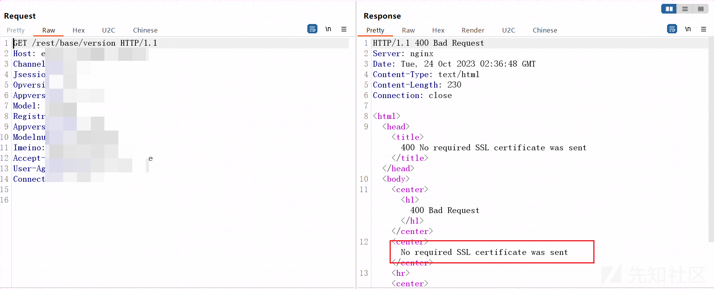
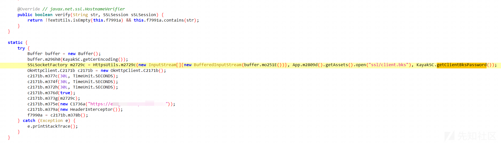
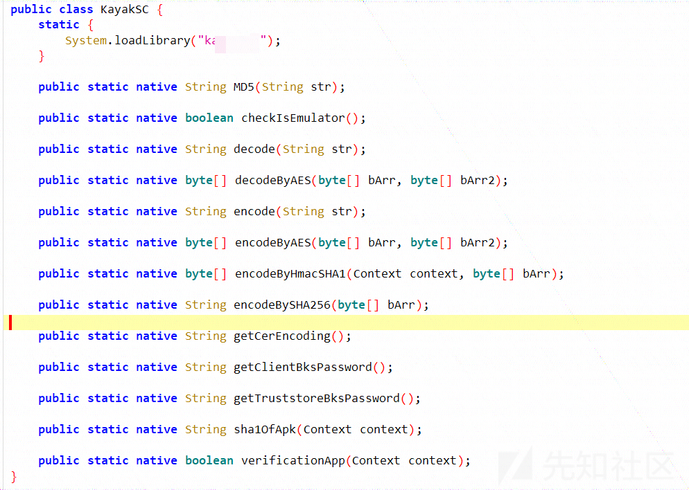
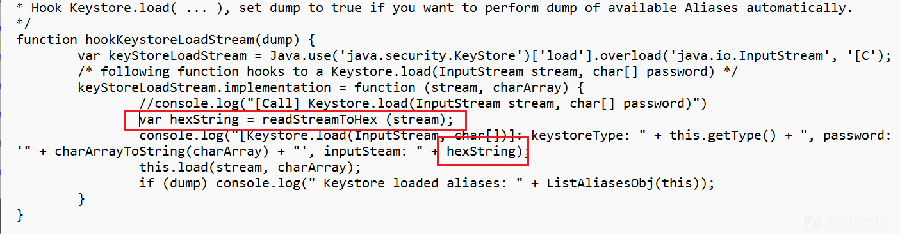
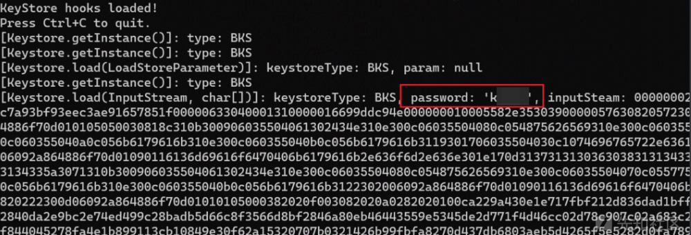
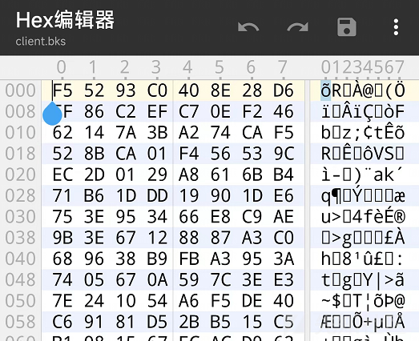
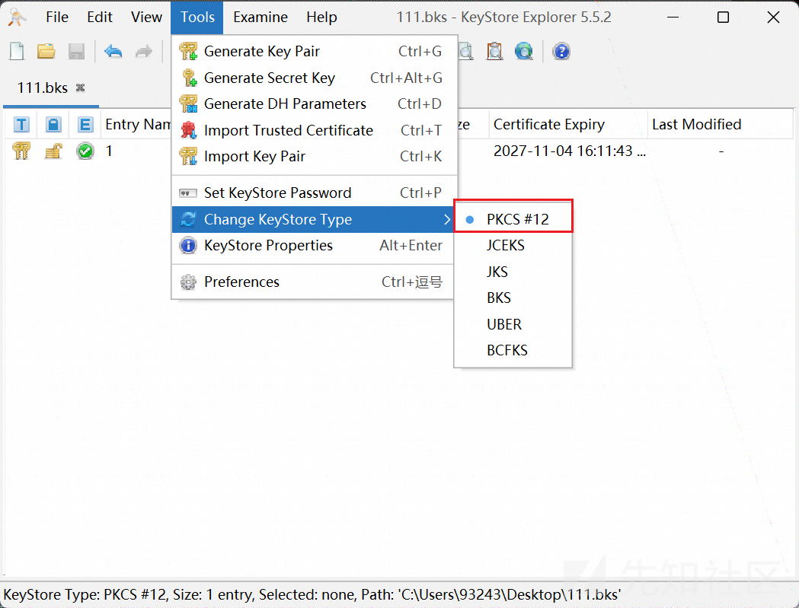
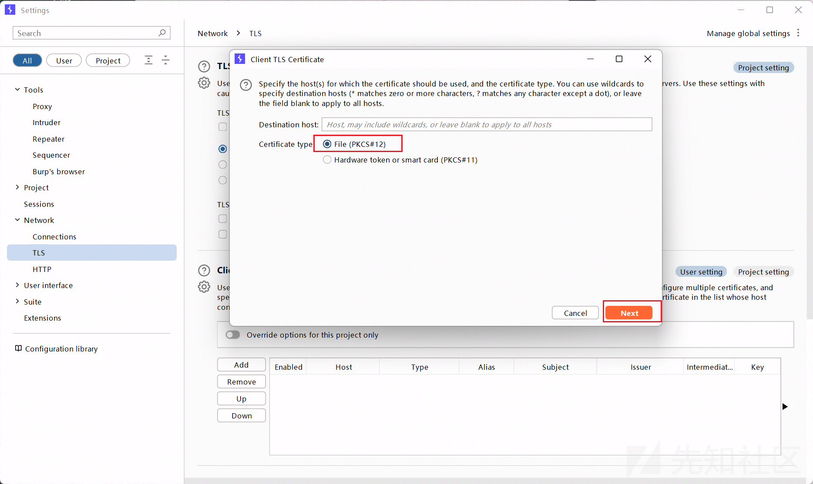
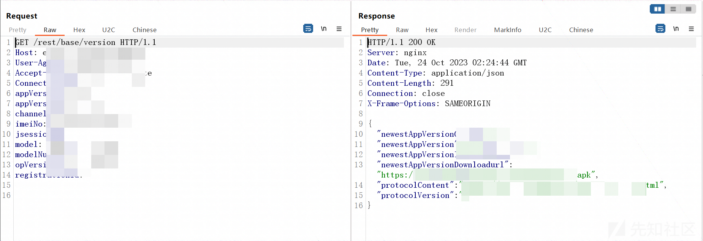

# app bks证书双向认证抓包 - 先知社区

app bks证书双向认证抓包

- - -

### 0x1 概述

首先，网上关于双向认证的文章还是挺多的，关于某灵魂双向认证的文章大家应该都看过，原理就是将p12证书和分析APP源码得到密码导入burp即可抓到包。而本次分享的双向认证是关于bks证书抓包的，网上关于bks证书双向认证抓包的文章好像挺少的，在查阅时，偶然看到一篇大佬的文章也是关于bks的，并且本篇文章后续也用到了大佬推荐的工具，文章附上，大家可以查阅：[https://www.52pojie.cn/forum.php?mod=viewthread&tid=1637354&extra=&highlight=%CB%AB%CF%F2%C8%CF%D6%A4&page=1](https://www.52pojie.cn/forum.php?mod=viewthread&tid=1637354&extra=&highlight=%CB%AB%CF%F2%C8%CF%D6%A4&page=1)

### 0x2 获取证书及密码

这里拿到的是一个\*\*\*加固的APP，并且经测试frida可以直接挂上，那么脱壳的过程就不必再说了，网上文章也挺多，这里将壳脱出来后先备用。我们先使用WIFI代理进行抓包，抓包发现返回400错误

[](https://xzfile.aliyuncs.com/media/upload/picture/20231107122700-e5321fcc-7d25-1.png)

并且可以在上图中观察到经典的No required SSL certificate was sent，到这里我们就比较清晰地了解到了这是做了双向认证的意思。那么我们现在要做的就是找到证书以及密码，通常来说，证书会存放在APP安装包里，密码会存在源代码里或者SO文件里。通过查阅资料，了解到APP的双向认证会存放的证书格式有：p12、pfx、bks。在翻找APP资源文件时，确实也找到了bks后缀的文件，以及使用keytool将其打包的jar包，但是这里踩坑了一晚上，原因是bks文件的文件内容并非bks真实的内容，分析APP代码也未见有对其加解密类似的操作。

因为APP安装包里有bks文件，因此搜索.bks定位到这里，可以看到右边KayakSC.getClientBksPassword()用来获取密码

[](https://xzfile.aliyuncs.com/media/upload/picture/20231107122724-f364801c-7d25-1.png)

定位到getClientBksPassword函数，可以观察到是native

[](https://xzfile.aliyuncs.com/media/upload/picture/20231107122805-0bc41e9c-7d26-1.png)

那么此时直接hook这个函数拿返回值就完事了，so分析就不再去看了。hook的方法也不再说了，这里我们采用上面大佬文章中的tracer-keystore进行hook

[https://github.com/FSecureLABS/android-keystore-audit/blob/master/frida-scripts/tracer-keystore.js](https://github.com/FSecureLABS/android-keystore-audit/blob/master/frida-scripts/tracer-keystore.js)

下载这个脚本，修改脚本中的hookKeystoreLoadStream函数为如下图所示样式：

[](https://xzfile.aliyuncs.com/media/upload/picture/20231107122823-16b60a86-7d26-1.png)

也可以直接使用下方修改好的函数替换

```plain
function hookKeystoreLoadStream(dump) {
    var keyStoreLoadStream = Java.use('java.security.KeyStore')['load'].overload('java.io.InputStream', '[C');
    /* following function hooks to a Keystore.load(InputStream stream, char[] password) */
    keyStoreLoadStream.implementation = function (stream, charArray) {
        //console.log("[Call] Keystore.load(InputStream stream, char[] password)")
        var hexString = readStreamToHex (stream);
        console.log("[Keystore.load(InputStream, char[])]: keystoreType: " + this.getType() + ", password: '" + charArrayToString(charArray) + "', inputSteam: " + hexString);
        this.load(stream, charArray);
        if (dump) console.log(" Keystore loaded aliases: " + ListAliasesObj(this));
    }
}
```

最后frida启动，如下图所示，获取到证书的密码以及证书的十六进制。

[](https://xzfile.aliyuncs.com/media/upload/picture/20231107122852-27dda602-7d26-1.png)

这里我对比了一下APP里的证书十六进制，发现这根本对不上号，折腾了我一晚上

[](https://xzfile.aliyuncs.com/media/upload/picture/20231107122934-40fd1f8c-7d26-1.png)

那么我们直接用hook到的证书十六进制导入winhex，然后保存文件为bks证书即可，紧接着用大佬里的工具keystore-explorer，[https://keystore-explorer.org/downloads.html](https://keystore-explorer.org/downloads.html)

使用该工具将导出的bks证书转换为p12，要求输入密码时，输入hook获取到的密码即可，最后点击保存按钮

[](https://xzfile.aliyuncs.com/media/upload/picture/20231107122956-4da6c83c-7d26-1.png)

### 0x3 导入证书抓包

最后就是导入burp或charles愉快地抓包了，burp找到设置里的network-tls页面，点击下方的add按钮

[](https://xzfile.aliyuncs.com/media/upload/picture/20231107123028-60d0464a-7d26-1.png)

随后按后续的要求导入转换为p12格式的证书（还是原先winhex保存的bks文件）以及密码，导入成功后直接抓包，可以看到心爱的HTTP报文了

[](https://xzfile.aliyuncs.com/media/upload/picture/20231107123041-68d12ee0-7d26-1.png)
