# cacti cve-2020-35701 后台sql注入到后台RCE 分析 - 先知社区

cacti cve-2020-35701 后台sql注入到后台RCE 分析

- - -

漏洞简介:Cacti是Cacti团队的一套开源的网络流量监测和分析工具。该工具通过snmpget来获取数据，使用RRDtool绘画图形进行分析，并提供数据和用户管理功能。

Cacti 1.2.x through 1.2.16 存在SQL注入漏洞，该漏洞允许经过身份验证的远程攻击者通过site\_id参数执行任意SQL命令，导致远程代码执行。

漏洞复现: 在date\_debug.php中：

[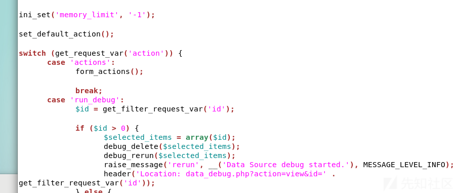](https://xzfile.aliyuncs.com/media/upload/picture/20231115135220-2462b584-837b-1.png)  
首先获取了action的参数 使用switch来分别对不同的参数进行不同的操作，在action=ajax\_hosts时 cacti会获取site\_id的参数 并且没有添加任何的过滤

[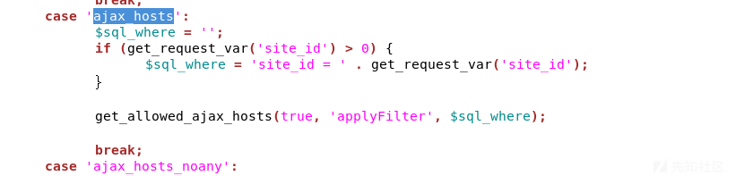](https://xzfile.aliyuncs.com/media/upload/picture/20231115135243-31b1a6aa-837b-1.png)  
获取到site\_id参数后 直接跳到auth.php的get\_allowed\_ajax\_hosts函数

[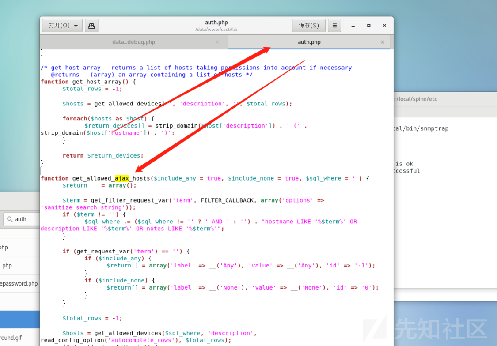](https://xzfile.aliyuncs.com/media/upload/picture/20231115135301-3c86acf6-837b-1.png)  
接着读取代码 并没有对传入进来的sql语句进行过滤 直接拼接到get\_allowed\_devices(auth.php中)函数获取hosts的值

[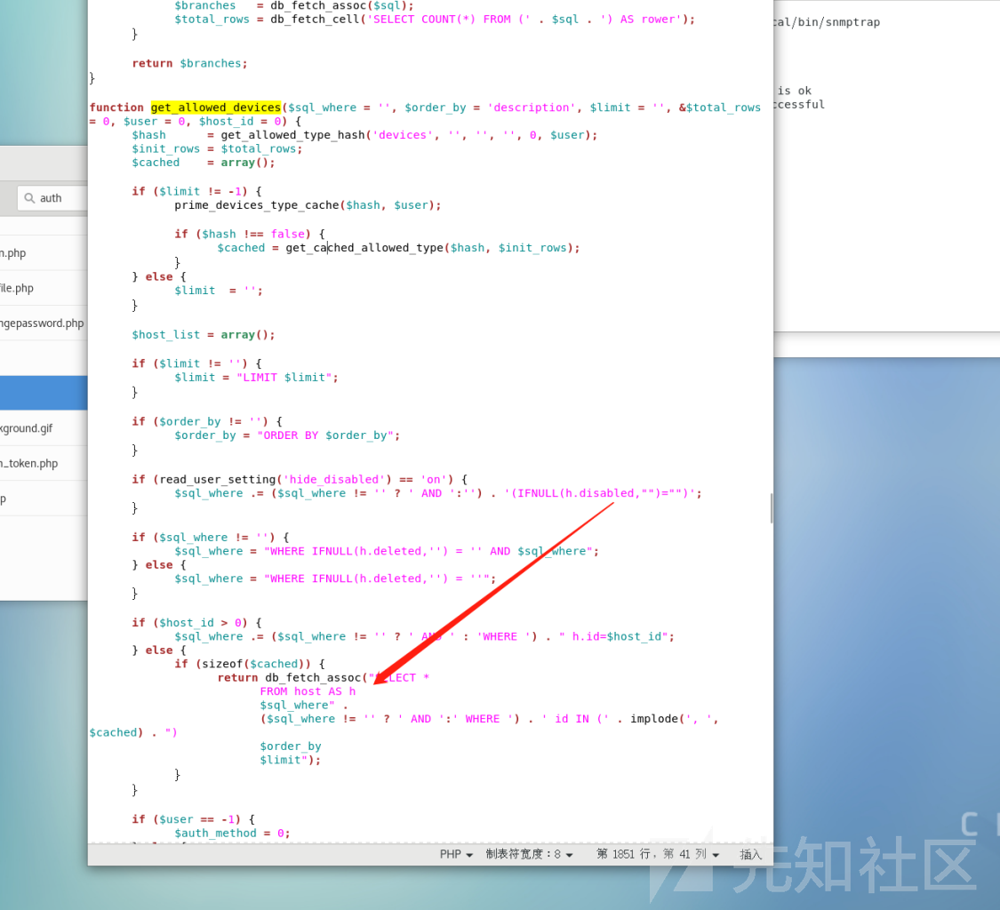](https://xzfile.aliyuncs.com/media/upload/picture/20231115135322-48c3067c-837b-1.png)  
从代码可以看出 依旧没有做任何的过滤 只是在尝试添加其他的参数，site\_id直接被拼接到了sql语句并且执行，从语句可以看出来，这完全可以构造堆叠注入，我们尝试构造poc

```plain
http://192.168.62.224/cacti/data_debug.php?action=ajax_hosts&site_id=1;select sleep(10)-- -
```

发包尝试

[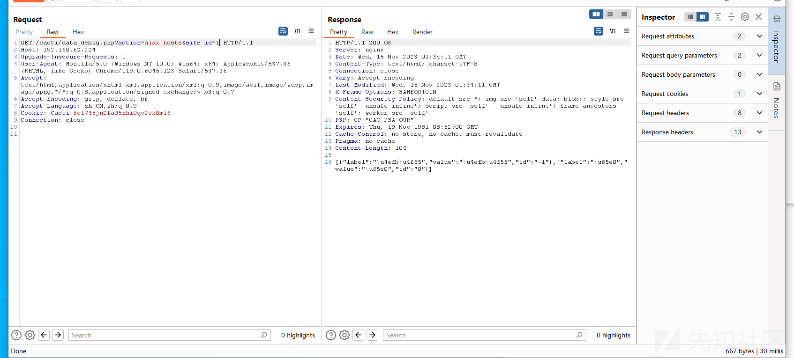](https://xzfile.aliyuncs.com/media/upload/picture/20231115135403-615d4102-837b-1.png)

[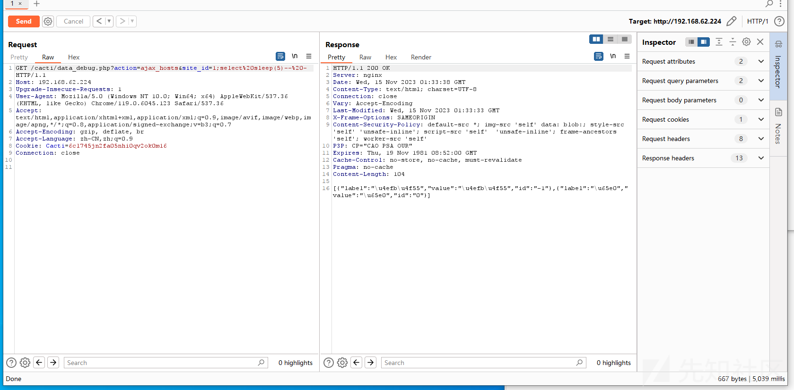](https://xzfile.aliyuncs.com/media/upload/picture/20231115135414-67eebfaa-837b-1.png)

很明显 ，sleep函数成功执行

现在有了堆叠，我们就可以任意构造sql语句，可以寻找其他rce的方式  
全局搜索shell\_exec等执行命令函数，我们找到了一个graph\_realtime.php中的函数

[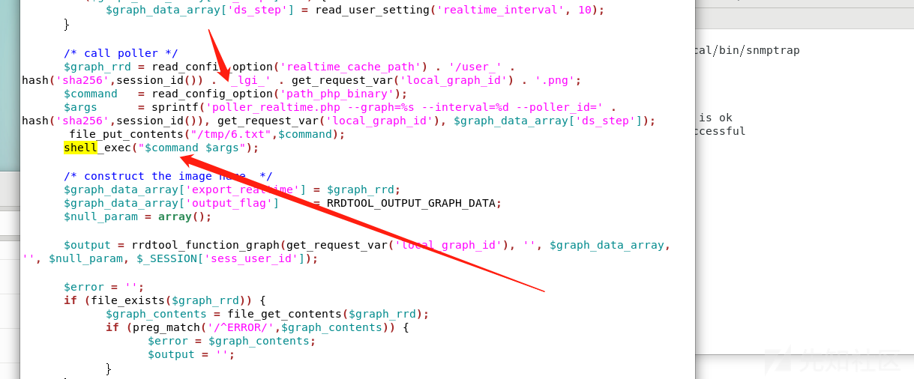](https://xzfile.aliyuncs.com/media/upload/picture/20231115135428-708f4f8a-837b-1.png)  
在这个函数中，尝试从数据库获取配置参数 path\_php\_binary参数，并且直接与args参数拼接在一起放入shell\_exec中，现在 path\_php\_binary参数等于可控，很明显，我们可以直接构造rce了

[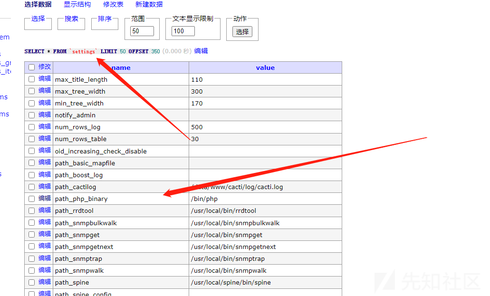](https://xzfile.aliyuncs.com/media/upload/picture/20231115135459-831aa5e6-837b-1.png)  
参数在settings表中，我们尝试修改

```plain
http://192.168.62.224/cacti/data_debug.php?action=ajax_hosts&site_id=1;update settings set value='whoami > /tmp/9.txt;' where name='path_php_binary';-- -
```

[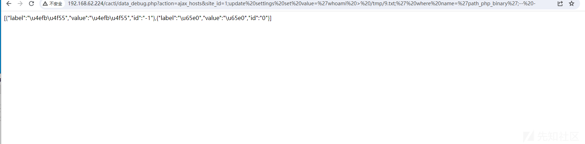](https://xzfile.aliyuncs.com/media/upload/picture/20231115135532-965d0e3c-837b-1.png)  
执行完成 查看数据表

[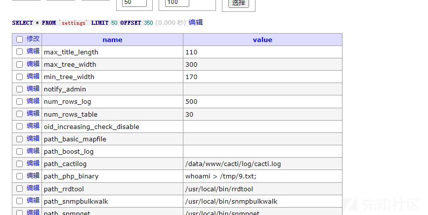](https://xzfile.aliyuncs.com/media/upload/picture/20231115135553-a33f2fc2-837b-1.png)  
修改成功，接下来我们进行触发，访问graph\_realtime.php

[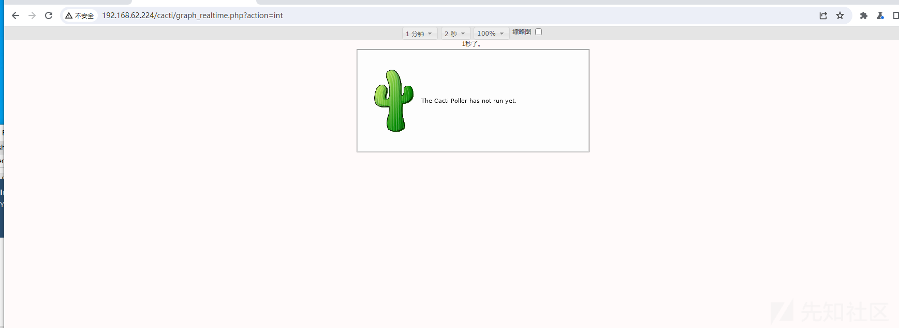](https://xzfile.aliyuncs.com/media/upload/picture/20231115135613-af1fea48-837b-1.png)

[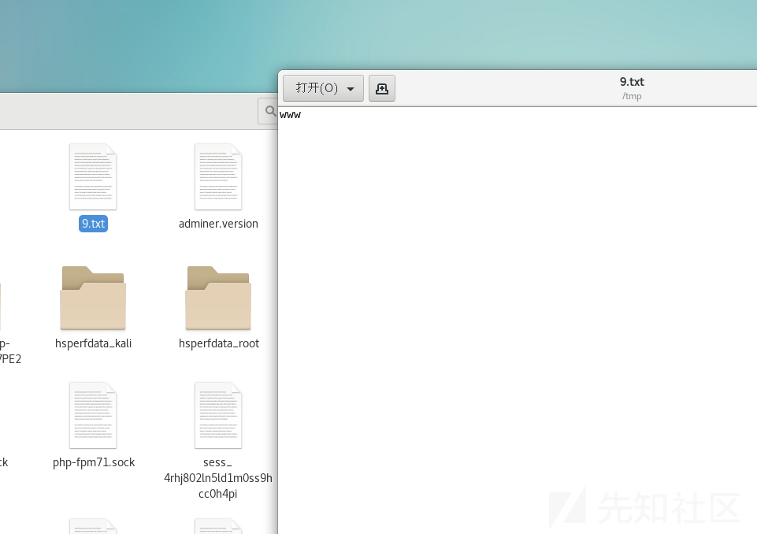](https://xzfile.aliyuncs.com/media/upload/picture/20231115135623-b4f38092-837b-1.png)  
（文章仅做分析）
