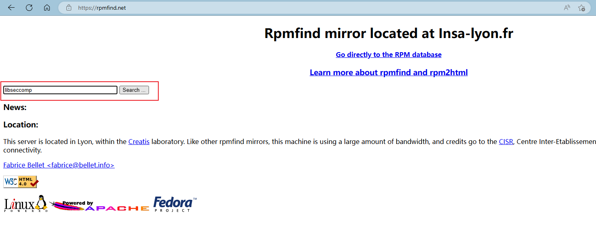
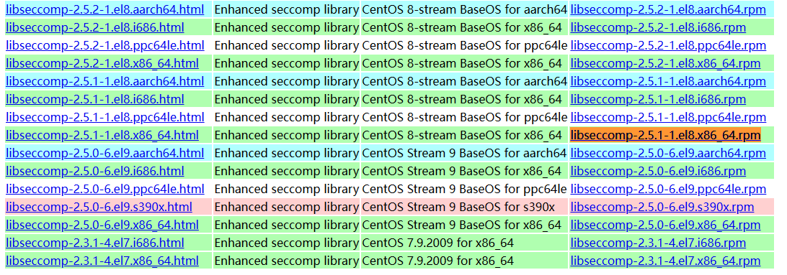

# 

[↓↓↓](https://www.cnblogs.com/chuyiwang/p/17590393.html)  
  
centos7 k8s v1.23.15 三节点 全二进制部署  
  
[↑↑↑](https://www.cnblogs.com/chuyiwang/p/17590393.html)

| 主机名 | IP地址 | Pod 网段 | Service 网段 |
| --- | --- | --- | --- |
| master | 192.168.10.10 | 172.16.0.0/12 | 10.96.0.0/16 |
| node1 | 192.168.10.20 | 172.16.0.0/12 | 10.96.0.0/16 |
| node2 | 192.168.10.30 | 172.16.0.0/12 | 10.96.0.0/16 |

```csharp
[root@master ~]# cat /etc/redhat-release 
CentOS Linux release 7.9.2009 (Core)
[root@master ~]# uname -a
Linux master 3.10.0-1160.95.1.el7.x86_64 #1 SMP Mon Jul 24 13:59:37 UTC 2023 x86_64 x86_64 x86_64 GNU/Linux
```

# 系统优化

## 配置hosts

```shell
# cat /etc/hosts
127.0.0.1   localhost localhost.localdomain localhost4 localhost4.localdomain4
::1         localhost localhost.localdomain localhost6 localhost6.localdomain6
192.168.10.10 master
192.168.10.20 node1
192.168.10.30 node2
```

## 配置yum源

[阿里云YUM仓库](https://developer.aliyun.com/mirror/)

```bash
mkdir /etc/yum.repos.d/bak
mv /etc/yum.repos.d/*.repo /etc/yum.repos.d/bak/
curl -o /etc/yum.repos.d/CentOS-Base.repo https://mirrors.aliyun.com/repo/Centos-7.repo
sed -i -e '/mirrors.cloud.aliyuncs.com/d' -e '/mirrors.aliyuncs.com/d' /etc/yum.repos.d/CentOS-Base.repo
yum clean all && yum makecache
yum -y install wget vim git jq
wget -O /etc/yum.repos.d/epel.repo https://mirrors.aliyun.com/repo/epel-7.repo
yum clean all && yum makecache
yum install ipvsadm ipset sysstat conntrack libseccomp -y
yum update -y --exclude=kernel* && reboot #CentOS7需要升级，CentOS8可以按需升级系统
```

## 优化配置

```bash
systemctl disable --now firewalld 
systemctl disable --now dnsmasq
systemctl disable --now NetworkManager
systemctl disable --now postfix
setenforce 0
sed -i 's#SELINUX=enforcing#SELINUX=disabled#g' /etc/sysconfig/selinux
sed -i 's#SELINUX=enforcing#SELINUX=disabled#g' /etc/selinux/config
swapoff -a && sysctl -w vm.swappiness=0
sed -ri '/^[^#]*swap/s@^@#@' /etc/fstab
ulimit -SHn 65535
echo "
* soft nofile 65536
* hard nofile 131072
* soft nproc 65535
* hard nproc 655350
* soft memlock unlimited
* hard memlock unlimited　
" >>/etc/security/limits.conf
```

## 配置时间同步

```bash
rpm -ivh http://mirrors.wlnmp.com/centos/wlnmp-release-centos.noarch.rpm
ln -sf /usr/share/zoneinfo/Asia/Shanghai /etc/localtime
echo 'Asia/Shanghai' >/etc/timezone
ntpdate time2.aliyun.com
echo "*/5 * * * * /usr/sbin/ntpdate time2.aliyun.com" >>/var/spool/cron/root
systemctl restart crond
```

## 升级内核

```bash
wget http://193.49.22.109/elrepo/kernel/el7/x86_64/RPMS/kernel-ml-devel-4.19.12-1.el7.elrepo.x86_64.rpm
wget http://193.49.22.109/elrepo/kernel/el7/x86_64/RPMS/kernel-ml-4.19.12-1.el7.elrepo.x86_64.rpm
yum localinstall -y kernel-ml*
grub2-set-default  0 && grub2-mkconfig -o /etc/grub2.cfg
grubby --args="user_namespace.enable=1" --update-kernel="$(grubby --default-kernel)"
grubby --default-kernel
modprobe -- ip_vs
modprobe -- ip_vs_rr
modprobe -- ip_vs_wrr
modprobe -- ip_vs_sh
modprobe -- nf_conntrack
echo "
ip_vs
ip_vs_lc
ip_vs_wlc
ip_vs_rr
ip_vs_wrr
ip_vs_lblc
ip_vs_lblcr
ip_vs_dh
ip_vs_sh
ip_vs_nq
ip_vs_sed
ip_vs_ftp
ip_vs_sh
nf_conntrack
ip_tables
ip_set
xt_set
ipt_set
ipt_rpfilter
ipt_REJECT
ipip
" >>/etc/modules-load.d/ipvs.conf 
systemctl enable --now systemd-modules-load.service
```

检查是否加载

```dos
lsmod | grep -e ip_vs -e nf_conntrack

cat <<EOF > /etc/sysctl.d/k8s.conf
net.ipv4.ip_forward = 1
net.bridge.bridge-nf-call-iptables = 1
net.bridge.bridge-nf-call-ip6tables = 1
fs.may_detach_mounts = 1
vm.overcommit_memory=1
net.ipv4.conf.all.route_localnet = 1

vm.panic_on_oom=0
fs.inotify.max_user_watches=89100
fs.file-max=52706963
fs.nr_open=52706963
net.netfilter.nf_conntrack_max=2310720

net.ipv4.tcp_keepalive_time = 600
net.ipv4.tcp_keepalive_probes = 3
net.ipv4.tcp_keepalive_intvl =15
net.ipv4.tcp_max_tw_buckets = 36000
net.ipv4.tcp_tw_reuse = 1
net.ipv4.tcp_max_orphans = 327680
net.ipv4.tcp_orphan_retries = 3
net.ipv4.tcp_syncookies = 1
net.ipv4.tcp_max_syn_backlog = 16384
net.ipv4.ip_conntrack_max = 65536
net.ipv4.tcp_max_syn_backlog = 16384
net.ipv4.tcp_timestamps = 0
net.core.somaxconn = 16384
EOF
sysctl --system
```

所有节点配置完内核后，重启服务器，保证重启后内核依旧加载

```cpp
reboot
lsmod | grep --color=auto -e ip_vs -e nf_conntrack
```

# 部署K8s

## 下载软件包

[https://github.com/kubernetes/kubernetes/blob/master/CHANGELOG/CHANGELOG-1.23.md](https://github.com/kubernetes/kubernetes/blob/master/CHANGELOG/CHANGELOG-1.23.md)  
[https://github.com/containerd/containerd/releases](https://github.com/containerd/containerd/releases)  
[https://github.com/etcd-io/etcd/releases/](https://github.com/etcd-io/etcd/releases/)  
[https://github.com/kubernetes-sigs/cri-tools/releases](https://github.com/kubernetes-sigs/cri-tools/releases)

```bash
wget https://github.com/containerd/containerd/releases/download/v1.6.22/cri-containerd-cni-1.6.22-linux-amd64.tar.gz
wget https://dl.k8s.io/v1.23.15/kubernetes-server-linux-amd64.tar.gz
wget https://github.com/etcd-io/etcd/releases/download/v3.5.9/etcd-v3.5.9-linux-amd64.tar.gz
wget https://github.com/kubernetes-sigs/cri-tools/releases/download/v1.24.2/crictl-v1.24.2-linux-amd64.tar.gz
```

只在master上操作

```bash
tar -xf kubernetes-server-linux-amd64.tar.gz  --strip-components=3 -C /usr/local/bin kubernetes/server/bin/kube{let,ctl,-apiserver,-controller-manager,-scheduler,-proxy}
tar -zxvf etcd-v3.5.9-linux-amd64.tar.gz --strip-components=1 -C /usr/local/bin etcd-v3.5.9-linux-amd64/etcd{,ctl}
for i in $(ls /usr/local/bin/kube* | grep -E 'let|proxy'); do scp $i node1:$i; scp $i node2:$i; done
mkdir -p /opt/cni/bin /etc/kubernetes/pki /etc/etcd/ssl /etc/kubernetes/manifests /etc/systemd/system/kubelet.service.d /var/lib/kubelet /var/log/kubernetes
ssh node1 -C "mkdir -p /opt/cni/bin /etc/kubernetes/pki /etc/etcd/ssl /etc/kubernetes/manifests /etc/systemd/system/kubelet.service.d /var/lib/kubelet /var/log/kubernetes"
ssh node2 -C "mkdir -p /opt/cni/bin /etc/kubernetes/pki /etc/etcd/ssl /etc/kubernetes/manifests /etc/systemd/system/kubelet.service.d /var/lib/kubelet /var/log/kubernetes"
```

## 生成证书

只在master上操作

```bash
wget "https://pkg.cfssl.org/R1.2/cfssl_linux-amd64" -O /usr/local/bin/cfssl
wget "https://pkg.cfssl.org/R1.2/cfssljson_linux-amd64" -O /usr/local/bin/cfssljson
chmod +x /usr/local/bin/cfssl /usr/local/bin/cfssljson
```

### 创建生成证书相关文件

```lua
mkdir pki && cd pki

admin-csr.json
-----------------------------------------------------
{
  "CN": "admin",
  "key": {
    "algo": "rsa",
    "size": 2048
  },
  "names": [
    {
      "C": "CN",
      "ST": "Beijing",
      "L": "Beijing",
      "O": "system:masters",
      "OU": "Kubernetes-manual"
    }
  ]
}


apiserver-csr.json
-----------------------------------------------------
{
  "CN": "kube-apiserver",
  "key": {
    "algo": "rsa",
    "size": 2048
  },
  "names": [
    {
      "C": "CN",
      "ST": "Beijing",
      "L": "Beijing",
      "O": "Kubernetes",
      "OU": "Kubernetes-manual"
    }
  ]
}


ca-config.json
-----------------------------------------------------
{
  "signing": {
    "default": {
      "expiry": "876000h"
    },
    "profiles": {
      "kubernetes": {
        "usages": [
            "signing",
            "key encipherment",
            "server auth",
            "client auth"
        ],
        "expiry": "876000h"
      }
    }
  }
}


ca-csr.json
-----------------------------------------------------
{
  "CN": "kubernetes",
  "key": {
    "algo": "rsa",
    "size": 2048
  },
  "names": [
    {
      "C": "CN",
      "ST": "Beijing",
      "L": "Beijing",
      "O": "Kubernetes",
      "OU": "Kubernetes-manual"
    }
  ],
  "ca": {
    "expiry": "876000h"
  }
}


etcd-ca-csr.json
-----------------------------------------------------
{
  "CN": "etcd",
  "key": {
    "algo": "rsa",
    "size": 2048
  },
  "names": [
    {
      "C": "CN",
      "ST": "Beijing",
      "L": "Beijing",
      "O": "etcd",
      "OU": "Etcd Security"
    }
  ],
  "ca": {
    "expiry": "876000h"
  }
}


etcd-csr.json
-----------------------------------------------------
{
  "CN": "etcd",
  "key": {
    "algo": "rsa",
    "size": 2048
  },
  "names": [
    {
      "C": "CN",
      "ST": "Beijing",
      "L": "Beijing",
      "O": "etcd",
      "OU": "Etcd Security"
    }
  ]
}


front-proxy-ca-csr.json
-----------------------------------------------------
{
  "CN": "kubernetes",
  "key": {
     "algo": "rsa",
     "size": 2048
  },
  "ca": {
    "expiry": "876000h"
  }
}


front-proxy-client-csr.json
-----------------------------------------------------
{
  "CN": "front-proxy-client",
  "key": {
     "algo": "rsa",
     "size": 2048
  }
}


kubelet-csr.json
-----------------------------------------------------
{
  "CN": "system:node:$NODE",
  "key": {
    "algo": "rsa",
    "size": 2048
  },
  "names": [
    {
      "C": "CN",
      "L": "Beijing",
      "ST": "Beijing",
      "O": "system:nodes",
      "OU": "Kubernetes-manual"
    }
  ]
}


kube-proxy-csr.json
-----------------------------------------------------
{
  "CN": "system:kube-proxy",
  "key": {
    "algo": "rsa",
    "size": 2048
  },
  "names": [
    {
      "C": "CN",
      "ST": "Beijing",
      "L": "Beijing",
      "O": "system:kube-proxy",
      "OU": "Kubernetes-manual"
    }
  ]
}


manager-csr.json
-----------------------------------------------------
{
  "CN": "system:kube-controller-manager",
  "key": {
    "algo": "rsa",
    "size": 2048
  },
  "names": [
    {
      "C": "CN",
      "ST": "Beijing",
      "L": "Beijing",
      "O": "system:kube-controller-manager",
      "OU": "Kubernetes-manual"
    }
  ]
}


scheduler-csr.json
-----------------------------------------------------
{
  "CN": "system:kube-scheduler",
  "key": {
    "algo": "rsa",
    "size": 2048
  },
  "names": [
    {
      "C": "CN",
      "ST": "Beijing",
      "L": "Beijing",
      "O": "system:kube-scheduler",
      "OU": "Kubernetes-manual"
    }
  ]
}
```

### 生成相关证书

> 注意修改IP地址 以下只在master上操作

```typescript
cfssl gencert -initca etcd-ca-csr.json | cfssljson -bare /etc/etcd/ssl/etcd-ca
cfssl gencert \
    -ca=/etc/etcd/ssl/etcd-ca.pem \
    -ca-key=/etc/etcd/ssl/etcd-ca-key.pem \
    -config=ca-config.json \
    -hostname=127.0.0.1,master,192.168.10.10 \
    -profile=kubernetes \
    etcd-csr.json | cfssljson -bare /etc/etcd/ssl/etcd
cfssl gencert -initca ca-csr.json | cfssljson -bare /etc/kubernetes/pki/ca
cfssl gencert   -ca=/etc/kubernetes/pki/ca.pem   -ca-key=/etc/kubernetes/pki/ca-key.pem   -config=ca-config.json   -hostname=10.96.0.1,192.168.10.10,127.0.0.1,kubernetes,kubernetes.default,kubernetes.default.svc,kubernetes.default.svc.cluster,kubernetes.default.svc.cluster.local   -profile=kubernetes   apiserver-csr.json | cfssljson -bare /etc/kubernetes/pki/apiserver
cfssl gencert   -initca front-proxy-ca-csr.json | cfssljson -bare /etc/kubernetes/pki/front-proxy-ca
cfssl gencert   -ca=/etc/kubernetes/pki/front-proxy-ca.pem   -ca-key=/etc/kubernetes/pki/front-proxy-ca-key.pem   -config=ca-config.json   -profile=kubernetes   front-proxy-client-csr.json | cfssljson -bare /etc/kubernetes/pki/front-proxy-client
cfssl gencert \
    -ca=/etc/kubernetes/pki/ca.pem \
    -ca-key=/etc/kubernetes/pki/ca-key.pem \
    -config=ca-config.json \
    -profile=kubernetes \
    manager-csr.json | cfssljson -bare /etc/kubernetes/pki/controller-manager
kubectl config set-cluster kubernetes \
      --certificate-authority=/etc/kubernetes/pki/ca.pem \
      --embed-certs=true \
      --server=https://192.168.10.10:6443 \
      --kubeconfig=/etc/kubernetes/controller-manager.kubeconfig
kubectl config set-context system:kube-controller-manager@kubernetes \
     --cluster=kubernetes \
     --user=system:kube-controller-manager \
     --kubeconfig=/etc/kubernetes/controller-manager.kubeconfig
kubectl config set-credentials system:kube-controller-manager \
      --client-certificate=/etc/kubernetes/pki/controller-manager.pem \
      --client-key=/etc/kubernetes/pki/controller-manager-key.pem \
      --embed-certs=true \
      --kubeconfig=/etc/kubernetes/controller-manager.kubeconfig
kubectl config use-context system:kube-controller-manager@kubernetes \
      --kubeconfig=/etc/kubernetes/controller-manager.kubeconfig
cfssl gencert \
   -ca=/etc/kubernetes/pki/ca.pem \
   -ca-key=/etc/kubernetes/pki/ca-key.pem \
   -config=ca-config.json \
   -profile=kubernetes \
   scheduler-csr.json | cfssljson -bare /etc/kubernetes/pki/scheduler
kubectl config set-cluster kubernetes \
     --certificate-authority=/etc/kubernetes/pki/ca.pem \
     --embed-certs=true \
     --server=https://192.168.10.10:6443 \
     --kubeconfig=/etc/kubernetes/scheduler.kubeconfig
kubectl config set-credentials system:kube-scheduler \
     --client-certificate=/etc/kubernetes/pki/scheduler.pem \
     --client-key=/etc/kubernetes/pki/scheduler-key.pem \
     --embed-certs=true \
     --kubeconfig=/etc/kubernetes/scheduler.kubeconfig
kubectl config set-context system:kube-scheduler@kubernetes \
     --cluster=kubernetes \
     --user=system:kube-scheduler \
     --kubeconfig=/etc/kubernetes/scheduler.kubeconfig
kubectl config use-context system:kube-scheduler@kubernetes \
     --kubeconfig=/etc/kubernetes/scheduler.kubeconfig
cfssl gencert \
   -ca=/etc/kubernetes/pki/ca.pem \
   -ca-key=/etc/kubernetes/pki/ca-key.pem \
   -config=ca-config.json \
   -profile=kubernetes \
   admin-csr.json | cfssljson -bare /etc/kubernetes/pki/admin
kubectl config set-cluster kubernetes     --certificate-authority=/etc/kubernetes/pki/ca.pem     --embed-certs=true     --server=https://192.168.10.10:6443     --kubeconfig=/etc/kubernetes/admin.kubeconfig
kubectl config set-credentials kubernetes-admin     --client-certificate=/etc/kubernetes/pki/admin.pem     --client-key=/etc/kubernetes/pki/admin-key.pem     --embed-certs=true     --kubeconfig=/etc/kubernetes/admin.kubeconfig
kubectl config set-context kubernetes-admin@kubernetes     --cluster=kubernetes     --user=kubernetes-admin     --kubeconfig=/etc/kubernetes/admin.kubeconfig
kubectl config use-context kubernetes-admin@kubernetes     --kubeconfig=/etc/kubernetes/admin.kubeconfig
openssl genrsa -out /etc/kubernetes/pki/sa.key 2048
openssl rsa -in /etc/kubernetes/pki/sa.key -pubout -out /etc/kubernetes/pki/sa.pub
kubectl config set-cluster kubernetes     --certificate-authority=/etc/kubernetes/pki/ca.pem     --embed-certs=true     --server=https://192.168.10.10:6443     --kubeconfig=/etc/kubernetes/bootstrap-kubelet.kubeconfig
kubectl config set-credentials tls-bootstrap-token-user     --token=c8ad9c.2e4d610cf3e7426e --kubeconfig=/etc/kubernetes/bootstrap-kubelet.kubeconfig
kubectl config set-context tls-bootstrap-token-user@kubernetes     --cluster=kubernetes     --user=tls-bootstrap-token-user     --kubeconfig=/etc/kubernetes/bootstrap-kubelet.kubeconfig
kubectl config use-context tls-bootstrap-token-user@kubernetes     --kubeconfig=/etc/kubernetes/bootstrap-kubelet.kubeconfig
```

# 配置ETCD

## 创建ETCD配置文件

> master上操作

```yaml
vim /etc/etcd/etcd.config.yml
name: 'master'
data-dir: /var/lib/etcd
wal-dir: /var/lib/etcd/wal
snapshot-count: 5000
heartbeat-interval: 100
election-timeout: 1000
quota-backend-bytes: 0
listen-peer-urls: 'https://192.168.10.10:2380'
listen-client-urls: 'https://192.168.10.10:2379,http://127.0.0.1:2379'
max-snapshots: 3
max-wals: 5
cors:
initial-advertise-peer-urls: 'https://192.168.10.10:2380'
advertise-client-urls: 'https://192.168.10.10:2379'
discovery:
discovery-fallback: 'proxy'
discovery-proxy:
discovery-srv:
initial-cluster: 'master=https://192.168.10.10:2380'
initial-cluster-token: 'etcd-k8s-cluster'
initial-cluster-state: 'new'
strict-reconfig-check: false
enable-v2: true
enable-pprof: true
proxy: 'off'
proxy-failure-wait: 5000
proxy-refresh-interval: 30000
proxy-dial-timeout: 1000
proxy-write-timeout: 5000
proxy-read-timeout: 0
client-transport-security:
  cert-file: '/etc/kubernetes/pki/etcd/etcd.pem'
  key-file: '/etc/kubernetes/pki/etcd/etcd-key.pem'
  client-cert-auth: true
  trusted-ca-file: '/etc/kubernetes/pki/etcd/etcd-ca.pem'
  auto-tls: true
peer-transport-security:
  cert-file: '/etc/kubernetes/pki/etcd/etcd.pem'
  key-file: '/etc/kubernetes/pki/etcd/etcd-key.pem'
  peer-client-cert-auth: true
  trusted-ca-file: '/etc/kubernetes/pki/etcd/etcd-ca.pem'
  auto-tls: true
debug: false
log-package-levels:
log-outputs: [default]
force-new-cluster: false
```

## 创建ETCD Service文件

master

```makefile
vim /usr/lib/systemd/system/etcd.service
[Unit]
Description=Etcd Service
Documentation=https://coreos.com/etcd/docs/latest/
After=network.target

[Service]
Type=notify
ExecStart=/usr/local/bin/etcd --config-file=/etc/etcd/etcd.config.yml
Restart=on-failure
RestartSec=10
LimitNOFILE=65536

[Install]
WantedBy=multi-user.target
Alias=etcd3.service
```

## 启动ETCD服务

```bash
mkdir /etc/kubernetes/pki/etcd
ln -s /etc/etcd/ssl/* /etc/kubernetes/pki/etcd/
systemctl daemon-reload
systemctl enable --now etcd

## 查看服务状态
etcdctl endpoint status --write-out=table
etcdctl endpoint health --write-out=table
etcdctl member list --write-out=table
```

# 配置Containerd

所有节点配置

```bash
master拷贝文件至node节点
scp cri-containerd-cni-1.6.22-linux-amd64.tar.gz node1:/root/
scp cri-containerd-cni-1.6.22-linux-amd64.tar.gz node2:/root/
scp crictl-v1.24.2-linux-amd64.tar.gz node1:/root/
scp crictl-v1.24.2-linux-amd64.tar.gz node2:/root/

所有节点操作
tar xf cri-containerd-cni-1.6.22-linux-amd64.tar.gz -C /
cat <<EOF | sudo tee /etc/modules-load.d/containerd.conf
overlay
br_netfilter
EOF
modprobe -- overlay
modprobe -- br_netfilter
cat <<EOF | sudo tee /etc/sysctl.d/99-kubernetes-cri.conf
net.bridge.bridge-nf-call-iptables  = 1
net.ipv4.ip_forward                 = 1
net.bridge.bridge-nf-call-ip6tables = 1
EOF
sysctl --system
mkdir /etc/containerd && cd /etc/containerd/
containerd config default | tee /etc/containerd/config.toml

vim config.toml
config.toml配置文件参考：https://www.cnblogs.com/chuyiwang/p/17474724.html -- 2
    sandbox_image = "registry.cn-hangzhou.aliyuncs.com/google_containers/pause:3.6"
            SystemdCgroup = true
···

systemctl daemon-reload
systemctl enable --now containerd
systemctl status containerd
cat > /etc/crictl.yaml <<EOF
runtime-endpoint: unix:///run/containerd/containerd.sock
image-endpoint: unix:///run/containerd/containerd.sock
timeout: 10
debug: false
EOF
systemctl restart containerd
```

# 配置Apiserver

master节点配置  
本文k8s service网段为10.96.0.0/16，该网段不能和宿主机的网段、Pod网段的重复，请按需修改

```vhdl
vim /usr/lib/systemd/system/kube-apiserver.service
[Unit]
Description=Kubernetes API Server
Documentation=https://github.com/kubernetes/kubernetes
After=network.target

[Service]
ExecStart=/usr/local/bin/kube-apiserver \
      --v=2  \
      --logtostderr=true  \
      --allow-privileged=true  \
      --bind-address=0.0.0.0  \
      --secure-port=6443  \
      --insecure-port=0  \
      --advertise-address=192.168.10.10 \
      --service-cluster-ip-range=10.96.0.0/16  \
      --service-node-port-range=30000-32767  \
      --etcd-servers=https://192.168.10.10:2379 \
      --etcd-cafile=/etc/etcd/ssl/etcd-ca.pem  \
      --etcd-certfile=/etc/etcd/ssl/etcd.pem  \
      --etcd-keyfile=/etc/etcd/ssl/etcd-key.pem  \
      --client-ca-file=/etc/kubernetes/pki/ca.pem  \
      --tls-cert-file=/etc/kubernetes/pki/apiserver.pem  \
      --tls-private-key-file=/etc/kubernetes/pki/apiserver-key.pem  \
      --kubelet-client-certificate=/etc/kubernetes/pki/apiserver.pem  \
      --kubelet-client-key=/etc/kubernetes/pki/apiserver-key.pem  \
      --service-account-key-file=/etc/kubernetes/pki/sa.pub  \
      --service-account-signing-key-file=/etc/kubernetes/pki/sa.key  \
      --service-account-issuer=https://kubernetes.default.svc.cluster.local \
      --kubelet-preferred-address-types=InternalIP,ExternalIP,Hostname  \
      --enable-admission-plugins=NamespaceLifecycle,LimitRanger,ServiceAccount,DefaultStorageClass,DefaultTolerationSeconds,NodeRestriction,ResourceQuota  \
      --authorization-mode=Node,RBAC  \
      --enable-bootstrap-token-auth=true  \
      --requestheader-client-ca-file=/etc/kubernetes/pki/front-proxy-ca.pem  \
      --proxy-client-cert-file=/etc/kubernetes/pki/front-proxy-client.pem  \
      --proxy-client-key-file=/etc/kubernetes/pki/front-proxy-client-key.pem  \
      --requestheader-allowed-names=aggregator,front-proxy-client \
      --requestheader-group-headers=X-Remote-Group  \
      --requestheader-extra-headers-prefix=X-Remote-Extra-  \
      --feature-gates=EphemeralContainers=true \
      --requestheader-username-headers=X-Remote-User
      # --token-auth-file=/etc/kubernetes/token.csv

Restart=on-failure
RestartSec=10s
LimitNOFILE=65535

[Install]
WantedBy=multi-user.target
```

配置开机启动并启动apiserver

```lua
systemctl daemon-reload
systemctl enable --now kube-apiserver
systemctl status kube-apiserver
```

# ControllerManager

本文使用的k8s Pod网段为172.16.0.0/12，该网段不能和宿主机的网段、k8s Service网段的重复，请按需修改

```sql
vim /usr/lib/systemd/system/kube-controller-manager.service
[Unit]
Description=Kubernetes Controller Manager
Documentation=https://github.com/kubernetes/kubernetes
After=network.target

[Service]
ExecStart=/usr/local/bin/kube-controller-manager \
      --v=2 \
      --logtostderr=true \
      --address=127.0.0.1 \
      --root-ca-file=/etc/kubernetes/pki/ca.pem \
      --cluster-signing-cert-file=/etc/kubernetes/pki/ca.pem \
      --cluster-signing-key-file=/etc/kubernetes/pki/ca-key.pem \
      --service-account-private-key-file=/etc/kubernetes/pki/sa.key \
      --kubeconfig=/etc/kubernetes/controller-manager.kubeconfig \
      --leader-elect=true \
      --use-service-account-credentials=true \
      --node-monitor-grace-period=40s \
      --node-monitor-period=5s \
      --pod-eviction-timeout=2m0s \
      --controllers=*,bootstrapsigner,tokencleaner \
      --allocate-node-cidrs=true \
      --cluster-cidr=172.16.0.0/12 \
      --requestheader-client-ca-file=/etc/kubernetes/pki/front-proxy-ca.pem \
      --node-cidr-mask-size=24
      
Restart=always
RestartSec=10s

[Install]
WantedBy=multi-user.target
```

配置开机启动并启动kube-controller-manager

```lua
systemctl daemon-reload
systemctl enable --now kube-controller-manager
systemctl  status kube-controller-manager
```

# Scheduler

```javascript
vim /usr/lib/systemd/system/kube-scheduler.service
[Unit]
Description=Kubernetes Scheduler
Documentation=https://github.com/kubernetes/kubernetes
After=network.target

[Service]
ExecStart=/usr/local/bin/kube-scheduler \
      --v=2 \
      --logtostderr=true \
      --address=127.0.0.1 \
      --leader-elect=true \
      --kubeconfig=/etc/kubernetes/scheduler.kubeconfig

Restart=always
RestartSec=10s

[Install]
WantedBy=multi-user.target
```

配置开机启动并启动

```lua
systemctl daemon-reload
systemctl enable --now kube-scheduler
systemctl status kube-scheduler
```

# 配置TLS Bootstrapping

只在master上配置

创建 `bootstrap.secret.yaml` 文件

```yaml
cd pki/
vim bootstrap.secret.yaml 
apiVersion: v1
kind: Secret
metadata:
  name: bootstrap-token-c8ad9c
  namespace: kube-system
type: bootstrap.kubernetes.io/token
stringData:
  description: "The default bootstrap token generated by 'kubelet '."
  token-id: c8ad9c
  token-secret: 2e4d610cf3e7426e
  usage-bootstrap-authentication: "true"
  usage-bootstrap-signing: "true"
  auth-extra-groups:  system:bootstrappers:default-node-token,system:bootstrappers:worker,system:bootstrappers:ingress
 
---
apiVersion: rbac.authorization.k8s.io/v1
kind: ClusterRoleBinding
metadata:
  name: kubelet-bootstrap
roleRef:
  apiGroup: rbac.authorization.k8s.io
  kind: ClusterRole
  name: system:node-bootstrapper
subjects:
- apiGroup: rbac.authorization.k8s.io
  kind: Group
  name: system:bootstrappers:default-node-token
---
apiVersion: rbac.authorization.k8s.io/v1
kind: ClusterRoleBinding
metadata:
  name: node-autoapprove-bootstrap
roleRef:
  apiGroup: rbac.authorization.k8s.io
  kind: ClusterRole
  name: system:certificates.k8s.io:certificatesigningrequests:nodeclient
subjects:
- apiGroup: rbac.authorization.k8s.io
  kind: Group
  name: system:bootstrappers:default-node-token
---
apiVersion: rbac.authorization.k8s.io/v1
kind: ClusterRoleBinding
metadata:
  name: node-autoapprove-certificate-rotation
roleRef:
  apiGroup: rbac.authorization.k8s.io
  kind: ClusterRole
  name: system:certificates.k8s.io:certificatesigningrequests:selfnodeclient
subjects:
- apiGroup: rbac.authorization.k8s.io
  kind: Group
  name: system:nodes
---
apiVersion: rbac.authorization.k8s.io/v1
kind: ClusterRole
metadata:
  annotations:
    rbac.authorization.kubernetes.io/autoupdate: "true"
  labels:
    kubernetes.io/bootstrapping: rbac-defaults
  name: system:kube-apiserver-to-kubelet
rules:
  - apiGroups:
      - ""
    resources:
      - nodes/proxy
      - nodes/stats
      - nodes/log
      - nodes/spec
      - nodes/metrics
    verbs:
      - "*"
---
apiVersion: rbac.authorization.k8s.io/v1
kind: ClusterRoleBinding
metadata:
  name: system:kube-apiserver
  namespace: ""
roleRef:
  apiGroup: rbac.authorization.k8s.io
  kind: ClusterRole
  name: system:kube-apiserver-to-kubelet
subjects:
  - apiGroup: rbac.authorization.k8s.io
    kind: User
    name: kube-apiserver
```

> 注意：如果要修改bootstrap.secret.yaml的token-id和token-secret，需要保证下图的字符串一致的，并且位数是一样的。还要保证c8ad9c.2e4d610cf3e7426e与你修改的字符串要一致

```sql
kubectl config set-cluster kubernetes     --certificate-authority=/etc/kubernetes/pki/ca.pem     --embed-certs=true     --server=https://192.168.10.10:6443     --kubeconfig=/etc/kubernetes/bootstrap-kubelet.kubeconfig
kubectl config set-credentials tls-bootstrap-token-user     --token=c8ad9c.2e4d610cf3e7426e --kubeconfig=/etc/kubernetes/bootstrap-kubelet.kubeconfig
kubectl config set-context tls-bootstrap-token-user@kubernetes     --cluster=kubernetes     --user=tls-bootstrap-token-user     --kubeconfig=/etc/kubernetes/bootstrap-kubelet.kubeconfig
kubectl config use-context tls-bootstrap-token-user@kubernetes     --kubeconfig=/etc/kubernetes/bootstrap-kubelet.kubeconfig
mkdir -p /root/.kube ; cp /etc/kubernetes/admin.kubeconfig /root/.kube/config
kubectl create -f bootstrap.secret.yaml
```

查询集群状态

```mipsasm
[root@master pki]# kubectl get cs
Warning: v1 ComponentStatus is deprecated in v1.19+
NAME                 STATUS    MESSAGE                         ERROR
scheduler            Healthy   ok                              
controller-manager   Healthy   ok                              
etcd-0               Healthy   {"health":"true","reason":""}
```

## 复制证书至node节点

```bash
scp /etc/kubernetes/pki/ca.pem node1:/etc/kubernetes/pki/ca.pem
scp /etc/kubernetes/pki/ca-key.pem node1:/etc/kubernetes/pki/ca-key.pem
scp /etc/kubernetes/pki/front-proxy-ca.pem node1:/etc/kubernetes/pki/front-proxy-ca.pem
scp /etc/kubernetes/bootstrap-kubelet.kubeconfig node1:/etc/kubernetes/bootstrap-kubelet.kubeconfig
scp /etc/etcd/ssl/etcd-ca.pem node1:/etc/etcd/ssl/etcd-ca.pem
scp /etc/etcd/ssl/etcd.pem node1:/etc/etcd/ssl/etcd.pem
scp /etc/etcd/ssl/etcd-key.pem node1:/etc/etcd/ssl/etcd-key.pem

scp /etc/kubernetes/pki/ca.pem node2:/etc/kubernetes/pki/ca.pem
scp /etc/kubernetes/pki/ca-key.pem node2:/etc/kubernetes/pki/ca-key.pem
scp /etc/kubernetes/pki/front-proxy-ca.pem node2:/etc/kubernetes/pki/front-proxy-ca.pem
scp /etc/kubernetes/bootstrap-kubelet.kubeconfig node2:/etc/kubernetes/bootstrap-kubelet.kubeconfig
scp /etc/etcd/ssl/etcd-ca.pem node2:/etc/etcd/ssl/etcd-ca.pem
scp /etc/etcd/ssl/etcd.pem node2:/etc/etcd/ssl/etcd.pem
scp /etc/etcd/ssl/etcd-key.pem node2:/etc/etcd/ssl/etcd-key.pem
```

# Kubelet

创建 `kubelet.service` 文件

```makefile
vim /usr/lib/systemd/system/kubelet.service
[Unit]
Description=Kubernetes Kubelet
Documentation=https://github.com/kubernetes/kubernetes
After=containerd.service
Requires=containerd.service

[Service]
ExecStart=/usr/local/bin/kubelet

Restart=always
StartLimitInterval=0
RestartSec=10

[Install]
WantedBy=multi-user.target
```

创建 `10-kubelet.conf` 文件

```bash
vim /etc/systemd/system/kubelet.service.d/10-kubelet.conf
[Service]
Environment="KUBELET_KUBECONFIG_ARGS=--bootstrap-kubeconfig=/etc/kubernetes/bootstrap-kubelet.kubeconfig --kubeconfig=/etc/kubernetes/kubelet.kubeconfig"
Environment="KUBELET_SYSTEM_ARGS=--network-plugin=cni --cni-conf-dir=/etc/cni/net.d --cni-bin-dir=/opt/cni/bin --container-runtime=remote --runtime-request-timeout=15m --container-runtime-endpoint=unix:///run/containerd/containerd.sock --cgroup-driver=systemd"
Environment="KUBELET_CONFIG_ARGS=--config=/etc/kubernetes/kubelet-conf.yml"
Environment="KUBELET_EXTRA_ARGS=--node-labels=node.kubernetes.io/node='' --tls-cipher-suites=TLS_ECDHE_RSA_WITH_AES_128_GCM_SHA256,TLS_ECDHE_RSA_WITH_AES_256_GCM_SHA384    --image-pull-progress-deadline=30m"
ExecStart=
ExecStart=/usr/local/bin/kubelet $KUBELET_KUBECONFIG_ARGS $KUBELET_CONFIG_ARGS $KUBELET_SYSTEM_ARGS $KUBELET_EXTRA_ARGS
```

创建 `kubelet-conf.yml` 文件

```yaml
vim /etc/kubernetes/kubelet-conf.yml
apiVersion: kubelet.config.k8s.io/v1beta1
kind: KubeletConfiguration
address: 0.0.0.0
port: 10250
readOnlyPort: 10255
authentication:
  anonymous:
    enabled: false
  webhook:
    cacheTTL: 2m0s
    enabled: true
  x509:
    clientCAFile: /etc/kubernetes/pki/ca.pem
authorization:
  mode: Webhook
  webhook:
    cacheAuthorizedTTL: 5m0s
    cacheUnauthorizedTTL: 30s
cgroupDriver: systemd
cgroupsPerQOS: true
clusterDNS:
- 10.96.0.10
clusterDomain: cluster.local
containerLogMaxFiles: 5
containerLogMaxSize: 10Mi
contentType: application/vnd.kubernetes.protobuf
cpuCFSQuota: true
cpuManagerPolicy: none
cpuManagerReconcilePeriod: 10s
enableControllerAttachDetach: true
enableDebuggingHandlers: true
enforceNodeAllocatable:
- pods
eventBurst: 10
eventRecordQPS: 5
evictionHard:
  imagefs.available: 15%
  memory.available: 100Mi
  nodefs.available: 10%
  nodefs.inodesFree: 5%
evictionPressureTransitionPeriod: 5m0s
failSwapOn: true
fileCheckFrequency: 20s
hairpinMode: promiscuous-bridge
healthzBindAddress: 127.0.0.1
healthzPort: 10248
httpCheckFrequency: 20s
imageGCHighThresholdPercent: 85
imageGCLowThresholdPercent: 80
imageMinimumGCAge: 2m0s
iptablesDropBit: 15
iptablesMasqueradeBit: 14
kubeAPIBurst: 10
kubeAPIQPS: 5
makeIPTablesUtilChains: true
maxOpenFiles: 1000000
maxPods: 110
nodeStatusUpdateFrequency: 10s
oomScoreAdj: -999
podPidsLimit: -1
registryBurst: 10
registryPullQPS: 5
resolvConf: /etc/resolv.conf
rotateCertificates: true
runtimeRequestTimeout: 2m0s
serializeImagePulls: true
staticPodPath: /etc/kubernetes/manifests
streamingConnectionIdleTimeout: 4h0m0s
syncFrequency: 1m0s
volumeStatsAggPeriod: 1m0s
featureGates:
  EphemeralContainers: true
```

所有节点启动kubelet

```bash
scp /usr/lib/systemd/system/kubelet.service node1:/usr/lib/systemd/system/kubelet.service
scp /etc/systemd/system/kubelet.service.d/10-kubelet.conf node1:/etc/systemd/system/kubelet.service.d/10-kubelet.conf
scp /etc/kubernetes/kubelet-conf.yml node1:/etc/kubernetes/kubelet-conf.yml

scp /usr/lib/systemd/system/kubelet.service node2:/usr/lib/systemd/system/kubelet.service
scp /etc/systemd/system/kubelet.service.d/10-kubelet.conf node2:/etc/systemd/system/kubelet.service.d/10-kubelet.conf
scp /etc/kubernetes/kubelet-conf.yml node2:/etc/kubernetes/kubelet-conf.yml

systemctl daemon-reload
systemctl enable --now kubelet
systemctl status kubelet
```

# kube-proxy

master上执行

```javascript
kubectl -n kube-system create serviceaccount kube-proxy

kubectl create clusterrolebinding system:kube-proxy         --clusterrole system:node-proxier         --serviceaccount kube-system:kube-proxy

SECRET=$(kubectl -n kube-system get sa/kube-proxy \
    --output=jsonpath='{.secrets[0].name}')
		
JWT_TOKEN=$(kubectl -n kube-system get secret/$SECRET \
--output=jsonpath='{.data.token}' | base64 -d)

PKI_DIR=/etc/kubernetes/pki
K8S_DIR=/etc/kubernetes

kubectl config set-cluster kubernetes     --certificate-authority=/etc/kubernetes/pki/ca.pem     --embed-certs=true     --server=https://192.168.10.10:6443     --kubeconfig=${K8S_DIR}/kube-proxy.kubeconfig

kubectl config set-credentials kubernetes     --token=${JWT_TOKEN}     --kubeconfig=/etc/kubernetes/kube-proxy.kubeconfig

kubectl config set-context kubernetes     --cluster=kubernetes     --user=kubernetes     --kubeconfig=/etc/kubernetes/kube-proxy.kubeconfig

kubectl config use-context kubernetes     --kubeconfig=/etc/kubernetes/kube-proxy.kubeconfig

scp /etc/kubernetes/kube-proxy.kubeconfig node1:/etc/kubernetes/kube-proxy.kubeconfig
scp /etc/kubernetes/kube-proxy.kubeconfig node2:/etc/kubernetes/kube-proxy.kubeconfig
```

所有节点添加kube-proxy的配置和service文件

```makefile
vim /usr/lib/systemd/system/kube-proxy.service
[Unit]
Description=Kubernetes Kube Proxy
Documentation=https://github.com/kubernetes/kubernetes
After=network.target

[Service]
ExecStart=/usr/local/bin/kube-proxy \
  --config=/etc/kubernetes/kube-proxy.yaml \
  --v=2

Restart=always
RestartSec=10s

[Install]
WantedBy=multi-user.target
```

如果更改了集群Pod的网段，需要更改kube-proxy.yaml的clusterCIDR为自己的Pod网段

```yaml
vim /etc/kubernetes/kube-proxy.yaml
apiVersion: kubeproxy.config.k8s.io/v1alpha1
bindAddress: 0.0.0.0
clientConnection:
  acceptContentTypes: ""
  burst: 10
  contentType: application/vnd.kubernetes.protobuf
  kubeconfig: /etc/kubernetes/kube-proxy.kubeconfig
  qps: 5
clusterCIDR: 172.16.0.0/12 
configSyncPeriod: 15m0s
conntrack:
  max: null
  maxPerCore: 32768
  min: 131072
  tcpCloseWaitTimeout: 1h0m0s
  tcpEstablishedTimeout: 24h0m0s
enableProfiling: false
healthzBindAddress: 0.0.0.0:10256
hostnameOverride: ""
iptables:
  masqueradeAll: false
  masqueradeBit: 14
  minSyncPeriod: 0s
  syncPeriod: 30s
ipvs:
  masqueradeAll: true
  minSyncPeriod: 5s
  scheduler: "rr"
  syncPeriod: 30s
kind: KubeProxyConfiguration
metricsBindAddress: 127.0.0.1:10249
mode: "ipvs"
nodePortAddresses: null
oomScoreAdj: -999
portRange: ""
udpIdleTimeout: 250ms
```

发送至node节点

```bash
scp /usr/lib/systemd/system/kube-proxy.service node1:/usr/lib/systemd/system/kube-proxy.service
scp /usr/lib/systemd/system/kube-proxy.service node2:/usr/lib/systemd/system/kube-proxy.service
scp /etc/kubernetes/kube-proxy.yaml node1:/etc/kubernetes/kube-proxy.yaml
scp /etc/kubernetes/kube-proxy.yaml node2:/etc/kubernetes/kube-proxy.yam
```

启动kube-proxy

```lua
systemctl daemon-reload
systemctl enable --now kube-proxy
systemctl status kube-proxy
```

# 安装Calico

```yaml
安装最新版
wget https://docs.projectcalico.org/manifests/calico.yaml
# 指定版本
# wget https://docs.projectcalico.org/v3.14/manifests/calico.yaml --no-check-certificate
vim calico.yaml 

            # Cluster type to identify the deployment type
            - name: CLUSTER_TYPE
              value: "k8s,bgp"
            # 下方新增 ens192为本地网卡名字
            - name: IP_AUTODETECTION_METHOD
              value: "interface=ens32"

            # 取消下面注释 并修改为自己的Pod网段
            - name: CALICO_IPV4POOL_CIDR
              value: "172.16.0.0/12"
```

创建 calico

```powershell
kubectl apply -f calico.yaml
```

# 安装 CoreDNS

[CoreDNS与Kubernetes版本对照](https://github.com/coredns/deployment/blob/master/kubernetes/CoreDNS-k8s_version.md)

CoreDNS version in Kubernetes

- - -

This document records the CoreDNS version that was installed by kubeadm with each version of Kubernetes since v1.9. It also lists any CoreDNS feature deprecations between Kubernetes releases. This table should not be read as a recommendation for what version of CoreDNS to currently use per each Kubernetes release, especially for older k8s releases in this table.

| Kubernetes Version | CoreDNS version installed by kubeadm | Changes in CoreDNS from previous release to Kubernetes |
| --- | --- | --- |
| v1.27 | v1.10.1 | \--- |
| v1.26 | v1.9.3 | \--- |
| v1.25 | v1.9.3 | \--- |
| v1.24 | v1.8.6 | \--- |
| v1.23 | v1.8.6 | [https://github.com/coredns/coredns/blob/master/notes/coredns-1.8.5.md](https://github.com/coredns/coredns/blob/master/notes/coredns-1.8.5.md)  <br>[https://github.com/coredns/coredns/blob/master/notes/coredns-1.8.6.md](https://github.com/coredns/coredns/blob/master/notes/coredns-1.8.6.md) |
| v1.22 | v1.8.4 | [https://github.com/coredns/coredns/blob/master/notes/coredns-1.8.1.md](https://github.com/coredns/coredns/blob/master/notes/coredns-1.8.1.md)  <br>[https://github.com/coredns/coredns/blob/master/notes/coredns-1.8.2.md](https://github.com/coredns/coredns/blob/master/notes/coredns-1.8.2.md)  <br>[https://github.com/coredns/coredns/blob/master/notes/coredns-1.8.3.md](https://github.com/coredns/coredns/blob/master/notes/coredns-1.8.3.md)  <br>[https://github.com/coredns/coredns/blob/master/notes/coredns-1.8.4.md](https://github.com/coredns/coredns/blob/master/notes/coredns-1.8.4.md)  <br>\---NOTE--- CoreDNS must be granted list and watch access to EndpointSlices |
| v1.21 | v1.8.0 | [https://github.com/coredns/coredns/blob/master/notes/coredns-1.7.1.md](https://github.com/coredns/coredns/blob/master/notes/coredns-1.7.1.md)  <br>[https://github.com/coredns/coredns/blob/master/notes/coredns-1.8.0.md](https://github.com/coredns/coredns/blob/master/notes/coredns-1.8.0.md)  <br>\---DEPRECATIONS---  <br>The option in the kubernetes plugin has been removed. Zone transfers can be enabled with the new transfer plugin.transfer |
| v1.20 | v1.7.0 | \--- |
| v1.19 | v1.7.0 | [https://github.com/coredns/coredns/blob/master/notes/coredns-1.6.9.md](https://github.com/coredns/coredns/blob/master/notes/coredns-1.6.9.md)  <br>[https://github.com/coredns/coredns/blob/master/notes/coredns-1.7.0.md](https://github.com/coredns/coredns/blob/master/notes/coredns-1.7.0.md)  <br>\---DEPRECATIONS---  <br>The federation plugin (which allows for v1 Kubernetes federation) has been removed.  <br>Many Prometheus metrics names have changed. More details in [https://coredns.io/2020/06/15/coredns-1.7.0-release/#metric-changes](https://coredns.io/2020/06/15/coredns-1.7.0-release/#metric-changes) |
| v1.18 | v1.6.7 | [https://github.com/coredns/coredns/blob/master/notes/coredns-1.6.6.md](https://github.com/coredns/coredns/blob/master/notes/coredns-1.6.6.md)  <br>[https://github.com/coredns/coredns/blob/master/notes/coredns-1.6.7.md](https://github.com/coredns/coredns/blob/master/notes/coredns-1.6.7.md)  <br>\---DEPRECATIONS---  <br>None |
| v1.17 | v1.6.5 | [https://github.com/coredns/coredns/blob/master/notes/coredns-1.6.3.md](https://github.com/coredns/coredns/blob/master/notes/coredns-1.6.3.md)  <br>[https://github.com/coredns/coredns/blob/master/notes/coredns-1.6.4.md](https://github.com/coredns/coredns/blob/master/notes/coredns-1.6.4.md)  <br>[https://github.com/coredns/coredns/blob/master/notes/coredns-1.6.5.md](https://github.com/coredns/coredns/blob/master/notes/coredns-1.6.5.md)  <br>  <br>  <br>\---DEPRECATIONS---  <br>None |

```bash
git clone https://github.com/coredns/deployment.git
cd deployment/kubernetes/
# 生成coredns Yaml文件
./deploy.sh -i 10.96.0.10 > coredns.yaml
cat coredns.yaml
···
        image: coredns/coredns:1.9.4
        imagePullPolicy: IfNotPresent
可以看到默认镜像是1.9.4，修改为国内镜像源：1.8.6
        image: registry.cn-beijing.aliyuncs.com/dotbalo/coredns:1.8.6
        imagePullPolicy: IfNotPresent
```

创建coredns

```powershell
kubectl apply -f coredns.yaml
```

# 解决问题

等待了一段时间发现pod一直创建不了  
可以看到calico已经47分钟了还在Init ContainerCreating

```perl
# kubectl get pod -A
NAMESPACE     NAME                                       READY   STATUS              RESTARTS   AGE
kube-system   calico-kube-controllers-57c6dcfb5b-wd746   0/1     ContainerCreating   0          47m
kube-system   calico-node-2zsvz                          0/1     Init:0/3            0          47m
kube-system   calico-node-78m9b                          0/1     Init:0/3            0          47m
kube-system   calico-node-m6m55                          0/1     Init:0/3            0          47m
kube-system   coredns-74cff96d4-2kp42                    0/1     ContainerCreating   0          32s
```

查看pod describe 信息

```lua
# kubectl describe pod coredns-74cff96d4-2kp42 -n kube-system
···
  ----     ------                  ----  ----               -------
  Normal   Scheduled               51s   default-scheduler  Successfully assigned kube-system/coredns-74cff96d4-2kp42 to node1
  Warning  FailedCreatePodSandBox  51s   kubelet            Failed to create pod sandbox: rpc error: code = Unknown desc = failed to create containerd task: failed to create shim task: OCI runtime create failed: unable to retrieve OCI runtime error (open /run/containerd/io.containerd.runtime.v2.task/k8s.io/8135e2346a0a3a6a622cd3e57eda476dadbfe31cfd9010cd5f7ce21dd10228bd/log.json: no such file or directory): runc did not terminate successfully: exit status 127: unknown
  Warning  FailedCreatePodSandBox  40s   kubelet            Failed to create pod sandbox: rpc error: code = Unknown desc = failed to create containerd task: failed to create shim task: OCI runtime create failed: unable to retrieve OCI runtime error (open /run/containerd/io.containerd.runtime.v2.task/k8s.io/13abf1b416de27f2d01fbcd4464b03aba77fa6d7336c37527fc71629a44321f3/log.json: no such file or directory): runc did not terminate successfully: exit status 127: unknown
  Warning  FailedCreatePodSandBox  28s   kubelet            Failed to create pod sandbox: rpc error: code = Unknown desc = failed to create containerd task: failed to create shim task: OCI runtime create failed: unable to retrieve OCI runtime error (open /run/containerd/io.containerd.runtime.v2.task/k8s.io/3b3506ce78535ec47f8a2d0c885a93e761e2a320ef6afb1cc3ae3220ca49454b/log.json: no such file or directory): runc did not terminate successfully: exit status 127: unknown
  Warning  FailedCreatePodSandBox  14s   kubelet            Failed to create pod sandbox: rpc error: code = Unknown desc = failed to create containerd task: failed to create shim task: OCI runtime create failed: unable to retrieve OCI runtime error (open /run/containerd/io.containerd.runtime.v2.task/k8s.io/215d6cb80285012ceb5817afeb0097567bd967b10b50a9e5756a44bc1cdfc5ef/log.json: no such file or directory): runc did not terminate successfully: exit status 127: unknown
```

经过Google了解到  
centos7默认的libseccomp的版本为2.3.1，不满足containerd的需求  
containerd.io 要求安装版本为 2.4.0 的 libseccomp  
libseccomp需要高于2.4版本才可以  
参考链接：  
[containerd错误解决系列](https://blog.csdn.net/weixin_42072280/article/details/129817210)  
[容器管理工具 containerd.io 依赖关系的错误](https://juejin.cn/s/containerd.io%20depends%20libseccomp2%20%28%20%3D%202.4.0%29%20but%202.3.1-2.1ubuntu4%20is%20to%20be%20installed)  
[containerd的基本操作](https://blog.51cto.com/u_12386780/5084112)  
[containerd的基本操作](https://www.tianjiaguo.com/2022/07/containerd%E5%90%AF%E5%8A%A8%E5%AE%B9%E5%99%A8%E6%8A%A5%E9%94%99/)

```bash
# rpm -qa | grep libseccomp
libseccomp-2.3.1-4.el7.x86_64
```

解决方法  
如果是centos8+系统可以解决这个问题

下载RPM软件包  
下载地址：[rpmfind.net](https://rpmfind.net/linux/rpm2html/search.php?query=libseccomp&submit=Search+...&system=&arch=)  
  
找到 `libseccomp-2.5.1-1.el8.x86_64.rpm` 进行下载  


所有节点进行安装升级libseccomp

```perl
[root@master ~]# wget https://rpmfind.net/linux/centos/8-stream/BaseOS/x86_64/os/Packages/libseccomp-2.5.1-1.el8.x86_64.rpm
[root@master ~]# rpm -e libseccomp-2.3.1-4.el7.x86_64
错误：依赖检测失败：
	libseccomp.so.2()(64bit) 被 (已安裝) chrony-3.4-1.el7.x86_64 需要
[root@master ~]# rpm -e libseccomp-2.3.1-4.el7.x86_64 --nodeps
[root@master ~]# rpm -ivh libseccomp-2.5.1-1.el8.x86_64.rpm 
警告：libseccomp-2.5.1-1.el8.x86_64.rpm: 头V3 RSA/SHA256 Signature, 密钥 ID 8483c65d: NOKEY
准备中...                          ################################# [100%]
正在升级/安装...
   1:libseccomp-2.5.1-1.el8           ################################# [100%]


scp libseccomp-2.5.1-1.el8.x86_64.rpm node1:/root/
scp libseccomp-2.5.1-1.el8.x86_64.rpm node2:/root/
rpm -e libseccomp-2.3.1-4.el7.x86_64 --nodeps
rpm -ivh libseccomp-2.5.1-1.el8.x86_64.rpm 
systemctl restart containerd
```

所有节点重启containerd

```sql
[root@master ~]# kubectl get pod -A
NAMESPACE     NAME                                       READY   STATUS    RESTARTS   AGE
kube-system   calico-kube-controllers-57c6dcfb5b-wd746   1/1     Running   0          82m
kube-system   calico-node-2zsvz                          1/1     Running   0          82m
kube-system   calico-node-78m9b                          1/1     Running   0          82m
kube-system   calico-node-m6m55                          1/1     Running   0          82m
kube-system   coredns-74cff96d4-2kp42                    1/1     Running   0          35m
```

查看集群状态

```mipsasm
[root@master ~]# kubectl get cs
Warning: v1 ComponentStatus is deprecated in v1.19+
NAME                 STATUS    MESSAGE                         ERROR
controller-manager   Healthy   ok                              
scheduler            Healthy   ok                              
etcd-0               Healthy   {"health":"true","reason":""}
```

查看节点

```sql
[root@master ~]# kubectl get node
NAME     STATUS   ROLES    AGE     VERSION
master   Ready    <none>   4h50m   v1.23.15
node1    Ready    <none>   4h43m   v1.23.15
node2    Ready    <none>   142m    v1.23.15
```

本文作者：Chuyio

本文链接：https://www.cnblogs.com/chuyiwang/p/17590393.html

版权声明：本作品采用知识共享署名-非商业性使用-禁止演绎 2.5 中国大陆许可协议进行许可。

关于博主：评论和私信会在第一时间回复的
