# ctf逆向-迷宫题型总结（思路巨清晰详细） - 先知社区

ctf逆向-迷宫题型总结（思路巨清晰详细）

- - -

前言：该篇文章会介绍一个在ctf当中reverse方向中常见的一种迷宫题，我从攻防世界中选取了一道比较有代表性的题目，逐一讲解，并且每个思路都相当清晰透彻，借此分享，相信看完之后对于迷宫类型的题目会有更深的理解。

# 例题：攻防世界-reverse\_re3

## 第一步

首先看有无壳，直接丢到exeinfope---发现是elf文件是linux的可执行程序

[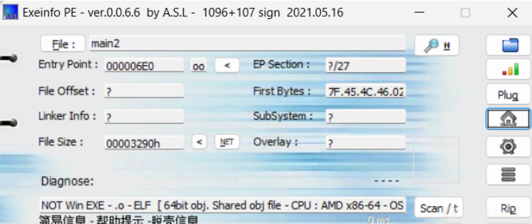](https://xzfile.aliyuncs.com/media/upload/picture/20240120190129-434b8548-b783-1.png)

## 第二步

反手丢进ida看到main 直接F5反编译看一手

[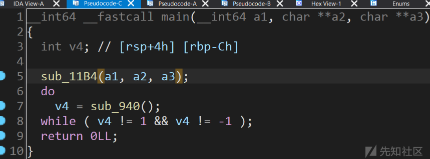](https://xzfile.aliyuncs.com/media/upload/picture/20240120190142-4b332158-b783-1.png)

## 第三步

一个一个函数来，sub\_11B4双击点开好像没啥东西，看看sub\_940

```plain
__int64 sub_940()
{
  int v0; // eax
  int v2; // [rsp+8h] [rbp-218h]
  int v3; // [rsp+Ch] [rbp-214h]
  char v4[520]; // [rsp+10h] [rbp-210h] BYREF
  unsigned __int64 v5; // [rsp+218h] [rbp-8h]
​
  v5 = __readfsqword(0x28u);
  v3 = 0;
  memset(v4, 0, 0x200uLL);
  _isoc99_scanf(&unk_1278, v4, v4);
  while ( 1 )
  {
    do
    {
      v2 = 0;
      sub_86C();
      v0 = v4[v3];
      if ( v0 == 'd' )               //原题是ascii码可以对着ascii按"r"快捷键转成字符
      {
        v2 = sub_E23();
      }
      else if ( v0 > 'd' )          //wasd很明显就是游戏里常见的移动键呗
      {
        if ( v0 == 's' )
        {
          v2 = sub_C5A();
        }
        else if ( v0 == 'w' )
        {
          v2 = sub_A92();
        }
      }
      else
      {
        if ( v0 == 27 )
          return 0xFFFFFFFFLL;
        if ( v0 == 'a' )
          v2 = sub_FEC();
      }
      ++v3;
    }
    while ( v2 != 1 );
    if ( dword_202AB0 == 2 )
      break;
    ++dword_202AB0;
  }
  puts("success! the flag is flag{md5(your input)}");
  return 1LL;
}
```

这里留个心眼，flag是要输入的md5值

接下来分析wasd到底是怎么走的（像这种题大概率就是迷宫图，所以要明白它是怎么运动的）

先打开sub\_E23康康

[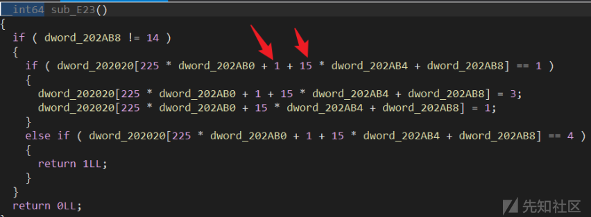](https://xzfile.aliyuncs.com/media/upload/picture/20240120190232-68b7670c-b783-1.png)

## 第四步

千万不要给这几个变量绕晕了

dword\_202020：其实就是题目给的地图，可以双击进去看看（shift+e 提取数据）

dword\_202AB0：代表哪个迷宫，此题有3个迷宫（至于为什么后文会提及）

dword\_202AB4：代表行（因为15\*，说明可能是一行15个数字，大胆猜测！）

dword\_202AB8：代表列

225：地图尺寸15\*15

这里我转换了一下不容易混淆

[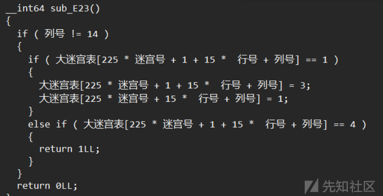](https://xzfile.aliyuncs.com/media/upload/picture/20240120190251-7410e3bc-b783-1.png)

## 第五步

第一个if！=14 是因为跟下标有关系，一行15个数字下标最大是14，我们这个函数是”d“的操作也就是向右移，所以是如果下标等于14的话就不能再”d“了  
第二个if 判断当前位置右移的数字是不是1，如果是将该位置标志为3，之前的位置标志为1，其实就是暗示我们1是可以走的，而3其实是我们的起点，如果不理解后面看看迷宫就明白了，  
第三个if如果右移后是4就返回1，说明4就是我们的终点

再看看上下移动的函数（下图是”s“的函数，也就是下移）------有一些题目上下移动不是单纯的往上或者往下 而是斜向下或者斜向上噢

[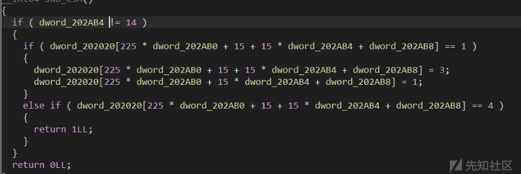](https://xzfile.aliyuncs.com/media/upload/picture/20240120190338-9092fb24-b783-1.png)

## 第六步

每次加15说明每次加一行

注意：这里分析的是右移”d“和下移”s“的函数至于”w“ ”a“都是差不多的，这里就不过多赘述了

再回到sub\_940函数

[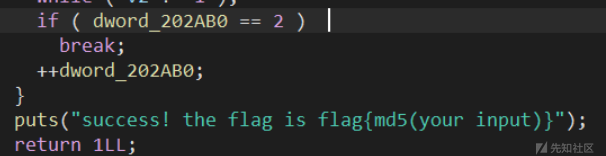](https://xzfile.aliyuncs.com/media/upload/picture/20240120190354-99ad4610-b783-1.png)

## 第七步

这里的dword\_202AB0==2 我们在前面提到它可能是标识哪一个迷宫的，这里说==2的话就break，否则就++，说明这里会循环3次，说明会有3个迷宫，接下来我们来看看这个稍微的迷宫长什么样。

双击点开前文提到的dword\_202020

[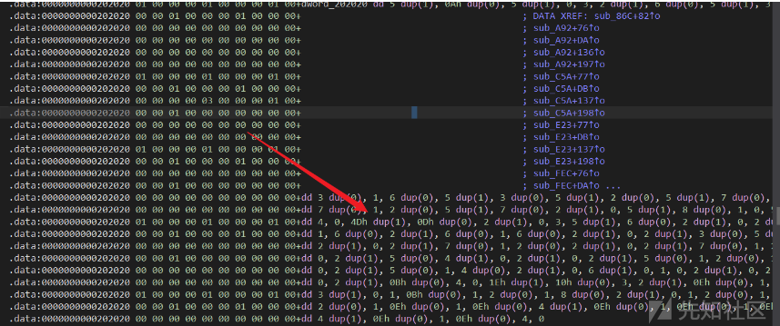](https://xzfile.aliyuncs.com/media/upload/picture/20240120190406-a0f4ee32-b783-1.png)

## 第八步

这密密麻麻的数字就是它的数据啦，现在按shift+e提取数据，然后导出来

[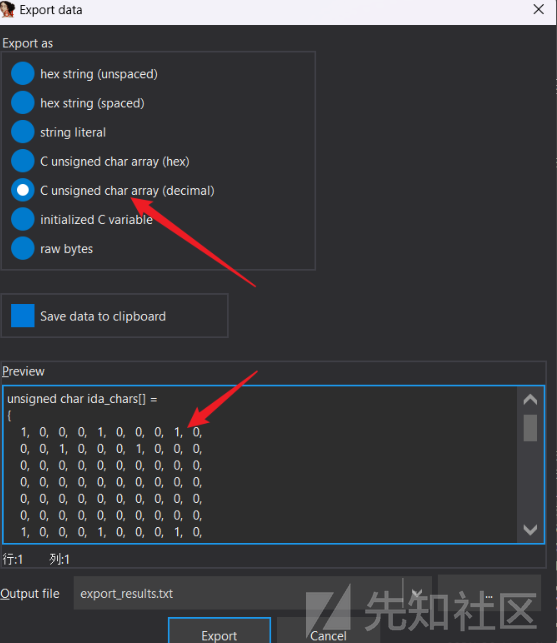](https://xzfile.aliyuncs.com/media/upload/picture/20240120190430-af581198-b783-1.png)  
这里有个大大大坑，就是dword类型的数据是4位一组，只取第一位作为数值，也就是说100010000111 最终会变成110 ，后3位是填充的，接下来就是怎么转换成一个迷宫了，网上一堆wp却几乎没有人提到如何去把这份原始数据转换成迷宫，下面我提供了一个python脚本针对这道题目，只要运行即可得到迷宫的样子，

[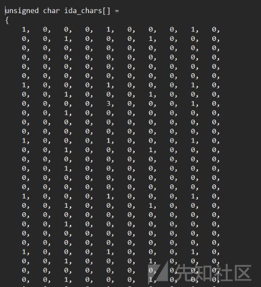](https://xzfile.aliyuncs.com/media/upload/picture/20240120190446-b8b81b20-b783-1.png)  
一开始数据是这样的，先利用记事本的功能替换掉 ，和空格 以及前面的括号等等

[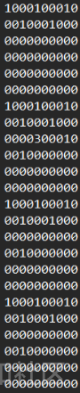](https://xzfile.aliyuncs.com/media/upload/picture/20240120190506-c486eb3e-b783-1.png)  
之后利用一下py脚本即可完成转换

```plain
# 输入需要处理的字符串  
input_string = input("请输入需要处理的字符串：")  

# 将所有字符连起来，去掉换行符  
output_string = input_string.replace("\n", "")  
ZeK1D = output_string.replace(" ", "")    
​
def extract_chars(input_string):  
    # 将输入字符串分割为每四位  
    chunks = [input_string[i:i+4] for i in range(0, len(input_string), 4)]  

    # 提取每四位中的第一位字符  
    first_chars = [chunk[0] for chunk in chunks if chunk]  

    # 将字符连在一起并输出  
    output= ''.join(first_chars)  
    print(output)  


# 调用函数并输出结果  
extract_chars(ZeK1D)
```

之后可以将输出结果复制到word 改格式会好看一点

[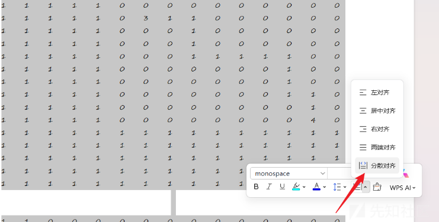](https://xzfile.aliyuncs.com/media/upload/picture/20240120190647-01081f2e-b784-1.png)

## 第九步

之后再按每15行为一个迷宫分成3个小迷宫，以3为起点4为终点进行运动，之后再md5加密即可得到flag

第一个迷宫

\[1, 1, 1, 1, 1, 0, 0, 0, 0, 0, 0, 0, 0, 0, 0\]

\[1, 1, 1, 1, 1, 0, 3, 1, 1, 0, 0, 0, 0, 0, 0\]

\[1, 1, 1, 1, 1, 0, 0, 0, 1, 0, 0, 0, 0, 0, 0\]

\[1, 1, 1, 1, 1, 0, 0, 0, 1, 0, 0, 0, 0, 0, 0\]

\[1, 1, 1, 1, 1, 0, 0, 0, 1, 1, 1, 1, 1, 0, 0\]

\[1, 1, 1, 1, 1, 0, 0, 0, 0, 0, 0, 0, 1, 0, 0\]

\[1, 1, 1, 1, 1, 0, 0, 0, 0, 0, 0, 0, 1, 0, 0\]

\[1, 1, 1, 1, 1, 0, 0, 0, 0, 0, 0, 0, 1, 1, 0\]

\[1, 1, 1, 1, 1, 0, 0, 0, 0, 0, 0, 0, 0, 1, 0\]

\[1, 1, 1, 1, 1, 0, 0, 0, 0, 0, 0, 0, 0, 4, 0\]

\[1, 1, 1, 1, 1, 1, 1, 1, 1, 1, 1, 1, 1, 1, 1\]

\[1, 1, 1, 1, 1, 1, 1, 1, 1, 1, 1, 1, 1, 1, 1\]

\[1, 1, 1, 1, 1, 1, 1, 1, 1, 1, 1, 1, 1, 1, 1\]

\[1, 1, 1, 1, 1, 1, 1, 1, 1, 1, 1, 1, 1, 1, 1\]

\[1, 1, 1, 1, 1, 1, 1, 1, 1, 1, 1, 1, 1, 1, 1\]

第二个迷宫

\[1, 1, 0, 0, 0, 0, 0, 0, 0, 0, 0, 0, 0, 0, 0\]

\[1, 1, 0, 3, 1, 1, 1, 1, 1, 0, 0, 0, 0, 0, 0\]

\[1, 1, 0, 1, 1, 0, 0, 0, 1, 0, 0, 0, 0, 0, 0\]

\[1, 1, 0, 0, 0, 0, 0, 0, 1, 0, 0, 0, 0, 0, 0\]

\[1, 1, 0, 1, 1, 0, 0, 0, 1, 1, 1, 1, 1, 0, 0\]

\[1, 1, 0, 1, 1, 0, 0, 0, 0, 0, 0, 0, 1, 0, 0\]

\[1, 1, 0, 1, 1, 0, 0, 0, 0, 0, 0, 0, 1, 0, 0\]

\[1, 1, 0, 1, 1, 0, 0, 0, 0, 0, 1, 1, 1, 1, 0\]

\[1, 1, 0, 1, 1, 0, 0, 0, 0, 0, 1, 0, 0, 1, 0\]

\[1, 1, 0, 1, 1, 0, 0, 0, 0, 0, 1, 0, 0, 0, 0\]

\[1, 1, 0, 1, 1, 1, 1, 1, 1, 0, 1, 0, 1, 1, 0\]

\[1, 1, 0, 1, 1, 1, 1, 1, 1, 1, 1, 1, 1, 1, 0\]

\[1, 1, 0, 0, 0, 0, 0, 0, 0, 0, 0, 0, 0, 4, 0\]

\[1, 1, 1, 1, 1, 1, 1, 1, 1, 1, 1, 1, 1, 1, 1\]

\[1, 1, 1, 1, 1, 1, 1, 1, 1, 1, 1, 1, 1, 1, 1\]

第三个迷宫

\[0, 0, 0, 0, 0, 0, 0, 0, 0, 0, 0, 0, 0, 0, 0\]

\[0, 3, 1, 1, 0, 0, 0, 0, 0, 0, 0, 0, 0, 0, 0\]

\[0, 0, 0, 1, 0, 1, 1, 1, 0, 0, 0, 0, 0, 0, 0\]

\[0, 0, 0, 1, 1, 1, 0, 1, 0, 0, 0, 0, 0, 0, 0\]

\[0, 0, 0, 0, 1, 0, 0, 1, 0, 0, 0, 0, 0, 0, 0\]

\[0, 1, 1, 0, 1, 0, 0, 1, 0, 0, 0, 0, 0, 0, 0\]

\[0, 0, 1, 1, 1, 0, 0, 1, 0, 0, 0, 0, 0, 0, 0\]

\[0, 0, 0, 0, 0, 0, 0, 1, 0, 0, 0, 0, 0, 0, 0\]

\[0, 0, 0, 0, 0, 0, 0, 1, 1, 1, 1, 0, 0, 0, 0\]

\[0, 0, 0, 0, 0, 0, 0, 0, 0, 0, 1, 0, 0, 0, 0\]

\[0, 0, 0, 0, 0, 0, 0, 0, 0, 0, 1, 0, 0, 0, 0\]

\[0, 0, 0, 0, 0, 0, 0, 0, 0, 0, 1, 0, 0, 0, 0\]

\[0, 0, 0, 0, 0, 0, 0, 0, 0, 0, 1, 1, 1, 1, 0\]

\[0, 0, 0, 0, 0, 0, 0, 0, 0, 0, 0, 0, 0, 1, 0\]

\[0, 0, 0, 0, 0, 0, 0, 0, 0, 0, 0, 0, 0, 4, 0\]

行动轨迹为：ddsssddddsssdssdddddsssddddsssaassssdddsddssddwddssssssdddssssdddss

经过md5编码后flag是flag{aeea66fcac7fa80ed8f79f38ad5bb953}

## 总结：

逆向遇到迷宫题的思路大概分2点

1.弄清楚移动的方式

2.分析迷宫图的尺寸

3.手动走迷宫或写脚本走迷宫（建议BFS算法）
