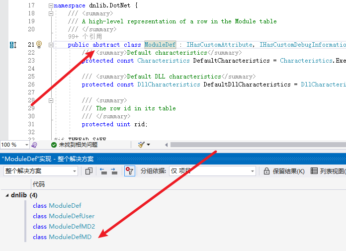
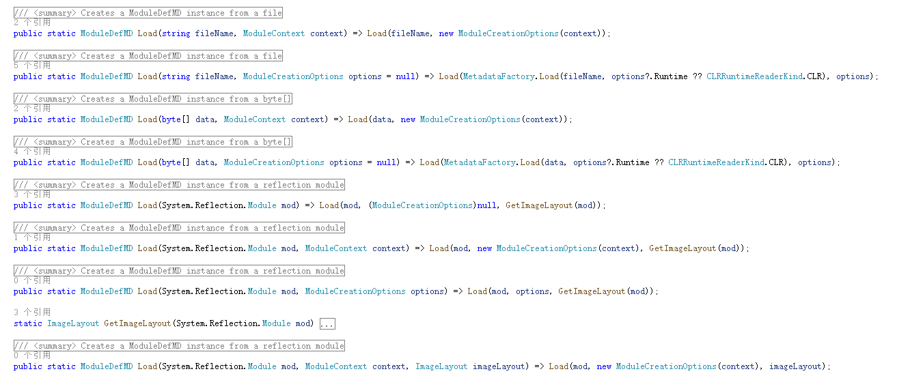
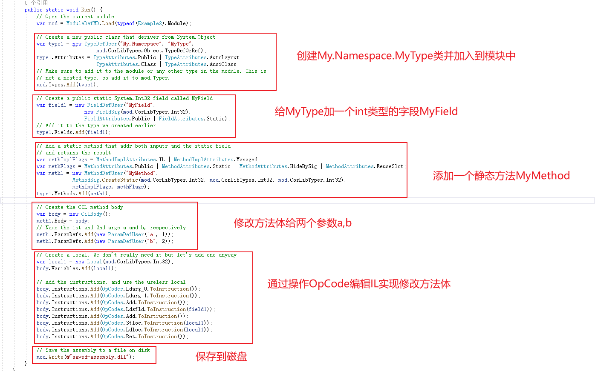
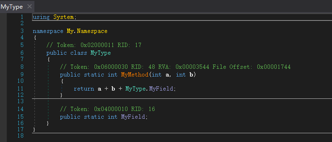

# dnlib使用

[Y4er](https://y4er.com/ "Author")  收录于  类别 [代码审计](https://y4er.com/categories/%E4%BB%A3%E7%A0%81%E5%AE%A1%E8%AE%A1/)

 2023-10-26  2023-10-26  约 1904 字  预计阅读 4 分钟 

# [](#%e5%89%8d%e8%a8%80)\# 前言

看了老外的白皮书兴高采烈去挖洞了，然后发现人家挖洞是黑名单，我挖洞是白名单。需要自己找gadget，可是一个一个找构造函数、getter、setter是真的慢，干脆学一下 [https://github.com/0xd4d/dnlib](https://github.com/0xd4d/dnlib) 看能不能整个.net的tabby出来算求。

接下来我将以下面这个类作为测试的程序集，讲解dnlib的使用。

|     |     |
| --- | --- |
| ```plain<br> 1<br> 2<br> 3<br> 4<br> 5<br> 6<br> 7<br> 8<br> 9<br>10<br>11<br>12<br>13<br>14<br>15<br>16<br>17<br>18<br>19<br>20<br>21<br>22<br>23<br>24<br>25<br>26<br>27<br>28<br>29<br>30<br>31<br>32<br>33<br>34<br>35<br>36<br>37<br>38<br>39<br>40<br>41<br>42<br>43<br>44<br>45<br>46<br>47<br>48<br>49<br>50<br>51<br>52<br>53<br>54<br>55<br>56<br>57<br>58<br>59<br>60<br>61<br>62<br>63<br>64<br>65<br>66<br>67<br>68<br>69<br>``` | ```csharp<br>using System;<br>using System.Collections.Generic;<br><br>namespace TestApp<br>{<br>    internal class Program<br>    {<br>        static void Main(string[] args)<br>        {<br>            Console.WriteLine("asd");<br>        }<br>    }<br>    abstract class A<br>    {<br>        public int AProp { get; set; }<br>        public abstract void M();<br>    }<br>    interface ITest<br>    {<br>        void IMethod();<br>        void IMethod(string s);<br>        int IProp { get; set; }<br>    }<br>    class Test<br>    {<br>        public int MyProperty { get; set; }<br>        private int MyValue { get; set; }<br>        private int Count;<br>        public delegate void Handler();<br>        public event Handler Change;<br><br>        public static string Hello(string s)<br>        {<br>            Console.WriteLine(s);<br>            return "hello";<br>        }<br><br>        public Test() { Console.WriteLine("ctor"); }<br>        public Test(string s) { Console.WriteLine("ctor string " + s); }<br><br>    }<br>    class Container<br>    {<br>        public class Nested<br>        {<br>            private Container parent;<br><br>            public Nested()<br>            {<br>            }<br>            public Nested(Container parent)<br>            {<br>                this.parent = parent;<br>            }<br>        }<br>    }<br>    enum E<br>    {<br>        None = 0,<br>    }<br><br>    class G : Comparer<string><br>    {<br>        public override int Compare(string x, string y)<br>        {<br>            return x.CompareTo(y);<br>        }<br>    }<br>}<br>``` |

# [](#dnlib%e7%9a%84%e5%b8%b8%e7%94%a8%e7%b1%bb)\# dnlib的常用类

-   AssemblyDef assembly程序集类
-   ModuleDef 模块类
-   TypeDef 类型定义 包含了事件、属性、字段等
-   EventDef 事件类
-   FieldDef 字段类
-   PropertyDef 属性类

会发现，都是以XXDef命名，还有一些是以XXRef命名的类，表示引用类，这里暂不讨论。

XXDef为抽象类，真正实现类在XXDefMD，如ModuleDef

[](https://qiita-image-store.s3.ap-northeast-1.amazonaws.com/0/593424/3368522c-c679-4635-1815-e2522c0fc4a5.png "image.png")

其实现类为ModuleDefMD，我们用也是用它。

# [](#%e8%bd%bd%e5%85%a5%e7%a8%8b%e5%ba%8f%e9%9b%86)\# 载入程序集

首先要先引入命名空间

|     |     |
| --- | --- |
| ```plain<br>1<br>2<br>``` | ```csharp<br>using dnlib.DotNet;<br>using dnlib.DotNet.Emit;<br>``` |

dnlib中提供了多种读取dotnet程序集的方式

|     |     |
| --- | --- |
| ```plain<br>1<br>2<br>``` | ```csharp<br>ModuleContext modCtx = ModuleDef.CreateModuleContext();<br>ModuleDefMD module = ModuleDefMD.Load(@"C:\path\to\file.exe", modCtx);<br>``` |

Load有多个重载，提供从文件中、byte中、内存中或者是System.Reflection.Module示例读取程序集

[](https://qiita-image-store.s3.ap-northeast-1.amazonaws.com/0/593424/90d52b73-6ab0-e829-1ba4-6654c023091a.png "image.png")

比如以下代码就将从type void拿到System.Reflection.Module实例，从而加载mscorlib.dll

|     |     |
| --- | --- |
| ```plain<br>1<br>2<br>3<br>``` | ```csharp<br>System.Reflection.Module reflectionModule = typeof(void).Module;	// Get mscorlib.dll's module<br>ModuleContext modCtx = ModuleDef.CreateModuleContext();<br>ModuleDefMD module = ModuleDefMD.Load(reflectionModule, modCtx);<br>``` |

# [](#%e8%af%bb%e5%8f%96%e7%a8%8b%e5%ba%8f%e9%9b%86)\# 读取程序集

在dnlib的Example1 [https://github.com/0xd4d/dnlib/blob/master/Examples/Example1.cs](https://github.com/0xd4d/dnlib/blob/master/Examples/Example1.cs) 中给了例子

|     |     |
| --- | --- |
| ```plain<br> 1<br> 2<br> 3<br> 4<br> 5<br> 6<br> 7<br> 8<br> 9<br>10<br>11<br>12<br>13<br>14<br>15<br>16<br>17<br>18<br>19<br>20<br>21<br>22<br>23<br>24<br>25<br>26<br>27<br>28<br>29<br>30<br>31<br>32<br>33<br>34<br>35<br>36<br>37<br>38<br>39<br>40<br>``` | ```csharp<br>using System;<br>using dnlib.DotNet;<br><br>namespace dnlib.Examples {<br>	// This example will open mscorlib.dll and then print out all types<br>	// in the assembly, including the number of methods, fields, properties<br>	// and events each type has.<br>	public class Example1 {<br>		public static void Run() {<br>			// Load mscorlib.dll<br>			var filename = typeof(void).Module.FullyQualifiedName;<br>			var mod = ModuleDefMD.Load(filename);<br><br>			int totalNumTypes = 0;<br>			// mod.Types only returns non-nested types.<br>			// mod.GetTypes() returns all types, including nested types.<br>			foreach (var type in mod.GetTypes()) {<br>				totalNumTypes++;<br>				Console.WriteLine();<br>				Console.WriteLine("Type: {0}", type.FullName);<br>				if (type.BaseType is not null)<br>					Console.WriteLine("  Base type: {0}", type.BaseType.FullName);<br><br>				Console.WriteLine("  Methods: {0}", type.Methods.Count);<br>				Console.WriteLine("  Fields: {0}", type.Fields.Count);<br>				Console.WriteLine("  Properties: {0}", type.Properties.Count);<br>				Console.WriteLine("  Events: {0}", type.Events.Count);<br>				Console.WriteLine("  Nested types: {0}", type.NestedTypes.Count);<br><br>				if (type.Interfaces.Count > 0) {<br>					Console.WriteLine("  Interfaces:");<br>					foreach (var iface in type.Interfaces)<br>						Console.WriteLine("    {0}", iface.Interface.FullName);<br>				}<br>			}<br>			Console.WriteLine();<br>			Console.WriteLine("Total number of types: {0}", totalNumTypes);<br>		}<br>	}<br>}<br>``` |

通过mod.GetTypes()拿到type定义后，我们可以获取type的method、field、prop、event等等属性，我们写一下代码解析下我们的TestApp.exe

|     |     |
| --- | --- |
| ```plain<br> 1<br> 2<br> 3<br> 4<br> 5<br> 6<br> 7<br> 8<br> 9<br>10<br>11<br>12<br>13<br>14<br>15<br>16<br>17<br>18<br>19<br>20<br>21<br>22<br>23<br>24<br>25<br>26<br>``` | ```csharp<br>ModuleContext modCtx = ModuleDef.CreateModuleContext();<br>ModuleDefMD module = ModuleDefMD.Load(@"E:\code\ConsoleApp2\TestApp\bin\Debug\TestApp.exe", modCtx);<br>AssemblyDef assembly = module.Assembly;<br><br>foreach (ModuleDef m in assembly.Modules)<br>{<br>    Console.WriteLine("Module: " + m.FullName);<br>    //遍历类<br>    foreach (TypeDef type in m.Types)<br>    {<br>        Console.WriteLine("Class: " + type.Name);<br><br>        //遍历方法<br>        foreach (MethodDef method in type.Methods)<br>        {<br>            Console.WriteLine("Method: " + method.Name);<br>        }<br><br>        //遍历字段<br>        foreach (FieldDef field in type.Fields)<br>        {<br>            Console.WriteLine("Field: " + field.Name);<br>        }<br>    }<br>}<br>Console.ReadKey();<br>``` |

输出

|     |     |
| --- | --- |
| ```plain<br> 1<br> 2<br> 3<br> 4<br> 5<br> 6<br> 7<br> 8<br> 9<br>10<br>11<br>12<br>13<br>14<br>15<br>16<br>17<br>18<br>19<br>20<br>21<br>22<br>23<br>24<br>25<br>26<br>27<br>28<br>29<br>30<br>31<br>32<br>33<br>34<br>35<br>36<br>37<br>38<br>``` | ```fallback<br>Module: TestApp.exe<br>Class: <Module><br>Class: Program<br>Method: Main<br>Method: .ctor<br>Class: A<br>Method: get_AProp<br>Method: set_AProp<br>Method: M<br>Method: .ctor<br>Field: <AProp>k__BackingField<br>Class: ITest<br>Method: IMethod<br>Method: IMethod<br>Method: get_IProp<br>Method: set_IProp<br>Class: Test<br>Method: get_MyProperty<br>Method: set_MyProperty<br>Method: get_MyValue<br>Method: set_MyValue<br>Method: add_Change<br>Method: remove_Change<br>Method: Hello<br>Method: .ctor<br>Method: .ctor<br>Field: <MyProperty>k__BackingField<br>Field: <MyValue>k__BackingField<br>Field: Count<br>Field: Change<br>Class: Container<br>Method: .ctor<br>Class: E<br>Field: value__<br>Field: None<br>Class: G<br>Method: Compare<br>Method: .ctor<br>``` |

# [](#%e8%a7%a3%e6%9e%90call%e5%85%b3%e7%b3%bb)\# 解析call关系

解析call关系其实是解析method body的opcode，比如静态方法调用的OpCodes.Call [https://learn.microsoft.com/en-us/dotnet/api/system.reflection.emit.opcodes.calli?view=net-7.0](https://learn.microsoft.com/en-us/dotnet/api/system.reflection.emit.opcodes.calli?view=net-7.0)

|     |     |
| --- | --- |
| ```plain<br> 1<br> 2<br> 3<br> 4<br> 5<br> 6<br> 7<br> 8<br> 9<br>10<br>11<br>12<br>13<br>14<br>15<br>16<br>17<br>18<br>19<br>20<br>21<br>22<br>23<br>24<br>25<br>26<br>27<br>28<br>29<br>30<br>31<br>32<br>33<br>34<br>35<br>36<br>37<br>38<br>39<br>40<br>41<br>42<br>43<br>44<br>45<br>46<br>47<br>48<br>49<br>50<br>51<br>52<br>53<br>54<br>55<br>56<br>``` | ```csharp<br>using System;<br>using dnlib.DotNet;<br>using dnlib.DotNet.Emit;<br><br>namespace tabby<br>{<br>    internal class Program<br>    {<br>        static void Main(string[] args)<br>        {<br>            ModuleContext modCtx = ModuleDef.CreateModuleContext();<br>            ModuleDefMD module = ModuleDefMD.Load(@"E:\code\ConsoleApp2\TestApp\bin\Debug\TestApp.exe", modCtx);<br>            AssemblyDef assembly = module.Assembly;<br><br>            foreach (ModuleDef m in assembly.Modules)<br>            {<br>                Console.WriteLine("Module: " + m.FullName);<br>                //遍历类<br>                foreach (TypeDef type in m.Types)<br>                {<br>                    Console.WriteLine("Class: " + type.Name);<br><br>                    //遍历方法<br>                    foreach (MethodDef method in type.Methods)<br>                    {<br>                        Console.WriteLine("Method: " + method.Name);<br><br>                        if (method.HasBody && method.Body.HasInstructions)<br>                        {<br>                            var instructions = method.Body.Instructions;<br><br>                            foreach (var ins in instructions)<br>                            {<br>                                if (ins.OpCode == OpCodes.Call \| ins.OpCode == OpCodes.Callvirt)<br>                                {<br>                                    // 获取调用的方法<br>                                    IMethod calledMethod = (IMethod)ins.Operand;<br><br>                                    // 输出调用关系<br>                                    Console.WriteLine("{0} {1} {2}", method.FullName, ins.OpCode, calledMethod.FullName);<br>                                }<br>                            }<br>                        }<br>                    }<br><br>                    //遍历字段<br>                    foreach (FieldDef field in type.Fields)<br>                    {<br>                        Console.WriteLine("Field: " + field.Name);<br>                    }<br>                }<br>            }<br>            Console.ReadKey();<br>        }<br>    }<br>}<br>``` |

输出

|     |     |
| --- | --- |
| ```plain<br> 1<br> 2<br> 3<br> 4<br> 5<br> 6<br> 7<br> 8<br> 9<br>10<br>11<br>12<br>13<br>14<br>15<br>16<br>17<br>18<br>19<br>20<br>21<br>22<br>23<br>24<br>25<br>26<br>27<br>28<br>29<br>30<br>31<br>32<br>33<br>34<br>35<br>36<br>37<br>38<br>39<br>40<br>41<br>42<br>43<br>44<br>45<br>46<br>47<br>48<br>49<br>50<br>51<br>52<br>53<br>54<br>``` | ```fallback<br>Module: TestApp.exe<br>Class: <Module><br>Class: Program<br>Method: Main<br>System.Void TestApp.Program::Main(System.String[]) call System.Void System.Console::WriteLine(System.String)<br>Method: .ctor<br>System.Void TestApp.Program::.ctor() call System.Void System.Object::.ctor()<br>Class: A<br>Method: get_AProp<br>Method: set_AProp<br>Method: M<br>Method: .ctor<br>System.Void TestApp.A::.ctor() call System.Void System.Object::.ctor()<br>Field: <AProp>k__BackingField<br>Class: ITest<br>Method: IMethod<br>Method: IMethod<br>Method: get_IProp<br>Method: set_IProp<br>Class: Test<br>Method: get_MyProperty<br>Method: set_MyProperty<br>Method: get_MyValue<br>Method: set_MyValue<br>Method: add_Change<br>System.Void TestApp.Test::add_Change(TestApp.Test/Handler) call System.Delegate System.Delegate::Combine(System.Delegate,System.Delegate)<br>System.Void TestApp.Test::add_Change(TestApp.Test/Handler) call TestApp.Test/Handler System.Threading.Interlocked::CompareExchange<TestApp.Test/Handler>(TestApp.Test/Handler&,TestApp.Test/Handler,TestApp.Test/Handler)<br>Method: remove_Change<br>System.Void TestApp.Test::remove_Change(TestApp.Test/Handler) call System.Delegate System.Delegate::Remove(System.Delegate,System.Delegate)<br>System.Void TestApp.Test::remove_Change(TestApp.Test/Handler) call TestApp.Test/Handler System.Threading.Interlocked::CompareExchange<TestApp.Test/Handler>(TestApp.Test/Handler&,TestApp.Test/Handler,TestApp.Test/Handler)<br>Method: Hello<br>System.String TestApp.Test::Hello(System.String) call System.Void System.Console::WriteLine(System.String)<br>Method: .ctor<br>System.Void TestApp.Test::.ctor() call System.Void System.Object::.ctor()<br>System.Void TestApp.Test::.ctor() call System.Void System.Console::WriteLine(System.String)<br>Method: .ctor<br>System.Void TestApp.Test::.ctor(System.String) call System.Void System.Object::.ctor()<br>System.Void TestApp.Test::.ctor(System.String) call System.String System.String::Concat(System.String,System.String)<br>System.Void TestApp.Test::.ctor(System.String) call System.Void System.Console::WriteLine(System.String)<br>Field: <MyProperty>k__BackingField<br>Field: <MyValue>k__BackingField<br>Field: Count<br>Field: Change<br>Class: Container<br>Method: .ctor<br>System.Void TestApp.Container::.ctor() call System.Void System.Object::.ctor()<br>Class: E<br>Field: value__<br>Field: None<br>Class: G<br>Method: Compare<br>System.Int32 TestApp.G::Compare(System.String,System.String) callvirt System.Int32 System.String::CompareTo(System.String)<br>Method: .ctor<br>System.Void TestApp.G::.ctor() call System.Void System.Collections.Generic.Comparer`1<System.String>::.ctor()<br>``` |

# [](#%e4%bf%ae%e6%94%b9method-body)\# 修改method body

这个案例我们直接看Example2.cs就行了 [https://github.com/0xd4d/dnlib/blob/master/Examples/Example2.cs](https://github.com/0xd4d/dnlib/blob/master/Examples/Example2.cs)

[](https://qiita-image-store.s3.ap-northeast-1.amazonaws.com/0/593424/d055f974-1818-1943-efda-6c63303a6ab4.png "image.png")

用dnspy看看

[](https://qiita-image-store.s3.ap-northeast-1.amazonaws.com/0/593424/2ce9777d-55df-565d-c346-539b14ba95ab.png "image.png")

确实多了这个类

# [](#%e6%80%bb%e7%bb%93)\# 总结

简单写了写怎么用，和javassist差的还是比较远，需要实现IL的翻译。

不过只是为了找到call关系的话，足够了，优化下加个多线程，~加个neo4j就是下一个tabby for dotnet。~

文笔垃圾，措辞轻浮，内容浅显，操作生疏。不足之处欢迎大师傅们指点和纠正，感激不尽。


*如果你觉得这篇文章对你有所帮助，欢迎赞赏或关注微信公众号～*


更新于 2023-10-26

 [dotnet](https://y4er.com/tags/dotnet/), [dnlib](https://y4er.com/tags/dnlib/)

[返回](javascript:) | [主页](https://y4er.com/)

[dotnet反序列化新链学习](https://y4er.com/posts/dotnet-new-gadget/ "dotnet反序列化新链学习")

# 0 Comments *\- powered by [utteranc.es](https://utteranc.es/)*


Write Preview

[↓↓↓](https://guides.github.com/features/mastering-markdown/)  
  
Styling with Markdown is supported  
  
[↑↑↑](https://guides.github.com/features/mastering-markdown/)

[↓↓↓](https://api.utteranc.es/authorize?redirect_uri=https%3A%2F%2Fy4er.com%2Fposts%2Fdnlib-usage%2F)  
  
Sign in with GitHub  
  
[↑↑↑](https://api.utteranc.es/authorize?redirect_uri=https%3A%2F%2Fy4er.com%2Fposts%2Fdnlib-usage%2F)
