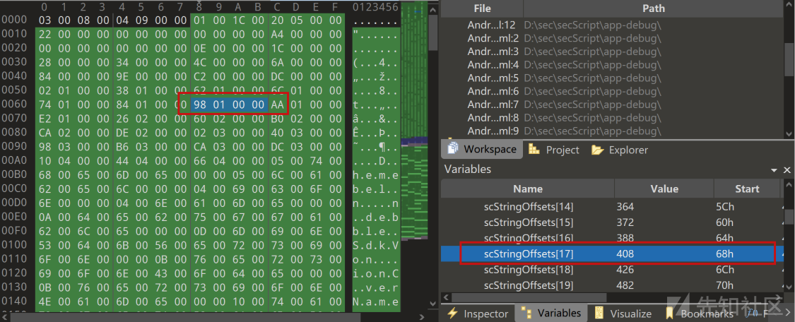

# fuzz AndroidManifest.xml 实现反编译对抗 - 先知社区

fuzz AndroidManifest.xml 实现反编译对抗

* * *

有的恶意APK为了防止被apktool反编译，就会在AndroidManifest.xml里面进行一些特殊处理，来干扰apktool反编译，实现安装运行APK没问题，但是apktool 反编译的时候会出现异常并退出  
例如下面这个APK，在apktool 2.8.1版本下，就无法正常反编译，但是却能够adb install安装

[](https://xzfile.aliyuncs.com/media/upload/picture/20231029174457-d25a5bea-763f-1.png)

这篇文章[Android免杀小结](https://xz.aliyun.com/t/12893#toc-10)中提到过可以通过修改AndroidManifest.xml二进制文件中的某一位来干扰apktool的判断，但是告诉我们如何寻找这种能够干扰反编译软件的位，所以本篇会针对单位修改AndroidManifest.xml文件对抗反编译进行讨论

## 环境准备

本机使用windows系统，测试机 AOSP Android 11，这里的反编译工具是Apktool，截止到今天最新版本是 [v2.9.0](https://github.com/iBotPeaches/Apktool/releases/tag/v2.9.0)

[](https://xzfile.aliyuncs.com/media/upload/picture/20231029174522-e108bb64-763f-1.png)

本地更新一下jar包

[](https://xzfile.aliyuncs.com/media/upload/picture/20231029174649-15187016-7640-1.png)

010Editor，用到这个是为了查看AndroidManifest.xml 的二进制数据格式  
现在环境就OK了

## AndroidManifest.xml 简介

_如果不了解AndroidManifest.xml 文件结构就暴力fuzz未免太粗鲁了_  
AndroidManifest.xml 是 Android 应用程序的清单文件，用于描述应用程序的基本信息、声明组件和权限等内容，是安卓应用开发中非常重要的一个文件  
以之前写的一个AndroidManifest.xml 文件为例：

```plain
<?xml version="1.0" encoding="utf-8"?>
<manifest xmlns:android="http://schemas.android.com/apk/res/android"
    xmlns:tools="http://schemas.android.com/tools"
    package="hi.beautifulz.myapplication">
    <uses-permission android:name="android.permission.INTERNET" />
    <uses-permission android:name="android.permission.ACCESS_WIFI_STATE" />

    <uses-feature android:name="android.hardware.camera" />
    <uses-feature android:name="android.hardware.camera.autofocus" />
    <uses-feature android:name="android.hardware.microphone" />

    <application
        android:allowBackup="true"
        android:icon="@mipmap/ic_launcher"
        android:label="@string/app_name"
        android:roundIcon="@mipmap/ic_launcher_round"
        android:theme="@style/AppTheme">
        <activity
            android:name=".MainActivity"
            android:label="@string/app_name"
            android:exported="true"
            >
            <intent-filter>
                <action android:name="android.intent.action.MAIN" />
                <category android:name="android.intent.category.LAUNCHER" />
            </intent-filter>
        </activity>
        <receiver
            android:name=".MainBroadcastReceiver"
            android:label="MainBroadcastReceiver"
            android:exported="true">
            <intent-filter>
                <action android:name="android.intent.action.BOOT_COMPLETED" />
            </intent-filter>
        </receiver>
        <service android:name=".MyService" android:exported="true" />
    </application>

</manifest>
```

简单介绍一下该文件：

*   <manifest> 元素是必须的，它定义了整个文件的根元素，并且包含了一些必要的属性，例如 package </manifest>
*   <uses-permission> 元素用于声明应用程序所需的权限</uses-permission>
*   <uses-feature> 元素用于声明应用程序所需的设备功能和硬件特性</uses-feature>
*   <application> 元素是应用程序的核心元素，它包含了所有的组件和各种配置信息，例如主 activity、自定义 theme、icon 等等。
    *   <activity> 元素用于声明应用程序中的 Activity 组件</activity>
    *   <service> 元素用于声明应用程序中的 Service 组件</service>
    *   <receiver> 元素用于声明应用程序中的 Broadcast Receiver 组件</receiver>
    *   <provider> 元素用于声明应用程序中的 Content Provider 组件</provider>
    *   .......</application>

## AndroidManifest.xml二进制文件结构

### 文件大纲

MindMac师傅在看雪发的图

[](https://xzfile.aliyuncs.com/media/upload/picture/20231029174726-2afb8530-7640-1.png)  
当然没基础的话，直接看这个图其实没什么卵用  
根据附件里面的AndroidManifest.xml文件生成二进制文件，跟着MindMac的思路使用010Editor进行分析  
编码前的xml文件内容如下

```plain
<?xml version="1.0" encoding="utf-8"?>
<manifest xmlns:android="http://schemas.android.com/apk/res/android"
    package="com.android.test"
    android:versionCode="1"
    android:versionName="1.0" >

    <uses-sdk
        android:minSdkVersion="14"
        android:targetSdkVersion="19" />

    <uses-permission android:name="android.permission.INTERNET" />

    <application
        android:allowBackup="false"
        android:icon="@drawable/ic_launcher"
        android:label="@string/app_name"
        android:theme="@style/AppTheme" >
        <activity
            android:name="com.android.test.MainActivity"
            android:label="@string/app_name" >
            <intent-filter>
                <action android:name="android.intent.action.MAIN" />
                <category android:name="android.intent.category.LAUNCHER" />
            </intent-filter>
        </activity>
    </application>
</manifest>
```

用这个xml生成APK，APK再解压之后得到AndroidManifest.xml二进制文件，丢到010editor里面，以十六进制的格式查看

[](https://xzfile.aliyuncs.com/media/upload/picture/20231029174745-361843d6-7640-1.png)

感觉跟MindMac的内容有点不太一样，难道是因为版本的问题，加载AndroidManifest.bt Template

[](https://xzfile.aliyuncs.com/media/upload/picture/20231029174756-3cf7ef8a-7640-1.png)  
可以看到已经把AndroidManifest文件架构列出来了  
MindMac把文件分为了五个结构，这里的Magic Number和File Size其实都属于header  
[](https://xzfile.aliyuncs.com/media/upload/picture/20231029174809-44a9974c-7640-1.png)  
header内容为

[](https://xzfile.aliyuncs.com/media/upload/picture/20231029174819-4a370686-7640-1.png)  
所以可以分为四个部分

*   Header : 包括文件魔数和文件大小
*   String Chunk : 字符串资源池
*   ResourceId Chunk : 系统资源 id 信息
*   XmlContent Chunk : 清单文件中的具体信息，其中包含了五个部分

接下来简单分析一下这几个部分

### Header

[](https://xzfile.aliyuncs.com/media/upload/picture/20231029174830-5153f3f2-7640-1.png)

AndroidManifest的魔数为 0x00080003

> 关于魔数  
> 二进制文件的魔数（Magic Number）是一种固定值，用于标识文件类型或格式。不同的文件类型通常具有不同的魔数。
> 
> 以下是一些常见的二进制文件魔数示例：
> 
> *   ELF（可执行和共享目标文件）：0x7F 0x45 0x4C 0x46
> *   JPEG（图片文件）：0xFF 0xD8
> *   PNG（可移植网络图形）：0x89 0x50 0x4E 0x47 0x0D 0x0A 0x1A 0x0A
> *   PDF（便携式文档格式）：0x25 0x50 0x44 0x46
> *   ZIP（压缩文件）：0x50 0x4B 0x03 0x04
> *   GIF（图形交换格式）：0x47 0x49 0x46 0x38

另外为什么这里是 0x00080003 而不是 0x03000800  
是因为清单文件是小端表示的

在早期的apktool会识别AndroidManifest文件，如果魔数不为0x00080003则反编译失败，该方法也用在了某些恶意APK上，比如链安的这篇文章[https://www.liansecurity.com/#/main/news/IPONQIoBE2npFSfFbCRf/detail](https://www.liansecurity.com/#/main/news/IPONQIoBE2npFSfFbCRf/detail)

[](https://xzfile.aliyuncs.com/media/upload/picture/20231029174902-64271b62-7640-1.png)  
其中修改魔数为 00 00 08 00 则可以实现干扰  
该方法在新版本的apktool测试已失效

该文件的filesize为0x00000904即2308字节

[](https://xzfile.aliyuncs.com/media/upload/picture/20231029174916-6cbf77a6-7640-1.png)

### Other

其他的模块就不一一赘述，如果想要自己跟着分析每一块内容可以参考

*   [https://bbs.kanxue.com/thread-194206.htm](https://bbs.kanxue.com/thread-194206.htm)
*   [https://juejin.cn/post/6844903747169026061](https://juejin.cn/post/6844903747169026061)

总而言之，AndroidManifest里面的每一位都有自己的作用

## 手动修改AndroidManifest文件

手动修改在010Editor里面修改AndroidManifest，例如这里修改为 00

[](https://xzfile.aliyuncs.com/media/upload/picture/20231029174935-77a62228-7640-1.png)  
然后压缩成zip文件，修改zip后缀为apk，就能够生效了（这个时候只是修改，并没有干扰反编译软件)

## 自动化fuzz

> 手动是不可能手动的

自动化fuzz的AndroidManifest.xml文本内容如下：

```plain
<?xml version="1.0" encoding="utf-8"?>
<manifest xmlns:android="http://schemas.android.com/apk/res/android"
    package="com.android.test"
    android:versionCode="1"
    android:versionName="1.0" >

    <uses-sdk android:targetSdkVersion="29" />

    <uses-permission android:name="android.permission.INTERNET" />

    <application
        android:allowBackup="false"
        android:icon="@drawable/ic_launcher"
        android:label="@string/app_name"
        android:theme="@style/AppTheme" >
        <activity
            android:name="com.android.test.MainActivity"
            android:label="@string/app_name" >
            <intent-filter>
                <action android:name="android.intent.action.MAIN" />
                <category android:name="android.intent.category.LAUNCHER" />
            </intent-filter>
        </activity>
    </application>
</manifest>
```

### 获取apktool解析结果

之前先知上面的这篇文章 [https://xz.aliyun.com/t/12893#toc-10](https://xz.aliyun.com/t/12893#toc-10) stringPoolSize陷阱，修改字符串个数 stringCount 字段，导致跟实际对应不上，会造成AndroidManifest.xml解析出现问题，但是这个问题 2.9.0已经修复了，我们在2.8.1上先捕捉一下这个错误

[](https://xzfile.aliyuncs.com/media/upload/picture/20231029174953-82ccd2dc-7640-1.png)  
使用python获取apktool的运行结果，为啥这里写的这么复杂是因为apktool的运行结果直接获取不到，需要Press any key to continue . . .  
需要获取实时的运行流才可以确认结果

```plain
def apktoolDecode() -> bool:
    """
    获取apktool的扫描结果
    :rtype: object
        True 扫描出错
        False 扫描成功
    """
    apktool_cmd = f"apktool d -f {sign_name} "
    process = subprocess.Popen(apktool_cmd, shell=True, stdout=subprocess.PIPE, stderr=subprocess.PIPE, text=True)

    # 定义一个标志位来表示命令是否已经执行完成
    command_completed = threading.Event()

    def handle_output(stream, prefix):
        for line in stream:
            print(f"{prefix}: {line.strip()}")
            command_completed.set()  # 设置标志位，表示命令已完成

    stderr_thread = threading.Thread(target=handle_output, args=(process.stderr, "STDERR"))
    stderr_thread.start()
    timeout_seconds = 5
    command_completed.wait(timeout_seconds)

    if not command_completed.is_set():
        process.terminate()
        return False
    else:
        process.terminate()
        return True
```

遇到解析不了的APK的时候就会返回True，正常解析的就会返回False  
  
[](https://xzfile.aliyuncs.com/media/upload/picture/20231029175005-89ba0e2a-7640-1.png)

### 优化

简单计算一下会有多少种可能性，前面提到过该文件有2308个字节，一个字节修改范围为 0x00 - 0xFF，即256，所以一共有590848种可能性，如果是单线程运行的话需要八百多个小时

[](https://xzfile.aliyuncs.com/media/upload/picture/20231029175016-8ff809fe-7640-1.png)

蒽....  
考虑已知的干扰位置，我们对每一个字节的修改范围变成下面两种可能来缩减范围：

*   0x00 比如魔数，把 0x03修改为了0x00
*   跟原本位置不同的数字，比如stringCount原来是0x23 我们修改为0x24

在这个基础上 可能性缩减到了4616

### 获取结果

在前面的思路上编写出脚本运行就可以了，能够造成apktool 2.9.0 干扰的位置有很多，但是有的位置修改了之后会导致手机也安装不上，出现错误

> adb: failed to install .\\app-debug.apk: Failure \[INSTALL\_PARSE\_FAILED\_UNEXPECTED\_EXCEPTION: Failed to parse /data/app/vmdl1242571071.tmp/base.apk: Corrupt XML binary file\]

[](https://xzfile.aliyuncs.com/media/upload/picture/20231029175029-98056902-7640-1.png)  
所以我们不仅要能够干扰apktool，还需要修改之后能够正常安装  
在原来的基础上添加了自动签名代码

```plain
def signApk():
    subprocess.run(
        ['jarsigner', '-verbose', '-sigalg', 'SHA1withRSA', '-digestalg', 'SHA1', '-keystore', "./spring.keystore",
         '-storepass', "123456", '-keypass', "123456", '-signedjar', "sign.apk", "./app-debug.apk", "spring"])
```

验证是否能正常安装代码

```plain
def installApp():
    adb_install_cmd = f'adb install  {sign_name}'
    result = os.system(adb_install_cmd)
    if result == 0:
        return True
    return False
```

跑了一会fuzz脚本之后就出现了结果，这里给出一个apktool2.9.0的干扰结果  
在String Offsets数组里面（存储每个字符串在字符串池中的相对偏移量），修改0X00000198为0X00005098，为什么是这个值，这里只是找一个能让数组越界的下标值，因为fuzz出来是这个我就填这个了

[](https://xzfile.aliyuncs.com/media/upload/picture/20231029175046-a1e444f2-7640-1.png)

修改之后

[](https://xzfile.aliyuncs.com/media/upload/picture/20231029175056-a8062616-7640-1.png)

保存后重新打包成zip，并且签名  
安装和运行没问题

[](https://xzfile.aliyuncs.com/media/upload/picture/20231029175105-ad7ec044-7640-1.png)

[](https://xzfile.aliyuncs.com/media/upload/picture/20231029175116-b3b7bd26-7640-1.png)  
使用apktool 2.9.0 进行反编译，反编译失败  
[](https://xzfile.aliyuncs.com/media/upload/picture/20231029175124-b8e43a72-7640-1.png)

## jadx对抗

本来准备结束了，[Red256](https://xz.aliyun.com/u/38717)问我能不能对抗jadx  
[](https://xzfile.aliyuncs.com/media/upload/picture/20231029175134-beb28f12-7640-1.png)

> 因为没有遇到我（吐舌

使用jadx最新版本1.4.7，设置前面给出的干扰位置，把重新压缩的APK丢到jadx里面  
[](https://xzfile.aliyuncs.com/media/upload/picture/20231029175213-d60d9cd8-7640-1.png)  
AndroidManifest.xml解析失败，对抗成功  
给APK签名后检查能否安装

> jarsigner -verbose -sigalg SHA1withRSA -digestalg SHA1 -keystore ./spring.keystore -storepass 123456 -keypass 123456 -signedjar sign.apk ./app-debug.apk spring

安装成功  
[](https://xzfile.aliyuncs.com/media/upload/picture/20231029175222-db85fc28-7640-1.png)

## 小结

对于文件有增删查改四种操作，除了查操作之外，其他的三种操作都有机会对抗反编译软件，本篇也只是对改操作里面的单位操作进行了fuzz分析，除单位之外，还可以进行两位、三位....的修改，组合的情况也就更多了

具体为什么反编译软件会出现报错，我们查看反编译软件的报错

> apktool报错

[](https://xzfile.aliyuncs.com/media/upload/picture/20231029175233-e19d6560-7640-1.png)

> jadx-gui报错

[](https://xzfile.aliyuncs.com/media/upload/picture/20231029175244-e86a8300-7640-1.png)  
其实都是指向同一个问题

> java.lang.ArrayIndexOutOfBoundsException

查看apktool源代码，具体位置在

```plain
private static int[] getUtf16(byte[] array, int offset) {
    int val = ((array[offset + 1] & 0xFF) << 8 | array[offset] & 0xFF);

    if ((val & 0x8000) != 0) {
        int high = (array[offset + 3] & 0xFF) << 8;
        int low = (array[offset + 2] & 0xFF);
        int len_value =  ((val & 0x7FFF) << 16) + (high + low);
        return new int[] {4, len_value * 2};

    }
    return new int[] {2, val * 2};
}
```

错误在这一行

> int val = ((array\[offset + 1\] & 0xFF) << 8 | array\[offset\] & 0xFF);

所以是传入的恶意偏移量导致了数组越界产生了异常并退出

## 参考链接

*   [https://blog.csdn.net/qq\_41866334/article/details/126853346](https://blog.csdn.net/qq_41866334/article/details/126853346)
*   [https://xz.aliyun.com/t/12893](https://xz.aliyun.com/t/12893)
*   [https://juejin.cn/post/7158107697907236878](https://juejin.cn/post/7158107697907236878)
*   [https://blog.csdn.net/guolin\_blog/article/details/49738023](https://blog.csdn.net/guolin_blog/article/details/49738023)
*   [https://blog.csdn.net/baidu\_31156101/article/details/108364110](https://blog.csdn.net/baidu_31156101/article/details/108364110)
*   [https://juejin.cn/post/6844903747169026061](https://juejin.cn/post/6844903747169026061)
*   [https://bbs.kanxue.com/thread-194206.htm](https://bbs.kanxue.com/thread-194206.htm)
*   [https://www.liansecurity.com/#/main/news/IPONQIoBE2npFSfFbCRf/detail](https://www.liansecurity.com/#/main/news/IPONQIoBE2npFSfFbCRf/detail)
