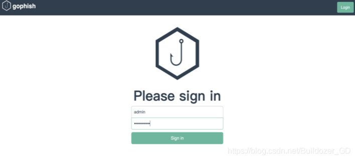
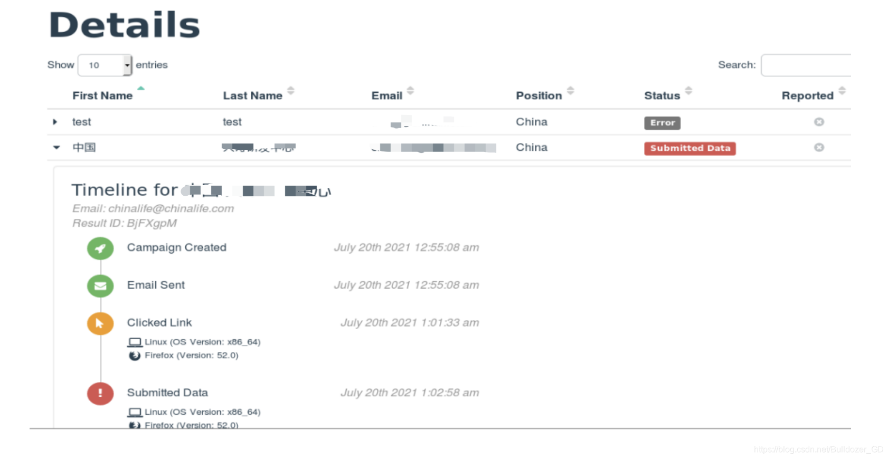

# gophish 测试平台搭建手册

### gophish 测试平台搭建手册

Gophish是为企业和[渗透测试](https://so.csdn.net/so/search?q=%E6%B8%97%E9%80%8F%E6%B5%8B%E8%AF%95&spm=1001.2101.3001.7020)人员设计的开源网络钓鱼工具包。 它提供了快速，轻松地设置和执行网络钓鱼员工安全能力测试以及安全意识培训的能力。

一、gophish安装  
根据自身操作系统的版本下载相应的安装包，#创建文件夹解压至gophish文件夹中 即可执行。下载地址：https://[github](https://so.csdn.net/so/search?q=github&spm=1001.2101.3001.7020).com/gophish/gophish/releases/  
[mkdir](https://so.csdn.net/so/search?q=mkdir&spm=1001.2101.3001.7020) gophish  
unzip gophish-v0.10.1-linux-64bit.zip -d ./gophish  
若需要远程访问后台管理界面，将listen\_url修改为0.0.0.0:3333，端口可自定义。如果仅通过本地访问，保持127.0.0.1:3333即可。  

其中admin\_server是管理页面的配置，这个管理界面只能通过https访问，端口为3333，可以修改，.crt和.key文件是ssl证书，可以通过openssl下载

二、gophish使用  
访问后台管理系统：访问https://ip:3333 默认管理员账号密码：admin/gophish  

各组件功能：  
1、Users & Groups：配置要发送的邮件信息，可导入csv文件  

2、Email Templates:编辑邮件模版  
设置好钓鱼邮件的接收方，便设置钓鱼邮件的模板。gophish支持手动编辑生成钓鱼邮件，也支持导入现有邮件内容。  

现有邮件eml导入:(QQ邮件)下载eml文件，打开导入即可。  
  
导入eml文件将保存到本地的eml文件用文件编辑器打开复制里面的内容，粘贴到电子邮件内容里面。  
  

3、Landing Page:钓鱼页面配置  
gophish支持手动编辑生成钓鱼邮件，Import Site填写被伪造网站的URL即可通过互联网自动抓取被伪造网站的前端代码。也支持导入现有邮件内容，配置时勾选捕获提交的数据和捕获密码，服务器会把相关数据保存下来。  

4、Sending profile:设置发件人的邮箱  
点击New Profile新建一个策略，依次来填写各个字段。（可选）Email Headers 是自定义邮件头字段，例如邮件头的X-Mailer字段，若不修改此字段的值，通过gophish发出的邮件，其邮件头的X-Mailer的值默认为gophish。  

5、Campaign: 发送钓鱼  
填写好攻击的名称，选择钓鱼邮件模板，选择相应的钓鱼页面，目标邮箱，和发送邮箱。需要填上GoPhish服务端的地址，在钓鱼开始前，这个地址会将先前钓鱼邮件模板中的链接替换。  

登陆邮箱查看邮件  

点击跳转到钓鱼页面  

点击登陆跳转到真实页面  

6、Campaigns点击view result查看此次钓鱼活动具体信息

显示已发送的邮件、被打开的邮件、点击链接和提交数据的邮件  

可查看详细信息、所提交的数据、所使用的系统、浏览器版本等各种细节等  

三、常见问题及注意事项

1.  gophish里面邮件显示成功发送，但是收件方却没有收到可能是因为被SPF协议拦截为垃圾邮件，如果使用的是真实邮箱如腾讯企业邮箱或QQ邮箱但仍被拦截，要注意检查邮件内容。
2.  远程访问https时显示不安全直接点继续，添加例外就行
