# 【js逆向实战】RPC+mitm - 先知社区

【js逆向实战】RPC+mitm

- - -

## JS分析

遇到个需求，网站如下，是一个手机号验证码登录，现在的需求是看看这个验证码有没有锁定策略，很简单只要把发送验证码的包用爆破模块，设置单线程并且每过60秒发送一次就可以

[](https://xzfile.aliyuncs.com/media/upload/picture/20240105105749-35d5b910-ab76-1.png)

但是发现这个包有校验，这里请求头中多了四个参数，`Custappid`，`Timestamp`，`Signature`,`Nonce`，发现改动任何一个响应就会失败

[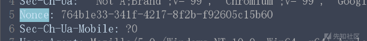](https://xzfile.aliyuncs.com/media/upload/picture/20240105105802-3dec5bf4-ab76-1.png)

[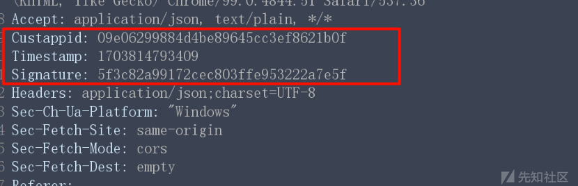](https://xzfile.aliyuncs.com/media/upload/picture/20240105105823-4a6b1f14-ab76-1.png)

接下来去浏览器中，定位相关js代码逻辑，其实定位这里有很多方式，常用的两种方式就是全局搜索关键字或看流量堆栈，我习惯第二种，不过依据这次的环境全局搜索来的快一些

[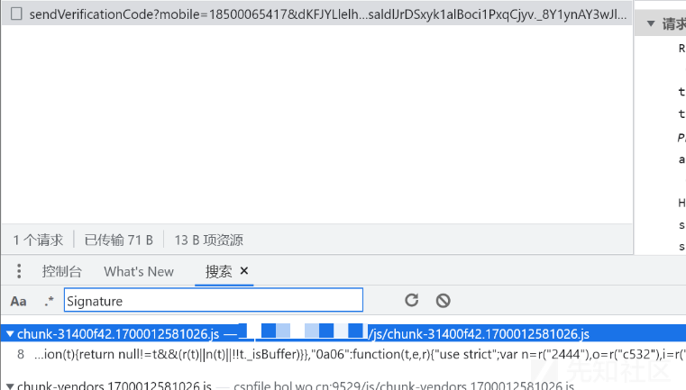](https://xzfile.aliyuncs.com/media/upload/picture/20240105105835-513f0ad0-ab76-1.png)

逻辑在此，其实那个signature我也分析了一波，就是一些值，先sha256然后再md5，不过这次主要是讲rpc，所以这里不深入展开了，继续，可以看到我们需要的对应函数为`_()`

[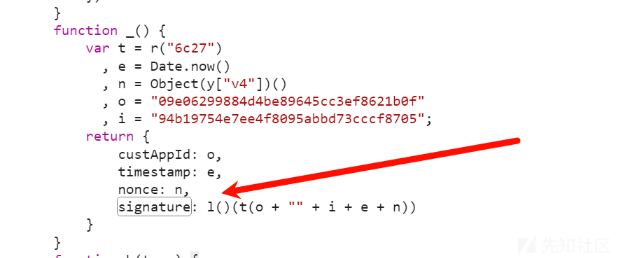](https://xzfile.aliyuncs.com/media/upload/picture/20240105105842-557a221a-ab76-1.png)

不过这个时候我们去控制台去执行它是不会执行成功的

[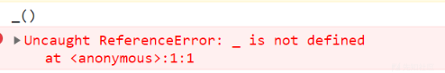](https://xzfile.aliyuncs.com/media/upload/picture/20240105105850-5a61406a-ab76-1.png)

因为函数作用域问题，所以我们这个时候需要再刚才的js代码处打个断点，然后点击发送验证码，触发断点

[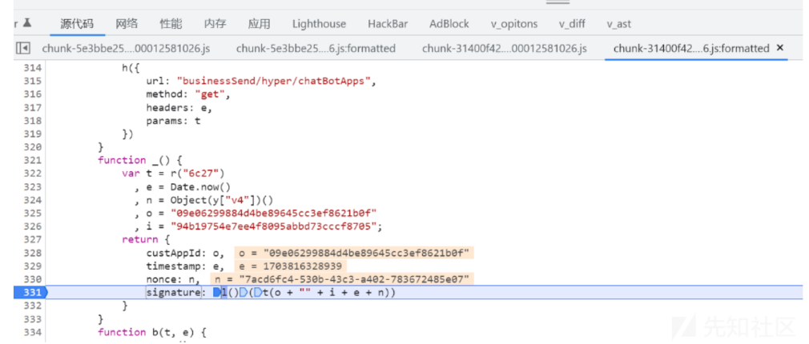](https://xzfile.aliyuncs.com/media/upload/picture/20240105110324-fdcc0b9a-ab76-1.png)

这个时候我们去控制台调用该函数就可以正常调用了

[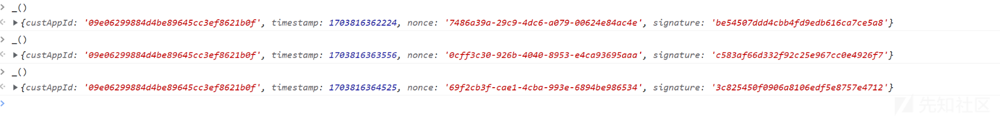](https://xzfile.aliyuncs.com/media/upload/picture/20240105105907-647ecf2c-ab76-1.png)

为了方便实用这个时候我们需要将这个函数设置成全局函数，这样不在debug的时候，我们也可以正常调用了

```plain
window._ = _
```

然后我们放行断点后也可以正常调用了

[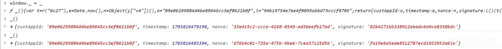](https://xzfile.aliyuncs.com/media/upload/picture/20240105105916-69e4162a-ab76-1.png)

## 2\. rpc调用

[https://github.com/jxhczhl/JsRpc](https://github.com/jxhczhl/JsRpc)

下载编译好的exe，以及resource里面的注入代码`jsEnv.js`

第一步现将jsEnv.js的代码粘贴到控制台执行

然后打开exe，然后在浏览器控制台先连接通信，记住group和name的值

```plain
var demo = new Hlclient("ws://127.0.0.1:12080/ws?group=group1&name=code");
```

[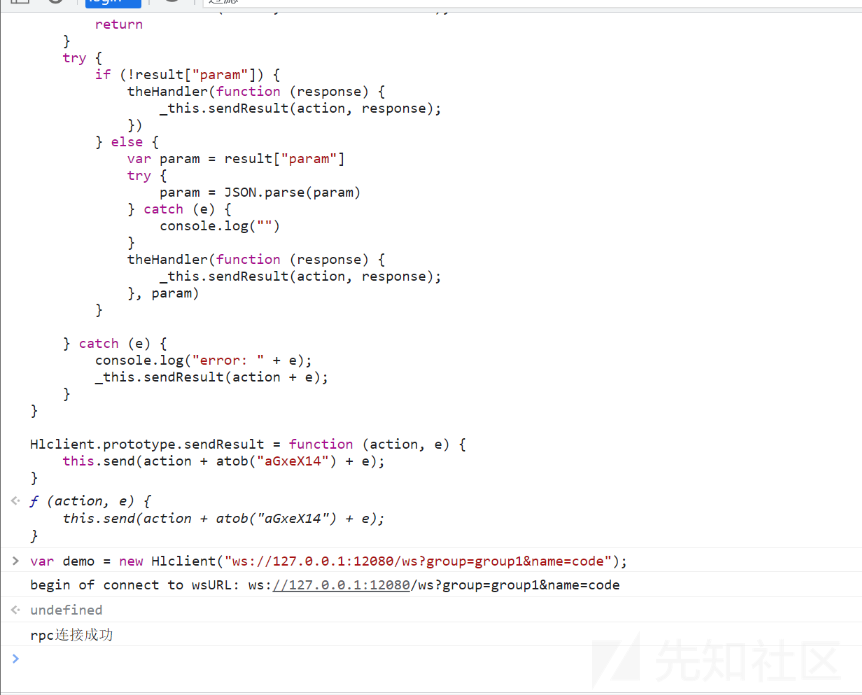](https://xzfile.aliyuncs.com/media/upload/picture/20240105105928-71294180-ab76-1.png)

然后我们注册我们之前的函数`_()`

```plain
demo.regAction("getinfo", function (resolve) {
    var infos = _();
    resolve(JSON.stringify(infos));
})
```

[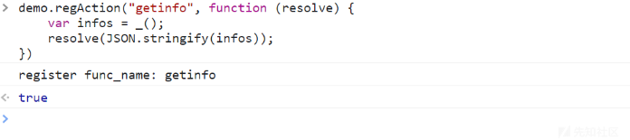](https://xzfile.aliyuncs.com/media/upload/picture/20240105105950-7e047f50-ab76-1.png)

然后我们直接访问接口看一下

```plain
http://localhost:12080/go?group=group1&name=code&action=getinfo
```

[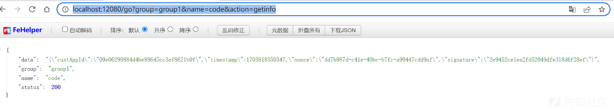](https://xzfile.aliyuncs.com/media/upload/picture/20240105110002-853d7c90-ab76-1.png)

可以正常调用，然后我们可以用python代码获取值

```plain
import requests

def get_rpc():
    url = "http://127.0.0.1:12080/go"
    data = {
        "group": "group1",
        "name": "code",
        "action": "getinfo"
    }
    result = requests.post(url, data=data)
    return result.json()['data']

print(get_rpc())
```

[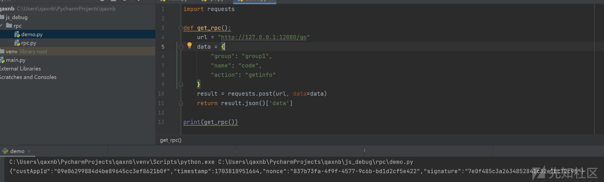](https://xzfile.aliyuncs.com/media/upload/picture/20240105110014-8c37fc0a-ab76-1.png)

- - -

## 3\. mitmproxy

接下来就是我们联动Burp了，我想让Burp发包的时候默认将这些参数给我带上，让我能够正常发包，这里我们可以使用`mitmproxy`来开一个上游代理，然后我们就可以自定义经过的请求包了，注意要python3.10以上，用pip安装即可

```plain
pip install mitmproxy
```

然后记得装一下mitmproxy的证书，先运行一下，然后在用户目录的.mitmproxy文件夹下会生成

[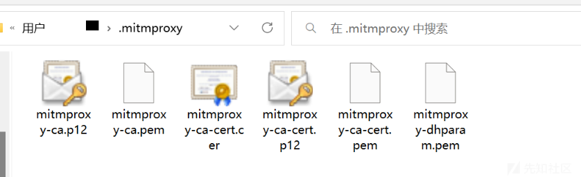](https://xzfile.aliyuncs.com/media/upload/picture/20240105110024-9284afcc-ab76-1.png)

然后创建python脚本

```plain
#encrypt.js
import requests
from mitmproxy import ctx

def get_rpc():
    url = "http://127.0.0.1:12080/go"
    data = {
        "group": "group1",
        "name": "code",
        "action": "getinfo"
    }
    result = requests.post(url, data=data)

    return result.json()['data']


def request(flow):

        result = eval(get_rpc())
        flow.request.headers['Nonce'] = result['nonce']
        flow.request.headers['Custappid'] = result['custAppId']
        flow.request.headers['Timestamp'] = str(result['timestamp'])
        flow.request.headers['Signature'] = result['signature']
```

之后运行mitmproxy（注意的是存在三个程序，我们运行的mitmproxy是其中的一个它的优点就是控制台输出信息较为明朗，但是如果存在bug的情况下建议调试使用mitmdump）

```plain
mitmproxy.exe -p 8081 -s .\rpc.py
```

设置Burp的上游代理

[](https://xzfile.aliyuncs.com/media/upload/picture/20240105110036-9984ab88-ab76-1.png)

成功，要注意我们用burp发包，bp上的值没有变是正常的，因为请求经过mitmproxy才会被修改

[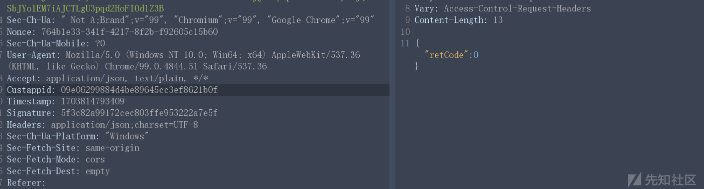](https://xzfile.aliyuncs.com/media/upload/picture/20240105110056-a54e8c0e-ab76-1.png)

我们可以对比一下，实际上，值已经被修改了

[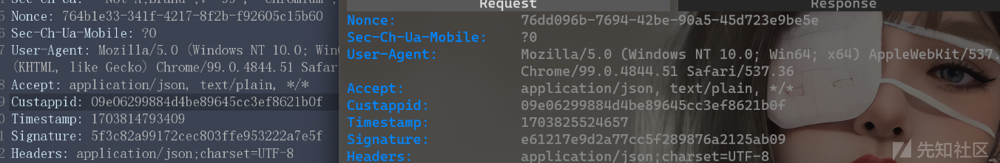](https://xzfile.aliyuncs.com/media/upload/picture/20240105110109-aced4018-ab76-1.png)
