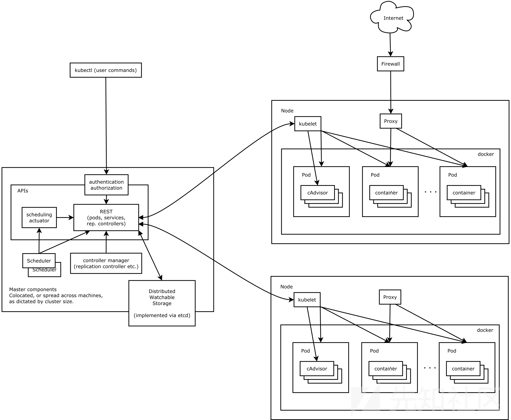
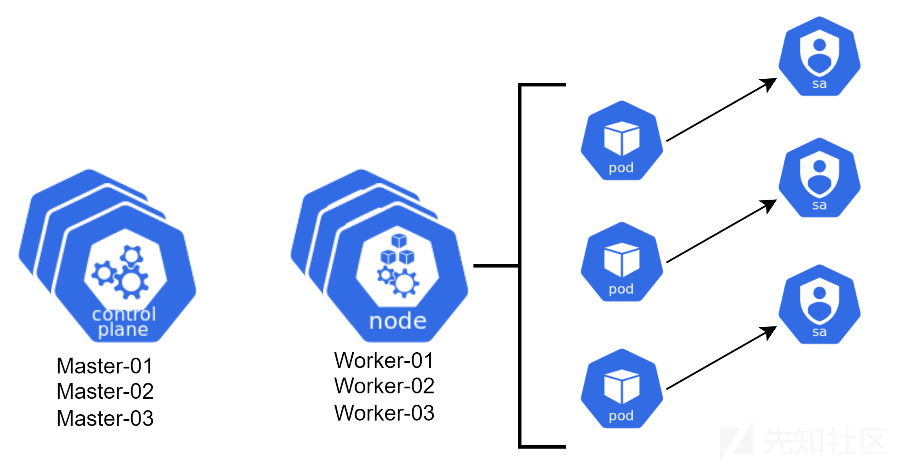

# k8s攻防-窃取Service Account令牌获取集群权限及对应检测方式 - 先知社区

k8s攻防-窃取Service Account令牌获取集群权限及对应检测方式

* * *

## 内容简介

k8s安全性依赖于基于角色的访问控制。

在k8s环境中，k8s的"服务帐户令牌"(service account tokens)包含了“应用程序用于进行身份验证和执行操作”的权限。本文说明了如何在容器中单独使用这些令牌，查看当今许多流行应用程序所请求的具体权限，并展示了如何利用它们的"服务帐户"(service accounts)进一步攻陷k8s环境。

本文探讨了3部分内容：

*   “k8s的权限” 如何与k8s的 "服务帐户令牌"(service account token) 绑定。
*   如何利用这些令牌渗透k8s集群。
*   检测、防御"服务帐户令牌"(service account token)被窃取的情况。

## 基础知识

### k8s架构图

[](https://xzfile.aliyuncs.com/media/upload/picture/20231124162646-348bc4e4-8aa3-1.png)

### k8s组件

k8s组件，通常分为：

(1) Master (控制面板)组件: 协调集群中的所有活动，负责调度pods、处理进程、与云环境的交互、存储所有集群数据，最重要的应该是公开的k8s API，供其他人通过API server组件访问。

(2)Node组件（也称为worker node组件）：通过kubelet、kube-proxy和container-runtime运行k8s pod。

### RBAC-基于角色的访问控制

在k8s中，RBAC控制了某个用户(user) 或 服务帐户(service accounts)可以访问哪些API资源，以及针对这些API的哪些操作是被授权的。  
k8s API，RESTful接口，可通过HTTP访问。  
使用命令行工具可以访问，比如cURL，k8s环境中的命令行工具kubectl。

操作(Actions)，也称为动词(verbs)，由这些组成: get, create, apply, update, patch, delete, proxy, list, watch。

角色：说明了动词(verbs)作用于哪些API。

“角色绑定”(rolebindings)：说明了哪些user、服务帐户应用了(哪些)角色。即“用户”与“角色”做了绑定。

一旦应用了“角色绑定”(rolebindings)，该帐户就可以访问“与它关联的那个角色已被授权了的”所有资源。

换句话说，服务账户或user关联了某个角色，某个角色对指定的API有哪些RBAC权限，是确定的。

### 服务帐户(Service Accounts)

什么是所谓的“pod的权限”？

解释下：k8s pod中的"服务帐户"(service accounts) ，关联了某个角色，这个角色对指定的API所具有的RBAC权限。

从k8s v1.22开始，pods包括了projected volumes，其中包含1个提供API访问的token。如果没有指定服务帐户的话，则会为每个pod添加一个默认的服务帐户。这些服务帐户具有最小的"权限"。

但是许多应用程序会创建和挂载更多的有高权限的服务帐户。

怎么查看服务帐户呢？

方法1 服务帐户可以从某个pod中查看，路径是:`/var/run/secrets/k8s.io/serviceaccount`

方法2 另一个位置是运行pod的主机上的路径:`/var/lib/kubelet/pods/**/volumes/k8s.io~projected/**`

这个位置包含CA证书、namespace和token，用于这台server上挂载了服务帐户令牌的每一个pod。这些文件的作用是使用k8s API进行身份验证，并执行服务帐户已被授权执行的那些操作(actions)。

尽管主机只包含运行在它之上的那些pod的服务帐户，但这些主机仍然可以包含数十、数百个服务帐户，只要足够大就行。

## 研究环境

架构图

[](https://xzfile.aliyuncs.com/media/upload/picture/20231124162749-5a33bcce-8aa3-1.png)

说明：

每个node上的`/var/lib/kubelet/pods/`文件夹里，保存了每个pod或应用程序的所有的服务帐户令牌。

主要组件及其版本：

Kubernetes: v1.26.1

Kubeadm: v1.26.1

Containerd: v1.6.15

Calico: v3.25.0

Etcd: 3.5.6-0

攻击思路：

攻击者从一个或多个host窃取所有的服务帐户，然后枚举服务帐户的权限，并使用服务帐户向k8s API进行身份验证，并在集群里提升权限。

### 权限

k8s RBAC由什么组成？由许多为k8s 角色(roles)所配置的那些"权限"组成。

以下权限，在整个文章中都有介绍。

```plain
Privilege - Verb

Secrets: Get, List, Watch, Create

Pods/Workloads:  Create, Update, Exec

Persistent Volumes/VolumeClaims:  Create

Role/Clusterrole:  Escalate, Bind

Certificate Signing Requests: Create, Update

Token Request: Create

在 System:Masters 组里创建服务账户.

控制ETCD，修改集群数据.
```

### 研究环境中出现的应用程序

在本次搭建的研究环境中，安装了下面这些应用程序。

| NAME | NAMESPACE | CHART | APP VERSION |
| --- | --- | --- | --- |
| argo | default | argo-cd-5.27.1 | V2.6.6 |
| argo-workflows | kube-system | argo-workflows-0.22.14 | v3.4.5 |
| cert-manager | cert-manager | cert-manage-v1.11.1 | vl.11.1 |
| fluentd-bitnami | default | fluentd-5.6.5 | 1.16.1 |
| ingress-nginx | default | ingress-nginx-4.6.0 | 1.7.0 |
| jenkins | default | jenkins-4.3.22 | 2.387.2 |
| kube-prometheus-stack | default | kube-prometheus-stack-45.21.0 | v0.63.0 |
| kubemetes-dashboard | default | kubemetes-dashboard-6.0.6 | v2.7.0 |
| mysql | default | mysql-9.6.0 | 8.0.32 |
| photoshow | default | photoshow-1.0.1 | 48aabb98 |
| redis | default | redis-17.8.5 | 7.0.9 |

每个请求服务账户的应用程序，都经过了枚举和测试，查看该应用程序所要求的那些权限，能否用来渗透k8s集群。

### 对Host的枚举

k8s环境可以通过多种方式实现枚举。

（1）如果攻击者入侵了单个pod，就可以在pod中找这个路径`/var/run/secrets`，以便访问k8s API并通过身份验证。

（2）攻击者执行"容器逃逸"(container escape)并获得对host的访问。

此时，攻击者可以执行简单的shell脚本，如下，kubelet-enum.sh

```plain
for mydir in $(find /var/lib/kubelet/pods -name namespace -exec dirname {} \;); do
  echo "Checking $mydir"
  # 设置环境变量
  export cert=$mydir/ca.crt
  export token=$mydir/token
  export namespace=$mydir/namespace
  export apiserver=$(netstat -n | grep 6443 | awk '{ print $5 }' | uniq)
  echo "$cert $namespace $token $apiserver"
  kubectl --certificate-authority=$cert --token=$(cat $token) --namespace=$(cat $namespace) --server=https://$apiserver auth can-i --list
done
```

脚本的作用是：

枚举被攻击者控制的主机上的每个pod拥有的"权限"。

具体说明：

该脚本检查`/var/lib/kubelet/pods`中的每一个pod，并为CA证书(ca.crt)、token和namespace创建一个环境变量。

还利用netstat命令找到apisserver地址并创建一个环境变量。（有可能需要自己改下具体的apiserver地址。）

最后，使用kubectl auth can-i命令列出，经过身份验证的用户能在该命名空间中执行哪些操作。

下面是运行脚本之后的输出。Argo-cd集群管理权限，只关注重要的2个列，简化结果为：

```plain
Resources                                           Verbs
*.*                                                [*]
                                                   [*]
selfsubjectaccessreviews.authorization.k8s.io      [create]
selfsubjectrulesreviews.authorization.k8s.io       [create]
```

解读：

说明了可以对哪些资源（即pod、services、配置映射configmaps、命名空间namespaces、secrets等）采取哪些动作。

具体来看，第一行，第一个资源 的 Resources列 显示了 `*.*` 对应的动词是 `[*]`

这意味着从被入侵的这个host获得的"service account token"(服务帐户令牌)，在它的namespace具有完整的admin权限。

这个服务帐户令牌还具有完整的集群管理权限，可以这样验证:

`kubectl --certificate -authority=$cert --token=$(cat $token) --server=https://$apiserver auth can-i '\*' '\*' –all-namespaces`

**攻击者拿到这个服务帐户令牌，导致一整个k8s集群“完全被控”。**攻击者现在可以执行任何所需的"操作"(actions)来控制所有k8s nodes，做后渗透操作：权限维持、提取数据、删除安全防护措施。

这个token从哪来的？

这个token 是（通过k8s Helm包管理器）安装Argo-CD时被创建的。

Argo-CD项目，是k8s最受欢迎的GitOps工具之一，是云原生计算基金会（CNCF）产出的项目。Argo-CD的作用是管理k8s集群，因此它可能需要高权限的服务帐户令牌。

Argo-CD的例子，说明需要了解这些情况：

（1）了解各种应用程序所要求的权限是哪些权限。

（2）应用程序pod被调度到哪些主机上。

为什么说存在风险？

Argo-CD pod被调度到了某一个worker node上。

并没有任何步骤会把Argo-CD pod(这个具有高权限的服务帐户令牌的pod)调度到经过安全加固了的node上，所以Argo-CD pod会和一些"容易被攻击的pod"在一起。

也就是说，存在这种可能：攻击者从"容易被攻击的pod"逃逸到host上，然后访问到Argo-CD pod(这个具有高权限的服务帐户令牌的pod)。

所以说，如果不去审查应用程序请求的RBAC权限、不去规划它们的调度位置，那么具有高权限应用程序将与其它有漏洞的Pod调度到一台host，风险非常之大。

### 集群接管

k8s环境下，攻击者利用RBAC提供的许多方法，来扩大控制范围，并接管k8s环境。

以下内容，详细介绍了如何使用研究环境中的应用程序利用的高风险权限来提升权限、窃取数据、接管集群。

攻击者实现k8s集群接管的流程如下：

```plain
攻击者获得 k8s host的 文件系统的访问权限.
 -> 

攻击者枚举该host的 /var/lib/kubelet/pods 中的所有的服务帐户.
 -> 

重点目标是：高权限的服务帐户.
 -> 

攻击者利用一个或多个服务帐户的权限，提升k8s环境中的权限.
 -> 

攻击者得到了整个k8s环境,实现了集群管理.
```

### k8s secrets

k8s secrets是用于存储敏感数据的对象。

k8s secrets可以独立于pod创建，有助于传递 密码passwords、令牌tokens、keys、其他凭据 到某个pod中。

secret类型有哪些？

Kubernetes 提供若干种内置的类型，用于一些常见的使用场景。 针对这些类型，Kubernetes 所执行的合法性检查操作以及对其所实施的限制各不相同。

| 内置类型 | 用法  |
| --- | --- |
| `Opaque` | arbitrary user-defined data. 任意的用户自定义的数据. |
| `kubernetes.io/service-account-token` | 服务账号令牌 |
| `kubernetes.io/dockercfg` | `~/.dockercfg` 文件的序列化形式 |
| `kubernetes.io/dockerconfigjson` | `~/.docker/config.json` 文件的序列化形式 |
| `kubernetes.io/basic-auth` | 用于基本身份认证的凭据 |
| `kubernetes.io/ssh-auth` | 用于 SSH 身份认证的凭据 |
| `kubernetes.io/tls` | 用于 TLS 客户端或者服务器端的数据 |
| `bootstrap.kubernetes.io/token` | 启动引导令牌数据 |

什么是`Opaque`secret？

默认的 Secret 类型是`Opaque`secret，也是最常见的secrets类型。

当你使用 `kubectl` 来创建一个 Secret 时，你必须使用 `generic` 子命令来标明要创建的是一个 `Opaque` 类型的 Secret。 例如，下面的命令会创建一个空的 `Opaque` 类型的 Secret：

```plain
kubectl create secret generic empty-secret
kubectl get secret empty-secret
```

输出是这样的：

```plain
NAME           TYPE     DATA   AGE
empty-secret   Opaque   0      2m6s
```

`DATA` 列显示 Secret 中保存的数据条目个数。

在这个例子中，`0` 就是说你刚刚创建了一个空的Opaque Secret。

`Opaque`secret有什么用？

Opaque可以用来定义任意的用户数据。

helm应用程序创建出的大部分secrets是Opaque secrets。这些Opaque secrets包含许多应用程序的访问凭据。虽然Opaque secrets并不总是导致“集群被控”(cluster admin)，但这些Opaque secrets可能会导致攻击者获得在k8s集群中托管的那些应用程序的访问权，而且是高权限的访问权。

什么是ServiceAccount token Secret？

ServiceAccount token Secret，即`kubernetes.io/service-account-token`secret，用来存放标志了某个ServiceAccount的token凭据。

ServiceAccount token Secret，是为 Pod 提供长期有效的 ServiceAccount "凭据"(credentials)的传统机制。

> 版本“分水岭”：
> 
> 在k8sv1.22之前，这些ServiceAccount token secrets 是自动创建的，并且寿命很长，不会过期。
> 
> 在k8s v1.22及更高版本中，推荐的方法是使用TokenRequest API来获取一个短暂的、自动轮换的ServiceAccount令牌。

ServiceAccount token Secrets有什么用？

ServiceAccount token Secrets可被攻击者用于权限提升、集群接管。

对于能够创建secret的攻击者来说，可以为任何的"服务帐户"创建secret。

如果攻击者拥有 `get`、`watch`或`list` secrets的权限，那么攻击者就可以拿到该secret，并使用某个secret作为该服务帐户的鉴权凭证。

攻击者拿到 k8s Secret的流程如下：

```plain
攻击者获得SA，有权在名为kube-system的命名空间中create 和 list secrets。
-->

攻击者为1个具有高权限的"服务帐户"，创建出1个新的 service account token secret。
-->

攻击者获得高权限的"service account token"(服务帐户令牌)。
-->

"service account token"(服务帐户的令牌) 用于访问k8s API时进行身份验证。
-->

集群管理、集群被控。
```

通过helm安装的几个应用程序，具有 `get`,`list`,`watch` secrets的权限。

如果一个应用程序具有secrets的所有"动词"(verbs)，这意味着也可以创建secrets。

可以使用下面这个`.yaml`配置，来创建1个新的ServiceAccount token secret。必须指定集群中的服务帐户之一，所以选择了`argocd-application-controller`这个服务帐户，因为它有集群管理的权限。

```plain
apiVersion: v1
kind: Secret
metadata:
 name: research-argo-token
 annotations:k8s.io/service-account.name: "argocd-application-controller"
 type: k8s.io/service-account-token
```

假设攻击者在枚举阶段获得的所有token都可以用来 create 和 list "服务帐户"(service accounts)。在这种情况下，攻击者可以为所有的"服务帐户"(service accounts) 创建出额外的secrets，并利用它们进行身份验证，从而有效地赋予它们任何的"服务帐户"的“权限”（这就是为它们创建出secrets的原因）。

给这个名为`argocd-application-controller`的服务帐户创建出的那个secret，为该服务账户提供了“集群管理”(cluster-admin)的权限。

### k8s Pod

k8s有很多方法能创建出1个pod。各种pod创建方法被称为“工作负载资源”( Workload Resources)。这些“工作负载资源”( Workload Resources)包括Pods、Deployments、ReplicaSets、DaemonSets、Jobs、CronJobs和ReplicationControllers。

如果 "服务帐户令牌"(Service Account Tokens) 有权限去创建多个“工作负载资源”( Workload Resources)中的任何一个资源，这就是攻击者可以尝试权限提升的另一种方式。

当攻击者创建1个pod时，他们可以向其中添加privileged flag，从pod中删除所有“安全保护措施”，并让攻击者有权访问host的文件系统。攻击者还可以指定他们想用的那一个"服务账户"，让pod执行各种命令，例如反弹shell，或者为pod指定一个恶意映像。

从k8s Pod开始，拿下集群管理的步骤如下

```plain
1.攻击者获得可以创建pod的sa（如果pod可以在kube-system命名空间里创建就更好了）

2.使用指定的高权限"服务账户"创建Pod

3.有执行权的攻击者进入pod抓取令牌，或让pod运行其他命令

4.攻击者使用新token进行身份验证

5.集群管理
```

创建具有以下配置的pod会提供集群管理员，因为它使用argocd-application-controller"服务账户"并挂载其令牌。

Pod. yaml配置，使用了高权限的"服务账户"：

```plain
apiVersion: v1 kind: Pod metadata:
creationTimestamp: null
labels:
run: research-pod
name: research-pod
spec:
serviceAccountName: argocd-application-controller automountServiceAccountToken: true
containers:
- image: nginx
name: research-pod
resources: {}
dnsPolicy: ClusterFirst
restartPolicy: Always
status: {}
```

攻击者可以执行进入pod并获得shell访问权限，下载kubectl二进制文件，然后以完全的集群管理员权限从pod内运行kubectl二进制文件。可以指定其他服务帐户，攻击者可以测试多个服务帐户，直到获得所需的权限。

### k8s volumes

k8s volumes可以挂载在主机文件系统上。

攻击者可以通过几种不同的方式在主机文件系统上创建卷，并从容器逃逸到主机。

(1)一种常见的方法是创建一个pod，并将hostPath卷指定到主机上的敏感位置，甚至指定到root的文件系统。利用hostPath进行容器逃逸很常见，因此可以启用许多防御措施来防止它。

(2)不太常见的方法是创建一个PeressentVolume和PersistentVolumeClaim来执行相同的攻击。

> **持久卷（PersistentVolume，PV）** 是集群中的一块存储，可以由管理员事先制备， 或者使用[存储类（Storage Class）](https://kubernetes.io/zh-cn/docs/concepts/storage/storage-classes/)来动态制备。 持久卷是集群资源，就像节点也是集群资源一样。PV 持久卷和普通的 Volume 一样， 也是使用卷插件来实现的，只是它们拥有独立于任何使用 PV 的 Pod 的生命周期。 此 API 对象中记述了存储的实现细节，无论其背后是 NFS、iSCSI 还是特定于云平台的存储系统。
> 
> **持久卷申领（PersistentVolumeClaim，PVC）** 表达的是用户对存储的请求。概念上与 Pod 类似。 Pod 会耗用节点资源，而 PVC 申领会耗用 PV 资源。Pod 可以请求特定数量的资源（CPU 和内存）；同样 PVC 申领也可以请求特定的大小和访问模式 （例如，可以要求 PV 卷能够以 ReadWriteOnce、ReadOnlyMany 或 ReadWriteMany 模式之一来挂载，参见[访问模式](https://kubernetes.io/zh-cn/docs/concepts/storage/persistent-volumes/#access-modes)）。

利用PersistentVolumes作为攻击媒介，需要RBAC权限来创建PersistentVolumes、PersistentVolumeClaim和Pod或其他工作负载资源。

一旦创建了一个挂载hostPath的持久卷，并且一个持久卷申领绑定到这个持久卷，攻击者就可以在pod配置中指定这个卷，并获得主机文件系统访问权限。然后，可以浏览该卷，攻击者可以尝试chroot到该卷，这样更容易与主机文件系统交互、运行命令。

### 角色和"集群角色"

角色和"集群角色"(Clusterroles)是指定user或"服务账户"拥有了哪些API资源和动词的对象，所以角色和"集群角色"是攻击者提升权限的重点。

k8s内部有防御措施来防止创建或更新 角色、"角色绑定"。RBAC API不允许创建或更新角色、角色绑定，除非用户已经拥有角色中包含的所有权限。

如果攻击者获得了一个"服务账户"令牌，其中包含角色或集群角色上的Escalate verb(升级动词)，那么可以提升权限。具有角色绑定动词的攻击者，可以绑定到该角色，并利用特定角色所拥有的任何权限。

> 参考官方 [https://kubernetes.io/docs/concepts/security/rbac-good-practices/](https://kubernetes.io/docs/concepts/security/rbac-good-practices/)
> 
> Escalate verb(升级动词)
> 
> 通常，RBAC系统会阻止用户创建比用户拥有的权限更多的集群角色。对此的例外是升级动词。正如 [RBAC documentation](https://kubernetes.io/docs/reference/access-authn-authz/rbac/#restrictions-on-role-creation-or-update)中所述，拥有此权限的用户可以有效地升级他们的权限。

k8s Roles和Clusterroles 利用过程：

```plain
攻击者获得了有提升权限的SA. ---> 集群管理.


如果没有升级权限，攻击者和攻击者可以创建secret
--->
攻击者为具有升级权限的 clusterrole-aggregation-controller 创建一个服务账户secret
--->
集群管理.
```

拥有了create和get secret、描述角色/角色绑定、描述集群角色/集群角色绑定权限的攻击者，可以确定哪些服务帐户具有高权限，并设法拿到这些服务帐户。然后，他们可以创建一个新的ServiceAccount令牌secret，并利用该令牌secret来使用和该"服务账户"绑定的那些权限，通过k8sAPI身份验证。

攻击者可以用来提升权限的另一种办法是：获取clusterrole-aggregation-controller"服务账户"的secret。这个角色具有升级动词，可用于实现集群管理（升级动词允许攻击者绕过“k8s对提升权限的限制”）。

本次的研究环境没有创建secret，而是使用了能够创建secret权限的"服务账户"，然后获取了创建的"服务账户"secret。

在 kube-system命名空间里创建escalation secret

```plain
# 创建具有"升级权限"的token
kubectl --certificate-authority /var/lib/kubelet/pods/d043faea-ba2a-4302-ba04- 80a38dade827/volumes/k8s.io~projected/kube-api-access-b84hf/ca.crt --token=$(cat /root/create-secrets-token) --namespace=kube-system --server=https://192.168.10.100:6443 create -f create-sa-token.yaml secret/clusterrole-aggregation-controller created

# 获取新创建的secret
kubectl --certificate-authority /var/lib/kubelet/pods/d043faea-ba2a-4302-ba04- 80a38dade827/volumes/k8s.io~projected/kube-api-access-b84hf/ca.crt --token=$(cat /var/lib/kubelet/pods/d043faea-ba2a-4302-ba04- 80a38dade827/volumes/k8s.io~projected/kube-api-access-b84hf/token) --namespace=kube-system --server=https://192.168.10.100:6443 get secrets clusterrole-aggregation-controller -o yaml | grep token | grep -v k8s | cut -f 2 -d ':' | tr -d ' ' | base64 -d > /root/clusterrole-aggregation-controller-token

# 执行auth can-i ，发现这个新的scret具有升级权限
kubectl --certificate-authority /var/lib/kubelet/pods/d043faea-ba2a-4302-ba04- 80a38dade827/volumes/k8s.io~projected/kube-api-access-b84hf/ca.crt --token=$(cat /root/clusterrole-aggregation-controller-token) --namespace=kube-system --server=https://192.168.10.100:6443 auth can-i --list

Resources                        Verbs
clusterroles.rbac.authorization.k8s.io      [escalate get list patch update watch]
```

## 后渗透阶段

一旦攻击者实现了集群管理，就可以开始“后渗透阶段”：做好权限维持，避免初始攻击方法被发现、被清理。

k8s中有许多路径实现权限维持：Linux环境下攻击者可以利用这些权限维持方法。

### System:Masters Group

攻击者(cluster admin)可以在任何一个control plane节点上建立据点，并窃取 `/etc/k8s/pki`里的CA证书。

攻击者还可以窃取k8s和ETCD证书。这样，攻击者可以通过“k8s API”和(承载k8s环境所有信息的)“ETCD数据库”的身份验证，拿到ETCD的内容，并进一步渗透。

k8s证书可以在`system:master`组中创建一个新的user。

`system:masters`组能够不受限制地访问k8s API，无需任何角色或角色绑定。

每个角色和角色绑定都可以从k8s环境中删除，但是，能访问`system:masters`组的攻击者仍然对整个集群具有完整的管理权限。

在 system:masters组中创建帐户说起来容易做起来难，因为它在k8s内被一个名为CertificateSubjectRestriction的准入控制器阻止，虽然这个准入控制器不会批准system:masters 组的证书签名请求，但攻击者仍然可以使用其他工具（如openssl）创建证书。如果攻击者拥有来自Control Plane node的有效CA证书，他们可以在另一台计算机上创建他们的用户证书，并使用它们实现完全控制。

### 攻击者通过守护程序集Daemonsets 实现控制大范围的host

攻击者可通过创建额外的user accounts，在主机上进行渗透：创建cronjob，设置反向shell，并在整个系统中隐藏相关痕迹。其中许多活动可以使用k8s来完成，从高权限pod运行命令，并创建daemonsets，以确保pod安装在k8s集群中的每个node上。拥有数千个node的k8s环境也可能受到这种攻击，因为守护程序集确保工作负载在k8s集群的每个节点上运行。可能需要将"容错"添加到守护程序集配置中。然而，完全控制k8s环境的攻击者，可以快速确定攻击者的守护程序集在每个节点上运行所需的配置。

### 控制ETCD

ETCD是一个高度可用的分布式key-value存储，k8s通常使用ETCD来存储所有的集群数据。虽然也有k8s环境使用其他数据存储。

如果攻击者有权限访问control plane节点上的ETCD证书，那他可以使用ETCD进行身份验证，并使用这个访问权限来监控添加、修改或删除 secret的时间。还可以修改集群数据，绕过RBAC，并将其修改后的数据注入ETCD。如果攻击者能够通过网络访问ETCD数据存储，就可以在k8s环境之外完成。

控制ETCD，对k8s集群的完全控制的另一种方式，因为攻击者可以控制k8s所依赖的做出身份验证和授权决策的数据“本质”。

## 集群防御

必须从多个角度来保护k8s环境。

枚举是最早进行的，防御者可以采取许多步骤来给攻击者的枚举增加难度：

1.执行Pod安全标准  
2.限制服务帐户的自动挂载  
3.查看RBAC权限并遵循最低权限  
4.加密secret  
5.利用网络策略

集群防御流程：

```plain
1.限制高权限的pod和对主机文件系统的访问（攻击者无法枚举/窃取服务帐户）

2.不要挂载服务帐户（不创建SA Token，那么攻击者无法在不创建它的情况下窃取它）

3.遵循最低权限并审查RBAC（验证和审核应用程序所请求的权限）

4.加密您的secret，这样攻击者就不能列出并利用这些secret。

5.使用网络策略限制pod和命名空间对API server的访问，以便只有需要访问的pod才能连接。

6.集群防御
```

### 执行Pod安全标准

研究环境的枚举能否成功，取决于是否可以访问k8s主机上的`/var/lib/kubelet`目录，该目录通常只允许root用户访问。

攻击者必须能够突破可访问的任何k8s pod的限制，并将其权限提升到k8s主机上的root，然后才能开始对服务帐户令牌枚举。

如果无法逃逸k8s pod，攻击者应该只能访问pod内服务帐户令牌授予的权限（如果它已经被挂载）。

实际上，攻击者可以使用各种方法逃逸k8s pod。

怎么解决呢？k8s中有"Pod安全标准"(Pod Security Standards)，可以减轻攻击者用到的大多数方法。

> 见k8s文档 [https://k8s.io/docs/concepts/security/pod-security-standards/](https://k8s.io/docs/concepts/security/pod-security-standards/)

Pod安全标准提供了3种不同的策略，可用于限制k8s环境。

*   三种策略
    *   特权策略(Privileged)：特意去做的不限制，不应在生产环境中使用。
    *   基线策略(Baseline)：对于大多数环境，基线策略将满足大多数安全需求，并将提供很多保护，防止容器/pod逃逸。
    *   受限策略(Restricted)。

这个研究环境就是攻击者可以访问高权限的pod，然后用它来进入主机的os。因为基线策略禁止了高权限的容器，所以提权被阻止。

执行Pod安全标准之前，必须要进行测试。

k8s文档提供了下面这个例子，可以将审计、警告的基线策略应用于所有命名空间。

```plain
kubectl label --overwrite ns --all \
pod-security.k8s.io/audit=baseline \
pod-security.k8s.io/warn=baseline
```

这个例子并不会强制执行策略，可以放心使用。这些策略还可以应用于单个命名空间，允许单独的命名空间受到或多或少的限制。

### 限制服务帐户的自动挂载

1.只有当服务账户或pod配置为挂载令牌时，才会创建服务帐户令牌。

在k8s中，每个命名空间中都会创建默认服务账户，并自动挂载到没有指定服务账户的pod。可以在服务账户配置或pod配置中关闭。

2.如果应用程序不需要访问k8s API，则不应该挂载令牌。

只挂载必要的令牌，会有助于确保k8s工程师更加明确哪些应用程序可以访问k8s API。如果攻击者设法渗透任何k8s主机，这也限制了攻击者可以访问的服务账户令牌的数量。

### 查看RBAC权限并遵循最低权限

基于角色的访问控制可能很快被“吞没”工程师。这些不错的资源可以帮助理解RBAC。

*   [https://rbac.dev/](https://rbac.dev/)
*   OWASP k8s Security Cheat Sheet
*   OWASP k8s Security Testing Guide (KSTG)
*   k8s.io Security Documentation
*   k8s.io RBAC Good Practices
*   Threat Matrix for k8s
*   HackTricks k8s Pentesting
*   NSA k8s Hardening Guide

这个脚本，可以枚举k8s权限： kubelet-defendernum.sh

```plain
for mydir in $(find /var/lib/kubelet/pods -name namespace -exec dirname {} \;); do echo "Checking $mydir"
export cert=$mydir/ca.crt
export token=$mydir/token
export namespace=$mydir/namespace
export apiserver=$(netstat -n | grep 6443 | awk '{ print $5 }' | uniq)
export whoami=$(kubectl whoami --token=$(cat "$token"))
export tokenexpiration=$(jq -R 'split(".") |.[0:2] | map(@base64d) | map(fromjson)'
<<< $(cat "$token") | jq '.[1].exp')
echo -e "\n"
echo "Checking privileges for ---$whoami---"
echo "Service account expires @$(date -d @"$tokenexpiration")"
echo "$cert $namespace $token $apiserver"
mv /root/.kube/config /root/.kube/enum-config
kubectl --certificate-authority="$cert" --token=$(cat "$token") --namespace=$(cat
$namespace) --server=https://"$apiserver" auth can-i --list
#Checking for Risky privileges in all service account tokens
echo -e "\n"
echo "Does this service account have full cluster-admin privileges?"
kubectl --certificate-authority="$cert" --token=$(cat "$token") --namespace=$(cat
$namespace) --server=https://"$apiserver" auth can-i "*" "*" --all-namespaces
echo "Can this service account list secrets in kube-system (Quick way to get cluster admin)?"
kubectl --certificate-authority="$cert" --token=$(cat "$token") --namespace=$(cat
$namespace) --server=https://"$apiserver" auth can-i list secrets -n kube-system mv /root/.kube/enum-config /root/.kube/config
echo -e "\n"
done
```

注意：

（1）为了运行脚本，必须安装jq和netstat。

（2）该脚本利用netstat从工作节点定位API服务器地址。如果你已经知道API服务器地址，直接改脚本指定即可。

（3）必须安装名为`Krew`的kubectl包管理器和k8s插件`whoami`。

whoami插件需要`~/.kube/config`中的有效的kubeconfig文件，来帮助枚举令牌看它应用到哪个服务账户。_Kubectl auth can-i_将枚举当前kubeconfig中的权限，而不是实际的服务账户令牌。因此，该脚本在每次循环迭代期间临时移动kubeconfig文件，以确保枚举服务帐户的令牌权限。

脚本功能：说明哪些服务账户令牌权限被绑定，令牌何时到期，以及令牌的权限。

脚本的最后一部分进行了2次特定检查：

(1)查看令牌是否具有集群管理的权限。

(2)以及令牌是否可以在kube-system命名空间中列出secret。

如之前所说，列出secret可能是提升权限的一种简单方法，例如列出`clusterrole-aggregation-controller` "服务账户"的secret并使用它来提升权限，来获取集群管理权限。

如果`clusterrole-aggregation-controller`"服务账户"没有生成secret，则可以使用可以创建secret的"服务账户"令牌来创建secret。然后可以使用另一个具有get、list或watch secret权限的令牌来获取令牌。

### 加密的secrets

默认情况下，k8s secrets不被加密，如果攻击者获得对ETCD的访问权限或者可以查看k8s secret，有安全风险。

> 参考[https://cloud.google.com/docs/security/encryption/default-encryption?hl=zh-cn](https://cloud.google.com/docs/security/encryption/default-encryption?hl=zh-cn)
> 
> 静态加密的优点：在数据落入攻击者之手时，帮助确保攻击者在无法访问加密密钥时无法读取数据。也就是说，即使攻击者拿到了包含客户数据的存储设备，他们也无法理解或解密数据。

通过为secret设置“静态加密”，攻击者窃取secret所带来的风险大大降低。设置之后，攻击者还需要访问控制面板server来窃取加密密钥，然后才能使用密钥进行解密。

假设攻击者已经可以访问控制面板server的主机文件系统。在这种情况下，攻击者可能有集群管理权限，或者可以快速获得集群管理权限，这表明问题很大（相比之下，未加密的secret数据不算大问题）。

除了限制secret的RBAC权限之外，工程师还应该加密secret，以防止具有API或ETCD访问权限的攻击者来利用secret。

如何加密k8s secret？参考[https://k8s.io/docs/tasks/administer-cluster/encrypt-data/#ensure-all-secrets-are-encrypted](https://k8s.io/docs/tasks/administer-cluster/encrypt-data/#ensure-all-secrets-are-encrypted)

*   secret管理的最佳实践还应该包括：
    *   “不以明文形式记录secret数据”
    *   不将secret存储在pod配置、部署和其他k8s workloads之中
    *   确保代码仓库里没有未加密的secret。

### 使用网络策略

k8s运行在一个“所有名称空间可以互相通信”的平面网络上。平面网络具有易用性，但在安全性方面有更好的选择。

Calico网络插件支持网络策略，能限制名称空间、pod、IP和端口之间的通信。这在多租户环境中特别有用（多租户环境下，管理员必须限制租户环境之间的通信）。

在环境中的名称空间上创建并执行网络策略，这样，攻击者将难以枚举和渗透。

### 检测攻击者的枚举行为

k8s具有全面的日志记录功能，可用于检测恶意活动。为了利用logging功能，必须开启审计，并配置审计策略。在配置审计策略时也必须小心，以确保不会无意中收集到secret数据。审计日志确实会增加内存消耗，但是值得。

根据k8s的文档，审计需要回答以下问题：

*   发生了什么事？
*   什么时候发生的？
*   谁搞的？
*   这件事发生在什么资源上？
*   这件事在哪儿被注意到的？
*   从哪里开始的？
*   它要去哪？

检测攻击者的枚举行为:

（1）审计数据可以发送到远程的Web API，在检测到可疑活动时，工程师可以收到告警。

（2）还可以配置第三方工具进行威胁检测，例如开源工具Falco。

审计日志记录+威胁检测，可以快速检测攻击者什么时间点开始枚举"服务账户"的token。

一个应用程序通常很少查询它自身拥有哪些权限，所以这种威胁活动很容易被发现。审计日志将提供更多细节，去帮助工程师阻止进一步的恶意活动，并在“攻击者渗透整个集群之前”的枚举阶段就发现攻击者，并处置安全事件。

## 总结

许多安全事件、数据泄露的根源是：安全人员缺乏对安全环境的理解、配置错误等。

k8s在逐渐普及，但同时也增加了复杂性。在保护k8s时，主要的点是确保RBAC权限被计划好了、被实施好了，并定期审查。

需要研究创建更多例子，说明特定权限如何导致权限提升（尤其是应用广泛的应用程序里的权限）。关联应用程序及其权限，将有助于确保工程师和开发人员了解各种应用程序带来的RBAC风险，并考虑如何保护应用程序。

攻击者一次枚举可用拿到大量"服务帐户"(service accounts)令牌，可以“组合权限”来提升权限，攻击者可以控制整个k8s集群。

在大多数情况下，攻击者将需要对一个或多个worker nodes的高权限主机访问权限，但是一旦他们获得该访问权限，“链接权限”的过程就可以开始了。一个令牌可能有权创建pod，另一个令牌可能能够在 kube-system 命名空间中创建secrets，而另一个令牌可能能够读取 kube-system 命名空间中的secrets。攻击者可以快速从一个被控制的host到"集群管理"，可以访问多个"服务帐户"(service accounts)令牌并深入了解k8s RBAC。

本文提供了许多例子，说明攻击者如何利用RBAC权限、防御者可以采取哪些步骤来保护k8s集群。

防御者通过遵循k8s安全最佳实践、实施审计、威胁发现，并定期审查在其k8s环境中的所有应用程序的权限，可以提高安全性。
