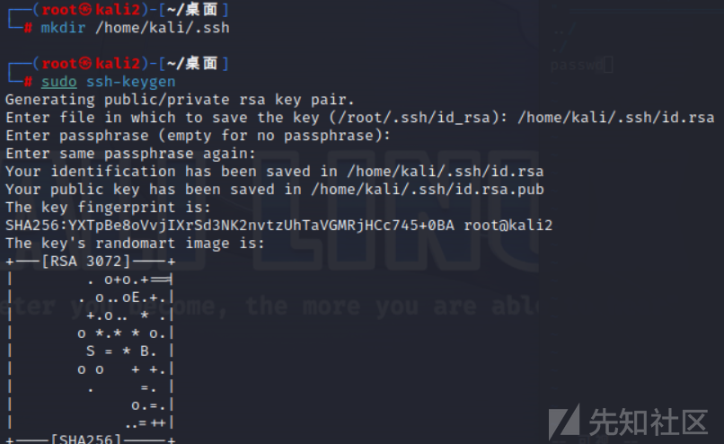
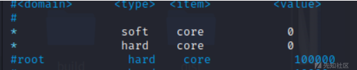

linux基线排查

- - -

# linux基线排查

## 1.账号管理与认证授权

### 用户账号口令设置

awk -F: '($2==""){print$1}' /etc/shadow

-   检查是否存在空口令账号（$2表示第二个值 其实就是密码的值$1表示第一个值其实就是用户名）
-   有输出则存在，无输出则不存在

[](https://xzfile.aliyuncs.com/media/upload/picture/20240117113404-4336025a-b4e9-1.png)

[](https://xzfile.aliyuncs.com/media/upload/picture/20240117113411-47af0034-b4e9-1.png)

### 检查一下参数

vim /etc/login.defs

-   PASS\_MAX\_DAYS 密码最长过期天数 参考值90
-   PASS\_MIN\_DAYS密码最小过期天数 参考值80
-   PASS\_MIN\_LEN密码最小长度 参考值8 //ubuntu中修改不了 ，只能是8位
-   PASS\_WARN\_AGE密码过期警告天数参考值7

[](https://xzfile.aliyuncs.com/media/upload/picture/20240117113426-50a3cf58-b4e9-1.png)

[](https://xzfile.aliyuncs.com/media/upload/picture/20240117113438-57934b9a-b4e9-1.png)  
可以通过/ 进行检索

### root用户远程登录限制

### 设置sudo用户

新建用户并修改密码

useradd user\_01

passwd user\_01

[](https://xzfile.aliyuncs.com/media/upload/picture/20240117113507-68f5ef78-b4e9-1.png)  
设置sudo权限

chmod u+w /etc/sudoers && vim /etc/sudoers

```plain
'u＋w'表示给文件或目录的所有者（user）添加写入(write)权限
```

添加“用户名ALL=(ALL:ALL)ALL"

```plain
"root ALL=(ALL:ALL)ALL" 是在Unix或Linux系统中的sudoers文件中的一条配置。这条配置意味着，作为root用户，可以从任何终端（ALL）以任何用户（ALL）的身份执行任何命令（ALL）
```

[](https://xzfile.aliyuncs.com/media/upload/picture/20240117113606-8c40914a-b4e9-1.png)  
测试sudo用户是否可用

[](https://xzfile.aliyuncs.com/media/upload/picture/20240117113619-93e24a10-b4e9-1.png)

### 关闭root用户远程登录

修改sshd\_config文件

执行vim /etc/ssh/sshd\_config找到PermitRootLogin，删除前面的#号并且修改为no

[](https://xzfile.aliyuncs.com/media/upload/picture/20240117113633-9c1bf46a-b4e9-1.png)  
重启sshd服务，执行systemctl restart sshd或systemctl restart ssh

### 检查除root之外的UID为0的用户

awk -F: '($3==0){print$1}' /etc/passwd

[](https://xzfile.aliyuncs.com/media/upload/picture/20240117113647-a44429b4-b4e9-1.png)  
启用密钥登录，关闭密码登录

ssh-keygen 存放在/home/kali/.ssh/id\_rsa(如果没有创建文件夹用mkdir)

[](https://xzfile.aliyuncs.com/media/upload/picture/20240117113701-ad186140-b4e9-1.png)  
配置id\_rsa.pub

cat /home/kali/.ssh/id\_rsa.pub >> /home/kali/.ssh/authorized\_keys

[](https://xzfile.aliyuncs.com/media/upload/picture/20240117113712-b369a5ea-b4e9-1.png)  
取出id\_rsa

使用id\_rsa登录ssh

[](https://xzfile.aliyuncs.com/media/upload/picture/20240117113724-bab03bc0-b4e9-1.png)  
关闭密码登录

vim /etc/ssh/sshd\_config

[](https://xzfile.aliyuncs.com/media/upload/picture/20240117113736-c19a7e32-b4e9-1.png)  
重启ssh服务  
systemctl restart ssh

## 2.Linux系统文件与访问控制

### 1.远程连接的安全配置

检查.netrc文件 find / -name .netrc 2>/dev/null 可能保存有明文文件

```plain
.netrc 文件是一种用于存储网络认证信息的文件，通常用于命令行工具 (例如FTP、Git、Curl等)在与远程服务器进行身份验证时使用。这个文件包含了一系列匹配规则和对应的用户名密码信息，当需要连接到远程服务器时，相应的工具会检查该文件中是否有匹配的规则，并使用其对应的用户名和密码进行认证。
```

find / -name.rhost 2>/dev/null 可能保存有明文文件

```plain
.rhosts 文件是Unix和类Unix系统中用于远程主机认证的文件。通常，它包含了一系列允许访问本地服务器上的文件或服务的主机名和用户列表。当远程主机尝试访问本地主机时，本地主机会检查远程主机是否在.hosts 文件中，如果是，则允许它通过身份验证并访问相应的文件或服务。
```

若存在需做记录再考虑是否删除

### 2.用户umask安全配置

cat /etc/profile /etc/csh.login /etc/csh.cshrc /etc/bashrc 2>/dev/null |grep umask

[](https://xzfile.aliyuncs.com/media/upload/picture/20240117114056-391b9414-b4ea-1.png)  
检查是否包含umask值umask 是一个Unix/Linux系统中用于设置文件和目录的默认访问权限的命令或参数。它代表用户掩码 (user mask) 。  
在Unix/Linux系统中，每个文件和目录都分配了一组访问权限，包括读取 (r)、写入 (w)和执行(x)权限。这些权限决定了谁可以对文件进行何种操作。当创建新文件或目录时，默认的权限由umask值来确定。  
例如，如果umask 值设置为022，则新创建的文件将被设置为权限 644 (即用户可读写，其他人只能读取)，新创建的目录将被设置为权限 755(即用户具有完全权限，其他人只能访问)。  
预期结果：无umask值 （设置错误可能导致文件创建时权限过高）

### 3.重要目录和文件的权限设置

查找未授权的SUID/SGID文件

find / -perm -04000 2>/dev/null

find / -perm -02000 2>/dev/null

04000代表suid 02000代表sgid

SUID/SGID常用提权操作

suid权限：以文件的属主用户执行进程（张三修改自己的密码 与sudo类似，but sudo是服务，suid是文件权限）

2>/dev/null作用是忽略报错

[](https://xzfile.aliyuncs.com/media/upload/picture/20240117114137-516d33ba-b4ea-1.png)  
检查任何人都有写权限的目录：find / -type d -perm -o+w 2>/dev/null

检查隐藏文件和目录

find / -name "\*" -print -xdev

find / -name "\*" -print -xdev

预期结果：无未授权的suid/sgid权限，无未授权的可写权限目录，无未授权的隐藏文件和目录，逐一排查

### 4.系统core dump状态

[](https://xzfile.aliyuncs.com/media/upload/picture/20240117114154-5b7456c2-b4ea-1.png)  
vim /etc/security/limits.conf

添加

soft core 0

hard core 0

[](https://xzfile.aliyuncs.com/media/upload/picture/20240117114208-6384c234-b4ea-1.png)

## 3.linux日志审计

### syslog 登录事件记录

more /etc/rsyslog.conf

查看参数authpriv值

[](https://xzfile.aliyuncs.com/media/upload/picture/20240117114325-91fd07ac-b4ea-1.png)  
预期结果：对所有登录事件都记录
