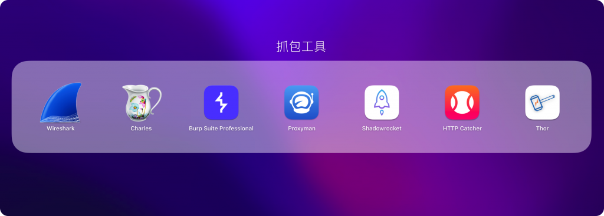
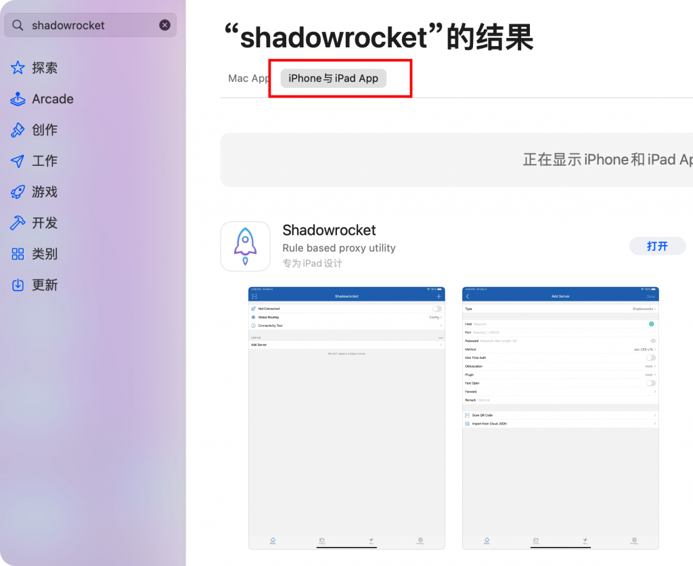
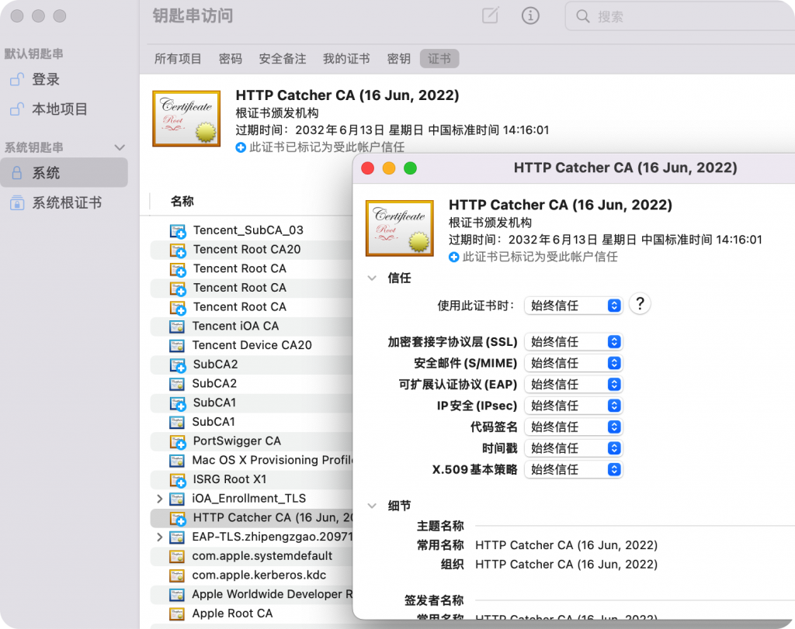
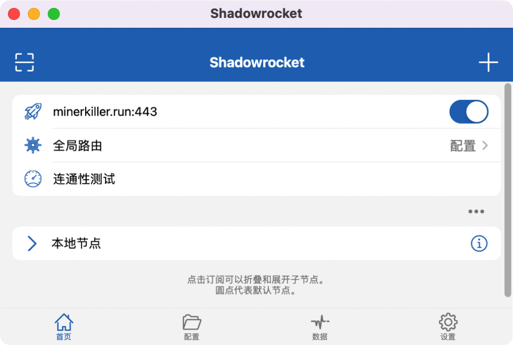
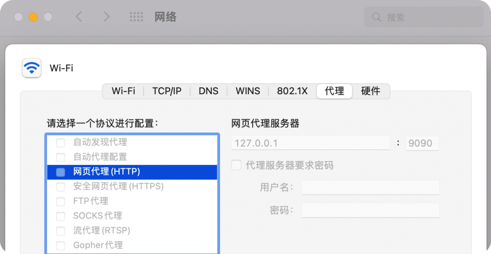
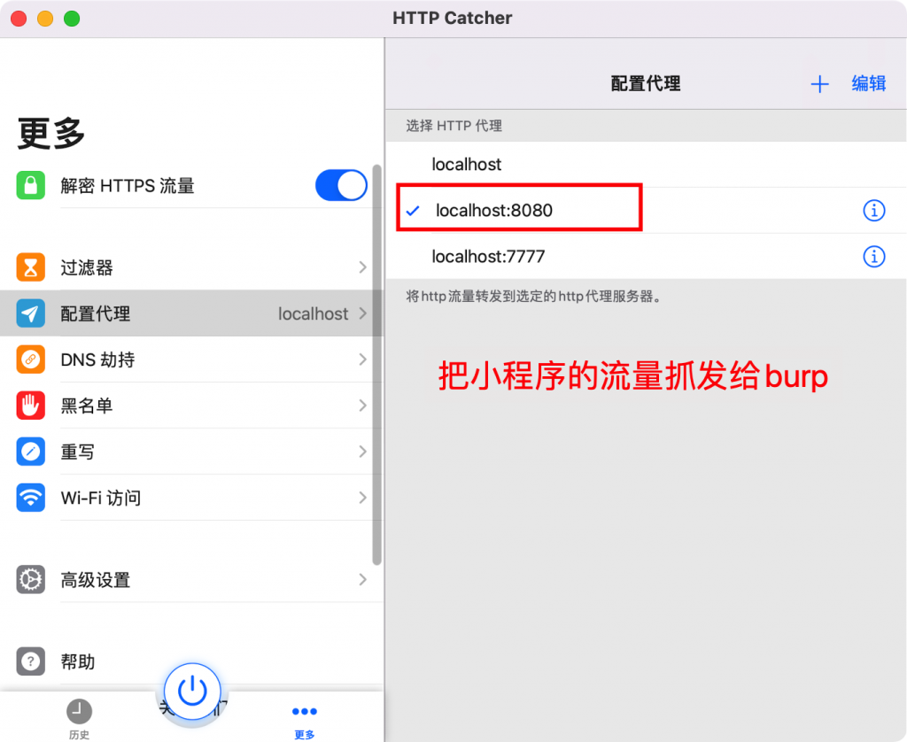
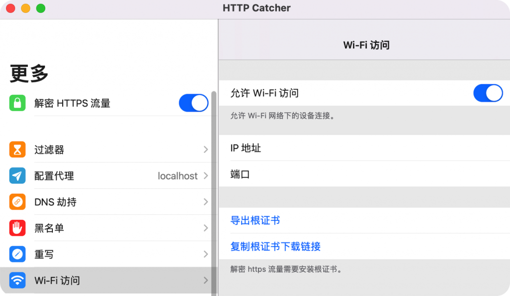
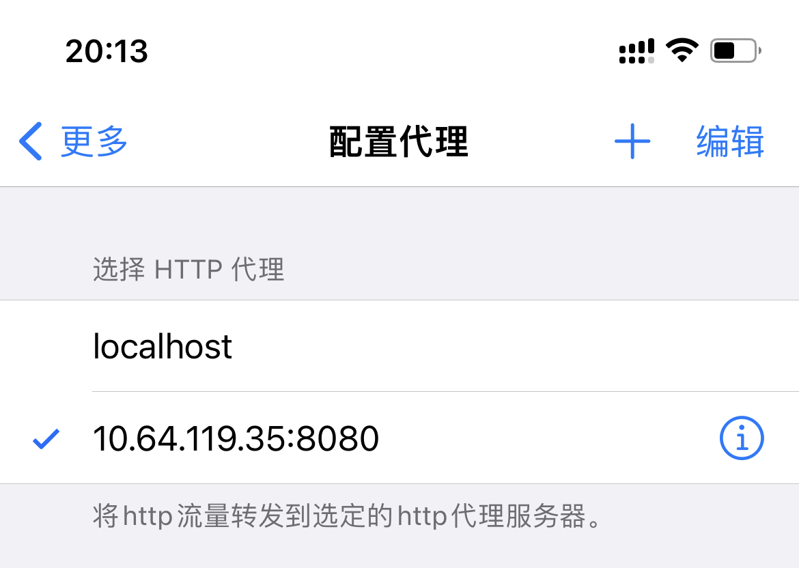
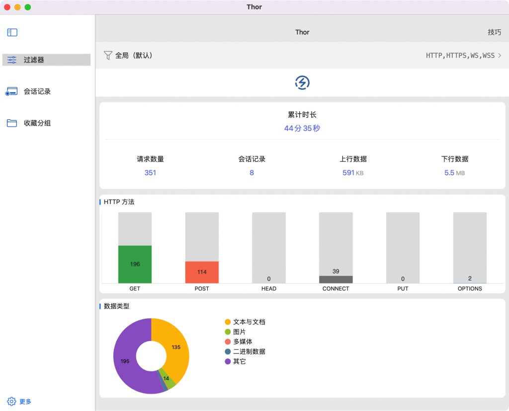

# m1 mac用ios App抓包 – Zgao's blog

### m1 mac用ios App抓包

作者 [Zgao](https://zgao.top/author/zgao/)

由于m1 mac是arm架构，所以是可以在mac上直接运行ios的应用。所以m1的抓包方式也就不再局限于传统的wireshark、Charles和burp这类抓包工具，连手机上的shadrocket（小火箭） 、 httpCatcher （网球）、Thor 都能直接在mac进行抓包或者用于上网代理。

## 如何在m1 mac上安装ios应用？

ps：ios的抓包app需要用美区id购买下载。

打开mac电脑上的app store，选择`iphone与ipad App`，搜索`shadowrocket`下载安装即可。

## 信任证书

在钥匙串中选择始终信任该证书。

打开小火箭安装证书后，导入科学上网节点就可以fq了。

在macos上运行的小火箭，mac科学上网和手机一样方便

同理其他的几个ios抓包工具和小火箭也是一样使用方式。

## 高级操作

### 抓包工具中开启系统全局流量转发

通常在做一些渗透测试工作的时候，比如需要抓包一些微信小程序的数据包。在mac上抓包是需要在系统设置中修改的，不然小程序是不会走代理的。

每次修改是比较麻烦的。可以抓包工具中配置好，使用的时候一键开启就好。

以mac的http Catcher为例。

### 将ios的流量一键转发给mac的burp

ios通过系统设置给wifi配置远程代理比较麻烦，有以下两点：

-   修改的结果不能留存，下次设置的时候还得重新输入。
-   换了wifi网络，还得重新配置代理。

可以先在mac开启wifi访问。再通过ios的http Cathcer配置代理为mac的ip和端口。每次要抓手机数据包的时候一键开启，节省大量时间。

系统代理配置，无法保存配置

http Cathcer 配置

### 安装对应抓包工具的证书

http Catcher『ios』-> http Catcher『mac』-> burp『mac』

举个例子，我们使用http Catcher转发iOS的流量最终给到burp，那就要在ios上安装burp的证书。
