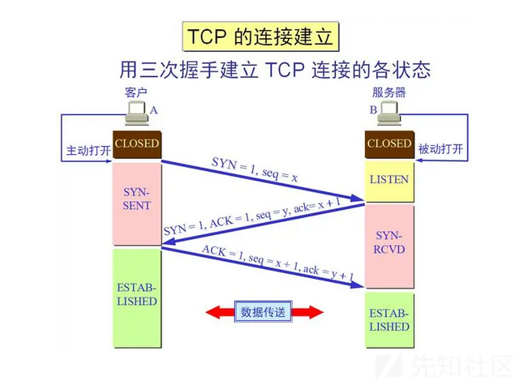

nmap部分源码分析

- - -

因为想自己写一点安全工具，所以先看看一些优秀的安全工具的源码，故有此文

（本文旨在浏览关键代码，并无深究其中代码细节

## nmap

源码下载：[https://nmap.org/dist/nmap-7.94.tgz，更新时间：2023-05-20](https://nmap.org/dist/nmap-7.94.tgz%EF%BC%8C%E6%9B%B4%E6%96%B0%E6%97%B6%E9%97%B4%EF%BC%9A2023-05-20)

下载源码后先看目录结构，在源码处使用cmd命令：tree，列出目录结构

```plain
├─.github
│  └─ISSUE_TEMPLATE      //该目录包含了用于创建GitHub问题（issues）时的模板文件。模板文件定义了问题报告或建议的结构和                                格式，以帮助用户提供有用的反馈信息。
├─docs                   //相关文档   
│  ├─licenses
│  ├─man-xlate
│  └─style
├─libdnet-stripped       //libdnet:网络接口开源库
│  ├─config
│  ├─include
│  │  └─dnet
│  └─src
├─liblinear              //liblinear:大型线性分类开源库   
│  └─blas
├─liblua                 //Lua脚本语言源码
├─libnetutil             //nmap网络实用函数
├─libpcap                //libpcap:开源抓包库
│  ├─bpf
│  │  └─net
│  ├─ChmodBPF
│  ├─cmake
│  │  └─Modules
│  ├─config
│  ├─lbl
│  ├─missing
│  ├─msdos
│  ├─NMAP_MODIFICATIONS
│  ├─packaging
│  ├─pcap
│  ├─SUNOS4
│  ├─testprogs
│  ├─tests
│  └─Win32
│      ├─Include
│      │  ├─arpa
│      │  └─net
│      ├─Prj
│      └─Src
├─libpcre                //libpcre:处理正则匹配的开源库
├─libssh2                //libssh2:实现ssh协议的开源库
│  ├─cmake
│  ├─include
│  ├─m4
│  ├─nw
│  │  └─test
│  ├─os400
│  │  ├─include
│  │  │  └─sys
│  │  └─libssh2rpg
│  ├─src
│  ├─vms
│  └─win32
│      └─test
├─libz                   //libz:用于数据压缩和解压缩的开源库
│  ├─amiga
│  ├─contrib
│  │  ├─ada
│  │  ├─amd64
│  │  ├─asm686
│  │  ├─blast
│  │  ├─delphi
│  │  ├─dotzlib
│  │  │  └─DotZLib
│  │  ├─gcc_gvmat64
│  │  ├─infback9
│  │  ├─inflate86
│  │  ├─iostream
│  │  ├─iostream2
│  │  ├─iostream3
│  │  ├─masmx64
│  │  ├─masmx86
│  │  ├─minizip
│  │  ├─pascal
│  │  ├─puff
│  │  ├─testzlib
│  │  ├─untgz
│  │  └─vstudio
│  │      ├─vc10
│  │      ├─vc11
│  │      ├─vc12
│  │      ├─vc14
│  │      └─vc9
│  ├─doc
│  ├─examples
│  ├─msdos
│  ├─nintendods
│  ├─old
│  │  └─os2
│  ├─os400
│  ├─qnx
│  ├─test
│  ├─watcom
│  └─win32
├─macosx                     //支持苹果操作系统
│  └─nmap.pmdoc
├─mswin32                    //支持Windows操作系统
│  ├─license-format
│  ├─NET
│  ├─NETINET
│  ├─nsis
│  └─RPC
├─nbase                      //nmap封装的基础使用程序库
│  └─test
├─ncat                       //nmap项目组实现的新版nc
│  ├─certs
│  ├─docs
│  │  └─examples
│  │      ├─logs
│  │      └─scripts
│  │          └─http-scan
│  ├─scripts
│  │  └─filters
│  └─test
│      └─test-env-w32
├─ndiff                      //比较扫描结果
│  ├─docs
│  ├─scripts
│  └─test-scans
├─nping                      //网络探测与构建packet
│  └─docs
├─nselib                     //Lua语言编写的常用的脚本库
│  └─data
│      ├─jdwp-class
│      └─psexec
├─nsock                      //并行的SocketEvent处理库
│  ├─include
│  ├─src
│  └─tests
├─scripts                    //常用的扫描检查的lua脚本
├─tests                      //使用了Nmap Security Scanner项目中的DNS模块，目的是验证该模块在解析DNS数据包时的正确性
├─todo                       //介绍Nmap项目将来开发的具体任务
└─zenmap                     //python编写的图形界面
    ├─install_scripts
    │  ├─macosx
    │  ├─unix
    │  ├─utils
    │  └─windows
    ├─radialnet
    │  ├─bestwidgets
    │  ├─core
    │  ├─gui
    │  ├─share
    │  │  └─sample
    │  └─util
    ├─share
    │  └─zenmap
    │      ├─config
    │      ├─docs
    │      ├─locale
    │      │  ├─de
    │      │  │  └─LC_MESSAGES
    │      │  ├─es
    │      │  │  └─LC_MESSAGES
    │      │  ├─fr
    │      │  │  └─LC_MESSAGES
    │      │  ├─hi
    │      │  │  └─LC_MESSAGES
    │      │  ├─hr
    │      │  │  └─LC_MESSAGES
    │      │  ├─it
    │      │  │  └─LC_MESSAGES
    │      │  ├─ja
    │      │  │  └─LC_MESSAGES
    │      │  ├─pl
    │      │  │  └─LC_MESSAGES
    │      │  ├─pt_BR
    │      │  │  └─LC_MESSAGES
    │      │  ├─ru
    │      │  │  └─LC_MESSAGES
    │      │  └─zh
    │      │      └─LC_MESSAGES
    │      ├─misc
    │      └─pixmaps
    │          └─radialnet
    ├─test
    ├─zenmapCore
    └─zenmapGUI
        └─higwidgets
```

**执行流程**

主要工作在：nmap.cc  
可以看到，此实现的是一些端口扫描功能以及命令行用户界面，main函数在main.cc中

接着看main.cc  
可以看到，这个文件除了调用nmap\_main()（位于nmap.cc中）之外，几乎不执行任何操作

再返回来看nmap.cc的nmap\_main()函数  
Nmap的所有的功能都在此nmap\_main()设有入口，以此为基础可以更深入地分析Nmap的其他模块  
下面是详细的代码分析：

开始是定义一些变量

```plain
int nmap_main(int argc, char *argv[]) {
  int i;
  std::vector<Target *> Targets;
  time_t now;
  time_t timep;
  char mytime[128];
  struct addrset *exclude_group;
#ifndef NOLUA
  /* 扫描前和扫描后脚本结果数据结构 */ 
  ScriptResults *script_scan_results = NULL;
#endif
  unsigned int ideal_scan_group_sz = 0;
  Target *currenths;
  char myname[FQDN_LEN + 1];
  int sourceaddrwarning = 0; /* 我们有没有警告过他们不可访问的源地址？ */
  unsigned int targetno;
  char hostname[FQDN_LEN + 1] = "";
  struct sockaddr_storage ss;
  size_t sslen;
  int err;
```

然后是一个预处理，用于条件编译

```plain
#ifdef LINUX
  /* 检查WSL，并警告事情可能进展不顺利。 */
  struct utsname uts;      //存储系统信息              
  if (!uname(&uts)) {      //打印警告信息，提示用户当前运行的程序（NMAP_NAME）可能在Windows Subsystem for Linux上无法正                              常工作，并建议使用原生的Windows版本，提供了下载链接（NMAP_URL）。
    if (strstr(uts.release, "Microsoft") != NULL) { 
      error("Warning: %s may not work correctly on Windows Subsystem for Linux.\n"
          "For best performance and accuracy, use the native Windows build from %s/download.html#windows.",
          NMAP_NAME, NMAP_URL);
    }
  }  
#endif
```

继续

```plain
tzset();     
  now = time(NULL);
  err = n_localtime(&now, &local_time);
  if (err) {
    fatal("n_localtime failed: %s", strerror(err));
  }
```

上面这段代码是涉及时间的相关操作，会将当前时区时间与系统时间进行比对

```plain
if (argc < 2){
    printusage();
    exit(-1);
  }

  Targets.reserve(100);
```

这里的argc是运行时传入的参数，如果小于2个，调用`printusage()`，这个函数是列举nmap的功能  
下面的Targets是一个`std::vector`对象，`std::vector`是C++标准库中的一个容器类，它可以存储一系列的元素，并提供了方便的方法来访问和操作这些元素。这里为`Targets`容器预留了100个元素的内存空间。

```plain
#ifdef WIN32
  win_pre_init();
#endif
```

在Windows操作系统上启动Winsock库，并检查启动过程中是否出现错误

```plain
parse_options(argc, argv);

  if (o.debugging)
    nbase_set_log(fatal, error);
  else
    nbase_set_log(fatal, NULL);


  tty_init(); // 将键盘置于原始模式
```

`parse_options()`函数用于解析命令行参数，然后的判断是是否启用调试模式，写入日志。  
`tty_init()`函数用于初始化终端，包括打开终端设备、设置终端属性和注册清理函数等。它会根据配置和环境的不同采取不同的处理逻辑，以确保终端的正确初始化。

```plain
#ifdef WIN32
  // Must come after parse_options because of --unprivileged
  // Must come before apply_delayed_options because it sets o.isr00t
  win_init();
#endif
```

`win_init()`函数调用WSAStartup启动Winsock DLL，后续网络解析等需要用到。

然后是

```plain
apply_delayed_options();
```

此函数的功能是将解析命令时需要延迟执行的操作在此处处理，先不深究

```plain
for (unsigned int i = 0; i < route_dst_hosts.size(); i++) {
    const char *dst;             //用于存储目标地址
    struct sockaddr_storage ss;  //用于存储解析后的目标地址信息
    struct route_nfo rnfo;       //用于存储路由信息
    size_t sslen;                //用于存储目标地址信息的长度
    int rc;

    dst = route_dst_hosts[i].c_str();   //将route_dst_hosts容器中的第i个元素转换为C风格的字符串，并将其赋值给dst变量
    rc = resolve(dst, 0, &ss, &sslen, o.af());  //将目标地址dst解析为网络地址，并将解析结果存储在ss和sslen中
    if (rc != 0)    //如果解析失败，打印错误信息并终止程序执行
      fatal("Can't resolve %s: %s.", dst, gai_strerror(rc));

    printf("%s\n", inet_ntop_ez(&ss, sslen));  //打印解析后的目标地址，使用inet_ntop_ez()函数将二进制地址转换为可打印的字符串形式

    if (!route_dst(&ss, &rnfo, o.device, o.SourceSockAddr())) { //调用route_dst()函数，根据目标地址ss、网络设备o.device和源地址o.SourceSockAddr()获取路由信息，并进行条件判断。
      printf("Can't route %s (%s).", dst, inet_ntop_ez(&ss, sslen));  //如果无法获取路由信息，打印错误信息
    } else {
      printf("%s %s", rnfo.ii.devname, rnfo.ii.devfullname);   //打印路由信息中的设备名称和设备全名
      printf(" srcaddr %s", inet_ntop_ez(&rnfo.srcaddr, sizeof(rnfo.srcaddr)));  //打印路由信息中的源地址
      if (rnfo.direct_connect)  //如果路由信息中存在直接连接（direct connect），打印相应的提示信息
        printf(" direct");
      else
        printf(" nexthop %s", inet_ntop_ez(&rnfo.nexthop, sizeof(rnfo.nexthop)));  //如果路由信息中存在下一跳地址，打印相应的提示信息。
    }
    printf("\n");
  }
  route_dst_hosts.clear();   //清空route_dst_hosts容器，删除其中的所有元素。
```

这里的`route_dst_hosts`来自`static std::vector<std::string> route_dst_hosts;`，也是一个容器。存放的内容可以是ip，也可以是域名。  
这段代码的目的是遍历`route_dst_hosts`容器中的目标地址，进行解析、路由查询和打印相应的信息。最后，清空容器，准备处理下一批目标地址。

```plain
if (delayed_options.iflist) {
    print_iflist();  //用于打印接口列表的信息
    exit(0);
  }
```

跟踪到`delayed_options.iflist`的地方

```plain
o.scanflags = parse_scanflags(optarg);
if (o.scanflags < 0) {
            fatal("--scanflags option must be a number between 0 and 255 (inclusive) or a string like \"URGPSHFIN\".");
          }
        } else if (strcmp(long_options[option_index].name, "iflist") == 0) {
          delayed_options.iflist = true;
```

第一行的`parse_scanflags()`函数是判断端口是否在0-255，第二行的`fatal`是封装的输出函数。这里会输出一个字符串。  
再往下就是判断是否传入 "iflist" 参数。结合上面一段代码，所以就是进行参数的判断，如果有，则打印接口列表的信息

​

继续看nmap.cc的代码

```plain
/* 如果他想跳出FTP站点，那个站点最好是可以访问的！ */
  if (o.bouncescan) {     //是否启用了 FTP 弹跳扫描
    int rc = resolve(ftp.server_name, 0, &ss, &sslen, AF_INET);//调用resolve()函数来解析 FTP 弹跳代理主机名或 IP 地址
    if (rc != 0)  //检查解析是否成功
        fatal("Failed to resolve FTP bounce proxy hostname/IP: %s",
              ftp.server_name);
    memcpy(&ftp.server, &((sockaddr_in *)&ss)->sin_addr, 4);  //将解析得到的 IP 地址复制到 ftp.server 变量中
    if (o.verbose) {  //检查是否启用了详细输出模式
      log_write(LOG_STDOUT, "Resolved FTP bounce attack proxy to %s (%s).\n",
                ftp.server_name, inet_ntoa(ftp.server)); 
        //使用 log_write() 函数将解析得到的 FTP 弹跳代理的主机名和 IP 地址输出到标准输出
    }
  }
  fflush(stdout);   //刷新标准输出缓冲区，确保输出被立即写入
  fflush(stderr);   //刷新标准错误输出缓冲区，确保错误消息被立即写入
```

这一段涉及到一个知识点：FTP弹跳扫描  
FTP 协议有一个特点是支持代理 ftp 连接。利用了FTP服务器上的"PORT"命令和"EPRT"命令的特性。代理连接指的是它允许用户连接到一台 FTP 服务器，然后要求此 FTP 服务器将文件送到一台第三方服务器。所以导致 FTP 服务器可以利用于对其它主机端口扫描。

这段代码片段的目的是解析 FTP 弹跳代理的主机名或 IP 地址，并将解析结果存储在 `ftp.server` 变量中，为扫描做准备

```plain
timep = time(NULL);
  err = n_ctime(mytime, sizeof(mytime), &timep);
  if (err) {
    fatal("n_ctime failed: %s", strerror(err));
  }
  chomp(mytime);
```

和前面的一段类似，这里多了个`chomp()`函数，他的作用是去除 `mytime` 字符串末尾的换行符

```plain
if (!o.resuming) {    //检查是否需要生成 XML 输出
    /* 简要信息以防他们忘记扫描的内容 */
    char *xslfname = o.XSLStyleSheet();  //获取 XSL 样式表文件名，并将结果保存在 xslfname 变量中
    xml_start_document("nmaprun");       //开始一个名为 "nmaprun" 的 XML 文档
    if (xslfname) {                      //是否存在 XSL 样式表文件
      xml_open_pi("xml-stylesheet");     //打开一个 XML 处理指令
      xml_attribute("href", "%s", xslfname); //添加一个名为 "href" 的属性，其值为 xslfname 变量的内容
      xml_attribute("type", "text/xsl");     //添加一个名为 "type" 的属性，其值为 "text/xsl"
      xml_close_pi();                        //关闭 XML 处理指令
      xml_newline();                         //在 XML 文档中插入一个换行符
    }

    xml_start_comment();          //开始一个注释块
    xml_write_escaped(" %s %s scan initiated %s as: %s ", NMAP_NAME, NMAP_VERSION, mytime, join_quoted(argv, argc).c_str());                   //在注释块中输出一段包含程序名称、版本号、扫描启动时间和命令行参数的信息
    xml_end_comment();            //结束注释块
    xml_newline();

    xml_open_start_tag("nmaprun");     //打开一个名为 "nmaprun" 的 XML 元素
    xml_attribute("scanner", "nmap");  //和上面类似，添加属性
    xml_attribute("args", "%s", join_quoted(argv, argc).c_str());
    xml_attribute("start", "%lu", (unsigned long) timep);
    xml_attribute("startstr", "%s", mytime);
    xml_attribute("version", "%s", NMAP_VERSION);
    xml_attribute("xmloutputversion", NMAP_XMLOUTPUTVERSION);
    xml_close_start_tag();    //关闭 XML 元素的开始标签。
    xml_newline();

    output_xml_scaninfo_records(&ports);  //输出扫描信息记录到 XML 文档中

    xml_open_start_tag("verbose");
    xml_attribute("level", "%d", o.verbose);
    xml_close_empty_tag();
    xml_newline();
    xml_open_start_tag("debugging");
    xml_attribute("level", "%d", o.debugging);
    xml_close_empty_tag();
    xml_newline();
  } else {
    xml_start_tag("nmaprun", false);
  }
```

上面这段代码的作用是根据条件判断是否需要生成 XML 输出，会生成包含扫描信息的 XML 文档

```plain
log_write(LOG_NORMAL | LOG_MACHINE, "# ");
  log_write(LOG_NORMAL | LOG_MACHINE, "%s %s scan initiated %s as: %s", NMAP_NAME, NMAP_VERSION, mytime, join_quoted(argv, argc).c_str());
  log_write(LOG_NORMAL | LOG_MACHINE, "\n");
```

这三句都是进行日志操作，将一些扫描相关的信息以特定格式记录到日志中

```plain
/* 在我们随机化扫描的端口之前，让我们将它们输出到机器可解析的输出中 */
  if (o.verbose)   //检查是否设置了详细输出的标志
    output_ports_to_machine_parseable_output(&ports); //将扫描的端口信息输出为机器可解析的格式

#if defined(HAVE_SIGNAL) && defined(SIGPIPE)
  signal(SIGPIPE, SIG_IGN); /* 忽略 SIGPIPE，这样我们的程序就不会因此而崩溃，但我们真的不应该收到意外的 SIGPIPE */
                            //通过将其处理方式设置为忽略，可以防止程序因为 SIGPIPE 而崩溃
#endif
```

知识点：SIGPIPE 信号是在Unix和类Unix系统中的一种信号，它表示管道破裂，当一个进程试图向一个已经关闭写端的管道写数据时，内核会向该进程发送SIGPIPE信号

```plain
if (o.max_parallelism && (i = max_sd()) && i < o.max_parallelism) {
    error("WARNING: Your specified max_parallel_sockets of %d, but your system says it might only give us %d.  Trying anyway", o.max_parallelism, i);
  }

  if (o.debugging > 1)
    log_write(LOG_STDOUT, "The max # of sockets we are using is: %d\n", o.max_parallelism);
```

在进行并行扫描之前，检查最大并行套接字数的限制和系统实际可提供的最大套接字描述符数之间的关系

```plain
// 此时，我们应该充分了解我们的时间参数
  if (o.debugging) {
    log_write(LOG_PLAIN, "--------------- Timing report ---------------\n");
    log_write(LOG_PLAIN, "  hostgroups: min %d, max %d\n", o.minHostGroupSz(), o.maxHostGroupSz());
    log_write(LOG_PLAIN, "  rtt-timeouts: init %d, min %d, max %d\n", o.initialRttTimeout(), o.minRttTimeout(), o.maxRttTimeout());
    log_write(LOG_PLAIN, "  max-scan-delay: TCP %d, UDP %d, SCTP %d\n", o.maxTCPScanDelay(), o.maxUDPScanDelay(), o.maxSCTPScanDelay());
    log_write(LOG_PLAIN, "  parallelism: min %d, max %d\n", o.min_parallelism, o.max_parallelism);
    log_write(LOG_PLAIN, "  max-retries: %d, host-timeout: %ld\n", o.getMaxRetransmissions(), o.host_timeout);
    log_write(LOG_PLAIN, "  min-rate: %g, max-rate: %g\n", o.min_packet_send_rate, o.max_packet_send_rate);
    log_write(LOG_PLAIN, "---------------------------------------------\n");
  }
```

在调试模式下，输出一个时间报告到日志

```plain
/* 在随机化扫描的端口之前，我们必须初始化PortList类。 */
  if (o.ipprotscan)    //是否启用了 IP 协议扫描
    PortList::initializePortMap(IPPROTO_IP,  ports.prots, ports.prot_count); //初始化 IP 协议的端口映射
  if (o.TCPScan())     //是否启用了 TCP 扫描
    PortList::initializePortMap(IPPROTO_TCP, ports.tcp_ports, ports.tcp_count); //初始化 TCP 协议的端口映射
  if (o.UDPScan())     //是否启用了 UDP 扫描
    PortList::initializePortMap(IPPROTO_UDP, ports.udp_ports, ports.udp_count);  //初始化 UDP 协议的端口映射
  if (o.SCTPScan())    //启用了 SCTP 扫描
    PortList::initializePortMap(IPPROTO_SCTP, ports.sctp_ports, ports.sctp_count); //初始化 SCTP 协议的端口映射
```

在进行随机化扫描之前，根据不同的协议类型初始化对应的端口映射

```plain
if (o.randomize_ports) {      //是否启用了随机化端口扫描
    if (ports.tcp_count) {      //检查 TCP 端口数量是否大于零
      shortfry(ports.tcp_ports, ports.tcp_count);   //对 TCP 端口数组进行随机化操作
      // 将一些更常见的端口移到更靠近开始的位置，以加快扫描速度
      random_port_cheat(ports.tcp_ports, ports.tcp_count);
    }
    if (ports.udp_count)   //检查 UDP 端口数量是否大于零
      shortfry(ports.udp_ports, ports.udp_count);     //端口随机化操作
    if (ports.sctp_count)  //检查 SCTP 端口数量
      shortfry(ports.sctp_ports, ports.sctp_count);
    if (ports.prot_count)  //检查协议端口数量
      shortfry(ports.prots, ports.prot_count);
  }
```

在需要随机化端口时，对不同协议类型的端口数组进行随机化操作

将`random_port_cheat()`函数的具体实现方法拿过来，写一段代码测试此函数

```plain
#include <stdio.h>
#include <stdlib.h>

typedef unsigned __int16 uint16_t;
typedef uint16_t u16;

void random_port_cheat(u16* ports, int portcount) {
    int allportidx = 0;
    int popportidx = 0;
    int earlyreplidx = 0;
    /* Updated 2008-12-19 from nmap-services-all.
       Top 25 open TCP ports plus 113, 554, and 256 */
    u16 pop_ports[] = {
      80, 23, 443, 21, 22, 25, 3389, 110, 445, 139,
      143, 53, 135, 3306, 8080, 1723, 111, 995, 993, 5900,
      1025, 587, 8888, 199, 1720,
      113, 554, 256
    };
    int num_pop_ports = sizeof(pop_ports) / sizeof(u16);   //计算数组中元素的个数

    for (allportidx = 0; allportidx < portcount; allportidx++) { //外部循环迭代所有的端口，内部循环迭代常用端口
        // 查看当前端口是否为常用端口
        for (popportidx = 0; popportidx < num_pop_ports; popportidx++) {
            if (ports[allportidx] == pop_ports[popportidx]) {
                // 这个端口是常用的，把它换到开头附近。
                if (allportidx != earlyreplidx) {
                    ports[allportidx] = ports[earlyreplidx];
                    ports[earlyreplidx] = pop_ports[popportidx];
                }
                earlyreplidx++;
                break;
            }
        }
    }
}
struct scan_lists {
    int tcp_count;
    unsigned short* tcp_ports;
};

int main() {
    struct scan_lists ports;
    ports.tcp_count = 7;
    ports.tcp_ports = (unsigned short*)malloc(ports.tcp_count * sizeof(unsigned short));
    ports.tcp_ports[0] = 80;
    ports.tcp_ports[1] = 7777;
    ports.tcp_ports[2] = 443;
    ports.tcp_ports[3] = 22;
    ports.tcp_ports[4] = 2111;
    ports.tcp_ports[5] = 3389;
    ports.tcp_ports[6] = 8080;
    random_port_cheat(ports.tcp_ports, ports.tcp_count);

    printf("TCP Ports:\n");
    for (int i = 0; i < ports.tcp_count; i++) {
        printf("%d\n", ports.tcp_ports[i]);
    }

    free(ports.tcp_ports);

    return 0;
}
```

运行后得到：

```plain
TCP Ports:
80
443
22
3389
8080
7777
2111
```

此函数会把在重要端口列表的端口放在前面

下面开始就是namp扫描的重点部分

nmap的10个扫描阶段：脚本预扫描 > 目标枚举 > 主机发现（ping扫描） > 反向DNS解析 > 端口扫描 > 版本检测 > 操作系统检测 > Traceroute > 脚本扫描 > 输出> 编写后扫描脚本  
**位置**：**脚本预扫描**：此阶段是可选的，默认扫描中不会发生，“脚本预扫描”选项是从 Nmap 脚本引擎调用脚本(NSE) 用于 dhcp-discover 等预扫描阶段。**目标枚举**：在此阶段，默认扫描方法中的第一个阶段，nmaps 仅包含有关要扫描的目标的信息，例如 IP 地址、主机、IP 范围等。**主机发现（ping 扫描）**：在此阶段，nmap 会了解哪些目标在线或可访问。**反向 DNS 解析**：在此阶段，nmap 将查找用于 IP 地址的主机名。**端口扫描**：Nmap 将发现端口及其状态：打开、关闭或已过滤。**版本检测**：在此阶段，nmap 将尝试了解上一阶段发现的开放端口中运行的软件版本，例如 apache 或 ftp 的版本。**操作系统检测**：nmap 将尝试了解目标的操作系统。**Traceroute**： nmap会发现目标在网络上的路由或网络中的所有路由。**脚本扫描**：此阶段是可选的，在此阶段执行NSE脚本，NSE脚本可以在扫描之前执行，扫描期间执行扫描及其之后，但都是可选的。**输出**：Nmap 向我们显示有关收集的数据的信息。**扫描后脚本**：扫描完成后运行脚本的可选阶段。（参考：[https://cn.linux-console.net/?p=15913）](https://cn.linux-console.net/?p=15913%EF%BC%89)

下面是预扫描阶段

```plain
#ifndef NOLUA       //在没有定义 NOLUA 宏的情况下执行下面的代码块
  if (o.scriptupdatedb) {   //检查是否启用了更新脚本数据库
    o.max_ips_to_scan = o.numhosts_scanned; // 禁用警告？
  }
  if (o.servicescan)   //是否启用了服务扫描
    o.scriptversion = true;
  if (o.scriptversion || o.script || o.scriptupdatedb)  //检查是否启用了脚本版本信息、脚本或更新脚本数据库
    open_nse();   //初始化NSE（nmap脚本引擎）

  /* 运行脚本预扫描阶段 */
  if (o.script) {   //是否启用扫描
    script_scan_results = get_script_scan_results_obj();            //获取脚本扫描结果对象
    script_scan(Targets, SCRIPT_PRE_SCAN);                          //运行脚本的预扫描阶段
    printscriptresults(script_scan_results, SCRIPT_PRE_SCAN);       //打印脚本的预扫描结果
    for (ScriptResults::iterator it = script_scan_results->begin(); //循环遍历脚本扫描结果对象中的元素
        it != script_scan_results->end(); it++) {
      delete (*it);    //删除当前元素指向的内存对象
    }
    script_scan_results->clear();   //清空脚本扫描结果
  }
#endif
```

根据不同的条件启用或禁用脚本相关的功能。如果启用了服务扫描的标志或脚本相关的标志，则初始化 NSE，并运行脚本的预扫描功能，输出扫描结果，然后清空脚本扫描结果对象中的数据。

接下来看看什么是预扫描，查看`script_scan()`函数

```plain
void script_scan (std::vector<Target *> &targets, stype scantype)
{
  o.current_scantype = scantype;

  assert(L_NSE != NULL);
  lua_settop(L_NSE, 0); /* 清除堆栈 */

  lua_pushcfunction(L_NSE, nseU_traceback);    //用于Lua脚本中进行错误追踪
  lua_pushcfunction(L_NSE, run_main);
  lua_pushlightuserdata(L_NSE, &targets);

  if (lua_pcall(L_NSE, 1, 0, 1))
    error("%s: Script Engine Scan Aborted.\nAn error was thrown by the "
          "engine: %s", SCRIPT_ENGINE, lua_tostring(L_NSE, -1));
  lua_settop(L_NSE, 0);
}
```

重点来看这里的`lua_pushcfunction(L_NSE, run_main);`的`run_main()`

```plain
static int run_main (lua_State *L)
{
  std::vector<Target *> *targets = (std::vector<Target*> *)
      lua_touserdata(L, 1);

  /* 新建主机组 */
  lua_newtable(L);
  lua_setfield(L, LUA_REGISTRYINDEX, NSE_CURRENT_HOSTS);

  lua_getfield(L, LUA_REGISTRYINDEX, NSE_MAIN);
  assert(lua_isfunction(L, -1));

  /* NSE主函数的第一个参数是目标列表。这是一个包含1-N个目标名称的列表。*/
  lua_createtable(L, targets->size(), 0);
  int targets_table = lua_gettop(L);
  lua_getfield(L, LUA_REGISTRYINDEX, NSE_CURRENT_HOSTS);
  int current_hosts = lua_gettop(L);
  for (std::vector<Target *>::iterator ti = targets->begin(); ti != targets->end(); ti++)
  {  //迭代目标向量中的每个目标
    Target *target = (Target *) *ti;
    if (target->timedOut(NULL)) {   //检查目标对象是否已超时
      continue;
    }
    const char *TargetName = target->TargetName();    //获取目标对象的名称
    const char *targetipstr = target->targetipstr();  //获取目标对象的IP地址

    lua_newtable(L);              //创建新表
    set_hostinfo(L, target);      //设置主机信息，存储在targets_table中
    lua_rawseti(L, targets_table, lua_rawlen(L, targets_table) + 1); //获取targets_table的长度，然后使用+1作为索引将该表存储在targets_table中

    /* 在 NSE_CURRENT_HOSTS 的 targetname 和 IP 下索引此目标，以便我们稍后检索它*/
    if (TargetName != NULL && strcmp(TargetName, "") != 0) {   //检查目标名称是否不为空
      lua_pushstring(L, TargetName);    //将目标名推入栈中
      lua_pushlightuserdata(L, target); //将目标对象推入栈中
      lua_rawset(L, current_hosts); /* 添加到 NSE_CURRENT_HOSTS */
    }
    lua_pushstring(L, targetipstr);
    lua_pushlightuserdata(L, target);
    lua_rawset(L, current_hosts); /* 添加到 NSE_CURRENT_HOSTS */
  }
  lua_settop(L, targets_table);   //栈顶的元素调整为targets_table

  /* 推入脚本扫描阶段类型。NSE主函数的第二个参数 */
  switch (o.current_scantype)  //变量o.current_scantype的值来确定要推送到Lua栈中的表示脚本扫描阶段类型的字符串
  {
    case SCRIPT_PRE_SCAN:
      lua_pushliteral(L, NSE_PRE_SCAN);    //表示脚本预扫描阶段
      break;
    case SCRIPT_SCAN:
      lua_pushliteral(L, NSE_SCAN);        //表示脚本扫描阶段
      break;
    case SCRIPT_POST_SCAN:
      lua_pushliteral(L, NSE_POST_SCAN);   //表示脚本扫描后阶段
      break;
    default:
      fatal("%s: failed to set the script scan phase.\n", SCRIPT_ENGINE);
  }

  lua_call(L, 2, 0);

  return 0;
}
```

通过上面的代码可以看出，这里的 ”预扫描“ 并不是真正的扫描，没有进行主机发现、端口扫描等操作，而是将一些基本信息推入栈中

继续看`nmap_main()`

```plain
if (o.ping_group_sz < o.minHostGroupSz())
    o.ping_group_sz = o.minHostGroupSz();
  HostGroupState hstate(o.ping_group_sz, o.randomize_hosts, argc, (const char **) argv);
```

如果当前的 Ping 主机组大小小于最小主机组大小，则将其设置为最小主机组大小。然后，使用设置后的 Ping 主机组大小创建一个 `HostGroupState` 对象。

继续

```plain
do {
    //根据已扫描的主机数量和端口信息，确定理想的扫描组大小，并将结果赋值给 ideal_scan_group_sz。对应：目标枚举
    ideal_scan_group_sz = determineScanGroupSize(o.numhosts_scanned, &ports);

    while (Targets.size() < ideal_scan_group_sz) { //在目标列表的大小小于理想扫描组大小时。对应：主机发现
      o.current_scantype = HOST_DISCOVERY;         //将当前扫描类型设置为主机发现
      currenths = nexthost(&hstate, exclude_group, &ports, o.pingtype);  //nexthost 函数根据主机组状态、排除的主机组、端口信息和 Ping 类型选择下一个要扫描的主机
      if (!currenths)  //如果获取不到下一个主机，则跳出内部循环
        break;

      if (currenths->flags & HOST_UP && !o.listscan)  //如果当前主机可达，且不是列表扫描模式，则增加已扫描的主机数量
        o.numhosts_up++;

      if ((o.noportscan && !o.traceroute    //如果没有端口扫描且不进行路由跟踪
#ifndef NOLUA
           && !o.script                     //不包含脚本扫描
#endif
          ) || o.listscan) {
        /* We're done with the hosts */
        if (currenths->flags & HOST_UP || (o.verbose && !o.openOnly())) {  //如果当前主机可达或者详细输出模式开启且不仅显示开放端口
          xml_start_tag("host");           //开始一个名为 "host" 的 XML 标签
          write_host_header(currenths);    //写入主机的头部信息到日志
          printmacinfo(currenths);         //打印主机的 MAC 信息
          //  if (currenths->flags & HOST_UP)
          //  log_write(LOG_PLAIN,"\n");
          printtimes(currenths);           //打印主机的时间信息
          xml_end_tag();                   //结束 "host" 的 XML 标签
          xml_newline();                   //在 XML 中插入一个新行
          log_flush_all();                 //刷新日志。
        }
        delete currenths;                  //释放当前主机的内存
        o.numhosts_scanned++;              //增加已扫描的主机数量

        //如果没有限制最大扫描数量，或者当前已扫描的主机数量加上目标列表的大小小于最大扫描数量
        if (!o.max_ips_to_scan || o.max_ips_to_scan > o.numhosts_scanned + Targets.size())
          continue;
        else
          break;
      }

      if (o.spoofsource) {                 //如果启用了源 IP 欺骗
        o.SourceSockAddr(&ss, &sslen);     //获取源 IP 的套接字地址和长度
        currenths->setSourceSockAddr(&ss, sslen);   //将源 IP 的套接字地址和长度设置为当前主机的源 IP
      }

      /* 我过去会检查 !currenths->weird_responses，但在某些罕见情况下，这些 IP 可以成功扫描端口，甚至连接 */
      if (!(currenths->flags & HOST_UP)) {   //检测当前主机是否开启，如果未开启，执行下面代码
        if (o.verbose && (!o.openOnly() || currenths->ports.hasOpenPorts())) {   //如果设置了详细输出，并且不仅仅是打开端口或当前主机存在打开的端口
          xml_start_tag("host");            //同上
          write_host_header(currenths);
          xml_end_tag();
          xml_newline();
        }
        delete currenths;
        o.numhosts_scanned++;
        if (!o.max_ips_to_scan || o.max_ips_to_scan > o.numhosts_scanned + Targets.size())  //检查是否达到了扫描的最大限制，如果限制未设置或者未达到最大限制，则继续下一轮循环
          continue;
        else
          break;
      }

      //下面这段代码的功能是根据一系列条件设置扫描的源地址。首先，它检查是否设置了原始扫描，如果是，则尝试获取当前主机的源地址，并将其设置为扫描的源地址。如果无法获取当前主机的源地址，则尝试获取主机名，并通过解析主机名来获取源地址。如果主机名获取或解析失败，则输出错误信息。无论是通过获取当前主机的源地址还是解析主机名来获取源地址，都将获取的源地址设置为扫描的源地址。如果无法确定要使用的接口地址，则输出警告信息，并猜测使用的接口地址。最后，将源地址警告的标志设置为1，表示已经发出了源地址警告。
      //下面是一些详细解释
      if (o.RawScan()) {   //如果设置了原始扫描。对应：反向DNS解析 
        if (currenths->SourceSockAddr(NULL, NULL) != 0) {  //检查currenths指针所指向的对象是否可以获取当前主机的源地址，并设置扫描源地址
          if (o.SourceSockAddr(&ss, &sslen) == 0) { //检查o对象是否可以获取源地址，并将获取的地址存储在ss和sslen变量中
            currenths->setSourceSockAddr(&ss, sslen); //将之前获取的源地址ss和sslen设置为扫描的源地址
          } else {
            //如果无法获取源地址，检查获取主机名myname是否失败，或者调用resolve函数解析主机名失败
            if (gethostname(myname, FQDN_LEN) ||
                resolve(myname, 0, &ss, &sslen, o.af()) != 0)
              //输出致命错误信息
              fatal("Cannot get hostname!  Try using -S <my_IP_address> or -e <interface to scan through>\n");


            o.setSourceSockAddr(&ss, sslen);          //将之前获取的源地址ss和sslen设置为扫描的源地址
            currenths->setSourceSockAddr(&ss, sslen); //将之前获取的源地址ss和sslen设置为扫描的源地址
            if (! sourceaddrwarning) {
              error("WARNING: We could not determine for sure which interface to use, so we are guessing %s .  If this is wrong, use -S <my_IP_address>.",
                    inet_socktop(&ss));
              sourceaddrwarning = 1;
            }
          }
        }

        //如果当前主机没有设备名称，则抛出致命错误。
        if (!currenths->deviceName())
          fatal("Do not have appropriate device name for target");

        /* 组中的主机需要具有一定的同质性。必要时将该主机放入下一个组中。有关何时需要拆分的详细信息，请参阅                             target_needs_new_hostgroup。
        */
        //如果目标主机数量大于0，并且需要为当前主机创建新的主机组，则返回主机
        if (Targets.size() && target_needs_new_hostgroup(&Targets[0], Targets.size(), currenths)) {
          returnhost(&hstate);
          o.numhosts_up--;
          break;
        }
        o.decoys[o.decoyturn] = currenths->source();  //将当前主机的源地址设置为诱饵地址。
      }
      Targets.push_back(currenths);//将当前主机对象添加到目标主机列表中。
    }

    if (Targets.size() == 0)
      break; /* 找不到更多目标 */

    // 设置状态打印的变量
    o.numhosts_scanning = Targets.size();

    // 我们的源必须在诱饵列表中设置，因为nexthost()调用可能会改变它（这个问题真的应该尽可能地修复）
    if (o.RawScan())
      o.decoys[o.decoyturn] = Targets[0]->source();

    /* 我现在有用于扫描目标矢量的组 */

    if (!o.noportscan) {  //如果没有设置 noportscan，则执行端口扫描。对应：端口扫描
      // Ultra_scan 为我们设置了 o.scantype，所以我们不必担心
      if (o.synscan)  //如果设置了 synscan，则使用 SYN 扫描方式对目标主机进行扫描
        ultra_scan(Targets, &ports, SYN_SCAN);

      if (o.ackscan)
        ultra_scan(Targets, &ports, ACK_SCAN);//ACK 扫描方式，下面的代码类似

      if (o.windowscan)
        ultra_scan(Targets, &ports, WINDOW_SCAN);

      if (o.finscan)
        ultra_scan(Targets, &ports, FIN_SCAN);

      if (o.xmasscan)
        ultra_scan(Targets, &ports, XMAS_SCAN);

      if (o.nullscan)
        ultra_scan(Targets, &ports, NULL_SCAN);

      if (o.maimonscan)
        ultra_scan(Targets, &ports, MAIMON_SCAN);

      if (o.udpscan)
        ultra_scan(Targets, &ports, UDP_SCAN);

      if (o.connectscan)
        ultra_scan(Targets, &ports, CONNECT_SCAN);

      if (o.sctpinitscan)
        ultra_scan(Targets, &ports, SCTP_INIT_SCAN);

      if (o.sctpcookieechoscan)
        ultra_scan(Targets, &ports, SCTP_COOKIE_ECHO_SCAN);

      if (o.ipprotscan)
        ultra_scan(Targets, &ports, IPPROT_SCAN);

      /* 这些蹩脚的功能一次只能处理一个目标 */
      if (o.idlescan) {
        for (targetno = 0; targetno < Targets.size(); targetno++) {
          o.current_scantype = IDLE_SCAN;
          keyWasPressed(); // 检查是否应打印状态消息
          //调用idle_scan函数进行空闲扫描
          idle_scan(Targets[targetno], ports.tcp_ports,
                    ports.tcp_count, o.idleProxy, &ports);
        }
      }
      if (o.bouncescan) {
        for (targetno = 0; targetno < Targets.size(); targetno++) {
          o.current_scantype = BOUNCE_SCAN;
          keyWasPressed(); // 检查是否应打印状态消息
          if (ftp.sd <= 0)
            ftp_anon_connect(&ftp);   //进行FTP匿名连接
          if (ftp.sd > 0)
            bounce_scan(Targets[targetno], ports.tcp_ports, ports.tcp_count, &ftp); //进行反弹扫描
        }
      }

      if (o.servicescan) {
        o.current_scantype = SERVICE_SCAN;
        service_scan(Targets);        //对目标进行服务扫描。对应：版本检测
      }
    }

    if (o.osscan) {
      OSScan os_engine;
      os_engine.os_scan(Targets);   //对目标进行操作系统扫描。对应：操作系统检测
    }

    if (o.traceroute)
      traceroute(Targets);          //对目标进行路由追踪。对应：Traceroute

#ifndef NOLUA
    if (o.script || o.scriptversion) {
      script_scan(Targets, SCRIPT_SCAN);  //对目标进行脚本扫描。对应：脚本扫描
    }
#endif
    //下面这部分代码是对每个目标进行输出操作。首先检查目标是否超时，如果超时，则输出超时信息。否则进行一些列打印、输出操作。对应：输出
    for (targetno = 0; targetno < Targets.size(); targetno++) {
      currenths = Targets[targetno];
      /* Now I can do the output and such for each host */
      if (currenths->timedOut(NULL)) {
        xml_open_start_tag("host");
        xml_attribute("starttime", "%lu", (unsigned long) currenths->StartTime());
        xml_attribute("endtime", "%lu", (unsigned long) currenths->EndTime());
        xml_attribute("timedout", "true");
        xml_close_start_tag();
        write_host_header(currenths);
        printtimes(currenths);
        xml_end_tag(); /* host */
        xml_newline();
        log_write(LOG_PLAIN, "Skipping host %s due to host timeout\n",
                  currenths->NameIP(hostname, sizeof(hostname)));
        log_write(LOG_MACHINE, "Host: %s (%s)\tStatus: Timeout\n",
                  currenths->targetipstr(), currenths->HostName());
      } else {
        /* --open means don't show any hosts without open ports. */
        if (o.openOnly() && !currenths->ports.hasOpenPorts())
          continue;

        xml_open_start_tag("host");
        xml_attribute("starttime", "%lu", (unsigned long) currenths->StartTime());
        xml_attribute("endtime", "%lu", (unsigned long) currenths->EndTime());
        xml_close_start_tag();
        write_host_header(currenths);
        printportoutput(currenths, &currenths->ports);
        printmacinfo(currenths);
        printosscanoutput(currenths);
        printserviceinfooutput(currenths);
#ifndef NOLUA
        printhostscriptresults(currenths);
#endif
        if (o.traceroute)
          printtraceroute(currenths);
        printtimes(currenths);
        log_write(LOG_PLAIN | LOG_MACHINE, "\n");
        xml_end_tag(); /* host */
        xml_newline();
      }
    }
    log_flush_all();  //将所有日志刷新到磁盘

    o.numhosts_scanned += Targets.size(); //增加已扫描主机的数量

    /* 释放所有目标 */
    while (!Targets.empty()) {
      currenths = Targets.back();
      delete currenths;
      Targets.pop_back();
    }
    o.numhosts_scanning = 0;   //将正在扫描的主机数量设置为0
  } while (!o.max_ips_to_scan || o.max_ips_to_scan > o.numhosts_scanned);//没有设置扫描限制或者扫描的主机数量小于o.max_ips_to_scan，则继续执行循环
```

上面这个循环可以说是整个扫描的核心部分，主要是根据配置进行主机发现、端口扫描、操作系统识别、跟踪路由以及脚本扫描，输出扫描结果和统计信息。至于如何实现的各种功能则被独立封装，接下来我们挨个看具体如何实现

先看`ultra_scan()`函数，他的功能是端口扫描，在上面的代码可以看到他有多个可选参数

```plain
void ultra_scan(std::vector<Target *> &Targets, const struct scan_lists *ports,
                stype scantype, struct timeout_info *to) {
  o.current_scantype = scantype;

  if (Targets.size() == 0) {
    return;
  }

#ifdef WIN32
  //在 Windows 平台下，不支持对本地主机进行扫描，针对本地进行扫描时会跳过该操作
  if (g_has_npcap_loopback == 0 && scantype != CONNECT_SCAN && Targets[0]->ifType() == devt_loopback) {
    log_write(LOG_STDOUT, "Skipping %s against %s because Windows does not support scanning your own machine (localhost) this way.\n", scantype2str(scantype), Targets[0]->NameIP());
    return;
  }
#endif

  // 设置状态打印的变量
  o.numhosts_scanning = Targets.size();

  UltraScanInfo USI(Targets, ports, scantype);

  /* 将所有有效载荷加载到映射表中。仅用于原始扫描。 */
  if (USI.udp_scan || (USI.ping_scan && USI.ptech.rawudpscan) ) {
    init_payloads(); //如果是 UDP 扫描或者使用原始 ICMP 扫描并启用了原始 UDP 扫描技术，则初始化负载数据
  }

  if (USI.gstats->numprobes <= 0) {  // 检查扫描中使用的探测请求数量是否小于等于 0
    if (o.debugging) {
      log_write(LOG_STDOUT, "Skipping %s: no probes to send\n", scantype2str(scantype));
    }
    return;
  }

  /* 使用请求的超时。 */
  if (to != NULL)
    USI.gstats->to = *to;

  if (o.verbose) {         //检查是否启用详细输出模式
    char targetstr[128];
    bool plural = (Targets.size() != 1);
    if (!plural) {    //将第一个目标的名称和IP地址存储在targetstr中，或者将Targets的大小以字符串形式存储在targetstr中
      (*(Targets.begin()))->NameIP(targetstr, sizeof(targetstr));
    } else Snprintf(targetstr, sizeof(targetstr), "%d hosts", (int) Targets.size());
    log_write(LOG_STDOUT, "Scanning %s [%d port%s%s]\n", targetstr, USI.gstats->numprobes, (USI.gstats->numprobes != 1) ? "s" : "", plural ? "/host" : "");   //打印扫描的目标主机和端口信息
  }

  if (USI.isRawScan())
    begin_sniffer(&USI, Targets);    //如果是原始扫描（raw scan），则启动数据包嗅探器。
  /* 否则，就不需要嗅探器了！*/

  while (!USI.incompleteHostsEmpty()) {   //进入主循环，直到所有主机的扫描任务完成
#ifdef WIN32
    // 重置系统空闲计时器以避免进入睡眠状态
    SetThreadExecutionState(ES_SYSTEM_REQUIRED);
#endif
    doAnyPings(&USI); //发送 ICMP 探测请求
    doAnyOutstandingRetransmits(&USI); // 从 probes_outstanding 重新传输
    /* 从 retry_stack 重新传输——出于内存消耗的原因，在 OutstandingRetransmits 之后进行 */
    doAnyRetryStackRetransmits(&USI);  //处理重试栈中的探测请求的重传
    doAnyNewProbes(&USI);              //发送新的探测请求
    gettimeofday(&USI.now, NULL);      //获取当前时间
    // printf("TRACE: Finished doAnyNewProbes() at %.4fs\n", o.TimeSinceStartMS(&USI.now) / 1000.0);
    printAnyStats(&USI);               //打印当前的扫描统计信息
    waitForResponses(&USI);            //等待接收到所有探测请求的响应
    gettimeofday(&USI.now, NULL);      //获取当前时间
    // printf("TRACE: Finished waitForResponses() at %.4fs\n", o.TimeSinceStartMS(&USI.now) / 1000.0);
    processData(&USI);                 //处理接收到的响应数据

    if (keyWasPressed()) {             //检查是否按下了键盘上的键
      // 这将打印类似以下内容
      // SYN Stealth Scan Timing: About 1.14% done; ETC: 15:01 (0:43:23 remaining);
      USI.SPM->printStats(USI.getCompletionFraction(), NULL);  //打印当前的扫描进度和速率信息
      if (o.debugging) {
        /* 在获取当前费率时不要进行更新，否则我们可能会因为刚刚进行了可能很长的等待ForResponses而没有发送任何数据包而出现异常            （费率过低）。*/
        USI.log_current_rates(LOG_STDOUT, false);
      }

      log_flush(LOG_STDOUT);
    }
  }

  USI.send_rate_meter.stop(&USI.now);   //停止发送速率计量器

  /* 保存计算出的超时值。 */
  if (to != NULL)
    *to = USI.gstats->to;

  if (o.verbose) {  //检查是否启用详细输出模式
    char additional_info[128];
    if (USI.gstats->num_hosts_timedout == 0)
      if (USI.ping_scan) {
        Snprintf(additional_info, sizeof(additional_info), "%lu total hosts",
                 (unsigned long) Targets.size());
      } else {
        Snprintf(additional_info, sizeof(additional_info), "%lu total ports",
                 (unsigned long) USI.gstats->numprobes * Targets.size());
      }
    else Snprintf(additional_info, sizeof(additional_info), "%d %s timed out",
                    USI.gstats->num_hosts_timedout,
                    (USI.gstats->num_hosts_timedout == 1) ? "host" : "hosts");
    USI.SPM->endTask(NULL, additional_info);  //印扫描任务的结束信息
  }
  if (o.debugging)
    USI.log_overall_rates(LOG_STDOUT);   //打印整体的扫描速率信息

  if (o.debugging > 2 && USI.pd != NULL)
    pcap_print_stats(LOG_PLAIN, USI.pd);  //打印用于嗅探数据包的统计信息
}
```

上面的代码涉及到了`UltraScanInfo USI`，我们先看看他是如何实现的

```plain
class UltraScanInfo {
public:
  UltraScanInfo();
  UltraScanInfo(std::vector<Target *> &Targets, const struct scan_lists *pts, stype scantype) {
    Init(Targets, pts, scantype);
  }
  ~UltraScanInfo();
  /* 如果使用默认构造函数创建对象，则必须调用 Init */
  void Init(std::vector<Target *> &Targets, const struct scan_lists *pts, stype scantp);

  ...
```

他下面的代码先不看，跟踪这里的`Init`函数

```plain
void UltraScanInfo::Init(std::vector<Target *> &Targets, const struct scan_lists *pts, stype scantp) {
  unsigned int targetno = 0;
  HostScanStats *hss;
  int num_timedout = 0;

  gettimeofday(&now, NULL);

  ports = pts;

  seqmask = get_random_u32();
  scantype = scantp;
  SPM = new ScanProgressMeter(scantype2str(scantype));
  send_rate_meter.start(&now);
  tcp_scan = udp_scan = sctp_scan = prot_scan = false;
  ping_scan = noresp_open_scan = ping_scan_arp = ping_scan_nd = false;
  memset((char *) &ptech, 0, sizeof(ptech));
  perf.init();
  switch (scantype) {
  case FIN_SCAN:
  case XMAS_SCAN:
  case MAIMON_SCAN:
  case NULL_SCAN:
    noresp_open_scan = true;
  case ACK_SCAN:
  case CONNECT_SCAN:
  case SYN_SCAN:
  case WINDOW_SCAN:
    tcp_scan = true;
    break;
  case UDP_SCAN:
    noresp_open_scan = true;
    udp_scan = true;
    break;
  case SCTP_INIT_SCAN:
  case SCTP_COOKIE_ECHO_SCAN:
    sctp_scan = true;
    break;
  case IPPROT_SCAN:
    noresp_open_scan = true;
    prot_scan = true;
    break;
  case PING_SCAN:
    ping_scan = true;
    /* What kind of pings are we doing? */
    if (o.pingtype & (PINGTYPE_ICMP_PING | PINGTYPE_ICMP_MASK | PINGTYPE_ICMP_TS))
      ptech.rawicmpscan = 1;
    if (o.pingtype & PINGTYPE_UDP)
      ptech.rawudpscan = 1;
    if (o.pingtype & PINGTYPE_SCTP_INIT)
      ptech.rawsctpscan = 1;
    if (o.pingtype & PINGTYPE_TCP) {
      if (o.isr00t)
        ptech.rawtcpscan = 1;
      else
        ptech.connecttcpscan = 1;
    }
    if (o.pingtype & PINGTYPE_PROTO)
      ptech.rawprotoscan = 1;
    if (o.pingtype & PINGTYPE_CONNECTTCP)
      ptech.connecttcpscan = 1;
    break;
  case PING_SCAN_ARP:
    ping_scan = true;
    ping_scan_arp = true;
    /* 对于 ARP 和 ND 扫描，我们更频繁地发送 ping。否则，在 
     * RLD_TIME_MS 后开始发送重新传输之前，我们无法注意到丢包。 */
    perf.pingtime = RLD_TIME_MS * 1000 / 4;
    break;
  case PING_SCAN_ND:
    ping_scan = true;
    ping_scan_nd = true;
    perf.pingtime = RLD_TIME_MS * 1000 / 4;
    break;
  default:
    break;
  }

  set_default_port_state(Targets, scantype);

  memset(&lastCompletedHostRemoval, 0, sizeof(lastCompletedHostRemoval));

  for (targetno = 0; targetno < Targets.size(); targetno++) {
    if (Targets[targetno]->timedOut(&now)) {
      num_timedout++;
      continue;
    }

    hss = new HostScanStats(Targets[targetno], this);
    incompleteHosts.insert(hss);
  }
  numInitialTargets = Targets.size();
  nextI = incompleteHosts.begin();

  gstats = new GroupScanStats(this); /* 仔细查看USI中的几个元素 - 注意顺序 */
  gstats->num_hosts_timedout += num_timedout;

  pd = NULL;
  rawsd = -1;
  ethsd = NULL;

  /* 看看我们是否需要以太网句柄或原始套接字。基本上，如果我们没有进行TCP连接扫描，或者我们正在进行需要它的ping扫描。*/
  if (isRawScan()) {
    if (ping_scan_arp || (ping_scan_nd && o.sendpref != PACKET_SEND_IP_STRONG) || ((o.sendpref & PACKET_SEND_ETH) &&
        (Targets[0]->ifType() == devt_ethernet
#ifdef WIN32
        || (g_has_npcap_loopback && Targets[0]->ifType() == devt_loopback)
#endif
        ))) {
      /* 我们将使用dnet发送以太网数据包 */
      ethsd = eth_open_cached(Targets[0]->deviceName());
      if (ethsd == NULL)
        fatal("dnet: Failed to open device %s", Targets[0]->deviceName());
      rawsd = -1;
    } else {
#ifdef WIN32
      win32_fatal_raw_sockets(Targets[0]->deviceName());
#endif
      rawsd = nmap_raw_socket();
      if (rawsd < 0)
        pfatal("Couldn't open a raw socket. "
#if defined(sun) && defined(__SVR4)
        "In Solaris shared-IP non-global zones, this requires the PRIV_NET_RAWACCESS privilege. "
#endif
        "Error"
        );
      /* 我们不想取消阻塞套接字，因为我们想等待内核发送缓冲区填满而不是得到ENOBUF，
         而且我们无论如何都不会在套接字上接收 unblock_socket(rawsd)  */
      ethsd = NULL;
    }
    /* 原始扫描类型也需要知道源IP。 */
    Targets[0]->SourceSockAddr(&sourceSockAddr, NULL);
  }
  base_port = UltraScanInfo::increment_base_port();
}
```

可以看到这里就是对类似`ultra_scan(Targets, &ports, SYN_SCAN);`这样的代码中第三个参数的处理。这段代码主要是根据输入的参数进行初始化操作，设置扫描类型、端口状态等，并创建相关的对象和数据结构用于扫描过程。

接着跟进`doAnyPings(&USI);`

```plain
static void doAnyPings(UltraScanInfo *USI) {
  std::multiset<HostScanStats *, HssPredicate>::iterator hostI;
  HostScanStats *hss = NULL;

  gettimeofday(&USI->now, NULL);
  /* 第一个单主机 ping */
  for (hostI = USI->incompleteHosts.begin();   //循环遍历USI->incompleteHosts容器中的每一个元素
       hostI != USI->incompleteHosts.end(); hostI++) {
    hss = *hostI;
    if (hss->target->pingprobe.type != PS_NONE &&
        hss->rld.rld_waiting == false &&
        hss->numprobes_sent >= hss->lastping_sent_numprobes + 10 &&
        TIMEVAL_SUBTRACT(USI->now, hss->lastrcvd) > USI->perf.pingtime &&
        TIMEVAL_SUBTRACT(USI->now, hss->lastping_sent) > USI->perf.pingtime &&
        USI->gstats->sendOK(NULL) && hss->sendOK(NULL)) {
      sendPingProbe(USI, hss);   //调用sendPingProbe函数发送ping探测
      hss->lastping_sent = USI->now;
      hss->lastping_sent_numprobes = hss->numprobes_sent;
    }
  }

  /* 接下来是全球ping。我们一次发送的ping不会超过一个。 */
  if (USI->gstats->pinghost != NULL &&
      USI->gstats->pinghost->target->pingprobe.type != PS_NONE &&
      USI->gstats->pinghost->num_probes_active == 0 &&
      USI->gstats->probes_sent >= USI->gstats->lastping_sent_numprobes + 20 &&
      TIMEVAL_SUBTRACT(USI->now, USI->gstats->lastrcvd) > USI->perf.pingtime &&
      TIMEVAL_SUBTRACT(USI->now, USI->gstats->lastping_sent) > USI->perf.pingtime &&
      USI->gstats->sendOK(NULL)) {
    sendGlobalPingProbe(USI);   //调用sendGlobalPingProbe函数发送全球ping探测
    USI->gstats->lastping_sent = USI->now;
    USI->gstats->lastping_sent_numprobes = USI->gstats->probes_sent;
  }
}
```

该函数根据一系列条件判断是否需要发送ping探测，并调用相应的函数执行ping操作

跟进`sendPingProbe(USI, hss);`

```plain
static void sendPingProbe(UltraScanInfo *USI, HostScanStats *hss) {
  tryno_t tryno = {0};
  tryno.fields.isPing = 1;
  tryno.fields.seqnum = hss->nextPingSeq();

  probespec *pingprobe = &hss->target->pingprobe;
  switch (pingprobe->type) {
    case PS_CONNECTTCP:
      sendConnectScanProbe(USI, hss, pingprobe->pd.tcp.dport, tryno);//发送连接型TCP扫描探测
      break;
    case PS_TCP:
    case PS_UDP:
    case PS_SCTP:
    case PS_PROTO:
    case PS_ICMP:
      sendIPScanProbe(USI, hss, pingprobe, tryno);//发送IP层扫描探测
      break;
    case PS_ARP:
      sendArpScanProbe(USI, hss, tryno);//发送ARP扫描探测
      break;
    case PS_ND:
      sendNDScanProbe(USI, hss, tryno);//发送ND扫描探测
      break;
    default:
      assert(0);
  }
  if (o.debugging > 1) {
    char tmpbuf[64];
    log_write(LOG_PLAIN, "Ultrascan PING SENT to %s [%s]\n", hss->target->targetipstr(),
              probespec2ascii(pingprobe, tmpbuf, sizeof(tmpbuf)));
  }
  USI->gstats->probes_sent++;
}
```

继续跟进`sendConnectScanProbe(USI, hss, pingprobe->pd.tcp.dport, tryno);//发送连接型TCP扫描探测`

```plain
UltraProbe *sendConnectScanProbe(UltraScanInfo *USI, HostScanStats *hss,
                                 u16 destport, tryno_t tryno) {

  UltraProbe *probe = new UltraProbe();
  std::list<UltraProbe *>::iterator probeI;
  int rc;
  int connect_errno = 0;
  struct sockaddr_storage sock;
  struct sockaddr_in *sin = (struct sockaddr_in *) &sock;
#if HAVE_IPV6
  struct sockaddr_in6 *sin6 = (struct sockaddr_in6 *) &sock;
#endif
  size_t socklen;
  ConnectProbe *CP;
  ConnectScanInfo *CSI = USI->gstats->CSI;

  probe->tryno = tryno;
  /* 首先构建探测器 */
  probe->setConnect(destport);   //设置probe的连接型探测规范，其中destport为目标端口号
  CP = probe->CP();
  /* 启动连接 */
  CP->sd = CSI->getSocket();
  assert(CP->sd > 0);
  unblock_socket(CP->sd);
  init_socket(CP->sd);
  set_ttl(CP->sd, o.ttl);
  if (o.ipoptionslen)
    set_ipoptions(CP->sd, o.ipoptions, o.ipoptionslen);
  if (hss->target->TargetSockAddr(&sock, &socklen) != 0) {  //获取目标主机的套接字地址信息，并将其存储在sock和socklen中
    fatal("Failed to get target socket address in %s", __func__);
  }
  if (sin->sin_family == AF_INET) //如果sin->sin_family为AF_INET（IPv4地址），
                                  //则将probe的目标端口号设置为probe->pspec()->pd.tcp.dport的值，转换为网络字节序
    sin->sin_port = htons(probe->pspec()->pd.tcp.dport);
#if HAVE_IPV6
  else sin6->sin6_port = htons(probe->pspec()->pd.tcp.dport);
#endif
  probe->sent = USI->now;
  /* 我们不会记录连接探测的字节数。 */
  hss->probeSent(0);    //每当向此主机发送探测时，都会调用该函数。负责更新扫描延迟和速率限制变量。
  rc = connect(CP->sd, (struct sockaddr *)&sock, socklen);  //发起连接请求
  gettimeofday(&USI->now, NULL);
  if (rc == -1)   //如果连接请求失败
    connect_errno = socket_errno();
  /* 这被视为发送探测，因此更新结构 */
  hss->probes_outstanding.push_back(probe);
  probeI = hss->probes_outstanding.end();
  probeI--;
  USI->gstats->num_probes_active++;
  hss->num_probes_active++;

  /* 如果connect()调用永远不会成功或永久失败，这将很方便，因此相关代码可以放在其他地方。
     但现实是，connect()现在可能已经完成。 */

  if (rc == -1 && (connect_errno == EINPROGRESS || connect_errno == EAGAIN)) {
    PacketTrace::traceConnect(IPPROTO_TCP, (sockaddr *) &sock, socklen, rc,
        connect_errno, &USI->now);
    USI->gstats->CSI->watchSD(CP->sd);
  } else {
    handleConnectResult(USI, hss, probeI, connect_errno, true);
    probe = NULL;
  }
  gettimeofday(&USI->now, NULL);
  return probe;
}
```

继续跟进上面的`rc = connect(CP->sd, (struct sockaddr *)&sock, socklen);`，这里的`connect()`函数来自`WinSock2.h`，`WinSock2.h`是Windows操作系统中用于网络编程的头文件之一。

```plain
connect函数接收以下参数：

1.s：这是一个套接字句柄（SOCKET），表示要进行连接操作的套接字。它是一个已经创建并绑定的套接字，可以是客户端套接字或服务器套接字。
2.name：这是一个指向sockaddr结构体的指针。sockaddr结构体用于存储套接字地址信息，它可以是IPv4或IPv6地址。name参数指定要连接的目标地址，即要连接到的远程主机的IP地址和端口号。
3.namelen：这是一个整数，表示name参数的字节长度。它指定了name指针所指向的sockaddr结构体的大小。
```

我们来写一段代码来测试这里的`connect()`函数

```plain
#include <stdio.h>
#include <winsock2.h>
#include <ws2tcpip.h>

#pragma comment(lib, "ws2_32.lib")  //// 链接到ws2_32.lib库

int main(int argc, char* argv[]) {
    if (argc != 3) {
        printf("Usage: %s <server_ip> <port_range>\n", argv[0]);
        return 1;
    }

    const char* serverIP = argv[1];
    const char* portRange = argv[2];

    //初始化Winsock库
    WSADATA wsaData;
    if (WSAStartup(MAKEWORD(2, 2), &wsaData) != 0) {
        printf("Failed to initialize Winsock.\n");
        return 1;
    }

    // 创建套接字
    SOCKET clientSocket = socket(AF_INET, SOCK_STREAM, 0);
    if (clientSocket == INVALID_SOCKET) {
        printf("Failed to create socket.\n");
        WSACleanup();
        return 1;
    }

    //设置服务器地址信息
    struct sockaddr_in serverAddress;
    serverAddress.sin_family = AF_INET;

    if (inet_pton(AF_INET, serverIP, &(serverAddress.sin_addr)) <= 0) {
        printf("Invalid server IP address.\n");
        closesocket(clientSocket);
        WSACleanup();
        return 1;
    }

    //解析端口范围参数
    int startPort, endPort;
    sscanf_s(portRange, "%d-%d", &startPort, &endPort);

    //循环扫描端口范围内的每个端口，并尝试连接到服务器
    for (int port = startPort; port <= endPort; ++port) {
        serverAddress.sin_port = htons(port);

        if (connect(clientSocket, (struct sockaddr*)&serverAddress, sizeof(serverAddress)) == 0) {
            printf("Port %d is open.\n", port);
        }
        else
        {
            printf("Port %d is not open!!!\n", port);
        }
    }

    //关闭套接字和清理Winsock库
    closesocket(clientSocket);
    WSACleanup();

    return 0;
}
```

编译生成exe，使用方法：`Test.exe 127.0.0.1 1-100` 扫描127.0.0.1的1-100端口  
可以看到，扫描速度较慢，正因为TCP的可靠性，所以当端口不存在的时候，源主机会不断尝试发SYN帧企图得到ack的应答，多次尝试后才会放弃，因此造成了扫描的时间较长。  
这里贴一个TCP握手的图片

[](https://xzfile.aliyuncs.com/media/upload/picture/20231110212143-176c7b2e-7fcc-1.png)

返回上面的`sendPingProbe()`函数，继续看`sendIPScanProbe(USI, hss, pingprobe, tryno);//发送IP层扫描探测`  
根据不同的扫描类型，构建不同的扫描数据包  
代码有点长，这里只贴出比较关键的一部分

```plain
...
    if (hss->target->af() == AF_INET) {
      for (decoy = 0; decoy < o.numdecoys; decoy++) {
        packet = build_tcp_raw(&((struct sockaddr_in *)&o.decoys[decoy])->sin_addr, hss->target->v4hostip(),
                               o.ttl, ipid, IP_TOS_DEFAULT, false,
                               o.ipoptions, o.ipoptionslen,
                               sport, pspec->pd.tcp.dport,
                               seq, ack, 0, pspec->pd.tcp.flags, 0, 0,
                               tcpops, tcpopslen,
                               o.extra_payload, o.extra_payload_length,
                               &packetlen);   //构建 TCP 原始数据包
        if (decoy == o.decoyturn) {
          probe->setIP(packet, packetlen, pspec);//设置 probe 对象的 IP 数据包信息，包括数据包内容和长度，以及与之相关的 pspec 参数
          probe->sent = USI->now;
        }
        hss->probeSent(packetlen);
        send_ip_packet(USI->rawsd, ethptr, hss->target->TargetSockAddr(), packet, packetlen);//发送 IP 数据包
        free(packet);  //释放之前动态分配的数据包内存
      }
    } 
    ...
```

这里`build_tcp_raw()`函数的功能就是构建数据包，在上面的完整代码中有许多和他类似的函数，看一下他的具体实现

```plain
u8 *build_tcp_raw(const struct in_addr *source,
                  const struct in_addr *victim, int ttl, u16 ipid, u8 tos,
                  bool df, const u8 *ipopt, int ipoptlen, u16 sport, u16 dport,
                  u32 seq, u32 ack, u8 reserved, u8 flags, u16 window,
                  u16 urp, const u8 *tcpopt, int tcpoptlen, const char *data,
                  u16 datalen, u32 *packetlen) {
  struct tcp_hdr *tcp;
  u32 tcplen;
  u8 *ip;

  tcp = (struct tcp_hdr *) build_tcp(sport, dport, seq, ack, reserved, flags,
                                     window, urp, tcpopt, tcpoptlen, data, datalen, &tcplen);//构建 TCP 数据包
  tcp->th_sum = ipv4_cksum(source, victim, IPPROTO_TCP, tcp, tcplen);//计算 TCP 校验和，并将结果存储在 TCP 头部的 th_sum 字段中
  ip = build_ip_raw(source, victim, IPPROTO_TCP, ttl, ipid, tos, df,
                    ipopt, ipoptlen, (char *) tcp, tcplen, packetlen);//构建 IP 数据包
  free(tcp);

  return ip;
}
```

这里的  
`build_tcp()`：用于构建TCP报文的函数，根据给定的参数生成一个完整的TCP报文，用于在网络通信中发送和接收数据

`ipv4_cksum()`：用于计算IPv4报文校验和的函数。校验和是用于验证数据在传输过程中是否发生了错误或损坏的一种机制。通过对IPv4数据报和相关信息进行计算，该函数返回一个16位的校验和值。

`build_ip_raw()`：由应用程序直接构建的IP报文，用于实现更底层的网络通信。函数根据给定的参数构建一个完整的原始IP报文，并返回一个指向构建的报文的指针

在`sendIPScanProbe()`函数中，还有以下函数，功能和上面的类似

```plain
build_tcp_raw_ipv6()
build_udp_raw()
build_udp_raw_ipv6()
build_sctp_raw()
build_sctp_raw_ipv6()
build_icmp_raw()
build_icmpv6_raw()
```

可以发送各种类型的报文

再看`sendPingProbe()`中的`sendArpScanProbe(USI, hss, tryno);//发送ARP扫描探测`

```plain
UltraProbe *sendArpScanProbe(UltraScanInfo *USI, HostScanStats *hss,
                             tryno_t tryno) {
  int rc;
  UltraProbe *probe = new UltraProbe();

  /* 3 cheers for libdnet header files */
  u8 frame[ETH_HDR_LEN + ARP_HDR_LEN + ARP_ETHIP_LEN]; //用于存储构建的ARP扫描探测包的原始数据

  //使用以太网帧的目的MAC地址为广播地址，源MAC地址为hss->target->SrcMACAddress()，以太网类型为ARP，填充frame数组的前14个字节，构建以太网帧头部
  eth_pack_hdr(frame, ETH_ADDR_BROADCAST, *hss->target->SrcMACAddress(),
               ETH_TYPE_ARP);
  //使用ARP协议类型为请求(request)，源MAC地址为hss->target->SrcMACAddress()，源IP地址为hss->target->v4sourceip()，目的MAC地址为全0("\x00\x00\x00\x00\x00\x00")，目的IP地址为hss->target->v4hostip()，填充frame数组的后面的部分，构建ARP头部和IP地址部分
  arp_pack_hdr_ethip(frame + ETH_HDR_LEN, ARP_OP_REQUEST,
                     *hss->target->SrcMACAddress(), *hss->target->v4sourceip(),
                     "\x00\x00\x00\x00\x00\x00",  *hss->target->v4hostip());
// RFC 826 指出 ar$tha 字段不需要设置任何特定的值（即它的值无关紧要）
// 我们使用00:00:00:00:00:00，因为这是当前流行操作系统中的IP栈所使用的。

  gettimeofday(&USI->now, NULL);
  probe->sent = USI->now;
  hss->probeSent(sizeof(frame));
  if ((rc = eth_send(USI->ethsd, frame, sizeof(frame))) != sizeof(frame)) { //发送构建的ARP包
    int err = socket_errno();
    error("WARNING: eth_send of ARP packet returned %i rather than expected %d (errno=%i: %s)", rc, (int) sizeof(frame), err, strerror(err));
  }
  PacketTrace::traceArp(PacketTrace::SENT, (u8 *) frame + ETH_HDR_LEN, sizeof(frame) - ETH_HDR_LEN, &USI->now);
  probe->tryno = tryno;
  /* First build the probe */
  probe->setARP(frame, sizeof(frame));

  /* 既然已发送探测，请将其添加到此主机的队列中 */
  hss->probes_outstanding.push_back(probe);
  USI->gstats->num_probes_active++;
  hss->num_probes_active++;

  gettimeofday(&USI->now, NULL);
  return probe;
}
```

这段代码的功能是构建并发送ARP扫描探测包，并将发送的探测包添加到主机的队列中以进行后续处理

继续看`sendNDScanProbe(USI, hss, tryno);//发送ND扫描探测`

```plain
UltraProbe *sendNDScanProbe(UltraScanInfo *USI, HostScanStats *hss,
                            tryno_t tryno) {
  UltraProbe *probe = new UltraProbe();
  struct eth_nfo eth;
  struct eth_nfo *ethptr = NULL;
  u8 *packet = NULL;
  u32 packetlen = 0;
  struct in6_addr ns_dst_ip6;
  ns_dst_ip6 = *hss->target->v6hostip(); //将目标IPv6地址复制给ns_dst_ip6

  if (USI->ethsd) {  //如果存在ethsd（以太网套接字描述符）
    unsigned char ns_dst_mac[6] = {0x33, 0x33, 0xff}; //创建一个用于IPv6多播的目标MAC地址
    ns_dst_mac[3] = ns_dst_ip6.s6_addr[13];
    ns_dst_mac[4] = ns_dst_ip6.s6_addr[14];
    ns_dst_mac[5] = ns_dst_ip6.s6_addr[15];

    //将源MAC地址和目标MAC地址复制给eth结构体
    memcpy(eth.srcmac, hss->target->SrcMACAddress(), 6);
    memcpy(eth.dstmac, ns_dst_mac, 6);
    eth.ethsd = USI->ethsd;
    eth.devname[0] = '\0';
    ethptr = &eth;
  }
  //创建IPv6多播地址前缀
  unsigned char multicast_prefix[13] = {0};
  multicast_prefix[0] = 0xff;
  multicast_prefix[1] = 0x02;
  multicast_prefix[11] = 0x1;
  multicast_prefix[12] = 0xff;
  memcpy(&ns_dst_ip6, multicast_prefix, sizeof(multicast_prefix));

  //获取源套接字地址的IPv6信息
  const struct sockaddr_in6 *sin6 = (struct sockaddr_in6 *) USI->SourceSockAddr();

  struct icmpv6_msg_nd ns_msg;
  ns_msg.icmpv6_flags = htons(0);
  memcpy(&ns_msg.icmpv6_target, hss->target->v6hostip(), IP6_ADDR_LEN);
  ns_msg.icmpv6_option_type = 1;
  ns_msg.icmpv6_option_length = 1;
  memcpy(&ns_msg.icmpv6_mac, hss->target->SrcMACAddress(), ETH_ADDR_LEN);

  //构建ICMPv6原始数据包
  packet = build_icmpv6_raw(&sin6->sin6_addr, &ns_dst_ip6,
                            0, 0, o.ttl, 0, 0, ICMPV6_NEIGHBOR_SOLICITATION,
                            0, (char *)&ns_msg, sizeof(ns_msg),
                            &packetlen);
  probe->sent = USI->now;  //设置probe的发送时间
  hss->probeSent(packetlen);
  send_ip_packet(USI->rawsd, ethptr, hss->target->TargetSockAddr(), packet, packetlen);//发送IP数据包

  probe->tryno = tryno;
  /* 首先构建探测器 */
  probe->setND(packet, packetlen);

  free(packet);

  /* 既然探测已经发送，请将其添加到此主机的队列中 */
  hss->probes_outstanding.push_back(probe);
  USI->gstats->num_probes_active++;
  hss->num_probes_active++;

  gettimeofday(&USI->now, NULL);
  return probe;
}
```

以上代码的作用是发送IPv6邻居发现探测包  
补充：邻居发现协议NDP（Neighbor Discovery Protocol）是IPv6协议体系中一个重要的基础协议。邻居发现协议替代了IPv4的ARP（Address Resolution Protocol）和ICMP路由器发现（Router Discovery），它定义了使用ICMPv6报文实现地址解析，跟踪邻居状态，重复地址检测，路由器发现以及重定向等功能。

我们返回`doAnyPings()`函数，继续看`sendGlobalPingProbe(USI); //调用sendGlobalPingProbe函数发送全球ping探测`

```plain
static void sendGlobalPingProbe(UltraScanInfo *USI) {
  HostScanStats *hss;

  hss = USI->gstats->pinghost;
  assert(hss != NULL);

  if (o.debugging > 1) {
    char tmpbuf[64];
    log_write(LOG_PLAIN, "Ultrascan GLOBAL PING SENT to %s [%s]\n", hss->target->targetipstr(),
              probespec2ascii(&hss->target->pingprobe, tmpbuf, sizeof(tmpbuf)));
  }
  sendPingProbe(USI, hss);
}
```

跟进`sendPingProbe(USI, hss);`

```plain
static void sendPingProbe(UltraScanInfo *USI, HostScanStats *hss) {
  tryno_t tryno = {0};
  tryno.fields.isPing = 1;
  tryno.fields.seqnum = hss->nextPingSeq();

  probespec *pingprobe = &hss->target->pingprobe;
  switch (pingprobe->type) {
    case PS_CONNECTTCP:
      sendConnectScanProbe(USI, hss, pingprobe->pd.tcp.dport, tryno);//发送连接式TCP扫描探测
      break;
    case PS_TCP:
    case PS_UDP:
    case PS_SCTP:
    case PS_PROTO:
    case PS_ICMP:
      sendIPScanProbe(USI, hss, pingprobe, tryno);//发送IP层扫描探测
      break;
    case PS_ARP:
      sendArpScanProbe(USI, hss, tryno);
      break;
    case PS_ND:
      sendNDScanProbe(USI, hss, tryno); //发送ARP扫描探测
      break;
    default:
      assert(0);
  }
  if (o.debugging > 1) {
    char tmpbuf[64];
    log_write(LOG_PLAIN, "Ultrascan PING SENT to %s [%s]\n", hss->target->targetipstr(),
              probespec2ascii(pingprobe, tmpbuf, sizeof(tmpbuf)));
  }
  USI->gstats->probes_sent++;
}
```

这个代码结构和`sendPingProbe(USI, hss);`很相似，调用的函数也是一样的，就是参数不同。

现在回到`nmap_main()`继续往下看：  
`idle_scan()`：空闲扫描  
空闲扫描允许进行端口完全欺骗扫描，可以使攻击者能够不使用自己的IP向目标主机发送数据包，它可以利用不活跃的僵尸主机反弹给攻击者一个通道，从而进行端口扫描。

```plain
void idle_scan(Target *target, u16 *portarray, int numports,
               char *proxyName, const struct scan_lists *ports) {

  static char lastproxy[FQDN_LEN + 1] = ""; /* 以前任何调用中使用的代理 */
  static struct idle_proxy_info proxy;
  int groupsz;
  int portidx = 0; /* 用于将端口阵列拆分为块 */
  int portsleft;
  char scanname[128];

  //将扫描名称格式化为字符串，并将其传递给ScanProgressMeter类的构造函数，创建一个扫描进度计量器对象SPM
  Snprintf(scanname, sizeof(scanname), "idle scan against %s", target->NameIP());
  ScanProgressMeter SPM(scanname);

  if (numports == 0)
    return; /* nothing to scan for */
  if (!proxyName)
    fatal("idle scan requires a proxy host");

  if (*lastproxy && strcmp(proxyName, lastproxy))
    fatal("%s: You are not allowed to change proxies midstream.  Sorry", __func__);
  assert(target);

  if (target->timedOut(NULL))  //如果目标已经超时，则直接返回
    return;

  //如果目标的接口类型是devt_loopback，即回环接口（localhost），则输出日志并返回
  if (target->ifType() == devt_loopback) {
    log_write(LOG_STDOUT, "Skipping Idle Scan against %s -- you can't idle scan your own machine (localhost).\n", target->NameIP());
    return;
  }

  target->startTimeOutClock(NULL);

  /* 如果这是第一次请求，  */
  if (!*lastproxy) {
    initialize_idleproxy(&proxy, proxyName, target, ports);
    strncpy(lastproxy, proxyName, sizeof(lastproxy));
  }

  /* 如果我们没有新目标的时间信息，我们将使用从代理导出的值 */
  if (target->to.srtt == -1 && target->to.rttvar == -1) {
    target->to.srtt = MAX(200000, 2 * proxy.host.to.srtt);
    target->to.rttvar = MAX(10000, MIN(proxy.host.to.rttvar, 2000000));
    target->to.timeout = target->to.srtt + (target->to.rttvar << 2);
  } else {
    target->to.srtt = MAX(target->to.srtt, proxy.host.to.srtt);
    target->to.rttvar = MAX(target->to.rttvar, proxy.host.to.rttvar);
    target->to.timeout = target->to.srtt + (target->to.rttvar << 2);
  }

  /* 现在我想是时候开始扫描了！由于空闲扫描有点树形结构（我们扫描一个组，
     然后将其分割并深入到该组的子扫描中），我们将端口空间分成更小的组，
     然后调用递归的分割和征服函数来查找开放端口 */
  //使用循环进行端口扫描，将端口数组分成更小的组，并调用idle_treescan函数对每个组进行扫描
  while (portidx < numports) {
    portsleft = numports - portidx;
    /* 由于 idle_subscan 减半，因此 current_groupsz 以下加倍 */
    groupsz = MIN(portsleft, (int) (proxy.current_groupsz * 2));
    idle_treescan(&proxy, target, portarray + portidx, groupsz, -1);
    portidx += groupsz;
  }

  //使用Snprintf函数将附加信息格式化为字符串，并调用SPM.endTask函数结束任务，将附加信息传递给扫描进度计量器对象
  char additional_info[14];
  Snprintf(additional_info, sizeof(additional_info), "%d ports", numports);
  SPM.endTask(NULL, additional_info);

  /* 现在我们遍历被扫描但未确定为开放的端口，并将其添加到“closed|filtered”状态 */
  for (portidx = 0; portidx < numports; portidx++) {
    if (target->ports.portIsDefault(portarray[portidx], IPPROTO_TCP)) {
      target->ports.setPortState(portarray[portidx], IPPROTO_TCP, PORT_CLOSEDFILTERED);
      target->ports.setStateReason(portarray[portidx], IPPROTO_TCP, ER_NOIPIDCHANGE, 0, NULL);
    } else {
      target->ports.setStateReason(portarray[portidx], IPPROTO_TCP, ER_IPIDCHANGE, 0, NULL);
    }
  }

  target->stopTimeOutClock(NULL);
  return;
}
```

继续看`nmap_main()`的`bounce_scan()`：FTP弹跳扫描  
它允许用户连接连接到一台FTP服务器，然后要求文件送到一台第三方服务器

```plain
void bounce_scan(Target *target, u16 *portarray, int numports,
                 struct ftpinfo *ftp) {
  o.current_scantype = BOUNCE_SCAN;

  ScanProgressMeter *SPM;
  int res , sd = ftp->sd,  i = 0;
  const char *t = (const char *)target->v4hostip();
  int retriesleft = FTP_RETRIES;
  char recvbuf[2048];
  char targetstr[20];
  char command[512];
  unsigned short portno, p1, p2;
  int timedout;
  bool privok = false;

  if (numports == 0)
    return; /* nothing to scan for */

  // 将目标IP地址格式化为字符串形式并存储在targetstr中
  Snprintf(targetstr, 20, "%d,%d,%d,%d,", UC(t[0]), UC(t[1]), UC(t[2]), UC(t[3]));

  SPM = new ScanProgressMeter(scantype2str(BOUNCE_SCAN));
  for (i = 0; i < numports; i++) {

    /* Check for timeout */
    if (target->timedOut(NULL)) { // 检查目标是否超时
      Snprintf(recvbuf, sizeof(recvbuf), "Target timed out");
      SPM->endTask(NULL, recvbuf);
      delete SPM;
      return;
    }

    portno = htons(portarray[i]);          // 将端口号转换为网络字节序
    p1 = ((unsigned char *) &portno)[0];   // 获取端口号的高字节
    p2 = ((unsigned char *) &portno)[1];   // 获取端口号的低字节
    Snprintf(command, 512, "PORT %s%i,%i\r\n", targetstr, p1, p2);
    if (o.debugging)
      log_write(LOG_STDOUT, "Attempting command: %s", command);
    if (send(sd, command, strlen(command), 0) < 0 ) {   // 发送命令（核心）
      gh_perror("send in %s", __func__);                // 发送失败时输出错误信息
      if (retriesleft) {
        if (o.verbose || o.debugging)
          log_write(LOG_STDOUT, "Our FTP proxy server hung up on us!  retrying\n");
        retriesleft--;
        close(sd);
        ftp->sd = ftp_anon_connect(ftp);   // 重新连接FTP服务器
        if (ftp->sd < 0) {
          Snprintf(recvbuf, sizeof(recvbuf), "Error connecting");
          SPM->endTask(NULL, recvbuf);
          delete SPM;
          return;
        }
        sd = ftp->sd;
        i--;
      } else {
        error("Our socket descriptor is dead and we are out of retries. Giving up.");
        close(sd);
        ftp->sd = -1;
        Snprintf(recvbuf, sizeof(recvbuf), "Max retries exceeded");
        SPM->endTask(NULL, recvbuf);
        delete SPM;
        return;
      }
    } else { /* Our send is good */
      res = recvtime(sd, recvbuf, 2048, 15, NULL);  //从FTP弹跳服务器接收数据
      if (res <= 0) {
        perror("recv problem from FTP bounce server");
      } else { /* our recv is good */
        recvbuf[res] = '\0';
        if (o.debugging)
          log_write(LOG_STDOUT, "result of port query on port %i: %s",
                                     portarray[i],  recvbuf);
        if (recvbuf[0] == '5' && !privok) {
          if (portarray[i] > 1023) { //如果当前端口号大于1023，表示FTP弹跳服务器不接受特权端口，将触发致命错误
            fatal("Your FTP bounce server sucks, it won't let us feed bogus ports!");
          } else {
            error("Your FTP bounce server doesn't allow privileged ports, skipping them.");
            while (i < numports && portarray[i] < 1024) i++;
            if (i >= numports) {
              fatal("And you didn't want to scan any unprivileged ports.  Giving up.");
            }
          }
        ...
```

该函数的作用是通过FTP代理服务器执行端口扫描操作，并处理连接失败和超时等情况。它使用FTP的PORT命令来指定数据连接的端口，以便进行端口扫描。上面的代码中，发送命令到一个FTP服务器。具体发送的命令是通过格式化字符串`command`生成的，格式为`"PORT %s%i,%i\r\n"`。其中，`%s`表示目标IP地址字符串，`%i`表示端口号的高字节，再后面的`%i`表示端口号的低字节。因此，实际发送的命令是以目标IP地址和端口号构成的`PORT`命令，用于告诉FTP服务器客户端将使用指定的端口进行数据传输。

继续看`service_scan()`：服务扫描

```plain
int service_scan(std::vector<Target *> &Targets) {
  // int service_scan(Target *targets[], int num_targets)
  AllProbes *AP;
  ServiceGroup *SG;
  nsock_pool nsp;
  struct timeval now;
  int timeout;
  enum nsock_loopstatus looprc;
  struct timeval starttv;

  if (Targets.size() == 0)  //如果Targets向量为空，则返回
    return 1;

  AP = AllProbes::service_scan_init();


  // 现在我将目标转换为新的 ServiceGroup
  SG = new ServiceGroup(Targets, AP);

  if (o.override_excludeports) {
    if (o.debugging || o.verbose) log_write(LOG_PLAIN, "Overriding exclude ports option! Some undesirable ports may be version scanned!\n");
  } else {
    remove_excluded_ports(AP, SG);
  }

  if (SG->services_remaining.size() == 0) {   //判断检查是否还有剩余的服务需要扫描
    processResults(SG);
    delete SG;
    return 1;
  }

  gettimeofday(&starttv, NULL);  //获取当前时间
  if (o.verbose) {   //输出扫描信息，包括要扫描的服务数量和目标主机的描述信息
    char targetstr[128];
    bool plural = (Targets.size() != 1);
    if (!plural) {
      (*(Targets.begin()))->NameIP(targetstr, sizeof(targetstr));
    } else Snprintf(targetstr, sizeof(targetstr), "%u hosts", (unsigned) Targets.size());

    log_write(LOG_STDOUT, "Scanning %u %s on %s\n",
              (unsigned) SG->services_remaining.size(),
              (SG->services_remaining.size() == 1)? "service" : "services",
              targetstr);
  }

  // 让我们创建一个nsock池来管理所有并发探测
  // 将服务组存储在那里，以便在回调中可用
  if ((nsp = nsock_pool_new(SG)) == NULL) {
    fatal("%s() failed to create new nsock pool.", __func__);
  }
  nmap_set_nsock_logger();                    //设置nsock的日志记录器，调整日志级别
  nmap_adjust_loglevel(o.versionTrace());

  nsock_pool_set_device(nsp, o.device);

  if (o.proxy_chain) {
    nsock_pool_set_proxychain(nsp, o.proxy_chain);
  }

#if HAVE_OPENSSL
  /* 我们不关心版本检测中的连接安全性。 */
  nsock_pool_ssl_init(nsp, NSOCK_SSL_MAX_SPEED);   //使用OpenSSL库初始化nsp对象的SSL和DTLS
  nsock_pool_dtls_init(nsp, NSOCK_SSL_MAX_SPEED);
#endif

  launchSomeServiceProbes(nsp, SG);  //启动服务探测

  // 我们还有多长时间？
  gettimeofday(&now, NULL);
  timeout = -1;

  // 好!啊让我们开始我们的主循环！
  looprc = nsock_loop(nsp, timeout);
  if (looprc == NSOCK_LOOP_ERROR) {
    int err = nsock_pool_get_error(nsp);
    fatal("Unexpected nsock_loop error.  Error code %d (%s)", err, socket_strerror(err));
  }

  nsock_pool_delete(nsp);

  if (o.verbose) {   //根据扫描的结果输出额外的信息
    char additional_info[128];
    if (SG->num_hosts_timedout == 0)
      Snprintf(additional_info, sizeof(additional_info), "%u %s on %u %s",
                (unsigned) SG->services_finished.size(),
                (SG->services_finished.size() == 1)? "service" : "services",
                (unsigned) Targets.size(), (Targets.size() == 1)? "host" : "hosts");
    else Snprintf(additional_info, sizeof(additional_info), "%u %s timed out",
                   SG->num_hosts_timedout,
                   (SG->num_hosts_timedout == 1)? "host" : "hosts");
    SG->SPM->endTask(NULL, additional_info);
  }

  // 是的-服务扫描已经完成。现在我查看结果
  // 发现，将重要信息存储起来，并释放所有内容
  // else.
  processResults(SG);

  delete SG;

  return 0;
}
```

跟进`launchSomeServiceProbes(nsp, SG);`

```plain
static int launchSomeServiceProbes(nsock_pool nsp, ServiceGroup *SG) {
  ServiceNFO *svc;
  static int warn_no_scanning=1;

  while (SG->services_in_progress.size() < SG->ideal_parallelism &&
         !SG->services_remaining.empty()) {
    // 从新列表中开始执行探测，并将其移动到in_progress
    svc = SG->services_remaining.front();   //获取SG->services_remaining列表的第一个元素
    if (svc->target->timedOut(nsock_gettimeofday())) {     //如果超时则结束探测
      end_svcprobe(PROBESTATE_INCOMPLETE, SG, svc, NULL);
      continue;
    }
    else if (!svc->target->timeOutClockRunning()) {
      svc->target->startTimeOutClock(nsock_gettimeofday());
    }

    // 开始！如果没有探测器，我们马上就会收到不匹配的信号。
    startNextProbe(nsp, NULL, SG, svc, true);   //启动探测任务

    if (svc->probe_state == PROBESTATE_FINISHED_NOMATCH) {
      if (warn_no_scanning && o.debugging) {
        log_write(LOG_PLAIN, "Service scan: Not probing some ports due to low intensity\n");
        warn_no_scanning=0;
      }
      continue;
    }

    // 检查服务是否仍在我们离开的地方。
    // servicescan_connect_handler可以在此点之前调用end_svcprobe，
    // 已将其置于 services_finished 状态。
    if (!SG->services_remaining.empty() && SG->services_remaining.front() == svc) {
      // 现在将其从剩余的服务列表中删除
      SG->services_remaining.pop_front();
      // 并将其添加到进行中列表中
      SG->services_in_progress.push_back(svc);
    }
  }
  return 0;
}
```

跟进`startNextProbe(nsp, NULL, SG, svc, true);`

```plain
static void startNextProbe(nsock_pool nsp, nsock_iod nsi, ServiceGroup *SG,
                           ServiceNFO *svc, bool alwaysrestart) {
  bool isInitial = svc->probe_state == PROBESTATE_INITIAL;
  ServiceProbe *probe = svc->currentProbe(); //获取当前探测
  struct sockaddr_storage ss;
  size_t ss_len;

  if (!alwaysrestart && probe->isNullProbe()) {
    // 这里的不同之处在于我们可以重用相同的（TCP）连接
    // 如果最后一个探测是空探测。
    probe = svc->nextProbe(false); //获取下一个探测
    if (probe) {
      svc->currentprobe_exec_time = *nsock_gettimeofday();
      send_probe_text(nsp, nsi, svc, probe);  //发送探测请求
      nsock_read(nsp, nsi, servicescan_read_handler,
                 svc->probe_timemsleft(probe, nsock_gettimeofday()), svc); //读取响应
    } else {
      // 只有当某人拥有高度反常的nmap-service-probes文件时才会发生。零扫描通常不应是唯一的探测。
      end_svcprobe((svc->softMatchFound)? PROBESTATE_FINISHED_SOFTMATCHED : PROBESTATE_FINISHED_NOMATCH, SG, svc, NULL); //探测结束
    }
  } else {
    // 完成的探测不是NULL探测。因此我们关闭连接，如果还有可用的探测，我们启动下一个。
    if (nsi)
      nsock_iod_delete(nsi, NSOCK_PENDING_SILENT);  //关闭连接
    if (!isInitial)
      probe = svc->nextProbe(true); // 如果为初始值，则 currentProbe() 返回正确的执行值。
    if (probe) {
      if ((svc->niod = nsock_iod_new(nsp, svc)) == NULL) {
        fatal("Failed to allocate Nsock I/O descriptor in %s()", __func__);
      }
      if (o.spoofsource) {
        o.SourceSockAddr(&ss, &ss_len);
        nsock_iod_set_localaddr(svc->niod, &ss, ss_len);
      }
      if (o.ipoptionslen)
        nsock_iod_set_ipoptions(svc->niod, o.ipoptions, o.ipoptionslen);
      if (svc->target->TargetName()) {
        if (nsock_iod_set_hostname(svc->niod, svc->target->TargetName()) == -1)
          fatal("nsock_iod_set_hostname(\"%s\" failed in %s()",
                svc->target->TargetName(), __func__);
      }
      svc->target->TargetSockAddr(&ss, &ss_len);
      if (svc->tunnel == SERVICE_TUNNEL_NONE) {
        if (svc->proto == IPPROTO_TCP) {
          nsock_connect_tcp(nsp, svc->niod, servicescan_connect_handler,
                            DEFAULT_CONNECT_TIMEOUT, svc,
                            (struct sockaddr *) &ss, ss_len,
                            svc->portno);  //连接TCP服务
        }
        else {
          nsock_connect_udp(nsp, svc->niod, servicescan_connect_handler,
                            svc, (struct sockaddr *) &ss, ss_len,
                            svc->portno); //连接UDP服务
        }
      } else {
        assert(svc->tunnel == SERVICE_TUNNEL_SSL);
        nsock_connect_ssl(nsp, svc->niod, servicescan_connect_handler,
                          DEFAULT_CONNECT_SSL_TIMEOUT, svc,
                          (struct sockaddr *) &ss,
                          ss_len, svc->proto, svc->portno, svc->ssl_session); //连接SSL服务
      }
    } else {
      // 没有剩余探测！匹配失败
      end_svcprobe((svc->softMatchFound)? PROBESTATE_FINISHED_SOFTMATCHED :
                                               PROBESTATE_FINISHED_NOMATCH,
                   SG, svc, NULL);
    }
  }
  return;
}
```

继续看`nmap_main()`的`os_engine.os_scan()`：操作系统扫描

```plain
int OSScan::os_scan(std::vector<Target *> &Targets) {
  std::vector<Target *> ip4_targets;
  std::vector<Target *> ip6_targets;
  int res4 = OP_SUCCESS, res6 = OP_SUCCESS;

  /* 确保我们至少有一个目标 */
  if (Targets.size() <= 0)
    return OP_FAILURE;

  /* 将目标分为两组：IPv4和IPv6 */
  for (size_t i = 0; i < Targets.size(); i++) {
      if (Targets[i]->af() == AF_INET6)
          ip6_targets.push_back(Targets[i]);
      else
          ip4_targets.push_back(Targets[i]);
  }

  /* IPv4操作系统检测 */
  if (ip4_targets.size() > 0)
      res4 = this->os_scan_ipv4(ip4_targets);

  /* IPv6操作系统检测 */
  if (ip6_targets.size() > 0)
      res6 = this->os_scan_ipv6(ip6_targets);

  /* 如果两次扫描都成功，返回OK */
  if (res4 == OP_SUCCESS && res6 == OP_SUCCESS)
    return OP_SUCCESS;
  else
    return OP_FAILURE;
}
```

具体的实现方法这里不再跟进

继续看主函数中的`traceroute()`：路由追踪

```plain
int traceroute(std::vector<Target *> &Targets) {
  std::vector<Target *> direct, remote;
  std::vector<Target *>::iterator target_iter;

  /* 将直接连接的目标与远程目标分开。 */
  for (target_iter = Targets.begin();
       target_iter != Targets.end();
       target_iter++) {
    if ((*target_iter)->ifType() == devt_loopback)
      ; /* Ignore */
    else if ((*target_iter)->directlyConnected())
      direct.push_back(*target_iter);
    else
      remote.push_back(*target_iter);
  }

  traceroute_direct(direct);    //执行关于直接连接目标和远程目标的跟踪路由操作
  traceroute_remote(remote);

  return 1;
}
```

跟进这里的`traceroute_direct(direct);`

```plain
static int traceroute_direct(std::vector<Target *> targets) {
  std::vector<Target *>::iterator it;

  for (it = targets.begin(); it != targets.end(); it++) {
    TracerouteHop hop;
    const char *hostname;
    size_t sslen;

    sslen = sizeof(hop.tag);
    (*it)->TargetSockAddr(&hop.tag, &sslen);  //获取目标的套接字地址
    hop.timedout = false; 
    hop.rtt = (*it)->to.srtt / 1000.0;
    hostname = (*it)->HostName();  //获取目标的主机名
    if (hostname != NULL && hostname[0] != '\0')
      hop.name = hostname;
    hop.addr = hop.tag;
    hop.ttl = 1;
    (*it)->traceroute_hops.push_front(hop);  //这个链表用于存储跟踪路由的每一跳信息
  }

  return 1;
}
```

再看`traceroute_remote(remote);`

```plain
static int traceroute_remote(std::vector<Target *> targets) {
  std::vector<Target *>::iterator target_iter;

  ...
  while (!global_state.active_hosts.empty()) {
    struct timeval now;
    long int timeout;

    global_state.send_new_probes(); //发送新的探测请求
    now = get_now();  //获取当前时间
    timeout = TIMEVAL_SUBTRACT(global_state.next_send_time, now); //计算超时时间
    global_state.read_replies(timeout);
    global_state.cull_timeouts();  //剔除超时的探测
    global_state.remove_finished_hosts(); //移除已完成的主机

    if (keyWasPressed())
      SPM.printStats(global_state.completion_fraction(), NULL);
  }

  SPM.endTask(NULL, NULL);

  if (!o.noresolve)
    global_state.resolve_hops();  //将跟踪路由的跳数信息转移到全局状态对象中
  /* 这会将 hop 放入 global_state 已知的目标中。 */
  global_state.transfer_hops();

  /* 将 initial_ttl 更新为该主机组中看到的最大距离，作为对下一个的估计。 */
  initial_ttl = 0;
  for (target_iter = targets.begin();
       target_iter != targets.end();
       target_iter++) {
    initial_ttl = MAX(initial_ttl, (*target_iter)->traceroute_hops.size()); //获取每个目标的跟踪路由跳数，并将其与initial_ttl进行比较，取较大的值
  }

  if (hop_cache_size() > MAX_HOP_CACHE_SIZE) {
    if (o.debugging) {
      log_write(LOG_STDOUT, "Clearing hop cache that has grown to %d\n",
        hop_cache_size());
    }
    traceroute_hop_cache_clear();
  }

  return 1;
}
```

回到主函数，看`script_scan(Targets, SCRIPT_SCAN);`：脚本扫描

```plain
void script_scan (std::vector<Target *> &targets, stype scantype)
{
  o.current_scantype = scantype;

  assert(L_NSE != NULL);
  lua_settop(L_NSE, 0); /* clear the stack */

  lua_pushcfunction(L_NSE, nseU_traceback);
  lua_pushcfunction(L_NSE, run_main);
  lua_pushlightuserdata(L_NSE, &targets);
  if (lua_pcall(L_NSE, 1, 0, 1))
    error("%s: Script Engine Scan Aborted.\nAn error was thrown by the "
          "engine: %s", SCRIPT_ENGINE, lua_tostring(L_NSE, -1));
  lua_settop(L_NSE, 0);
}
```

该函数使用Lua脚本引擎来执行脚本，并将`targets`作为参数传递给Lua脚本。这样可以灵活地使用脚本来定义和执行各种类型的扫描任务。

对于脚本扫描的理解，建议自己百度（手动doge），这里贴一篇：[Nmap脚本使用指南](https://zhuanlan.zhihu.com/p/26618074)

到这里，nmap源码的主要部分已经大致浏览完毕，再次声明，本文**旨在浏览关键代码，并无深究其中代码细节**，希望通过对源码的阅读了解部分关键技术

（注意，上面的代码与源码有部分删减，汉化源码中的部分注释。本系列将持续更新，敬请关注）
