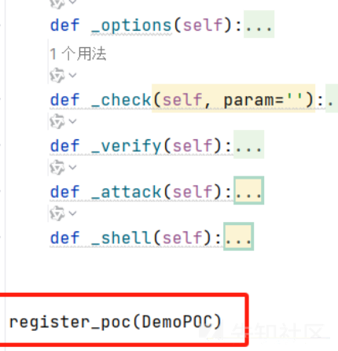
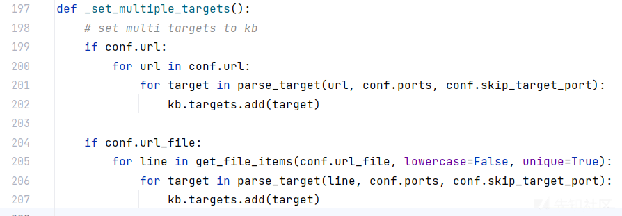
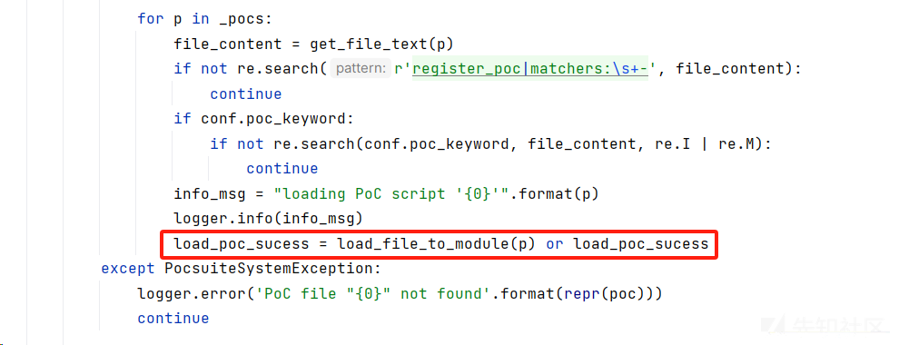

pocsuite3部分源码浅析

- - -

# pocsuite3部分源码浅析

## 目录

-   [目录结构](#%E7%9B%AE%E5%BD%95%E7%BB%93%E6%9E%84)
-   [poc模板](#poc%E6%A8%A1%E6%9D%BF)
-   [参数存储](#%E5%8F%82%E6%95%B0%E5%AD%98%E5%82%A8)
-   [命令行参数获取](#%E5%91%BD%E4%BB%A4%E8%A1%8C%E5%8F%82%E6%95%B0%E8%8E%B7%E5%8F%96)
-   [系统初始化](#%E7%B3%BB%E7%BB%9F%E5%88%9D%E5%A7%8B%E5%8C%96)
    -   [初始化系统参数](#%E5%88%9D%E5%A7%8B%E5%8C%96%E7%B3%BB%E7%BB%9F%E5%8F%82%E6%95%B0)
    -   [参数格式化与合法检测](#%E5%8F%82%E6%95%B0%E6%A0%BC%E5%BC%8F%E5%8C%96%E4%B8%8E%E5%90%88%E6%B3%95%E6%A3%80%E6%B5%8B)
    -   [读取目标](#%E8%AF%BB%E5%8F%96%E7%9B%AE%E6%A0%87)
    -   [动态加载PoC](#%E5%8A%A8%E6%80%81%E5%8A%A0%E8%BD%BDPoC)
    -   [动态加载插件](#%E5%8A%A8%E6%80%81%E5%8A%A0%E8%BD%BD%E6%8F%92%E4%BB%B6)
    -   [多线程初始化](#%E5%A4%9A%E7%BA%BF%E7%A8%8B%E5%88%9D%E5%A7%8B%E5%8C%96)
    -   [输出插件初始化](#%E8%BE%93%E5%87%BA%E6%8F%92%E4%BB%B6%E5%88%9D%E5%A7%8B%E5%8C%96)
-   [多线程模型](#%E5%A4%9A%E7%BA%BF%E7%A8%8B%E6%A8%A1%E5%9E%8B)
-   [输出处理](#%E8%BE%93%E5%87%BA%E5%A4%84%E7%90%86)

最近看了一下Pocsuite3的源码，跟着部分功能读了一遍，在这里记录一下

Pocsuite3 采用 Python3 编写，支持验证，利用及 shell 三种模式

验证：只验证漏洞是否存在，不进行攻击性行为

利用：上传木马文件获取权限

shell：与目标建立shell连接

用一个例子来介绍Pocsuite3的核心技术框架与细节  
`python cli.py -f "ip.txt" -r "pocs" -o "output.txt" ip.txt`中存储的是web程序的IP地址  
`pocs`目录中存储的PoC脚本文件  
`output.txt`是将验证结果输出的文件  
`-f`是指读取ip.txt中的IP地址  
`-r`是指加载pocs目录下的poc文件  
`-o`是将结果输出到output.txt  
这行命令要做的事情是获取`ip.txt`中的IP地址，使用`pocs`目录下的poc文件进行验证，最后将结果输出到`output.txt`

# 目录结构

[](https://xzfile.aliyuncs.com/media/upload/picture/20240104200230-22c12896-aaf9-1.png)

```plain
api：存放__init__.py，对要导入的包重命名，方便后续导入调用
data：存储用户需要使用数据，比如弱口令文件等等
lib：存储Pocsuite3的具体实现，包括获取目标IP，加载PoC文件，以及多线程验证等核心代码
modules：存储用户自定义的模块
plugins：存储用户自定义的插件
pocs：存储PoC文件，这里在pocs文件夹中给了3个poc文件用于测试
shellcodes：存储生成php，java，python等脚本语言的利用代码，以及反弹shell利用代码
cli.py：项目的入口文件
console.py：命令行界面
```

在命令行输入`python cli.py -h`可以获取使用帮助

我在读的时候把它分成了这几个部分

[](https://xzfile.aliyuncs.com/media/upload/picture/20240104200230-22ec0e76-aaf9-1.png)

首先是独立出来的PoC模板，用于统一PoC脚本格式。其次是输入，包括参数存储与命令行参数解析。然后是主程序，包括系统初始化和多线程运行PoC脚本。最后是输出，只有输出处理一部分用于输出格式化

首先介绍poc模板

# poc模板

`python cli.py -n` 生成模板，模板文件20231221\_testpoc.py

[](https://xzfile.aliyuncs.com/media/upload/picture/20240104200230-2319b97a-aaf9-1.png)

下面来看一下这个文件

模板文件定义了`DemoPOC`类，这个类是基于`POCBase`的，类的属性就是输入的内容

[](https://xzfile.aliyuncs.com/media/upload/picture/20240104200231-23444bd6-aaf9-1.png)

然后定义了五个方法，用于用户完成具体的PoC逻辑，最后`register_poc(DemoPOC)`注册PoC，实现动态加载

[](https://xzfile.aliyuncs.com/media/upload/picture/20240104200231-236779e4-aaf9-1.png)

从第一行就可以看到所有poc都是基于`POCBase`

`POCBase`在初始化时设置了一系列的属性，例如`目标URL`，`目标URL的协议`，`目标URL的端口``POCBase`还定义了很多方法，不过最重要的是`execute()`和`_execute()`

[](https://xzfile.aliyuncs.com/media/upload/picture/20240104200231-2394a70c-aaf9-1.png)

下面介绍execute()函数

[](https://xzfile.aliyuncs.com/media/upload/picture/20240104200231-23b467c2-aaf9-1.png)

`execute`中调用`build_url()`使用`urlparse`解析target，获取target的端口，以及对应的协议  
之后调用`_execute()`来执行不同模式的攻击，默认是`_verify()`，验证模式

[](https://xzfile.aliyuncs.com/media/upload/picture/20240104200232-23e74e62-aaf9-1.png)

[](https://xzfile.aliyuncs.com/media/upload/picture/20240104200232-240e7a8c-aaf9-1.png)

以thinkphp\_rce.py为例

先调用`_check()`，然后获取URL和POST数据，`parse_output`是将输出格式化为json格式

[](https://xzfile.aliyuncs.com/media/upload/picture/20240104200232-242f6aa8-aaf9-1.png)

[](https://xzfile.aliyuncs.com/media/upload/picture/20240104200232-245258f6-aaf9-1.png)

模拟HTTP请求，向目标地址的URL发生攻击payload，通过执行系统的echo语句输出关键词判断是否执行命令

[](https://xzfile.aliyuncs.com/media/upload/picture/20240104200233-247e2666-aaf9-1.png)

然后介绍参数存储部分

# 参数存储

在`\lib\core\data.py`中定义了贯穿整个系统的五个变量

`AttribDict()`是一种类似于字典的数据结构，但其中的数据不重复

[](https://xzfile.aliyuncs.com/media/upload/picture/20240104200233-24a4b862-aaf9-1.png)

```plain
conf：存储基本配置信息，后续涉及到的配置信息
kb：存储存储多线程运行PoC的配置信息，包括目标地址、加载的PoC、运行模式、输出结果、加载的PoC文件地址、多线程信息
cmd_line_options：是存储命令行输入的参数值
merged_options：存储输入值与默认值合并后的结果
paths：存储数据、插件、poc目录地址，还有临时目录、输出目录
```

`lib\core\settings.py`中也会存储一些配置信息，例如banner信息，正则表达式，命令行解析白名单等

[](https://xzfile.aliyuncs.com/media/upload/picture/20240104200233-24dc3bac-aaf9-1.png)

下面介绍输入命令后 pocsuite3解析的过程

# 命令行参数获取

在执行`python cli.py -f "ip.txt" -r "pocs" -o "output.txt"`后，会进入cli.py的main函数

[](https://xzfile.aliyuncs.com/media/upload/picture/20240104200233-25070774-aaf9-1.png)

[](https://xzfile.aliyuncs.com/media/upload/picture/20240104200234-25347696-aaf9-1.png)

```plain
module_path()返回当前工作目录
check_environment()检查当前工作目录是否符合当前系统
set_paths()设置数据、插件、poc目录、临时目录、输出目录等，这些值是存储在paths变量中的
banner()在命令行打印banner信息
```

paths变量存储了pocsuite3的目录、插件目录、poc目录、用户目录等等，意味着加载PoC和插件时会自动从相应目录加载，可以不指定

[](https://xzfile.aliyuncs.com/media/upload/picture/20240104200234-255e293c-aaf9-1.png)

下面介绍具体的输入参数解析过程

由`cmd_line_parser()`函数实现对命令行参数的分组解析，以及定义`DIY_OPTIONS`全局变量以列表形式存储不在默认参数中的参数

[](https://xzfile.aliyuncs.com/media/upload/picture/20240104200234-258d90f0-aaf9-1.png)

`cmd_line_parser()`函数如图所示

[](https://xzfile.aliyuncs.com/media/upload/picture/20240104200235-25b9dd18-aaf9-1.png)

[](https://xzfile.aliyuncs.com/media/upload/picture/20240104200235-25decec0-aaf9-1.png)

```plain
argparse库的ArgumentParser创建解析器对象
add_argument()  添加一个新的命令行选项
add_argument_group()  给参数分组
parse_args()  根据add_argument()增加的选项自动解析命令行输入
```

在`add_argument()`方法中，添加一个新的命令行选项，`dest`指定了解析后的参数应该存储在哪个属性中，`action="store_true"`指定了当这个选项存在时，对应的变量 (`show_version`) 将被设置为 True，`nargs='+'`代表多个参数以列表形式存储，没有输入的参数就会设置为默认值，一般是False或None

例如输入的命令是`python cli.py -f "ip.txt" -r "pocs" -o "output.txt"`，经过解析返回变量args

```plain
args.url_file -> ip.txt
args.poc -> ["pocs"]
args.output_path -> output.txt
```

接下来介绍主程序的系统初始化部分

# 系统初始化

系统初始化部分可以细分成多个部分

[](https://xzfile.aliyuncs.com/media/upload/picture/20240104200235-2605d290-aaf9-1.png)

## 初始化系统参数

它的功能根据输入的命令，对之前提到的conf、kb、merged\_options等全局变量初始化

在`init_options()`中实现

[](https://xzfile.aliyuncs.com/media/upload/picture/20240104200235-2623cf02-aaf9-1.png)

输入形参`input_options`是`cmd_line_parser()`返回结果的字典化

[](https://xzfile.aliyuncs.com/media/upload/picture/20240104200236-2647e5e0-aaf9-1.png)

`cmd_line_options`是之前提到的参数存储中用于存储命令行输入的参数的变量，通过字典的`update`方法将命令行输入存储到`cmd_line_options`，其内容如图

[](https://xzfile.aliyuncs.com/media/upload/picture/20240104200236-266dfe6a-aaf9-1.png)

然后使用`_set_conf_attributes()`对conf变量的初始化，默认模式的verify，默认端口为空，默认url也为空

[](https://xzfile.aliyuncs.com/media/upload/picture/20240104200236-2694b65e-aaf9-1.png)

conf如图所示，conf存储的都是默认值，cmd\_line\_options中存储的值是具体的，输入的值

[](https://xzfile.aliyuncs.com/media/upload/picture/20240104200236-26be2836-aaf9-1.png)

`_set_poc_options(input_options)`设置`DIY_OPTIONS`，取出命令行输入的参数中不在白名单解析列表的参数

`DIY_OPTIONS`是`cmd_line_parser()`函数定义的全局变量，用来存储不在默认配置中的参数

[](https://xzfile.aliyuncs.com/media/upload/picture/20240104200237-26daf858-aaf9-1.png)

然后是`kb`的初始化，存储多线程验证poc相关的参数，在`_set_kb_attributes()`中初始化kb

例如默认的IP列表是空，注册的PoC是空，多线程任务队列也是空

[](https://xzfile.aliyuncs.com/media/upload/picture/20240104200237-270120a0-aaf9-1.png)

`kb`如图所示

[](https://xzfile.aliyuncs.com/media/upload/picture/20240104200237-2727339e-aaf9-1.png)

最后是`merged_options`初始化，它用于存储合并后的选项。`_merge_options()`用命令行输入的参数值覆盖`conf`对应的参数值，最后将`conf`赋值给`merged_options`，这时`conf`也是合并后的，conf与merged\_options内容是相同的

[](https://xzfile.aliyuncs.com/media/upload/picture/20240104200237-274bdc9e-aaf9-1.png)

接着是其他的功能，这6个功能与`init()`中的这6个函数一一对应

[](https://xzfile.aliyuncs.com/media/upload/picture/20240104200238-276e0a44-aaf9-1.png)

[](https://xzfile.aliyuncs.com/media/upload/picture/20240104200238-278f70d0-aaf9-1.png)

## 参数格式化与合法检测

用`_cleanup_options()`实现，用于格式化conf中的参数值并检查参数值是否合法

先是对请求头的参数格式化，将user-agent的CRLF替换为空，将cookie转为字典存储  
然后设置两个线程之间的请求间隔、请求超时时间，还有将输入的URL转为列表形式、以上我们的案例中都没有输入，所以会跳过  
将输入poc转为列表形式，但是我们输入的在解析时已经转为列表形式了，之后判断输入的IP地址文件也就是ip.txt是否存在且可读  
之后将输入插件转为列表形式，但是我们没输入，这里是预留的，如果用户写了插件就可以在这里把路径存储到conf中  
最后是判断是否需要输出，需要注意的是我们使用的命令是有输出的，所以这里会在在`conf.plugins`中加入`['file_record']`，`file_record`是它内置的输出插件

[](https://xzfile.aliyuncs.com/media/upload/picture/20240104200238-27b95558-aaf9-1.png)

[](https://xzfile.aliyuncs.com/media/upload/picture/20240104200238-27e9fd70-aaf9-1.png)

格式化与校验后的`conf`变量

[](https://xzfile.aliyuncs.com/media/upload/picture/20240104200239-28186340-aaf9-1.png)

## 读取目标

用`_set_multiple_targets()`实现，来获取目标并存到`kb`

读取目标是指从`ip.txt`中获取所有的IP地址

`conf.ports`默认为空列表，`conf.skip_target_port`默认为`Fasle`

例子对应`conf.url_file`的处理逻辑

`get_file_items`是读取`ip.txt`内容，不读取不读取`#`开头的行，然后把每行添加到列表中，最后返回该列表，返回内容是`['192.168.45.128/24','127.0.0.1']`

之后使用`parse_target`解析

[](https://xzfile.aliyuncs.com/media/upload/picture/20240104200239-283c4d46-aaf9-1.png)

首先是CIDR地址，也就是带子网掩码的，使用`ipaddress.ip_network`转为IP地址

[](https://xzfile.aliyuncs.com/media/upload/picture/20240104200239-285b2e8c-aaf9-1.png)

然后是带域名的地址，用`urllib.parse.urlparse`解析，并且去掉`tcp://`，如果遇到`http://`就不会删去

[](https://xzfile.aliyuncs.com/media/upload/picture/20240104200239-28845e7e-aaf9-1.png)

最后把每个目标IP加入到`kb.targets`，后续访问`kb.targets`就可以获取目标IP

[](https://xzfile.aliyuncs.com/media/upload/picture/20240104200240-28aa21b8-aaf9-1.png)

## 动态加载PoC

这部分是从pocs文件夹中将poc脚本以模块的形式加载到系统中，在`_set_pocs_modules()`实现

前面一部分的代码功能主要是判断`conf.poc`是文件还是目录

-   文件：拼接绝对路径，加入`_pocs`列表
-   目录：读取目录所有文件名，并拼接出绝对路径，加入\_pocs列表

最后`load_file_to_module`加载`_pocs`列表中的poc路径

[](https://xzfile.aliyuncs.com/media/upload/picture/20240104200240-28d1c470-aaf9-1.png)

可以看到`load_file_to_module`是整个动态加载的核心

[](https://xzfile.aliyuncs.com/media/upload/picture/20240104200240-28fb04ca-aaf9-1.png)

先统一`module_name`为前缀均为`pocs_`且不带后缀名，例如`pocs_thinkphp_rce`、`pocs_thinkphp_rce2`、`pocs_ecshop_rce`

-   `importlib.util.spec_from_file_location`：创建模块规范，告诉系统要加载`file_path`(目标路径，比如`pocs/thinkphp_rce.py`这个文件)为一个模块，命名为`module_name`（例如`pocs_thinkphp_rce`），并用自定义的`PocLoader`作为加载器
-   `importlib.util.module_from_spec`：创建模块对象
-   `spec.loader.exec_module`：使用`PocLoader`的`exec_module()`函数加载模块

这里相当于要用`PocLoader`的`exec_module`方法加载`file_path`为`module_name`

然后要看`PocLoader`的`exec_module`方法

[](https://xzfile.aliyuncs.com/media/upload/picture/20240104200240-2920c7f0-aaf9-1.png)

`filename`是poc的绝对路径，`poc_code`是poc文件的内容

`check_requires`会获取加载的poc信息检查导入的模块，通过`__import__`函数依次导入，如果导入不成功的会提示需要安装哪个模块

最后`compile`对`poc_code`（`thinkphp_rce.py`的文件内容）进行编译，得到字节码，下次再执行poc时可以不用再转为字节码，加快系统运行速度，`exec`执行`compile`得到的字节码

这里相当于直接执行`poc_code`（`thinkphp_rce.py`的文件内容）

`poc_code`中除了`DemoPOC`定义外，都会有`register_poc`函数，然后就要介绍该函数了

[](https://xzfile.aliyuncs.com/media/upload/picture/20240104200241-2956105e-aaf9-1.png)

由于使用`spec.loader.exec_module`动态加载，所以这里的`module`就是之前的`module_name`，例如`pocs_thinkphp_rce`，之后生成`DemoPOC`的实例化对象，也就是`thinkphp_rce`的poc类，存储在`kb.registered_pocs['pocs_thinkphp_rce']`中

`kb.registered_pocs`如图

[](https://xzfile.aliyuncs.com/media/upload/picture/20240104200241-29754d98-aaf9-1.png)

## 动态加载插件

这个过程与动态加载PoC类似，在`_set_plugins()`实现

由于指定了`-o`参数，`_cleanup_options()`中会在`conf.plugins`中加入`['file_record']`

`_set_plugins()`先在plugins目录中匹配`conf.plugins`中的插件名，然后使用`load_file_to_module`去加载，这里的逻辑与动态加载poc是相同的

[](https://xzfile.aliyuncs.com/media/upload/picture/20240104200241-299f66b4-aaf9-1.png)

模块名`pocs_file_record`，路径是`plugins/file_record.py`，加载器是`PocLoader`，然后用`exec_module()`加载，不同的是PoC文件使用`register_poc()`注册，插件文件使用`register_plugin()`注册

[](https://xzfile.aliyuncs.com/media/upload/picture/20240104200242-29d4285e-aaf9-1.png)

`register_plugin()`用`kb.plugins['results']['pocs_file_record']`存储输出的插件对象

[](https://xzfile.aliyuncs.com/media/upload/picture/20240104200242-29f7449c-aaf9-1.png)

这里把插件分为三类，获取目标的插件、获取poc的插件、和输出插件

[](https://xzfile.aliyuncs.com/media/upload/picture/20240104200242-2a12a20a-aaf9-1.png)

后续在输出时使用`kb.plugins['results']['pocs_file_record']`就可以访问到输出的插件对象

## 多线程初始化

`_set_task_queue()`初始化多线程设置，将目标IP与poc的模块名一一组合

`kb.task_queue`是python中的`Queue`，它可以确保数据在多个线程之间安全地传递

[](https://xzfile.aliyuncs.com/media/upload/picture/20240104200242-2a3e3000-aaf9-1.png)

[](https://xzfile.aliyuncs.com/media/upload/picture/20240104200242-2a62912a-aaf9-1.png)

输出插件初始化

`_init_results_plugins()`初始化输出插件，在`_set_plugins()`中指定了`kb.plugins.results`是`'pocs_file_record'`

这里相当于执行`FileRecord`的初始化函数，功能是追加写模式打开`output.txt`

[](https://xzfile.aliyuncs.com/media/upload/picture/20240104200243-2a94336a-aaf9-1.png)

# 多线程模型

在`start()`中使用`run_threads()`建立多线程模型，多线程执行的函数是`task_run()`

[](https://xzfile.aliyuncs.com/media/upload/picture/20240104200243-2ab91388-aaf9-1.png)

> 这里总共765个任务，默认的线程数量是150，线程数量会选择任务数量与线程数之间最小的

`run_threads()`核心部分

[](https://xzfile.aliyuncs.com/media/upload/picture/20240104200243-2adfae26-aaf9-1.png)

这里的思想是启动多个线程来共同消费一个队列，有点像生产者消费者模型

```plain
消费者：run_threads()用多线程执行task_run函数，
生产者：_set_task_queue()中把目标IP和PoC模块加入队列
```

然后创建150个线程执行`task_run`函数，用`thread.setDaemon(True)`将线程设置为守护线程，这意味着当主线程结束时，守护线程也会被自动终止，最后检查所有线程是否都已完成

`task_run`函数核心代码

[](https://xzfile.aliyuncs.com/media/upload/picture/20240104200243-2afc8f50-aaf9-1.png)

这里的`target`和`poc_module`通过访问`kb.task_queue`获得的。功能是执行PoC文件的execute()函数，来间接使用payload验证。系统会建立150个线程，从队列中获取目标IP和对应的PoC文件，然后执行PoC脚本中的`verify`函数验证

# 输出处理

输出处理由`task_run()`中的`result_plugins_handle()`和`start()`中的`task_done()`进行

task\_run()中的result\_plugins\_handle()会执行file\_record.py中的handle()

[](https://xzfile.aliyuncs.com/media/upload/picture/20240104200244-2b31b3ec-aaf9-1.png)

file\_record.py中的handle()将验证结果以json格式写入output.txt

[](https://xzfile.aliyuncs.com/media/upload/picture/20240104200244-2b563a5a-aaf9-1.png)

[](https://xzfile.aliyuncs.com/media/upload/picture/20240104200244-2b740e5e-aaf9-1.png)

`start()`中的`task_done()`由三个函数组成

[](https://xzfile.aliyuncs.com/media/upload/picture/20240104200244-2b907ed6-aaf9-1.png)

首先是`show_task_result`函数，会把poc执行后的结果取出，然后格式化输出一下，例如总共尝试攻击多少网站，打成功几个

[](https://xzfile.aliyuncs.com/media/upload/picture/20240104200245-2bb79070-aaf9-1.png)

`result_plugins_start()`会会执行`file_record.py`中的`start()`，关闭文件并命令行输出文件保存地址

[](https://xzfile.aliyuncs.com/media/upload/picture/20240104200245-2be0dc28-aaf9-1.png)

最后是`result_compare_handle()`，显示来自各种搜索引擎的比较数据

[](https://xzfile.aliyuncs.com/media/upload/picture/20240104200245-2c02cfae-aaf9-1.png)
