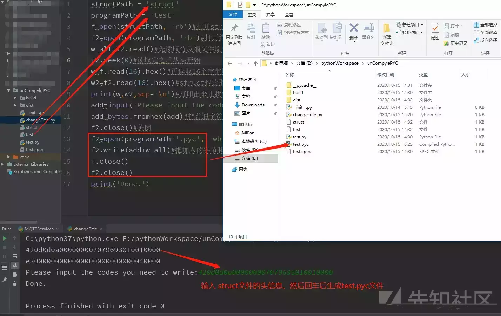

# python代码保护及破解技术(上) - 先知社区

python代码保护及破解技术(上)

- - -

# python代码保护(上)

> 前面关于pyc文件格式的介绍较为啰嗦，可以直接移至[.pyc加密](#1)开始阅读
> 
> Python 是一种面向对象的解释型计算机程序设计语言，Python 语言写的程序**不需要编译成二进制代码**，可以直接从源代码运行程序。 在计算机内部，**Python解释器把源代码转换成称为字节的中间形式**，然后再它翻译计算机使用的机器语言并运行。这使得Python更加简单 ，也使得Python程序更加易于移植。

Python 代码的执行过程和 Java 类似：

> Python解释器在执行任何一个Python程序文件时，首先进行的动作都是先对文件中的Python源代码进行编译，编译的主要结果是产生一组Python的byte code（字节码），然后将编译的结果交给Python的虚拟机（Virtual Machine），由虚拟机按照顺序一条一条地执行字节码，从而完成对Python程序的执行动作。

1.  将`.py`文件编译得到 Python 的字节码
2.  Python 虚拟机(Python Virtual Machine) 执行编译好的字节码

本文着重于**加密保护**，更详细的原理及过程请移至[这篇](https://developer.aliyun.com/article/599833)以及[这篇](https://www.iteye.com/topic/382423)

## pyc基础知识

`.pyc`文件介绍：

-   由 py 文件经过编译后生成的二进制字节码文件
-   一种跨平台的字节码，由python的虚拟机来执行
-   pyc文件的内容跟python版本有关，不同的python版本编译成不同的pyc文件，pyc只能在相同版本下运行

## pyc文件格式

#### **magic number + 源代码文件信息 + PyCodeObject**

-   4个字节的 magic number
-   12个字节的源代码文件信息（不同版本的 Python 包含的长度和信息都不一样，后面说）
-   序列化之后的 PyCodeObject

#### **magic number**

像大多数的文件格式一样，pyc 文件开头也有一个 magic number，不过不一样的是 pyc 文件的 magic number 并不固定，而是不同版本的 Python 生成的 pyc 文件的 magic number 都不相同。这里可以看到看不同版本的 Python 的 magic number 是多少。前两个字节以小端的形式写入，然后加上 \\r\\n 形成了四个字节的 pyc 文件的magic number

如 Python2.7 的 magic number 为 MAGIC\_NUMBER = (62211).to\_bytes(2, 'little') + b'\\r\\n'

我们可以看到的前四个字节的16进制形式为 03f3 0d0a

[](https://xzfile.aliyuncs.com/media/upload/picture/20231124095555-9aad383e-8a6c-1.png)

python 2.7生成的 pyc 文件前32个字节

#### **源代码文件信息**

源代码文件信息在 Python 不同的版本之后差别较大

-   在Python2的时候，这部分只有4个字节，为源代码文件的修改时间的 Unix timestamp（精确到秒）以小端法写入，如上图 (1586087865).to\_bytes(4, 'little').hex() -> b9c7 895e。
-   在 Python 3.5 之前的版本已经找不到了（后面就都从 Python 3.5 开始讨论了）
-   Python 3.5 和 3.6 相对于 Python 2，源代码文件信息这部分，在时间后面增加了4个字节的源代码文件的大小，单位字节，以小端法写入。如源码文件大小为87个字节，那么文件信息部分就写入 5700 0000。加上前面的修改时间，就是 b9c7 895e 5700 0000

[](https://xzfile.aliyuncs.com/media/upload/picture/20231124095555-9b0c1c46-8a6c-1.png)

python 3.6生成的 pyc 文件前32个字节

-   从 Python3.7 开始支持 hash-based pyc 文件

​ 也是就说，Python 不仅支持校验 timestrap 来判断文件是否修改过了，也支持校验 hash 值。Python 为了支持 hash 校验又使源代码文件信息这部分增加了4个字节，变为一共12个字节。

[](https://xzfile.aliyuncs.com/media/upload/picture/20231124095556-9b527ede-8a6c-1.png)

python 3.7生成的 pyc 文件前32个字节

-   但是这个 hash 校验默认是不启用的（可以通过调用 py\_compile 模块的 compile 函数时传入参数invalidation\_mode=PycInvalidationMode.CHECKED\_HASH 启用）。不启用时前4个字节为0000 0000，后8个字节为3.6和3.7版本一样的源码文件的修改时间和大小；当启用时前4个字节变为0100 0000或者0300 0000，后8个字节为源码文件的 hash 值。

#### **PyCodeObject**

其实这是一个定义在 Python 源码 Include/code.h 中的结构体，结构体中的数据通过 Python 的 marshal 模块序列化之后存到了 pyc文件当中。（不同版本之间 PyCodeObject 的内容是不一样的，但是这就导致了不同版本之间的 Python 产生的 pyc 文件其实并不完全通用

更详细部分请参考[此篇](https://zhuanlan.zhihu.com/p/145811103)

-   [pyc详细文件结构参考](https://zhuanlan.zhihu.com/p/617737294)

[](https://xzfile.aliyuncs.com/media/upload/picture/20231124095556-9b98b944-8a6c-1.png)

## `.pyc`加密

通过以上介绍，可以得知pyc是python编译后，由虚拟机产生的产物。  
pyc的初衷不是为了反编译，只是因为虚拟机加载的特性，所以pyc带了一点混淆的功能，基本不能算是保护，极其容易被破解。

### 编译

1.命令行，单个文件编译(console)

进入要编译文件的所在目录

```plain
python -m py_compile file.py
```

会在同目录下生成`_pycache_`文件夹，编译生成的pyc文件在文件夹里面

2.单个编译(pycharm)

右键复制`.py`文件路径写入下面括号即可

[](https://xzfile.aliyuncs.com/media/upload/picture/20231124095557-9bdf73b6-8a6c-1.png)

```plain
import py_compile
py_compile.compile('/path/to/foo.py')      #指明是哪个文件
```

3.批量编译(pycharm)(推荐使用)

编译文件目录下的所有`.py`文件，在pycharm中输入以下两行就可

```plain
import compileall
compileall.compile_dir(r'/path')      #path为要编译的目录
```

### 反编译

#### 1.使用uncompyle6库

**`uncompyle6` 现仅适用于 Python 2.4 到 3.8 版本**

3.9及以上版本使用pycdc 参考[https://blog.csdn.net/qq\_63585949/article/details/127080253](https://blog.csdn.net/qq_63585949/article/details/127080253)

安装

```plain
pip install uncompyle6
```

使用也非常简单，在命令行中，`uncompyle6`加上需要反编译的文件参数即可，注意使用`-o` 选项输出到文件中

```plain
uncompyle6 -o test.py test.pyc
```

这会将`test.pyc`文件反编译，并输出到`test.py`文件中

**注：如果遇到错误，可能因为`pyc`文件生成时，头部的`magic number`被清理，需要另外补上，magic numbei表见文末。magic number此篇不详细介绍，更详细内容请移至笔者的[pyc文件头—Magic Number 详解](http://101.42.53.205/archives/296)**

#### 2.使用pycdc(推荐)

遇到高版本的pyc文件时，需要使用pycdc来反编译。

详细过程参考下面这篇。

reference：[https://blog.csdn.net/qq\_63585949/article/details/127080253](https://blog.csdn.net/qq_63585949/article/details/127080253)

## pyinstaller打包

**实际上是对上一步的更进一步**

pyinstaller的原理：

把python解析器、脚本以及被打包脚本依赖的其他脚本（三方库）和需要的windows dll文件等等 **打包**成一个可执行的文件，这个文件可以不依赖python环境直接在wondows机器上执行起来。

### 打包

安装

```plain
pip install pyinstaller
```

在pycharm中，右键选择要打包的文件，打开于终端

[](https://xzfile.aliyuncs.com/media/upload/picture/20231124095557-9c1caab0-8a6c-1.png)

在终端输入

```plain
pyinstaller -F -w file.py     #文件名
```

打包成功输出'successfull'

[](https://xzfile.aliyuncs.com/media/upload/picture/20231124095557-9c5f0e1e-8a6c-1.png)

exe文件在在`.py`文件同目录下的dist文件中

[](https://xzfile.aliyuncs.com/media/upload/picture/20231124095558-9c96ef50-8a6c-1.png)

[](https://xzfile.aliyuncs.com/media/upload/picture/20231124095558-9cc00d04-8a6c-1.png)

因为笔者此代码为socket通信代码，双击后可以看到是成功运行的

[](https://xzfile.aliyuncs.com/media/upload/picture/20231124095559-9d0909f0-8a6c-1.png)

### 解包

分为解包、补全和反编译三个步骤

#### 1.解包

解包使用`pyinstaller.py`，解包的到的文件是不带magic number头部的，需要将pyc文件的magic number补全

(1).下载

下载拆包工具：pyinstxtractor.py：[https://sourceforge.net/projects/pyinstallerextractor/](https://sourceforge.net/projects/pyinstallerextractor/)

下载完成后是一个`.py`文件

[](https://xzfile.aliyuncs.com/media/upload/picture/20231124095559-9d3ac616-8a6c-1.png)

(2)使用

先将`pyinstxtractor.py`工具与我们要反编译的`.exe`文件放入同一个工作目录下，运行

```plain
python pyinstxtractor.py  filename.exe
```

[](https://xzfile.aliyuncs.com/media/upload/picture/20231124095559-9d77b58a-8a6c-1.png)

可以发现工作目录下多了一个名为`文件名.exe_extracted`的文件夹

[](https://xzfile.aliyuncs.com/media/upload/picture/20231124095600-9da8e3e4-8a6c-1.png)

-   进入该文件夹，里面有许许多多后缀为`.dll`和`.pyd`的文件，还有一个名为`PYZ-00.pyz_extracted`的文件夹，这个文件夹里放的是程序引入的**依赖库**，如果你引入过自己其他的`.py`文件，就可以用类似的方法将依赖的`.py`文件反编译出来。

**目录中有两个带`.pyc`后缀的文件，找到那个与你的`.exe`文件同名的文件，注意，是同名！**

[](https://xzfile.aliyuncs.com/media/upload/picture/20231124095600-9de5b04e-8a6c-1.png)

为它添加`.pyc`后缀并用Hex编辑器打开：

[](https://xzfile.aliyuncs.com/media/upload/picture/20231124095600-9e25a370-8a6c-1.png)

头部插入**magic number**

magic number在`struct`文件中

[](https://xzfile.aliyuncs.com/media/upload/picture/20231124095601-9e5d93de-8a6c-1.png)

[](https://xzfile.aliyuncs.com/media/upload/picture/20231124095601-9e9dd3a4-8a6c-1.png)

[](https://xzfile.aliyuncs.com/media/upload/picture/20231124095602-9ee2cd74-8a6c-1.png)

**注：magic头因python版本而不同**

修改完成后记得保存

另外一个方法就是使用python对二进制文件处理，增加头文件，笔者尚未验证是否可行

```plain
structPath = 'struct'
programPath = 'test'
f=open(structPath, 'rb')        #打开struct文件
f2=open(programPath, 'rb')      #打开待反编文件
w_all=f2.read()#先读取待反编文件原来的内容
f2.seek(0)#读取完之后从头开始
w=f.read(16).hex()#再读取16个字节用于比较
w2=f2.read(16).hex()        #struct也读取16个用于比较
print(w,w2,sep='\n')        #打印出来让我们看见
add=input('Please input the codes you need to write:')#然后问你要在开头写入什么
add=bytes.fromhex(add)      #把普通字符串转换为bytes格式，并不是encode，而是fromhex(),把字符串看成是十六进制编码
f2.close()#关闭
f2=open(programPath+'.pyc', 'wb')           #创建pyc待反编文件
f2.write(add+w_all)                         #把加入的字节和原来的字节合并写入文件
f.close()
f2.close()
print('Done.')
```

[](https://xzfile.aliyuncs.com/media/upload/picture/20231124095602-9f3f42c0-8a6c-1.webp)

#### 2.反编译

在目录下运行

```plain
uncompyle6 -o file.py file.pyc
```

[](https://xzfile.aliyuncs.com/media/upload/picture/20231124095603-9f887954-8a6c-1.png)

[](https://xzfile.aliyuncs.com/media/upload/picture/20231124095603-9fc2585e-8a6c-1.png)

得到了`.py`文件

打开即可看到正常内容。

**注：**

在实际逆向过程中，只会解包一个pyc文件，而源码调用的库文件还需要手动去重复如上步骤还原。

通过以上的学习，可以发现pyinstaller打包后的源码也极容易被还原出pyc文件，那么如何绕过这一过程呢？

## 源码混淆

**原理**

> 通过一系列的转换，让代码逐渐不让人那么容易明白。
> 
> 主要有以下几种手段：
> 
> 移除注释和文档。没有这些说明，在一些关键逻辑上就没那么容易明白了。  
> 改变缩进。完美的缩进看着才舒服，如果缩进忽长忽短，看着也一定闹心。  
> 在tokens中间加入一定空格。这就和改变缩进的效果差不多。  
> 重命名函数、类、变量。命名直接影响了可读性，乱七八糟的名字可是阅读理解的一大障碍。  
> 在空白行插入无效代码。

**方法**

oxyry在线网站进行混淆

[https://pyob.oxyry.com/!\[image-20230529085414865\](https://image-1311319331.cos.ap-beijing.myqcloud.com/image/202305290854012.png](https://pyob.oxyry.com/)

仅对源码进行了混淆，查看字节码还是能够看到代码逻辑，基本上不影响

## 小结1

综上所述，不经过处理，直接使用pyinstaller打包会将py文件编译为pyc文件存储在`_pycache_`文件夹中，然后将自己编写的pyc和引用到的第三方库打包到exe中。或者直接对源码进行混淆。

这两种方法都比较容易被破解。

## 防止逆向的可行方法

以上方法，无论如何都会产生pyc，所以思路为对**pyc文件进行混淆**或者**打包时绕过pyc文件(以其他文件形式代替pyc)**，得到更难反编译的其他文件形式。

### 1.字节码混淆！！

**混淆实现：**

在opcode中添加一句加载超过范围的变量指令，而后再添加一句跳转指令跳过，达成不影响执行而且能欺骗反编译工具的目的

具体实现方法笔者会在《python代码保护(下)》一文中介绍。

### 2.Cython加密

> 在python里，pyd格式即动态链接库，**pyinstaller打包时 优先级pyd > py**， pyd文件是由 Cython首先把python源码翻译成了 .c文件，这个过程基本**不可逆**，然后vs再把这个.c文件编译成了pyd文件。所以源码失踪了，只剩下汇编语言。
> 
> Cython是一个编程语言，它通过类似Python的语法来编写C扩展并可以被Python调用。能够将Python+C混合编码的.pyx脚本转换为C代码，主要用于优化Python脚本性能或Python调用C函数库。基于它的原理，我们可以得到一种代码加密的思路：将 .py/.pyx 编译为 .c 文件，再将 .c 文件编译为 .so(Unix) 或 .pyd(Windows)，这样得到的文件更难反编译。

此处请参考如下两文。

#### [方法](https://blog.csdn.net/weixin_41462821/article/details/118003897)

#### [参考](https://www.jianshu.com/p/036cbcd20776)

具体实现方法笔者会在《python代码保护(下)》一文中介绍。

### 3.成熟的解决方案：Pyarmor

**目前基本无法逆向破解**

#### [方法+参考](https://blog.csdn.net/weixin_43207777/article/details/108351862)

具体实现方法笔者会在《python代码保护(下)》一文中介绍。

## 其余方法(未验证)

### 镜像打包

[将一个简单的python程序打包成加密的docker镜像并对外提供接口](https://blog.csdn.net/uncle_yiba/article/details/80046157)

### pyminfier

github开源混淆器，对类名/函数名/变量名进行重新命名，甚至能够对部分Python常量进行扰乱。

[pyminifier](https://github.com/liftoff/pyminifier)

[](https://xzfile.aliyuncs.com/media/upload/picture/20231124095604-a00e411a-8a6c-1.png)

### pyc\_obscure

github开源混淆器

[pyc\_obscure](https://github.com/marryjianjian/pyc_obscure)

> 将垃圾数据插入 PyCodeObject 的 co\_code 以混淆像 uncompyle6 这样的反编译器

[](https://xzfile.aliyuncs.com/media/upload/picture/20231124095604-a05b8c36-8a6c-1.png)

## 附：pyc文件magic number查阅表

```plain
Known values:
  Python 1.5:   20121
#  Python 1.5.1: 20121
#     Python 1.5.2: 20121
#     Python 1.6:   50428
#     Python 2.0:   50823
#     Python 2.0.1: 50823
#     Python 2.1:   60202
#     Python 2.1.1: 60202
#     Python 2.1.2: 60202
#     Python 2.2:   60717
#     Python 2.3a0: 62011
#     Python 2.3a0: 62021
#     Python 2.3a0: 62011 (!)
#     Python 2.4a0: 62041
#     Python 2.4a3: 62051
#     Python 2.4b1: 62061
#     Python 2.5a0: 62071
#     Python 2.5a0: 62081 (ast-branch)
#     Python 2.5a0: 62091 (with)
#     Python 2.5a0: 62092 (changed WITH_CLEANUP opcode)
#     Python 2.5b3: 62101 (fix wrong code: for x, in ...)
#     Python 2.5b3: 62111 (fix wrong code: x += yield)
#     Python 2.5c1: 62121 (fix wrong lnotab with for loops and
#                          storing constants that should have been removed)
#     Python 2.5c2: 62131 (fix wrong code: for x, in ... in listcomp/genexp)
#     Python 2.6a0: 62151 (peephole optimizations and STORE_MAP opcode)
#     Python 2.6a1: 62161 (WITH_CLEANUP optimization)
#     Python 2.7a0: 62171 (optimize list comprehensions/change LIST_APPEND)
#     Python 2.7a0: 62181 (optimize conditional branches:
#                          introduce POP_JUMP_IF_FALSE and POP_JUMP_IF_TRUE)
#     Python 2.7a0  62191 (introduce SETUP_WITH)
#     Python 2.7a0  62201 (introduce BUILD_SET)
#     Python 2.7a0  62211 (introduce MAP_ADD and SET_ADD)
#     Python 3000:   3000
#                    3010 (removed UNARY_CONVERT)
#                    3020 (added BUILD_SET)
#                    3030 (added keyword-only parameters)
#                    3040 (added signature annotations)
#                    3050 (print becomes a function)
#                    3060 (PEP 3115 metaclass syntax)
#                    3061 (string literals become unicode)
#                    3071 (PEP 3109 raise changes)
#                    3081 (PEP 3137 make __file__ and __name__ unicode)
#                    3091 (kill str8 interning)
#                    3101 (merge from 2.6a0, see 62151)
#                    3103 (__file__ points to source file)
#     Python 3.0a4: 3111 (WITH_CLEANUP optimization).
#     Python 3.0b1: 3131 (lexical exception stacking, including POP_EXCEPT
                          #3021)
#     Python 3.1a1: 3141 (optimize list, set and dict comprehensions:
#                         change LIST_APPEND and SET_ADD, add MAP_ADD #2183)
#     Python 3.1a1: 3151 (optimize conditional branches:
#                         introduce POP_JUMP_IF_FALSE and POP_JUMP_IF_TRUE
                          #4715)
#     Python 3.2a1: 3160 (add SETUP_WITH #6101)
#                   tag: cpython-32
#     Python 3.2a2: 3170 (add DUP_TOP_TWO, remove DUP_TOPX and ROT_FOUR #9225)
#                   tag: cpython-32
#     Python 3.2a3  3180 (add DELETE_DEREF #4617)
#     Python 3.3a1  3190 (__class__ super closure changed)
#     Python 3.3a1  3200 (PEP 3155 __qualname__ added #13448)
#     Python 3.3a1  3210 (added size modulo 2**32 to the pyc header #13645)
#     Python 3.3a2  3220 (changed PEP 380 implementation #14230)
#     Python 3.3a4  3230 (revert changes to implicit __class__ closure #14857)
#     Python 3.4a1  3250 (evaluate positional default arguments before
#                        keyword-only defaults #16967)
#     Python 3.4a1  3260 (add LOAD_CLASSDEREF; allow locals of class to override
#                        free vars #17853)
#     Python 3.4a1  3270 (various tweaks to the __class__ closure #12370)
#     Python 3.4a1  3280 (remove implicit class argument)
#     Python 3.4a4  3290 (changes to __qualname__ computation #19301)
#     Python 3.4a4  3300 (more changes to __qualname__ computation #19301)
#     Python 3.4rc2 3310 (alter __qualname__ computation #20625)
#     Python 3.5a1  3320 (PEP 465: Matrix multiplication operator #21176)
#     Python 3.5b1  3330 (PEP 448: Additional Unpacking Generalizations #2292)
#     Python 3.5b2  3340 (fix dictionary display evaluation order #11205)
#     Python 3.5b3  3350 (add GET_YIELD_FROM_ITER opcode #24400)
#     Python 3.5.2  3351 (fix BUILD_MAP_UNPACK_WITH_CALL opcode #27286)
#     Python 3.6a0  3360 (add FORMAT_VALUE opcode #25483)
#     Python 3.6a1  3361 (lineno delta of code.co_lnotab becomes signed #26107)
#     Python 3.6a2  3370 (16 bit wordcode #26647)
#     Python 3.6a2  3371 (add BUILD_CONST_KEY_MAP opcode #27140)
#     Python 3.6a2  3372 (MAKE_FUNCTION simplification, remove MAKE_CLOSURE
#                         #27095)
#     Python 3.6b1  3373 (add BUILD_STRING opcode #27078)
#     Python 3.6b1  3375 (add SETUP_ANNOTATIONS and STORE_ANNOTATION opcodes
#                         #27985)
#     Python 3.6b1  3376 (simplify CALL_FUNCTIONs & BUILD_MAP_UNPACK_WITH_CALL
                          #27213)
#     Python 3.6b1  3377 (set __class__ cell from type.__new__ #23722)
#     Python 3.6b2  3378 (add BUILD_TUPLE_UNPACK_WITH_CALL #28257)
#     Python 3.6rc1 3379 (more thorough __class__ validation #23722)
#     Python 3.7a1  3390 (add LOAD_METHOD and CALL_METHOD opcodes #26110)
#     Python 3.7a2  3391 (update GET_AITER #31709)
#     Python 3.7a4  3392 (PEP 552: Deterministic pycs #31650)
#     Python 3.7b1  3393 (remove STORE_ANNOTATION opcode #32550)
#     Python 3.7b5  3394 (restored docstring as the first stmt in the body;
#                         this might affected the first line number #32911)
#     Python 3.8a1  3400 (move frame block handling to compiler #17611)
#     Python 3.8a1  3401 (add END_ASYNC_FOR #33041)
#     Python 3.8a1  3410 (PEP570 Python Positional-Only Parameters #36540)
#     Python 3.8b2  3411 (Reverse evaluation order of key: value in dict
#                         comprehensions #35224)
#     Python 3.8b2  3412 (Swap the position of positional args and positional
#                         only args in ast.arguments #37593)
#     Python 3.8b4  3413 (Fix "break" and "continue" in "finally" #37830)
```

## Reference

[https://www.jianshu.com/p/036cbcd20776](https://www.jianshu.com/p/036cbcd20776)

[https://blog.csdn.net/weixin\_43207777/article/details/108351862](https://blog.csdn.net/weixin_43207777/article/details/108351862)

[https://www.jianshu.com/p/036cbcd20776](https://www.jianshu.com/p/036cbcd20776)
