# python逆向总结 - 先知社区

python逆向总结

* * *

# python类逆向

## Python运行原理

Python是解释型语言，没有严格意义上的编译和汇编过程。但是一般可以认为编写好的python源文件，由python解释器翻译成以.pyc为结尾的字节码文件。pyc文件是二进制文件，可以由python虚拟机直接运行。

Python在执行import语句时，将会到已设定的path中寻找对应的模块。并且把对应的模块编译成相应的PyCodeObject中间结果，然后创建pyc文件，并将中间结果写入该文件。然后，Python会import这个pyc文件，实际上也就是将pyc文件中的PyCodeObject重新复制到内存中。而被直接运行的python代码一般不会生成pyc文件。

加载模块时，如果同时存在.py和.pyc，Python会尝试使用.pyc，如果.pyc的编译时间早于.py的修改时间，则重新编译.py并更新.pyc。  
[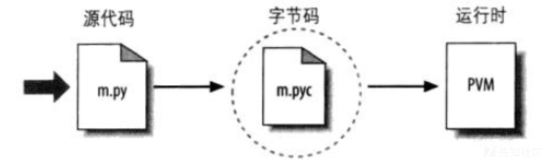](https://xzfile.aliyuncs.com/media/upload/picture/20230824211237-e5562876-427f-1.png)  
1.把原始代码编译成字节码

编译后的字节码是特定于Python的一种表现形式，它不是二进制的机器码，需要进一步编译才能被机器执行。如果Python进程在机器上拥有写入权限，那么它将把程序的字节码保存为一个以.pyc 为扩展名的文件，如果Python无法在机器上写入字节码，那么字节码将会在内存中生成并在程序结束时自动丢弃。

2.把编译好的字节码转发到Python虚拟机（PVM）中进行执行

PVM(Python Virtual Machine)是Python的运行引擎，是Python系统的一部分，它是迭代运行字节码指令的一个大循环、一个接一个地完成操作。

### Python分发的文件类型

#### python打包原理

Python代码的基本运行过程：

1.  Python.exe调用XX.py(源码)，解释并运行。
2.  Python.exe调用XX.pyc(字节码)，解释并运行。
3.  Python.exe调用XX.pyd(机器码)，调用运行。
4.  如果有依赖的库，根据上面三种情况调用运行。

##### PyInstaller

原理：分析脚本文件，递归找到所有依赖的模块。如果依赖模块有.pyd文件，即将其复制到disk目录。如果没有.pyd文件，则生成.pyc文件拷贝到disk目录，并压缩为.zip保存。制作一个exe，导入PythonXX.dll(解析器库)，并添加exe运行需要的相关运行时库。这就构成了一个不用安装Python的运行包。

如果要生成一个exe，则利用PE结构将整个包加载内存中再来运行。

##### Nuitka

Nuitka是一个Python编写的Python解释器，所以Nuitka可以作为Python的扩展库使用。Nuitka会将所有没有生成pyd的模块的.py代码转换成C代码，然后调用gcc/MSVC编译成.pyd。

#### .pyc

.pyc：python编译后的二进制文件，是.py文件经过编译产生的字节码，pyc文件是可以由python虚拟机直接执行的程序（PyCodeObject对象在硬盘上的保存形式）。

pyc文件**仅**在由另一个.py文件或模块导入时从.py文件创建（**import**）。触发 pyc 文件生成不仅可以通过 import，还可以通过 py\_compile 模块手动生成。

pyc文件会加快程序的**加载速度**，而不会加快程序的实际执行速度。

##### pyc文件格式

[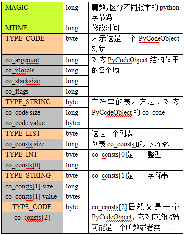](https://xzfile.aliyuncs.com/media/upload/picture/20230824211402-1834ca68-4280-1.png)  
pyc文件一般由3个部分组成:

1.  Magic num：标识此pyc的版本信息, 不同的版本的 Magic 都在 `Python/import.c` 内定义
2.  文件创建时间：UNIX时间戳（从1970.1.1开始计数秒数）
3.  序列化了的 PyCodeObject：此结构在 `Include/code.h` 内定义，序列化方法在 `Python/marshal.c` 内定义

Python在不同的版本，pyc的头部长度和内容是不同的：

PEP 3147：  
[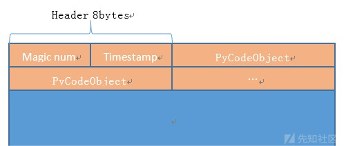](https://xzfile.aliyuncs.com/media/upload/picture/20230824211455-37c1232c-4280-1.png)  
包含两个32位大端数字，后面跟的序列化的PyCodeObject。32位数字表示一个Magic Num和Timestamp。每当Python改变字节码格式时，Magic Num会改变，例如，通过向其虚拟机添加新的字节码。这确保为以前版本的VM构建的pyc文件不会造成问题。Timestamp用于确保pyc文件与用于创建它的py文件匹配。当Magic Num或Timestamp不匹配时，将重新编译py文件并写入新的pyc文件。

PEP 552：  
[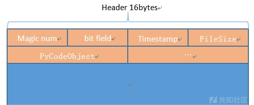](https://xzfile.aliyuncs.com/media/upload/picture/20230824212211-3ba42088-4281-1.png)  
pyc头文件目前由3个32位的字组成。我们将把它扩大到4个。第一个单词将继续是magic number，对字节码和pyc格式进行版本控制。第二个4byte新增加的字段，将是一个位字段(bit field)，对报头其余部分的解释和pyc的失效行为取决于位字段的内容。

如果位字段(bit field)为0，则pyc是传统的基于时间戳的pyc。即第三个和第四个4字节内容分别是时间戳和文件大小，通过比较源文件的元数据和头文件中的元数据来进行无效判断。

如果位字段的最低位被设置，则pyc是基于哈希的pyc。我们将第二个最低位称为check\_source标志。位字段之后是源文件的64位散列。我们将使用带有源文件内容硬编码密钥。

对于Magic值，它的逻辑为：后2bytes为0D0A，前面的值满足： \[min, max\]范围，版本信息定义参考结构内容，示例分析代码如下：

```plain
typedef struct {
    unsigned short min;
    unsigned short max;

    wchar_t version[MAX_VERSION_SIZE];
} PYC_MAGIC;

static PYC_MAGIC magic_values[] = {
    { 50823, 50823, L"2.0" },
    { 60202, 60202, L"2.1" },
    { 60717, 60717, L"2.2" },
    { 62011, 62021, L"2.3" },
    { 62041, 62061, L"2.4" },
    { 62071, 62131, L"2.5" },
    { 62151, 62161, L"2.6" },
    { 62171, 62211, L"2.7" },
    { 3000, 3131, L"3.0" },
    { 3141, 3151, L"3.1" },
    { 3160, 3180, L"3.2" },
    { 3190, 3230, L"3.3" },
    { 3250, 3310, L"3.4" },
    { 3320, 3351, L"3.5" },
    { 3360, 3379, L"3.6" },
    { 3390, 3399, L"3.7" },
    { 3400, 3419, L"3.8" },
    { 0 }
};
```

###### 序列化

**PyObject**：PyObject 如何序列化,哪些内容被参与了序列化, 参看 `Python/marshal.c` 内的函数 `w_object` 函数

**PyCodeObject**：

结构体 PyCodeObject 在 `Include/code.h` 中定义如下:

```plain
typedef struct {
    PyObject_HEAD
    int co_argcount; /* 位置参数个数 */
    int co_nlocals; /* 局部变量个数 */
    int co_stacksize; /* 栈大小 */
    int co_flags;
    PyObject *co_code; /* 字节码指令序列 */
    PyObject *co_consts; /* 所有常量集合 */
    PyObject *co_names; /* 所有符号名称集合 */
    PyObject *co_varnames; /* 局部变量名称集合 */
    PyObject *co_freevars; /* 闭包用的的变量名集合 */
    PyObject *co_cellvars; /* 内部嵌套函数引用的变量名集合 */
    /* The rest doesn’t count for hash/cmp */
    PyObject *co_filename; /* 代码所在文件名 */
    PyObject *co_name; /* 模块名|函数名|类名 */
    int co_firstlineno; /* 代码块在文件中的起始行号 */
{
```

在 Python 代码中,每个**作用域**(或者叫block或者名字空间)对应一个 PyCodeObject 对象, 所以会出现嵌套: 比如 一个 module 类 定义了 N 个 class, 每个 class 内又定义了 M 个方法. 每个 子作用域 对应的 PyCodeObject 会出现在它的 父作用域 对应的 PyCodeObject 的 co\_consts 字段里。

#### .pyo

pyo文件是源代码文件经过优化编译后生成的文件，是pyc文件的优化版本，由解释器在导入模块时创建。当我们调用Python解释器时，通过添加“-O”标志来启用优化器，生成.pyo文件。在Python3.5之后，不再使用.pyo文件名，而是生成文件名类似“test.opt-n.pyc的文件。

#### .pyd

.pyd文件类型是特定于Windows操作系统类平台的，是一个动态链接库，它包含一个或一组Python模块，由其他Python代码调用。要创建.pyd文件，需要创建一个名为example.pyd的模块。在这个模块中，需要创建一个名为PyInit\_example()的函数。当程序调用这个库时，它们需要调用import foo, PyInit\_example()函数将运行。

#### .pyz

executable python zip archives

具体内容参见下：ZlibArchive

### PyInstaller打包

PyInstaller中使用了两种存档。一个是ZlibArchive，它能高效地存储Python模块，并通过一些导入钩子直接导入。另一个是CArchive，类似于.zip文件，这是一种打包(或压缩)任意数据块的通用方法。

#### ZlibArchive

ZlibArchive包含压缩的.pyc或.pyo文件。spec文件中的PYZ类调用创建了一个ZlibArchive。

ZlibArchive中的目录是一个Python字典，它的Key(import语句中给定的成员名)与ZlibArchive中的查找位置和长度相关联。ZlibArchive的所有部分都以编组格式存储，因此与平台无关。

ZlibArchive在运行时用于导入绑定的python模块，即使使用最大压缩，也比正常导入快。  
[](https://xzfile.aliyuncs.com/media/upload/picture/20230824212544-ba903fc6-4281-1.png)

#### CArchive

CArchive很像一个.zip文件，可以包含任何类型的文件。可以python创建，也可以从C代码中解包。CArchive可以附加到另一个文件，比如ELF和COFF可执行文件，存档是在文件的末尾用它的目录创建的，后面只跟一个cookie，它告诉目录从哪里开始以及存档本身从哪里开始。CArchive可以嵌入到另一个CArchive中，内部存档可以在适当的地方打开使用，而不需要提取。

每个目录条目都有可变的长度。条目中的第一个字段给出了条目的长度。最后一个字段是相应打包文件的名称。名称以空内容结尾，每一个成员都可以进行压缩。还有一个与每个成员相关联的类型代码供程序使用。

Carchive结构  
[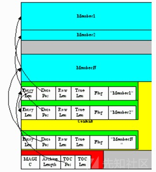](https://xzfile.aliyuncs.com/media/upload/picture/20230824212627-d446926c-4281-1.png)

自解压执行文件结构  
[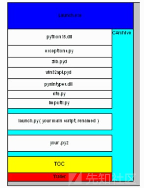](https://xzfile.aliyuncs.com/media/upload/picture/20230824212704-ea44fea0-4281-1.png)

## pyc反编译

_在cmd里输入`python pycname.pyc`即可让.pyc文件在相应的python版本环境下运行_

#### uncompyle6

Uncompyle6，是一个Python原生的跨版本反编译器，是decompyle, uncompyle, uncompyle2的后继版本。Uncompyle6能够将Python二进制文件pyc, pyo反编译为对应的源代码。支持 **Python 1.0-3.8** 版本的反编译，拥有较好的逻辑处理和解析能力。

**安装**：要在python3.8及之前的版本下载。要想不破坏我现有的3.11版本环境，需要搭建虚拟环境后安装。

虚拟环境安装详细过程见最后

**使用**：

在已经搭建好虚拟环境的前提下

```plain
.\py38\Scripts\activate
#进入虚拟环境

uncompyle6 -o test.py test.pyc
#将test.pyc文件反编译，并输出到test.py文件中
```

生成的文件会存放在C:\\Users\\admin目录下，剪切出来即可

[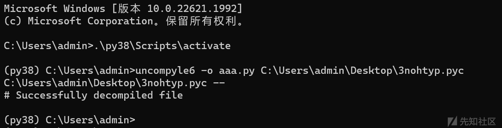](https://xzfile.aliyuncs.com/media/upload/picture/20230824212821-17f6d9cc-4282-1.png)

如果遇到错误，可能因为pyc文件生成时，头部的magic number被清理，需要另外补上

#### pycdc

pycdc 是一个用于 pyc 反编译的工具，适用于 **Python 3.9** 及更高版本。

在GitHub下载pycdc [https://github.com/zrax/pycdc](https://github.com/zrax/pycdc)

**Linux**下下载使用

```plain
apt-get install cmake
```

在下载目录下输入 `cmake CMakeLists.txt`，会在当前目录下生成 Makefile 文件，然后输入 `make` 即可进行编译安装

将文件和pycdc文件放在一个目录下

```plain
./pycdc 文件名.pyc
```

终端就会输出对应的 Python 源代码了

**Windows**下

下载安装cmake [Download | CMake](https://cmake.org/download/)

[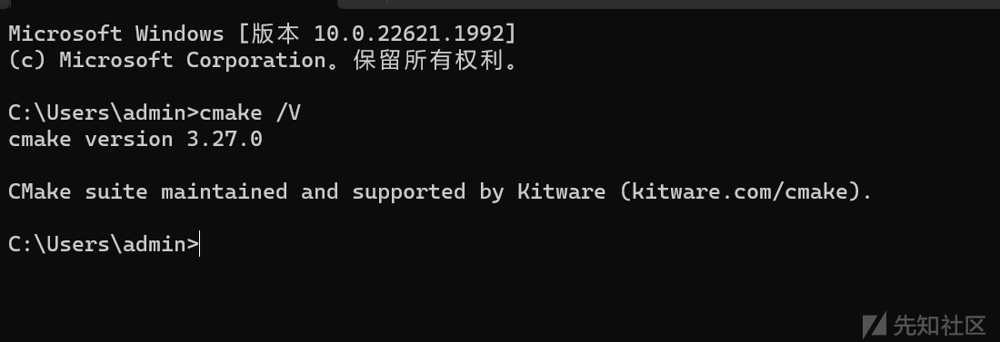](https://xzfile.aliyuncs.com/media/upload/picture/20230824212941-4808f6ae-4282-1.png)

之前make不了，在安装visual studio之后实验了一下

[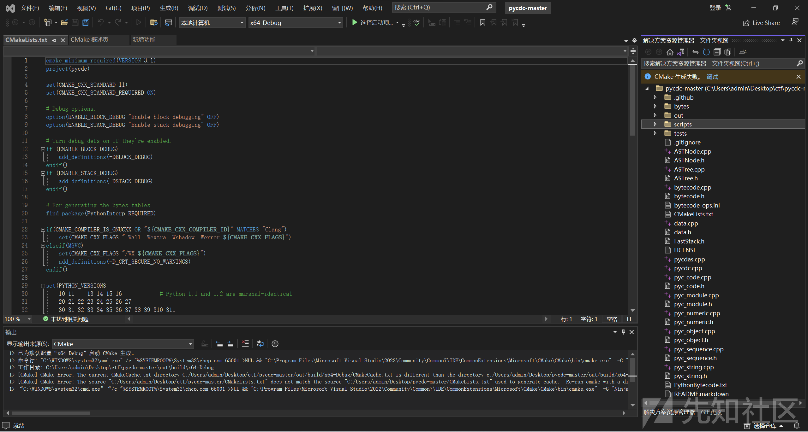](https://xzfile.aliyuncs.com/media/upload/picture/20230824213013-5b2d45a0-4282-1.png)

打开CMakeLists.txt点击运行即可

在文件夹内的路径是`"\pycdc-master\out\build\x64-Debug\pycdc.exe"`，使用的时候拷出来，与pyc文件放在同一路径下

```plain
./pycdc 文件名.pyc
```

[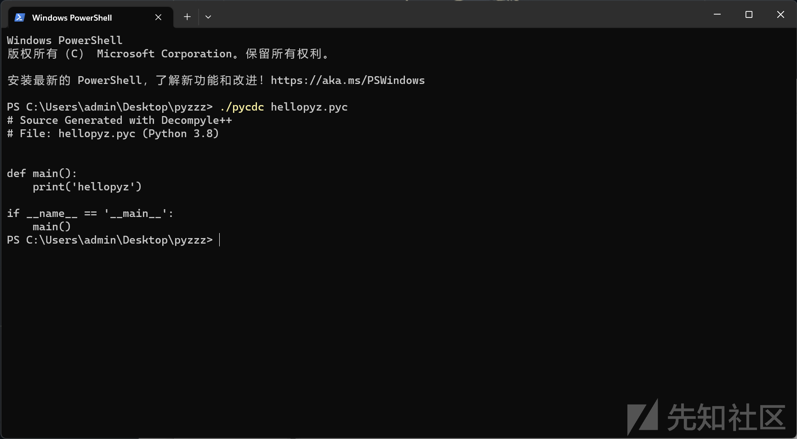](https://xzfile.aliyuncs.com/media/upload/picture/20230824213051-71d5663e-4282-1.png)

在线工具的内核也是pycdc [python反编译 - 在线工具 (tool.lu)](https://tool.lu/pyc/)

同时编译的pycdas.exe是显示python字节码的工具

使用方式与pycdc相同

[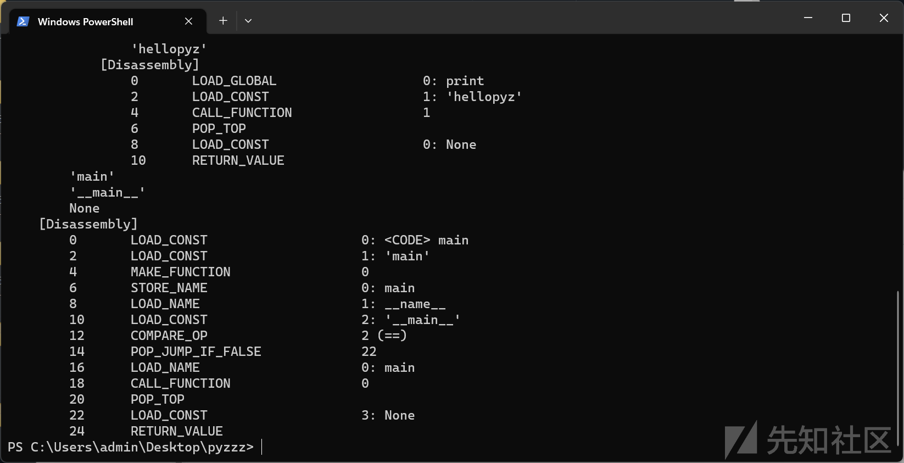](https://xzfile.aliyuncs.com/media/upload/picture/20230824213126-86baddcc-4282-1.png)

### 题目练习

#### \[watevrCTF 2019\]Repyc

pyc文件。反编译一下是乱码

[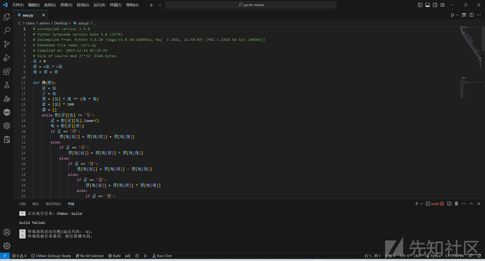](https://xzfile.aliyuncs.com/media/upload/picture/20230824213158-99d3833c-4282-1.png)

函数里都是if语句，还有±\*/&|这些操作，很像是一个VM，那么下面的函数调用的列表参数就是这个VM的代码。乱码可以进行替换操作

wp里修改好的

```plain
a = 0
b = 1
c = 2

def fun1 (arg):
    A= a
    M= [0, 0, 0, 0, 0, 0, 0, 0, 0, 0, 0, 0, 0, 0, 0, 0]
    C= [a] * 100
    K= []
    while arg[A][a] != '12':
        #print(M)
        opcode= arg[A][a].lower()
        opn = arg[A][b:]
        #print(opn)
        if opcode== '4':
            M [opn[a]] = M [opn[b]] + M[opn[c]]
        elif opcode== '3':
            M [opn[a]] = M [opn[b]] * M[opn[c]]
        elif opcode== '5':
            M [opn[a]] = M [opn[a]]
        elif opcode== '1':
            M[opn[a]] = opn[b]
        elif opcode== '11':
            M[opn[a]] = C[opn[b]]
        elif opcode== '6':
            M[opn[a]] = a
        elif opcode== '2':
            C[opn[a]] = input(M[opn[b]])
        elif opcode== '10':
            print(M[opn[a]])
        elif opcode== '9':
            M[7] = a
            for i in range(len(M[opn[a]])):
                print( M[opn[a]], M[opn[b]])
                if M[opn[a]] != M[opn[b]]:
                    M[7] = b
                    A= M[opn[c]]
                    K.append(A)

        elif opcode== '7':
            s= ''
            for i in range(len(M[opn[a]])):
                s+= chr(ord(M[opn[a]][i]) ^ M[opn[b]])
            print(s)
            M[opn[a]] = s
        elif opcode== '8':
            s= ''
            for i in range(len(M[opn[a]])):
                #print(M[opn[a]][i],M[opn[b]])
                s+= chr(ord(M[opn[a]][i]) - M[opn[b]])
            M[opn[a]] = s

        A+= b


fun1([
 [
  '1', 0, 'Authentication token: '],
 [
  '2', 0, 0],
 [
  '1', 6, 'á×äÓâæíäàßåÉÛãåäÉÖÓÉäàÓÉÖÓåäÉÓÚÕæïèäßÙÚÉÛÓäàÙÔÉÓâæÉàÓÚÕÓÒÙæäàÉäàßåÉßåÉäàÓÉÚÓáÉ·Ôâ×ÚÕÓÔɳÚÕæïèäßÙÚÉÅä×ÚÔ×æÔÉ×Úïá×ïåÉßÉÔÙÚäÉæÓ×ÜÜïÉà×âÓÉ×ÉÑÙÙÔÉâßÔÉÖãäÉßÉæÓ×ÜÜïÉÓÚÞÙïÉäàßåÉåÙÚÑÉßÉàÙèÓÉïÙãÉáßÜÜÉÓÚÞÙïÉßäÉ×åáÓÜÜ\x97ÉïÙãäãÖÓ\x9aÕÙÛ\x99á×äÕà©â«³£ï²ÕÔÈ·±â¨ë'],
 [
  '1', 2, c ** (3 * c + b) - c ** (c + b)],
 [
  '1', 4, 15],
 [
  '1', 3, b],
 [
  '3', 2, 2, 3],
 [
  '4', c, c, 4],
 [
  '5', a, c],
 [
  '6', 3],
 [
  '7', 6, 3],
 [
  '1', 0, 'Thanks.'],
 [
  '1', 1, 'Authorizing access...'],
 [
  '10', 0],
 [
  '11', a, a],
 [
  '7', a, 2],
 [
  '8', a, 4],
 [
  '1', 5, 19],
 [
  '9', 0, 6, 5], 
 [
  '10', 1],
 [
  '12'],
 [
  '1', b, 'Access denied!'],
 [
  '10', 1],
 [
  '12']])
```

读上面的elif推测opcode

```plain
opcode    operation
1         mov M[op1] op2
2         read M[op1] stdin
3         M[op1]=M[op2]+M[op3]
4         M[op1]=M[op2]*M[op3]
5         M[op1]=M[op1]
6         M[op1]=0
7         M[op1]中每个字符异或M[op2]
8         M[op1]中每个字符减去M[op2]
9         jnp M[op1] M[op2]
10        write M[op1] stdout
11        mov M[op1] C[op2]
12        exit
```

对enc进行异或和减去15

```plain
aaa='á×äÓâæíäàßåÉÛãåäÉÖÓÉäàÓÉÖÓåäÉÓÚÕæïèäßÙÚÉÛÓäàÙÔÉÓâæÉàÓÚÕÓÒÙæäàÉäàßåÉßåÉäàÓÉÚÓáÉ·Ôâ×ÚÕÓÔɳÚÕæïèäßÙÚÉÅä×ÚÔ×æÔÉ×Úïá×ïåÉßÉÔÙÚäÉæÓ×ÜÜïÉà×âÓÉ×ÉÑÙÙÔÉâßÔÉÖãäÉßÉæÓ×ÜÜïÉÓÚÞÙïÉäàßåÉåÙÚÑÉßÉàÙèÓÉïÙãÉáßÜÜÉÓÚÞÙïÉßäÉ×åáÓÜÜ\x97ÉïÙãäãÖÓ\x9aÕÙÛ\x99á×äÕà©â«³£ï²ÕÔÈ·±â¨ë'
flag=''
for i in range(len(aaa)):
    flag+=chr((ord(aaa[i])+15)^135)
print(flag)
```

watevr{this\_must\_be\_the\_best\_encryption\_method\_evr\_henceforth\_this\_is\_the\_new\_Advanced\_Encryption\_Standard\_anyways\_i\_dont\_really\_have\_a\_good\_vid\_but\_i\_really\_enjoy\_this\_song\_i\_hope\_you\_will\_enjoy\_it\_aswell!\_youtube.com/watch?v=E5yFcdPAGv0}

#### \[SUCTF2018\]HelloPython

[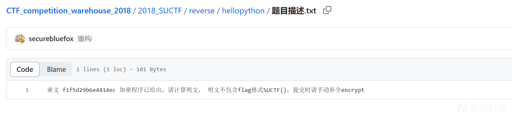](https://xzfile.aliyuncs.com/media/upload/picture/20230824213343-d81b05f2-4282-1.png)

pyc文件

```plain
(lambda __operator, __print, __g, __contextlib, __y: [ (lambda __mod: [ [ [ (lambda __items, __after, __sentinel: __y((lambda __this: (lambda : (lambda __i: [ (lambda __out: (lambda __ctx: [__ctx.__enter__(), __ctx.__exit__(None, None, None), __out[0]((lambda : __this()))][2])(__contextlib.nested(type('except', (), {'__enter__': lambda self: None, '__exit__': lambda __self, __exctype, __value, __traceback: __exctype is not None and [ True for __out[0] in [(sys.exit(0), (lambda after: after()))[1]] ][0]})(), type('try', (), {'__enter__': lambda self: None, '__exit__': lambda __self, __exctype, __value, __traceback: [ False for __out[0] in [(v.append(int(word, 16)), (lambda __after: __after()))[1]] ][0]})())))([None]) for __g['word'] in [__i] ][0] if __i is not __sentinel else __after())(next(__items, __sentinel)))))())(iter(p_text.split('_')), (lambda : [ [ [ [ [ [ [ (lambda __after: __y((lambda __this: (lambda : (lambda __target: [ (lambda __target: [ (lambda __target: [ [ __this() for __g['n'] in [__operator.isub(__g['n'], 1)] ][0] for __target.value in [__operator.iadd(__target.value, (y.value << 4) + k[2] ^ y.value + x.value ^ (y.value >> 5) + k[3])] ][0])(z) for __target.value in [__operator.iadd(__target.value, (z.value << 4) + k[0] ^ z.value + x.value ^ (z.value >> 5) + k[1])] ][0])(y) for __target.value in [__operator.iadd(__target.value, u)] ][0])(x) if n > 0 else __after())))())((lambda : [ [ (__print(('').join(map(hex, w)).replace('0x', '').replace('L', '')), None)[1] for w[1] in [z.value] ][0] for w[0] in [y.value] ][0])) for __g['w'] in [[0, 0]] ][0] for __g['n'] in [32] ][0] for __g['u'] in [2654435769] ][0] for __g['x'] in [c_uint32(0)] ][0] for __g['z'] in [c_uint32(v[1])] ][0] for __g['y'] in [c_uint32(v[0])] ][0] for __g['k'] in [[3735928559, 590558003, 19088743, 4275878552]] ][0]), [])
 for __g['v'] in [[]] ][0]
 for __g['p_text'] in [raw_input('plain text:\n> ')] ][0]
 for __g['c_uint32'] in [__mod.c_uint32] ][0])(__import__('ctypes', __g, __g, ('c_uint32', ), 0))
 for __g['sys'] in [__import__('sys', __g, __g)] ][0])(__import__('operator', level=0), __import__('__builtin__', level=0).__dict__['print'], globals(), __import__('contextlib', level=0), (lambda f: (lambda x: x(x))((lambda y: f((lambda : y(y)()))))))
```

反编译之后是混淆过的乱码

虽然很难看，但是可以硬猜，通过2654435769确定的TEA加密

通过`(y.value << 4) + k[2] ^ y.value + x.value ^ (y.value >> 5) + k[3])]`之类的也能猜到

[](https://xzfile.aliyuncs.com/media/upload/picture/20230824213504-084db472-4283-1.png)

套到tea解密的脚本

[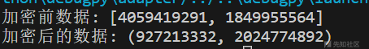](https://xzfile.aliyuncs.com/media/upload/picture/20230824213538-1c890b26-4283-1.png)

## python exe反编译

### PyInstaller：将.py编译成.exe

更多操作选项：[python：pyinstaller使用指南\_python pyinstall](https://blog.csdn.net/weixin_41916986/article/details/122343057)

pyinstaller可以将python项目在不同平台上打包为可执行文件。

打包流程：读取编写好的python项目–>分析其中调用的模块和库，并收集其文件副本（包括python的解释器）–>将副本和python项目文件封装在一个可执行文件中

使用pip安装：`pip install pyinstaller`,安装后会在Scripts文件夹下生成pyinstaller.exe`"C:\Python311\Scripts\pyinstaller.exe"`,接下来就可以使用该工具将 Python 程序生成 exe 程序了。

创建一个新文件夹，写一个非常简单的helloworld并保存到新文件夹中

```plain
def main():
    print('hello')
    print('world')
# 增加调用main()函数
if __name__ == '__main__':
    main()
```

在文件的目录下执行`pyinstaller -F NAME.py`

[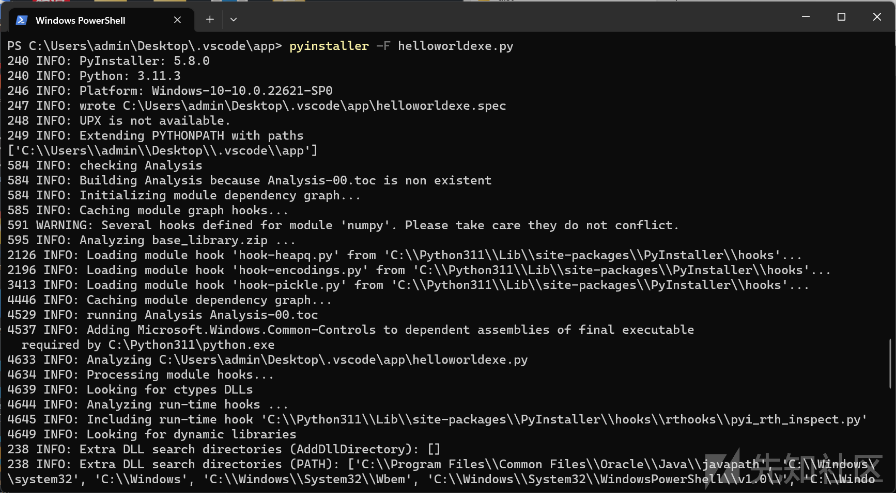](https://xzfile.aliyuncs.com/media/upload/picture/20230824213614-322c3458-4283-1.png)

之后在新生成的dist目录下就有打包好的exe文件

[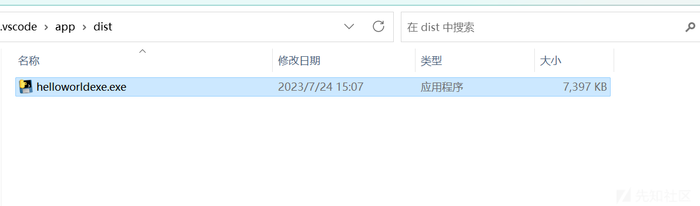](https://xzfile.aliyuncs.com/media/upload/picture/20230824213646-4588bf8a-4283-1.png)

同时会生成如下三个文件

[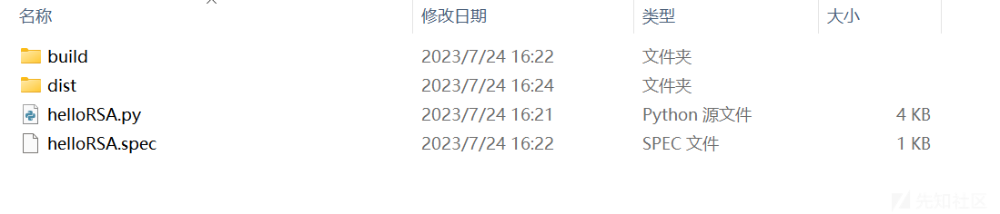](https://xzfile.aliyuncs.com/media/upload/picture/20230824213708-5261b284-4283-1.png)

##### .spec配置文件

```plain
block_cipher = None
#以py文件为输入,分析py文件的依赖模块,并生成相应的信息
a = Analysis(['xxx.py'], # 要打包.py文件名列表，和xxx.py同级可以不同添加
       pathex=['D:\\abc\\def\\project_v1.0'], # 项目路径
       binaries=[], # 程序调用外部pyd、dll文件（二进制文件路径）以数组形式传入;例:('D:\\pro\\text.dll', 'pro'),将'pdftotext.dll'pro，与原项目结构一致即可
       datas=[], # 存放的资源文件（图片、文本等静态文件）以数组形成传入;例：('D:\\static\\c.ioc','static'),将'cc.ioc'打包之后放在static目录，与原项目结构一致即可
       hiddenimports=[], # pyinstaller解析模块时可能会遗漏某些模块（not visible to the analysis phase），造成打包后执行程序时出现类似No Module named xxx;这时就需要在hiddenimports中加入遗漏的模块
       hookspath=[],
       runtime_hooks=[],
       excludes=[], # 去除不必要的模块import，写在excludes中添加此模块
       win_no_prefer_redirects=False,
       win_private_assemblies=False,
       cipher=block_cipher)

# .pyz的压缩包，包含程序运行需要的所有依赖
pyz = PYZ(a.pure, a.zipped_data, 
       cipher=block_cipher)

# 根据Analysis和PYZ生成单个exe程序所需要的属性及其配置
exe = EXE(pyz,
     a.scripts,
     exclude_binaries=True,
     name='xxx', # 生成exe文件的名字
     debug=False, # debug模式
     strip=False,
     upx=True,
     console=False, # 是否在打开exe文件时打开cmd命令框
     icon='C:\Users\xx.ico' ) # 设置exe程序图标，ico格式文件（16*16）

# 收集前三个部分的内容进行整合，生成程序所需要的依赖包，及资源文件和配置
coll = COLLECT(exe,
        a.binaries,
        a.zipfiles,
        a.datas,
        strip=False,
        upx=True,
        name='fastplot')
```

### pyinstxtractor

下载pyinstxtractor.py

将pyinstxtractor.py工具与要反编译的main.exe文件放入同一个工作目录下，在当前目录的终端界面输入`python pyinstxtractor.py main.exe`，得到main.exe\_extracted文件夹。

[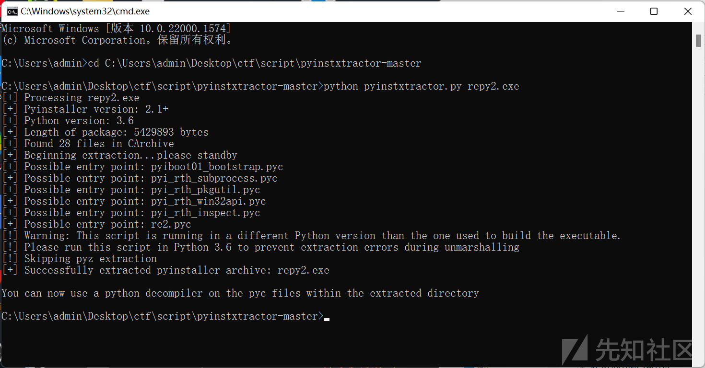](https://xzfile.aliyuncs.com/media/upload/picture/20230824213825-805499ea-4283-1.png)

找到main文件，将其后缀改为pyc并用winhex打开

[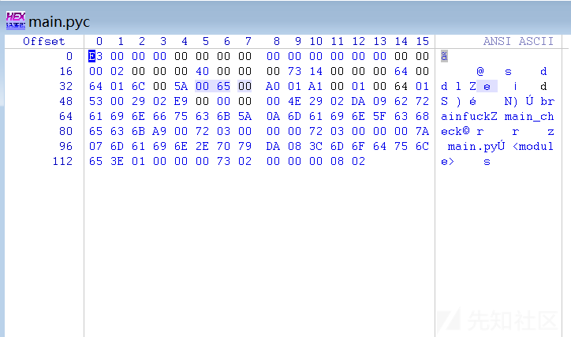](https://xzfile.aliyuncs.com/media/upload/picture/20230824213850-8f07cc3c-4283-1.png)

要补全文件头才能正常使用

从同文件夹下的struct文件中找到该python版本的magic number，将其补在E3之前，得到完整的pyc文件

```plain
在Python3.7及以上版本的编译后二进制文件中，头部除了四字节Magic Number，还有四个字节的空位和八个字节的时间戳+大小信息，后者对文件反编译没有影响，全部填充0即可；
Python3.3 - Python3.7（包含3.3）版本中，只需要Magic Number和八位时间戳+大小信息
Python3.3 以下的版本中，只有Magic Number和四位时间戳
```

[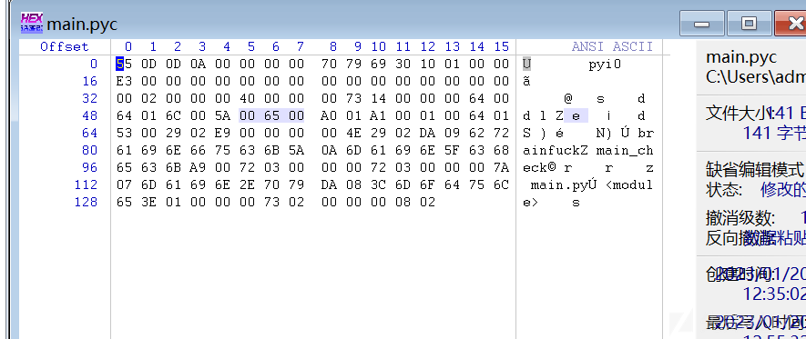](https://xzfile.aliyuncs.com/media/upload/picture/20230824213929-a621c760-4283-1.png)

之后使用前面的方法将pyc文件反编译成py即可

### pyi-archive\_viewer

pyi-archive\_viewer是PyInstaller自己提供的工具，它可以直接提取打包结果exe中的pyc文件。

[Advanced Topics — PyInstaller 5.13.0 documentation](https://pyinstaller.org/en/stable/advanced-topics.html#using-pyi-archive-viewer)

查看 exe 内部的文件结构：

```plain
pyi-archive_viewer name.exe
```

[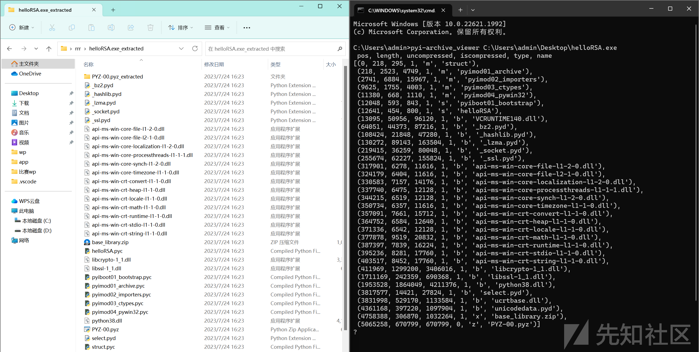](https://xzfile.aliyuncs.com/media/upload/picture/20230824214031-cb50e89a-4283-1.png)

操作指令

```plain
U: go Up one level
O <name>: open embedded archive name
X <name>: extract name
Q: quit
```

提取操作如下

[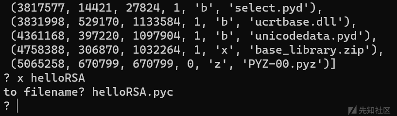](https://xzfile.aliyuncs.com/media/upload/picture/20230824214054-d8ecc0dc-4283-1.png)

### pyz

[Python逆向——Pyinstaller逆向-软件逆向-看雪-安全社区](https://bbs.kanxue.com/thread-271253.htm)

Pyinstaller.py文件有一个-key参数，可以对一些pyc文件进行加密，加密后的pyc文件称为pyz文件

使用如下指令加密（要先`pip install tinyaes`）

```plain
pyinstaller --key=4444 -F xxx.py
```

写一个实验程序

```plain
def main():
    print("hellopyz")

if __name__ == '__main__':
    main()
```

打包

[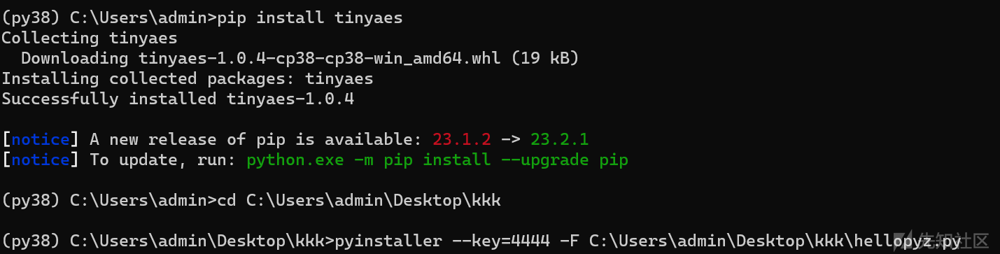](https://xzfile.aliyuncs.com/media/upload/picture/20230824214131-eee0c4d8-4283-1.png)

打包后我们对其进行解包，发现加密并没有什么用

[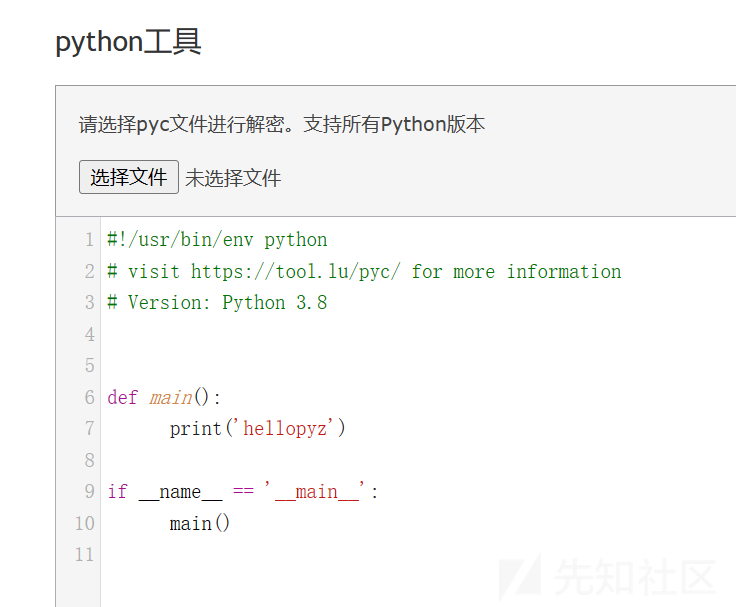](https://xzfile.aliyuncs.com/media/upload/picture/20230824214158-ff04b554-4283-1.png)

原因是pyinstaller只对依赖库进行了加密，并没有对主程序做加密处理。

### 将.py编译成.pyd来防止反编译

可以将模块py文件编译为动态链接库，这样破解难度将大大增加，pyd使用cython即可编译。

pyd文件类似于DLL, 一般用C/C++语言编译而成, 可用作**模块**导入Python程序中。pyd文件仅适用于特定版本的Python, **不同版本间互不兼容**, 如Python3.8不支持3.7版本的文件。pyd文件用C/C++语言编译而成, 难以被反编译, 在保护Python程序源码上有很好的效果。而且由于使用了C/C++等低级语言, 代码执行效率较高。

```plain
>>> import _tkinter # 导入pyd文件
>>> _tkinter.__file__
'...\\_tkinter.pyd'
```

python有的可能不带cython，安装即可：

```plain
pip install Cython
```

编译pyd需要c编译器，可以使用Visual Studio的C编译器或MinGW编译器，这里我选择Visual Studio。

Visual Studio环境要通过VisualStudioSetup.exe安装好C++开发和Python开发两个选项。

##### 从py文件生成pyd文件

通过已有的.py文件生成pyd文件, 需要使用distutils模块和Cython库。

用一个例子

```plain
#test.py
def main():
    print("Hello world pyd")

#main.py
import test
test.main()

#setup.py:生成pyd文件的主程序
from distutils.core import setup
from Cython.Build import cythonize
import sys,os,traceback

setup(
    name = 'test',
    ext_modules = cythonize('test.py'),
)
```

运行后程序目录下会生成一个test.c文件, 包含了pyd文件所用到的C语言代码。将生成的pyd文件重命名为test.pyd（也可以不重命名），运行main.py，就可以看到pyd文件中的结果了。  
使用PyInstaller等库打包exe的时候, 先打包main.py作为主程序。即使exe被某个库反编译, 得到的只是主程序main.py, 而pyd文件中的代码是很难被反编译的。

[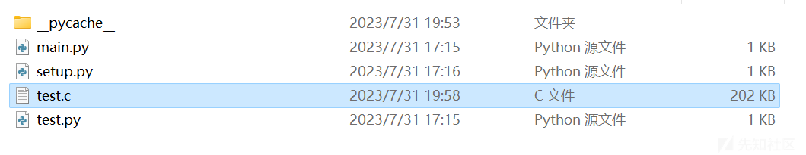](https://xzfile.aliyuncs.com/media/upload/picture/20230824214257-228b5848-4284-1.png)

##### 编写C/C++代码, 编译成pyd文件

打开Visual Studio创建新项目，选择Python扩展模块为项目类型，输入项目名称，并选择项目所在的文件夹。

[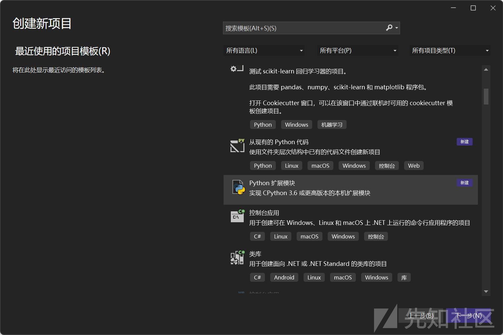](https://xzfile.aliyuncs.com/media/upload/picture/20230824214322-317e4c0c-4284-1.png)

等Visual Studio加载好后，会自动生成pyd文件的初始C语言代码。编写完成后，打开菜单 “生成” -> “生成xxxx”，就可以在项目所在文件夹的\\Debug目录下找到生成的pyd文件。使用"调试"菜单中的调试命令，或者按F5键，就可以直接调试pyd文件。

```plain
#include <Python.h>

/*
 * Implements an example function.
 */
PyDoc_STRVAR(pyddd_example_doc, "example(obj, number)\
\
Example function");

PyObject *pyddd_example(PyObject *self, PyObject *args, PyObject *kwargs) {
    /* Shared references that do not need Py_DECREF before returning. */
    PyObject *obj = NULL;
    int number = 0;

    /* Parse positional and keyword arguments */
    static char* keywords[] = { "obj", "number", NULL };
    if (!PyArg_ParseTupleAndKeywords(args, kwargs, "Oi", keywords, &obj, &number)) {
        return NULL;
    }

    /* Function implementation starts here */

    if (number < 0) {
        PyErr_SetObject(PyExc_ValueError, obj);
        return NULL;    /* return NULL indicates error */
    }

    Py_RETURN_NONE;
}

/*
 * List of functions to add to pyddd in exec_pyddd().
 */
static PyMethodDef pyddd_functions[] = {
    { "example", (PyCFunction)pyddd_example, METH_VARARGS | METH_KEYWORDS, pyddd_example_doc },
    { NULL, NULL, 0, NULL } /* marks end of array */
};

/*
 * Initialize pyddd. May be called multiple times, so avoid
 * using static state.
 */
int exec_pyddd(PyObject *module) {
    PyModule_AddFunctions(module, pyddd_functions);

    PyModule_AddStringConstant(module, "__author__", "admin");
    PyModule_AddStringConstant(module, "__version__", "1.0.0");
    PyModule_AddIntConstant(module, "year", 2023);

    return 0; /* success */
}

/*
 * Documentation for pyddd.
 */
PyDoc_STRVAR(pyddd_doc, "The pyddd module");


static PyModuleDef_Slot pyddd_slots[] = {
    { Py_mod_exec, exec_pyddd },
    { 0, NULL }
};

static PyModuleDef pyddd_def = {
    PyModuleDef_HEAD_INIT,
    "pyddd",
    pyddd_doc,
    0,              /* m_size */
    NULL,           /* m_methods */
    pyddd_slots,
    NULL,           /* m_traverse */
    NULL,           /* m_clear */
    NULL,           /* m_free */
};

PyMODINIT_FUNC PyInit_pyddd() {
    return PyModuleDef_Init(&pyddd_def);
}
```

注：当同时存在mylib.pyd和mylib.py时，引入优先级是pyd>py，所以不用移除py文件，默认引入时就是pyd。

## python字节码

### 基本知识

#### 机器码

机器码(machine code)，学名机器语言指令，有时也被称为原生码（Native Code），是电脑CPU直接读取运行的机器指令(计算机只认识0和1)，运行速度最快。

#### 字节码

字节码（byte code）是一种包含执行程序、由一序列 OP代码(操作码)/数据对 组成的二进制文件。字节码是一种中间码，它比机器码更抽象，需要直译器转译后才能成为机器码的中间代码。

通常情况下它是已经经过编译，但与特定机器码无关。字节码通常不像源码一样可以让人阅读，而是编码后的数值常量、引用、指令等构成的序列。字节码主要为了实现特定软件运行和软件环境、与硬件环境无关。字节码的实现方式是通过编译器和虚拟机器。编译器将源码编译成字节码，特定平台上的虚拟机器将字节码转译为可以直接执行的指令。

### dis

Python代码是编译成字节码再放到CPython编译器中执行，而dis模块可以将python代码分解为字节码。

[dis --- Python 字节码反汇编器 — Python 3.11.4 文档](https://docs.python.org/zh-cn/3/library/dis.html)

使用dis输出python字节码

[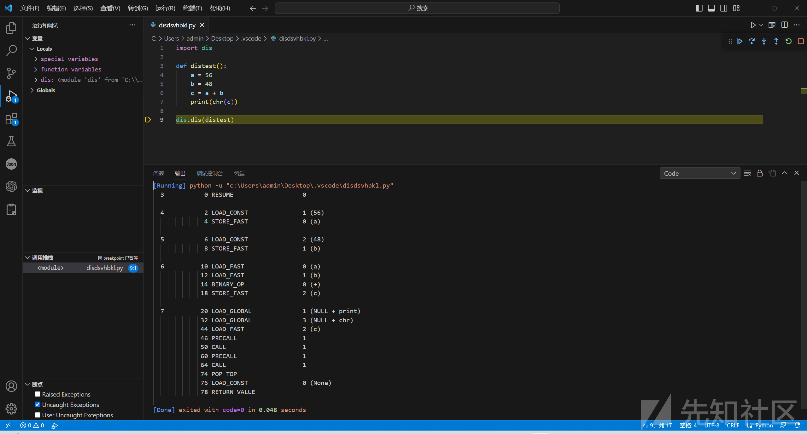](https://xzfile.aliyuncs.com/media/upload/picture/20230824214401-486907e0-4284-1.png)

输出格式如下

```plain
源码行号 | 指令在函数中的偏移 | 指令符号 | 指令参数 | 实际参数值
```

\*python2的偏移是3的倍数，python3是2的倍数

对于pyc文件，也可以通过如下代码将其输出为字节码

```plain
import dis
import marshal
f=open("printname.pyc","rb")
b_data=f.read()
f.close()
PyCodeObjectData=b_data[8:]#反序列化
#python3版本的需要去除前16个字节，python2版本的需要去除前8个字节
Pyobj=marshal.loads(PyCodeObjectData)
dis.dis(Pyobj)
```

#### 解题方法

就是阅读题

可以通过查询文档的方法人工编译

[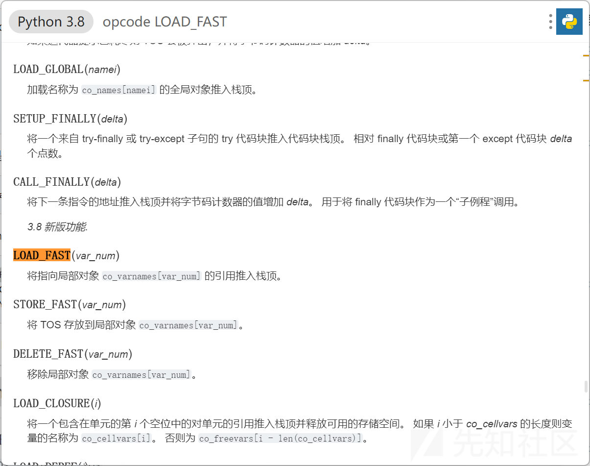](https://xzfile.aliyuncs.com/media/upload/picture/20230824214435-5c836432-4284-1.png)

或者利用人工智能（chatgptyyds）

[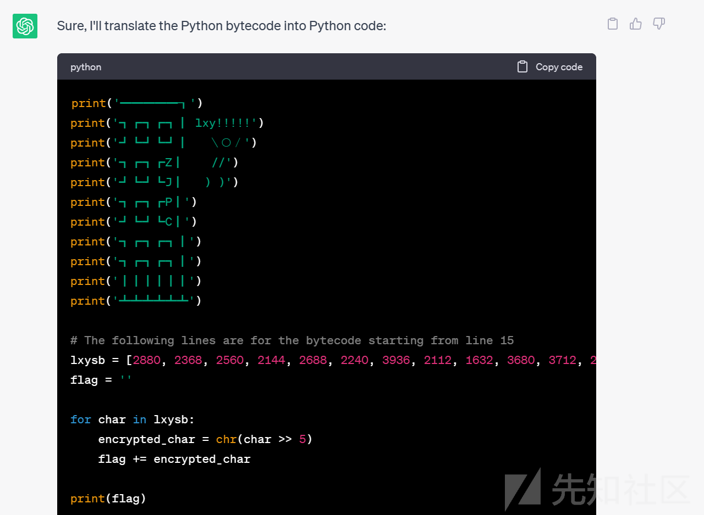](https://xzfile.aliyuncs.com/media/upload/picture/20230824214501-6c7dedbc-4284-1.png)

### pyc加花

**原理**：在 opcode 中添加一句加载超过范围的变量指令，而后再添加一句跳转指令跳过，达成不影响执行而且能欺骗反编译工具的目的

#### 读取co\_code长度

co\_code ：字节码指令序列，字节码都由操作码 opcode 和参数 opatg 组成的序列。记录着指令数量，指令的增加和减少都会影响该值。

```plain
根据文档，文件由一个 16 字节的标头（4 个 32 位字）和一个可变大小的有效负载组成。pyc

4B 幻数：用于区分哪个版本的 Python 生成了文件。见 https://docs.python.org/3/library/importlib.html#importlib.util.MAGIC_NUMBER
4B 位字段 （PEP0552）。至少在 3.7.3 上，这是空的。
4B修改日期：源文件时间戳
4B文件大小：源文件大小
从字节 16 开始，有效负载存储编组代码对象 （https://docs.python.org/3/c-api/code.html）。

代码对象提供以下属性（以及更多属性）：

co_argcount参数数（不包括 * 或 ** 参数）
co_code原始编译字节码的字符串
co_consts字节码中使用的常量元组
co_filename在其中创建此代码对象的文件的名称
co_firstlineno Python 源代码中第一行的数量
co_flags位图：1=优化 |2=新本地 |4=*参数 |8=**参数
co_lnotab行号到字节码索引的编码映射
定义此代码对象所用的co_name名称
co_names局部变量名称元组
co_nlocals局部变量的数量
需要co_stacksize虚拟机堆栈空间
co_varnames参数和局部变量名称的元组
co_consts 是可以包含代码对象实例的嵌套数据结构
```

使用`len(code.co_code)`指令即可打印

[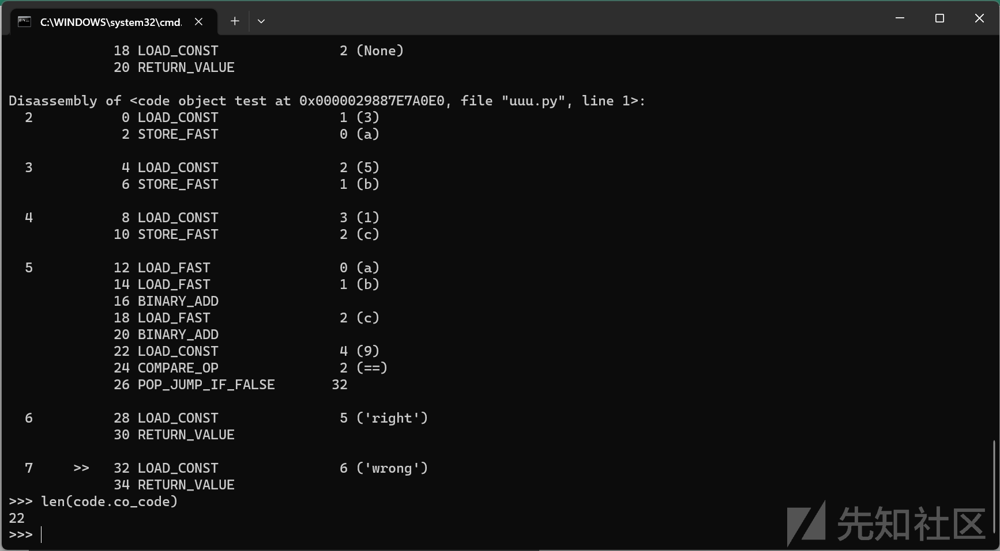](https://xzfile.aliyuncs.com/media/upload/picture/20230824214526-7b5b6940-4284-1.png)

写一个简单的测试程序，用python3.8编译成pyc文件

```plain
def main():
    a = 40
    b = 57
    b = b + 3
    c = a + b
    print(chr(c))

if __name__ == '__main__':
    main()
```

使用如下指令打印字节码

```plain
import marshal,dis
f=open("kkkk.pyc","rb").read()#注意如果不是在当前目录下时要用\\分隔，如"C:\\Users\\admin\\Desktop\\kkkk.pyc"
f
code = marshal.loads(f[16:])
dis.dis(code)
  1           0 LOAD_CONST               0 (<code object main at 0x0000018C4525A0E0, file "kkkk.py", line 1>)
              2 LOAD_CONST               1 ('main')
              4 MAKE_FUNCTION            0
              6 STORE_NAME               0 (main)

  8           8 LOAD_NAME                1 (__name__)
             10 LOAD_CONST               2 ('__main__')
             12 COMPARE_OP               2 (==)
             14 POP_JUMP_IF_FALSE       22

  9          16 LOAD_NAME                0 (main)
             18 CALL_FUNCTION            0
             20 POP_TOP
        >>   22 LOAD_CONST               3 (None)
             24 RETURN_VALUE

Disassembly of <code object main at 0x0000018C4525A0E0, file "kkkk.py", line 1>:
  2           0 LOAD_CONST               1 (40)
              2 STORE_FAST               0 (a)

  3           4 LOAD_CONST               2 (57)
              6 STORE_FAST               1 (b)

  4           8 LOAD_FAST                1 (b)
             10 LOAD_CONST               3 (3)
             12 BINARY_ADD
             14 STORE_FAST               1 (b)

  5          16 LOAD_FAST                0 (a)
             18 LOAD_FAST                1 (b)
             20 BINARY_ADD
             22 STORE_FAST               2 (c)

  6          24 LOAD_GLOBAL              0 (print)
             26 LOAD_GLOBAL              1 (chr)
             28 LOAD_FAST                2 (c)
             30 CALL_FUNCTION            1
             32 CALL_FUNCTION            1
             34 POP_TOP
             36 LOAD_CONST               0 (None)
             38 RETURN_VALUE
>>> len(code.co_code)
26
```

#### 去花并修改co\_code 长度

接下来尝试去花，使用010editor或者winhex打开pyc文件

要在二进制格式中定位指令，我们通过查询对应opcode.h中的指令编号来进行，比如我的地址是`"C:\Python311\include\opcode.h"`

### 下面是一个失败的示例：

_我想通过删除`b = b + 3`来改变输出结果，但是出现了错误。可能是pyc文件的结构没有想象的那么简单，不能轻松修改。不过操作和方法是可以用来去花的_

[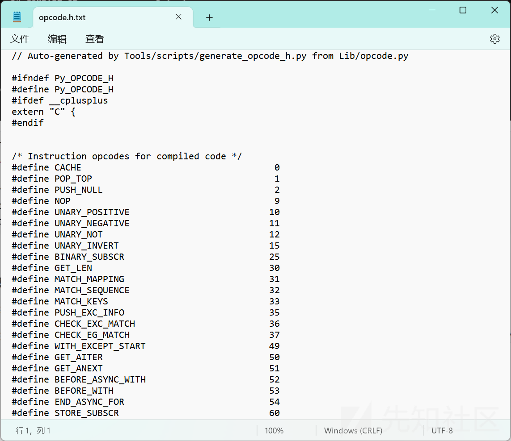](https://xzfile.aliyuncs.com/media/upload/picture/20230824214618-9a1805f0-4284-1.png)

在打印出一部分字节码后，通过查询花指令对应的十进制编号以及操作数在二进制文件中搜索定位（都要转成16进制）。比如：

```plain
4           8 LOAD_FAST                1 (b)
             10 LOAD_CONST               3 (3)
             12 BINARY_ADD
             14 STORE_FAST               1 (b)
在opcode中查找到指令
#define BINARY_ADD               23
```

要查询最后的`23 = 0x17`

通过指令（124 = 0x7C,100 = 0x64,23 = 0x17,125 = 0x7D）和操作数（0x01,0x03）定位到它在二进制文件中的位置

[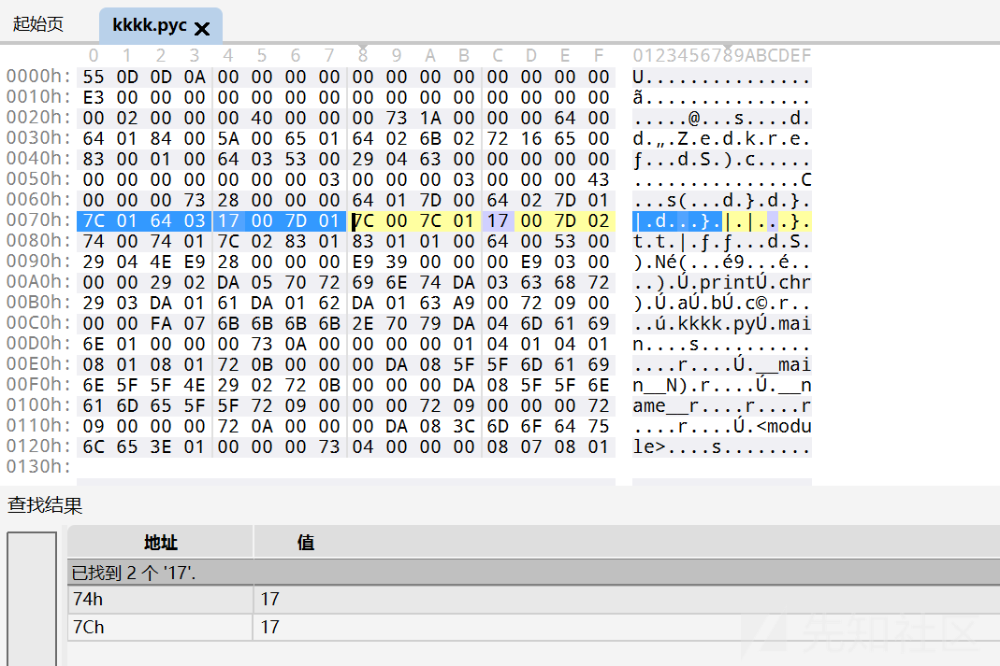](https://xzfile.aliyuncs.com/media/upload/picture/20230824214855-f78f2cf4-4284-1.png)

定位后删除花指令，注意python2的一条指令占3位，python3的一条指令占2位，在010editor中直接按退格键删除

删除后保存并用uncompyle6反编译，发现会失败

[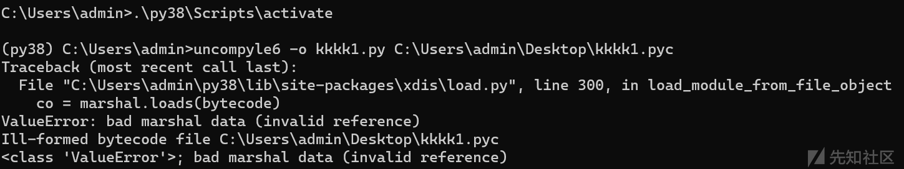](https://xzfile.aliyuncs.com/media/upload/picture/20230824214957-1c748910-4285-1.png)

删除花指令并不能完成去花，之后我们需要修改co\_code的值使其符合修改后的文件内容

搜索len(code.co\_code) = 26 = 0x1A

[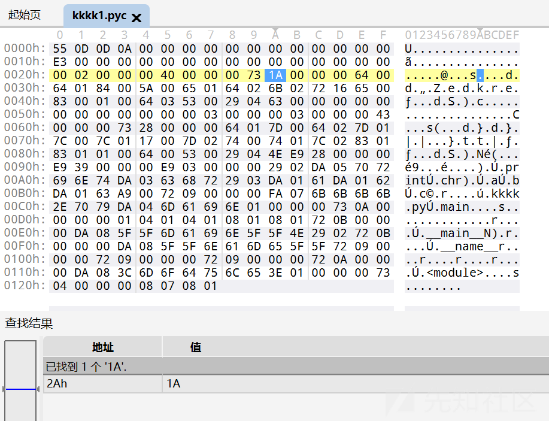](https://xzfile.aliyuncs.com/media/upload/picture/20230824215034-328c35f4-4285-1.png)

我们删去了4个指令，即2\*4 = 8 位，将其改为26 - 8 = 18 = 0x12后保存

_理论上现在可以反编译了，但实操不行_

[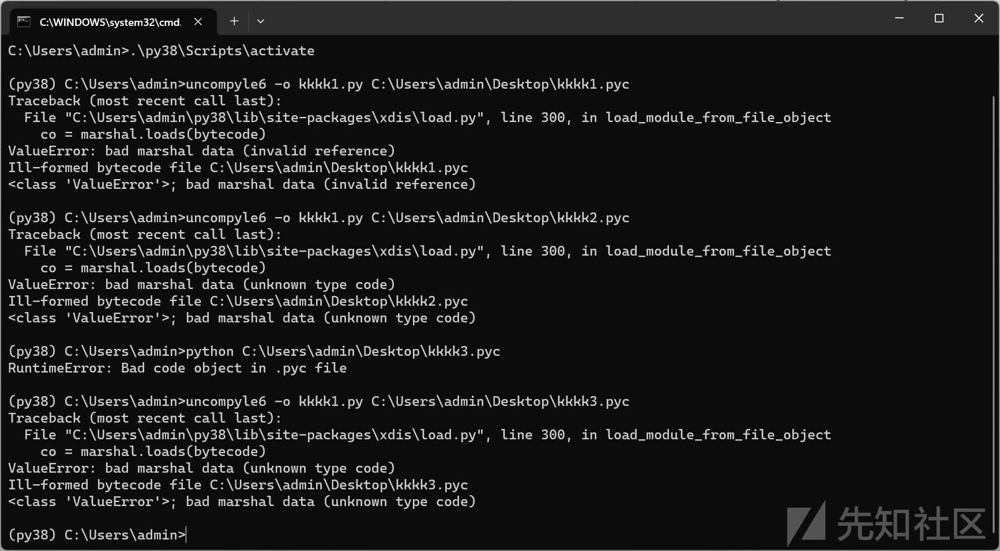](https://xzfile.aliyuncs.com/media/upload/picture/20230824215103-443c1382-4285-1.png)

成功的操作见题目练习中的\[VNCTF2022\] BabyMaze

## 其他混淆

还有高手？

#### Oxyry Python

[Oxyry Python Obfuscator - 世界上最可靠的 Python 混淆器](https://pyob.oxyry.com/)

仅对源码进行了混淆，查看字节码还是能够看到代码逻辑

#### Pyarmor

[GitHub - dashingsoft/pyarmor: A tool used to obfuscate python scripts, bind obfuscated scripts to fixed machine or expire obfuscated scripts.](https://github.com/dashingsoft/pyarmor)

原理：[PyArmor原理调研 - 知乎 (zhihu.com)](https://zhuanlan.zhihu.com/p/609709232?utm_id=0)

#### pyminfier

[GitHub - liftoff/pyminifier: Pyminifier is a Python code minifier, obfuscator, and compressor.](https://github.com/liftoff/pyminifier)

github 开源混淆器，对类名 / 函数名 / 变量名进行重新命名，甚至能够对部分 Python 常量进行扰乱（仅支持python3）

#### pyc\_obscure

[GitHub - marryjianjian/pyc\_obscure: a simple obfuscator for pyc](https://github.com/marryjianjian/pyc_obscure)

将垃圾数据插入 PyCodeObject 的 co\_code 以混淆像 uncompyle6 这样的反编译器

### 题目练习

#### 陕西省赛2023 babypython

有两千多行，其中大多数是无用的干扰代码

[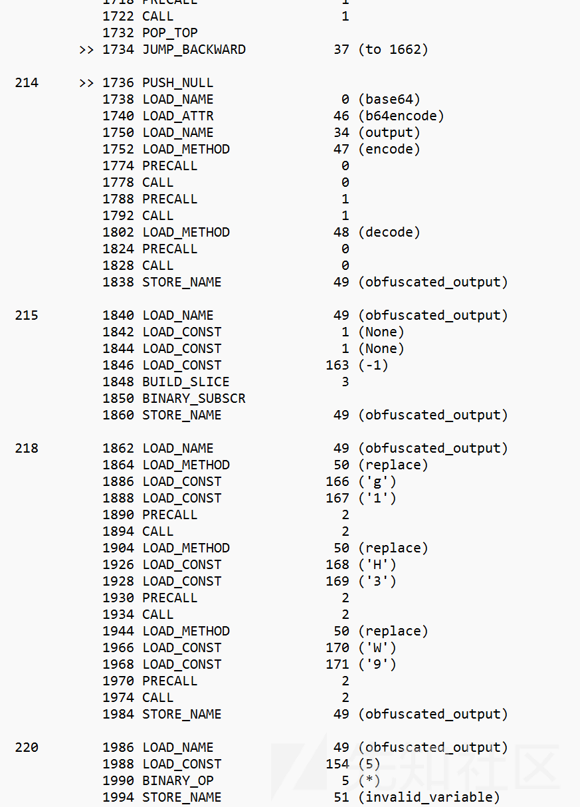](https://xzfile.aliyuncs.com/media/upload/picture/20230824215139-59b64ce6-4285-1.png)

图中的部分是有用的，其中有替换和倒序，这样处理一下最后的密文 =1nb0A3b7AUQwB3b84mQ/E0MvJUb+EXbx5TQwF3bt52bAZncsd9c

base64解一下得到qglrv@onmlqpA>qmq>mBo3A?Bn<lppA@;lp4nx

```plain
aaa = ['f','l','a','g','{']
bbb = "qglrv@onmlqpA>qmq>mBo3A?Bn<lppA@;lp4nx"
for i in range(len(bbb)):
    print(chr(ord(bbb[i])-3^8),end="")
```

尝试"flag{"为答案开头得到加密逻辑为`(bbb[i])-3^8`

flag{5dcbafe63fbf3b7d8647c1aee650ae9c}

#### \[VNCTF2022\] BabyMaze

下载题目，是一个pyc文件

使用uncompyle6反编译失败

[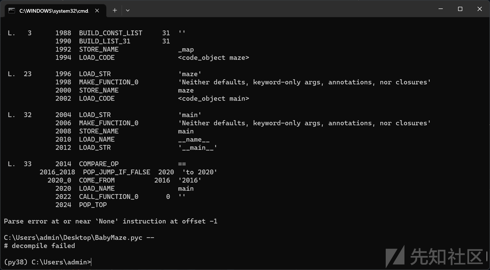](https://xzfile.aliyuncs.com/media/upload/picture/20230824215255-86feb9f4-4285-1.png)

反编译一开头就是JUMP\_ABSOLUTE的花指令

[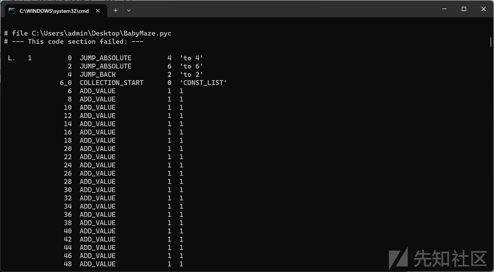](https://xzfile.aliyuncs.com/media/upload/picture/20230824215322-96e10048-4285-1.png)

在python3.8的opcode.h里找到 JUMP\_ABSOLUTE

```plain
#define JUMP_ABSOLUTE           113
113 = 0x71
```

在010editor里找到0x71，选中710471067102退格键删掉

[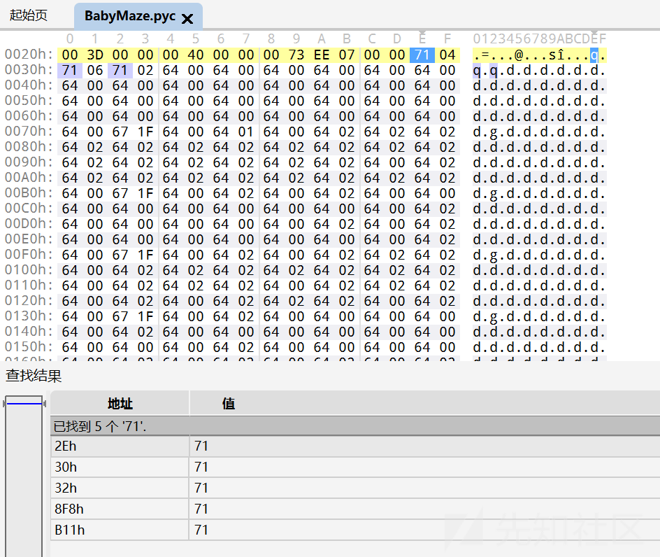](https://xzfile.aliyuncs.com/media/upload/picture/20230824215355-aa8a8934-4285-1.png)

获取co\_code的值，在010editor里搜索并减去 2\*3 = 6

[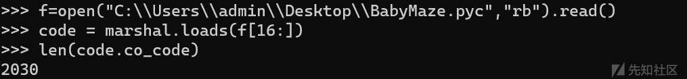](https://xzfile.aliyuncs.com/media/upload/picture/20230824215421-ba009eb2-4285-1.png)

这样操作之后保存，就可以正常打开了

[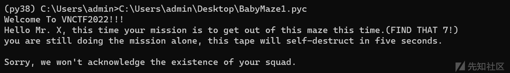](https://xzfile.aliyuncs.com/media/upload/picture/20230824215459-d0ad1c08-4285-1.png)

反编译一下

```plain
#!/usr/bin/env python
# visit https://tool.lu/pyc/ for more information
# Version: Python 3.8

_map = 
        ......

def maze():
    x = 1
    y = 1
    step = input()
    for i in range(len(step)):
        if step[i] == 'w':
            x -= 1
        elif step[i] == 's':
            x += 1
        elif step[i] == 'a':
            y -= 1
        elif step[i] == 'd':
            y += 1
        else:
            return False
        if None[x][y] == 1:
            return False
        if None == 29 and y == 29:
            return True
        return None


def main():
    print('Welcome To VNCTF2022!!!')
    print('Hello Mr. X, this time your mission is to get out of this maze this time.(FIND THAT 7!)')
    print('you are still doing the mission alone, this tape will self-destruct in five seconds.')
    if maze():
        print('Congratulation! flag: VNCTF{md5(your input)}')
    else:
        print("Sorry, we won't acknowledge the existence of your squad.")

if __name__ == '__main__':
    main()
```

使用DFS或者手撕均可

```plain
#出题人的脚本：
map = [[1, 1, 1, 1, 1, 1, 1, 1, 1, 1, 1, 1, 1, 1, 1, 1, 1, 1, 1, 1, 1, 1, 1, 1, 1, 1, 1, 1, 1, 1, 1], [1, 0, 1, 0, 0, 0, 0, 0, 0, 0, 0, 0, 0, 0, 0, 0, 0, 0, 0, 0, 1, 0, 0, 0, 0, 0, 0, 0, 0, 0, 1], [1, 0, 1, 0, 1, 1, 1, 1, 1, 1, 1, 1, 1, 0, 1, 1, 1, 1, 1, 0, 1, 0, 1, 1, 1, 1, 1, 1, 1, 0, 1], [1, 0, 1, 0, 0, 0, 1, 0, 0, 0, 0, 0, 0, 0, 1, 0, 0, 0, 1, 0, 0, 0, 1, 0, 1, 0, 0, 0, 1, 0, 1], [1, 0, 1, 1, 1, 1, 1, 0, 1, 1, 1, 1, 1, 1, 1, 1, 1, 0, 1, 1, 1, 1, 1, 0, 1, 0, 1, 0, 1, 0, 1], [1, 0, 0, 0, 1, 0, 0, 0, 1, 0, 0, 0, 0, 0, 0, 0, 0, 0, 0, 0, 0, 0, 1, 0, 0, 0, 1, 0, 0, 0, 1], [1, 1, 1, 0, 1, 0, 1, 1, 1, 0, 1, 1, 1, 1, 1, 1, 1, 1, 1, 1, 1, 1, 1, 0, 1, 1, 1, 1, 1, 1, 1], [1, 0, 0, 0, 1, 0, 1, 0, 0, 0, 1, 0, 0, 0, 0, 0, 0, 0, 0, 0, 1, 0, 0, 0, 1, 0, 0, 0, 1, 0, 1], [1, 0, 1, 1, 1, 0, 1, 0, 1, 1, 1, 0, 1, 1, 1, 1, 1, 1, 1, 0, 1, 0, 1, 1, 1, 0, 1, 0, 1, 0, 1], [1, 0, 0, 0, 0, 0, 1, 0, 1, 0, 0, 0, 1, 0, 0, 0, 1, 0, 1, 0, 1, 0, 0, 0, 1, 0, 1, 0, 0, 0, 1], [1, 1, 1, 1, 1, 1, 1, 0, 1, 0, 1, 1, 1, 0, 1, 0, 1, 0, 1, 0, 1, 1, 1, 0, 1, 0, 1, 1, 1, 0, 1], [1, 0, 0, 0, 0, 0, 0, 0, 1, 0, 0, 0, 0, 0, 1, 0, 0, 0, 1, 0, 1, 0, 0, 0, 1, 0, 1, 0, 0, 0, 1], [1, 0, 1, 1, 1, 1, 1, 1, 1, 1, 1, 1, 1, 1, 1, 1, 1, 0, 1, 0, 1, 0, 1, 1, 1, 0, 1, 0, 1, 1, 1], [1, 0, 0, 0, 0, 0, 0, 0, 1, 0, 0, 0, 0, 0, 0, 0, 1, 0, 1, 0, 0, 0, 1, 0, 0, 0, 1, 0, 0, 0, 1], [1, 0, 1, 1, 1, 1, 1, 0, 1, 0, 1, 0, 1, 0, 1, 1, 1, 0, 1, 1, 1, 1, 1, 0, 1, 1, 1, 1, 1, 1, 1], [1, 0, 1, 0, 0, 0, 1, 0, 1, 0, 1, 0, 1, 0, 1, 0, 0, 0, 1, 0, 0, 0, 0, 0, 0, 0, 0, 0, 0, 0, 1], [1, 0, 1, 0, 1, 0, 1, 0, 1, 0, 1, 0, 1, 1, 1, 0, 1, 1, 1, 0, 1, 1, 1, 1, 1, 0, 1, 1, 1, 0, 1], [1, 0, 1, 0, 1, 0, 1, 0, 1, 0, 1, 0, 0, 0, 1, 0, 0, 0, 1, 0, 1, 0, 0, 0, 1, 0, 1, 0, 0, 0, 1], [1, 0, 1, 0, 1, 1, 1, 0, 1, 0, 1, 1, 1, 0, 1, 1, 1, 0, 1, 0, 1, 0, 1, 0, 1, 1, 1, 0, 1, 1, 1], [1, 0, 0, 0, 1, 0, 0, 0, 1, 0, 1, 0, 0, 0, 0, 0, 1, 0, 1, 0, 1, 0, 1, 0, 0, 0, 1, 0, 0, 0, 1], [1, 0, 1, 1, 1, 0, 1, 0, 1, 0, 1, 0, 1, 1, 1, 1, 1, 0, 1, 0, 1, 0, 1, 1, 1, 0, 1, 0, 1, 0, 1], [1, 0, 1, 0, 0, 0, 1, 0, 1, 0, 1, 0, 0, 0, 0, 0, 0, 0, 1, 0, 1, 0, 1, 0, 1, 0, 1, 0, 1, 0, 1], [1, 0, 1, 0, 1, 1, 1, 0, 1, 0, 1, 1, 1, 1, 1, 1, 1, 1, 1, 1, 1, 0, 1, 0, 1, 0, 1, 0, 1, 0, 1], [1, 0, 1, 0, 0, 0, 1, 0, 1, 0, 1, 0, 0, 0, 0, 0, 0, 0, 0, 0, 1, 0, 1, 0, 1, 0, 1, 0, 1, 0, 1], [1, 0, 1, 1, 1, 0, 1, 0, 1, 0, 1, 1, 1, 1, 1, 0, 1, 0, 1, 0, 1, 0, 1, 0, 1, 0, 1, 0, 1, 0, 1], [1, 0, 0, 0, 1, 0, 1, 0, 1, 0, 0, 0, 0, 0, 1, 0, 1, 0, 1, 0, 0, 0, 1, 0, 0, 0, 1, 0, 1, 0, 1], [1, 1, 1, 1, 1, 0, 1, 1, 1, 1, 1, 1, 1, 0, 1, 1, 1, 0, 1, 1, 1, 1, 1, 1, 1, 0, 1, 1, 1, 0, 1], [1, 0, 0, 0, 0, 0, 1, 0, 0, 0, 0, 0, 1, 0, 0, 0, 1, 0, 0, 0, 0, 0, 0, 0, 1, 0, 0, 0, 0, 0, 1], [1, 0, 1, 1, 1, 1, 1, 0, 1, 1, 1, 0, 1, 1, 1, 0, 1, 1, 1, 1, 1, 1, 1, 0, 1, 1, 1, 1, 1, 0, 1], [1, 0, 0, 0, 0, 0, 0, 0, 0, 0, 1, 0, 0, 0, 0, 0, 0, 0, 0, 0, 0, 0, 0, 0, 1, 0, 0, 0, 0, 0, 1], [1, 1, 1, 1, 1, 1, 1, 1, 1, 1, 1, 1, 1, 1, 1, 1, 1, 1, 1, 1, 1, 1, 1, 1, 1, 1, 1, 1, 1, 1, 1]]
usedmap = [[0 for i in range(len(map))] for i in range(len(map)) ]
flag = ''

def DFS(x, y):
    global flag
    if x == len(map) - 2 and y == len(map) - 2:         # 31x31的迷宫 终点也就是数组的(29, 29)
        print(flag)
        return

    if map[x + 1][y] == 0 and  usedmap[x + 1][y] == 0:  # 如果下一步不是墙 且没走过
        usedmap[x][y] = 1                               # 标记当前坐标走过（不是下一步）
        flag += 's'
        DFS(x + 1, y)                                   # 尝试向下走
        flag = flag[:-1]                                # 回溯到这说明这条路不可行 所以去掉's' 
        usedmap[x][y] = 0                               # 再设置当前坐标为0 重新找路

    if map[x - 1][y] == 0 and usedmap[x - 1][y] == 0:
        usedmap[x][y] = 1
        flag += 'w'
        DFS(x - 1, y)
        flag = flag[:-1]
        usedmap[x][y] = 0

    if map[x][y + 1] == 0 and usedmap[x][y + 1] == 0:
        usedmap[x][y] = 1
        flag += 'd'
        DFS(x, y + 1)
        flag = flag[:-1]
        usedmap[x][y] = 0

    if map[x][y - 1] == 0 and usedmap[x][y - 1] == 0:
        usedmap[x][y] = 1
        flag += 'a'
        DFS(x, y - 1)
        flag = flag[:-1]
        usedmap[x][y] = 0

print("path:")
x = 1       # 设置起始坐标
y = 1
DFS(x, y)
```

[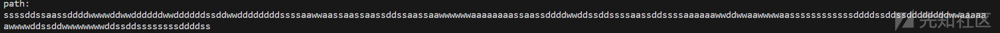](https://xzfile.aliyuncs.com/media/upload/picture/20230824215535-e67aefd8-4285-1.png)

flag{801f190737434100e7d2790bd5b0732e}

### 搭建python虚拟环境

##### virtualenv

使用Python的第三方库**virtualenv**创建虚拟环境

```plain
pip install virtualenv
```

使用virtualenv中的命令来创建虚拟环境的话，会默认同时在C盘用户目录中也创建一个环境，采用virtualenvwrapper-win可以更好的自定义安装

virtualenvwrapper-win是一个基于virtualenv开发的工具包。

```plain
pip install virtualenvwrapper-win
#需要先安装virtualenv
```

##### 为虚拟环境配置环境变量

[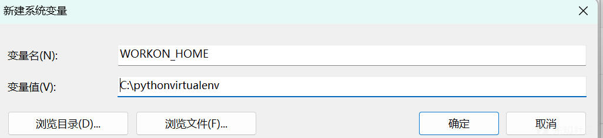](https://xzfile.aliyuncs.com/media/upload/picture/20230824215607-f9697dee-4285-1.png)

新建系统变量**WORKON\_HOME**，变量值为想要安装环境的位置

##### 新建虚拟环境

```plain
mkvirtualenv -p python_path env_name
```

\-p: 指定根据哪个python创建新的虚拟环境，一般是期望python的exe可执行文件的路径 env\_name: 是创建虚拟环境的名字

记得先授予权限（上面的报错就是没授予权限导致的）

[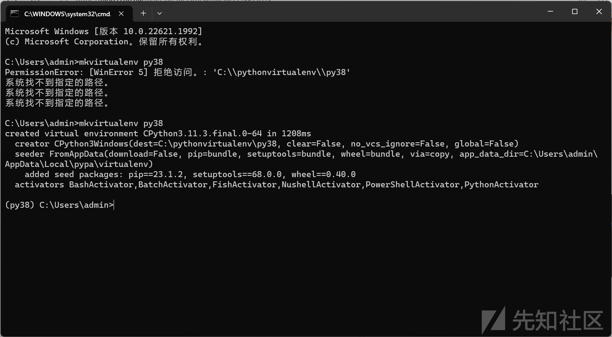](https://xzfile.aliyuncs.com/media/upload/picture/20230824215634-094493a2-4286-1.png)

创建好虚拟环境后，会自动跳转到该环境目录下，路径前面有`(py38)`。而且系统会默认为新建的虚拟环境配置电脑中安装好的Python环境（只包括部分执行命令，没有相关第三方模块），当然我们也可以在新虚拟环境中重新安装Python。

##### 查看虚拟环境配置情况

cmd中运行`workon`或者`lsvirtualenv`即可查看当前的虚拟环境配置情况

##### 激活虚拟环境

```plain
先cd转换
activate
```

##### 退出虚拟环境

```plain
deactivate
```

退出后路径前的（）就没有了

##### 删除虚拟环境

```plain
rmvirtualenv
```

进入当前虚拟环境的包目录(site-packages)

```plain
cdsitepackages
```

直接显示当前虚拟环境下所有包

```plain
lssitepackages
```

#### 直接使用virtualenv

指定python版本并生成环境：`virtualenv [name] --python=pythonx.x.x`

进入此虚拟环境（win)：`.\[name]\Scripts\activate`

退出虚拟环境：`deactivate`

[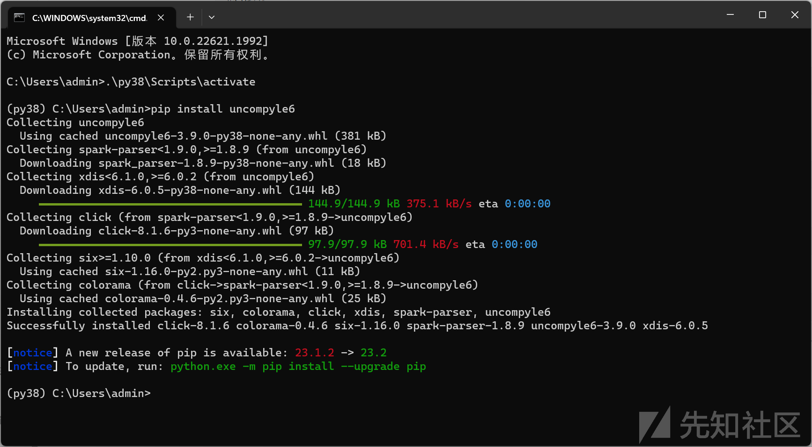](https://xzfile.aliyuncs.com/media/upload/picture/20230824215712-202b3652-4286-1.png)

（菜鸡一只，有什么问题还望各位大牛指导 Orz）
