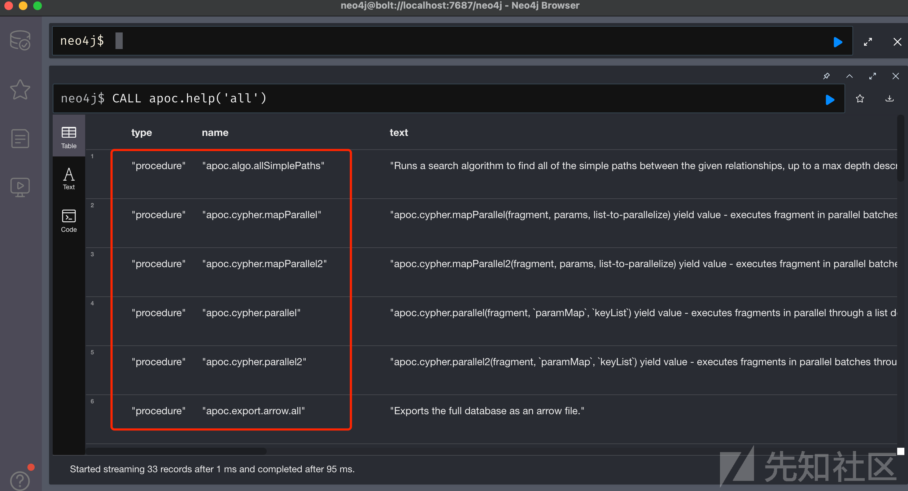
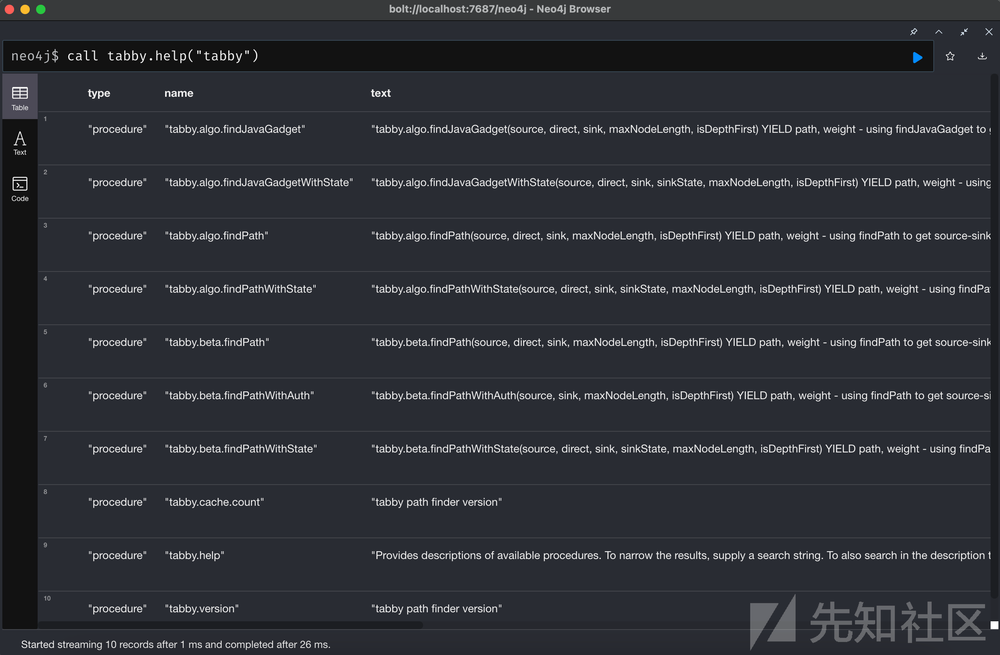
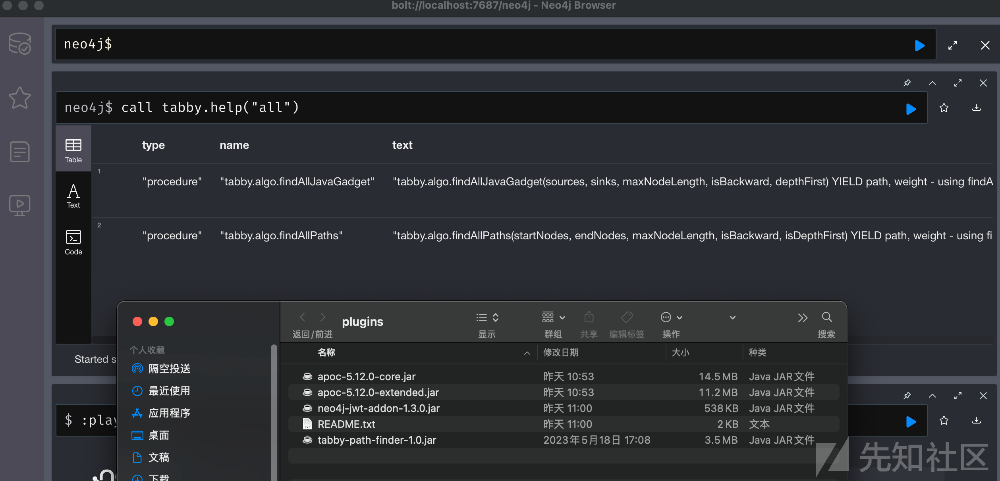
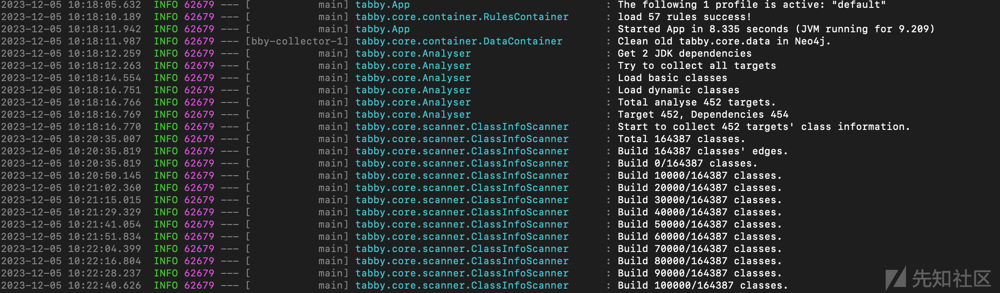
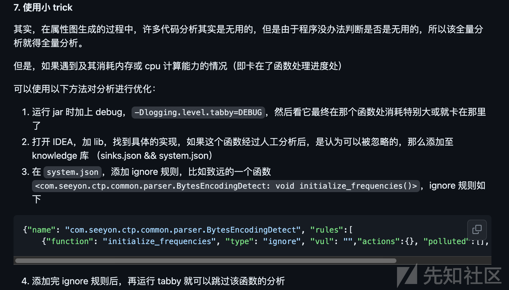
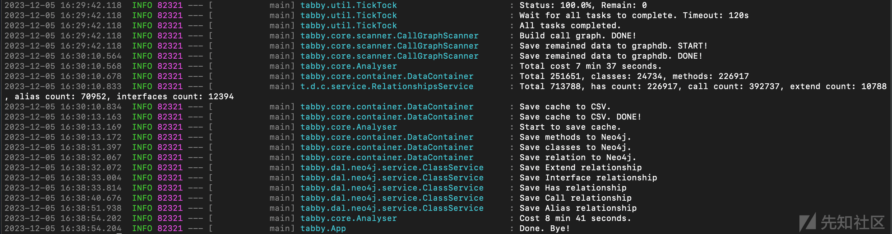
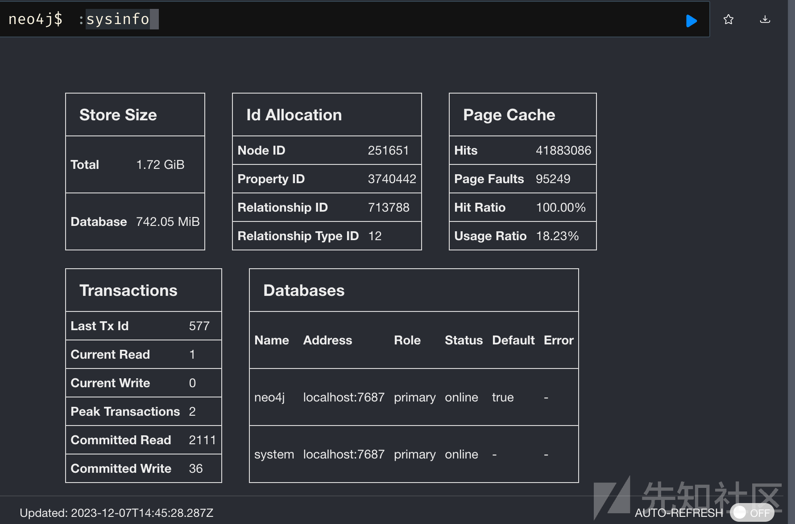
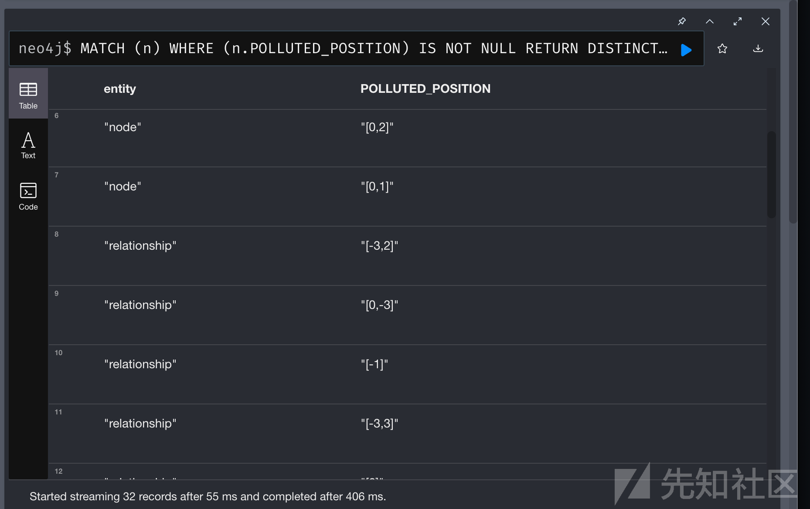
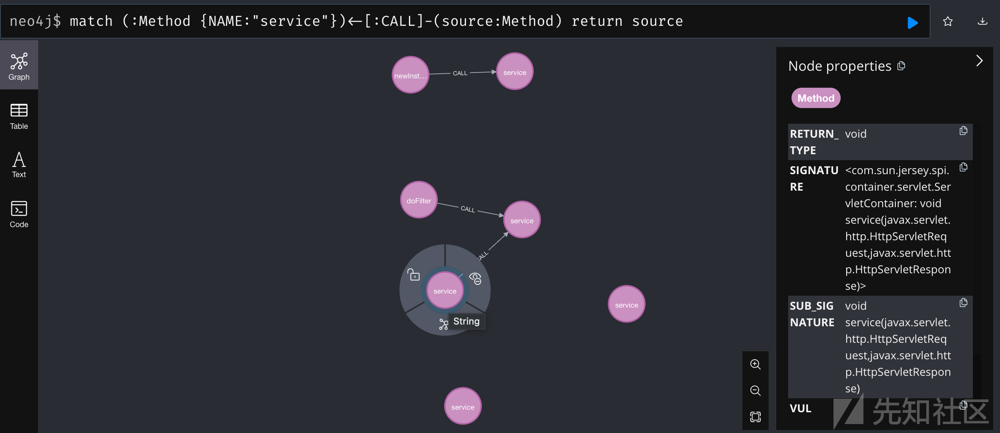

# tabby静态分析实践 - 先知社区

tabby静态分析实践

- - -

## 0x01 tabby 测试

测试版本：tabby v1.2.0-2 2023.02.24，tabby-path-finder-1.1.jar。

### 1a 工具印象

参考文章：[基于代码属性图的自动化漏洞挖掘实践](https://paper.seebug.org/2041/)，[使用tabby分析Spring Data MongoDB SpEL漏洞](https://cn-sec.com/archives/1161260.html)，[使用tabby对CVE-2022-39198的挖掘尝试-KingBridge](https://www.cnblogs.com/kingbridge/articles/17020853.html)。

[跳跳糖](https://tttang.com/?keyword=tabby) 有三篇文章。

| 事项  | 说明  | 补充  |
| --- | --- | --- |
| 方案优势 | 支持分析编译后的 War 包、Jar 包等形式 | \-  |
| 工作流程 | 代码属性图生成阶段，生成带污点信息的代码属性图 | 主要由 tabby.core 负责 |
| \-  | 漏洞发现阶段，查询 source-sink 语句寻找调用链路 | neo4j 扩展 tabby path finder |

代码属性图生成阶段：如何抽象代码、如何分析代码的执行、如何设计图结构等等，这些设计细节、实现细节可以暂时不管，但要知道该阶段结束时生成的代码属性图是什么结构。

查找代码属性图阶段：先了解 Neo4j 图数据库再看。

### 1b 安装和运行

参考文章 [Neo4j 环境配置 V5](https://github.com/wh1t3p1g/tabby/blob/master/doc/Neo4j%20%E7%8E%AF%E5%A2%83%E9%85%8D%E7%BD%AE%20%20V5.md)，访问官网下载 dmg 安装包并自动下载 Neo4j 5.12.0，分别下载 apoc-5.12.0-core.jar 、apoc-5.12.0-extended.jar，访问下载 [tabby-path-finder-1.0.jar](https://github.com/wh1t3p1g/tabby-path-finder/)（1.1主要适配 tabby 2.x 版本）。

neo4j 启动时遇到冲突，自动修改了端口配置，无需理会：

```plain
discovery: 5000 → 5001
cluster.raft: 7000 → 7001
```

配置一个 conf 文件、以及三个 jar 插件：

```plain
# 允许 apoc 扩展
dbms.security.procedures.unrestricted=jwt.security.*,apoc.*,tabby.*
```

然后启动数据库，查询如下：CALL apoc.help('all')：

[](https://xzfile.aliyuncs.com/media/upload/picture/20240103171343-6427e7ca-aa18-1.png)

CALL tabby.help('tabby')，成功导入了 tabby-path-finder-1.1.jar

[](https://xzfile.aliyuncs.com/media/upload/picture/20240103171453-8e2084e2-aa18-1.png)

导入 tabby-path-finder-1.0.jar，可以发现导入成功，但比 1.1 少一些 procedure

[](https://xzfile.aliyuncs.com/media/upload/picture/20240103171525-a140c56e-aa18-1.png)

提前对节点进行索引建立：

```plain
CREATE CONSTRAINT c1 IF NOT EXISTS FOR (c:Class) REQUIRE c.ID IS UNIQUE;
CREATE CONSTRAINT c2 IF NOT EXISTS FOR (c:Class) REQUIRE c.NAME IS UNIQUE;
CREATE CONSTRAINT c3 IF NOT EXISTS FOR (m:Method) REQUIRE m.ID IS UNIQUE;
CREATE CONSTRAINT c4 IF NOT EXISTS FOR (m:Method) REQUIRE m.SIGNATURE IS UNIQUE;
CREATE INDEX index1 IF NOT EXISTS FOR (m:Method) ON (m.NAME);
CREATE INDEX index2 IF NOT EXISTS FOR (m:Method) ON (m.CLASSNAME);
CREATE INDEX index3 IF NOT EXISTS FOR (m:Method) ON (m.NAME, m.CLASSNAME);
CREATE INDEX index4 IF NOT EXISTS FOR (m:Method) ON (m.NAME, m.NAME0);
CREATE INDEX index5 IF NOT EXISTS FOR (m:Method) ON (m.SIGNATURE);
CREATE INDEX index6 IF NOT EXISTS FOR (m:Method) ON (m.NAME0);
CREATE INDEX index7 IF NOT EXISTS FOR (m:Method) ON (m.NAME0, m.CLASSNAME);
```

对 jar 文件进行分析，打开 config/settings.properties，配置 tabby.build.target，然后运行 tabby 即可。

```plain
java -Xmx8g -jar tabby.jar
```

运行如图所示：

[](https://xzfile.aliyuncs.com/media/upload/picture/20240103171536-a7e24d7a-aa18-1.png)

### 1c 运行配置

踩坑：使用 gadget 分析模式对一套系统进行审计，跑了一天没结束，直到看到 web 分析模式。

参考：[Tabby 配置文件介绍.md](https://github.com/wh1t3p1g/tabby/blob/master/doc/Tabby%20%E9%85%8D%E7%BD%AE%E6%96%87%E4%BB%B6%E4%BB%8B%E7%BB%8D.md)，不同场景的 config/settings.properties 配置：

-   建议开启 debug 模式，可以看到 tabby 的工作内容；
-   JDK依赖是否参与分析，默认都为 false
-   配置分析目标，不对依赖库进行全量分析，选择 web 或 gadget 模式进行分析

```plain
tabby.debug.details                       = true 


tabby.build.target                        = cases/java-sec-code-1.0.0.jar 
tabby.build.libraries                     = libs 
tabby.build.mode                          = web # 分析类型 web 或 gadget
```

### 1d 测试结果

直接对 254MB 的 Jar 包进行分析，发现一共有 16w classes，先是跑了一夜没跑完，随后开了调试模式跑了四个小时也没跑完。

[](https://xzfile.aliyuncs.com/media/upload/picture/20240105151250-d5dcf748-ab99-1.png)

找了一下相关资料，发现 Github 地址有 trick，但人工去看卡在哪些函数，工作量感觉很大，暂时没找到办法解决。

[](https://xzfile.aliyuncs.com/media/upload/picture/20240105151303-de0269a8-ab99-1.png)

退而求其次，对 31MB 的源码业务代码进行扫描，其中没有 lib 库。

2w+ classes，耗时七分钟。

[](https://xzfile.aliyuncs.com/media/upload/picture/20240103171553-b1e7879a-aa18-1.png)

### 1e 踩坑记录

java -Xmx6g -jar tabby.jar，254MB 的 Jar 包，9w+ 的 classes，测试发现堆区不够。

给 8G 内存，跑了三个小时没跑完。

[](https://xzfile.aliyuncs.com/media/upload/picture/20240103171603-b7962ef8-aa18-1.png)

## 0x02 图数据库 Neo4j

Neo4j 的属性图模型是由节点和关系组成的，Cypher 是 Neo4j 的图形查询语言，可从图形中检索数据。

### 2a 入门介绍

参考官方文档：[使用 Cypher 查询 Neo4j 数据库](https://neo4j.com/docs/getting-started/cypher-intro/)，本节介绍了 Neo4j 由节点和关系组成，并且引入了三种表示符号 ()、\[\]、{}。

节点的主要组成：

-   描述：是图中的数据实体，使用括号描述节点例如 `(node)`
-   变量：命名变量以方便后续引用，比如 `(p) for person`
-   标签：通过分配节点标签，可以把相似节点分组在一起

| 表示示例 | 含义  |
| --- | --- |
| ()  | 匿名节点能指向数据库中的任意节点 |
| (p:Person) | 使用变量 p 和标签 Person |
| ( :Technology) | 没有变量的 Technology 标签 |
| (work:Company) | 使用变量 work 和标签 Company |

关系：Cypher 使用 箭头`-->`或 `<--` 表示两个节点之间的指向关系，使用两条破折号 `--` 表示无向关系，其他信息放置在箭头内部的方括号中。

| 关系类型 | 说明  |
| --- | --- |
| \[:Likes\] | 将节点放在关系的两侧时才有意义 |
| \[:Is\_Friends\_With\] | 将节点与它放在一起时才有意义 |
| \[:Works\_For\] | 对节点有意义 |

节点或关系的属性：属性是名称-值对，为我们的节点和关系提供额外的详细信息，使用花括号进行表示。

| 事项  | 举例  | \-  |
| --- | --- | --- |
| 节点属性 | (p:Person {name: 'Sally'}) |     |
| 关系属性 | \-\[rel:Is\_Friends\_With {since: 2018}\] -> |

### 2b Concepts guide

参考官方文档：[教程：构建 Cypher 推荐引擎](https://neo4j.com/docs/getting-started/appendix/tutorials/guide-build-a-recommendation-engine/)。

根据提示打开 neo4j Browser，左侧栏找到 Neo4j Browser Guides，查看 guide concept。

#### 属性图

一个图数据库能够通过很少的几个基础概念表示任何种类的数据：

| 属性图的组成部分 | 说明  |
| --- | --- |
| 节点nodes | 表示一个域的实体们 |
| 标签labels | 通过把节点分组构造域 |
| 关系relationships | 连接两个节点 |
| 属性properties | 为节点和关系添加命名过的值作为属性 |

#### 节点

neo4j 把数据存储到一个图的节点。

最简单的图只有一个节点，带有一些称为属性的键值。比如画一个社交图：画一个节点的圆，添加名字 Emil，标记他来自 Sweden。

关键信息：

-   节点通常表示可以用零个或多个标签进行分类的实体或离散对象
-   数据被存储为节点的属性
-   属性是简单的键值对

#### 标签

用于关联一组节点，比如把标签 Person 添加给创建的 Emil 节点，把 Person 节点标记为红色。

关键信息：

-   一个节点可以有零或多个标签
-   标签用于分类节点

#### 更多的节点

Neo4j 是 schema-free 结构自由的，没有行和列的概念。

Neo4j 中的数据可以简单地存储为添加更多的节点，节点们可以拥有很多通用的或独特的属性。

#### 关系

Neo4j 真正的魅力在于连接的数据。为了关联任意两个节点，可以添加一个关系用于描述这些记录是如何相关的。

在社交图中，你可以简单地说谁认识谁，即以 knows 作为节点之间的关系。

#### 关系属性

存储两个节点共享的信息。

在一个属性图里，关系也能包含描述这段关系的属性，比如 kowns since 2001。

### 2c Cypher guide

Cypher 是 Neo4j 的图查询语言，被设计用于查询图数据。

-   使用 pattern 描述图数据
-   与 SQL 相似的语句
-   声明性的、描述查询什么数据，而不是如何查询到数据

| 事项  | 语句  | 补充  |
| --- | --- | --- |
| 创建一个节点 | CREATE (ee:Person {name: 'Emil', from: 'Sweden', kloutScore: 99}) | ee 是临时别名，图中节点显示的都是属性值 |
| 查找节点 | MATCH (ee:Person) WHERE ee.name = 'Emil' RETURN ee; | ee 换成 a 效果相同 |
| 创造节点和关系 | Match  <br>Create (), (), (ee)-\[:KNOWS {since: 2001}\]->(js), ... | 这里 Macth 查询 Emil 是为了给它添加关系  <br>关系也是使用 Create 创建，这里的关系是 knows，没有命名别名 |
| 查询某类节点 | match (any:Person) return any | 查询所有 Person 组的节点 |

### 2d 尝试查询代码属性图

#### 查看图数据库信息

可以看到节点有 25w 个，属性共有 370w 个，关系共有 70w 个，关系类型有 12 个。

[](https://xzfile.aliyuncs.com/media/upload/picture/20240103171624-c47c1722-aa18-1.png)

#### 查看关系类型等

尝试：match \[any:relationship Type ID\] return any;，查询报错，只能查询节点。

查找资料找到文章：[neo4j图数据库，如何cypher查询标签/类型/属性等信息？](https://newsn.net/say/neo4j-schema-2.html)。

| 事项  | 语句  | 补充  |
| --- | --- | --- |
| 直观查看一个图 | call db.schema.visualization | 用 call 调用内置指令查看信息 |
| 获得所有标签 | match (n) return labels(n)  <br>match (n) return distinct(labels(n))  <br>call db.labels | distinct 关键词，用于去重 |
| 获得所有关系类型 | match (n)-\[r\]->(m) return distinct type(r)  <br>call db.relationshipTypes | 比如 knows/likes |
| 获得所有节点属性 | match (n) unwind keys(n) as allkeys return distinct allkeys | \-  |

#### 查看 Java 对象和方法

如图所示，节点标签有三种，关系类型有五种。

[](https://xzfile.aliyuncs.com/media/upload/picture/20240103171634-ca0131fa-aa18-1.png)

## 0x03 tabby-某赛通测试

使用 web 模式进行扫描，发现有 3w 个类，速度应该挺快，最终耗时 20 分钟。

[](https://xzfile.aliyuncs.com/media/upload/picture/20240103171721-e67b2372-aa18-1.png)

### 3a 怎么查

参考文章：[如何高效的挖掘Java反序列化利用链？-wh1t3p1g](https://blog.0kami.cn/blog/2021/how_to_find_gadget_chains/)。

构造图查询语言，文章提供了一个模版。

PS：经指导后改善查询语句，procedure 使用 apoc 时需要用 ALIAS>|CALL>，使用 tabby-path-finder 时需要用 - < >。（使用 - 关系的查询速度更快）

```plain
match (source:Method) // 添加where语句限制source函数
match (sink:Method {IS_SINK:true}) // 添加where语句限制sink函数
call apoc.algo.allSimplePaths(m1, source, "ALIAS>|CALL>", 12) yield path // 查找具体路径,12代表深度，可以修改
match (source:Method)
return * limit 20
```

查询：java 文件导入声明为类名，比如 `import javax.servlet.http.HttpServletRequest`。

| 查询事项 | 查询语句 | 效果  |
| --- | --- | --- |
| 查询 Tomcat 的 request | match (source:Class {NAME:"javax.servlet.http.HttpServletRequest"}) return source | 单节点 |
| 查询 FileOutputStream | Match (sink:Class {NAME:"java.io.FileOutputStream"}) return sink | 发现 **属性和值区分大小写** |
| 查询链路 | 见下方 | 发现 **CALL、Alias 只有 method -> method** |

查询链路

```plain
match (source:Method {NAME:"getParameter"})
Match (sink:Method {NAME:"FileOutputStream"})<-[:CALL]-(m1:Method)
call apoc.algo.allSimplePaths(m1, source, "ALIAS>|CALL>", 12) yield path
return * limit 20
```

### 3b 静态分析的技术问题

**疑问**：tabby 好像没有污点流分析？request.getParameter()、request.getInputStream() 都没办法追踪确认是否到危险函数。

tabby 首先对 class/method 等节点进行建模，然后在建立 call graph 时生成的 call edge 会添加 pollution\_positions 保存污点信息（方法和关系的属性）。

PS：感觉除了 call graph，其他信息大多都保存在属性里，需要慢慢挖掘其作用。

[](https://xzfile.aliyuncs.com/media/upload/picture/20240103171808-02613770-aa19-1.png)

### 3c 端点识别

#### 文章示例

参考文章： tabby java code review like a pro【KCon2022】.pdf 里的第三部分 Find Java Web Vulnerabilities like a pro 。

Tabby 默认内置了如下的**端点识别**：

-   Struts类型
-   Servlet类型
-   JSP类型
-   注释类型

查询语句模版：

```plain
match (source:Method {IS_ENDPOINT:true}) 
with collect(source) as sources
```

实例：

```plain
match (source:Method {NAME:"doAction"})
    <-[:HAS]-(c:Class)-[:INTERFACE|EXTENDS*]
    ->(c1:Class {NAME:"nc.bs.framework.adaptor.IHttpServletAdaptor"})
with collect(source) as sources

match (sink:Method {IS_SINK: true, VUL:"FILE_WRITE"})
with sources, collect(sink) as sinks

call tabby.algo.findAllVul(sources, sinks, 8, false) yield path

where none(n in nodes(path) where n.NAME0 in ["java.io.OutputStream.flush","java.io.Writer.flush", "java.util.Iterator.hasNext", "java.lang.Object.toString", "java.io.ObjectOutputStream.<init>", "java.io.PrintWriter.write"])

return path limit 10
```

没有 findAllVul 程序的话，就用 findPath 程序（PS：findVulAll 是老的 procedure，不推荐用了）

发现 .findPath 的参数只支持单节点，而非 List<node>。</node>

```plain
match (source:Method {NAME:"doAction"})
    <-[:HAS]-(c:Class)-[:INTERFACE|EXTENDS*]
    ->(c1:Class {NAME:"nc.bs.framework.adaptor.IHttpServletAdaptor"})
with collect(source) as sources

match (sink:Method {IS_SINK: true, VUL:"FILE_WRITE"})
with sources, collect(sink) as sinks

call tabby.algo.findPath(sources, "forward", sinks, 8, false) yield path

where none(n in nodes(path) where n.NAME0 in ["java.io.OutputStream.flush","java.io.Writer.flush", "java.util.Iterator.hasNext", "java.lang.Object.toString", "java.io.ObjectOutputStream.<init>", "java.io.PrintWriter.write"])

return path limit 10
```

突然意识到，tabby 看 Web 漏洞的时候应该把 service() 方法作为 source。比如示例中的 doAction函数，且参数类型为HttpServletRequest、HttpServletResponse。

#### 查询端点

发现 tabby 1.2 现有的 7 个 tabby.algo.findXxx() 程序都只支持单节点，不支持 <list>Node，不能用内置插件进行查询。</list>

| 事项  | 查询语句 | 说明  |
| --- | --- | --- |
| 查询所有端点 | match (source:Method {IS\_ENDPOINT: true}) return source | 查询返回300个方法 |
| 查找指定漏洞 | match (sink:Method {IS\_SINK: true, VUL:"FILE\_WRITE"}) return sink | 返回 java.io.BufferedOutputStream 的两个 <init> 构造方法</init> |

使用 neo4j 语法查询链路，其中 n 表示路径长度。

```plain
match path=(source:Method{NAME:"service"})-[]-(m1:Method{NAME:"getInputStream"}) return path
```

### 3d 直接查找危险方法

#### 测试

第一步，寻找处理请求的顶层方法：service(HttpServletRequest, HttpServletResponse)。

人工筛选结果，查找到函数签名：<com.sun.jersey.spi.container.servlet.ServletContainer: void service(javax.servlet.http.HttpServletRequest,javax.servlet.http.HttpServletResponse)>

```plain
match (:Method {NAME:"service"})<-[:CALL]-(source:Method) return source
```

[](https://xzfile.aliyuncs.com/media/upload/picture/20240105151342-f52dcd5c-ab99-1.png)

查找具体的顶层方法：

```plain
match (source:Method {NAME:"service", CLASSNAME:"com.sun.jersey.spi.container.servlet.ServletContainer"}) return source
```

第二步，查询危险函数 `new FileOutputStream(uploadPath)`

| 事项  | 语句  | 说明  |
| --- | --- | --- |
| 查找指定方法 | match (sink:Method {NAME:"FileOutputStream"}) return sink | error，new创建对象调用的是初始化函数<init></init> |
| 查找指定类的方法 | match (sink:Method {CLASSNAME:"java.io.FileOutputStream"}) return sink | 找到 **SIGNATURE**属性为<java.io.FileOutputStream: void <init>(java.lang.String)></init> |
| 查找指定方法 | match (sink:Method {SIGNATURE:"<java.io.FileOutputStream: void <init>(java.lang.String)>",CLASSNAME:"java.io.FileOutputStream"}) return sink</init> | 可行  |

第三步，直接合并查询调用路径：

```plain
match (source:Method {NAME:"service", CLASSNAME:"com.sun.jersey.spi.container.servlet.ServletContainer"})
match (sink:Method {SIGNATURE:"<java.io.FileOutputStream: void <init>(java.lang.String)>",CLASSNAME:"java.io.FileOutputStream"})
call tabby.algo.findPath(source, ">", sink, 15, false) YIELD path 
return path
```

测试发现，MaxNodeLength 设置为10时秒查，设置为15时查询30分钟还是白页。（PS：添加 limit 1 能提高查询速度）

MaxNodeLength 参数的含义应该是 `路径长度`，设置 15 时好像路径爆炸了。

[](https://xzfile.aliyuncs.com/media/upload/picture/20240105151407-041b7026-ab9a-1.png)

两种思路：

-   第一种，跟踪顶层 service，往下寻找更底层的统一的 request 入口。
-   第二种，后向分析，从危险函数往上查看调用，以找到具体的类

#### Cypher 查询实践

该部分是检索某赛通一个文件上传漏洞的 neo4j 查询过程，作为查询示例仅供参考。

查询语句：

```plain
match path=(sink:Method {SIGNATURE:"<java.io.FileOutputStream: void <init>(java.lang.String)>",CLASSNAME:"java.io.FileOutputStream"})<-[]-(m1:Method) return path
```

查询结果：返回 100 个方法，看起来太多。

优化：推测某赛通的控制器类统一调用 service() 方法，可以指定调用 new FileOutputStream() 的方法为 service()。

查询语句：

```plain
match path=(sink:Method {SIGNATURE:"<java.io.FileOutputStream: void <init>(java.lang.String)>",CLASSNAME:"java.io.FileOutputStream"})-[]-(m1:Method {NAME:"service"}) return path
```

查询结果：空。

查询目标：定位带有路由的类，一共有 308 个 <url-pattern>/</url-pattern>

模糊查询语句：

```plain
match (m1:Method) where m1.CLASSNAME starts with "com.esafenet.servlet.service"  return m1
```

查询结果：ok

查询目标：308个有路由的类中，哪些类调用了 new FileOutputStream() 方法。

查询语句：

```plain
match path=(source:Method)
-[:CALL*2]->
(sink:Method {SIGNATURE:"<java.io.FileOutputStream: void <init>(java.lang.String)>",CLASSNAME:"java.io.FileOutputStream"}) 
where source.CLASSNAME starts with "com.esafenet.servlet.service"
return path
```

结果：没有找到存在漏洞的 DecryptApplicationService2.class 中的方法。

查询目标：直接定位 com.esafenet.servlet.service.smartsec.DecryptApplicationService2 的 service 方法，查看其调用的方法，看看能不能找到 `<init>FileOutputStream(string` 方法。

查询语句：

```plain
match path=(source:Method {CLASSNAME:"com.esafenet.servlet.service.smartsec.DecryptApplicationService2",NAME:"service"})
-[:CALL]->
(sink:Method)
return path
```

查询结果：只返回 4 个调用的方法，其函数签名如下，new 语句不算 call。

**发现问题**：service() 里的 new FileOutputStream() 并不是 CALL 关系。

CALL数据流跟踪：只跟踪了 this.function() 和形参.function 两种。

```plain
SIGNATURE: <javax.servlet.http.HttpServletRequest: javax.servlet.ServletInputStream getInputStream()>

SIGNATURE: <com.esafenet.model.client.DecryptApplicationModel: java.lang.String getDir()>

SIGNATURE: <javax.servlet.http.HttpServletRequest: java.lang.String getParameter(java.lang.String)>

SIGNATURE: <com.esafenet.model.client.DecryptApplicationModel: void hasUpload(java.lang.String)>
```

查询目标：包含 new FileOutputStream() 的类。

查询语句：

```plain
match path=(source:Class)
-[:HAS]->
(sink:Method {SIGNATURE:"<java.io.FileOutputStream: void <init>(java.lang.String)>",CLASSNAME:"java.io.FileOutputStream"}) 
where source.CLASSNAME starts with "com.esafenet.servlet.service"
return path
```

查询结果：空，HAS 查的是类的方法，而不是类里面的代码，只能 method->method。

解决思路：查询 request.getInputStream()。

查询语句：

```plain
MATCH (source:Method{NAME:"service"}) 
MATCH (sink:Method {NAME:"getInputStream"}) 
Call tabby.algo.findPath(source,"-",sink,3,false) yield path
return path
```

查询结果：能找到 DecryptApplicationService2 的文件上传漏洞。

不足：com.esafenet.servlet.fileManagement.UploadFileFromClientServiceForClient 的文件上传找不到。

原因：存在漏洞的方法是 doPost(HttpServletRequest req, HttpServletResponse resp)。

优化：

```plain
MATCH path=(source:Method)-
[:CALL]-> 
(sink:Method {NAME:"getInputStream"}) 
where source.CLASSNAME starts with "com.esafenet.servlet"
return path
```

查询结果：找到 8 个调用类，检索路由发现 com.esafenet.servlet.service.cdgfile.FilesService 存在路由且可能存在漏洞。

#### 人工审查漏洞

第一步，在 web.xml 查找 `FilesService`，找到路由代码，确认该类可访问。

```plain
<url-pattern>/FilesService</url-pattern>
```

第二步，查看类代码，发现其 service() 方法为空。

访问站点查看：/CDGServer3/FilesService，发现访问是白页，说明路由确实存在且未授权。

```plain
protected void service(HttpServletRequest var1, HttpServletResponse var2) throws ServletException, IOException {
        // $FF: Couldn't be decompiled
    }
```

查看源码，发现文件后缀写死为 `.cdg` ，不存在任意文件写入/上传漏洞。

```plain
String filePathName = filePath + "\\\\" + fileId + fileType + ".cdg";

    FileOutputStream fileOutputStream = new FileOutputStream(filePathName);
```

## 0x04 tabby 实践小结

### 4a 数据流分析对象

经过对实例 JavaWeb 系统分析我们发现，tabby 1.2 版本把 class、method 作为图节点进行建模，然后构造 call graph 时在属性中保存一些污点信息，当然主要还是关注 class、method 数据流的追踪分析。

class、method 两种节点的属性若干，节点关系基本有如下几种：

| 关系类型 | 关系  |
| --- | --- |
| class->class | Interface、Extends |
| class->method | Has |
| method->method | Call、Alias |

实例的图数据库如下所示：

[](https://xzfile.aliyuncs.com/media/upload/picture/20240103171925-3005e6a8-aa19-1.png)

### 4b 整体感知

测试版本：tabby v1.2.0-2 2023.02.24。

检索漏洞：method call 通路检索 + 正则匹配。

-   通过对 class 和 method 的数据流追踪分析，获取 call graph
-   节点和关系的属性保存了很多信息比较复杂，逐步深入使用分析吧
-   使用正则匹配查询危险函数（taint flow 信息较少）

优势：

-   程序分析的数据源基于 Soot 生成的字节码，可以对 Jar、classes 等文件进行分析和检索，克服了 IDEA 在编译文件中正则匹配的困难
-   对于反序列化这种有触发点方法的 readObject，寻找漏洞如何落地的利用链比较方便
-   PS：查找特定类、Controller/Servlet 及其方法等方面有妙用

劣势：

-   tabby 1.2 的 taint flow 信息较少，如何调试数据流的流转等资料较少
-   ~默认全量分析，想要批量减去组件的分析量有点不知道怎么下手，难以对大 Jar 包进行分析~（PS：可以通过配置commonJar的配置文件去掉不需要分析的jar）

个人理想中对常规漏洞的污点分析：标记 request 对象中所有外部可控的数据流，追踪这些数据流查看是否经过指定的危险函数。想要实现这种效果，就要引入 source、sink 以及 taint flows。

比如说任意文件上传漏洞，相对于追踪 BufferOutputStream().write() 这种底层的方法，更想要追踪 new FileOutputStream(path)、MultipartFile.transferTo(path) 这种方法，只要 path 可控基本就能确定存在文件上传操作，从而减少误报率。

鸣谢：本次实践有赖于 wh1t3p1g 学长和 uname 师傅的交流和帮助，希望能继续跟师傅们交流学习。
