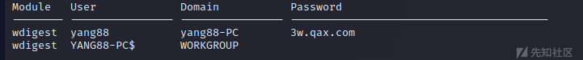
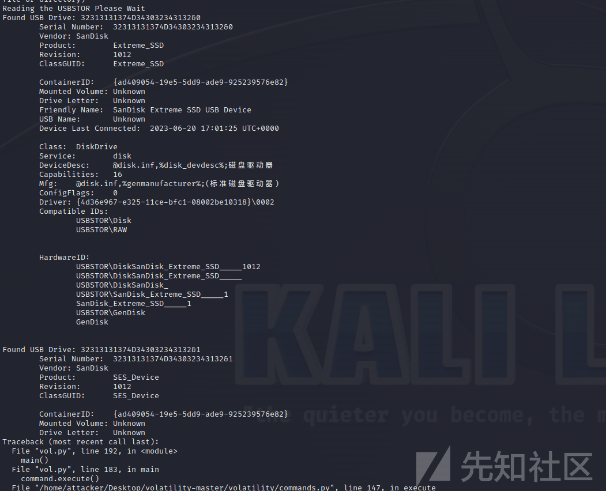
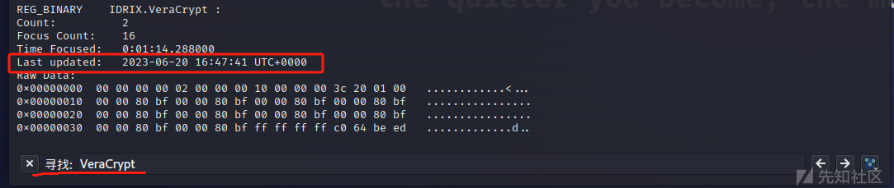
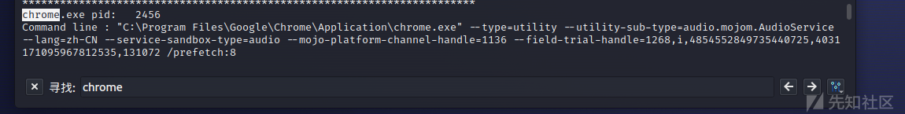

# volatility工具的学习使用 - 先知社区

volatility工具的学习使用

- - -

本篇文章主要解决volatility工具的安装出现的一系列问题，以及volatility工具命令使用

### 0x01 volatility工具的安装

```plain
git clone https://github.com/volatilityfoundation/volatility.git
cd volatility
sudo python2 setup.py install
sudo apt-get install pcregrep libpcre++-dev python2-dev -y
python2 -m pip install pycryptodome
python2 -m pip install distorm3

# 在 https://github.com/virustotal/yara/releases 下载 YARA 压缩包
tar -zxf yara-4.1.3.tar.gz
cd yara-4.1.3
sudo apt-get install automake libtool make gcc pkg-config
sudo apt-get install flex bison libssl-dev
./bootstrap.sh
./configure
make
sudo make install
sudo sh -c 'echo "/usr/local/lib" >> /etc/ld.so.conf'
sudo ldconfig
# 测试 YARA
echo "rule dummy { condition: true }" > my_first_rule
yara my_first_rule my_first_rule
# 输出 dummy my_first_rule 代表安装成功

python2 -m pip install Pillow
python2 -m pip install openpyxl
python2 -m pip install ujson

# 测试安装是否成功
cd /mnt/d/Cyber_security/ctf/misc/tool/volatility
python2 vol.py --info
# 要是显示如下信息说明安装成功
# Volatility Foundation Volatility Framework 2.6
# 
# Address Spaces
# --------------
# VistaSP0x64           - A Profile for Windows Vista SP0 x64
# ......
```

#### 1）volatility下载

源码地址：[https://github.com/volatilityfoundation/volatility](https://github.com/volatilityfoundation/volatility)

下载后解压

> unzip volatility-master.zip

#### 2）安装依赖环境（distorm3 crypto）

> pip2 install pycryptodome

#### 3）distorm3下载

源码地址：[https://github.com/vext01/distorm3](https://github.com/vext01/distorm3)

下载后解压

> unzip distorm3-master.zip

在`distorms-master`目录下进行编译

> python2 setup.py install
> 
> ```plain
> 可选插件
> Distorm3（反编译库）：pip install distorm3
> Yara（恶意软件分类工具）：pip install yara
> PyCrypto（加密工具集）：pip install pycrypto
> PIL（图片处理库）：pip install pil
> OpenPyxl（读写excel文件）：pip install openpyxl
> ujson（JSON解析）：pip install ujson
> ```

#### 4）Volatility安装

在解压后的Volatility目录下进行编译

> python2 setup.py install

### 0x02 volatility插件的安装

#### 1）下载插件

下载地址：

> ```plain
> https://github.com/ruokeqx/tool-for-CTF/tree/master/volatility_plugins
> ```
> 
> ```plain
> https://github.com/superponible/volatility-plugins
> ```

下载之后，将 .py 插件放进volatility 的 plugins 文件夹目录下

-   lastpass.py Chrome 记录的登录密码
-   usbstor.py 扫描注册表查找插入系统的 USB 设备
-   chromehistory.py 谷歌浏览器历史记录
-   firefoxhistory.py 火狐浏览器历史记录
-   sqlite\_help.py 上面两个插件的必须文件

#### 2）安装 construct 模块

> python2 -m pip install construct

参考文章：[https://blog.csdn.net/m0\_68012373/article/details/127419463](https://blog.csdn.net/m0_68012373/article/details/127419463)

### 0x03 简单命令演示

#### 1、 在分析之前，需要先**判断当前的镜像信息**，分析出是哪个操作系统 命令`imageinfo`即可获取镜像信息。

#### **2、查找计算机内用户XXX的开机密码**

> 需要使用 mimikat 插件

```plain
┌──(root㉿attacker)-[~/Desktop/volatility-master]
└─# python2 vol.py -f '/home/attacker/Desktop/memdump.mem'  --profile=Win7SP1x64 mimikatz
```

[](https://xzfile.aliyuncs.com/media/upload/picture/20231118135000-50199bd6-85d6-1.png)

#### **3、提取内存镜像中的USB设备信息**

> 需要使用 usbstor 插件

```plain
┌──(root㉿attacker)-[~/Desktop/volatility-master]
└─# python2 vol.py -f '/home/attacker/Desktop/memdump.mem'  --profile=Win7SP1x64 usbstor
```

[](https://xzfile.aliyuncs.com/media/upload/picture/20231118135025-5f0d3d46-85d6-1.png)

**4、查找用户XXX的LMHASH值**

> LMHASH值
> 
> 详情看：[https://daiker.gitbook.io/windows-protocol/ntlm-pian/4](https://daiker.gitbook.io/windows-protocol/ntlm-pian/4)

```plain
┌──(root㉿attacker)-[~/Desktop/volatility-master]
└─# python2 vol.py -f '/home/attacker/Desktop/memdump.mem'  --profile=Win7SP1x64 hashdump
```

[](https://xzfile.aliyuncs.com/media/upload/picture/20231118135044-6a47cb22-85d6-1.png)

**5、查找“XXX（以VeraCrypt为例）”最后一次更新的北京时间**

```plain
┌──(root㉿attacker)-[~/Desktop/volatility-master]
└─# python2 vol.py -f '/home/attacker/Desktop/memdump.mem'  --profile=Win7SP1x64 userassist
```

[](https://xzfile.aliyuncs.com/media/upload/picture/20231118135139-8aacdc36-85d6-1.png)

6、找出用户最后一次访问“XXX（以chrome浏览器为例）”的进程PID

```plain
┌──(root㉿attacker)-[~/Desktop/volatility-master]
└─# python2 vol.py -f '/home/attacker/Desktop/memdump.mem'  --profile=Win7SP1x64 cmdline
```

取最下面的

[](https://xzfile.aliyuncs.com/media/upload/picture/20231118135154-9401d566-85d6-1.png)

### 0x04 取证思路

#### 1）查找内存镜像架构

##### 1、判断未知内存镜像系统版本信息

> volatility -f 文件路径 imageinfo

imageinfo 用于识别操作系统、service park 和硬件体系结构（32位或64位）；可能有多个建议的配置文件，我们必须选择正确的配置文件。

或者使用命令：`kdbgscan`，获取内存操作系统。

#### 2）利用命令获取信息

##### 1、列出转储时运行的进程的详细信息；显示过程ID，该父进程ID（PPID），线程数目。把手数目，日期时间，过程开始和退出。

```plain
┌──(root㉿attacker)-[~/Desktop/volatility-master]
└─# python2 vol.py -f '/home/attacker/Desktop/memdump.mem'  --profile=Win7SP1x64 pslist/pstree/psscan
```

> pslist 无法显示隐藏/终止进程，psscan可以、  
> pstree同样是扫描进程的，但是是以进程树的形式出现的

当数据量比较多时，可以把数据**导出**再分析。

```plain
┌──(root㉿attacker)-[~/Desktop/volatility-master]
└─# python2 vol.py -f '/home/attacker/Desktop/memdump.mem'  --profile=Win7SP1x64 pslist/pstree/psscan >1.txt
```

##### 2、查看攻击者在命令提示符中键入的内容;提取内存中保留的 cmd 命令使用情况

```plain
┌──(root㉿attacker)-[~/Desktop/volatility-master]
└─# python2 vol.py -f '/home/attacker/Desktop/memdump.mem'  --profile=Win7SP1x64 cmdscan
```

cmdscan: 用来查看受害者系统上攻操作系统的最强大的命令之一，无论是否打开cmd.exe。

##### 3、扫描当前打开的文件

```plain
┌──(root㉿attacker)-[~/Desktop/volatility-master]
└─# python2 vol.py -f '/home/attacker/Desktop/memdump.mem'  --profile=Win7SP1x64 filescan
```

配合正则表达式一起使用

```plain
┌──(root㉿attacker)-[~/Desktop/volatility-master]
└─# python2 vol.py -f '/home/attacker/Desktop/memdump.mem'  --profile=Win7SP1x64 filescan | grep Downloads
#即可找下载的文件夹，一般windows下载的内都放在 Download 文件夹中
```

##### 4、显示一个进程装载动态链接库的信息，其显示列表主要包括加载的动态链接库文件的基地址、文件大小以及文件所在路径

```plain
┌──(root㉿attacker)-[~/Desktop/volatility-master]
└─# python2 vol.py -f '/home/attacker/Desktop/memdump.mem'  --profile=Win7SP1x64 dlllist
```

当数据量比较多时，可以把数据**导出**再分析。

##### 5、查看缓存在内存的注册表

```plain
┌──(root㉿attacker)-[~/Desktop/volatility-master]
└─# python2 vol.py -f '/home/attacker/Desktop/memdump.mem'  --profile= Win7SP1x64 hivelist
```

**hivelist**：既包括虚拟地址，也包括物理地址

常见注册表的值：SOFTWARE、SYSTEM、ntuser.date，SAM（账户密码表）可以导出注册表，放到注册表解析工具（WRR），进行查看分析

**usb连接信息**：在注册表enum项下，system:controlSet001\\enum\\usbstor\\disk$ven\_segeate&prod\_expansive----\\NAA6D---

> [http://www.doc88.com/p-9107655008710.html?r=1](http://www.doc88.com/p-9107655008710.html?r=1)

注意：在取证大师中，如果出现`usbstor`则可以证明连接过U盘，而如何只有`usb huB`只能说明连接过USB设备。

打印机在注册表的位置：HKEY\_LOCAL\_MACHINE\\SOFTWARE\\Microsoft\\Print\\Components

##### 6、获取内存中的系统密码

```plain
┌──(root㉿attacker)-[~/Desktop/volatility-master]
└─# python2 vol.py -f '/home/attacker/Desktop/memdump.mem'  --profile=Win7SP1x64 hashdump
```

对于hash结果，Win7之后的，主要看`:`后面的值

利用”www.cmd5.com“在线解密，或者使用”mimikatz“等工具解密

##### 7、提取出内存中记录的 当时正在运行的程序有哪些，运行过多少次，最后一次运行的时间等信息

```plain
┌──(root㉿attacker)-[~/Desktop/volatility-master]
└─# python2 vol.py -f '/home/attacker/Desktop/memdump.mem'  --profile=Win7SP1x64 userassist
```

##### 8、查看SID

```plain
┌──(root㉿attacker)-[~/Desktop/volatility-master]
└─# python2 vol.py -f '/home/attacker/Desktop/memdump.mem'  --profile=Win7SP1x64 getsids
```

##### 9、寻找可能注入到各种进程中的恶意软件

```plain
┌──(root㉿attacker)-[~/Desktop/volatility-master]
└─# python2 vol.py -f '/home/attacker/Desktop/memdump.mem'  --profile=Win7SP1x64 malfind
```

使用malfind时也可以使用 -p 直接指定进程

```plain
┌──(root㉿attacker)-[~/Desktop/volatility-master]
└─# python2 vol.py -f '/home/attacker/Desktop/memdump.mem'  --profile=Win7SP1x64 malfind -p 608
```

##### 10、获取SAM表中的用户

```plain
┌──(root㉿attacker)-[~/Desktop/volatility-master]
└─# python2 vol.py -f '/home/attacker/Desktop/memdump.mem'  --profile=Win7SP1x64 printkey -K "SAM\Domains\Account\Users\Names"
```

导出可以利用hashdump命令。

```plain
┌──(root㉿attacker)-[~/Desktop/volatility-master]
└─# python2 vol.py -f '/home/attacker/Desktop/memdump.mem'  --profile=Win7SP1x64 hashdump -y 0xe1035b60（注册表system的virtual地址） -s 0x16aan60 （SAM的virtual地址）
```

##### 11、查看的文件访问的记录

```plain
┌──(root㉿attacker)-[~/Desktop/volatility-master]
└─# python2 vol.py -f '/home/attacker/Desktop/memdump.mem'  --profile=Win7SP1x64 mftparser
```

##### 12、查看访问记录

```plain
┌──(root㉿attacker)-[~/Desktop/volatility-master]
└─# python2 vol.py -f '/home/attacker/Desktop/memdump.mem'  --profile=Win7SP1x64 timeliner
```

##### 13、查看windows的服务

```plain
┌──(root㉿attacker)-[~/Desktop/volatility-master]
└─# python2 vol.py -f '/home/attacker/Desktop/memdump.mem'  --profile=Win7SP1x64 svcscan
```

##### 14、查看被隐藏的进程，如某些隐藏的病毒文件

```plain
┌──(root㉿attacker)-[~/Desktop/volatility-master]
└─# python2 vol.py -f '/home/attacker/Desktop/memdump.mem'  --profile=Win7SP1x64 psxview
```

##### 15、mendump：将内存中的某个进程保存出来

```plain
┌──(root㉿attacker)-[~/Desktop/volatility-master]
└─# python2 vol.py -f '/home/attacker/Desktop/memdump.mem'  --profile=Win7SP1x64 mem -p 1180 -D E:\111
```

##### 16、导出提取内存中的注表信息

```plain
┌──(root㉿attacker)-[~/Desktop/volatility-master]
└─# python2 vol.py -f '/home/attacker/Desktop/memdump.mem'  --profile=Win7SP1x64 dumpregistry --dump-dir=D:\text\
```

dumpregistry --dump-dir = 提取内存注册表的目录路径（text先创建）

##### 17、解析MFT记录、导出MFT记录

```plain
┌──(root㉿attacker)-[~/Desktop/volatility-master]
└─# python2 vol.py -f '/home/attacker/Desktop/memdump.mem'  --profile=Win7SP1x64 mftparser
```

导出命令：

```plain
┌──(root㉿attacker)-[~/Desktop/volatility-master]
└─# python2 vol.py -f '/home/attacker/Desktop/memdump.mem'  --profile=Win7SP1x64 mftparser --output-file=mftverbose.txt -D mftoutput
```

##### 18、 获取TrueCrypt秘钥信息

```plain
┌──(root㉿attacker)-[~/Desktop/volatility-master]
└─# python2 vol.py -f '/home/attacker/Desktop/memdump.mem'  --profile=Win7SP1x64 truecryptmaster
```

##### 19、获取TrueCrypt密码信息

```plain
┌──(root㉿attacker)-[~/Desktop/volatility-master]
└─# python2 vol.py -f '/home/attacker/Desktop/memdump.mem'  --profile=Win7SP1x64 truecryptpassphrase
```

##### 20、查看远程地址与本地地址建立TCP连接记录

```plain
┌──(root㉿attacker)-[~/Desktop/volatility-master]
└─# python2 vol.py -f '/home/attacker/Desktop/memdump.mem'  --profile=Win7SP1x64 netscan
```

##### 21、procdump：保存进程所所对应的软件

```plain
┌──(root㉿attacker)-[~/Desktop/volatility-master]
└─# python2 vol.py -f '/home/attacker/Desktop/memdump.mem'  --profile=Win7SP1x64 --kdbg=0x82947c28 --dump-dir="文件保存路径" --pid=3048（进程号）
```
